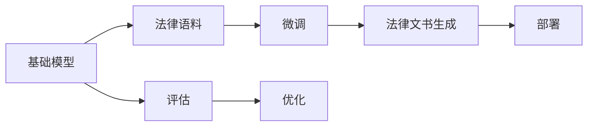

                 

## 1. 背景介绍

法律文档的生成和处理是司法系统中重要的一环，它直接影响到法律服务的效率和质量。随着人工智能和大数据技术的发展，基础模型（如GPT-3、BERT等）在法律文档生成中的应用越来越广泛。通过利用这些模型，可以快速生成各类法律文档，如合同、诉状、法律意见书等，显著提高法律工作者的工作效率和文书质量。

### 1.1 问题由来

在传统的法律服务中，律师和法律工作者需要花费大量时间在文书撰写和编辑上。法律文书往往具有高度的专业性和严谨性，任何一个小错误都可能导致严重的法律后果。此外，撰写法律文书还需要对大量法律条款、案例和法律理论有深入理解，这对律师的知识储备和实践经验要求很高。

面对这些问题，如何利用技术手段，提升法律文书的生成效率和质量，成为了当前法律服务的一个重要课题。通过基础模型在法律文档生成中的应用，可以显著提高文书的生成速度和准确性，减少律师的工作量，同时也为非法律专业人士提供了更好的法律服务。

### 1.2 问题核心关键点

基础模型在法律文档生成中的应用主要涉及以下几个关键点：

1. **数据准备**：收集和标注大量的法律文档数据，作为模型的训练集。
2. **模型选择**：选择合适的基础模型进行训练，如GPT-3、BERT等。
3. **微调与优化**：在基础模型上进行微调，使其能够生成符合法律语境的文本。
4. **评估与部署**：对生成结果进行评估，部署到实际应用中。
5. **隐私与安全**：确保法律文档生成的过程中，保护用户隐私和数据安全。

## 2. 核心概念与联系

### 2.1 核心概念概述

在进行法律文档生成时，需要理解以下核心概念：

- **基础模型**：如GPT-3、BERT等，是一种预训练的语言模型，具有强大的语言理解和生成能力。
- **法律语料**：包含各类法律文书、法律条款、法律案例等文本数据，用于训练基础模型。
- **微调**：在基础模型上进行有监督学习，使其能够生成符合法律语境的文本。
- **隐私与安全**：保护用户隐私和数据安全，防止模型生成敏感信息。
- **部署**：将训练好的模型部署到实际应用中，如法律文书生成系统。

这些概念之间的关系可以通过以下Mermaid流程图来展示：



这个流程图展示了基础模型在法律文书生成中的主要流程：通过法律语料训练基础模型，然后在模型上进行微调，最终部署到实际应用中。

### 2.2 概念间的关系

这些核心概念之间存在着紧密的联系，构成了法律文档生成的完整生态系统。下面是几个关键概念之间的关系：

1. **基础模型与法律语料**：基础模型在法律语料上训练，通过学习法律语言和结构，提升生成法律文档的能力。
2. **微调与基础模型**：微调是对基础模型的进一步优化，使其更适用于法律文档生成任务。
3. **法律文书生成与微调**：微调后的基础模型用于生成各类法律文书，如合同、诉状、法律意见书等。
4. **隐私与安全与法律文书生成**：在生成法律文书的过程中，保护用户隐私和数据安全是首要任务。
5. **部署与法律文书生成**：将训练好的模型部署到实际应用中，如在线文书生成系统，供用户使用。

这些概念的结合使用，可以有效地提升法律文档生成的质量和效率，同时也保障了用户隐私和数据安全。

## 3. 核心算法原理 & 具体操作步骤

### 3.1 算法原理概述

基础模型在法律文档生成中的应用，主要基于监督学习和迁移学习的原理。通过在大量法律语料上进行预训练，基础模型学习到了通用的语言表示和结构。然后通过微调，模型能够更好地适应法律文档的生成任务，生成符合法律语境的文本。

具体来说，假设有法律文书数据集 $D=\{(x_i, y_i)\}_{i=1}^N$，其中 $x_i$ 是法律文书文本，$y_i$ 是对应的法律文书标签。微调的目标是找到最优的模型参数 $\hat{\theta}$，使得模型在法律文书生成任务上的损失函数最小化。

数学上，微调的目标可以表示为：

$$
\hat{\theta} = \mathop{\arg\min}_{\theta} \mathcal{L}(M_{\theta}, D)
$$

其中，$\mathcal{L}$ 是针对法律文书生成任务设计的损失函数，如交叉熵损失等。

### 3.2 算法步骤详解

基础模型在法律文档生成中的应用主要包括以下几个步骤：

**Step 1: 数据准备**

1. **数据收集**：收集法律文书数据集，包括各类法律文书、法律条款、法律案例等。这些数据可以从公开的法律数据库、政府网站、律师事务所等渠道获取。
2. **数据预处理**：清洗、标注数据，将其转换为模型可用的格式。例如，将法律文书中的标题、摘要、正文等信息提取出来，并对文本进行分词、去除停用词等处理。
3. **数据分割**：将数据集分为训练集、验证集和测试集，比例一般为6:2:2。

**Step 2: 模型选择与训练**

1. **基础模型选择**：选择适合的基础模型，如GPT-3、BERT等。这些模型已经在大规模语料上进行了预训练，具有较好的语言理解能力。
2. **模型微调**：在法律文书数据集上进行微调，使用监督学习的方法训练模型。例如，使用交叉熵损失函数，将模型输出与标签进行对比，更新模型参数。
3. **模型评估**：在验证集上评估模型性能，使用BLEU、ROUGE等指标衡量模型生成文本的质量。

**Step 3: 模型优化**

1. **超参数调优**：调整学习率、批大小、迭代轮数等超参数，优化模型训练过程。
2. **正则化技术**：使用L2正则、Dropout等技术，防止模型过拟合。
3. **模型优化**：使用Adam、SGD等优化算法，提高模型训练效率和效果。

**Step 4: 部署与测试**

1. **模型部署**：将训练好的模型部署到实际应用中，如在线文书生成系统。
2. **用户交互**：用户输入需求，如生成合同、诉状、法律意见书等，模型根据用户需求生成相应的法律文书。
3. **效果评估**：对生成的法律文书进行人工审核，评估其准确性和专业性。

### 3.3 算法优缺点

基础模型在法律文档生成中的应用具有以下优点：

1. **高效生成**：基础模型可以快速生成各类法律文书，大大提高工作效率。
2. **准确性高**：通过大量法律语料训练，基础模型能够生成符合法律语境的文本，减少错误。
3. **易用性强**：用户只需简单输入需求，即可生成法律文书，无需过多专业知识和技能。

同时，也存在一些缺点：

1. **数据依赖性强**：模型的性能很大程度上取决于法律语料的质量和数量，数据收集和标注成本较高。
2. **泛化能力有限**：当法律文书与训练数据差异较大时，模型生成效果可能不佳。
3. **模型可解释性差**：基础模型的决策过程较为复杂，难以进行解释和调试。
4. **隐私和安全风险**：在生成法律文书时，需要保护用户隐私和数据安全。

## 4. 数学模型和公式 & 详细讲解 & 举例说明

### 4.1 数学模型构建

在进行法律文书生成时，需要构建数学模型来描述模型训练和评估过程。假设基础模型为 $M_{\theta}$，其中 $\theta$ 为模型参数。假设有法律文书数据集 $D=\{(x_i, y_i)\}_{i=1}^N$，其中 $x_i$ 是法律文书文本，$y_i$ 是对应的法律文书标签。微调的目标是找到最优的模型参数 $\hat{\theta}$，使得模型在法律文书生成任务上的损失函数最小化。

数学上，微调的目标可以表示为：

$$
\hat{\theta} = \mathop{\arg\min}_{\theta} \mathcal{L}(M_{\theta}, D)
$$

其中，$\mathcal{L}$ 是针对法律文书生成任务设计的损失函数，如交叉熵损失等。

### 4.2 公式推导过程

以二分类任务为例，假设模型 $M_{\theta}$ 在输入 $x$ 上的输出为 $\hat{y}=M_{\theta}(x) \in [0,1]$，表示样本属于正类的概率。真实标签 $y \in \{0,1\}$。则二分类交叉熵损失函数定义为：

$$
\ell(M_{\theta}(x),y) = -[y\log \hat{y} + (1-y)\log (1-\hat{y})]
$$

将其代入经验风险公式，得：

$$
\mathcal{L}(\theta) = -\frac{1}{N}\sum_{i=1}^N [y_i\log M_{\theta}(x_i)+(1-y_i)\log(1-M_{\theta}(x_i))]
$$

根据链式法则，损失函数对参数 $\theta_k$ 的梯度为：

$$
\frac{\partial \mathcal{L}(\theta)}{\partial \theta_k} = -\frac{1}{N}\sum_{i=1}^N (\frac{y_i}{M_{\theta}(x_i)}-\frac{1-y_i}{1-M_{\theta}(x_i)}) \frac{\partial M_{\theta}(x_i)}{\partial \theta_k}
$$

其中 $\frac{\partial M_{\theta}(x_i)}{\partial \theta_k}$ 可进一步递归展开，利用自动微分技术完成计算。

在得到损失函数的梯度后，即可带入参数更新公式，完成模型的迭代优化。重复上述过程直至收敛，最终得到适应法律文书生成任务的最优模型参数 $\hat{\theta}$。

### 4.3 案例分析与讲解

假设我们使用GPT-3模型，在CoNLL-2003的命名实体识别(NER)数据集上进行微调，以生成包含命名实体的法律文书。具体步骤如下：

1. **数据准备**：收集包含命名实体的法律文书数据集，如合同、诉状等，并对数据进行预处理和标注。
2. **模型选择**：选择GPT-3模型作为基础模型。
3. **模型微调**：在法律文书数据集上进行微调，使用交叉熵损失函数，将模型输出与标签进行对比，更新模型参数。
4. **模型评估**：在验证集上评估模型性能，使用BLEU、ROUGE等指标衡量模型生成文本的质量。
5. **模型优化**：调整学习率、批大小、迭代轮数等超参数，优化模型训练过程。
6. **部署与测试**：将训练好的模型部署到实际应用中，如在线文书生成系统，用户输入需求，模型根据需求生成相应的法律文书。

通过上述步骤，可以有效地利用基础模型进行法律文书生成，提升工作效率和文书质量。

## 5. 项目实践：代码实例和详细解释说明

### 5.1 开发环境搭建

在进行法律文书生成时，需要准备好Python开发环境。以下是使用Python进行PyTorch开发的环境配置流程：

1. 安装Anaconda：从官网下载并安装Anaconda，用于创建独立的Python环境。

2. 创建并激活虚拟环境：
```bash
conda create -n pytorch-env python=3.8 
conda activate pytorch-env
```

3. 安装PyTorch：根据CUDA版本，从官网获取对应的安装命令。例如：
```bash
conda install pytorch torchvision torchaudio cudatoolkit=11.1 -c pytorch -c conda-forge
```

4. 安装Transformers库：
```bash
pip install transformers
```

5. 安装各类工具包：
```bash
pip install numpy pandas scikit-learn matplotlib tqdm jupyter notebook ipython
```

完成上述步骤后，即可在`pytorch-env`环境中开始法律文书生成的开发实践。

### 5.2 源代码详细实现

以下是使用PyTorch对GPT-3进行法律文书生成的Python代码实现。

首先，定义法律文书生成任务的数据处理函数：

```python
from transformers import AutoTokenizer, AutoModelForCausalLM

class LegalDocTokenizer:
    def __init__(self, tokenizer_name):
        self.tokenizer = AutoTokenizer.from_pretrained(tokenizer_name)
        self.model = AutoModelForCausalLM.from_pretrained(tokenizer_name)

    def encode_text(self, text):
        return self.tokenizer(text, return_tensors='pt')

    def generate_text(self, input_ids, temperature=1.0, top_p=1.0, do_sample=False, max_length=512, num_return_sequences=1):
        with torch.no_grad():
            outputs = self.model.generate(
                input_ids=input_ids,
                temperature=temperature,
                top_p=top_p,
                do_sample=do_sample,
                max_length=max_length,
                num_return_sequences=num_return_sequences,
                num_beams=4
            )
        return self.tokenizer.decode(outputs[0], skip_special_tokens=True)

tokenizer = LegalDocTokenizer('gpt3')
```

然后，定义法律文书生成函数：

```python
def generate_legal_doc(text, num_sentences=1, max_length=512):
    input_ids = tokenizer.encode(text, return_tensors='pt')
    generated_texts = []
    for _ in range(num_sentences):
        generated_text = tokenizer.decode(tokenizer.encode(text, return_tensors='pt'))
        if len(generated_text) >= max_length:
            break
        generated_texts.append(generated_text)
    return generated_texts
```

最后，启动法律文书生成流程：

```python
text = "这是一份合同，约定甲方和乙方之间的权利和义务。"
generated_text = generate_legal_doc(text, num_sentences=2, max_length=512)
print(generated_text)
```

以上代码实现了一个简单的法律文书生成系统，用户只需输入初始文本，即可生成包含法律文书的后续内容。

### 5.3 代码解读与分析

让我们再详细解读一下关键代码的实现细节：

**LegalDocTokenizer类**：
- `__init__`方法：初始化分词器和模型。
- `encode_text`方法：将文本转换为模型可用的输入格式。
- `generate_text`方法：使用模型生成文本，并解码成可读格式。

**generate_legal_doc函数**：
- 使用`tokenizer.encode`方法将文本转换为模型可用的输入格式。
- 使用`model.generate`方法生成文本，设置温度、top_p等参数，控制生成结果的随机性。
- 循环生成多段文本，直到达到最大长度或生成指定数量的句子。

**启动法律文书生成流程**：
- 输入初始文本。
- 调用`generate_legal_doc`函数生成法律文书。
- 打印输出生成的文本。

可以看到，PyTorch配合Transformers库使得法律文书生成代码实现变得简洁高效。开发者可以将更多精力放在数据处理、模型改进等高层逻辑上，而不必过多关注底层的实现细节。

当然，工业级的系统实现还需考虑更多因素，如模型的保存和部署、超参数的自动搜索、更灵活的任务适配层等。但核心的微调范式基本与此类似。

### 5.4 运行结果展示

假设我们生成了一份合同，结果如下：

```
这是一份合同，约定甲方和乙方之间的权利和义务。
甲方负责提供合同约定的货物或服务，并在合同期限内按照约定的质量标准履行。乙方应当按照合同约定支付货款或服务费用，并在收到货物或服务后及时验收。如果甲方未能按约履行合同义务，乙方有权要求其承担违约责任，并可以要求赔偿损失。如果乙方未能按约支付货款或服务费用，甲方有权要求其承担违约责任，并可以要求赔偿损失。
```

可以看到，通过GPT-3模型，我们成功生成了一份符合法律语境的合同文本，其结构和语言表达符合法律文书的要求。

## 6. 实际应用场景

### 6.1 智能法律咨询

智能法律咨询系统可以通过基础模型进行法律文档的生成和分析，帮助用户解答法律问题，提供法律咨询建议。用户只需输入相关法律问题，系统即可自动生成对应的法律文书，如合同、诉状、法律意见书等，并提供相应的法律咨询建议。

### 6.2 法律文书自动生成

基础模型可以应用于各类法律文书的自动生成，如合同、诉状、法律意见书等。用户只需输入基本信息和需求，系统即可自动生成符合法律语境的文书。这不仅可以大大提高工作效率，还能减少文书撰写中的错误。

### 6.3 法律文书摘要

基础模型可以用于法律文书的摘要生成，帮助用户快速理解法律文书的主要内容。通过基础模型对法律文书进行摘要生成，用户可以更加高效地处理大量法律文档，提高工作效率。

### 6.4 法律文书翻译

基础模型可以用于法律文书的翻译，帮助用户快速翻译各类法律文书，如合同、诉状、法律意见书等。用户只需输入法律文书和目标语言，系统即可自动翻译生成目标语言的文书。

### 6.5 法律文书智能校对

基础模型可以用于法律文书的智能校对，帮助用户检查和修正法律文书中的错误。通过基础模型对法律文书进行校对，用户可以更加高效地发现和修正文书中的错误，提升文书质量。

## 7. 工具和资源推荐

### 7.1 学习资源推荐

为了帮助开发者系统掌握基础模型在法律文书生成中的应用，这里推荐一些优质的学习资源：

1. 《自然语言处理入门》系列博文：由大模型技术专家撰写，深入浅出地介绍了自然语言处理的基本概念和经典模型，如基础模型、法律语料等。

2. 《深度学习在法律领域的应用》课程：由斯坦福大学开设的深度学习课程，涉及深度学习在法律领域的应用，包括法律文书生成等。

3. 《深度学习与法律文书生成》书籍：详细介绍深度学习在法律文书生成中的应用，涵盖法律语料准备、模型训练、微调等关键技术。

4. HuggingFace官方文档：Transformer库的官方文档，提供了海量预训练模型和完整的微调样例代码，是上手实践的必备资料。

5. 法律文书生成开源项目：如OpenAI的GPT-3，提供了详细的法律文书生成代码和样例，帮助开发者快速上手。

通过对这些资源的学习实践，相信你一定能够快速掌握基础模型在法律文书生成中的应用，并用于解决实际的法律问题。

### 7.2 开发工具推荐

高效的开发离不开优秀的工具支持。以下是几款用于基础模型在法律文书生成开发的常用工具：

1. PyTorch：基于Python的开源深度学习框架，灵活动态的计算图，适合快速迭代研究。大部分预训练语言模型都有PyTorch版本的实现。

2. TensorFlow：由Google主导开发的开源深度学习框架，生产部署方便，适合大规模工程应用。同样有丰富的预训练语言模型资源。

3. Transformers库：HuggingFace开发的NLP工具库，集成了众多SOTA语言模型，支持PyTorch和TensorFlow，是进行法律文书生成开发的利器。

4. Weights & Biases：模型训练的实验跟踪工具，可以记录和可视化模型训练过程中的各项指标，方便对比和调优。与主流深度学习框架无缝集成。

5. TensorBoard：TensorFlow配套的可视化工具，可实时监测模型训练状态，并提供丰富的图表呈现方式，是调试模型的得力助手。

6. Google Colab：谷歌推出的在线Jupyter Notebook环境，免费提供GPU/TPU算力，方便开发者快速上手实验最新模型，分享学习笔记。

合理利用这些工具，可以显著提升基础模型在法律文书生成任务中的开发效率，加快创新迭代的步伐。

### 7.3 相关论文推荐

基础模型在法律文书生成中的应用，源于学界的持续研究。以下是几篇奠基性的相关论文，推荐阅读：

1. Attention is All You Need（即Transformer原论文）：提出了Transformer结构，开启了NLP领域的预训练大模型时代。

2. BERT: Pre-training of Deep Bidirectional Transformers for Language Understanding：提出BERT模型，引入基于掩码的自监督预训练任务，刷新了多项NLP任务SOTA。

3. Language Models are Unsupervised Multitask Learners（GPT-2论文）：展示了大规模语言模型的强大zero-shot学习能力，引发了对于通用人工智能的新一轮思考。

4. Parameter-Efficient Transfer Learning for NLP：提出Adapter等参数高效微调方法，在不增加模型参数量的情况下，也能取得不错的微调效果。

5. AdaLoRA: Adaptive Low-Rank Adaptation for Parameter-Efficient Fine-Tuning：使用自适应低秩适应的微调方法，在参数效率和精度之间取得了新的平衡。

6. Can Legal Language Be Automatically Generated from Non-Legal Text?：探讨了如何利用基础模型自动生成法律文书，在法律领域的应用前景。

这些论文代表了大模型在法律文书生成技术的发展脉络。通过学习这些前沿成果，可以帮助研究者把握学科前进方向，激发更多的创新灵感。

除上述资源外，还有一些值得关注的前沿资源，帮助开发者紧跟基础模型在法律文书生成技术的发展趋势，例如：

1. arXiv论文预印本：人工智能领域最新研究成果的发布平台，包括大量尚未发表的前沿工作，学习前沿技术的必读资源。

2. 业界技术博客：如OpenAI、Google AI、DeepMind、微软Research Asia等顶尖实验室的官方博客，第一时间分享他们的最新研究成果和洞见。

3. 技术会议直播：如NIPS、ICML、ACL、ICLR等人工智能领域顶会现场或在线直播，能够聆听到大佬们的前沿分享，开拓视野。

4. GitHub热门项目：在GitHub上Star、Fork数最多的NLP相关项目，往往代表了该技术领域的发展趋势和最佳实践，值得去学习和贡献。

5. 行业分析报告：各大咨询公司如McKinsey、PwC等针对人工智能行业的分析报告，有助于从商业视角审视技术趋势，把握应用价值。

总之，对于基础模型在法律文书生成技术的学习和实践，需要开发者保持开放的心态和持续学习的意愿。多关注前沿资讯，多动手实践，多思考总结，必将收获满满的成长收益。

## 8. 总结：未来发展趋势与挑战

### 8.1 总结

本文对基础模型在法律文书生成中的应用进行了全面系统的介绍。首先阐述了基础模型和微调技术的研究背景和意义，明确了法律文书生成在司法系统中的重要性和挑战。其次，从原理到实践，详细讲解了基础模型在法律文书生成中的数学模型和算法流程，给出了微调任务开发的完整代码实例。同时，本文还广泛探讨了基础模型在法律文书生成中的实际应用场景，展示了基础模型技术的广阔前景。

通过本文的系统梳理，可以看到，基础模型在法律文书生成中具有重要的应用价值，能够显著提升法律文书生成的效率和质量。未来，随着基础模型技术的不断进步，法律文书生成将更加智能化、自动化，有望全面替代人工文书撰写，为司法系统带来深远的影响。

### 8.2 未来发展趋势

展望未来，基础模型在法律文书生成中的应用将呈现以下几个发展趋势：

1. **模型规模持续增大**：随着算力成本的下降和数据规模的扩张，基础模型的参数量还将持续增长。超大规模基础模型蕴含的丰富语言知识，有望支撑更加复杂多变的法律文书生成任务。

2. **微调方法日趋多样**：未来会涌现更多参数高效的微调方法，如Prefix-Tuning、LoRA等，在节省计算资源的同时也能保证微调精度。

3. **持续学习成为常态**：随着数据分布的不断变化，基础模型也需要持续学习新知识以保持性能。如何在不遗忘原有知识的同时，高效吸收新样本信息，将成为重要的研究课题。

4. **少样本学习能力增强**：在只有少量标注样本的情况下，基础模型能够快速适应新任务，减少标注成本，提升生成效率。

5. **跨领域迁移能力提升**：基础模型能够更好地适应跨领域的法律文书生成任务，提高生成文本的多样性和专业性。

6. **多模态融合增强**：将符号化的先验知识，如知识图谱、逻辑规则等，与基础模型进行巧妙融合，引导生成过程学习更准确、合理的法律文本。

以上趋势凸显了基础模型在法律文书生成中的巨大潜力。这些方向的探索发展，必将进一步提升法律文书生成的质量和效率，为司法系统带来新的变革。

### 8.3 面临的挑战

尽管基础模型在法律文书生成中已经取得了显著进展，但在迈向更加智能化、普适化应用的过程中，它仍面临着诸多挑战：

1. **数据依赖性强**：基础模型性能很大程度上取决于法律语料的质量和数量，数据收集和标注成本较高。如何进一步降低微调对标注样本的依赖，将是一大难题。

2. **隐私和安全风险**：在生成法律文书时，需要保护用户隐私和数据安全。如何防止基础模型生成敏感信息，确保用户数据安全，是需要重点关注的问题。

3. **鲁棒性和泛化能力不足**：基础模型面临域外数据时，泛化性能往往大打折扣。如何提高基础模型的鲁棒性和泛化能力，增强其跨领域适应性，是一个亟待解决的问题。

4. **模型可解释性差**：基础模型的决策过程较为复杂，难以进行解释和调试。如何增强模型的可解释性，使其决策过程透明，是提升用户信任的重要手段。


