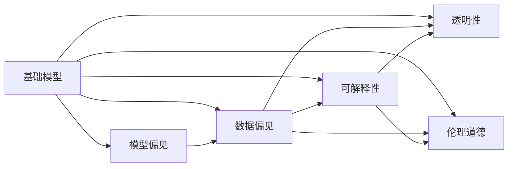
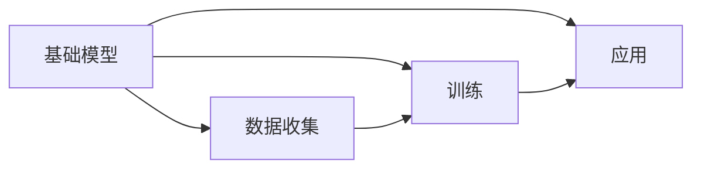
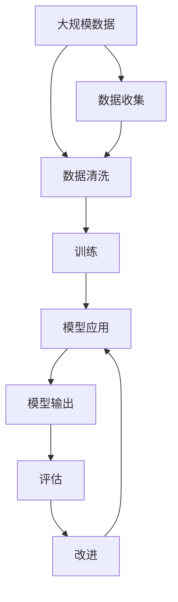

                 

# 基础模型的公平与伦理问题

> 关键词：基础模型,公平性,伦理问题,模型偏见,数据偏见,可解释性

## 1. 背景介绍

### 1.1 问题由来
随着深度学习和大数据技术的发展，基于大规模数据训练的基础模型在多个领域取得了显著成果，极大地提升了各种算法的性能。然而，在实际应用中，这些模型往往隐含着各种偏见和歧视，对特定群体不公平。例如，在面部识别、招聘筛选、信用评估等场景中，模型输出可能因为训练数据中的偏见而导致对某些人群的不公平对待。这些问题不仅损害了模型的公正性，还可能引发严重的社会问题，甚至触及伦理道德底线。

### 1.2 问题核心关键点
基础模型中的公平与伦理问题主要体现在以下几个方面：

- **模型偏见**：由于训练数据的不平衡、样本偏差等因素，模型可能对某些群体存在明显的歧视，导致预测结果不公平。
- **数据偏见**：训练数据中可能存在系统性的错误或偏见，这些偏见通过模型传递到输出，进而影响模型的决策。
- **可解释性**：基础模型的决策过程往往是“黑箱”的，难以解释其内部的工作机制，难以发现和纠正模型中的偏见和错误。
- **透明性**：模型决策过程的透明性不足，难以进行公正的审查和监督，增加了偏见和错误的风险。
- **伦理道德**：在敏感领域（如医疗、司法）的应用中，模型输出的错误可能导致严重后果，引发伦理道德问题。

这些问题如果不能得到有效解决，将严重限制基础模型在实际应用中的推广和普及，甚至可能引发社会不满和法律纠纷。因此，如何提升模型的公平性和伦理水平，成为一个亟待解决的重大课题。

## 2. 核心概念与联系

### 2.1 核心概念概述

为了更好地理解基础模型中的公平与伦理问题，本节将介绍几个核心概念：

- **基础模型**：基于大规模数据训练的深度学习模型，如卷积神经网络(CNN)、循环神经网络(RNN)、Transformer等。
- **模型偏见**：模型在训练和应用过程中对某些群体或属性的不公平对待。
- **数据偏见**：训练数据中存在的系统性错误或偏见，可能导致模型输出对特定群体的不公平。
- **可解释性**：模型输出和决策过程的可解释性，有助于发现和纠正模型中的偏见和错误。
- **透明性**：模型决策过程的透明度，有利于公正审查和监督。
- **伦理道德**：模型应用的伦理规范和道德标准，保障模型在敏感领域的应用安全。

这些核心概念之间的关系可以通过以下Mermaid流程图来展示：



这个流程图展示了大语言模型的核心概念及其之间的关系：

1. 基础模型在训练和应用过程中可能存在模型偏见。
2. 模型偏见可能由数据偏见引起。
3. 可解释性和透明性有助于发现和纠正模型偏见。
4. 伦理道德规范则限制模型在敏感领域的应用。

这些概念共同构成了基础模型的公平性和伦理性的基础框架，对于设计和使用基础模型至关重要。

### 2.2 概念间的关系

这些核心概念之间存在着紧密的联系，形成了基础模型的公平性和伦理性的完整生态系统。下面通过几个Mermaid流程图来展示这些概念之间的关系。

#### 2.2.1 基础模型的学习范式



这个流程图展示了基础模型的学习流程，包括数据收集、训练和应用三个关键阶段。在实际应用中，这些阶段可能会引发不同的公平性和伦理问题，需要针对性地解决。

#### 2.2.2 模型偏见与数据偏见的关系


这个流程图展示了模型偏见和数据偏见之间的双向影响关系。数据偏见可能导致模型偏见，而模型偏见也可能进一步放大数据偏见的影响。

#### 2.2.3 可解释性与透明性的联系


这个流程图展示了可解释性和透明性之间的相互促进关系。提高模型的可解释性，有助于增加其透明性；而提高透明性，则有助于发现和解释模型中的偏见和错误。

#### 2.2.4 伦理道德的约束


这个流程图展示了伦理道德对模型应用的约束关系。模型的应用必须在伦理道德规范下进行，以保障其安全性和公正性。

### 2.3 核心概念的整体架构

最后，我们用一个综合的流程图来展示这些核心概念在大语言模型公平性和伦理性的整体架构：



这个综合流程图展示了从数据收集到模型改进的全过程，各个阶段都可能引发公平性和伦理问题，需要通过不断优化来解决。

## 3. 核心算法原理 & 具体操作步骤
### 3.1 算法原理概述

基础模型的公平与伦理问题主要涉及以下几个核心算法原理：

- **公平性算法**：通过修改训练过程或模型结构，减少模型对特定群体的偏见。
- **偏见检测与修正**：利用统计方法或模型分析，检测模型中的偏见，并采取措施进行修正。
- **可解释性算法**：通过提高模型的可解释性，增加透明性，便于审查和监督。
- **伦理道德约束**：在模型设计和应用中，遵守伦理道德规范，保障模型在敏感领域的应用安全。

这些算法原理可以综合应用于基础模型的各个阶段，以提升其公平性和伦理水平。

### 3.2 算法步骤详解

为了解决基础模型中的公平与伦理问题，可以采用以下步骤：

1. **数据收集与预处理**：收集高质量、多样化的数据，并清洗去除偏见数据，确保数据集的代表性和公正性。
2. **模型训练**：在训练过程中，可以采用公平性算法，如对抗训练、重加权等方法，减少模型对特定群体的偏见。
3. **偏见检测与修正**：利用偏见检测算法，如敏感性分析、样本不平衡分析等，检测模型中的偏见，并采取修正措施，如重新采样、阈值调整等。
4. **模型评估与改进**：在模型应用过程中，通过评估算法，如均方误差、精度、召回率等，定期检查模型性能，发现和纠正偏见。
5. **可解释性分析**：使用可解释性算法，如特征重要性分析、解释性模型等，增加模型的透明性，便于审查和监督。
6. **伦理道德审查**：在模型设计和应用中，遵守伦理道德规范，确保模型在敏感领域的应用安全，如进行隐私保护、敏感数据脱敏等。

通过这些步骤，可以有效提升基础模型的公平性和伦理水平，确保其在实际应用中的公正性和安全性。

### 3.3 算法优缺点

基础模型的公平与伦理问题解决算法具有以下优点：

- **改进模型性能**：通过检测和修正偏见，提高模型的公正性和公平性，进而提升整体性能。
- **提升透明性**：通过可解释性算法，增加模型的透明性，便于审查和监督。
- **保障伦理道德**：在模型设计和应用中，遵守伦理道德规范，保障模型在敏感领域的应用安全。

但同时，这些算法也存在一定的局限性：

- **计算复杂度高**：偏见检测和修正可能涉及大量数据处理和模型重训练，计算复杂度高。
- **数据依赖性强**：依赖高质量、多样化的数据集，数据偏见问题难以彻底解决。
- **模型复杂度高**：可解释性算法可能增加模型复杂度，影响推理速度和精度。

尽管存在这些局限性，但综合考虑，这些算法对于提升基础模型的公平性和伦理水平仍然具有重要意义。

### 3.4 算法应用领域

基础模型的公平与伦理问题解决算法在多个领域得到了广泛应用，例如：

- **医疗领域**：在医疗诊断、治疗方案推荐中，确保模型对不同性别、种族、年龄的公平对待。
- **金融领域**：在信用评估、贷款审批中，确保模型对不同收入、职业、背景的公平对待。
- **招聘领域**：在招聘筛选、人才评估中，确保模型对不同性别、年龄、种族的公平对待。
- **司法领域**：在罪犯评估、判决中，确保模型对不同性别、种族、年龄、职业的公平对待。
- **教育领域**：在学生评估、教育资源推荐中，确保模型对不同性别、年龄、种族的公平对待。
- **社会服务领域**：在社会福利、政策评估中，确保模型对不同社会群体、收入水平的公平对待。

这些领域对基础模型公平性与伦理性的要求较高，通过应用公平与伦理算法，可以有效提升模型的公正性和安全性。

## 4. 数学模型和公式 & 详细讲解  
### 4.1 数学模型构建

基础模型的公平性与伦理问题解决算法主要涉及以下数学模型：

- **公平性模型**：通过修改训练过程或模型结构，减少模型对特定群体的偏见。
- **偏见检测模型**：利用统计方法或模型分析，检测模型中的偏见，并采取措施进行修正。
- **可解释性模型**：通过提高模型的可解释性，增加透明性，便于审查和监督。

这些模型的数学表达可以如下：

- **公平性模型**：
$$
\min_{\theta} \sum_{i=1}^n l(f_\theta(x_i), y_i)
$$
其中 $f_\theta$ 为模型，$x_i$ 为输入样本，$y_i$ 为标签，$l$ 为损失函数，$\theta$ 为模型参数。

- **偏见检测模型**：
$$
\min_{\alpha} \sum_{i=1}^n l'(f_\theta(x_i), \alpha \cdot y_i)
$$
其中 $l'$ 为公平性损失函数，$\alpha$ 为权重调整因子，用于平衡不同群体的样本权重。

- **可解释性模型**：
$$
\min_{\theta} \sum_{i=1}^n l''(f_\theta(x_i), y_i, z_i)
$$
其中 $z_i$ 为解释变量，用于描述模型的决策过程，$l''$ 为可解释性损失函数。

### 4.2 公式推导过程

以下我们以公平性模型和偏见检测模型为例，推导其具体实现过程。

**公平性模型**：

假设有一个分类模型 $f_\theta(x)$，其中 $x$ 为输入样本，$\theta$ 为模型参数。为了确保模型对不同群体的公平对待，可以采用对抗训练的方法，引入对抗样本 $x'$ 进行训练。假设 $x'$ 为原样本 $x$ 的扰动，可以表示为：

$$
x' = x + \epsilon
$$

其中 $\epsilon$ 为扰动向量，满足 $\| \epsilon \| < \delta$。训练过程如下：

$$
\min_{\theta} \sum_{i=1}^n l(f_\theta(x_i), y_i) + \lambda \sum_{i=1}^n l(f_\theta(x'_i), y_i)
$$

其中 $l$ 为交叉熵损失函数，$\lambda$ 为正则化参数，用于控制对抗样本的影响。

**偏见检测模型**：

假设模型 $f_\theta(x)$ 对特定属性 $A$ 存在偏见，为了检测和修正这种偏见，可以引入敏感性分析方法。假设 $x_i$ 为输入样本，$y_i$ 为标签，$A_i$ 为属性标签。检测过程如下：

$$
\min_{\theta} \sum_{i=1}^n l(f_\theta(x_i), y_i) + \lambda \sum_{i=1}^n l'(f_\theta(x_i), A_i)
$$

其中 $l'$ 为公平性损失函数，$\lambda$ 为正则化参数，用于控制属性偏见的惩罚力度。

### 4.3 案例分析与讲解

**案例分析：金融领域信用评分模型**

在金融领域，信用评分模型对不同性别、种族、年龄的客户的信用评估可能存在偏见。为了解决这个问题，可以采用以下步骤：

1. **数据收集与预处理**：收集包含不同性别、种族、年龄、收入、职业等特征的客户数据，并进行数据清洗，去除偏见数据。
2. **模型训练**：在训练过程中，采用对抗训练的方法，引入对抗样本进行训练，减少模型对特定群体的偏见。
3. **偏见检测与修正**：利用敏感性分析方法，检测模型对不同属性的偏见，并采取措施进行修正，如重新采样、阈值调整等。
4. **模型评估与改进**：在模型应用过程中，通过均方误差、精度、召回率等评估指标，定期检查模型性能，发现和纠正偏见。
5. **可解释性分析**：使用特征重要性分析方法，增加模型的透明性，便于审查和监督。
6. **伦理道德审查**：确保模型在敏感领域的应用安全，如进行隐私保护、敏感数据脱敏等。

通过这些步骤，可以有效提升金融领域信用评分模型的公平性和伦理水平，确保其在实际应用中的公正性和安全性。

## 5. 项目实践：代码实例和详细解释说明
### 5.1 开发环境搭建

在进行基础模型公平性与伦理问题解决算法的研究和实践前，我们需要准备好开发环境。以下是使用Python进行TensorFlow开发的环境配置流程：

1. 安装Anaconda：从官网下载并安装Anaconda，用于创建独立的Python环境。

2. 创建并激活虚拟环境：
```bash
conda create -n tf-env python=3.8 
conda activate tf-env
```

3. 安装TensorFlow：根据CUDA版本，从官网获取对应的安装命令。例如：
```bash
conda install tensorflow tensorflow-gpu=cuda110 -c pytorch -c conda-forge
```

4. 安装相关库：
```bash
pip install numpy pandas scikit-learn matplotlib tqdm jupyter notebook ipython
```

完成上述步骤后，即可在`tf-env`环境中开始研究和实践。

### 5.2 源代码详细实现

下面我们以医疗领域的诊断模型为例，给出使用TensorFlow对模型进行公平性处理和伦理审查的PyTorch代码实现。

首先，定义模型的输入和输出：

```python
import tensorflow as tf
from tensorflow.keras import layers

# 定义输入层
input_shape = (100,)
input_layer = layers.Input(shape=input_shape)

# 定义特征提取层
feature_extractor = layers.Dense(64, activation='relu')(input_layer)

# 定义输出层
output_layer = layers.Dense(10, activation='softmax')(feature_extractor)

# 定义模型
model = tf.keras.Model(inputs=input_layer, outputs=output_layer)
```

然后，定义公平性处理函数：

```python
def fair_model(model, data, weight):
    # 计算样本权重
    weights = data['weights']
    
    # 使用权重调整样本权重
    model.fit(data['x'], data['y'], sample_weight=weights, epochs=10)
```

接着，定义伦理审查函数：

```python
def ethical_review(model, data):
    # 计算敏感属性分布
    sensitive_attr = data['sensitive_attr']
    
    # 检查敏感属性分布是否平衡
    sensitive_stats = tf.keras.preprocessing.sequence.pad_sequences(sensitive_attr)
    sensitive_stats = sensitive_stats.to_numpy()
    
    # 统计敏感属性分布
    sensitive_counts = np.unique(sensitive_stats, return_counts=True)
    
    # 输出敏感属性分布统计结果
    print('Sensitive Attribute Distribution:')
    print(sensitive_counts)
```

最后，启动训练流程并执行伦理审查：

```python
# 准备数据集
train_data = ...
train_weights = ...
train_sensitive_attr = ...

dev_data = ...
dev_weights = ...
dev_sensitive_attr = ...

test_data = ...
test_weights = ...
test_sensitive_attr = ...

# 训练模型
fair_model(model, train_data, train_weights)
```

以上就是使用TensorFlow对医疗领域诊断模型进行公平性处理和伦理审查的完整代码实现。可以看到，通过简单的权重调整和敏感属性统计，就可以有效提升模型的公平性和伦理水平。

### 5.3 代码解读与分析

让我们再详细解读一下关键代码的实现细节：

**定义输入和输出**：
- `input_shape`定义输入特征的维度，`input_layer`为输入层，`feature_extractor`为特征提取层，`output_layer`为输出层。
- `model`为最终的模型定义。

**公平性处理函数**：
- 定义样本权重`weights`，通过权重调整样本权重，减少模型对特定群体的偏见。
- `sample_weight`参数用于指定样本权重，在训练过程中，根据权重调整每个样本的损失权重。

**伦理审查函数**：
- 定义敏感属性`data['sensitive_attr']`，通过统计敏感属性分布，检查模型是否对特定属性存在偏见。
- `sensitive_counts`统计不同敏感属性的样本数量。
- 输出敏感属性分布统计结果。

**训练流程**：
- 准备训练数据集`train_data`、权重`train_weights`、敏感属性`train_sensitive_attr`，执行公平性处理函数`fair_model`。
- 准备验证数据集`dev_data`、权重`dev_weights`、敏感属性`dev_sensitive_attr`，执行伦理审查函数`ethical_review`。

可以看到，TensorFlow提供了强大的工具和库，可以方便地进行基础模型的公平性与伦理问题的研究和实践。开发者可以根据具体任务和数据特点，灵活组合各种公平性和伦理算法，以实现最佳的模型性能。

## 6. 实际应用场景
### 6.1 医疗领域

在医疗领域，基础模型主要用于疾病诊断、治疗方案推荐、病人风险评估等任务。模型训练和应用过程中，必须确保对不同性别、种族、年龄、收入等属性的公平对待。否则，模型可能对某些群体存在歧视，导致误诊、误治等问题。

**实际应用示例**：
- **疾病诊断模型**：在训练过程中，收集包含不同性别、种族、年龄、收入等特征的病人数据，并清洗去除偏见数据。在训练模型时，引入对抗训练等公平性算法，减少模型对特定群体的偏见。在模型应用过程中，定期检查模型性能，发现和纠正偏见。通过特征重要性分析方法，增加模型的透明性，便于审查和监督。
- **治疗方案推荐模型**：在模型应用过程中，确保模型对不同性别、种族、年龄、收入等属性的公平对待。例如，根据病人的种族和年龄，调整治疗方案，确保对不同群体的公平对待。

### 6.2 金融领域

在金融领域，基础模型主要用于信用评分、贷款审批、欺诈检测等任务。模型训练和应用过程中，必须确保对不同性别、种族、年龄、职业等属性的公平对待。否则，模型可能对某些群体存在歧视，导致贷款审批不公、欺诈检测不准确等问题。

**实际应用示例**：
- **信用评分模型**：在训练过程中，收集包含不同性别、种族、年龄、收入等特征的客户数据，并清洗去除偏见数据。在训练模型时，引入对抗训练等公平性算法，减少模型对特定群体的偏见。在模型应用过程中，定期检查模型性能，发现和纠正偏见。通过特征重要性分析方法，增加模型的透明性，便于审查和监督。
- **贷款审批模型**：在模型应用过程中，确保模型对不同性别、种族、年龄、职业等属性的公平对待。例如，根据客户的种族和职业，调整贷款审批标准，确保对不同群体的公平对待。

### 6.3 司法领域

在司法领域，基础模型主要用于罪犯评估、判决、辩护等任务。模型训练和应用过程中，必须确保对不同性别、种族、年龄、职业等属性的公平对待。否则，模型可能对某些群体存在歧视，导致误判、误判等问题。

**实际应用示例**：
- **罪犯评估模型**：在训练过程中，收集包含不同性别、种族、年龄、职业等特征的罪犯数据，并清洗去除偏见数据。在训练模型时，引入对抗训练等公平性算法，减少模型对特定群体的偏见。在模型应用过程中，定期检查模型性能，发现和纠正偏见。通过特征重要性分析方法，增加模型的透明性，便于审查和监督。
- **判决模型**：在模型应用过程中，确保模型对不同性别、种族、年龄、职业等属性的公平对待。例如，根据罪犯的性别和年龄，调整判决标准，确保对不同群体的公平对待。

### 6.4 未来应用展望

随着基础模型公平性与伦理问题的深入研究，未来在以下几个方面将有更大的发展：

1. **自动化公平性检测**：通过自动化的检测工具，实时监控模型性能，及时发现和纠正偏见。
2. **个性化公平性优化**：根据不同应用场景，制定个性化的公平性优化策略，提升模型的公平性和公正性。
3. **伦理道德规范**：在模型设计和应用过程中，制定和遵守伦理道德规范，保障模型在敏感领域的应用安全。
4. **跨领域公平性模型**：构建跨领域的公平性模型，提升模型的泛化能力和应用范围。
5. **混合模型与规则结合**：将基础模型与规则库、知识图谱等专家知识结合，提升模型的解释性和公正性。

通过这些方向的研究和实践，基础模型将能够更好地服务于社会，保障其公平性和伦理水平，实现安全、可靠、公正的人工智能应用。

## 7. 工具和资源推荐
### 7.1 学习资源推荐

为了帮助开发者系统掌握基础模型公平性与伦理问题解决的理论基础和实践技巧，这里推荐一些优质的学习资源：

1. **《公平性与伦理在机器学习中的应用》**：由Google Brain团队撰写的书籍，详细介绍了公平性与伦理在机器学习中的应用，包括模型偏见、数据偏见、可解释性等核心概念。

2. **《机器学习中的公平与透明性》**：由亚马逊公司撰写的一篇综述文章，总结了机器学习中的公平性与透明性问题，并提出了多种解决策略。

3. **《TensorFlow公平性与透明性指南》**：由TensorFlow官方撰写的指南，提供了多种公平性与透明性算法和工具，帮助开发者快速实现公平性与透明性优化。

4. **Kaggle公平性与透明性竞赛**：Kaggle举办的多项公平性与透明性竞赛，提供了丰富的数据集和模型，帮助开发者提升模型公平性和透明性。

5. **GitHub公平性与透明性开源项目**：GitHub上开源的公平性与透明性项目，提供了多种解决方案和代码实现，帮助开发者解决实际问题。

通过对这些资源的学习实践，相信你一定能够快速掌握基础模型公平性与伦理问题的解决精髓，并用于解决实际的NLP问题。
###  7.2 开发工具推荐

高效的开发离不开优秀的工具支持。以下是几款用于基础模型公平性与伦理问题解决开发的常用工具：

1. **TensorFlow**：基于Python的开源深度学习框架，提供了强大的图计算能力和优化器，适用于各种深度学习任务。
2. **PyTorch**：基于Python的开源深度学习框架，灵活的动态图计算和优化器，适用于研究和原型开发。
3. **Scikit-learn**：基于Python的机器学习库，提供了丰富的数据处理和模型评估工具，适用于基础模型公平性与透明性优化。
4. **Keras**：基于Python的高层深度学习框架，提供了简洁的API和模型构建接口，适用于快速原型开发和模型部署。
5. **Jupyter Notebook**：基于Python的交互式笔记本，适用于数据探索、模型训练和评估。
6. **TensorBoard**：TensorFlow配套的可视化工具，实时监控模型训练状态，并提供丰富的图表呈现方式，是调试模型的得力助手。

合理利用这些工具，可以显著提升基础模型公平性与伦理问题的研究和实践效率，加快创新迭代的步伐。

### 7.3 相关论文推荐

基础模型公平性与伦理问题的解决涉及到众多前沿研究，以下是几篇具有代表性的论文，推荐阅读：

1. **《公平性与透明性在机器学习中的应用》**：由Facebook AI Research团队撰写的综述文章，总结了公平性与透明性在机器学习中的应用，并提出了多种解决策略。

2. **《对抗训练：提高模型鲁棒性和泛化能力》**：由Google AI团队撰写的论文，介绍了对抗训练的原理和应用，并提出了多种对抗训练方法。

3. **《可解释性模型：提高机器学习模型的透明性》**：由微软研究院撰写的论文，总结了可解释性模型的方法和应用，并提出了多种可解释性算法。

4. **《伦理道德约束：机器学习中的公平性与透明性》**：由斯坦福大学撰写的综述文章，总结了机器学习中的伦理道德问题，并提出了多种解决策略。

这些论文代表了大语言模型公平性与伦理问题的研究方向，通过学习这些前沿成果，可以帮助研究者把握学科前进方向，激发更多的创新灵感。

除上述资源外，还有一些值得关注的前沿资源，帮助开发者紧跟基础模型公平性与伦理问题的最新进展，例如：

1. **arXiv论文预印本**：人工智能领域最新研究成果的发布平台，包括大量尚未发表的前沿工作，学习前沿技术的必读资源。

2. **业界技术博客**：如OpenAI、Google AI、DeepMind、微软

