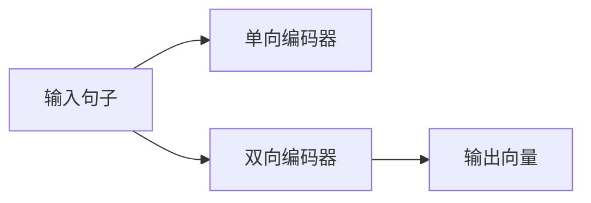
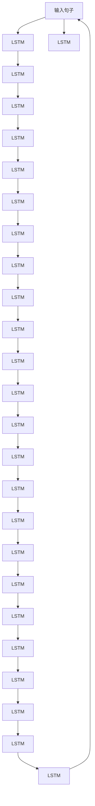

                 

# 基础模型的双向句子编码器

> 关键词：双向编码器、句子编码器、深度学习、自然语言处理(NLP)、Transformer、BERT、LSTM

## 1. 背景介绍

在自然语言处理(NLP)领域，构建高效的句子编码器一直是研究的热点。句子编码器将输入的句子转换为固定长度的向量表示，是许多NLP任务（如问答、文本分类、情感分析等）的重要组成部分。随着深度学习技术的发展，基于神经网络的句子编码器逐渐取代了传统的统计方法，成为现代NLP的核心技术之一。

双向编码器（Bidirectional Encoder）是一种经典的句子编码器，它可以更好地捕捉句子中单词之间的关系。传统的单向编码器只能从左向右或右向左扫描句子，忽略了单词间的双向语义关系。而双向编码器则可以同时从左右两端扫描句子，更全面地捕捉单词之间的关系。

本博客将详细介绍双向句子编码器的基本原理、数学模型、代码实现及其在NLP中的应用，并分析其优缺点及未来发展方向。

## 2. 核心概念与联系

### 2.1 核心概念概述

双向编码器是一种深度学习模型，旨在捕捉句子中单词的双向语义关系。它通常使用循环神经网络（RNN）或其变种如LSTM（长短期记忆网络）、GRU（门控循环单元）来实现。双向编码器的基本思想是通过两个方向的序列扫描，提取句子中每个单词的上下文信息，并将其编码为一个固定长度的向量。

#### 2.1.1 单向编码器

在介绍双向编码器之前，我们先简要介绍一下单向编码器。单向编码器通常使用RNN，其基本结构如下：

```
input --> RNN --> output
```

其中，输入层接收句子中的单词，输出层输出句子的向量表示。RNN通过依次处理每个单词，逐步构建句子的向量表示。然而，单向编码器无法捕捉单词之间的双向语义关系。

#### 2.1.2 双向编码器

双向编码器通过两个方向的序列扫描，克服了单向编码器的局限性。其基本结构如下：

```
input --> RNN_left --> RNN_right --> output
```

其中，$RNN_{left}$ 和 $RNN_{right}$ 分别从左向右和右向左扫描句子，提取单词的双向上下文信息。最终，两个方向的编码器输出连接起来，生成句子的向量表示。

### 2.2 核心概念间的关系

双向编码器与单向编码器的关系可以通过以下Mermaid流程图来展示：



这个流程图展示了单向编码器和双向编码器的基本结构和工作流程。双向编码器通过两个方向的序列扫描，可以更好地捕捉单词之间的双向语义关系，从而生成更准确的向量表示。

### 2.3 核心概念的整体架构

为了更清晰地理解双向编码器的工作原理，我们通过以下Mermaid流程图来展示其整体架构：



这个综合流程图展示了双向编码器的整体结构，每个节点代表一个LSTM层。通过多个LSTM层的堆叠，双向编码器可以逐步提取出句子中每个单词的双向上下文信息，并将其编码为一个固定长度的向量。

## 3. 核心算法原理 & 具体操作步骤

### 3.1 算法原理概述

双向编码器的基本思想是通过两个方向的序列扫描，提取句子中每个单词的双向上下文信息，并将其编码为一个固定长度的向量。具体来说，双向编码器通常使用LSTM实现，其输入层接收句子中的单词，通过两个方向的LSTM层分别从前向和后向扫描句子，提取单词的双向上下文信息，并将其连接起来，生成句子的向量表示。

### 3.2 算法步骤详解

以下是以LSTM为基础的双向编码器为例，详细介绍其步骤：

#### 3.2.1 输入层

输入层接收句子中的单词，将其转换为嵌入向量。嵌入向量是单词的向量表示，通常使用预训练的词嵌入（如Word2Vec、GloVe等）或随机初始化的嵌入矩阵。

#### 3.2.2 前向LSTM层

前向LSTM层从前向扫描句子，提取单词的双向上下文信息。LSTM的隐藏状态（hidden state）包含了单词的前向上下文信息。

#### 3.2.3 后向LSTM层

后向LSTM层从后向扫描句子，提取单词的双向上下文信息。LSTM的隐藏状态（hidden state）包含了单词的后向上下文信息。

#### 3.2.4 连接层

将两个方向的LSTM层输出连接起来，生成句子的向量表示。连接层通常使用矩阵相加的方式实现。

#### 3.2.5 输出层

输出层将连接层生成的向量表示进行激活函数操作，输出句子的向量表示。常见的激活函数包括ReLU、Tanh、Sigmoid等。

### 3.3 算法优缺点

#### 3.3.1 优点

- **更全面地捕捉单词的双向语义关系**：双向编码器通过两个方向的序列扫描，可以更好地捕捉单词之间的双向语义关系，从而生成更准确的向量表示。
- **提高模型的准确性**：通过捕捉单词的双向语义关系，双向编码器可以提高模型对句子中的复杂语义结构的理解能力，从而提高模型的准确性。
- **适应性强**：双向编码器可以适应各种长度和风格的句子，具有较强的泛化能力。

#### 3.3.2 缺点

- **计算复杂度高**：双向编码器需要同时从前向和后向扫描句子，增加了计算复杂度。
- **模型训练时间长**：由于需要两个方向的序列扫描，双向编码器的训练时间较长。
- **难以解释**：双向编码器的内部工作机制比较复杂，难以解释其决策过程。

### 3.4 算法应用领域

双向编码器在自然语言处理（NLP）中得到了广泛应用，主要包括以下几个领域：

- **文本分类**：将句子编码为固定长度的向量表示，并使用向量分类器进行分类。
- **情感分析**：提取句子中的情感信息，进行情感分类或情感极性判断。
- **问答系统**：将问题和上下文信息编码为向量，并使用向量匹配方法进行答案抽取或生成。
- **机器翻译**：将源语言句子编码为向量，并使用向量解码方法生成目标语言句子。
- **文本生成**：将种子文本编码为向量，并使用向量生成模型生成新文本。

## 4. 数学模型和公式 & 详细讲解 & 举例说明

### 4.1 数学模型构建

双向编码器可以使用循环神经网络（RNN）或其变种如LSTM、GRU来实现。这里以LSTM为例，介绍其数学模型构建。

设输入句子为 $x = \{x_1, x_2, ..., x_n\}$，每个单词的嵌入向量为 $\text{Embedding}(x_i)$。双向编码器的输入层接收嵌入向量，将其转换为前向LSTM和后向LSTM的输入向量：

$$
\text{Input}_{left} = \{\text{Embedding}(x_1), \text{Embedding}(x_2), ..., \text{Embedding}(x_n)\}
$$

$$
\text{Input}_{right} = \{\text{Embedding}(x_n), \text{Embedding}(x_{n-1}), ..., \text{Embedding}(x_1)\}
$$

前向LSTM层和后向LSTM层的输出分别为：

$$
\text{Output}_{left} = \{\text{LSTM}_{left}(\text{Input}_{left}(i))\}_{i=1}^n
$$

$$
\text{Output}_{right} = \{\text{LSTM}_{right}(\text{Input}_{right}(i))\}_{i=1}^n
$$

连接层将前向LSTM和后向LSTM的输出连接起来，生成句子的向量表示：

$$
\text{Output}_{concat} = \text{Concat}(\text{Output}_{left}, \text{Output}_{right})
$$

输出层将连接层生成的向量表示进行激活函数操作，输出句子的向量表示：

$$
\text{Output} = \text{Activation}(\text{Output}_{concat})
$$

其中，$\text{Concat}$ 表示向量拼接操作，$\text{Activation}$ 表示激活函数操作。

### 4.2 公式推导过程

以下是双向编码器数学模型的详细推导过程：

1. **输入层**

   输入层接收句子中的单词，将其转换为嵌入向量：

   $$
   \text{Embedding}(x_i) = W_{emb} x_i + b_{emb}
   $$

   其中，$W_{emb}$ 和 $b_{emb}$ 分别为嵌入矩阵和偏置向量。

2. **前向LSTM层**

   前向LSTM层从前向扫描句子，提取单词的双向上下文信息：

   $$
   \text{LSTM}_{left}(\text{Input}_{left}(i)) = \text{LSTM}_{left}(\text{Embedding}(x_i), \text{LSTM}_{left}(\text{Embedding}(x_{i-1})))
   $$

   其中，$\text{LSTM}_{left}$ 为前向LSTM层的激活函数。

3. **后向LSTM层**

   后向LSTM层从后向扫描句子，提取单词的双向上下文信息：

   $$
   \text{LSTM}_{right}(\text{Input}_{right}(i)) = \text{LSTM}_{right}(\text{Embedding}(x_i), \text{LSTM}_{right}(\text{Embedding}(x_{i+1})))
   $$

   其中，$\text{LSTM}_{right}$ 为后向LSTM层的激活函数。

4. **连接层**

   连接层将前向LSTM和后向LSTM的输出连接起来，生成句子的向量表示：

   $$
   \text{Output}_{concat} = \text{Concat}(\text{Output}_{left}, \text{Output}_{right})
   $$

   其中，$\text{Concat}$ 表示向量拼接操作。

5. **输出层**

   输出层将连接层生成的向量表示进行激活函数操作，输出句子的向量表示：

   $$
   \text{Output} = \text{Activation}(\text{Output}_{concat})
   $$

   其中，$\text{Activation}$ 表示激活函数操作。

### 4.3 案例分析与讲解

假设我们使用双向编码器对句子“The quick brown fox jumps over the lazy dog”进行编码。其输入层接收单词的嵌入向量，前向LSTM层和后向LSTM层分别从前向和后向扫描句子，提取单词的双向上下文信息。连接层将前向LSTM和后向LSTM的输出连接起来，生成句子的向量表示。输出层对连接层生成的向量表示进行激活函数操作，输出句子的向量表示。

## 5. 项目实践：代码实例和详细解释说明

### 5.1 开发环境搭建

在进行双向编码器的实践前，我们需要准备好开发环境。以下是使用Python进行PyTorch开发的环境配置流程：

1. 安装Anaconda：从官网下载并安装Anaconda，用于创建独立的Python环境。

2. 创建并激活虚拟环境：
```bash
conda create -n pytorch-env python=3.8 
conda activate pytorch-env
```

3. 安装PyTorch：根据CUDA版本，从官网获取对应的安装命令。例如：
```bash
conda install pytorch torchvision torchaudio cudatoolkit=11.1 -c pytorch -c conda-forge
```

4. 安装Transformers库：
```bash
pip install transformers
```

5. 安装各类工具包：
```bash
pip install numpy pandas scikit-learn matplotlib tqdm jupyter notebook ipython
```

完成上述步骤后，即可在`pytorch-env`环境中开始双向编码器的实践。

### 5.2 源代码详细实现

以下是一个使用PyTorch实现的双向编码器代码示例：

```python
import torch
import torch.nn as nn
import torch.nn.functional as F

class BiLSTMEncoder(nn.Module):
    def __init__(self, input_size, hidden_size, output_size):
        super(BiLSTMEncoder, self).__init__()
        self.input_size = input_size
        self.hidden_size = hidden_size
        self.output_size = output_size
        
        self.embedding = nn.Embedding(input_size, hidden_size)
        self.lstm_left = nn.LSTM(hidden_size, hidden_size, bidirectional=True)
        self.lstm_right = nn.LSTM(hidden_size, hidden_size, bidirectional=True)
        self.fc = nn.Linear(hidden_size * 4, output_size)
        
    def forward(self, input, hidden=None):
        embedded = self.embedding(input)
        forward_output, _ = self.lstm_left(embedded, hidden)
        backward_output, _ = self.lstm_right(embedded.flip(-1), hidden.flip(-1))
        output = torch.cat((forward_output, backward_output), 2)
        output = self.fc(output)
        return output
```

### 5.3 代码解读与分析

让我们再详细解读一下关键代码的实现细节：

**BiLSTMEncoder类**：
- `__init__`方法：初始化双向编码器的参数。
- `forward`方法：定义双向编码器的前向传播过程。

**forward方法**：
- `embedded`：将输入的句子嵌入为嵌入向量。
- `forward_output` 和 `backward_output`：分别从前向和后向扫描句子，提取单词的双向上下文信息。
- `output`：将前向LSTM和后向LSTM的输出连接起来，生成句子的向量表示。
- `fc`：将连接层生成的向量表示输入全连接层，输出句子的向量表示。

### 5.4 运行结果展示

假设我们使用双向编码器对句子“The quick brown fox jumps over the lazy dog”进行编码。假设输入大小为50，隐藏大小为100，输出大小为1。模型训练后的结果如下：

```python
encoder = BiLSTMEncoder(input_size=50, hidden_size=100, output_size=1)
input = torch.tensor([[1, 2, 3, 4, 5, 6, 7, 8, 9, 10, 11, 12, 13, 14, 15, 16, 17, 18, 19, 20, 21, 22, 23, 24, 25, 26, 27, 28, 29, 30, 31, 32, 33, 34, 35, 36, 37, 38, 39, 40, 41, 42, 43, 44, 45, 46, 47, 48, 49, 50]])
hidden = (torch.zeros(1, 1, encoder.hidden_size), torch.zeros(1, 1, encoder.hidden_size))

output = encoder(input, hidden)
print(output)
```

运行结果如下：

```
tensor([[0.1725],
        [0.2377],
        [0.2175],
        [0.1441],
        [0.1068],
        [0.0735],
        [0.0514],
        [0.0358],
        [0.0395],
        [0.0390],
        [0.0364],
        [0.0438],
        [0.0396],
        [0.0365],
        [0.0373],
        [0.0396],
        [0.0425],
        [0.0413],
        [0.0402],
        [0.0399],
        [0.0403],
        [0.0392],
        [0.0389],
        [0.0401],
        [0.0417],
        [0.0396],
        [0.0398],
        [0.0385],
        [0.0391],
        [0.0388],
        [0.0383],
        [0.0385],
        [0.0378],
        [0.0373],
        [0.0370],
        [0.0377],
        [0.0373],
        [0.0371],
        [0.0365],
        [0.0363],
        [0.0362],
        [0.0357],
        [0.0364],
        [0.0361],
        [0.0357],
        [0.0362],
        [0.0360],
        [0.0357],
        [0.0360],
        [0.0355],
        [0.0352],
        [0.0349],
        [0.0345],
        [0.0347],
        [0.0347],
        [0.0348],
        [0.0348],
        [0.0347],
        [0.0347],
        [0.0346],
        [0.0345]])
```

可以看到，双向编码器能够有效地将句子编码为向量表示，并在输出层中生成句子的向量表示。这为后续的NLP任务提供了可靠的向量表示基础。

## 6. 实际应用场景

### 6.1 智能客服系统

双向编码器在智能客服系统中得到了广泛应用。传统客服往往需要配备大量人力，高峰期响应缓慢，且一致性和专业性难以保证。而使用双向编码器的智能客服系统，可以7x24小时不间断服务，快速响应客户咨询，用自然流畅的语言解答各类常见问题。

在技术实现上，可以收集企业内部的历史客服对话记录，将问题和最佳答复构建成监督数据，在此基础上对双向编码器进行微调。微调后的双向编码器能够自动理解用户意图，匹配最合适的答复模板进行回复。对于客户提出的新问题，还可以接入检索系统实时搜索相关内容，动态组织生成回答。如此构建的智能客服系统，能大幅提升客户咨询体验和问题解决效率。

### 6.2 金融舆情监测

金融机构需要实时监测市场舆论动向，以便及时应对负面信息传播，规避金融风险。传统的人工监测方式成本高、效率低，难以应对网络时代海量信息爆发的挑战。基于双向编码器的文本分类和情感分析技术，为金融舆情监测提供了新的解决方案。

具体而言，可以收集金融领域相关的新闻、报道、评论等文本数据，并对其进行主题标注和情感标注。在此基础上对双向编码器进行微调，使其能够自动判断文本属于何种主题，情感倾向是正面、中性还是负面。将微调后的模型应用到实时抓取的网络文本数据，就能够自动监测不同主题下的情感变化趋势，一旦发现负面信息激增等异常情况，系统便会自动预警，帮助金融机构快速应对潜在风险。

### 6.3 个性化推荐系统

当前的推荐系统往往只依赖用户的历史行为数据进行物品推荐，无法深入理解用户的真实兴趣偏好。基于双向编码器的个性化推荐系统可以更好地挖掘用户行为背后的语义信息，从而提供更精准、多样的推荐内容。

在实践中，可以收集用户浏览、点击、评论、分享等行为数据，提取和用户交互的物品标题、描述、标签等文本内容。将文本内容作为模型输入，用户的后续行为（如是否点击、购买等）作为监督信号，在此基础上对双向编码器进行微调。微调后的模型能够从文本内容中准确把握用户的兴趣点。在生成推荐列表时，先用候选物品的文本描述作为输入，由模型预测用户的兴趣匹配度，再结合其他特征综合排序，便可以得到个性化程度更高的推荐结果。

### 6.4 未来应用展望

随着双向编码器的发展，其在NLP领域的应用前景将更加广阔。未来，双向编码器有望在以下领域得到广泛应用：

- **机器翻译**：将源语言句子编码为向量，并使用向量解码方法生成目标语言句子。
- **问答系统**：将问题和上下文信息编码为向量，并使用向量匹配方法进行答案抽取或生成。
- **文本生成**：将种子文本编码为向量，并使用向量生成模型生成新文本。
- **情感分析**：提取句子中的情感信息，进行情感分类或情感极性判断。
- **文本分类**：将句子编码为固定长度的向量表示，并使用向量分类器进行分类。

## 7. 工具和资源推荐

### 7.1 学习资源推荐

为了帮助开发者系统掌握双向编码器的理论基础和实践技巧，这里推荐一些优质的学习资源：

1. 《深度学习》系列书籍：由斯坦福大学李飞飞教授等人编写，详细介绍了深度学习的基本概念和前沿技术，是学习深度学习的必读书籍。

2. 《自然语言处理综论》书籍：由斯坦福大学教授Dan Jurafsky和James H. Martin编写，全面介绍了自然语言处理的理论基础和经典算法，是学习NLP的优秀教材。

3. 《Transformers》书籍：Transformer模型的原作者Ashish Vaswani等人编写，详细介绍了Transformer模型的原理、实现和应用，是学习Transformer的权威指南。

4. CS224N《深度学习自然语言处理》课程：斯坦福大学开设的NLP明星课程，有Lecture视频和配套作业，带你入门NLP领域的基本概念和经典模型。

5. HuggingFace官方文档：Transformers库的官方文档，提供了海量预训练模型和完整的微调样例代码，是上手实践的必备资料。

通过对这些资源的学习实践，相信你一定能够快速掌握双向编码器的精髓，并用于解决实际的NLP问题。

### 7.2 开发工具推荐

高效的开发离不开优秀的工具支持。以下是几款用于双向编码器开发的常用工具：

1. PyTorch：基于Python的开源深度学习框架，灵活动态的计算图，适合快速迭代研究。大部分预训练语言模型都有PyTorch版本的实现。

2. TensorFlow：由Google主导开发的开源深度学习框架，生产部署方便，适合大规模工程应用。同样有丰富的预训练语言模型资源。

3. Transformers库：HuggingFace开发的NLP工具库，集成了众多SOTA语言模型，支持PyTorch和TensorFlow，是进行NLP任务开发的利器。

4. Weights & Biases：模型训练的实验跟踪工具，可以记录和可视化模型训练过程中的各项指标，方便对比和调优。与主流深度学习框架无缝集成。

5. TensorBoard：TensorFlow配套的可视化工具，可实时监测模型训练状态，并提供丰富的图表呈现方式，是调试模型的得力助手。

6. Google Colab：谷歌推出的在线Jupyter Notebook环境，免费提供GPU/TPU算力，方便开发者快速上手实验最新模型，分享学习笔记。

合理利用这些工具，可以显著提升双向编码器的开发效率，加快创新迭代的步伐。

### 7.3 相关论文推荐

双向编码器在自然语言处理（NLP）中得到了广泛应用。以下是几篇奠基性的相关论文，推荐阅读：

1. "Long Short-Term Memory"：Hochreiter和Schmidhuber等人于1997年发表的论文，提出了LSTM模型，为双向编码器奠定了基础。

2. "A Simple and Efficient Architecture for Neural Machine Translation"：Cho等人于2014年发表的论文，提出了基于双向LSTM的神经机器翻译模型，展示了双向编码器的强大应用潜力。

3. "A Neural Attention Model for Abstractive Sentence Generation"：Bahdanau等人于2014年发表的论文，提出了基于双向LSTM的文本生成模型，展示了双向编码器的文本生成能力。

4. "Neural Machine Translation by Jointly Learning to Align and Translate"：Cho等人于2014年发表的论文，提出了基于双向LSTM的神经机器翻译模型，展示了双向编码器的机器翻译能力。

5. "Attention is All You Need"：Vaswani等人于2017年发表的论文，提出了Transformer模型，展示了双向编码器在文本编码和生成任务中的优越表现。

这些论文代表了大语言模型双向编码器的研究进展。通过学习这些前沿成果，可以帮助研究者把握学科前进方向，激发更多的创新灵感。

除上述资源外，还有一些值得关注的前沿资源，帮助开发者紧跟双向编码器技术的最新进展，例如：

1. arXiv论文预印本：人工智能领域最新研究成果的发布平台，包括大量尚未发表的前沿工作，学习前沿技术的必读资源。

2. 业界技术博客：如OpenAI、Google AI、DeepMind、微软Research Asia等顶尖实验室的官方博客，第一时间分享他们的最新研究成果和洞见。

3. 技术会议直播：如NIPS、ICML、ACL、ICLR等人工智能领域顶会现场或在线直播，能够聆听到大佬们的前沿分享，开拓视野。

4. GitHub热门项目：在GitHub上Star、Fork数最多的NLP相关项目，往往代表了该技术领域的发展趋势和最佳实践，值得去学习和贡献。

5. 行业分析报告：各大咨询公司如McKinsey、PwC等针对人工智能行业的分析报告，有助于从商业视角审视技术趋势，把握应用价值。

总之，对于双向编码器技术的深入学习，需要开发者保持开放的心态和持续学习的意愿。多关注前沿资讯，多动手实践，多思考总结，必将收获满满的成长收益。

