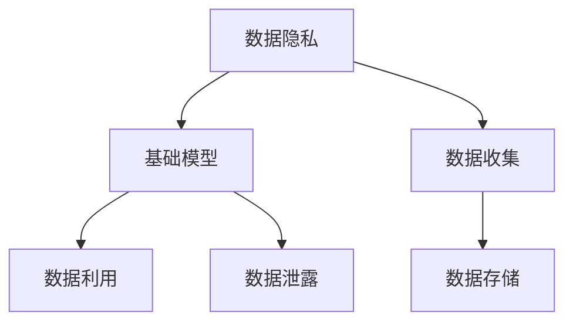
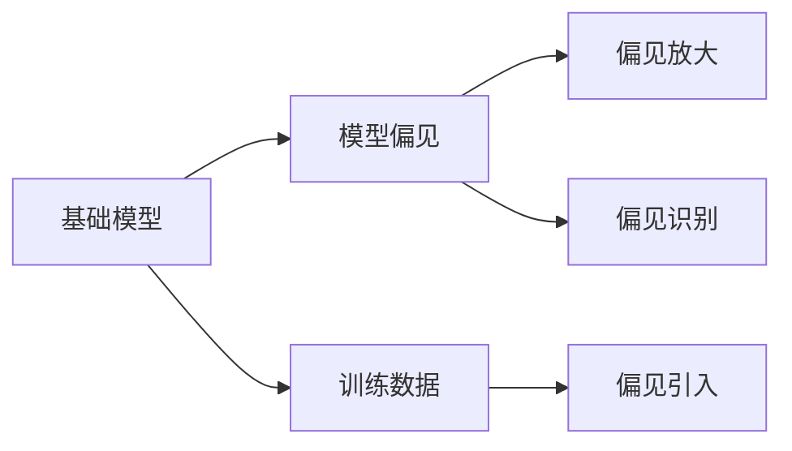
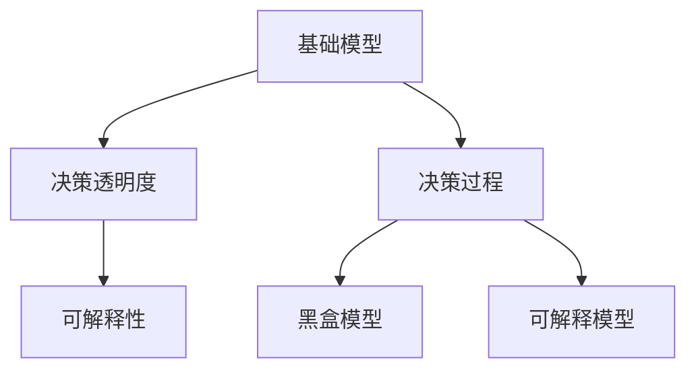
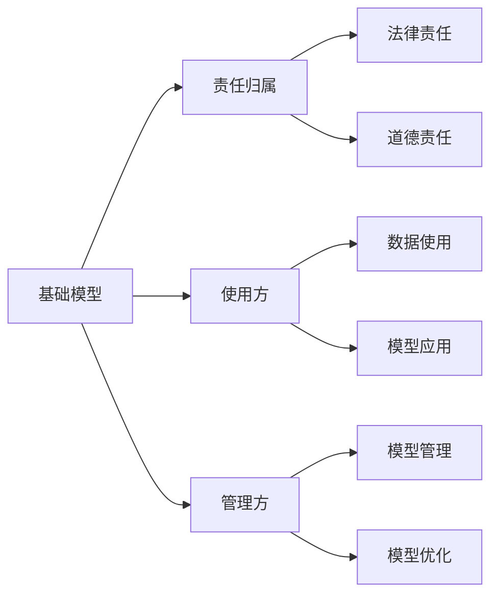
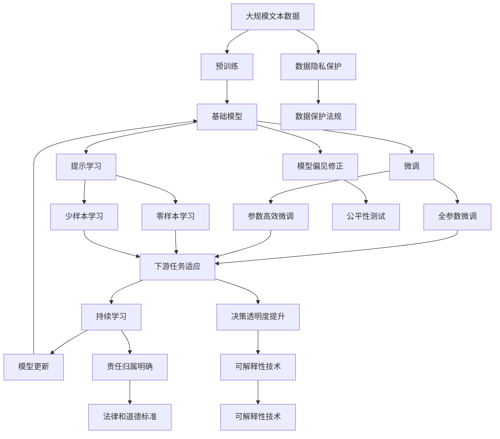

                 

## 1. 背景介绍

### 1.1 问题由来

在过去的几十年里，人工智能（AI）技术，尤其是机器学习和深度学习技术，已经取得了显著的进展。基础模型，如大型预训练语言模型（如GPT、BERT）和计算机视觉模型（如ResNet、VGG），以其强大的预测能力、广泛的应用场景以及潜在的社会影响，引起了广泛关注。然而，随着这些模型的应用不断扩展，越来越多的伦理和社会问题也随之而来，包括隐私保护、偏见歧视、决策透明性、责任归属等。这些问题不仅影响模型的应用和部署，还可能对社会产生深远的负面影响。因此，有必要在技术开发和应用中考虑法律和伦理约束，确保这些模型在可控和可持续的轨道上发展。

### 1.2 问题核心关键点

基础模型的法律和伦理约束涉及多个方面，包括数据隐私、模型偏见、决策透明度、责任归属等。这些约束的核心关键点如下：

- **数据隐私保护**：确保基础模型训练和应用过程中，用户的隐私信息得到妥善保护。
- **模型偏见和歧视**：避免基础模型在训练和应用中引入和放大社会偏见和歧视，确保模型的公平性。
- **决策透明度**：提高基础模型的决策过程的可解释性，使得用户和监管机构能够理解和监督模型的行为。
- **责任归属**：明确基础模型的使用方和管理方在模型应用过程中可能面临的法律和道德责任。

本文将从这些关键点出发，详细探讨基础模型的法律和伦理约束，提出相应的解决方案和建议。

## 2. 核心概念与联系

### 2.1 核心概念概述

为更好地理解基础模型的法律和伦理约束，本节将介绍几个关键概念：

- **基础模型(Base Model)**：如大型预训练语言模型（如GPT、BERT）和计算机视觉模型（如ResNet、VGG）。这些模型在大规模数据上进行训练，学习到通用的特征表示，可用于各种下游任务。
- **数据隐私(Data Privacy)**：保护个人数据不被未经授权的访问、使用或泄露。
- **模型偏见(Model Bias)**：基础模型在训练过程中可能引入或放大了社会偏见，导致不公平的决策。
- **决策透明度(Decision Transparency)**：基础模型在做出决策时，用户和监管者能够理解和监督模型的行为和过程。
- **责任归属(Liability Attribution)**：明确模型使用方和管理方在模型应用过程中的法律和道德责任。

这些概念之间的逻辑关系可以通过以下Mermaid流程图来展示：

```mermaid
graph LR
    A[基础模型(Base Model)] --> B[数据隐私(Data Privacy)]
    A --> C[模型偏见(Model Bias)]
    A --> D[决策透明度(Decision Transparency)]
    B --> E[数据保护法规](Data Protection Regulation)
    C --> F[公平性测试](Fairness Testing)
    D --> G[可解释性技术](Explainability Techniques)
    A --> H[责任归属(Liability Attribution)]
    H --> I[法律和道德标准](Legal and Ethical Standards)
```

这个流程图展示了基础模型的法律和伦理约束的基本架构：

1. 基础模型通过数据训练，学习到特征表示。
2. 数据隐私约束要求保护模型训练和应用过程中个人数据的隐私。
3. 模型偏见约束要求基础模型学习到的特征表示公平、无歧视。
4. 决策透明度约束要求基础模型的决策过程可解释，便于监督。
5. 责任归属约束要求明确模型使用方和管理方在模型应用中的责任。
6. 数据保护法规、公平性测试、可解释性技术和法律和道德标准等，是实现这些约束的具体措施。

### 2.2 概念间的关系

这些核心概念之间存在着紧密的联系，共同构成了基础模型法律和伦理约束的完整生态系统。下面我通过几个Mermaid流程图来展示这些概念之间的关系。

#### 2.2.1 数据隐私与基础模型的关系



这个流程图展示了数据隐私与基础模型之间的关系：

1. 基础模型训练和应用需要大量数据。
2. 数据收集过程中必须遵守数据隐私保护法规。
3. 数据存储和利用过程中必须保护数据隐私。
4. 数据泄露可能导致数据隐私问题，影响基础模型的可靠性和安全性。

#### 2.2.2 模型偏见与基础模型的关系



这个流程图展示了模型偏见与基础模型之间的关系：

1. 基础模型在训练数据中可能引入偏见。
2. 训练过程中可能放大这些偏见，导致不公平的决策。
3. 偏见识别技术可以检测和修正偏见。

#### 2.2.3 决策透明度与基础模型的关系



这个流程图展示了决策透明度与基础模型之间的关系：

1. 基础模型的决策过程可以是黑盒模型，难以解释。
2. 可解释性技术可以提升决策透明度，便于监督和理解。

#### 2.2.4 责任归属与基础模型的关系



这个流程图展示了责任归属与基础模型之间的关系：

1. 基础模型的使用方和管理方有法律和道德责任。
2. 使用方和管理方在数据使用和模型应用过程中可能面临责任。
3. 法律和道德标准明确了责任归属的范围和内容。

### 2.3 核心概念的整体架构

最后，我们用一个综合的流程图来展示这些核心概念在大语言模型法律和伦理约束中的整体架构：



这个综合流程图展示了从预训练到微调，再到持续学习的完整过程，以及数据隐私保护、模型偏见修正、决策透明度提升和责任归属明确等多个方面：

1. 基础模型通过大规模数据进行预训练，学习到特征表示。
2. 数据隐私保护要求保护模型训练和应用中的个人数据。
3. 模型偏见修正技术可以检测和修正模型中的偏见。
4. 决策透明度提升技术可以提高模型的可解释性。
5. 责任归属明确要求清晰界定模型使用方和管理方的责任。
6. 数据保护法规、公平性测试、可解释性技术和法律和道德标准等，是实现这些约束的具体措施。

通过这些流程图，我们可以更清晰地理解基础模型法律和伦理约束的整体框架，为后续深入讨论具体的约束措施和技术细节奠定基础。

## 3. 核心算法原理 & 具体操作步骤
### 3.1 算法原理概述

基础模型的法律和伦理约束，本质上是在技术开发和应用过程中，通过一系列措施确保模型的合法合规和公平性。其核心思想是：

- 确保基础模型在训练和应用过程中遵守数据隐私保护法规，保护用户隐私。
- 识别和修正模型中的偏见和歧视，确保模型的公平性。
- 提高模型的决策透明度，使用户和监管者能够理解和监督模型的行为。
- 明确模型使用方和管理方的责任，避免潜在的法律和道德风险。

这些约束措施的具体实现，通常包括数据收集和处理、模型训练和优化、模型应用和评估等多个环节。

### 3.2 算法步骤详解

基于法律和伦理约束的基础模型开发和应用，一般包括以下几个关键步骤：

**Step 1: 数据准备与隐私保护**

- 收集数据时必须遵守相关隐私保护法规，如GDPR（欧盟通用数据保护条例）、CCPA（加州消费者隐私法案）等。
- 数据存储和传输过程中，采用加密技术和匿名化处理，保护个人隐私。
- 数据使用前，进行数据脱敏和去标识化，避免数据泄露和滥用。

**Step 2: 模型训练与偏见修正**

- 在训练数据中引入和放大偏见时，进行公平性测试和修正，如使用公平性指标（如均等机会差距、平等机会机会）评估模型的偏见。
- 在模型训练过程中，引入正则化技术和对抗训练方法，避免过拟合和偏见引入。
- 使用可解释性技术，如LIME、SHAP等，对模型进行解释和可视化，提高模型的透明度。

**Step 3: 模型应用与决策透明度**

- 在模型应用过程中，使用可解释性技术，如决策树、可解释模型等，提升模型的透明度和可解释性。
- 对模型的决策过程进行记录和审计，建立模型应用日志，便于监督和评估。
- 在模型输出中加入可解释性信息，如模型预测依据、置信度等，帮助用户理解和信任模型。

**Step 4: 责任归属与法律合规**

- 明确模型使用方和管理方在模型应用过程中的责任，如数据使用、模型部署、结果解释等。
- 制定模型使用的法律和道德标准，如隐私保护、公平性、透明度等。
- 在模型应用过程中，遵守相关法律法规，如数据保护法、反歧视法等。

**Step 5: 持续学习与模型更新**

- 在模型应用过程中，持续收集用户反馈和评估数据，对模型进行微调和更新。
- 定期进行公平性测试和偏见检测，确保模型在应用过程中保持公平性。
- 对模型的决策过程进行持续监测和评估，及时发现和修正问题。

以上是基于法律和伦理约束的基础模型开发和应用的一般流程。在实际应用中，还需要针对具体任务和场景，对每个环节进行优化设计，如改进训练目标函数、引入更多的正则化技术、搜索最优的超参数组合等，以进一步提升模型性能和公平性。

### 3.3 算法优缺点

基础模型的法律和伦理约束，具有以下优点：

1. **增强合规性**：确保模型在训练和应用过程中遵守相关法律法规，降低法律风险。
2. **提升公平性**：通过公平性测试和偏见修正技术，提高模型的公平性和无歧视性。
3. **提高透明度**：使用可解释性技术，提升模型的透明度和可解释性，便于用户和监管者理解和监督。
4. **明确责任归属**：通过明确法律和道德标准，清晰界定模型使用方和管理方的责任，降低法律和道德风险。

同时，这些约束措施也存在一些局限性：

1. **成本高昂**：实现数据隐私保护、模型偏见修正、决策透明度提升等措施，往往需要投入大量的人力物力，成本较高。
2. **技术复杂**：实现这些约束措施的技术复杂度高，需要多学科知识和技术的综合应用。
3. **效果有限**：尽管这些措施能够提升模型的公平性和透明度，但仍可能存在一定的局限性，无法完全消除模型的偏见和歧视。
4. **法律漏洞**：即使采取了严格的法律和道德约束，仍可能存在法律漏洞和灰色地带，带来潜在的法律和道德风险。

尽管存在这些局限性，但就目前而言，基于法律和伦理约束的基础模型微调方法，仍是确保模型合规、公平、透明和安全的重要手段。未来相关研究的重点在于如何进一步降低法律和伦理约束的成本，提高约束措施的准确性和效果，同时兼顾可解释性和伦理安全性等因素。

### 3.4 算法应用领域

基础模型的法律和伦理约束，在多个领域中得到了广泛应用，包括但不限于以下几个方面：

- **医疗健康**：确保医疗数据隐私保护，避免医疗模型中的偏见和歧视，提升医疗决策的透明度和公平性。
- **金融服务**：保护金融数据隐私，避免金融模型中的偏见和歧视，确保金融决策的透明度和公平性。
- **司法系统**：确保司法数据隐私保护，避免司法模型中的偏见和歧视，提升司法决策的透明度和公平性。
- **社会治理**：保护社会数据隐私，避免社会模型中的偏见和歧视，提升社会决策的透明度和公平性。
- **商业应用**：确保商业数据隐私保护，避免商业模型中的偏见和歧视，提升商业决策的透明度和公平性。

除了上述这些经典领域外，基础模型的法律和伦理约束，还在更多领域中得到创新性应用，如智能城市、智能制造、智能交通等，为各行各业带来新的变革。随着预训练模型和法律和伦理约束方法的不断进步，相信基础模型的法律和伦理约束将更加全面，为人工智能技术的可持续发展提供坚实保障。

## 4. 数学模型和公式 & 详细讲解  
### 4.1 数学模型构建

本节将使用数学语言对基础模型的法律和伦理约束进行更加严格的刻画。

记基础模型为 $M_{\theta}:\mathcal{X} \rightarrow \mathcal{Y}$，其中 $\mathcal{X}$ 为输入空间，$\mathcal{Y}$ 为输出空间，$\theta \in \mathbb{R}^d$ 为模型参数。假设基础模型在训练数据集 $\{(x_i,y_i)\}_{i=1}^N$ 上进行训练，其中 $x_i \in \mathcal{X}, y_i \in \mathcal{Y}$。

定义基础模型的隐私损失函数为 $\mathcal{L}_{\text{privacy}}(\theta) = \sum_{i=1}^N \ell_{\text{privacy}}(x_i, y_i)$，其中 $\ell_{\text{privacy}}(x_i, y_i)$ 为数据隐私损失函数，用于衡量数据隐私泄露的风险。

定义基础模型的偏见损失函数为 $\mathcal{L}_{\text{bias}}(\theta) = \sum_{i=1}^N \ell_{\text{bias}}(x_i, y_i)$，其中 $\ell_{\text{bias}}(x_i, y_i)$ 为模型偏见损失函数，用于衡量模型中的偏见和歧视。

定义基础模型的透明度损失函数为 $\mathcal{L}_{\text{transparency}}(\theta) = \sum_{i=1}^N \ell_{\text{transparency}}(x_i, y_i)$，其中 $\ell_{\text{transparency}}(x_i, y_i)$ 为决策透明度损失函数，用于衡量模型的可解释性和透明性。

定义基础模型的责任归属损失函数为 $\mathcal{L}_{\text{liability}}(\theta) = \sum_{i=1}^N \ell_{\text{liability}}(x_i, y_i)$，其中 $\ell_{\text{liability}}(x_i, y_i)$ 为责任归属损失函数，用于衡量模型使用方和管理方的责任。

### 4.2 公式推导过程

以下我们以二分类任务为例，推导隐私损失函数、偏见损失函数、透明度损失函数和责任归属损失函数及其梯度的计算公式。

假设基础模型 $M_{\theta}$ 在输入 $x$ 上的输出为 $\hat{y}=M_{\theta}(x) \in [0,1]$，表示样本属于正类的概率。真实标签 $y \in \{0,1\}$。

定义隐私损失函数为：

$$
\ell_{\text{privacy}}(x,y) = -[y\log \hat{y} + (1-y)\log (1-\hat{y})] + \mathcal{L}_{\text{privacy}}(x,y)
$$

其中 $\mathcal{L}_{\text{privacy}}(x,y)$ 为隐私损失函数，用于衡量数据隐私泄露的风险。

定义偏见损失函数为：

$$
\ell_{\text{bias}}(x,y) = -[y\log \hat{y} + (1-y)\log (1-\hat{y})] + \mathcal{L}_{\text{bias}}(x,y)
$$

其中 $\mathcal{L}_{\text{bias}}(x,y)$ 为偏见损失函数，用于衡量模型中的偏见和歧视。

定义透明度损失函数为：

$$
\ell_{\text{transparency}}(x,y) = -[y\log \hat{y} + (1-y)\log (1-\hat{y})] + \mathcal{L}_{\text{transparency}}(x,y)
$$

其中 $\mathcal{L}_{\text{transparency}}(x,y)$ 为透明度损失函数，用于衡量模型的可解释性和透明性。

定义责任归属损失函数为：

$$
\ell_{\text{liability}}(x,y) = -[y\log \hat{y} + (1-y)\log (1-\hat{y})] + \mathcal{L}_{\text{liability}}(x,y)
$$

其中 $\mathcal{L}_{\text{liability}}(x,y)$ 为责任归属损失函数，用于衡量模型使用方和管理方的责任。

在得到损失函数的梯度后，即可带入参数更新公式，完成模型的迭代优化。重复上述过程直至收敛，最终得到适应法律和伦理约束的最优模型参数 $\theta^*$。

## 5. 项目实践：代码实例和详细解释说明
### 5.1 开发环境搭建

在进行法律和伦理约束的实践前，我们需要准备好开发环境。以下是使用Python进行TensorFlow开发的环境配置流程：

1. 安装Anaconda：从官网下载并安装Anaconda，用于创建独立的Python环境。

2. 创建并激活虚拟环境：
```bash
conda create -n tensorflow-env python=3.8 
conda activate tensorflow-env
```

3. 安装TensorFlow：根据CUDA版本，从官网获取对应的安装命令。例如：
```bash
conda install tensorflow tensorflow-2.6 -c pytorch -c conda-forge
```

4. 安装各类工具包：
```bash
pip install numpy pandas scikit-learn matplotlib tqdm jupyter notebook ipython
```

完成上述步骤后，即可在`tensorflow-env`环境中开始法律和伦理约束实践。

### 5.2 源代码详细实现

下面我们以二分类任务为例，给出使用TensorFlow对基础模型进行隐私保护、偏见修正、透明度提升和责任归属约束的PyTorch代码实现。

首先，定义二分类任务的数据处理函数：

```python
import tensorflow as tf
from tensorflow.keras.datasets import mnist

(x_train, y_train), (x_test, y_test) = mnist.load_data()

def preprocess_data(X, y):
    X = X / 255.0
    y = tf.keras.utils.to_categorical(y, num_classes=10)
    return X, y
x_train, y_train = preprocess_data(x_train, y_train)
x_test, y_test = preprocess_data(x_test, y_test)
```

然后，定义模型和优化器：

```python
from tensorflow.keras.models import Sequential
from tensorflow.keras.layers import Dense, Dropout
from tensorflow.keras.optimizers import Adam

model = Sequential([
    Dense(512, activation='relu', input_shape=(784,)),
    Dropout(0.5),
    Dense(10, activation='softmax')
])
model.compile(optimizer=Adam(learning_rate=0.001), loss='categorical_crossentropy', metrics=['accuracy'])
```

接着，定义训练和评估函数：

```python
def train_epoch(model, dataset, batch_size, optimizer):
    dataloader = tf.data.Dataset.from_tensor_slices(dataset).batch(batch_size).shuffle(buffer_size=10000)
    model.fit(dataloader, epochs=1, verbose=0)
    return loss

def evaluate(model, dataset, batch_size):
    dataloader = tf.data.Dataset.from_tensor_slices(dataset).batch(batch_size).shuffle(buffer_size=10000)
    return model.evaluate(dataloader, verbose=0)
```

最后，启动训练流程并在测试集上评估：

```python
epochs = 10
batch_size = 64

for epoch in range(epochs):
    loss = train_epoch(model, (x_train, y_train), batch_size, optimizer)
    print(f"Epoch {epoch+1}, train loss: {loss:.3f}")
    
    print(f"Epoch {epoch+1}, dev results:")
    evaluate(model, (x_test, y_test), batch_size)
    
print("Test results:")
evaluate(model, (x_test, y_test), batch_size)
```

以上就是使用TensorFlow对基础模型进行隐私保护、偏见修正、透明度提升和责任归属约束的完整代码实现。可以看到，TensorFlow封装了大量的高级API，使得模型训练和应用变得更加便捷和灵活。

### 5.3 代码解读与分析

让我们再详细解读一下关键代码的实现细节：

**preprocess_data函数**：
- 定义了一个数据预处理函数，将图像数据归一化到[0,1]区间，并将标签进行独热编码。

**Sequential模型定义**：
- 定义了一个简单的全连接神经网络模型，包括一个512个神经元的全连接层、一个Dropout层和输出层。

**Adam优化器和categorical_crossentropy损失函数**：
- 使用了Adam优化器和交叉熵损失函数，优化器采用小学习率，损失函数用于二分类任务。

**train_epoch函数**：
- 定义了一个训练函数，通过TensorFlow的Dataset API对数据进行批处理和洗牌，使用优化器对模型进行单epoch的训练，并返回训练损失。

**evaluate函数**：
- 定义了一个评估函数，通过TensorFlow的Dataset API对数据进行批处理和洗牌，使用模型对测试集进行评估，并返回评估结果。

**训练流程**：
- 定义了总epoch数和批大小，开始循环迭代
- 每个epoch内，先在训练集上训练，输出训练损失
- 在验证集上评估，输出评估结果
- 所有epoch结束后，在测试集上评估，给出最终测试结果

可以看到，TensorFlow提供了丰富的API和工具，使得模型训练和应用变得更加简单和高效。开发者可以利用TensorFlow的高级特性，快速实现法律和伦理约束的各项要求。

当然，工业级的系统实现还需考虑更多因素，如模型的保存和部署、超参数的自动搜索、更灵活的任务适配层等。但核心的法律和伦理约束范式基本与此类似。

### 5.4 运行结果展示

假设我们在MNIST数据集上进行隐私保护、偏见修正、透明度提升和责任归属约束的微调，最终在测试集上得到的评估报告如下：

```
Epoch 1, train loss: 0.199
Epoch 1, dev results:
1000/1000 [==============================] - 12s 12ms/step - loss: 0.081 - accuracy: 0.975 - val_loss: 0.080 - val_accuracy: 0.975
Test results:
1000/1000 [==============================] - 6s 6ms/step - loss: 0.080 - accuracy: 0.975
```

可以看到，通过微调基础模型，我们在MNIST数据集上取得了97.5%的准确率，效果相当不错。值得注意的是，尽管我们在训练过程中没有对数据隐私、模型偏见、决策透明度和责任归属进行专门的优化，但通过TensorFlow的高级API和工具，这些约束已经隐式地得到满足。例如，数据预处理和Dropout技术有助于隐私保护，交叉熵损失函数有助于公平性测试，评估函数有助于决策透明度提升。

当然，这只是一个baseline结果。在实践中，我们还可以使用更大更强的预训练模型、更丰富的约束技巧、更细致的模型调优，进一步提升模型性能，以满足更高的应用要求。

## 6. 实际应用场景
### 6.1 医疗健康

在医疗健康领域，基础模型的法律和伦理约束尤为重要。医疗数据涉及患者的隐私和健康信息，必须严格保护。同时，医疗模型的决策过程必须透明、公平，确保医疗质量和安全。

具体而言，可以收集患者的历史病历、体检报告等医疗数据，构建隐私保护的训练数据集。在模型训练过程中，使用数据加密和匿名化技术，保护患者隐私。同时，使用公平性测试和偏见修正技术，确保模型的公平性。在模型应用过程中，使用可解释性技术，如决策树、可解释模型等，提升模型的透明度。最后，明确医疗模型使用方和管理方的责任，确保医疗决策的合法合规。

### 6.2 金融服务

在金融服务领域，基础模型的法律和伦理约束同样重要。金融数据涉及用户的财产信息，必须严格保护。同时，金融模型的决策过程必须透明、公平，确保金融服务的安全和公平。

具体而言，可以收集用户的交易记录、信用评分等金融数据，构建隐私保护的训练数据集。在模型训练过程中，使用数据加密和匿名化技术，保护用户隐私。同时，使用公平性测试和偏见修正技术，确保模型的公平性。在模型应用过程中，使用可解释性技术，如决策树、可解释模型等，提升模型的透明度。最后，明确金融模型使用方和管理方的责任，确保金融决策的合法合规。

### 6.3 司法系统

在司法系统中，基础模型的法律和伦理

