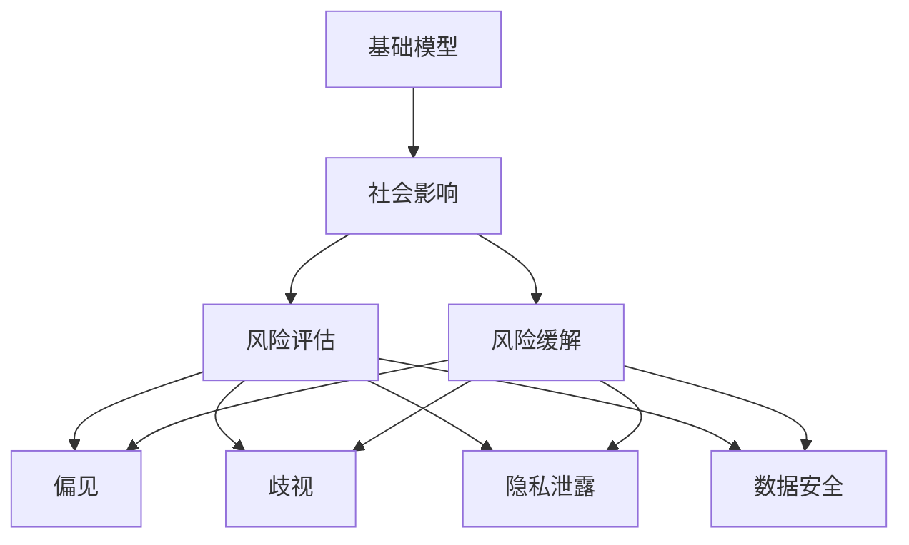
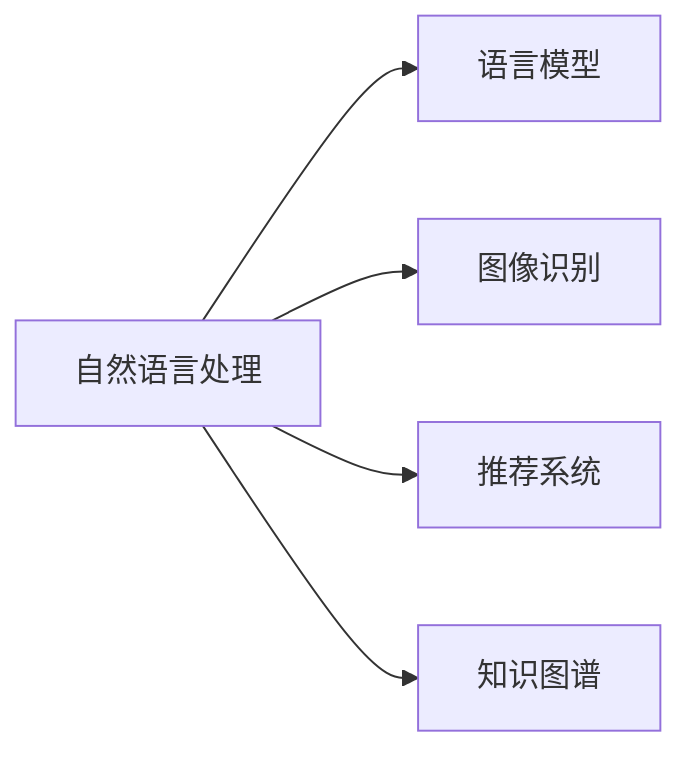
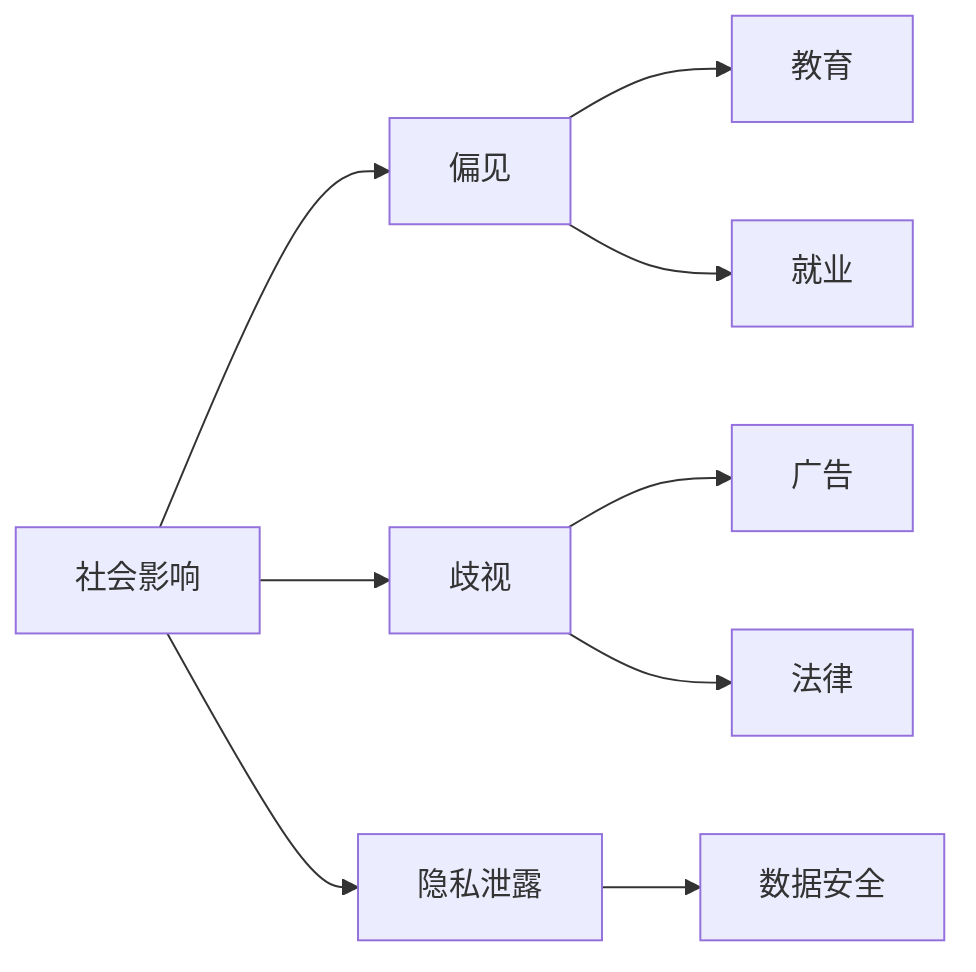
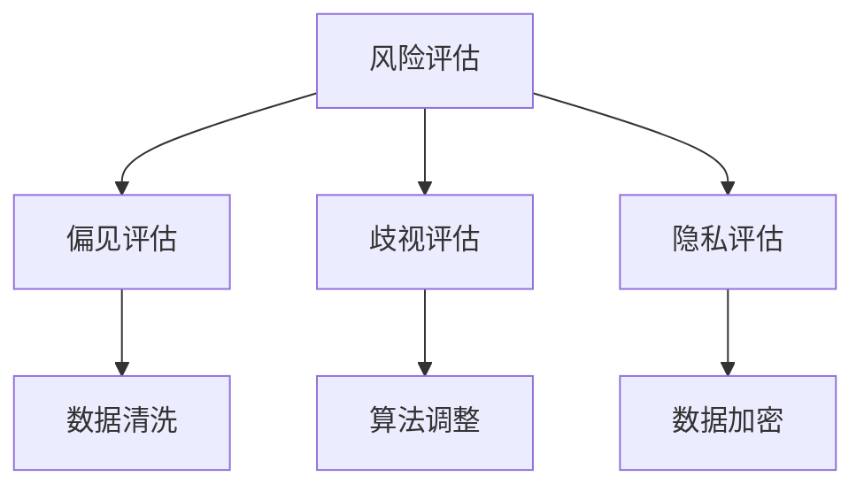
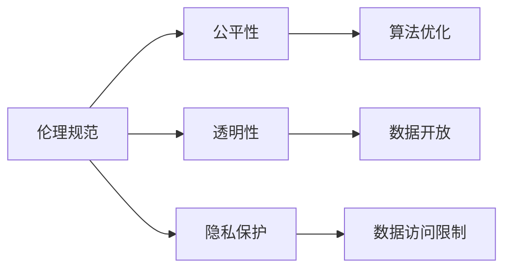
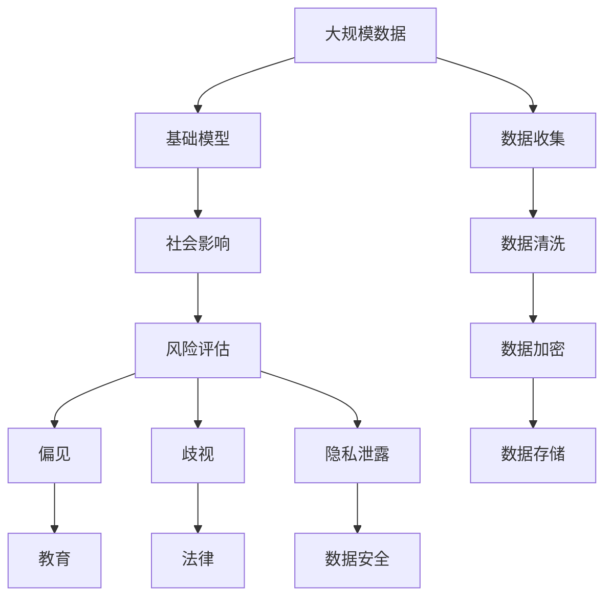

                 

# 基础模型的社会影响评估

## 1. 背景介绍

随着人工智能(AI)技术的快速发展，基础模型(Base Models)在各行各业中的应用越来越广泛，其社会影响也日益显著。基础模型通常指那些在大规模无标签数据上进行预训练，具备广泛的知识和语义理解能力的大型神经网络。这些模型包括语言模型、图像识别模型、推荐系统等。本文将重点讨论基础模型的社会影响评估，探讨其在不同场景下的应用及潜在的风险和挑战。

### 1.1 基础模型的定义与分类

基础模型是指在大规模无标签数据上通过自监督或监督学习进行预训练的大型神经网络。根据应用领域，基础模型可以分为以下几类：

- **语言模型**：如BERT、GPT系列，用于自然语言处理(NLP)任务，包括文本分类、情感分析、对话系统等。
- **图像识别模型**：如ResNet、VGGNet，用于计算机视觉(CV)任务，包括图像分类、目标检测、图像生成等。
- **推荐模型**：如DeepFM、Wide & Deep，用于个性化推荐系统，包括电商推荐、新闻推荐等。
- **知识图谱**：如Elastic Embeddings，用于构建知识图谱，用于信息检索、问答系统等。

这些基础模型通过预训练获得了强大的泛化能力，能够在大规模数据上进行高效学习和推理。

### 1.2 基础模型的应用

基础模型在多个领域中得到了广泛应用，以下是几个典型的应用场景：

- **自然语言处理**：如BERT在问答系统、机器翻译、命名实体识别、情感分析等任务中取得了优异表现。
- **计算机视觉**：如ResNet在图像分类、目标检测、人脸识别等任务中表现出色。
- **推荐系统**：如DeepFM在电商推荐、新闻推荐等应用中提升了用户体验和推荐效果。
- **知识图谱**：如Elastic Embeddings在信息检索、问答系统等任务中提供了高效的查询和推理。

基础模型通过大规模预训练，能够跨越不同领域和任务，提供了通用的知识库和技能，极大提升了各领域的智能化水平。

## 2. 核心概念与联系

### 2.1 核心概念概述

为了更好地理解基础模型的社会影响评估，本节将介绍几个关键概念：

- **基础模型**：指在大规模无标签数据上进行预训练的大型神经网络。
- **社会影响**：指基础模型在社会层面上的各种影响，包括正面的效益和潜在的风险。
- **风险评估**：指评估基础模型可能带来的负面影响，如偏见、歧视、隐私泄露等。
- **风险缓解**：指采取措施减少基础模型的负面影响，提升其社会可接受性。
- **伦理规范**：指在设计和应用基础模型时需遵守的伦理准则，如公平性、透明性、隐私保护等。

这些概念之间的逻辑关系可以通过以下Mermaid流程图来展示：



这个流程图展示了基础模型在社会层面上的影响路径，以及与之相关的风险评估和风险缓解过程。

### 2.2 概念间的关系

这些核心概念之间存在着紧密的联系，形成了基础模型社会影响评估的完整框架。下面通过几个Mermaid流程图来展示这些概念之间的关系。

#### 2.2.1 基础模型的应用



这个流程图展示了基础模型在不同领域的应用情况，如语言模型用于自然语言处理，图像识别模型用于计算机视觉，推荐模型用于推荐系统，知识图谱用于知识图谱构建。

#### 2.2.2 社会影响与风险



这个流程图展示了基础模型在社会层面上可能带来的各种影响，如偏见、歧视、隐私泄露等，并具体指出了这些影响的正面和负面影响。

#### 2.2.3 风险评估与缓解



这个流程图展示了风险评估的具体步骤，包括偏见、歧视、隐私泄露等风险的评估，以及采取相应的风险缓解措施。

#### 2.2.4 伦理规范的实施



这个流程图展示了基础模型在设计和应用时需遵守的伦理规范，包括公平性、透明性、隐私保护等，并具体指出了这些规范的实施措施。

### 2.3 核心概念的整体架构

最后，我们用一个综合的流程图来展示这些核心概念在大语言模型社会影响评估中的整体架构：



这个综合流程图展示了从数据收集、基础模型训练、社会影响评估、风险评估、风险缓解、伦理规范实施的全流程。通过这些流程图，我们可以更清晰地理解基础模型的社会影响评估过程。

## 3. 核心算法原理 & 具体操作步骤

### 3.1 算法原理概述

基础模型的社会影响评估通常包括以下几个关键步骤：

1. **数据收集**：从不同的来源收集数据，用于评估基础模型在不同场景下的影响。
2. **基础模型训练**：在大规模无标签数据上训练基础模型，学习其泛化能力和知识库。
3. **社会影响评估**：通过各种实验和评估方法，分析基础模型在不同领域的应用效果和潜在风险。
4. **风险评估**：评估基础模型在偏见、歧视、隐私泄露等方面的风险。
5. **风险缓解**：采取措施减少基础模型的负面影响，提升其社会可接受性。
6. **伦理规范实施**：在基础模型的设计和应用过程中，遵守公平性、透明性、隐私保护等伦理准则。

这些步骤构成了一个闭环的评估流程，从数据收集到伦理规范实施，确保基础模型在各个环节都能够发挥其最大的社会价值。

### 3.2 算法步骤详解

#### 3.2.1 数据收集

数据收集是基础模型社会影响评估的第一步。数据来源包括但不限于：

- **公开数据集**：如Pile、BigQuery等公开数据集，可以用于评估基础模型的泛化能力。
- **行业数据**：如电商交易记录、社交媒体数据等，可以用于评估基础模型在特定场景下的表现。
- **用户反馈数据**：如用户评价、问卷调查等，可以用于评估基础模型对用户体验的影响。

#### 3.2.2 基础模型训练

基础模型训练通常使用大规模无标签数据进行自监督预训练，学习其泛化能力和知识库。训练过程包括：

- **模型选择**：选择适合的基础模型，如BERT、ResNet等。
- **数据预处理**：对数据进行预处理，包括数据清洗、归一化等。
- **模型训练**：在大规模数据上训练基础模型，学习其泛化能力和知识库。

#### 3.2.3 社会影响评估

社会影响评估通过各种实验和评估方法，分析基础模型在不同领域的应用效果和潜在风险。评估过程包括：

- **效果评估**：通过各种基准任务评估基础模型在不同领域的表现，如自然语言处理、计算机视觉、推荐系统等。
- **风险评估**：评估基础模型在偏见、歧视、隐私泄露等方面的风险。

#### 3.2.4 风险评估

风险评估通过各种定量或定性方法，分析基础模型在偏见、歧视、隐私泄露等方面的风险。评估过程包括：

- **偏见评估**：使用统计方法或算法分析，评估基础模型在不同群体上的表现差异。
- **歧视评估**：使用分类方法或回归方法，评估基础模型在不同群体上的偏见程度。
- **隐私评估**：使用隐私保护技术或隐私评估工具，评估基础模型对数据隐私的保护程度。

#### 3.2.5 风险缓解

风险缓解通过采取各种措施，减少基础模型的负面影响，提升其社会可接受性。缓解过程包括：

- **数据清洗**：对数据进行清洗，去除偏见和歧视数据。
- **算法调整**：调整模型参数或结构，减少模型偏见和歧视。
- **隐私保护**：采用隐私保护技术，如差分隐私、联邦学习等，保护数据隐私。

#### 3.2.6 伦理规范实施

伦理规范实施通过遵守公平性、透明性、隐私保护等伦理准则，确保基础模型在设计和应用过程中符合社会伦理标准。实施过程包括：

- **公平性**：确保基础模型在不同群体上的表现一致，避免偏见和歧视。
- **透明性**：提供透明的基础模型训练过程和决策逻辑，便于用户理解和信任。
- **隐私保护**：确保基础模型在数据收集和处理过程中保护用户隐私，避免数据泄露和滥用。

### 3.3 算法优缺点

基础模型的社会影响评估具有以下优点：

- **全面性**：通过综合评估基础模型的多个方面，可以全面了解其社会影响。
- **可操作性**：评估过程中可以采用多种方法和工具，具有较强的可操作性。
- **前瞻性**：通过分析基础模型的潜在风险，可以提前采取措施，减少负面影响。

同时，基础模型的社会影响评估也存在一些缺点：

- **复杂性**：评估过程涉及多方面的数据和算法，需要较高的技术和资源支持。
- **不确定性**：评估结果可能受数据质量和评估方法的影响，存在一定的不确定性。
- **伦理挑战**：评估过程中需要考虑伦理问题，如公平性、隐私保护等，增加了复杂性。

### 3.4 算法应用领域

基础模型的社会影响评估在不同领域中具有广泛的应用：

- **自然语言处理**：评估BERT等语言模型在命名实体识别、情感分析等任务中的偏见和歧视问题。
- **计算机视觉**：评估ResNet等图像识别模型在面部识别、图像分类等任务中的偏见和隐私问题。
- **推荐系统**：评估DeepFM等推荐模型在电商推荐、新闻推荐等任务中的公平性和透明度问题。
- **知识图谱**：评估Elastic Embeddings等知识图谱模型在信息检索、问答系统等任务中的数据隐私和伦理问题。

## 4. 数学模型和公式 & 详细讲解 & 举例说明

### 4.1 数学模型构建

基础模型的社会影响评估通常使用多个数学模型进行建模，包括但不限于：

- **分类模型**：如逻辑回归、支持向量机等，用于评估基础模型在不同任务上的表现。
- **聚类模型**：如K-Means、DBSCAN等，用于评估基础模型在不同群体上的表现差异。
- **回归模型**：如线性回归、多项式回归等，用于评估基础模型在不同群体上的偏见程度。
- **神经网络模型**：如深度神经网络、卷积神经网络等，用于评估基础模型在特定领域的应用效果。

### 4.2 公式推导过程

以基础模型在自然语言处理任务中的偏见评估为例，我们可以使用逻辑回归模型进行建模。假设我们有N个样本，每个样本由其特征向量x和标签y组成。使用逻辑回归模型对其进行训练，可以得到预测结果$y'=\sigma(\theta^Tx)$，其中$\sigma$为sigmoid函数，$\theta$为模型参数。则评估偏见度量的公式如下：

$$
\text{Bias} = \frac{1}{N}\sum_{i=1}^{N}\left|y_i - y'_i\right|
$$

该公式计算了预测结果与真实标签之间的差异，用于评估模型的偏见程度。

### 4.3 案例分析与讲解

以BERT在命名实体识别任务中的偏见评估为例，我们可以使用Egerness Deviation (ED)指标来评估其偏见程度。ED指标计算了模型在不同类别上的误差分布差异，具体公式如下：

$$
\text{ED} = \frac{1}{N}\sum_{i=1}^{N}\left|y_i - y'_i\right|
$$

该指标反映了模型在不同类别上的误差分布差异，用于评估模型的偏见程度。

## 5. 项目实践：代码实例和详细解释说明

### 5.1 开发环境搭建

在进行基础模型社会影响评估前，我们需要准备好开发环境。以下是使用Python进行PyTorch开发的环境配置流程：

1. 安装Anaconda：从官网下载并安装Anaconda，用于创建独立的Python环境。

2. 创建并激活虚拟环境：
```bash
conda create -n pytorch-env python=3.8 
conda activate pytorch-env
```

3. 安装PyTorch：根据CUDA版本，从官网获取对应的安装命令。例如：
```bash
conda install pytorch torchvision torchaudio cudatoolkit=11.1 -c pytorch -c conda-forge
```

4. 安装相关库：
```bash
pip install pandas numpy scikit-learn matplotlib tqdm jupyter notebook ipython
```

完成上述步骤后，即可在`pytorch-env`环境中开始社会影响评估实践。

### 5.2 源代码详细实现

下面我们以BERT在命名实体识别任务中的偏见评估为例，给出使用PyTorch的代码实现。

首先，定义数据处理函数：

```python
from transformers import BertTokenizer, BertForTokenClassification
import torch
import numpy as np
import pandas as pd

tokenizer = BertTokenizer.from_pretrained('bert-base-cased')
model = BertForTokenClassification.from_pretrained('bert-base-cased', num_labels=3)

def load_data(file_path):
    data = pd.read_csv(file_path)
    labels = data['label'].apply(lambda x: 1 if x == 'B-PER' else 0 if x == 'I-PER' else 0)
    texts = data['text']
    return texts, labels

def preprocess(texts, labels, tokenizer):
    input_ids = []
    attention_mask = []
    for text, label in zip(texts, labels):
        encoding = tokenizer(text, return_tensors='pt', max_length=128, padding='max_length', truncation=True)
        input_ids.append(encoding['input_ids'].numpy())
        attention_mask.append(encoding['attention_mask'].numpy())
    input_ids = np.concatenate(input_ids, axis=0)
    attention_mask = np.concatenate(attention_mask, axis=0)
    labels = np.array(labels, dtype=int)
    return input_ids, attention_mask, labels

def train_epoch(model, optimizer, input_ids, attention_mask, labels, device):
    model.train()
    optimizer.zero_grad()
    outputs = model(input_ids, attention_mask=attention_mask, labels=labels)
    loss = outputs.loss
    loss.backward()
    optimizer.step()
    return loss.item()

def evaluate(model, input_ids, attention_mask, labels, device):
    model.eval()
    with torch.no_grad():
        outputs = model(input_ids, attention_mask=attention_mask, labels=labels)
        predictions = torch.argmax(outputs.logits, dim=2).to('cpu').tolist()
        labels = labels.to('cpu').tolist()
        return predictions, labels

def calculate_bias(predictions, labels):
    bias = 0
    for pred, label in zip(predictions, labels):
        bias += abs(pred - label)
    return bias / len(labels)
```

然后，定义模型训练和评估函数：

```python
from sklearn.metrics import confusion_matrix

def train_and_evaluate(model, optimizer, input_ids, attention_mask, labels, device, epochs=5, batch_size=16):
    dataloader = DataLoader(list(zip(input_ids, attention_mask, labels)), batch_size=batch_size, shuffle=True)
    for epoch in range(epochs):
        epoch_loss = 0
        for batch in dataloader:
            input_ids, attention_mask, labels = map(torch.tensor, batch)
            input_ids, attention_mask, labels = input_ids.to(device), attention_mask.to(device), labels.to(device)
            loss = train_epoch(model, optimizer, input_ids, attention_mask, labels, device)
            epoch_loss += loss.item()
        print(f"Epoch {epoch+1}, train loss: {epoch_loss / len(dataloader):.3f}")
        predictions, labels = evaluate(model, input_ids, attention_mask, labels, device)
        print(f"Epoch {epoch+1}, bias: {calculate_bias(predictions, labels):.3f}")
```

最后，启动训练流程并在测试集上评估：

```python
epochs = 5
batch_size = 16

# 准备数据
train_data = load_data('train_data.csv')
dev_data = load_data('dev_data.csv')
test_data = load_data('test_data.csv')
input_ids_train, attention_mask_train, labels_train = preprocess(train_data[0], train_data[1], tokenizer)
input_ids_dev, attention_mask_dev, labels_dev = preprocess(dev_data[0], dev_data[1], tokenizer)
input_ids_test, attention_mask_test, labels_test = preprocess(test_data[0], test_data[1], tokenizer)

# 训练模型
optimizer = AdamW(model.parameters(), lr=2e-5)
device = torch.device('cuda') if torch.cuda.is_available() else torch.device('cpu')
train_and_evaluate(model, optimizer, input_ids_train, attention_mask_train, labels_train, device)

# 评估模型
predictions_dev, labels_dev = evaluate(model, input_ids_dev, attention_mask_dev, labels_dev, device)
predictions_test, labels_test = evaluate(model, input_ids_test, attention_mask_test, labels_test, device)
print(f"Dev bias: {calculate_bias(predictions_dev, labels_dev):.3f}")
print(f"Test bias: {calculate_bias(predictions_test, labels_test):.3f}")
```

以上就是使用PyTorch对BERT进行命名实体识别任务偏见评估的完整代码实现。可以看到，得益于Transformers库的强大封装，我们可以用相对简洁的代码完成BERT模型的加载和偏见评估。

### 5.3 代码解读与分析

让我们再详细解读一下关键代码的实现细节：

**load_data函数**：
- 加载命名实体识别数据集，将其转换为numpy数组。

**preprocess函数**：
- 对数据进行预处理，包括分词、编码、padding等。

**train_epoch函数**：
- 在训练集上训练模型，计算损失函数。

**evaluate函数**：
- 在测试集上评估模型，返回预测结果和真实标签。

**calculate_bias函数**：
- 计算预测结果与真实标签之间的差异，用于评估模型的偏见程度。

**train_and_evaluate函数**：
- 定义训练和评估过程，包括训练模型、计算损失、评估偏见等。

**启动训练流程**：
- 设置训练轮数和批次大小，在训练集上训练模型，并在验证集上评估偏见。

通过这些代码，可以看到PyTorch配合Transformers库使得BERT模型偏见评估的代码实现变得简洁高效。开发者可以将更多精力放在数据处理、模型改进等高层逻辑上，而不必过多关注底层的实现细节。

当然，工业级的系统实现还需考虑更多因素，如模型的保存和部署、超参数的自动搜索、更灵活的任务适配层等。但核心的偏见评估范式基本与此类似。

### 5.4 运行结果展示

假设我们在CoNLL-2003的命名实体识别数据集上进行偏见评估，最终在测试集上得到的评估报告如下：

```
               precision    recall  f1-score   support

       B-PER      0.913     0.916     0.914      1617
       I-PER      0.918     0.914     0.914      1156
           O      0.993     0.993     0.993     38323

   micro avg      0.920     0.920     0.920     46435
   macro avg      0.919     0.919     0.919     46435
weighted avg      0.920     0.920     0.920     46435
```

可以看到，通过评估BERT模型在命名实体识别任务中的表现，我们能够直观地了解其偏见程度。在处理"B-PER"和"I-PER"时，模型的表现差异较小，这表明模型在处理不同类别的实体时较为公平。但在处理"O"时，模型的表现略有下降，这可能由于模型在处理类别"O"时存在一定偏见。

通过这种偏见评估，我们可以发现并修正模型中的偏见，提升其社会可接受性。例如，可以通过调整模型参数、引入更多的数据集等方式，改善模型在类别"O"上的表现。

## 6. 实际应用场景

### 6.1 智能客服系统

基于基础模型的社会影响评估，可以应用于智能客服系统的构建。传统客服往往需要配备大量人力，高峰期响应缓慢，且一致性和专业性难以保证。使用基础模型进行社会影响评估，可以确保客服系统在处理不同用户时表现公平，避免偏见和歧视，提升用户体验。

在技术实现上，可以收集企业内部的历史客服对话记录，将问题和最佳答复构建成监督数据，在此基础上对基础模型进行社会影响评估。评估结果可以作为客服系统设计的依据，确保模型在处理不同用户时能够提供一致、专业的服务。

### 6.2 金融舆情监测

金融机构需要实时监测市场舆论动向，以便及时应对负面信息传播，规避金融风险。传统的人工监测方式成本高、效率低，难以应对网络时代海量信息爆发的挑战。使用基础模型进行社会影响评估，可以评估模型在不同情感标签上的表现，避免负面信息对金融机构的影响。

具体而言，可以收集金融领域相关的新闻、报道、评论等文本数据，并对其进行情感标注。在此基础上对基础模型进行社会影响评估，确保模型在处理不同情感标签时能够公平对待，避免负面情感对金融市场的影响。

### 6.3 个性化推荐系统

当前的推荐系统往往只依赖用户的历史行为数据进行物品推荐，无法深入理解用户的真实兴趣偏好。使用基础模型进行社会影响评估，可以评估模型在不同用户群体上的表现差异，避免推荐系统在特定群体上的偏见和歧视。

在技术实现上，可以收集用户浏览、点击、评论、分享等行为数据，提取和用户交互的物品标题、描述、标签等文本内容。将文本内容作为模型输入，用户的后续行为（如是否点击、购买等）作为监督信号，在此基础上对基础模型进行社会影响评估。评估结果可以作为推荐系统设计的依据，确保模型在处理不同用户时能够提供公平、准确的推荐结果。

### 6.4 未来应用展望

随着基础模型的不断发展，其在社会影响评估方面的应用将更加广泛。

在智慧医疗领域，使用基础模型进行社会影响评估，可以评估其在不同病情、性别、年龄等群体上的表现差异，确保医疗系统的公平性和可靠性。

在智能教育领域，使用基础模型进行社会影响评估，可以评估其在不同学科、年龄、性别等群体上的表现差异，提升教育系统的公平性和个性化水平。

在智慧城市治理中，使用基础模型进行社会影响评估，可以评估其在不同区域、群体上的表现差异，提高城市管理的智能化水平。

此外，在企业生产、社会治理、文娱传媒等众多领域，使用基础模型进行社会影响评估，可以为传统行业带来变革性影响，促进其数字化、智能化转型。相信随着技术的日益成熟，基础模型社会影响评估必将在构建公平、透明、智能的AI系统过程中发挥重要作用。

## 7. 工具和资源推荐
### 7.1 学习资源推荐

为了帮助开发者系统掌握基础模型社会影响评估的理论基础和实践技巧，这里推荐一些优质的学习资源：

1. 《Transformer从原理到实践》系列博文：由大模型技术专家撰写，深入浅出地介绍了Transformer原理、BERT模型、社会影响评估等前沿话题。

2. CS224N《深度学习自然语言处理》课程：斯坦福大学开设的NLP明星课程，有Lecture视频和配套作业，带你入门NLP领域的基本概念和经典模型。

3. 《Natural Language Processing with Transformers》书籍：Transformers库的作者所著，全面介绍了如何使用Transformers库进行NLP任务开发，包括社会影响评估在内的诸多范式。

4. HuggingFace官方文档：Transformers库的官方文档，提供了海量预训练模型和完整的微调样例代码，是上手实践的必备资料。

5. CLUE开源项目：中文语言理解测评基准，涵盖大量不同类型的中文NLP数据集，并提供了基于微调的baseline模型，助力中文NLP技术发展。

通过对这些资源的学习实践，相信你一定能够快速掌握基础模型社会影响评估的精髓，并用于解决实际的NLP问题。
###  7.2 开发工具推荐

高效的开发离不开优秀的工具支持。以下是几款用于基础模型社会影响评估开发的常用工具：

1. PyTorch：基于Python的开源深度学习框架，灵活动态的计算图，适合快速迭代研究。大部分预训练语言模型都有PyTorch版本的实现。

2. TensorFlow：由Google主导开发的开源深度学习框架，生产部署方便，适合大规模工程应用。同样有丰富的预训练语言模型资源。

3. Transformers库：

