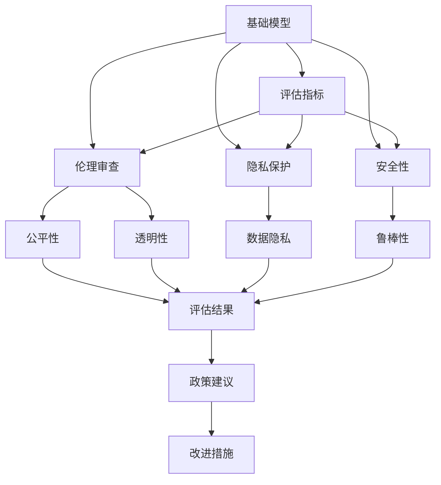
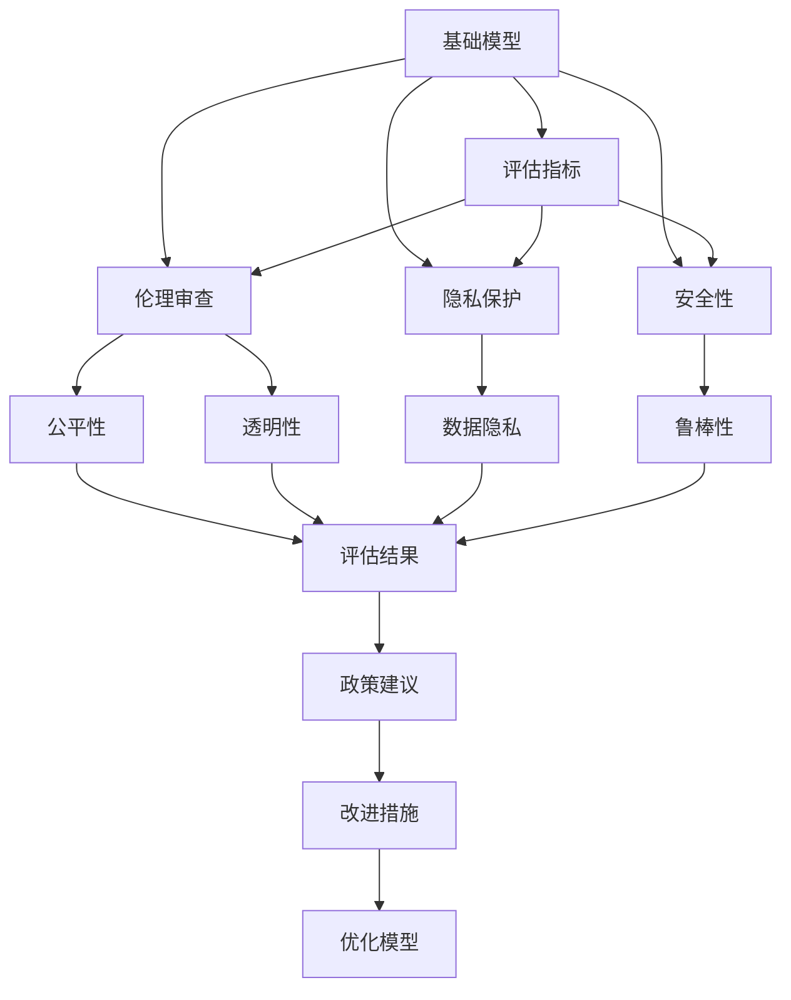

                 

# 基础模型的社会影响评估

## 1. 背景介绍

### 1.1 问题由来

近年来，人工智能(AI)技术迅猛发展，基础模型（如深度神经网络）被广泛应用于各个领域，带来了显著的经济和社会效益。然而，随着基础模型的日益普及，其社会影响也逐渐显现，引发了关于技术伦理、隐私保护、就业等诸多争议。这些问题不仅关乎技术本身，还涉及更为深远的社会结构与文化层面。

因此，评估基础模型的社会影响，不仅有助于规范AI技术的健康发展，还能够为相关政策的制定提供科学依据。

### 1.2 问题核心关键点

基础模型评估需关注的核心点包括：
1. **伦理道德**：基础模型是否遵守公平、透明、无偏见的原则。
2. **隐私保护**：模型在数据处理和应用过程中是否保护用户隐私。
3. **就业影响**：模型自动化替代人类工作对就业市场的影响。
4. **安全性与可控性**：模型是否存在安全漏洞，是否可控。
5. **社会公平性**：模型是否加剧或缓解社会不平等现象。
6. **技术依赖性**：模型是否过度依赖特定技术，导致技术闭环。

### 1.3 问题研究意义

基础模型评估具有重要的研究意义：
1. **规范技术发展**：指导AI技术在道德、隐私、安全等方面的合规使用，促进其健康发展。
2. **制定政策依据**：为政府和行业制定相关政策和标准提供科学依据。
3. **提升技术应用效果**：通过评估模型影响，提升其在实际应用中的有效性和可靠性。
4. **保障用户权益**：确保用户在使用基础模型产品和服务时，其权益得到保障。

## 2. 核心概念与联系

### 2.1 核心概念概述

基础模型的社会影响评估涉及多个关键概念：

- **基础模型**：指用于数据处理、推理和决策的人工智能模型，如深度神经网络、逻辑回归等。
- **社会影响**：基础模型在社会经济、伦理道德、隐私保护等方面的综合影响。
- **评估指标**：用于量化和分析基础模型社会影响的指标，如公平性、透明性、鲁棒性等。
- **伦理审查**：对基础模型进行伦理道德层面的评估和审查。
- **隐私保护**：保障用户数据隐私，防止数据泄露和滥用。
- **安全性**：确保基础模型在运行过程中不受攻击和干扰。

这些概念之间存在着紧密的联系，通过评估指标和方法，可以对基础模型的社会影响进行全面系统的分析。

### 2.2 概念间的关系

基础模型的社会影响评估涉及多个概念，它们之间的关系可以通过以下Mermaid流程图来展示：



这个流程图展示了大模型评估过程中各概念之间的关系：
- 基础模型通过评估指标进行多维度评估。
- 评估指标包括伦理审查、隐私保护和安全性等多个方面。
- 评估结果将提供政策建议和改进措施，指导基础模型的优化。

### 2.3 核心概念的整体架构

最终，我们可以使用以下综合的流程图来展示基础模型的社会影响评估过程：



这个综合流程图展示了从基础模型到评估结果的完整过程，包括模型评估、指标分析、政策建议和模型优化等多个环节。

## 3. 核心算法原理 & 具体操作步骤

### 3.1 算法原理概述

基础模型的社会影响评估通常采用多维度评估方法，结合定量分析和定性评估，综合考量模型的公平性、透明性、隐私保护、安全性等因素。

其核心原理如下：
1. **数据收集**：收集与基础模型相关的数据，包括模型的训练数据、推理数据和应用场景等。
2. **指标量化**：定义和量化评估指标，如公平性指数、透明度分数、隐私风险等。
3. **模型分析**：利用统计学、社会学等方法，分析模型在不同场景下的表现和影响。
4. **结果解读**：将评估结果转化为可理解的政策建议和改进措施，指导模型的优化。

### 3.2 算法步骤详解

基础模型的社会影响评估通常包括以下几个关键步骤：

**Step 1: 数据收集与预处理**
- 收集基础模型的训练数据、推理数据和应用场景等。
- 对数据进行清洗和标准化处理，去除异常和噪声数据。

**Step 2: 指标定义与量化**
- 定义评估指标，如公平性、透明性、隐私保护、安全性等。
- 根据定义的指标，对基础模型的各个维度进行量化评估，如公平性指数、透明度分数、隐私风险等。

**Step 3: 模型分析与评估**
- 利用统计学、社会学等方法，分析模型在不同场景下的表现和影响。
- 结合数据和指标，对模型的社会影响进行综合评估，找出模型的优势和劣势。

**Step 4: 结果解读与建议**
- 将评估结果转化为可理解的政策建议和改进措施。
- 针对评估结果，提出具体的优化方案，指导模型的改进和优化。

**Step 5: 模型优化与迭代**
- 根据政策建议和改进措施，对模型进行优化。
- 持续迭代优化模型，提升其社会影响评估的准确性和可靠性。

### 3.3 算法优缺点

基础模型社会影响评估的主要优点包括：
1. **多维度评估**：综合考量模型的多个维度，评估其社会影响。
2. **全面覆盖**：评估指标和分析方法全面覆盖模型的各个方面，提供综合评估结果。
3. **政策指导**：为政策制定提供科学依据，指导模型的合规使用。

其主要缺点包括：
1. **数据依赖**：评估结果高度依赖于数据质量和完整性。
2. **复杂性高**：评估过程涉及多学科知识，评估难度较大。
3. **时间成本高**：评估过程耗时长，需要大量人力和时间资源。

### 3.4 算法应用领域

基础模型社会影响评估在多个领域有广泛应用，包括但不限于：
1. **医疗健康**：评估医疗AI模型对患者隐私、诊断公平性、治疗透明性的影响。
2. **金融服务**：评估金融AI模型在信用评分、欺诈检测、客户服务等方面的公平性、透明性和安全性。
3. **教育培训**：评估教育AI模型在个性化推荐、学生评估、课程推荐等方面的公平性、透明性和隐私保护。
4. **社会治理**：评估社会治理AI模型在公共安全、城市管理、环境保护等方面的社会公平性、透明性和隐私保护。

## 4. 数学模型和公式 & 详细讲解 & 举例说明

### 4.1 数学模型构建

基础模型社会影响评估涉及多个评估指标，如公平性、透明性、隐私保护、安全性等。我们以公平性评估为例，介绍评估模型的数学模型构建。

假设基础模型 $M$ 在训练数据集 $\mathcal{D}$ 上的评估结果为 $\mathbf{y}=(y_1, y_2, \ldots, y_n)$，其中 $y_i$ 表示模型对数据样本 $x_i$ 的预测结果。定义公平性指标 $\mathbf{f}=(\alpha_1, \alpha_2, \ldots, \alpha_k)$，其中 $\alpha_i$ 表示模型在 $i$ 维特征上的公平性得分。

公平性评估的数学模型为：

$$
\mathbf{f} = \mathbf{g}(\mathbf{y}, \mathbf{X})
$$

其中 $\mathbf{X}$ 为模型的输入特征，$\mathbf{g}$ 为公平性评估函数，将模型的预测结果 $\mathbf{y}$ 和输入特征 $\mathbf{X}$ 映射为公平性指标 $\mathbf{f}$。

### 4.2 公式推导过程

以二分类问题为例，介绍公平性评估的公式推导过程。假设模型 $M$ 在特征 $x$ 上的预测结果为 $y$，定义两个子群体分别为 $A$ 和 $B$，其中 $A$ 为少数群体，$B$ 为多数群体。

模型的公平性指标为 $F_1$ 得分，公式为：

$$
F_1 = 2 \times \frac{precision_A \times recall_A}{precision_A + recall_A}
$$

其中 $precision_A$ 和 $recall_A$ 分别表示模型在子群体 $A$ 上的精确度和召回率。

根据 $F_1$ 得分，可以进一步计算模型的公平性指数 $F$，公式为：

$$
F = \frac{F_1_A + F_1_B}{2}
$$

其中 $F_1_A$ 和 $F_1_B$ 分别表示子群体 $A$ 和 $B$ 的 $F_1$ 得分。

### 4.3 案例分析与讲解

假设某金融机构使用基础模型进行信用评分。在评估过程中，发现模型在男性和女性客户之间的信用评分存在显著差异，即模型不公平。分析原因可能是由于历史数据中男性客户的样本较多，导致模型过度拟合。

通过计算 $F_1$ 得分和公平性指数 $F$，评估模型的公平性，提出如下改进措施：
1. 引入性别平衡的数据增强技术，增加女性客户的样本数量。
2. 设计公平性约束的损失函数，限制模型在性别特征上的差异。
3. 定期重新训练模型，确保模型公平性得到持续改进。

## 5. 项目实践：代码实例和详细解释说明

### 5.1 开发环境搭建

在进行社会影响评估的代码实现前，我们需要准备好开发环境。以下是使用Python进行PyTorch开发的环境配置流程：

1. 安装Anaconda：从官网下载并安装Anaconda，用于创建独立的Python环境。

2. 创建并激活虚拟环境：
```bash
conda create -n pytorch-env python=3.8 
conda activate pytorch-env
```

3. 安装PyTorch：根据CUDA版本，从官网获取对应的安装命令。例如：
```bash
conda install pytorch torchvision torchaudio cudatoolkit=11.1 -c pytorch -c conda-forge
```

4. 安装各类工具包：
```bash
pip install numpy pandas scikit-learn matplotlib tqdm jupyter notebook ipython
```

完成上述步骤后，即可在`pytorch-env`环境中开始评估实践。

### 5.2 源代码详细实现

我们以医疗AI模型为例，给出使用Python对基础模型进行公平性评估的PyTorch代码实现。

首先，定义评估函数：

```python
from sklearn.metrics import f1_score

def fair_eval(y_true, y_pred):
    # 计算公平性得分
    precision_A = f1_score(y_true, y_pred, pos_label=1, average='binary')
    recall_A = f1_score(y_true, y_pred, pos_label=0, average='binary')
    
    # 计算公平性指数
    f_A = 2 * (precision_A * recall_A) / (precision_A + recall_A)
    F = (f_A + f_B) / 2
    
    return F
```

然后，定义评估数据和模型：

```python
import torch
from torch.utils.data import DataLoader
from torchvision import datasets, transforms

# 数据预处理
transform = transforms.Compose([
    transforms.ToTensor(),
    transforms.Normalize(mean=[0.5, 0.5, 0.5], std=[0.5, 0.5, 0.5])
])

# 加载数据集
train_dataset = datasets.CIFAR10(root='./data', train=True, download=True, transform=transform)
test_dataset = datasets.CIFAR10(root='./data', train=False, download=True, transform=transform)

# 定义模型
model = torchvision.models.resnet18(pretrained=True)

# 定义评估函数
eval_loader = DataLoader(test_dataset, batch_size=64, shuffle=True)

def evaluate(model, eval_loader):
    model.eval()
    y_true = []
    y_pred = []
    with torch.no_grad():
        for batch in eval_loader:
            inputs, labels = batch
            outputs = model(inputs)
            y_pred.extend(outputs.argmax(dim=1).tolist())
            y_true.extend(labels.tolist())
    
    return fair_eval(y_true, y_pred)
```

最后，启动评估流程：

```python
print(evaluate(model, eval_loader))
```

以上就是使用PyTorch对基础模型进行公平性评估的完整代码实现。可以看到，通过简单的函数调用，我们可以快速计算模型的公平性得分和公平性指数。

### 5.3 代码解读与分析

让我们再详细解读一下关键代码的实现细节：

**fair_eval函数**：
- 定义公平性得分 $F_1$，计算少数群体 $A$ 和多数群体 $B$ 的 $F_1$ 得分。
- 计算公平性指数 $F$，将 $F_1$ 得分平均后取中值。

**DataLoader类**：
- 用于加载测试数据集，设置批次大小和随机化方式。
- 实现模型对测试数据的分批次迭代，简化代码实现。

**evaluate函数**：
- 定义模型评估流程，包括模型前向传播、结果收集和公平性计算。
- 使用torch.no_grad()简化代码实现，避免计算梯度。

**评估流程**：
- 定义测试数据集和模型，加载评估数据集。
- 对模型进行评估，计算公平性得分和指数。
- 输出评估结果，指导模型优化。

可以看到，通过Python和PyTorch的简单封装，基础模型的公平性评估变得高效便捷。开发者可以将更多精力放在数据处理和模型优化上，而不必过多关注底层的实现细节。

当然，实际应用中还需要考虑更多因素，如数据收集的代表性、模型的优化策略、评估指标的合理性等，才能得到更加精准的评估结果。

## 6. 实际应用场景

### 6.1 医疗健康

在医疗健康领域，基础模型的社会影响评估尤为重要。医疗AI模型往往涉及大量敏感数据，如患者的病历、基因信息等。因此，模型在隐私保护和公平性方面需严格要求。

以医疗影像分类为例，评估模型在不同类型的病人群体中的表现是否公平。如果模型在男性和女性患者之间存在差异，可能由数据不平衡或模型设计缺陷引起。评估结果将指导模型优化，确保模型对不同群体的公平性。

### 6.2 金融服务

金融服务领域的基础模型需评估其在信用评分、欺诈检测等任务上的透明性和公平性。如果模型存在偏见，将影响金融机构的风险评估和决策。

通过评估模型在不同性别、年龄、收入水平等特征上的表现，识别出可能存在的偏见。提出相应的改进措施，如调整模型参数、引入特征平衡等，以确保模型的公平性和透明性。

### 6.3 教育培训

在教育培训领域，基础模型需评估其在个性化推荐、学生评估、课程推荐等任务上的公平性和透明性。模型需确保对所有学生的公平对待，避免因算法偏见导致的不平等现象。

通过评估模型在学生性别、种族、社会经济背景等方面的表现，识别出可能存在的偏见。提出相应的改进措施，如调整算法参数、引入多样性数据等，以确保模型的公平性和透明性。

### 6.4 社会治理

社会治理领域的基础模型需评估其在公共安全、城市管理、环境保护等任务上的公平性、透明性和隐私保护。模型需确保对所有公民的公平对待，避免因算法偏见导致的社会不公。

通过评估模型在性别、种族、区域等特征上的表现，识别出可能存在的偏见。提出相应的改进措施，如调整算法参数、引入多样化数据等，以确保模型的公平性和透明性。

## 7. 工具和资源推荐

### 7.1 学习资源推荐

为了帮助开发者系统掌握基础模型社会影响评估的理论基础和实践技巧，这里推荐一些优质的学习资源：

1. 《人工智能伦理与治理》系列博文：由人工智能伦理专家撰写，深入浅出地介绍了AI伦理、隐私保护、公平性等方面的知识。

2. 《数据科学导论》课程：斯坦福大学开设的数据科学课程，涵盖数据预处理、模型评估、模型优化等基本概念和实践技能。

3. 《隐私保护与数据安全》书籍：隐私保护领域经典书籍，系统介绍了隐私保护的理论和实践方法。

4. 《公平性、透明性与可解释性》专题研讨会：聚焦于AI模型的公平性、透明性和可解释性研究，汇集了领域的顶级专家进行深度分享。

5. 《AI治理：理论、技术与实践》期刊：专注于AI治理的理论研究和实践应用，提供最新的研究成果和案例分析。

通过对这些资源的学习实践，相信你一定能够全面掌握基础模型社会影响评估的理论基础和实践技能。

### 7.2 开发工具推荐

高效的开发离不开优秀的工具支持。以下是几款用于基础模型评估开发的常用工具：

1. PyTorch：基于Python的开源深度学习框架，灵活动态的计算图，适合快速迭代研究。支持丰富的深度学习模型和评估指标。

2. TensorFlow：由Google主导开发的开源深度学习框架，生产部署方便，适合大规模工程应用。提供多种评估指标和工具。

3. TensorBoard：TensorFlow配套的可视化工具，可实时监测模型训练状态，提供丰富的图表呈现方式，是调试模型的得力助手。

4. Weights & Biases：模型训练的实验跟踪工具，可以记录和可视化模型训练过程中的各项指标，方便对比和调优。

5. OpenAI Gym：模拟环境，用于训练和评估强化学习模型。提供丰富的环境和评估指标，支持多学科研究。

合理利用这些工具，可以显著提升基础模型评估任务的开发效率，加快创新迭代的步伐。

### 7.3 相关论文推荐

基础模型评估技术的快速发展，离不开学界的持续研究。以下是几篇奠基性的相关论文，推荐阅读：

1. Fairness in Machine Learning（即公平机器学习）：提出公平机器学习的定义和衡量方法，为后续研究奠定了基础。

2. Explaining Deep Learning Models（即解释深度学习模型）：提出模型解释和可解释性评估方法，为理解模型决策过程提供了新思路。

3. Privacy-Preserving Deep Learning（即隐私保护深度学习）：提出隐私保护的方法和工具，为保护用户数据提供了新手段。

4. Ethical AI（即人工智能伦理）：提出AI伦理的理论框架和方法，指导AI技术的健康发展。

5. Fairness Constraints for Neural Networks（即神经网络公平性约束）：提出公平性约束的方法和工具，为解决模型偏见提供了新思路。

这些论文代表了大模型评估技术的发展脉络。通过学习这些前沿成果，可以帮助研究者把握学科前进方向，激发更多的创新灵感。

除上述资源外，还有一些值得关注的前沿资源，帮助开发者紧跟基础模型评估技术的最新进展，例如：

1. arXiv论文预印本：人工智能领域最新研究成果的发布平台，包括大量尚未发表的前沿工作，学习前沿技术的必读资源。

2. 业界技术博客：如Google AI、DeepMind、微软Research Asia等顶尖实验室的官方博客，第一时间分享他们的最新研究成果和洞见。

3. 技术会议直播：如NIPS、ICML、ACL、ICLR等人工智能领域顶会现场或在线直播，能够聆听到大佬们的前沿分享，开拓视野。

4. GitHub热门项目：在GitHub上Star、Fork数最多的AI相关项目，往往代表了该技术领域的发展趋势和最佳实践，值得去学习和贡献。

5. 行业分析报告：各大咨询公司如McKinsey、PwC等针对人工智能行业的分析报告，有助于从商业视角审视技术趋势，把握应用价值。

总之，对于基础模型社会影响评估技术的学习和实践，需要开发者保持开放的心态和持续学习的意愿。多关注前沿资讯，多动手实践，多思考总结，必将收获满满的成长收益。

## 8. 总结：未来发展趋势与挑战

### 8.1 总结

本文对基础模型的社会影响评估方法进行了全面系统的介绍。首先阐述了基础模型的定义和评估的必要性，明确了模型评估在社会公平、隐私保护、就业影响等方面的重要性。其次，从原理到实践，详细讲解了基础模型评估的数学模型和关键步骤，给出了评估任务开发的完整代码实例。同时，本文还广泛探讨了基础模型评估方法在医疗健康、金融服务、教育培训、社会治理等多个行业领域的应用前景，展示了评估范式的巨大潜力。最后，本文精选了评估技术的各类学习资源，力求为读者提供全方位的技术指引。

通过本文的系统梳理，可以看到，基础模型的社会影响评估技术正在成为AI技术发展的重要保障，极大地提升了模型的公平性、透明性和安全性，为构建健康、可持续的人工智能系统铺平了道路。未来，伴随基础模型和评估方法的不懈探索，人工智能技术必将在更广阔的应用领域大放异彩。

### 8.2 未来发展趋势

展望未来，基础模型评估技术将呈现以下几个发展趋势：

1. **评估指标多元化**：从单一的公平性、透明性等指标，扩展到多维度的评估指标体系，如隐私保护、安全性、可解释性等。

2. **自动化评估工具**：开发自动化评估工具，利用机器学习和自然语言处理技术，提高评估效率和准确性。

3. **模型可解释性增强**：结合符号化知识图谱和自然语言推理技术，增强模型的可解释性和透明度。

4. **跨领域应用推广**：将评估方法推广到其他领域，如金融、教育、法律等，提升各个行业的AI技术应用水平。

5. **全球协同研究**：建立全球性的AI伦理和评估标准，推动各国在AI技术发展上的协同合作。

以上趋势凸显了基础模型评估技术的广阔前景。这些方向的探索发展，必将进一步提升基础模型在社会影响方面的评估能力，为构建安全、可靠、可解释、可控的智能系统提供坚实保障。

### 8.3 面临的挑战

尽管基础模型评估技术已经取得了瞩目成就，但在迈向更加智能化、普适化应用的过程中，它仍面临着诸多挑战：

1. **数据质量问题**：评估结果高度依赖于数据质量和代表性，如何获取高质量的数据是评估工作的难点。

2. **模型复杂性高**：基础模型评估涉及多学科知识，评估难度较大。

3. **资源消耗高**：评估过程需要大量的计算资源和时间，如何高效地进行评估仍是挑战。

4. **公平性难以量化**：公平性评估涉及多个维度，量化难度较大，难以找到统一的标准。

5. **政策法规滞后**：现有政策法规滞后于技术发展，评估结果难以转化为具体的政策措施。

6. **社会认知差异**：不同社会群体对模型公平性和透明性的认知差异，如何平衡各方利益是重要挑战。

正视评估面临的这些挑战，积极应对并寻求突破，将使基础模型评估技术走向成熟，为构建健康、可持续的人工智能系统提供坚实保障。

### 8.4 研究展望

面向未来，基础模型评估技术的研发需要从以下几个方面寻求新的突破：

1. **自动化工具开发**：开发自动化评估工具，利用机器学习和自然语言处理技术，提高评估效率和准确性。

2. **跨领域应用推广**：将评估方法推广到其他领域，如金融、教育、法律等，提升各个行业的AI技术应用水平。

3. **全球协同研究**：建立全球性的AI伦理和评估标准，推动各国在AI技术发展上的协同合作。

4. **模型可解释性增强**：结合符号化知识图谱和自然语言推理技术，增强模型的可解释性和透明度。

5. **数据质量保障**：研究高效的数据收集和处理技术，确保评估数据的质量和代表性。

6. **政策法规跟进**：推动政策法规的跟进和完善，为评估结果提供法律保障。

这些研究方向的探索，必将引领基础模型评估技术迈向更高的台阶，为构建安全、可靠、可解释、可控的智能系统提供坚实保障。面向未来，基础模型评估技术还需要与其他人工智能技术进行更深入的融合，如知识表示、因果推理、强化学习等，多路径协同发力，共同推动自然语言理解和智能交互系统的进步。只有勇于创新、敢于突破，才能不断拓展基础模型的边界，让智能技术更好地造福人类社会。

## 9. 附录：常见问题与解答

**Q1：基础模型的社会影响评估是否适用于所有AI应用？**

A: 基础模型的社会影响评估主要适用于具有一定社会影响力的AI应用，如医疗健康、金融服务、教育培训等。这些应用涉及大量敏感数据和重要决策，需要严格评估其社会影响。而对于一些简单、低风险的应用，如图像识别、语音识别等，评估需求可能相对较低。

**Q2：如何评估基础模型的公平性？**

A: 评估基础模型的公平性通常使用如下指标：
1. 均值差异：计算模型在不同群体之间的预测均值差异，判断是否存在显著差异。
2. 方差比率：计算模型在不同群体之间的预测方差比率，判断是否

