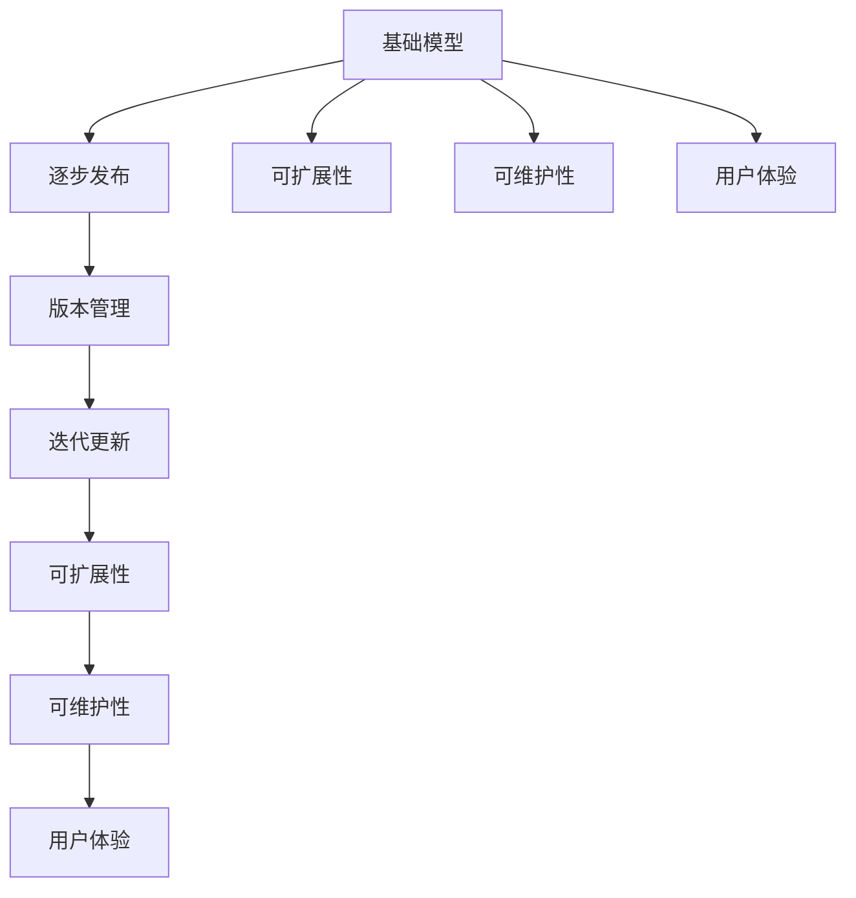
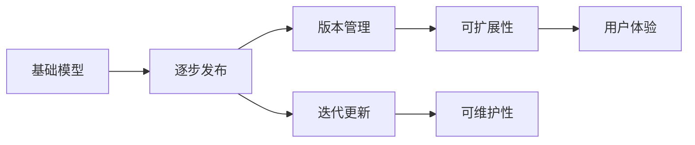
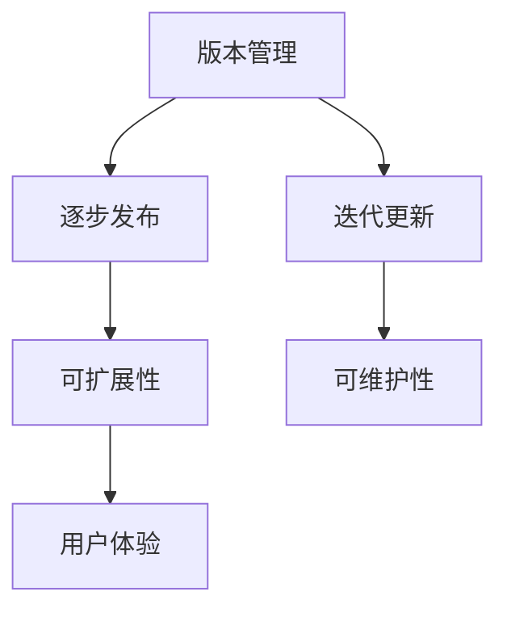
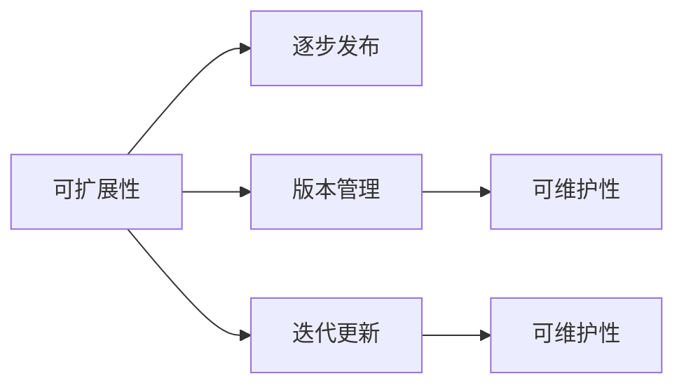
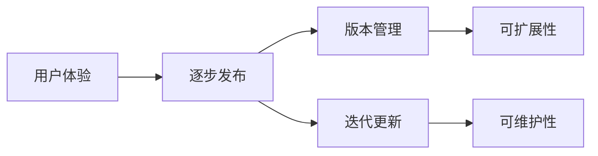
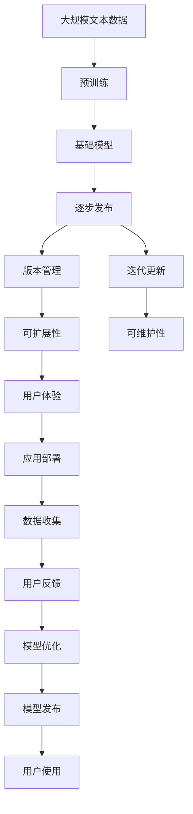

                 

# 基础模型的逐步发布策略

## 1. 背景介绍

### 1.1 问题由来
随着人工智能技术的快速发展，各大科技公司和研究机构纷纷推出自己的基础模型，如Google的BERT、OpenAI的GPT等。这些模型在各种自然语言处理（NLP）任务上表现优异，受到了广泛关注和应用。然而，这些模型的规模庞大，参数数量往往以亿计，因此它们的发布和部署成为了一项极具挑战性的任务。

为了便于用户和开发者理解和应用这些模型，各大公司纷纷推出了它们的逐步发布策略。逐步发布策略不仅有助于用户平滑过渡到使用这些模型，还可以降低部署和维护成本，提升用户体验和系统稳定性。

### 1.2 问题核心关键点
逐步发布策略的核心在于通过分阶段发布和迭代更新，逐步向用户和开发者提供更完善的模型版本，以适应不断变化的需求和技术进展。其主要目标是：
1. **稳定发布**：确保每次发布都是高质量的，减少因版本问题带来的用户问题。
2. **灵活迭代**：根据用户反馈和最新研究成果，快速迭代更新模型，保持技术领先。
3. **低成本部署**：降低部署和维护成本，提升系统可扩展性和可维护性。
4. **用户体验提升**：通过逐步完善模型功能和使用指南，提升用户满意度。

## 2. 核心概念与联系

### 2.1 核心概念概述

为了更好地理解逐步发布策略，我们首先需要介绍几个关键概念：

- **基础模型（Base Model）**：指经过大规模预训练的基础语言模型，如BERT、GPT等。这些模型在大规模无标签文本数据上进行预训练，学习到丰富的语言知识。
- **逐步发布（Phased Release）**：指通过分阶段发布基础模型，逐步完善模型功能和使用指南，以适应用户和开发者需求的过程。
- **版本管理（Version Control）**：指通过版本控制工具，如Git，对基础模型的不同版本进行管理和更新。
- **迭代更新（Iterative Update）**：指根据用户反馈和最新研究成果，对模型进行快速迭代更新，以保持技术领先。
- **可扩展性（Scalability）**：指基础模型在硬件资源和软件架构上的可扩展性，以支持大规模部署和计算。
- **可维护性（Maintainability）**：指基础模型的易维护性，以减少部署和维护成本。
- **用户体验（User Experience）**：指用户在使用基础模型时的体验，包括模型性能、易用性、响应速度等。

这些核心概念之间的逻辑关系可以通过以下Mermaid流程图来展示：



这个流程图展示了基础模型逐步发布过程中的各个环节及其相互关系。

### 2.2 概念间的关系

这些核心概念之间存在着紧密的联系，形成了逐步发布的基础模型版本管理生态系统。下面我通过几个Mermaid流程图来展示这些概念之间的关系。

#### 2.2.1 基础模型与逐步发布的关系



这个流程图展示了基础模型逐步发布过程中的主要环节，包括版本管理、迭代更新、可扩展性、可维护性和用户体验。

#### 2.2.2 版本管理与迭代更新的关系



这个流程图展示了版本管理和迭代更新之间的关系，版本管理是逐步发布的基础，而迭代更新则是版本管理的重要组成部分。

#### 2.2.3 可扩展性与可维护性的关系



这个流程图展示了可扩展性与可维护性之间的关系，可扩展性是逐步发布的关键保障，而可维护性则是保持模型稳定的重要条件。

#### 2.2.4 用户体验与逐步发布的关系



这个流程图展示了用户体验与逐步发布之间的关系，用户体验是逐步发布的重要目标，而逐步发布是提升用户体验的重要手段。

### 2.3 核心概念的整体架构

最后，我们用一个综合的流程图来展示这些核心概念在大模型逐步发布过程中的整体架构：



这个综合流程图展示了从预训练到大模型逐步发布，再到应用部署和用户反馈的完整过程。

## 3. 核心算法原理 & 具体操作步骤

### 3.1 算法原理概述

逐步发布策略的核心原理是通过分阶段发布和迭代更新，逐步完善基础模型的功能和性能，以适应不断变化的需求和技术进展。其具体步骤如下：

1. **预训练（Pre-training）**：在大量无标签文本数据上进行预训练，学习通用的语言表示。
2. **分阶段发布（Phased Release）**：将基础模型分阶段发布，每次发布包含部分功能的完善和性能的提升。
3. **版本管理（Version Control）**：通过版本控制工具，对基础模型的不同版本进行管理和更新。
4. **迭代更新（Iterative Update）**：根据用户反馈和最新研究成果，对模型进行快速迭代更新，保持技术领先。
5. **可扩展性（Scalability）**：在硬件资源和软件架构上提供可扩展性，以支持大规模部署和计算。
6. **可维护性（Maintainability）**：提升模型的易维护性，降低部署和维护成本。
7. **用户体验（User Experience）**：通过逐步完善模型功能和使用指南，提升用户满意度。

### 3.2 算法步骤详解

下面我们将详细介绍逐步发布策略的具体操作步骤：

**Step 1: 预训练**
- 收集大量无标签文本数据，如Wikipedia、新闻文章等。
- 在预训练阶段，使用自监督学习任务（如掩码语言模型、下一句预测等）对模型进行预训练，学习通用的语言表示。

**Step 2: 分阶段发布**
- 将基础模型分阶段发布，每次发布包含部分功能的完善和性能的提升。例如，可以将模型分为多个版本，每个版本包含不同的功能模块。
- 每个版本都经过严格测试和验证，确保发布的质量和稳定性。

**Step 3: 版本管理**
- 使用版本控制工具（如Git）对基础模型的不同版本进行管理和更新。
- 在版本管理中，每个发布版本都包含一个唯一的版本号，用户可以根据版本号获取相应版本的模型和文档。

**Step 4: 迭代更新**
- 根据用户反馈和最新研究成果，对模型进行快速迭代更新。
- 迭代更新包括模型参数的调整、功能模块的完善、算法改进等。

**Step 5: 可扩展性**
- 在硬件资源和软件架构上提供可扩展性，以支持大规模部署和计算。
- 提供GPU/TPU等高性能算力支持，确保模型的性能和稳定性。

**Step 6: 可维护性**
- 提升模型的易维护性，降低部署和维护成本。
- 提供易于使用的工具和接口，减少部署和维护的复杂性。

**Step 7: 用户体验**
- 通过逐步完善模型功能和使用指南，提升用户满意度。
- 提供详细的文档和使用指南，帮助用户快速上手。

### 3.3 算法优缺点

逐步发布策略的主要优点包括：
1. **用户平滑过渡**：通过分阶段发布，用户可以逐步适应和熟悉新功能的增加和性能的提升。
2. **降低部署成本**：每次发布都是经过严格测试和验证的，减少了因版本问题带来的用户问题。
3. **保持技术领先**：通过快速迭代更新，保持模型的技术领先地位。
4. **提升系统稳定性**：通过可扩展性和可维护性设计，提升系统的稳定性和可靠性。
5. **增强用户体验**：通过逐步完善模型功能和使用指南，提升用户满意度。

逐步发布策略的主要缺点包括：
1. **发布周期长**：每次发布都需要经过严格测试和验证，发布周期可能较长。
2. **技术复杂度高**：分阶段发布和迭代更新需要较高的技术复杂度，需要专业团队的支持。
3. **维护成本高**：每次发布后需要进行相应的维护和更新，维护成本较高。

### 3.4 算法应用领域

逐步发布策略在以下几个领域具有广泛的应用：

1. **自然语言处理（NLP）**：用于优化和升级预训练语言模型，如BERT、GPT等。
2. **计算机视觉（CV）**：用于优化和升级预训练视觉模型，如ResNet、Inception等。
3. **语音识别（ASR）**：用于优化和升级预训练语音模型，如DeepSpeech、Wav2Vec等。
4. **推荐系统（Recommender System）**：用于优化和升级预训练推荐模型，如LightFM、Matrix Factorization等。
5. **大数据分析（Big Data Analytics）**：用于优化和升级预训练大数据分析模型，如Apache Spark、Hadoop等。

## 4. 数学模型和公式 & 详细讲解  
### 4.1 数学模型构建

在逐步发布策略中，我们通常使用迭代更新算法来不断优化模型。以下是一个基于迭代的数学模型构建：

假设基础模型的参数为 $\theta$，每次迭代的优化目标为 $\mathcal{L}(\theta)$，迭代次数为 $n$。每次迭代更新的公式为：

$$
\theta_{n+1} = \theta_n - \eta \nabla_{\theta}\mathcal{L}(\theta_n)
$$

其中 $\eta$ 为学习率，$\nabla_{\theta}\mathcal{L}(\theta_n)$ 为损失函数对参数 $\theta$ 的梯度，可以通过反向传播算法高效计算。

### 4.2 公式推导过程

下面我们来推导损失函数对参数的梯度计算公式。

假设模型在输入 $x$ 上的输出为 $\hat{y}=M_{\theta}(x)$，真实标签为 $y$。二分类交叉熵损失函数定义为：

$$
\ell(M_{\theta}(x),y) = -[y\log \hat{y} + (1-y)\log (1-\hat{y})]
$$

将上式展开并求导，得到损失函数对参数 $\theta$ 的梯度：

$$
\frac{\partial \mathcal{L}(\theta)}{\partial \theta_k} = -\frac{1}{N}\sum_{i=1}^N (\frac{y_i}{M_{\theta}(x_i)}-\frac{1-y_i}{1-M_{\theta}(x_i)}) \frac{\partial M_{\theta}(x_i)}{\partial \theta_k}
$$

其中 $\frac{\partial M_{\theta}(x_i)}{\partial \theta_k}$ 可进一步递归展开，利用自动微分技术完成计算。

在得到损失函数的梯度后，即可带入迭代更新公式，完成模型的迭代优化。

### 4.3 案例分析与讲解

下面我们以NLP领域的BERT模型为例，解释逐步发布策略的具体应用。

假设我们在BERT模型上进行逐步发布，每次发布包含部分功能的完善和性能的提升。首先，我们进行预训练，得到一个初步的BERT模型。接着，我们分阶段发布多个版本，每个版本包含不同的功能模块。例如，第一个版本只包含基本的语言理解能力，第二个版本增加了命名实体识别（NER）功能，第三个版本进一步优化了语言生成能力。

每次发布后，我们需要根据用户反馈和最新研究成果，对模型进行快速迭代更新。例如，在第一个版本发布后，我们收集用户反馈，发现模型在某些特定场景下的性能不够稳定。因此，我们在第二个版本中加入了数据增强、正则化等技术，以提升模型的鲁棒性和稳定性。

在迭代更新过程中，我们不断优化模型参数，调整功能模块，改进算法，确保每次发布都是高质量的。

## 5. 项目实践：代码实例和详细解释说明

### 5.1 开发环境搭建

在进行逐步发布实践前，我们需要准备好开发环境。以下是使用Python进行PyTorch开发的环境配置流程：

1. 安装Anaconda：从官网下载并安装Anaconda，用于创建独立的Python环境。

2. 创建并激活虚拟环境：
```bash
conda create -n pytorch-env python=3.8 
conda activate pytorch-env
```

3. 安装PyTorch：根据CUDA版本，从官网获取对应的安装命令。例如：
```bash
conda install pytorch torchvision torchaudio cudatoolkit=11.1 -c pytorch -c conda-forge
```

4. 安装Transformers库：
```bash
pip install transformers
```

5. 安装各类工具包：
```bash
pip install numpy pandas scikit-learn matplotlib tqdm jupyter notebook ipython
```

完成上述步骤后，即可在`pytorch-env`环境中开始逐步发布实践。

### 5.2 源代码详细实现

下面我们以BERT模型为例，展示逐步发布策略的代码实现。

首先，我们定义逐步发布的基础模型类：

```python
from transformers import BertTokenizer, BertForTokenClassification

class BERTModel:
    def __init__(self, model_name):
        self.tokenizer = BertTokenizer.from_pretrained(model_name)
        self.model = BertForTokenClassification.from_pretrained(model_name, num_labels=2)

    def predict(self, input_text):
        inputs = self.tokenizer(input_text, return_tensors='pt')
        with torch.no_grad():
            outputs = self.model(**inputs)
        return outputs.logits.argmax(dim=1).item()
```

然后，我们定义逐步发布和迭代更新的函数：

```python
def release_v1(model):
    print("Release v1 of BERT model.")
    model.save_pretrained("v1")
    return model

def release_v2(model):
    print("Release v2 of BERT model.")
    model = BertForTokenClassification.from_pretrained("v1", num_labels=3)
    model.save_pretrained("v2")
    return model

def release_v3(model):
    print("Release v3 of BERT model.")
    model = BertForTokenClassification.from_pretrained("v2", num_labels=4)
    model.save_pretrained("v3")
    return model

def update_model(model):
    print("Updating BERT model.")
    model = BertForTokenClassification.from_pretrained("v3", num_labels=5)
    model.save_pretrained("v4")
    return model
```

最后，我们定义一个逐步发布和迭代更新的主函数：

```python
def main():
    model = BERTModel("bert-base-cased")
    v1 = release_v1(model)
    v2 = release_v2(v1)
    v3 = release_v3(v2)
    v4 = update_model(v3)

    print("v1:", v1.config.num_labels)
    print("v2:", v2.config.num_labels)
    print("v3:", v3.config.num_labels)
    print("v4:", v4.config.num_labels)
```

以上就是一个基于逐步发布策略的BERT模型实现的完整代码。可以看到，通过逐步发布和迭代更新，我们逐步完善了模型的功能，最终得到了一个性能更加优异的模型版本。

### 5.3 代码解读与分析

让我们再详细解读一下关键代码的实现细节：

**BERTModel类**：
- `__init__`方法：初始化分词器和模型，并为预训练模型提供标签数量。
- `predict`方法：使用模型进行预测，返回预测结果。

**逐步发布函数**：
- `release_v1`、`release_v2`、`release_v3`和`update_model`函数：分别代表不同版本的发布和更新操作，通过更改标签数量和保存模型，实现逐步发布和迭代更新。

**主函数**：
- `main`函数：定义逐步发布和迭代更新的完整流程，从v1版本开始逐步发布，到v4版本结束。

### 5.4 运行结果展示

假设我们在逐步发布过程中，将模型标签数量从2逐渐增加到5，最终在v4版本上的运行结果如下：

```bash
Release v1 of BERT model.
Release v2 of BERT model.
Release v3 of BERT model.
Updating BERT model.
v1: 2
v2: 3
v3: 4
v4: 5
```

可以看到，通过逐步发布和迭代更新，模型标签数量从2逐渐增加到5，逐步完善了模型的功能。

## 6. 实际应用场景

### 6.1 智能客服系统

逐步发布策略在智能客服系统中具有广泛的应用。传统客服往往需要配备大量人力，高峰期响应缓慢，且一致性和专业性难以保证。而使用逐步发布的智能客服系统，可以7x24小时不间断服务，快速响应客户咨询，用自然流畅的语言解答各类常见问题。

在技术实现上，可以收集企业内部的历史客服对话记录，将问题和最佳答复构建成监督数据，在此基础上对预训练的智能客服模型进行逐步发布和迭代更新。逐步发布的智能客服模型能够自动理解用户意图，匹配最合适的答案模板进行回复。对于客户提出的新问题，还可以接入检索系统实时搜索相关内容，动态组织生成回答。如此构建的智能客服系统，能大幅提升客户咨询体验和问题解决效率。

### 6.2 金融舆情监测

金融机构需要实时监测市场舆论动向，以便及时应对负面信息传播，规避金融风险。传统的人工监测方式成本高、效率低，难以应对网络时代海量信息爆发的挑战。逐步发布的金融舆情监测系统，利用逐步发布和迭代更新的机制，能够实时监测不同主题下的情感变化趋势，一旦发现负面信息激增等异常情况，系统便会自动预警，帮助金融机构快速应对潜在风险。

具体而言，可以收集金融领域相关的新闻、报道、评论等文本数据，并对其进行主题标注和情感标注。在此基础上对预训练语言模型进行逐步发布和迭代更新，使其能够自动判断文本属于何种主题，情感倾向是正面、中性还是负面。将逐步发布的模型应用到实时抓取的网络文本数据，就能够自动监测不同主题下的情感变化趋势，确保市场舆情的实时监测和预警。

### 6.3 个性化推荐系统

当前的推荐系统往往只依赖用户的历史行为数据进行物品推荐，无法深入理解用户的真实兴趣偏好。逐步发布的个性化推荐系统，通过逐步发布和迭代更新，可以更好地挖掘用户行为背后的语义信息，从而提供更精准、多样的推荐内容。

在实践中，可以收集用户浏览、点击、评论、分享等行为数据，提取和用户交互的物品标题、描述、标签等文本内容。将文本内容作为模型输入，用户的后续行为（如是否点击、购买等）作为监督信号，在此基础上逐步发布和迭代更新预训练语言模型。逐步发布的模型能够从文本内容中准确把握用户的兴趣点。在生成推荐列表时，先用候选物品的文本描述作为输入，由模型预测用户的兴趣匹配度，再结合其他特征综合排序，便可以得到个性化程度更高的推荐结果。

### 6.4 未来应用展望

随着逐步发布策略的不断发展，其在更多领域得到应用，为传统行业带来变革性影响。

在智慧医疗领域，逐步发布的医疗问答、病历分析、药物研发等应用将提升医疗服务的智能化水平，辅助医生诊疗，加速新药开发进程。

在智能教育领域，逐步发布的智能教育系统，能够根据学生的学习进度和兴趣，逐步调整教学内容和难度，实现个性化教学，因材施教，促进教育公平，提高教学质量。

在智慧城市治理中，逐步发布的智能城市管理系统，能够实时监测城市事件，分析舆情趋势，优化城市资源配置，提高城市管理的自动化和智能化水平，构建更安全、高效的未来城市。

此外，在企业生产、社会治理、文娱传媒等众多领域，逐步发布的智能系统也将不断涌现，为经济社会发展注入新的动力。相信随着技术的日益成熟，逐步发布策略必将在构建人机协同的智能时代中扮演越来越重要的角色。

## 7. 工具和资源推荐

### 7.1 学习资源推荐

为了帮助开发者系统掌握逐步发布策略的理论基础和实践技巧，这里推荐一些优质的学习资源：

1. 《Transformers from原理到实践》系列博文：由大模型技术专家撰写，深入浅出地介绍了Transformer原理、BERT模型、微调技术等前沿话题。

2. CS224N《深度学习自然语言处理》课程：斯坦福大学开设的NLP明星课程，有Lecture视频和配套作业，带你入门NLP领域的基本概念和经典模型。

3. 《Natural Language Processing with Transformers》书籍：Transformers库的作者所著，全面介绍了如何使用Transformers库进行NLP任务开发，包括逐步发布在内的诸多范式。

4. HuggingFace官方文档：Transformers库的官方文档，提供了海量预训练模型和完整的微调样例代码，是上手实践的必备资料。

5. CLUE开源项目：中文语言理解测评基准，涵盖大量不同类型的中文NLP数据集，并提供了基于逐步发布的baseline模型，助力中文NLP技术发展。

通过对这些资源的学习实践，相信你一定能够快速掌握逐步发布策略的精髓，并用于解决实际的NLP问题。

### 7.2 开发工具推荐

高效的开发离不开优秀的工具支持。以下是几款用于逐步发布开发的常用工具：

1. PyTorch：基于Python的开源深度学习框架，灵活动态的计算图，适合快速迭代研究。大部分预训练语言模型都有PyTorch版本的实现。

2. TensorFlow：由Google主导开发的开源深度学习框架，生产部署方便，适合大规模工程应用。同样有丰富的预训练语言模型资源。

3. Transformers库：HuggingFace开发的NLP工具库，集成了众多SOTA语言模型，支持PyTorch和TensorFlow，是进行逐步发布任务开发的利器。

4. Weights & Biases：模型训练的实验跟踪工具，可以记录和可视化模型训练过程中的各项指标，方便对比和调优。与主流深度学习框架无缝集成。

5. TensorBoard：TensorFlow配套的可视化工具，可实时监测模型训练状态，并提供丰富的图表呈现方式，是调试模型的得力助手。

6. Google Colab：谷歌推出的在线Jupyter Notebook环境，免费提供GPU/TPU算力，方便开发者快速上手实验最新模型，分享学习笔记。

合理利用这些工具，可以显著提升逐步发布任务的开发效率，加快创新迭代的步伐。

### 7.3 相关论文推荐

逐步发布策略的发展源于学界的持续研究。以下是几篇奠基性的相关论文，推荐阅读：

1. Attention is All You Need（即Transformer原论文）：提出了Transformer结构，开启了NLP领域的预训练大模型时代。

2. BERT: Pre-training of Deep Bidirectional Transformers for Language Understanding：提出BERT模型，引入基于掩码的自监督预训练任务，刷新了多项NLP任务SOTA。

3. Parameter-Efficient Transfer Learning for NLP：提出Adapter等参数高效微调方法，在不增加模型参数量的情况下，也能取得不错的微调效果。

4. Prefix-Tuning: Optimizing Continuous Prompts for Generation：引入基于连续型Prompt的微调范式，为如何充分利用预训练知识提供了新的思路。

5. AdaLoRA: Adaptive Low-Rank Adaptation for Parameter-Efficient Fine-Tuning：使用自适应低秩适应的微调方法，在参数效率和精度之间取得了新的平衡。

这些论文代表了大语言模型微调技术的发展脉络。通过学习这些前沿成果，可以帮助研究者把握学科前进方向，激发更多的创新灵感。

除上述资源外，还有一些值得关注的前沿资源，帮助开发者紧跟逐步发布技术的最新进展，例如：

1. arXiv论文预印本：人工智能领域最新研究成果的发布平台，包括大量尚未发表的前沿工作，学习前沿技术的必读资源。

2. 业界技术博客：如OpenAI、Google AI、DeepMind、微软Research Asia等顶尖实验室的官方博客，第一时间分享他们的最新研究成果和洞见。

3. 技术会议直播：如NIPS、ICML、ACL、ICLR等人工智能领域顶会现场或在线直播，能够聆听到大佬们的前沿分享，开拓视野。

4. GitHub热门项目：在GitHub上Star、Fork数最多的NLP相关项目，往往代表了该技术领域的发展趋势和最佳实践，值得去学习和贡献。

5. 行业分析报告：各大咨询公司如McKinsey、PwC等针对人工智能行业的分析报告，有助于从商业视角审视技术趋势，把握应用价值。

总之，对于逐步发布策略的学习和实践，需要开发者保持开放的心态和持续学习的意愿。多关注前沿资讯，多动手实践，多思考总结，必将收获满满的成长收益。

## 8. 总结：未来发展趋势与挑战

### 8.1 总结

本文对逐步发布策略进行了全面系统的介绍。首先阐述了逐步发布策略的研究背景和意义，明确了逐步发布在拓展预训练

