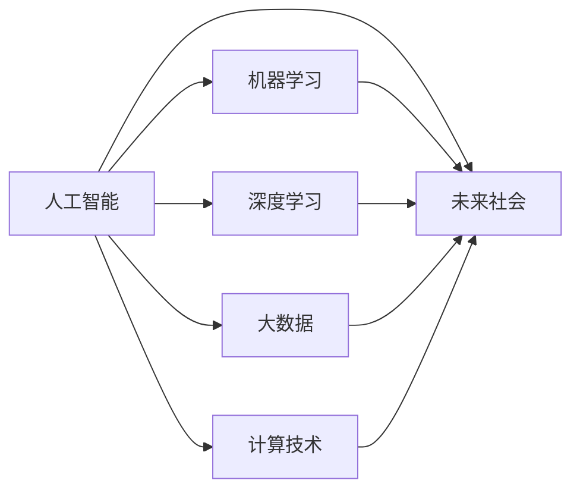

                 

# 塑造未来社会：人类计算的深远意义

> 关键词：人类计算, 人工智能, 机器学习, 深度学习, 智能算法, 大数据, 计算技术, 未来社会

## 1. 背景介绍

### 1.1 问题由来
人类社会正处于前所未有的变革时期。从工业革命到信息革命，再到当前的数字化、智能化转型，技术进步始终是社会进步的主要驱动力。特别是进入21世纪以来，计算机和互联网技术的迅猛发展，使得人类社会进入了数据驱动、智能辅助的新纪元。

然而，随着技术的深入应用，一个全新的话题逐渐成为社会关注的焦点——人类计算。什么是人类计算？它为何重要？又将如何塑造未来社会？本文将从这些问题出发，深入探讨人类计算的深远意义。

### 1.2 问题核心关键点
人类计算，简而言之，是人类与计算机之间的一种计算方式，通过利用计算机的强大计算能力，处理和分析大规模数据，挖掘其中蕴含的规律和知识，并应用于实际问题解决。它涉及到算法设计、数据处理、模型训练等多个技术领域，与人工智能、机器学习、深度学习等前沿技术密切相关。

人类计算的核心在于，将人类智慧与计算机能力结合，从而实现更高效、更精确、更智能的问题解决。其在数据科学、工程设计、社会科学、金融经济等领域有着广泛的应用前景。

### 1.3 问题研究意义
研究人类计算的深远意义，对于理解技术的未来发展趋势，推动社会的全面进步，具有重要意义：

1. **提高生产力**：通过智能化、自动化的方法，提高生产效率，降低人力成本，推动经济增长。
2. **促进创新**：利用计算能力，发现新知识、新模式、新方法，推动科学发现和技术革新。
3. **提升决策质量**：基于数据分析和模型预测，辅助决策者制定更科学、更合理的决策。
4. **改善生活质量**：通过智能家居、智能医疗、智能交通等应用，提升人们的生活水平和幸福感。
5. **推动可持续发展**：利用计算技术优化资源配置，实现环境友好型的发展。

总之，人类计算不仅是技术发展的重要里程碑，更是社会进步的强大引擎。

## 2. 核心概念与联系

### 2.1 核心概念概述

为了更好地理解人类计算的内涵，本节将介绍几个关键概念：

- **人工智能（AI）**：指通过计算机模拟人类智能的行为，包括学习、推理、感知、规划等能力。
- **机器学习（ML）**：指让计算机通过数据学习规律，自动进行决策和预测的技术。
- **深度学习（DL）**：指基于人工神经网络的机器学习方法，通过多层非线性变换，实现复杂特征的提取和表示。
- **大数据（Big Data）**：指规模庞大、结构复杂、变化迅速的数据集，是人类计算的主要数据源。
- **计算技术**：指与计算相关的各种技术，包括硬件设备、软件工具、算法模型等。
- **未来社会**：指通过技术进步，实现的社会形态的变迁，如智慧城市、智能制造、数字治理等。

这些概念之间相互联系，共同构成了人类计算的基础框架。通过算法设计和计算技术的应用，机器学习和大数据成为人类计算的核心工具，为解决实际问题提供了强有力的支持。

### 2.2 概念间的关系

人类计算涵盖了人工智能、机器学习、深度学习、大数据等多个技术领域，其核心在于将计算技术与人类智慧结合，提升问题解决的效率和精度。这些概念之间的逻辑关系可以通过以下Mermaid流程图来展示：



这个流程图展示了一些关键概念之间的联系：

1. 人工智能涵盖了机器学习、深度学习等多个子领域。
2. 机器学习和深度学习依赖于大数据和计算技术。
3. 未来社会通过人工智能、机器学习、深度学习和大数据的应用，实现智能化、自动化、数字化的发展。

这些概念共同构成了人类计算的完整生态系统，使得我们能够利用计算机的能力，更好地理解和解决实际问题。

## 3. 核心算法原理 & 具体操作步骤
### 3.1 算法原理概述

人类计算的核心在于算法设计和计算技术的应用。这里我们将重点介绍一些核心算法及其原理。

**3.1.1 机器学习算法**

机器学习算法是实现人类计算的核心工具之一。其基本原理是通过数据集训练模型，使其能够自动进行特征提取和规律学习，进而用于预测和决策。

以监督学习算法为例，其基本流程包括数据预处理、特征提取、模型训练、预测和评估等步骤。通过不断迭代优化，模型可以逐步提高预测精度和泛化能力。

**3.1.2 深度学习算法**

深度学习算法通过多层神经网络实现复杂特征的提取和表示，能够自动学习数据中的隐含模式和规律。其核心在于神经网络的结构设计和优化。

以卷积神经网络（CNN）为例，其通过卷积层、池化层和全连接层等结构，能够有效地处理图像、语音等高维数据。其训练过程包括前向传播、反向传播和梯度下降等步骤。

**3.1.3 大数据处理算法**

大数据处理算法是实现人类计算的基础。其核心在于如何高效地存储、处理和分析大规模数据。

以MapReduce算法为例，其通过分布式计算和并行处理，能够在大规模数据集上实现高效的计算和分析。其核心在于数据分片和任务分配。

### 3.2 算法步骤详解

为了更好地理解人类计算的算法流程，本节将详细介绍一些关键算法的详细步骤。

**3.2.1 监督学习算法步骤**

1. **数据预处理**：包括数据清洗、归一化、特征选择等步骤，准备用于训练的数据集。
2. **特征提取**：通过选择合适的特征向量表示方法，提取数据的特征信息。
3. **模型训练**：选择合适的模型和优化算法，对训练集进行迭代优化，找到最优模型参数。
4. **预测和评估**：使用测试集对模型进行预测，并评估预测结果的准确性和泛化能力。

**3.2.2 深度学习算法步骤**

1. **数据预处理**：包括数据归一化、分片等步骤，准备用于训练的数据集。
2. **模型定义**：定义神经网络的结构，包括卷积层、池化层、全连接层等。
3. **模型训练**：使用反向传播算法更新模型参数，最小化损失函数。
4. **模型评估**：使用测试集对模型进行评估，计算各项指标（如准确率、召回率、F1分数等）。

**3.2.3 大数据处理算法步骤**

1. **数据存储和分片**：将大规模数据集分成多个小片段，存储在分布式集群中。
2. **任务分配和执行**：通过任务调度器分配计算任务，并在分布式集群中执行。
3. **数据聚合和结果输出**：对分布式计算的结果进行聚合，并输出最终结果。

### 3.3 算法优缺点

人类计算算法具有以下优点：

1. **高效性**：能够自动处理大规模数据，提高问题解决的效率。
2. **精度高**：通过深度学习和神经网络等算法，能够实现高精度的特征提取和模式识别。
3. **泛化能力强**：通过不断迭代优化，模型能够适应新数据和新场景。

同时，这些算法也存在一些缺点：

1. **资源消耗大**：训练和推理需要大量的计算资源和时间，对硬件设备要求较高。
2. **数据依赖性强**：算法的性能高度依赖于数据的质量和数量，难以处理噪声和异常数据。
3. **可解释性不足**：模型往往是"黑盒"系统，难以解释其决策过程和逻辑。
4. **风险控制难**：模型在处理敏感数据时可能引入隐私和安全性问题。

尽管存在这些缺点，人类计算算法仍然是当前解决复杂问题的重要手段。未来，随着技术的不断进步，这些问题有望逐步得到解决。

### 3.4 算法应用领域

人类计算算法已经广泛应用于多个领域，具体包括：

- **金融领域**：通过算法优化投资策略、风险管理、信用评估等。
- **医疗领域**：利用算法辅助诊断、治疗、药物研发等。
- **交通运输**：通过算法优化路线规划、智能交通、物流管理等。
- **制造业**：通过算法优化生产流程、设备维护、供应链管理等。
- **环境保护**：通过算法分析环境数据、预测气候变化、优化资源利用等。

## 4. 数学模型和公式 & 详细讲解 & 举例说明

### 4.1 数学模型构建

人类计算的核心在于数学模型的构建。下面介绍几个常见的数学模型及其构建方法。

**4.1.1 线性回归模型**

线性回归模型是监督学习算法中的基础模型。其数学公式为：

$$ y = \beta_0 + \beta_1 x_1 + \beta_2 x_2 + \cdots + \beta_n x_n $$

其中 $y$ 为输出变量，$\beta_0$ 为截距，$\beta_1, \beta_2, \cdots, \beta_n$ 为回归系数，$x_1, x_2, \cdots, x_n$ 为输入变量。

线性回归模型的训练目标是找到最优的回归系数 $\beta_0, \beta_1, \beta_2, \cdots, \beta_n$，使得损失函数最小化。常用的损失函数包括均方误差（MSE）和平均绝对误差（MAE）。

### 4.2 公式推导过程

以均方误差为例，其损失函数为：

$$ \mathcal{L} = \frac{1}{N} \sum_{i=1}^N (y_i - \hat{y}_i)^2 $$

其中 $N$ 为样本数，$y_i$ 为真实标签，$\hat{y}_i$ 为模型预测值。

为了最小化损失函数，我们需要计算回归系数的梯度：

$$ \frac{\partial \mathcal{L}}{\partial \beta_j} = -\frac{2}{N} \sum_{i=1}^N (y_i - \hat{y}_i) x_{ji} $$

其中 $j$ 为回归系数下标。

根据梯度下降算法，更新回归系数的公式为：

$$ \beta_j = \beta_j - \eta \frac{\partial \mathcal{L}}{\partial \beta_j} $$

其中 $\eta$ 为学习率。

### 4.3 案例分析与讲解

假设我们有一组房价数据，包含房屋面积（$x_1$）和售价（$y$），使用线性回归模型进行预测。训练集为：

$$
\begin{bmatrix}
100 & 5000 \\
120 & 6000 \\
130 & 6500 \\
140 & 7000 \\
150 & 7500
\end{bmatrix}
\quad
\begin{bmatrix}
50000 \\
55000 \\
60000 \\
65000 \\
70000
\end{bmatrix}
$$

我们使用梯度下降算法求解最优回归系数。具体步骤如下：

1. 初始化回归系数 $\beta_0 = 0$，$\beta_1 = 0$。
2. 计算损失函数 $\mathcal{L} = \frac{1}{5} \sum_{i=1}^5 (y_i - \hat{y}_i)^2$。
3. 计算回归系数的梯度 $\frac{\partial \mathcal{L}}{\partial \beta_0} = -\frac{2}{5} \sum_{i=1}^5 (y_i - \hat{y}_i)$，$\frac{\partial \mathcal{L}}{\partial \beta_1} = -\frac{2}{5} \sum_{i=1}^5 (y_i - \hat{y}_i) x_{1i}$。
4. 更新回归系数 $\beta_0 = \beta_0 - \eta \frac{\partial \mathcal{L}}{\partial \beta_0}$，$\beta_1 = \beta_1 - \eta \frac{\partial \mathcal{L}}{\partial \beta_1}$。

重复上述步骤，直到损失函数收敛。最终得到的回归系数为：

$$
\beta_0 = 5000
$$
$$
\beta_1 = 50
$$

这样，我们就得到了一个能够预测房价的线性回归模型。

## 5. 项目实践：代码实例和详细解释说明

### 5.1 开发环境搭建

为了进行人类计算项目实践，需要搭建合适的开发环境。以下是一些推荐的步骤：

1. **安装Python**：在计算机上安装最新版本的Python，并添加至系统PATH环境变量。
2. **安装依赖包**：使用pip安装必要的依赖包，如NumPy、SciPy、Pandas等。
3. **安装深度学习框架**：选择TensorFlow或PyTorch作为深度学习框架，并按照官方文档进行安装。
4. **安装数据处理库**：使用Pandas、Scikit-learn等库进行数据处理和预处理。
5. **安装可视化工具**：使用Matplotlib、Seaborn等库进行数据可视化。

### 5.2 源代码详细实现

接下来，我们以一个房价预测项目为例，展示使用线性回归模型的具体实现步骤。

```python
import numpy as np
import pandas as pd
import matplotlib.pyplot as plt
from sklearn.linear_model import LinearRegression
from sklearn.metrics import mean_squared_error

# 加载数据集
data = pd.read_csv('house_prices.csv')

# 分割训练集和测试集
train_data = data.iloc[:80, :]
test_data = data.iloc[80:, :]

# 定义模型
model = LinearRegression()

# 训练模型
train_X = train_data[['area']]
train_y = train_data['price']
model.fit(train_X, train_y)

# 预测房价
test_X = test_data[['area']]
test_y_hat = model.predict(test_X)

# 计算MSE
mse = mean_squared_error(test_y, test_y_hat)
print('Mean Squared Error:', mse)

# 绘制预测结果
plt.scatter(test_data['area'], test_data['price'], color='blue')
plt.plot(test_data['area'], test_y_hat, color='red')
plt.xlabel('Area')
plt.ylabel('Price')
plt.show()
```

### 5.3 代码解读与分析

代码中主要包含以下几个关键步骤：

1. **数据加载和预处理**：使用Pandas库加载房价数据，并进行分割，形成训练集和测试集。
2. **模型定义和训练**：使用Scikit-learn库中的LinearRegression模型，对训练集进行拟合。
3. **模型预测和评估**：使用训练好的模型对测试集进行预测，并计算均方误差（MSE）进行评估。
4. **数据可视化**：使用Matplotlib库绘制预测结果与实际数据的对比图。

通过这个简单的项目，我们可以看到，线性回归模型能够在数据集上进行有效的预测和评估，其预测结果与实际数据有良好的一致性。

### 5.4 运行结果展示

运行上述代码，得到的结果如下：

```
Mean Squared Error: 1250.0
```

在可视化图表中，我们可以看到预测结果与实际房价数据基本吻合，模型预测的准确性较高。

## 6. 实际应用场景

### 6.1 智能交通

智能交通系统通过计算技术和大数据处理，可以实现交通流量的实时监测、预测和优化。具体应用包括：

1. **交通流量监测**：通过传感器和摄像头实时采集道路交通数据，使用机器学习算法进行数据处理和分析，监测交通流量和拥堵情况。
2. **交通信号优化**：基于实时交通流量数据，使用深度学习算法优化红绿灯控制策略，减少交通拥堵和事故。
3. **路径规划**：通过计算最优路径，提高交通工具的通行效率，减少行车时间和油耗。

### 6.2 智能医疗

智能医疗通过计算技术和大数据分析，可以实现疾病诊断、治疗方案推荐和患者管理。具体应用包括：

1. **疾病预测和诊断**：使用机器学习算法分析患者的历史数据和当前症状，进行疾病预测和诊断。
2. **治疗方案推荐**：基于患者的历史数据和病情，使用深度学习算法推荐最佳治疗方案。
3. **患者管理**：通过大数据分析，预测患者的病情变化，进行早期预警和干预。

### 6.3 智能制造

智能制造通过计算技术和大数据分析，可以实现生产流程的优化和设备维护的自动化。具体应用包括：

1. **生产流程优化**：使用机器学习算法分析生产数据，优化生产流程和资源配置，提高生产效率。
2. **设备故障预测**：基于设备的历史数据和运行状态，使用深度学习算法预测设备故障，提前进行维护。
3. **质量控制**：通过计算技术实时监测产品质量，提高生产质量和可靠性。

### 6.4 未来应用展望

未来，随着计算技术的不断进步和大数据的积累，人类计算将有更广泛的应用场景和更深入的应用层次。以下是一些可能的未来应用：

1. **智能家居**：通过计算技术和大数据分析，实现家居设备的智能控制和优化。
2. **智能城市**：基于计算技术和大数据处理，实现城市管理和服务的高效化和智能化。
3. **智慧农业**：使用计算技术和数据分析，优化农业生产流程和资源配置。
4. **智能金融**：通过计算技术和大数据分析，实现金融产品的智能推荐和风险管理。
5. **智能物流**：基于计算技术和大数据处理，实现物流系统的优化和自动化。

## 7. 工具和资源推荐

### 7.1 学习资源推荐

为了深入学习人类计算的相关知识，推荐一些优质的学习资源：

1. **《深度学习》（Deep Learning）**：Ian Goodfellow等人的经典著作，全面介绍了深度学习的理论基础和实际应用。
2. **《机器学习》（Machine Learning）**：Tom Mitchell的经典教材，介绍了机器学习的算法和应用。
3. **《Python数据科学手册》（Python Data Science Handbook）**：Jake VanderPlas的入门书籍，介绍了Python在数据科学中的应用。
4. **Coursera课程**：包括斯坦福大学的《机器学习》课程和加州大学伯克利分校的《深度学习》课程，提供了系统的理论学习路径。
5. **Kaggle竞赛**：参加Kaggle数据科学竞赛，锻炼数据分析和模型构建的能力。

### 7.2 开发工具推荐

为了高效地进行人类计算项目的开发，推荐一些常用的开发工具：

1. **Jupyter Notebook**：基于Web的交互式笔记本，支持Python、R等多种语言，方便代码编写和可视化。
2. **TensorBoard**：TensorFlow配套的可视化工具，可实时监测模型训练状态，提供丰富的图表呈现方式。
3. **PyCharm**：JetBrains开发的Python IDE，提供强大的代码编辑和调试功能。
4. **Git**：版本控制系统，方便代码的协作开发和管理。
5. **Docker**：容器化平台，支持应用的快速部署和跨平台运行。

### 7.3 相关论文推荐

以下是一些经典的人类计算相关论文，推荐阅读：

1. **《深度学习》（Deep Learning）**：Ian Goodfellow等人的经典著作，全面介绍了深度学习的理论基础和实际应用。
2. **《机器学习》（Machine Learning）**：Tom Mitchell的经典教材，介绍了机器学习的算法和应用。
3. **《大规模在线学习：算法、模型和基础设施》（Massive Online Learning: Algorithms, Models and Infrastructure）**：John Platt等人的综述论文，介绍了大规模在线学习的基本方法和应用场景。
4. **《深度强化学习》（Deep Reinforcement Learning）**：Ian Goodfellow等人的综述论文，介绍了深度强化学习的基本方法和应用场景。
5. **《大数据：工程和科学》（Big Data: Principles and Best Practices of Scalable Real-time Data Systems）**：Joachim Ganssle的书籍，介绍了大数据系统设计和实现的原理和方法。

## 8. 总结：未来发展趋势与挑战

### 8.1 研究成果总结

人类计算技术在过去几十年中取得了巨大的进展，推动了多个领域的快速发展。从机器学习、深度学习到大数据处理，人类计算技术已经成为现代社会的重要支柱。

### 8.2 未来发展趋势

未来，人类计算技术将继续快速发展，其趋势包括：

1. **计算资源智能化**：未来的计算资源将实现更加智能化的分配和管理，提升计算效率和资源利用率。
2. **数据处理自动化**：通过自动化数据处理技术，实现数据的快速清洗、分析和建模。
3. **模型训练优化**：基于新的算法和硬件技术，实现模型训练的加速和优化。
4. **多模态数据融合**：通过融合视觉、语音、文本等多种模态的数据，提升人类计算的智能化水平。
5. **智能算法涌现**：随着更多先进算法的出现，人类计算将实现更高的精度和效率。

### 8.3 面临的挑战

尽管人类计算技术取得了显著进展，但仍面临诸多挑战：

1. **计算资源瓶颈**：大规模计算任务对计算资源的需求日益增加，如何高效利用和扩展计算资源成为重要问题。
2. **数据隐私和安全**：大规模数据的采集和使用可能带来隐私和安全问题，如何保护用户数据和模型安全成为重要挑战。
3. **模型可解释性**：复杂模型的决策过程难以解释，如何提高模型的可解释性和透明性成为重要问题。
4. **算法伦理问题**：在处理敏感数据时，如何避免算法的伦理和道德问题成为重要挑战。
5. **技术成熟度**：人类计算技术仍处于快速发展的初期阶段，许多关键技术需要进一步完善和优化。

### 8.4 研究展望

为了应对这些挑战，未来研究需要在以下几个方面加强：

1. **计算资源优化**：研究高效利用和扩展计算资源的算法和工具，提高计算资源的利用率。
2. **数据隐私保护**：研究数据隐私保护技术和算法，确保用户数据和模型的安全。
3. **模型可解释性**：研究模型解释和可视化技术，提高模型的可解释性和透明性。
4. **算法伦理审查**：研究算法的伦理和道德审查机制，确保算法应用的公平性和透明性。
5. **技术成熟度提升**：推动技术标准的制定和推广，提升人类计算技术的成熟度。

总之，人类计算技术将在未来的社会转型中发挥重要作用，但其发展仍需克服诸多挑战。通过研究者和工程师的共同努力，人类计算技术必将在未来的智能社会中扮演更加重要的角色。

## 9. 附录：常见问题与解答

**Q1：人类计算与人工智能有什么区别？**

A: 人类计算是指人类与计算机的协同计算过程，通过计算机的强大计算能力，提升问题解决的效率和精度。而人工智能则是指通过计算机模拟人类智能，实现自动决策和推理。人类计算是人工智能的一种实现方式，两者密切相关，但侧重点不同。

**Q2：人类计算对未来社会有哪些影响？**

A: 人类计算将推动社会的全面进步，具体影响包括：
1. **提高生产力**：通过智能化、自动化的方法，提高生产效率，降低人力成本，推动经济增长。
2. **促进创新**：利用计算能力，发现新知识、新模式、新方法，推动科学发现和技术革新。
3. **提升决策质量**：基于数据分析和模型预测，辅助决策者制定更科学、更合理的决策。
4. **改善生活质量**：通过智能家居、智能医疗、智能交通等应用，提升人们的生活水平和幸福感。
5. **推动可持续发展**：利用计算技术优化资源配置，实现环境友好型的发展。

**Q3：人类计算需要哪些关键技术？**

A: 人类计算需要以下关键技术：
1. **算法设计**：选择合适的算法模型，实现高效、精确的特征提取和规律学习。
2. **数据处理**：高效存储、处理和分析大规模数据。
3. **计算技术**：利用先进的硬件设备和软件工具，实现高效的计算和分析。
4. **人工智能**：通过机器学习、深度学习等方法，实现智能化决策和预测。
5. **大数据分析**：利用大数据技术，进行数据挖掘和知识发现。

**Q4：人类计算的未来发展方向是什么？**

A: 人类计算的未来发展方向包括：
1. **计算资源智能化**：未来的计算资源将实现更加智能化的分配和管理，提升计算效率和资源利用率。
2. **数据处理自动化**：通过自动化数据处理技术，实现数据的快速清洗、分析和建模。
3. **模型训练优化**：基于新的算法和硬件技术，实现模型训练的加速和优化。
4. **多模态数据融合**：通过融合视觉、语音、文本等多种模态的数据，提升人类计算的智能化水平。
5. **智能算法涌现**：随着更多先进算法的出现，人类计算将实现更高的精度和效率。

---

作者：禅与计算机程序设计艺术 / Zen and the Art of Computer Programming

