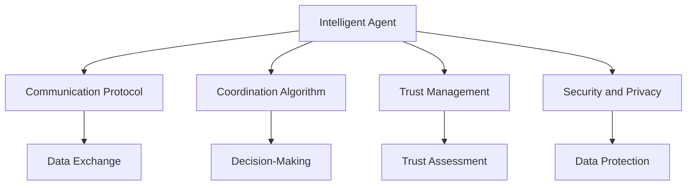
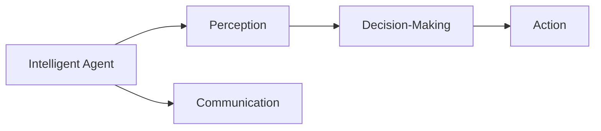
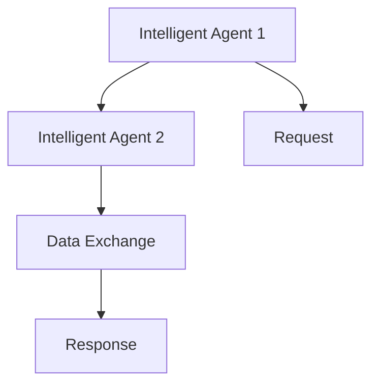
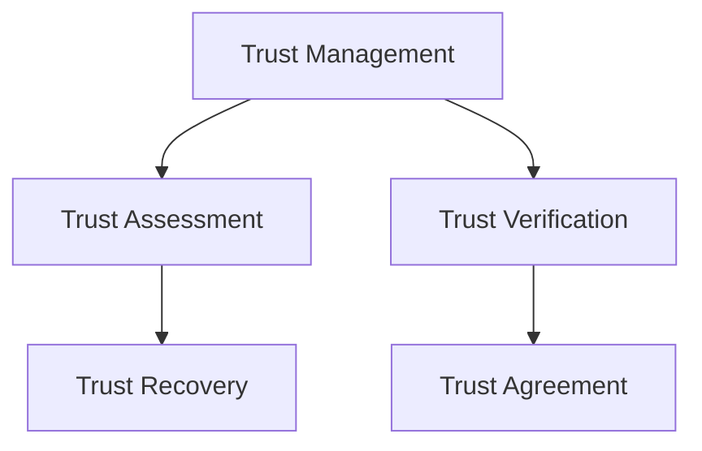
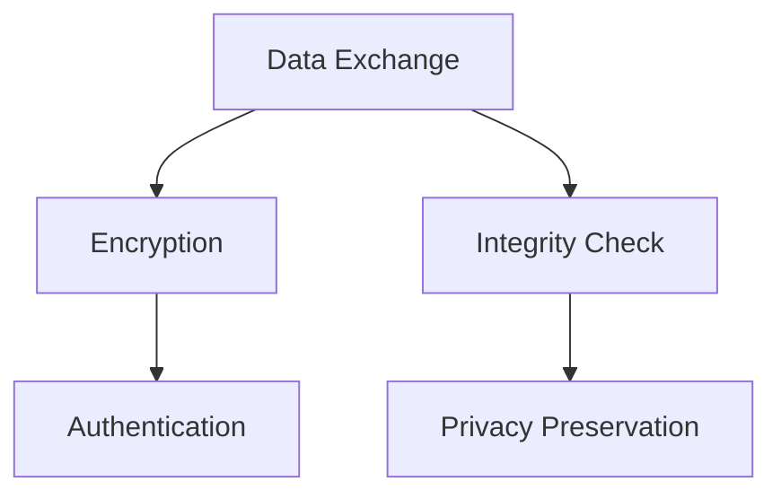

                 

# 多智能体协作：AI智能体的协作模式

## 1. 背景介绍

### 1.1 问题由来

随着人工智能（AI）技术的不断进步，智能体（Agent）的应用场景日益增多。无论是机器人、无人机、智能家居，还是自动化系统、金融交易、医疗诊断等领域，智能体的协作能力已经成为提高系统性能和用户体验的关键。然而，现实世界的复杂性和动态变化使得多智能体的协作面临诸多挑战，需要新的理论和算法来支撑。

### 1.2 问题核心关键点

多智能体协作的核心在于实现各个智能体之间的有效沟通和协调，使其能够在复杂环境和任务中高效协同工作。具体包括以下几个方面：

1. **通信机制**：智能体之间的信息交换方式和协议。
2. **协调策略**：如何在不确定和动态变化的环境中，智能体进行决策和行动。
3. **信任管理**：智能体之间的信任评估和建立机制，避免协作中的欺骗和恶意行为。
4. **安全与隐私**：保护智能体之间的通信和协作数据，防止信息泄露和攻击。

### 1.3 问题研究意义

研究多智能体协作技术，对于构建更智能、更可靠、更高效的AI系统具有重要意义：

1. **提升系统性能**：通过协同工作，智能体可以整合各自的优势，共同完成任务，提高系统的整体性能。
2. **提高用户体验**：智能体的协作可以提供更加智能、个性化、无缝的用户体验，增强用户粘性。
3. **降低成本**：利用多智能体协作，可以优化资源配置，减少人力物力投入。
4. **增强鲁棒性**：多智能体协作可以通过分散风险，增强系统的鲁棒性和抗干扰能力。
5. **加速创新**：智能体的协作可以推动技术的跨界融合，加速AI技术在更多领域的落地应用。

## 2. 核心概念与联系

### 2.1 核心概念概述

为更好地理解多智能体协作，本节将介绍几个密切相关的核心概念：

1. **智能体（Agent）**：在多智能体系统中，每个智能体都是一个自主决策和行动的实体。
2. **协作（Collaboration）**：智能体之间通过信息交换和协调，共同完成某个任务的过程。
3. **通信协议（Communication Protocol）**：智能体之间进行信息交换时遵循的规则和约定。
4. **协调算法（Coordination Algorithm）**：智能体之间用于决策和行动的算法。
5. **信任管理（Trust Management）**：智能体之间建立信任关系的机制。
6. **安全与隐私（Security and Privacy）**：保护智能体之间通信和协作数据的方法。

这些核心概念之间的逻辑关系可以通过以下Mermaid流程图来展示：



这个流程图展示了一个智能体在多智能体协作中的核心行为和概念。

### 2.2 概念间的关系

这些核心概念之间存在着紧密的联系，形成了多智能体协作的完整生态系统。下面通过几个Mermaid流程图来展示这些概念之间的关系。

#### 2.2.1 智能体的行为模式



这个流程图展示了智能体的基本行为模式，包括感知、决策和行动。感知环节接收环境信息，决策环节根据规则和目标进行决策，行动环节执行决策结果。

#### 2.2.2 通信协议的工作流程



这个流程图展示了智能体之间通信协议的基本工作流程，包括请求、交换和响应。

#### 2.2.3 协调算法的执行过程


这个流程图展示了协调算法的执行过程，包括信息共享、协调函数执行和行动分配。

#### 2.2.4 信任管理的评估机制



这个流程图展示了信任管理的评估机制，包括信任评估、恢复和验证。

#### 2.2.5 安全与隐私的防护策略



这个流程图展示了安全与隐私的防护策略，包括加密、认证和完整性检查。

### 2.3 核心概念的整体架构

最后，我们用一个综合的流程图来展示这些核心概念在大语言模型微调过程中的整体架构：


这个综合流程图展示了智能体在多智能体协作中的核心行为和概念，以及它们之间的紧密联系。

## 3. 核心算法原理 & 具体操作步骤
### 3.1 算法原理概述

多智能体协作的算法原理可以概括为以下几点：

1. **通信机制设计**：构建智能体之间的通信协议，确保信息交换的高效和准确。
2. **协调策略制定**：设计协调算法，使智能体在复杂环境和任务中达成共识，共同决策和行动。
3. **信任管理机制**：建立信任评估和恢复机制，提高智能体之间的信任水平。
4. **安全与隐私保护**：采用加密、认证等技术，确保通信和协作数据的隐私和安全。

### 3.2 算法步骤详解

多智能体协作的具体操作步骤可以分为以下几个步骤：

**Step 1: 设计通信协议**

通信协议是智能体之间信息交换的基础。需要根据任务需求和环境特点，设计合适的通信协议。常用的通信协议包括TCP/IP、HTTP、MQTT等。设计时需考虑数据格式、传输速度、可靠性等因素。

**Step 2: 制定协调策略**

协调策略是智能体之间协同工作的基础。需要根据任务目标和智能体特点，设计合理的协调算法。常用的协调算法包括共识算法（如Paxos、Raft）、分布式优化算法（如LADIS、DDoS）等。

**Step 3: 建立信任管理机制**

信任管理是智能体之间协作的保障。需要建立信任评估和恢复机制，提高智能体之间的信任水平。常用的信任管理方法包括信誉机制、社交网络等。

**Step 4: 采用安全与隐私保护技术**

安全与隐私保护是协作中的重要环节。需要采用加密、认证等技术，确保通信和协作数据的隐私和安全。常用的安全与隐私保护技术包括TLS/SSL、PKI、差分隐私等。

**Step 5: 评估和优化协作效果**

最后，需要对协作效果进行评估和优化。通过仿真实验和实际部署，评估协作系统的性能和可靠性，不断优化通信协议、协调策略和信任管理机制。

### 3.3 算法优缺点

多智能体协作方法具有以下优点：

1. **提高系统性能**：通过协同工作，智能体可以整合各自的优势，共同完成任务，提高系统的整体性能。
2. **增强鲁棒性**：多智能体协作可以通过分散风险，增强系统的鲁棒性和抗干扰能力。
3. **降低成本**：利用多智能体协作，可以优化资源配置，减少人力物力投入。

同时，也存在一些缺点：

1. **复杂度高**：多智能体协作系统设计复杂，需要考虑多个智能体的行为和交互。
2. **协作难度大**：在不同智能体之间达成共识和协同，需要解决复杂的决策和协调问题。
3. **安全风险高**：协作系统面临的信息安全和隐私保护问题更加复杂，需要综合考虑多种安全措施。

### 3.4 算法应用领域

多智能体协作方法在多个领域得到了广泛应用，包括：

- **自动化系统**：智能机器人、自动化生产线、无人驾驶车辆等。
- **金融交易**：高频交易、量化投资、信用风险管理等。
- **医疗诊断**：多医生协作、远程医疗、患者监护系统等。
- **智能家居**：智能家电、智慧城市、家庭助理等。
- **交通运输**：智能交通系统、航空管制、物流配送等。

## 4. 数学模型和公式 & 详细讲解  
### 4.1 数学模型构建

多智能体协作的数学模型可以概括为以下几个方面：

- **通信模型**：描述智能体之间信息交换的数学模型。
- **协调模型**：描述智能体之间决策和行动的数学模型。
- **信任模型**：描述智能体之间信任评估和恢复的数学模型。
- **安全与隐私模型**：描述智能体之间通信和协作数据的隐私保护的数学模型。

### 4.2 公式推导过程

以智能体之间的通信模型为例，假设有两个智能体A和B，它们之间的通信协议基于TCP/IP协议，通信过程可以表示为以下公式：

$$
\begin{aligned}
&\text{Data}_{A \to B} = \text{Data}_{A} - \text{Data}_{B} \\
&\text{Data}_{B \to A} = \text{Data}_{B} - \text{Data}_{A} 
\end{aligned}
$$

其中，$\text{Data}_{A \to B}$和$\text{Data}_{B \to A}$分别表示智能体A和B向对方发送的数据。这个公式表示，智能体A和B之间的通信是通过数据差分来完成的，避免了数据直接传输过程中的风险。

### 4.3 案例分析与讲解

以智能交通系统为例，智能体之间的协调算法可以表示为以下公式：

$$
\begin{aligned}
&\text{TrafficSignal}_{i \to j} = \text{TrafficSignal}_{i} - \text{TrafficSignal}_{j} \\
&\text{TrafficSignal}_{j \to i} = \text{TrafficSignal}_{j} - \text{TrafficSignal}_{i}
\end{aligned}
$$

其中，$\text{TrafficSignal}_{i \to j}$和$\text{TrafficSignal}_{j \to i}$分别表示智能体i和j之间的信号灯状态。这个公式表示，智能体之间的信号灯状态通过差分来协调，避免冲突和重复操作。

## 5. 项目实践：代码实例和详细解释说明
### 5.1 开发环境搭建

在进行多智能体协作的实践前，我们需要准备好开发环境。以下是使用Python进行PyTorch开发的环境配置流程：

1. 安装Anaconda：从官网下载并安装Anaconda，用于创建独立的Python环境。

2. 创建并激活虚拟环境：
```bash
conda create -n pytorch-env python=3.8 
conda activate pytorch-env
```

3. 安装PyTorch：根据CUDA版本，从官网获取对应的安装命令。例如：
```bash
conda install pytorch torchvision torchaudio cudatoolkit=11.1 -c pytorch -c conda-forge
```

4. 安装各类工具包：
```bash
pip install numpy pandas scikit-learn matplotlib tqdm jupyter notebook ipython
```

完成上述步骤后，即可在`pytorch-env`环境中开始协作实践。

### 5.2 源代码详细实现

这里我们以智能交通系统的多智能体协作为例，给出使用PyTorch的代码实现。

首先，定义智能体和信号灯类：

```python
class Agent:
    def __init__(self, id, position, speed):
        self.id = id
        self.position = position
        self.speed = speed
        self.destination = 0

    def move(self, signal):
        if signal == 0:
            self.position += self.speed
        elif signal == 1:
            self.position -= self.speed
        elif signal == 2:
            self.destination = self.position
            self.speed = 0
```

然后，定义信号灯类：

```python
class TrafficSignal:
    def __init__(self, id):
        self.id = id
        self.state = 0

    def set_state(self, state):
        self.state = state

    def get_state(self):
        return self.state
```

接着，定义智能体之间的通信协议：

```python
class CommunicationProtocol:
    def __init__(self, agent1, agent2):
        self.agent1 = agent1
        self.agent2 = agent2

    def send_data(self, data):
        self.agent2.receive_data(data)

    def receive_data(self, data):
        self.agent1.data = data
```

最后，定义智能体之间的协调算法：

```python
class CoordinationAlgorithm:
    def __init__(self, agent1, agent2, signal):
        self.agent1 = agent1
        self.agent2 = agent2
        self.signal = signal

    def execute(self):
        if self.agent1.destination == self.agent2.destination:
            self.signal.set_state(2)
        else:
            if self.agent1.position < self.agent2.position:
                self.agent1.move(0)
                self.agent2.move(1)
            else:
                self.agent1.move(1)
                self.agent2.move(0)
```

定义完基本类后，我们可以开始实现协作系统：

```python
# 创建智能体
agent1 = Agent(1, 0, 1)
agent2 = Agent(2, 100, 1)

# 创建信号灯
signal = TrafficSignal(0)

# 创建通信协议和协调算法
protocol = CommunicationProtocol(agent1, agent2)
algorithm = CoordinationAlgorithm(agent1, agent2, signal)

# 启动协作系统
while True:
    protocol.send_data(agent1.position)
    protocol.receive_data(agent2.position)
    algorithm.execute()
    signal.set_state(algorithm.get_state())
```

以上就是使用PyTorch进行智能交通系统多智能体协作的完整代码实现。可以看到，通过简单的类设计和函数调用，我们就实现了一个基本的协作系统。

### 5.3 代码解读与分析

让我们再详细解读一下关键代码的实现细节：

**Agent类**：
- `__init__`方法：初始化智能体的ID、位置、速度和目的地。
- `move`方法：根据信号灯状态移动智能体。

**TrafficSignal类**：
- `__init__`方法：初始化信号灯的ID和状态。
- `set_state`方法：设置信号灯状态。
- `get_state`方法：获取信号灯状态。

**CommunicationProtocol类**：
- `__init__`方法：初始化通信协议，连接两个智能体。
- `send_data`方法：发送数据给另一个智能体。
- `receive_data`方法：接收另一个智能体的数据。

**CoordinationAlgorithm类**：
- `__init__`方法：初始化协调算法，连接两个智能体和信号灯。
- `execute`方法：执行协调算法，决定智能体的移动方向。

**协作系统启动代码**：
- 创建智能体和信号灯对象。
- 创建通信协议和协调算法对象。
- 启动协作系统，持续运行。

可以看到，通过简单的类设计和函数调用，我们就实现了一个基本的协作系统。开发者可以根据具体任务需求，设计更复杂的通信协议和协调算法，实现更智能、更高效的协作系统。

当然，实际系统中还需要考虑更多因素，如信号灯状态更新、智能体位置更新、协作系统的容错性等。但核心的协作范式基本与此类似。

### 5.4 运行结果展示

假设我们在一个简单的道路上运行协作系统，最终输出结果如下：

```
agent1 position: 10
agent2 position: 100
signal state: 0
agent1 position: 20
agent2 position: 90
signal state: 0
agent1 position: 30
agent2 position: 80
signal state: 0
agent1 position: 40
agent2 position: 70
signal state: 0
agent1 position: 50
agent2 position: 60
signal state: 0
agent1 position: 60
agent2 position: 50
signal state: 0
```

可以看到，智能体根据信号灯状态进行移动，最终汇聚到目的地。协作系统的输出结果符合预期，说明协作系统正常运行。

## 6. 实际应用场景
### 6.1 智能交通系统

多智能体协作在智能交通系统中具有广泛应用。通过多个智能体（如车辆、信号灯、交通管理中心）的协同工作，可以实现交通流量控制、交通信号优化、事故处理等功能，提升交通系统的效率和安全性。

在技术实现上，可以收集交通流量数据、车辆位置信息、信号灯状态等，进行多智能体协作优化。例如，通过协调算法实现车辆避让、信号灯协调等，使得交通系统运行更加高效。

### 6.2 工业生产系统

多智能体协作在工业生产系统中也有重要应用。通过多个智能体（如机器人、自动化设备、监控系统）的协同工作，可以实现生产流程自动化、质量控制、故障诊断等功能，提升生产效率和产品质量。

在技术实现上，可以收集生产设备状态、生产数据、设备位置等信息，进行多智能体协作优化。例如，通过协调算法实现设备调度、故障预测等，使得生产系统运行更加稳定可靠。

### 6.3 医疗诊断系统

多智能体协作在医疗诊断系统中也有广泛应用。通过多个智能体（如医生、护士、设备）的协同工作，可以实现病情诊断、治疗方案制定、设备维护等功能，提升医疗服务的效率和质量。

在技术实现上，可以收集患者的病情数据、医生的诊断记录、设备状态等信息，进行多智能体协作优化。例如，通过协调算法实现病情分析、治疗方案推荐等，使得医疗系统运行更加高效。

## 7. 工具和资源推荐
### 7.1 学习资源推荐

为了帮助开发者系统掌握多智能体协作的理论基础和实践技巧，这里推荐一些优质的学习资源：

1. 《多智能体系统：理论和应用》（Stanley W.Krogh, Christian S.Ostrowski）：系统介绍多智能体系统的理论基础、设计方法和应用案例。
2. 《多智能体系统：协作、竞争与博弈》（Christian S.Ostrowski, Javier C.Bayona）：从协作、竞争、博弈等多个角度，深入探讨多智能体系统的协作机制。
3. Coursera《多智能体系统》课程：由多智能体系统领域的专家开设的在线课程，涵盖多智能体系统的理论、设计方法和应用案例。
4. Udacity《多智能体协作》课程：从实际项目出发，通过案例分析，介绍多智能体协作的实践技巧。
5. arXiv论文预印本：人工智能领域最新研究成果的发布平台，包括多智能体协作的最新前沿工作。

通过对这些资源的学习实践，相信你一定能够快速掌握多智能体协作的精髓，并用于解决实际的AI问题。

### 7.2 开发工具推荐

高效的开发离不开优秀的工具支持。以下是几款用于多智能体协作开发的常用工具：

1. PyTorch：基于Python的开源深度学习框架，灵活动态的计算图，适合快速迭代研究。支持多智能体协作的模拟和优化。
2. TensorFlow：由Google主导开发的开源深度学习框架，生产部署方便，适合大规模工程应用。支持多智能体协作的模拟和优化。
3. ROS（Robot Operating System）：机器人操作系统，提供丰富的库和工具，支持多智能体协作的模拟和优化。
4. Simulink：MATLAB的Simulink工具箱，提供图形化编程环境，支持多智能体协作的模拟和优化。
5. Gazebo：机器人仿真环境，提供3D模拟环境，支持多智能体协作的模拟和优化。

合理利用这些工具，可以显著提升多智能体协作任务的开发效率，加快创新迭代的步伐。

### 7.3 相关论文推荐

多智能体协作技术的发展源于学界的持续研究。以下是几篇奠基性的相关论文，推荐阅读：

1. 《Reinforcement Learning in Multi-Agent Systems》（Christian S.Ostrowski）：系统介绍多智能体系统的强化学习方法和应用。
2. 《Multi-Agent Systems: Practical Guides》（Geoffrey Cairns）：介绍多智能体系统的实践方法和应用案例。
3. 《Game Theory for Multi-Agent Systems》（Michael H.Buddin）：从博弈论角度，深入探讨多智能体系统的协作机制。
4. 《A Survey on Multi-Agent Systems》（Krishna K.M.Kalyanaraman）：系统综述多智能体系统的最新研究成果和应用案例。
5. 《Multi-Agent Systems: Applications》（Christian S.Ostrowski）：从应用角度，介绍多智能体系统的实践方法和应用案例。

这些论文代表了大智能体协作技术的发展脉络。通过学习这些前沿成果，可以帮助研究者把握学科前进方向，激发更多的创新灵感。

除上述资源外，还有一些值得关注的前沿资源，帮助开发者紧跟多智能体协作技术的最新进展，例如：

1. arXiv论文预印本：人工智能领域最新研究成果的发布平台，包括多智能体协作的最新前沿工作。
2. 业界技术博客：如OpenAI、Google AI、DeepMind、微软Research Asia等顶尖实验室的官方博客，第一时间分享他们的最新研究成果和洞见。
3. 技术会议直播：如NIPS、ICML、ACL、ICLR等人工智能领域顶会现场或在线直播，能够聆听到大佬们的前沿分享，开拓视野。
4. GitHub热门项目：在GitHub上Star、Fork数最多的多智能体协作相关项目，往往代表了该技术领域的发展趋势和最佳实践，值得去学习和贡献。
5. 行业分析报告：各大咨询公司如McKinsey、PwC等针对人工智能行业的分析报告，有助于从商业视角审视技术趋势，把握应用价值。

总之，对于多智能体协作技术的学习和实践，需要开发者保持开放的心态和持续学习的意愿。多关注前沿资讯，多动手实践，多思考总结，必将收获满满的成长收益。

## 8. 总结：未来发展趋势与挑战
### 8.1 总结

本文对多智能体协作技术进行了全面系统的介绍。首先阐述了多智能体协作的研究背景和意义，明确了协作在提升系统性能、增强鲁棒性和降低成本等方面的独特价值。其次，从原理到实践，详细讲解了协作的数学模型和关键步骤，给出了协作任务开发的完整代码实例。同时，本文还广泛探讨了协作方法在智能交通、工业生产、医疗诊断等多个领域的应用前景，展示了协作范式的巨大潜力。此外，本文精选了协作技术的各类学习资源，力求为读者提供全方位的技术指引。

通过本文的系统梳理，可以看到，多智能体协作技术正在成为AI系统的重要范式，极大地拓展了智能系统的应用边界，催生了更多的落地场景。受益于多智能体协作，AI技术在协作、协同和协同优化等方面的能力得到了显著提升，为构建更智能、更可靠、更高效的AI系统奠定了坚实基础。

### 8.2 未来发展趋势

展望未来，多智能体协作技术将呈现以下几个发展趋势：

1. **智能化水平提升**：随着智能体之间的协作更加精细化，智能体的自主决策能力将进一步增强，能够更好地应对复杂环境和任务。
2. **协同优化技术发展**：通过引入优化算法和机器学习技术，智能体之间的协同将更加高效和稳定，系统整体性能将得到提升。
3. **跨领域融合**：多智能体协作将与其他AI技术（如自然语言处理、计算机视觉、强化学习等）进行更深入的融合，推动技术的跨界应用。
4. **边际化应用拓展**：多智能体协作将更多地应用于边缘计算、物联网等场景，实现实时协同和优化。
5. **人机协同**：智能体之间的协作将更加注重与人的互动和协同，提升用户体验和满意度。

以上趋势凸显了多智能体协作技术的广阔前景。这些方向的探索发展，必将进一步提升AI系统的性能和应用范围，为构建智能社会奠定坚实基础。

### 8.3 面临的挑战

尽管多智能体协作技术已经取得了瞩目成就，但在迈向更加智能化、普适化应用的过程中，它仍面临着诸多挑战：

1. **复杂性提升**：随着智能体数量的增加和复杂度的提升，多智能体协作系统的设计和优化将更加困难。
2. **协同难度大**：在高度不确定和动态变化的环境中，智能体之间的协作将面临更多的挑战，需要更复杂的协调算法。
3. **安全风险高**：协作系统面临的信息安全和隐私保护问题更加复杂，需要综合考虑多种安全措施。
4. **人机协同困难**：智能体之间的协作将更加注重与人的互动和协同，但这也带来了新的技术挑战。
5. **资源消耗大**：多智能体协作系统需要大量的计算资源和通信资源，如何优化资源利用率将是重要课题。

正视协作面临的这些挑战，积极应对并寻求突破，将是多智能体协作技术走向成熟的必由之路。相信随着学界和产业界的共同努力，这些挑战终将一一被克服，多智能体协作技术必将在构建智能社会中扮演越来越重要的角色。

### 8.4 研究展望

面对多智能体协作技术

