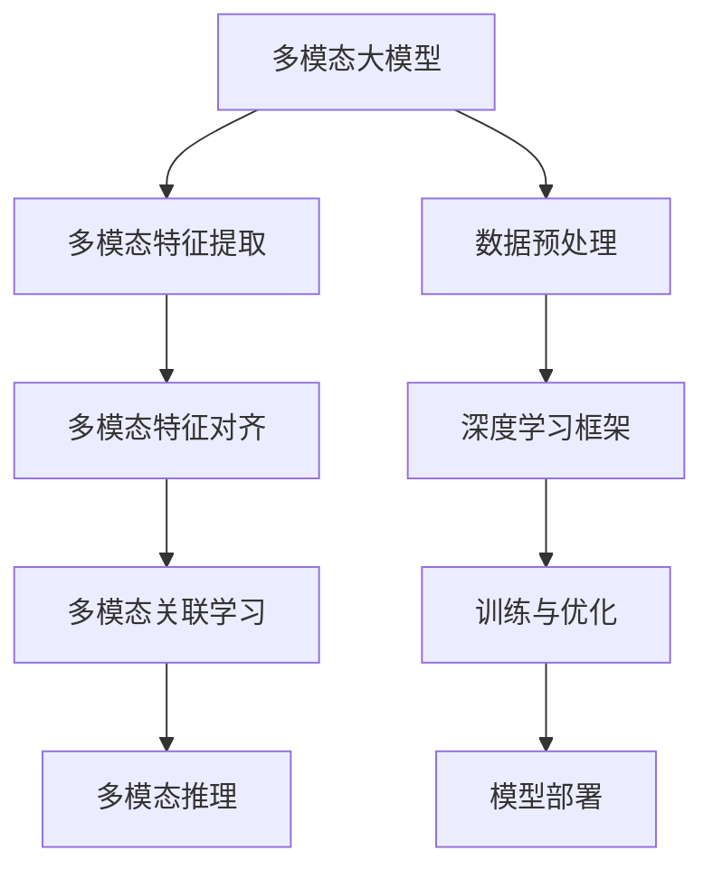
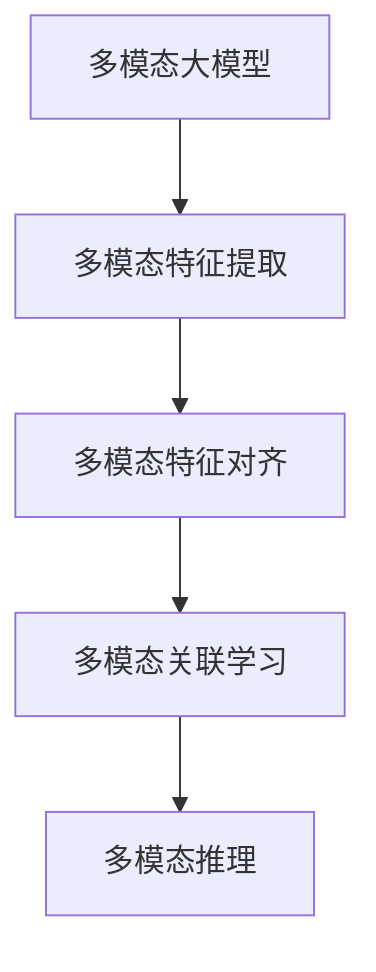
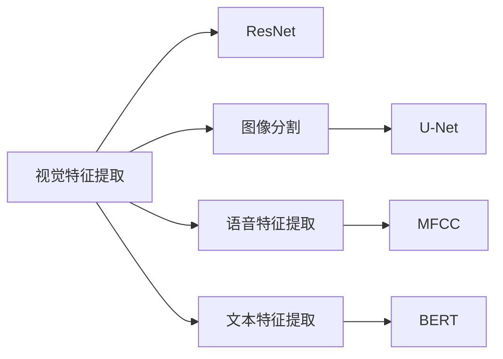
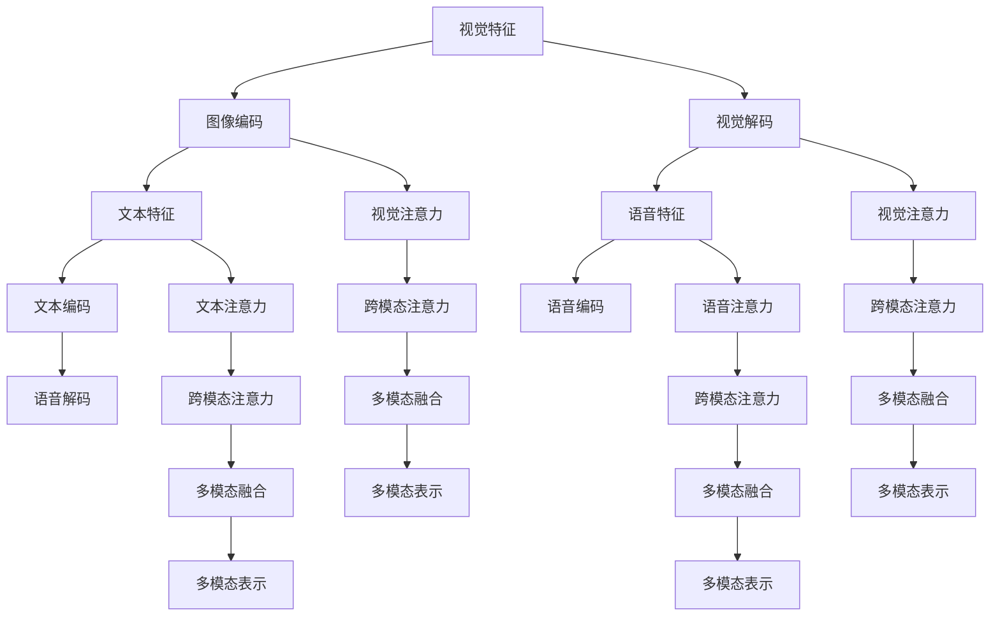
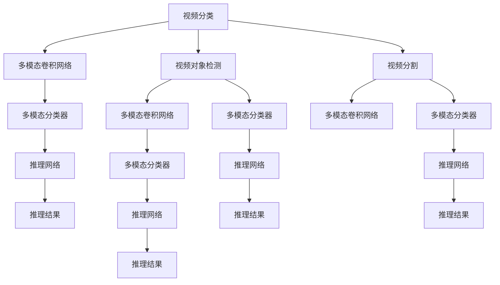
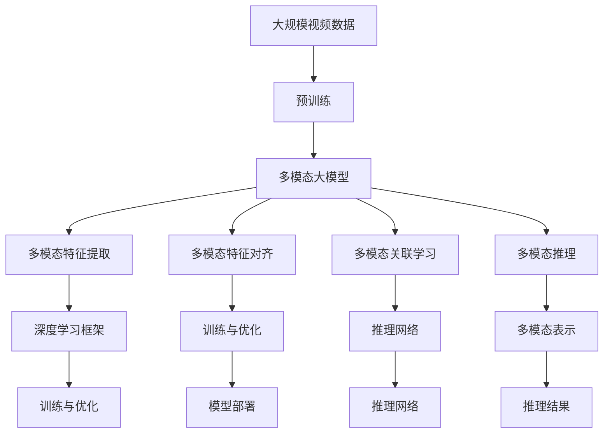

                 

# 多模态大模型：技术原理与实战 视频多模态技术

> 关键词：多模态大模型,多模态技术,视频处理,深度学习,计算机视觉

## 1. 背景介绍

### 1.1 问题由来
近年来，随着深度学习技术的不断发展，多模态大模型(Multi-modal Large Models, MLMs)在视频处理、图像识别、语音识别等多个领域取得了重大突破。这些模型能够同时处理和分析视频、图像、声音等多种信息模态，大大提升了各模态的感知和理解能力。

多模态大模型在处理复杂视频内容时具有显著优势，能够从不同模态中提取多层次、多方面的语义信息，提升视频内容的识别、分类、情感分析、行为理解等能力。然而，相比于单模态模型，多模态大模型的设计和训练更加复杂，需要综合考虑不同模态之间的交互和融合。

### 1.2 问题核心关键点
多模态大模型的核心在于如何构建和训练多模态的表示，使其能够在不同模态间有效交互，形成统一的语义空间。具体包括以下几个关键问题：

- 多模态特征提取：如何从不同模态中提取高层次、抽象的特征表示，使其能够互补和融合。
- 多模态特征对齐：不同模态的特征如何对齐和融合，形成统一的多模态表示。
- 多模态关联学习：不同模态之间如何关联学习，增强语义交互和理解能力。
- 多模态推理推理：如何利用多模态信息进行推理和推理，提升复杂任务的处理能力。

### 1.3 问题研究意义
多模态大模型在视频处理、智能监控、医疗诊断、智能教育等多个领域具有广阔的应用前景，其研究对于提升多模态数据的处理和理解能力具有重要意义：

1. 提升视频内容处理能力：通过多模态大模型，可以从视频中同时提取视觉、音频和文本信息，提升视频的理解和生成能力。
2. 增强智能监控系统：在智能监控系统中，多模态大模型能够同时处理视频、图像和音频信息，提升异常检测和事件识别的准确性和效率。
3. 提高医疗诊断精度：在医疗影像诊断中，多模态大模型能够结合影像、文本和语音等多模态信息，提升诊断的准确性和效率。
4. 推动智能教育发展：在智能教育中，多模态大模型能够处理学生的视频、音频和文本信息，实现个性化学习、情感识别等功能。

## 2. 核心概念与联系

### 2.1 核心概念概述

为更好地理解多模态大模型，本节将介绍几个密切相关的核心概念：

- 多模态大模型(Multi-modal Large Models, MLMs)：能够同时处理和分析视频、图像、声音等多种信息模态的大规模预训练模型。
- 多模态特征表示(Multi-modal Feature Representation)：从不同模态中提取的高层次、抽象的特征表示，用于形成统一的多模态语义空间。
- 多模态特征对齐(Multi-modal Feature Alignment)：不同模态的特征如何对齐和融合，形成统一的多模态表示。
- 多模态关联学习(Multi-modal Associative Learning)：不同模态之间如何关联学习，增强语义交互和理解能力。
- 多模态推理(Multi-modal Reasoning)：利用多模态信息进行推理和推理，提升复杂任务的处理能力。

这些核心概念之间的逻辑关系可以通过以下Mermaid流程图来展示：



这个流程图展示了大语言模型的核心概念及其之间的关系：

1. 多模态大模型通过多模态特征提取和特征对齐，形成统一的多模态表示。
2. 多模态关联学习增强不同模态之间的语义交互和理解能力。
3. 多模态推理利用多模态信息进行推理和推理，提升复杂任务的处理能力。

### 2.2 概念间的关系

这些核心概念之间存在着紧密的联系，形成了多模态大模型的完整生态系统。下面我通过几个Mermaid流程图来展示这些概念之间的关系。

#### 2.2.1 多模态大模型的学习范式



这个流程图展示了大语言模型的学习范式。多模态大模型通过多模态特征提取和特征对齐，形成统一的多模态表示。多模态关联学习增强不同模态之间的语义交互和理解能力。多模态推理利用多模态信息进行推理和推理，提升复杂任务的处理能力。

#### 2.2.2 多模态特征提取的模型选择



这个流程图展示了不同模态特征提取的常用模型。视觉特征提取常用ResNet等卷积神经网络模型，图像分割常用U-Net等生成对抗网络模型。语音特征提取常用MFCC等谱图模型，文本特征提取常用BERT等语言模型。

#### 2.2.3 多模态关联学习的融合方式



这个流程图展示了多模态关联学习的常用融合方式。通过跨模态注意力机制，将不同模态的信息进行融合，形成多模态表示。常用的跨模态注意力机制包括视觉-文本、语音-文本等注意力机制。

#### 2.2.4 多模态推理的任务类型



这个流程图展示了多模态推理的常用任务类型。通过多模态卷积网络和多模态分类器，对视频进行分类、对象检测和分割等任务。通过推理网络，对多模态信息进行推理，得到推理结果。

### 2.3 核心概念的整体架构

最后，我们用一个综合的流程图来展示这些核心概念在大模型微调过程中的整体架构：



这个综合流程图展示了从预训练到多模态推理的完整过程。多模态大模型首先在大规模视频数据上进行预训练，然后通过多模态特征提取、特征对齐和关联学习，形成统一的多模态表示。多模态推理利用多模态信息进行推理和推理，得到推理结果。 通过这些流程图，我们可以更清晰地理解多模态大模型的学习过程及其各个关键步骤的联系和作用。

## 3. 核心算法原理 & 具体操作步骤
### 3.1 算法原理概述

多模态大模型通过预训练和微调的过程，能够同时处理和分析视频、图像、声音等多种信息模态，形成统一的多模态表示。其核心思想是：通过预训练获取多模态特征表示，然后通过微调模型使其能够适应特定的下游任务。

形式化地，假设预训练模型为 $M_{\theta}$，其中 $\theta$ 为预训练得到的模型参数。给定多模态下游任务 $T$ 的标注数据集 $D=\{(x_i, y_i)\}_{i=1}^N$，多模态微调的目标是找到新的模型参数 $\hat{\theta}$，使得：

$$
\hat{\theta}=\mathop{\arg\min}_{\theta} \mathcal{L}(M_{\theta},D)
$$

其中 $\mathcal{L}$ 为针对任务 $T$ 设计的损失函数，用于衡量模型预测输出与真实标签之间的差异。常见的损失函数包括交叉熵损失、均方误差损失等。

通过梯度下降等优化算法，微调过程不断更新模型参数 $\theta$，最小化损失函数 $\mathcal{L}$，使得模型输出逼近真实标签。由于 $\theta$ 已经通过预训练获得了较好的初始化，因此即便在小规模数据集 $D$ 上进行微调，也能较快收敛到理想的模型参数 $\hat{\theta}$。

### 3.2 算法步骤详解

多模态大模型的微调过程包括以下几个关键步骤：

**Step 1: 准备预训练模型和数据集**
- 选择合适的多模态大模型 $M_{\theta}$ 作为初始化参数，如ResNet、BERT、MFCC等。
- 准备多模态下游任务 $T$ 的标注数据集 $D$，划分为训练集、验证集和测试集。一般要求标注数据与预训练数据的分布不要差异过大。

**Step 2: 添加任务适配层**
- 根据任务类型，在预训练模型顶层设计合适的输出层和损失函数。
- 对于分类任务，通常在顶层添加线性分类器和交叉熵损失函数。
- 对于生成任务，通常使用语言模型的解码器输出概率分布，并以负对数似然为损失函数。

**Step 3: 设置微调超参数**
- 选择合适的优化算法及其参数，如 AdamW、SGD 等，设置学习率、批大小、迭代轮数等。
- 设置正则化技术及强度，包括权重衰减、Dropout、Early Stopping 等。
- 确定冻结预训练参数的策略，如仅微调顶层，或全部参数都参与微调。

**Step 4: 执行梯度训练**
- 将训练集数据分批次输入模型，前向传播计算损失函数。
- 反向传播计算参数梯度，根据设定的优化算法和学习率更新模型参数。
- 周期性在验证集上评估模型性能，根据性能指标决定是否触发 Early Stopping。
- 重复上述步骤直到满足预设的迭代轮数或 Early Stopping 条件。

**Step 5: 测试和部署**
- 在测试集上评估微调后模型 $M_{\hat{\theta}}$ 的性能，对比微调前后的精度提升。
- 使用微调后的模型对新样本进行推理预测，集成到实际的应用系统中。
- 持续收集新的数据，定期重新微调模型，以适应数据分布的变化。

以上是多模态大模型微调的一般流程。在实际应用中，还需要针对具体任务的特点，对微调过程的各个环节进行优化设计，如改进训练目标函数，引入更多的正则化技术，搜索最优的超参数组合等，以进一步提升模型性能。

### 3.3 算法优缺点

多模态大模型微调方法具有以下优点：

1. 多模态感知能力：通过融合视频、图像和语音等多模态信息，大大提升了模型的感知和理解能力，适用于复杂多变的任务。
2. 通用适用性：适用于各类多模态下游任务，如视频分类、对象检测、情感分析、行为理解等，设计简单的任务适配层即可实现微调。
3. 参数高效微调：利用参数高效微调技术，在固定大部分预训练参数的情况下，仍可取得不错的提升。
4. 性能显著：在学术界和工业界的诸多任务上，多模态微调方法已经刷新了最先进的性能指标。

同时，该方法也存在一定的局限性：

1. 依赖标注数据：微调的效果很大程度上取决于标注数据的质量和数量，获取高质量标注数据的成本较高。
2. 迁移能力有限：当目标任务与预训练数据的分布差异较大时，微调的性能提升有限。
3. 负面效果传递：预训练模型的固有偏见、有害信息等，可能通过微调传递到下游任务，造成负面影响。
4. 可解释性不足：多模态大模型通常缺乏可解释性，难以对其推理逻辑进行分析和调试。

尽管存在这些局限性，但就目前而言，多模态大模型微调方法仍然是多模态数据分析处理的主流范式。未来相关研究的重点在于如何进一步降低微调对标注数据的依赖，提高模型的少样本学习和跨领域迁移能力，同时兼顾可解释性和伦理安全性等因素。

### 3.4 算法应用领域

多模态大模型微调方法在视频处理、智能监控、医疗诊断、智能教育等多个领域已经得到了广泛的应用，覆盖了几乎所有常见任务，例如：

- 视频分类：如动作识别、行为理解、事件检测等。通过多模态大模型学习视频-标签映射。
- 视频对象检测：识别视频中的人、车、动物等特定物体。通过多模态大模型学习物体-标签映射。
- 视频分割：将视频帧中的物体进行分割。通过多模态大模型学习像素-标签映射。
- 视频摘要：将视频内容压缩成简短摘要。通过多模态大模型学习关键帧和关键语句的提取。
- 情感分析：对视频中人物情感进行识别。通过多模态大模型学习面部表情、语音、文字等情感信息。
- 行为理解：理解视频中人物的行为意图。通过多模态大模型学习行为-意图映射。
- 智能监控：自动检测视频中的异常事件，如闯入、异常行为等。通过多模态大模型学习异常行为模式。

除了上述这些经典任务外，多模态大模型微调也被创新性地应用到更多场景中，如视频生成、视频增强、智能问答等，为多模态技术带来了全新的突破。随着预训练模型和微调方法的不断进步，相信多模态技术将在更广阔的应用领域大放异彩。

## 4. 数学模型和公式 & 详细讲解  
### 4.1 数学模型构建

本节将使用数学语言对多模态大模型微调过程进行更加严格的刻画。

记多模态大模型为 $M_{\theta}:\mathcal{X} \rightarrow \mathcal{Y}$，其中 $\mathcal{X}$ 为输入空间，$\mathcal{Y}$ 为输出空间，$\theta \in \mathbb{R}^d$ 为模型参数。假设多模态下游任务 $T$ 的训练集为 $D=\{(x_i, y_i)\}_{i=1}^N$，$x_i = (x_{i,1}, x_{i,2}, ..., x_{i,k})$ 为多模态输入，$y_i \in \mathcal{Y}$ 为标签。

定义模型 $M_{\theta}$ 在数据样本 $(x,y)$ 上的损失函数为 $\ell(M_{\theta}(x),y)$，则在数据集 $D$ 上的经验风险为：

$$
\mathcal{L}(\theta) = \frac{1}{N} \sum_{i=1}^N \ell(M_{\theta}(x_i),y_i)
$$

多模态微调的优化目标是最小化经验风险，即找到最优参数：

$$
\theta^* = \mathop{\arg\min}_{\theta} \mathcal{L}(\theta)
$$

在实践中，我们通常使用基于梯度的优化算法（如SGD、Adam等）来近似求解上述最优化问题。设 $\eta$ 为学习率，$\lambda$ 为正则化系数，则参数的更新公式为：

$$
\theta \leftarrow \theta - \eta \nabla_{\theta}\mathcal{L}(\theta) - \eta\lambda\theta
$$

其中 $\nabla_{\theta}\mathcal{L}(\theta)$ 为损失函数对参数 $\theta$ 的梯度，可通过反向传播算法高效计算。

### 4.2 公式推导过程

以下我们以视频分类任务为例，推导交叉熵损失函数及其梯度的计算公式。

假设模型 $M_{\theta}$ 在输入 $x$ 上的输出为 $\hat{y}=M_{\theta}(x) \in [0,1]$，表示样本属于某个类别的概率。真实标签 $y \in \{1,0\}$。则二分类交叉熵损失函数定义为：

$$
\ell(M_{\theta}(x),y) = -[y\log \hat{y} + (1-y)\log (1-\hat{y})]
$$

将其代入经验风险公式，得：

$$
\mathcal{L}(\theta) = -\frac{1}{N}\sum_{i=1}^N [y_i\log M_{\theta}(x_i)+(1-y_i)\log(1-M_{\theta}(x_i))]
$$

根据链式法则，损失函数对参数 $\theta_k$ 的梯度为：

$$
\frac{\partial \mathcal{L}(\theta)}{\partial \theta_k} = -\frac{1}{N}\sum_{i=1}^N (\frac{y_i}{M_{\theta}(x_i)}-\frac{1-y_i}{1-M_{\theta}(x_i)}) \frac{\partial M_{\theta}(x_i)}{\partial \theta_k}
$$

其中 $\frac{\partial M_{\theta}(x_i)}{\partial \theta_k}$ 可进一步递归展开，利用自动微分技术完成计算。

在得到损失函数的梯度后，即可带入参数更新公式，完成模型的迭代优化。重复上述过程直至收敛，最终得到适应下游任务的最优模型参数 $\theta^*$。

## 5. 项目实践：代码实例和详细解释说明
### 5.1 开发环境搭建

在进行多模态大模型微调实践前，我们需要准备好开发环境。以下是使用Python进行PyTorch开发的环境配置流程：

1. 安装Anaconda：从官网下载并安装Anaconda，用于创建独立的Python环境。

2. 创建并激活虚拟环境：
```bash
conda create -n pytorch-env python=3.8 
conda activate pytorch-env
```

3. 安装PyTorch：根据CUDA版本，从官网获取对应的安装命令。例如：
```bash
conda install pytorch torchvision torchaudio cudatoolkit=11.1 -c pytorch -c conda-forge
```

4. 安装各类工具包：
```bash
pip install numpy pandas scikit-learn matplotlib tqdm jupyter notebook ipython
```

完成上述步骤后，即可在`pytorch-env`环境中开始多模态大模型微调实践。

### 5.2 源代码详细实现

这里我们以视频分类任务为例，给出使用Transformers库对ResNet模型进行多模态大模型微调的PyTorch代码实现。

首先，定义视频分类任务的数据处理函数：

```python
from transformers import BertTokenizer, ResNetModel, VideoFeatureExtractor, AdamW

class VideoDataset(Dataset):
    def __init__(self, videos, labels, video_extractor):
        self.videos = videos
        self.labels = labels
        self.video_extractor = video_extractor
        
    def __len__(self):
        return len(self.videos)
    
    def __getitem__(self, item):
        video = self.videos[item]
        label = self.labels[item]
        
        # 对视频进行特征提取
        features = self.video_extractor(video, return_tensors='pt', padding='max_length', truncation=True)
        input_ids = features['input_ids'][0]
        attention_mask = features['attention_mask'][0]
        
        # 对标签进行编码
        label_ids = label2id[label] 
        label_ids.extend([label2id['O']] * (self.video_extractor.max_length - len(label_ids)))
        labels = torch.tensor(label_ids, dtype=torch.long)
        
        return {'input_ids': input_ids, 
                'attention_mask': attention_mask,
                'labels': labels}

# 标签与id的映射
label2id = {'O': 0, 'class1': 1, 'class2': 2, 'class3': 3}

# 创建dataset
video_extractor = VideoFeatureExtractor.from_pretrained('resnet101-feature-extractor')
train_dataset = VideoDataset(train_videos, train_labels, video_extractor)
dev_dataset = VideoDataset(dev_videos, dev_labels, video_extractor)
test_dataset = VideoDataset(test_videos, test_labels, video_extractor)
```

然后，定义模型和优化器：

```python
from transformers import BertForTokenClassification, AdamW

model = BertForTokenClassification.from_pretrained('bert-base-cased', num_labels=len(label2id))

optimizer = AdamW(model.parameters(), lr=2e-5)
```

接着，定义训练和评估函数：

```python
from torch.utils.data import DataLoader
from tqdm import tqdm
from sklearn.metrics import classification_report

device = torch.device('cuda') if torch.cuda.is_available() else torch.device('cpu')
model.to(device)

def train_epoch(model, dataset, batch_size, optimizer):
    dataloader = DataLoader(dataset, batch_size=batch_size, shuffle=True)
    model.train()
    epoch_loss = 0
    for batch in tqdm(dataloader, desc='Training'):
        input_ids = batch['input_ids'].to(device)
        attention_mask = batch['attention_mask'].to(device)
        labels = batch['labels'].to(device)
        model.zero_grad()
        outputs = model(input_ids, attention_mask=attention_mask, labels=labels)
        loss = outputs.loss
        epoch_loss += loss.item()
        loss.backward()
        optimizer.step()
    return epoch_loss / len(dataloader)

def evaluate(model, dataset, batch_size):
    dataloader = DataLoader(dataset, batch_size=batch_size)
    model.eval()
    preds, labels = [], []
    with torch.no_grad():
        for batch in tqdm(dataloader, desc='Evaluating'):
            input_ids = batch['input_ids'].to(device)
            attention_mask = batch['attention_mask'].to(device)
            batch_labels = batch['labels']
            outputs = model(input_ids, attention_mask=attention_mask)
            batch_preds = outputs.logits.argmax(dim=2).to('cpu').tolist()
            batch_labels = batch_labels.to('cpu').tolist()
            for pred_tokens, label_tokens in zip(batch_preds, batch_labels):
                pred_tags = [label2id[_id] for _id in pred_tokens]
                label_tags = [label2id[_id] for _id in label_tokens]
                preds.append(pred_tags[:len(label_tokens)])
                labels.append(label_tags)
                
    print(classification_report(labels, preds))
```

最后，启动训练流程并在测试集上评估：

```python
epochs = 5
batch_size = 16

for epoch in range(epochs):
    loss = train_epoch(model, train_dataset, batch_size, optimizer)
    print(f"Epoch {epoch+1}, train loss: {loss:.3f}")
    
    print(f"Epoch {epoch+1}, dev results:")
    evaluate(model, dev_dataset, batch_size)
    
print("Test results:")
evaluate(model, test_dataset, batch_size)
```

以上就是使用PyTorch对ResNet模型进行视频分类任务微调的完整代码实现。可以看到，得益于Transformers库的强大封装，我们可以用相对简洁的代码完成ResNet模型的加载和微调。

### 5.3 代码解读与分析

让我们再详细解读一下关键代码的实现细节：

**VideoDataset类**：
- `__init__`方法：初始化视频、标签和特征提取器等关键组件。
- `__len__`方法：返回数据集的样本数量。
- `__getitem__`方法：对单个样本进行处理，将视频输入编码为token ids，将标签编码为数字，并对其进行定长padding，最终返回模型

