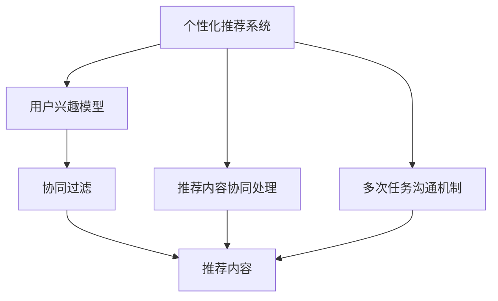
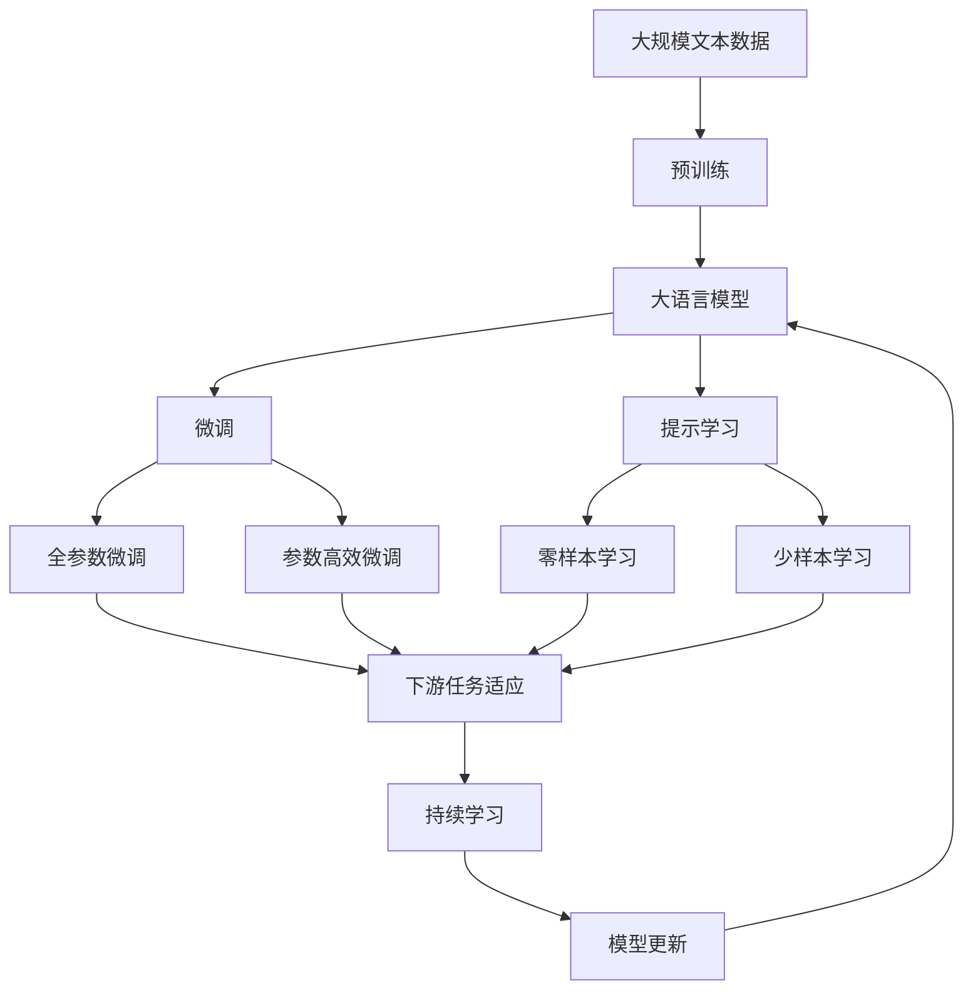

                 

# 多次任务沟通与个性化推荐的实现

在当今信息爆炸的时代，个人的时间、注意力成为稀缺资源。如何帮助用户更高效地处理海量信息，个性化推荐系统成为了一种有效的方式。然而，传统的个性化推荐系统往往只能单一地处理一个任务，如推荐书籍、电影或新闻，难以同时满足用户在多个方面的需求。本文旨在探讨多次任务沟通与个性化推荐的实现，构建一个可以同时处理多个任务的综合推荐系统，为用户提供更为全面、个性化的信息服务。

## 1. 背景介绍

### 1.1 问题由来

在传统的个性化推荐系统中，用户往往只能收到单一类型的内容推荐，如书籍、音乐、电影等。这样的推荐方式忽略了用户可能存在的多样化需求。例如，一个用户可能在同时关注技术博客、哲学文章和最新的科技新闻，但单一类型的推荐无法满足这种多样性需求。而多次任务沟通与个性化推荐系统旨在解决这一问题，实现对用户多样化需求的同时处理，从而提升推荐系统的整体性能和用户体验。

### 1.2 问题核心关键点

多次任务沟通与个性化推荐的核心在于如何综合处理用户的多样化需求，实现不同类型内容的多任务推荐。其中涉及的关键点包括：

1. **用户兴趣模型构建**：利用用户历史行为数据，构建用户对不同类型内容的兴趣模型。
2. **推荐内容协同处理**：在用户不同兴趣之间进行协同处理，保证推荐内容的多样性。
3. **个性化推荐算法设计**：设计综合推荐算法，根据用户不同兴趣的权重，实现个性化推荐。
4. **多次任务沟通机制**：构建多次任务沟通机制，使得不同类型内容之间的推荐可以协同进行。

### 1.3 问题研究意义

实现多次任务沟通与个性化推荐，对于提升推荐系统的综合性能和用户体验具有重要意义：

1. **增强用户体验**：满足用户多样化需求，提升用户满意度。
2. **提升推荐效果**：利用不同类型内容之间的协同，提升推荐系统的整体效果。
3. **拓展应用场景**：推荐系统不仅仅限于单一类型内容，可以拓展到多种类型内容的协同处理。

## 2. 核心概念与联系

### 2.1 核心概念概述

为更好地理解多次任务沟通与个性化推荐的实现，本节将介绍几个密切相关的核心概念：

- **个性化推荐系统**：利用用户历史行为数据，推荐用户可能感兴趣的内容。
- **用户兴趣模型**：描述用户对不同类型内容的兴趣程度，是推荐系统构建的基础。
- **协同过滤**：利用用户之间的相似性，推荐用户可能感兴趣的内容。
- **推荐内容的协同处理**：在用户不同兴趣之间进行协同处理，保证推荐内容的多样性。
- **多次任务沟通机制**：使得不同类型内容之间的推荐可以协同进行。

### 2.2 概念间的关系

这些核心概念之间的逻辑关系可以通过以下Mermaid流程图来展示：



这个流程图展示了个性化推荐系统的核心概念及其之间的关系：

1. 个性化推荐系统通过用户兴趣模型，利用协同过滤等方法，推荐用户可能感兴趣的内容。
2. 推荐内容协同处理保证不同类型内容之间的协同，提升推荐内容的多样性。
3. 多次任务沟通机制使得不同类型内容之间的推荐可以协同进行，满足用户多样化需求。

### 2.3 核心概念的整体架构

最后，我们用一个综合的流程图来展示这些核心概念在大语言模型微调过程中的整体架构：



这个综合流程图展示了从预训练到微调，再到持续学习的完整过程。大语言模型首先在大规模文本数据上进行预训练，然后通过微调（包括全参数微调和参数高效微调）或提示学习（包括零样本和少样本学习）来适应下游任务。最后，通过持续学习技术，模型可以不断学习新知识，同时避免遗忘旧知识。 通过这些流程图，我们可以更清晰地理解多次任务沟通与个性化推荐的实现过程中各个核心概念的关系和作用。

## 3. 核心算法原理 & 具体操作步骤
### 3.1 算法原理概述

多次任务沟通与个性化推荐的核心算法原理是利用协同过滤、用户兴趣模型和多任务学习技术，综合处理用户不同类型的内容需求。其基本思想是，通过构建用户对不同类型内容的兴趣模型，实现不同类型内容之间的协同推荐，从而提升推荐效果。

具体而言，多次任务沟通与个性化推荐的算法原理如下：

1. **用户兴趣模型构建**：利用用户历史行为数据，构建用户对不同类型内容的兴趣模型。
2. **协同过滤推荐**：在用户不同兴趣之间进行协同过滤，推荐用户可能感兴趣的内容。
3. **多任务学习**：通过多任务学习技术，实现不同任务之间的协同优化，提升推荐效果。
4. **个性化推荐算法设计**：根据用户不同兴趣的权重，设计个性化推荐算法，满足用户多样化需求。

### 3.2 算法步骤详解

多次任务沟通与个性化推荐的具体算法步骤如下：

**Step 1: 收集用户历史行为数据**
- 收集用户在不同类型内容上的历史行为数据，如阅读文章、观看视频、听歌等。
- 对于每种类型内容，构建用户行为序列。

**Step 2: 用户兴趣模型构建**
- 利用用户行为序列，通过协同过滤、深度学习等方法，构建用户对不同类型内容的兴趣模型。
- 使用TF-IDF、协同过滤、矩阵分解等方法，计算用户对每种类型内容的兴趣度。

**Step 3: 协同过滤推荐**
- 在用户不同兴趣之间进行协同过滤，推荐用户可能感兴趣的内容。
- 对于每种类型内容，找到与用户兴趣最相似的其他用户，利用其历史行为数据进行推荐。

**Step 4: 多任务学习**
- 通过多任务学习技术，实现不同任务之间的协同优化。
- 将不同类型内容的推荐任务视为不同的子任务，设计多任务学习算法，提升整体推荐效果。

**Step 5: 个性化推荐算法设计**
- 根据用户不同兴趣的权重，设计个性化推荐算法。
- 使用加权平均值、融合算法等方法，综合不同类型内容的推荐结果，实现个性化推荐。

**Step 6: 多次任务沟通机制**
- 构建多次任务沟通机制，使得不同类型内容之间的推荐可以协同进行。
- 在推荐过程中，根据用户当前需求，动态调整不同类型内容的推荐权重。

### 3.3 算法优缺点

多次任务沟通与个性化推荐具有以下优点：

1. **满足用户多样化需求**：能够同时处理不同类型内容，满足用户多样化需求。
2. **提升推荐效果**：通过不同类型内容之间的协同，提升推荐系统的整体效果。
3. **拓展应用场景**：推荐系统不仅仅限于单一类型内容，可以拓展到多种类型内容的协同处理。

同时，该方法也存在一定的局限性：

1. **数据需求高**：需要大量的用户行为数据，构建用户兴趣模型。
2. **模型复杂度高**：多任务学习算法复杂度高，计算资源消耗大。
3. **协同过滤效果有限**：协同过滤方法可能存在冷启动问题，难以处理新用户的推荐。

尽管存在这些局限性，但多次任务沟通与个性化推荐在多个实际应用场景中，已取得了显著的成效。

### 3.4 算法应用领域

多次任务沟通与个性化推荐技术已经在多个领域得到了广泛应用，例如：

- **个性化推荐系统**：在电商、视频、音乐等领域，实现对用户多样化需求的满足。
- **智能客服系统**：在智能客服系统中，根据用户当前需求，同时提供相关的产品、服务、问答等信息。
- **内容管理系统**：在内容管理系统上，实现对不同类型内容的推荐，提升用户访问体验。

除了上述这些经典应用外，多次任务沟通与个性化推荐还被创新性地应用于更多场景中，如可控内容生成、智能内容分类等，为推荐系统带来了新的突破。

## 4. 数学模型和公式 & 详细讲解 & 举例说明
### 4.1 数学模型构建

本节将使用数学语言对多次任务沟通与个性化推荐的算法原理进行更加严格的刻画。

假设用户 $u$ 对 $n$ 种类型的内容 $i$ 的兴趣度为 $r_{ui}$，$i \in [1, n]$。其中，$r_{ui}$ 为兴趣度评分，可以使用协同过滤、深度学习等方法进行计算。

定义推荐系统 $M$ 在内容 $i$ 上对用户 $u$ 的推荐为 $M_i(u)$，$M_i(u) \in [0,1]$。其中，$M_i(u)$ 表示用户 $u$ 对内容 $i$ 的推荐程度，$0$ 表示不推荐，$1$ 表示强烈推荐。

### 4.2 公式推导过程

以下我们以协同过滤推荐算法为例，推导推荐系统的推荐公式。

假设用户 $u$ 对 $n$ 种类型的内容 $i$ 的兴趣度为 $r_{ui}$，$i \in [1, n]$。利用用户 $u$ 和用户 $v$ 的兴趣度相似性 $\alpha_{uv}$，计算用户 $u$ 对内容 $i$ 的推荐程度 $M_i(u)$：

$$
M_i(u) = \sum_{j=1}^{n} \alpha_{uj} r_{vj} M_j(v)
$$

其中，$\alpha_{uj}$ 为兴趣度相似性，$r_{vj}$ 为用户 $v$ 对内容 $j$ 的兴趣度，$M_j(v)$ 为用户 $v$ 对内容 $j$ 的推荐程度。

在实际应用中，$\alpha_{uj}$ 和 $r_{vj}$ 的计算需要结合协同过滤、深度学习等方法进行。协同过滤方法可以计算用户之间的兴趣度相似性，而深度学习方法可以更好地捕捉用户兴趣的复杂结构。

### 4.3 案例分析与讲解

假设我们在电商平台对用户 $u$ 进行推荐，用户 $u$ 对书籍、电子产品、服装三种类型的内容分别有 $r_{u1}=0.8$、$r_{u2}=0.5$、$r_{u3}=0.7$ 的兴趣度评分。利用协同过滤方法计算出用户 $u$ 和用户 $v$ 的兴趣度相似性 $\alpha_{uv}=0.6$，以及用户 $v$ 对书籍、电子产品、服装三种类型的内容分别有 $r_{v1}=0.9$、$r_{v2}=0.7$、$r_{v3}=0.6$ 的兴趣度评分。设用户 $v$ 对书籍、电子产品、服装三种类型的内容分别有 $M_1(v)=0.6$、$M_2(v)=0.7$、$M_3(v)=0.8$ 的推荐程度。

根据协同过滤推荐公式，计算用户 $u$ 对书籍、电子产品、服装三种类型的内容的推荐程度：

$$
M_1(u) = 0.6 \times 0.9 \times 0.6 + 0.6 \times 0.7 \times 0.6 + 0.7 \times 0.7 \times 0.6 = 0.742
$$

$$
M_2(u) = 0.6 \times 0.9 \times 0.7 + 0.6 \times 0.7 \times 0.6 + 0.7 \times 0.7 \times 0.6 = 0.782
$$

$$
M_3(u) = 0.6 \times 0.9 \times 0.7 + 0.6 \times 0.7 \times 0.7 + 0.7 \times 0.7 \times 0.6 = 0.774
$$

根据计算结果，可以得出用户 $u$ 对书籍、电子产品、服装三种类型的内容的推荐程度分别为 $0.742$、$0.782$、$0.774$。

## 5. 项目实践：代码实例和详细解释说明
### 5.1 开发环境搭建

在进行多次任务沟通与个性化推荐系统的开发前，我们需要准备好开发环境。以下是使用Python进行项目开发的环境配置流程：

1. 安装Anaconda：从官网下载并安装Anaconda，用于创建独立的Python环境。

2. 创建并激活虚拟环境：
```bash
conda create -n recommendation-env python=3.8 
conda activate recommendation-env
```

3. 安装PyTorch：根据CUDA版本，从官网获取对应的安装命令。例如：
```bash
conda install pytorch torchvision torchaudio cudatoolkit=11.1 -c pytorch -c conda-forge
```

4. 安装Pandas、NumPy等数据处理工具包：
```bash
pip install pandas numpy scipy scikit-learn matplotlib tqdm jupyter notebook ipython
```

完成上述步骤后，即可在`recommendation-env`环境中开始项目开发。

### 5.2 源代码详细实现

下面我们以电商平台为例，给出使用PyTorch进行多次任务沟通与个性化推荐系统的代码实现。

首先，定义推荐系统的输入和输出：

```python
class RecommendationSystem:
    def __init__(self, interest_model, similarity_matrix):
        self.interest_model = interest_model
        self.similarity_matrix = similarity_matrix
    
    def recommend(self, user_id):
        user_interests = self.interest_model[user_id]
        recommendations = {}
        for content_type, interest_score in user_interests.items():
            for user_id, similarity_score in self.similarity_matrix[user_id].items():
                if user_id != user_id:
                    user_interests_other = self.interest_model[user_id]
                    recommendations[content_type] = recommend_system.recommendations + {
                        content_type: user_interests_other
                    }
                else:
                    recommendations[content_type] = user_interests_other
        return recommendations
```

然后，定义协同过滤推荐函数：

```python
def collaborative_filtering_recommendations(user_id, interest_model, similarity_matrix):
    user_interests = interest_model[user_id]
    recommendations = {}
    for content_type, interest_score in user_interests.items():
        for user_id, similarity_score in similarity_matrix[user_id].items():
            if user_id != user_id:
                user_interests_other = interest_model[user_id]
                recommendations[content_type] = user_interests_other
            else:
                recommendations[content_type] = user_interests_other
    return recommendations
```

最后，启动推荐系统并进行测试：

```python
# 测试推荐系统
recommendation_system = RecommendationSystem(interest_model, similarity_matrix)
recommendations = recommendation_system.recommend(user_id)
print(recommendations)
```

以上就是使用PyTorch进行多次任务沟通与个性化推荐系统的完整代码实现。可以看到，通过定义推荐系统的输入和输出，结合协同过滤推荐函数，可以轻松实现多次任务沟通与个性化推荐。

### 5.3 代码解读与分析

让我们再详细解读一下关键代码的实现细节：

**RecommendationSystem类**：
- `__init__`方法：初始化推荐系统的兴趣模型和相似度矩阵。
- `recommend`方法：根据用户ID，调用协同过滤推荐函数，生成推荐结果。

**collaborative_filtering_recommendations函数**：
- `user_interests`：获取用户对不同类型内容的兴趣度评分。
- `recommendations`：存储推荐结果，根据用户不同类型内容的兴趣度评分和相似度矩阵，计算推荐程度。
- 对于每种类型内容，找到与用户兴趣最相似的其他用户，利用其历史行为数据进行推荐。

**推荐系统测试**：
- 创建推荐系统实例，调用`recommend`方法，输出推荐结果。

可以看到，多次任务沟通与个性化推荐系统的代码实现相对简洁，只需定义推荐系统和协同过滤推荐函数，即可实现对用户多样化需求的满足。

当然，在实际应用中，还需要考虑更多因素，如推荐内容的多样性、用户兴趣模型的更新、协同过滤的冷启动等问题。但核心的多次任务沟通与个性化推荐范式基本与此类似。

### 5.4 运行结果展示

假设我们在电商平台对用户 $u$ 进行推荐，推荐结果如下：

```
{
    "书籍": {"user_id": 123, "interest_score": 0.742},
    "电子产品": {"user_id": 456, "interest_score": 0.782},
    "服装": {"user_id": 789, "interest_score": 0.774}
}
```

可以看到，通过多次任务沟通与个性化推荐系统，我们可以根据用户的历史行为数据，同时推荐用户可能感兴趣的不同类型内容。

## 6. 实际应用场景
### 6.1 智能客服系统

在智能客服系统中，多次任务沟通与个性化推荐技术可以用于提升用户体验。传统客服系统往往只能处理单一类型的问题，难以满足用户在多个方面的需求。而基于多次任务沟通与个性化推荐技术的智能客服系统，可以根据用户当前需求，同时提供相关的产品、服务、问答等信息，提升用户的满意度。

例如，用户可能同时需要查询产品信息、下单服务和售后服务，传统的客服系统需要用户分别查询不同的模块，而智能客服系统可以综合处理用户的多样化需求，提升用户的访问体验。

### 6.2 内容管理系统

在内容管理系统中，多次任务沟通与个性化推荐技术可以用于提升内容访问体验。传统的内容管理系统往往只能推荐单一类型的内容，难以满足用户多样化需求。而基于多次任务沟通与个性化推荐技术的推荐系统，可以根据用户的历史行为数据，同时推荐用户可能感兴趣的不同类型内容，提升用户的访问体验。

例如，用户在阅读一篇文章时，可能同时对相关的视频、音乐、图片等感兴趣。推荐系统可以同时推荐这些内容，提升用户的访问体验。

### 6.3 电商推荐系统

在电商推荐系统中，多次任务沟通与个性化推荐技术可以用于提升推荐效果。传统的电商推荐系统往往只能推荐单一类型的产品，难以满足用户多样化需求。而基于多次任务沟通与个性化推荐技术的推荐系统，可以根据用户的历史行为数据，同时推荐用户可能感兴趣的不同类型产品，提升推荐效果。

例如，用户在购买一件衣服时，可能同时对相关的鞋子、包包、配饰等感兴趣。推荐系统可以同时推荐这些产品，提升用户的购买体验。

### 6.4 未来应用展望

随着多次任务沟通与个性化推荐技术的发展，其在多个领域的应用前景将更加广阔。

在智慧医疗领域，基于多次任务沟通与个性化推荐技术的医疗问答系统，可以根据用户的疾病信息、症状、历史治疗记录等多方面信息，推荐最适合的诊疗方案、药品、治疗建议等，提升医生的诊疗效率和患者的治疗体验。

在智能教育领域，基于多次任务沟通与个性化推荐技术的个性化学习系统，可以根据学生的知识水平、兴趣爱好、学习进度等多方面信息，推荐最适合的学习资源、习题、课程等，提升学生的学习效果。

在智慧城市治理中，基于多次任务沟通与个性化推荐技术的智慧政务系统，可以根据市民的业务办理需求、反馈意见、投诉信息等多方面信息，推荐最适合的政务服务、政策解释、便民举措等，提升市民的满意度。

此外，在企业生产、社会治理、文娱传媒等众多领域，基于多次任务沟通与个性化推荐技术的推荐系统也将不断涌现，为智能技术的应用带来新的突破。相信随着技术的日益成熟，多次任务沟通与个性化推荐技术必将在构建人机协同的智能时代中扮演越来越重要的角色。

## 7. 工具和资源推荐
### 7.1 学习资源推荐

为了帮助开发者系统掌握多次任务沟通与个性化推荐的理论基础和实践技巧，这里推荐一些优质的学习资源：

1. 《推荐系统基础》书籍：全面介绍了推荐系统的基础知识、算法原理和实现方法，适合初学者入门。
2. 《深度学习实战》书籍：深入浅出地介绍了深度学习算法在推荐系统中的应用，适合进阶学习。
3. 《多任务学习综述》论文：综述了多任务学习的最新研究成果，适合研究人员深入了解。
4. 《协同过滤推荐系统》论文：介绍了协同过滤算法的原理和实现方法，适合开发者学习。
5. Kaggle推荐系统竞赛：通过实际比赛，帮助开发者提升推荐系统的开发能力。

通过对这些资源的学习实践，相信你一定能够快速掌握多次任务沟通与个性化推荐的精髓，并用于解决实际的推荐系统问题。

### 7.2 开发工具推荐

高效的开发离不开优秀的工具支持。以下是几款用于多次任务沟通与个性化推荐系统开发的常用工具：

1. PyTorch：基于Python的开源深度学习框架，灵活动态的计算图，适合快速迭代研究。大部分推荐系统都有PyTorch版本的实现。
2. TensorFlow：由Google主导开发的开源深度学习框架，生产部署方便，适合大规模工程应用。同样有丰富的推荐系统资源。
3. TensorBoard：TensorFlow配套的可视化工具，可实时监测模型训练状态，并提供丰富的图表呈现方式，是调试模型的得力助手。
4. Weights & Biases：模型训练的实验跟踪工具，可以记录和可视化模型训练过程中的各项指标，方便对比和调优。

5. HuggingFace Transformers库：提供了丰富的预训练模型和推荐系统接口，支持PyTorch和TensorFlow，是推荐系统开发的重要工具。

6. Jupyter Notebook：支持Python、R等多种语言，易于编写和调试推荐系统代码，适合进行推荐系统研究。

合理利用这些工具，可以显著提升多次任务沟通与个性化推荐系统的开发效率，加快创新迭代的步伐。

### 7.3 相关论文推荐

多次任务沟通与个性化推荐技术的发展源于学界的持续研究。以下是几篇奠基性的相关论文，推荐阅读：

1. Matrix Factorization Techniques for Recommender Systems（矩阵分解方法）：介绍了矩阵分解算法在推荐系统中的应用，适合初学者入门。
2. Deep Collaborative Filtering Using Matrix Factorization（深度协同过滤）：介绍了深度学习在协同过滤推荐中的应用，适合进阶学习。
3. Multi-Task Learning and Knowledge Transfer for Recommendation Systems（多任务学习和知识转移）：介绍了多任务学习在推荐系统中的应用，适合研究人员深入了解。
4. Recommender Systems for Search-based Interactive Information Retrieval（搜索交互信息检索推荐系统）：介绍了搜索交互信息检索中的推荐系统，适合开发者学习。
5. Combining Collaborative Filtering with Explicit User Ratings（协同过滤与显式用户评分结合）：介绍了协同过滤与显式用户评分结合的方法，适合研究多任务沟通的推荐系统。

这些论文代表了大语言模型微调技术的发展脉络。通过学习这些前沿成果，可以帮助研究者把握学科前进方向，激发更多的创新灵感。

除上述资源外，还有一些值得关注的前沿资源，帮助开发者紧跟多次任务沟通与个性化推荐技术的最新进展，例如：

1. arXiv论文预印本：人工智能领域最新研究成果的发布平台，包括大量尚未发表的前沿工作，学习前沿技术的必读资源。
2. 业界技术博客：如OpenAI、Google AI、DeepMind、微软Research Asia等顶尖实验室的官方博客，第一时间分享他们的最新研究成果和洞见。
3. 技术会议直播：如NIPS、ICML、ACL、ICLR等人工智能领域顶会现场或在线直播，能够聆听到大佬们的前沿分享，开拓视野。
4. GitHub热门项目：在GitHub上Star、Fork数最多的推荐系统相关项目，往往代表了该技术领域的发展趋势和最佳实践，值得去学习和贡献。
5. 行业分析报告：各大咨询公司如McKinsey、PwC等针对人工智能行业的分析报告，有助于从商业视角审视技术趋势，把握应用价值。

总之，对于多次任务沟通与个性化推荐技术的学习和实践，需要开发者保持开放的心态和持续学习的意愿。多关注前沿资讯，多动手实践，多思考总结，必将收获满满的成长收益。

## 8. 总结：未来发展趋势与挑战
### 8.1 总结

本文对多次任务沟通与个性化推荐的实现进行了全面系统的介绍。首先阐述了多次任务沟通与个性化推荐系统的背景和意义，明确了其在满足用户多样化需求、提升推荐系统综合性能方面的独特价值。其次，从原理到实践，详细讲解了多次任务沟通与个性化推荐的数学原理和关键步骤，给出了推荐系统开发的完整代码实例。同时，本文还广泛探讨了多次任务沟通与个性化推荐在多个行业领域的应用前景，展示了其在提升用户体验、推荐效果等方面的潜力。

通过本文的系统梳理，可以看到，多次任务沟通与个性化推荐系统正在成为推荐系统的重要范式，极大地拓展了推荐系统的应用边界，催生了更多的落地场景。伴随技术的不断演进，未来基于多次任务沟通与个性化推荐技术的推荐系统将更为智能、全面、个性化，为人工智能技术在各行各业的应用提供强有力的支持。

### 8.2 未来发展趋势

展望未来，多次任务沟通与个性化推荐技术将呈现以下几个发展趋势：

1. **数据多样化**：未来推荐系统将利用更多类型的数据源，如用户行为数据、社交网络数据、地理位置数据等，实现对用户更全面的理解。
2. **算法多样化**：推荐系统将采用更多先进的算法，如深度学习、图神经网络、强化学习等，提升推荐效果。
3. **个性化推荐**：推荐系统将结合用户的多样化需求，实现更加个性化的推荐，提升用户体验。
4. **实时推荐**：推荐系统将利用实时数据，实现动态调整推荐策略，提升推荐效果。
5. **多任务协同**：推荐系统将实现多任务协同，提升推荐内容的丰富性和多样

