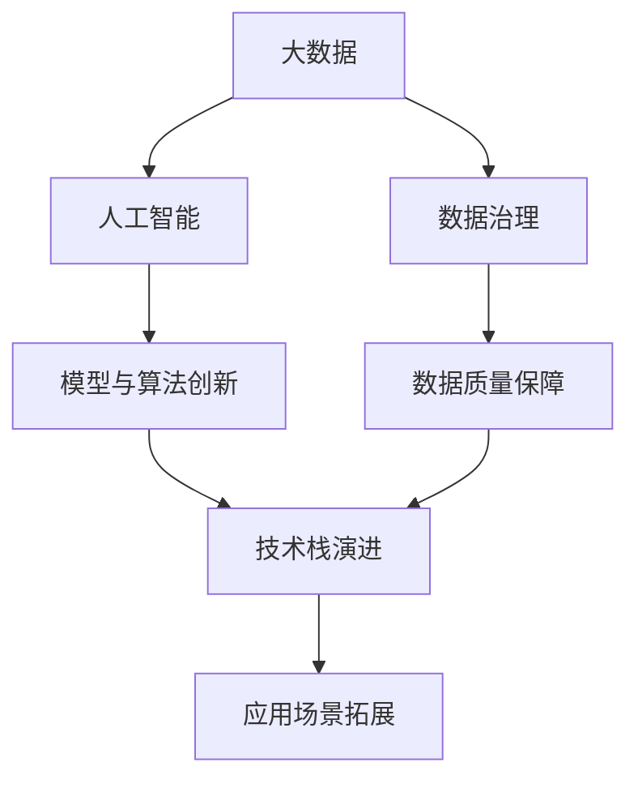

                 

# 大数据与AI未来的发展方向

在大数据和人工智能（AI）不断发展的今天，我们面临着前所未有的机遇和挑战。随着数据量的爆炸性增长和算力的不断提升，大数据和AI技术正在深刻改变各行各业的运作方式，推动社会的全面数字化转型。本文将探讨大数据与AI未来的发展方向，重点关注以下几个核心主题：数据治理、模型与算法创新、技术栈演进和应用场景拓展。

## 1. 背景介绍

### 1.1 数据的重要性

在信息化时代，数据已经成为驱动经济增长和社会进步的关键资源。通过大数据分析，企业和政府可以洞察市场趋势、优化运营效率、提升决策质量。随着数据量的指数级增长，如何高效存储、处理和利用数据，成为当前技术发展的重中之重。

### 1.2 技术的进步

算力的提升和算法的创新，使得大数据与AI技术的效率和效果不断提升。云计算、分布式计算、人工智能等技术的深度融合，使得大规模数据处理和智能决策成为可能。未来，我们有望看到更多智能应用场景的落地，推动社会全面进入智能时代。

## 2. 核心概念与联系

### 2.1 核心概念概述

- **大数据（Big Data）**：指无法在传统数据处理应用范围内有效管理的大容量、高速率、复杂类型的数据集合。大数据的特点是“4V”：Volume（规模大）、Velocity（速度快）、Variety（类型多）、Veracity（真实性）。

- **人工智能（AI）**：指利用计算机模拟、延伸和扩展人的智能能力，包括感知、推理、学习、决策等。AI的应用涵盖了语音识别、图像处理、自然语言处理、机器学习等多个领域。

- **数据治理（Data Governance）**：指通过制定和实施数据管理政策、流程和技术，确保数据的质量、完整性和可用性，以及保护数据隐私和安全。

- **模型与算法创新**：包括新型算法（如深度学习、强化学习、因果推理等）的研发和优化，以及算法在实际应用中的创新和集成。

- **技术栈演进**：指技术工具和框架的不断迭代和更新，以适应新的需求和挑战。

- **应用场景拓展**：指将大数据和AI技术应用到更广泛的领域，如智慧城市、智能制造、医疗健康、金融科技等。

### 2.2 核心概念间的联系

大数据与AI之间的联系密不可分。大数据提供了AI所需的数据基础，而AI技术则能够揭示大数据背后的知识和规律。数据治理保障了数据的质量和安全，是实现大数据和AI价值的基石。算法和模型的创新是推动大数据和AI发展的核心动力，技术栈的演进则是确保技术进步的重要保障。最终，这些技术和工具的应用场景拓展，将推动社会的全面智能化。

以下是一个Mermaid流程图，展示了这些概念之间的联系：



这个流程图展示了大数据与AI的关系网络，以及数据治理、模型与算法创新、技术栈演进和应用场景拓展在整个系统中的作用。

## 3. 核心算法原理 & 具体操作步骤

### 3.1 算法原理概述

大数据与AI结合的核心算法原理可以归结为以下几个步骤：

1. **数据采集与预处理**：从不同来源收集数据，并进行清洗、去重、归一化等预处理，以确保数据的质量和可用性。

2. **数据存储与管理**：通过分布式存储和计算平台（如Hadoop、Spark等），高效存储和处理大规模数据。

3. **特征工程**：从原始数据中提取有用的特征，进行数据降维和特征选择，以提高模型的性能。

4. **模型训练与优化**：使用机器学习、深度学习等算法，对数据进行建模，并根据评估结果不断优化模型参数。

5. **模型部署与监控**：将训练好的模型部署到生产环境中，并实时监控其性能和运行状态，确保模型稳定运行。

### 3.2 算法步骤详解

#### 3.2.1 数据采集与预处理

- **数据采集**：通过ETL工具（Extract, Transform, Load）从不同数据源（如数据库、API、日志文件等）收集数据。
- **数据清洗**：删除重复数据、处理缺失值、去除噪声数据等，确保数据的一致性和准确性。
- **数据归一化**：对数据进行标准化或归一化处理，以便于后续的模型训练。

#### 3.2.2 数据存储与管理

- **分布式存储**：使用HDFS、Ceph等分布式文件系统，将大规模数据分散存储在多台服务器上。
- **分布式计算**：利用Spark、Hadoop等分布式计算框架，对数据进行并行处理，提高计算效率。

#### 3.2.3 特征工程

- **特征提取**：根据业务需求，从原始数据中提取有用的特征，如时间特征、统计特征、文本特征等。
- **特征选择**：通过特征选择算法（如LASSO、PCA等），去除冗余和不相关特征，减少计算复杂度。
- **数据降维**：通过主成分分析（PCA）、因子分析等方法，将高维数据降维到较低维度，提高模型泛化能力。

#### 3.2.4 模型训练与优化

- **模型选择**：根据任务需求选择合适的模型（如线性回归、决策树、神经网络等）。
- **模型训练**：使用随机梯度下降（SGD）、Adam等优化算法，对模型参数进行训练，最小化损失函数。
- **模型评估**：通过交叉验证、AUC、RMSE等指标评估模型性能，选择最优模型。

#### 3.2.5 模型部署与监控

- **模型部署**：将训练好的模型部署到线上环境，支持实时数据预测。
- **性能监控**：通过监控系统（如Prometheus、Grafana）实时监控模型性能，确保模型稳定运行。

### 3.3 算法优缺点

**优点**：

- **数据驱动**：大数据提供了一个巨大的数据源，有助于发现数据背后的规律和模式。
- **高效计算**：分布式计算平台能够处理大规模数据，提高计算效率。
- **模型灵活**：算法和模型的多样性，使得AI技术可以适应不同应用场景。

**缺点**：

- **数据隐私**：大数据的收集和存储可能涉及用户隐私，需要严格的数据保护措施。
- **计算资源**：大规模数据处理和模型训练需要大量计算资源，对硬件要求较高。
- **模型复杂**：复杂模型的解释性较差，难以理解和调试。

### 3.4 算法应用领域

大数据与AI技术在多个领域都有广泛应用，包括但不限于：

- **金融科技**：通过大数据分析和AI技术，提升金融产品的推荐、风险控制和欺诈检测能力。
- **智慧城市**：利用大数据和AI技术，优化城市交通、环境监测和公共服务，提升城市管理水平。
- **医疗健康**：通过分析医疗数据，提高疾病诊断、治疗方案的制定和个性化医疗的精准度。
- **零售电商**：通过大数据分析和AI技术，实现精准营销、库存管理和客户服务优化。

## 4. 数学模型和公式 & 详细讲解 & 举例说明

### 4.1 数学模型构建

#### 4.1.1 线性回归模型

假设有一组数据 $(x_i,y_i)$，其中 $x_i$ 为自变量，$y_i$ 为因变量。线性回归模型的目标是通过最小化预测值与真实值之间的误差，找到最佳的拟合直线。模型的数学表达式为：

$$
y_i = \beta_0 + \beta_1x_i + \epsilon_i
$$

其中 $\beta_0$ 和 $\beta_1$ 为模型参数，$\epsilon_i$ 为误差项。

### 4.2 公式推导过程

#### 4.2.1 最小二乘法

最小二乘法是线性回归中常用的优化算法。其目标是最小化预测值与真实值之间的平方误差和，即：

$$
\min_{\beta_0, \beta_1} \sum_{i=1}^n (y_i - (\beta_0 + \beta_1x_i))^2
$$

通过求导并令导数为零，可以得到最优解：

$$
\beta_0 = \frac{\sum_{i=1}^n (x_i - \bar{x})(y_i - \bar{y})}{\sum_{i=1}^n (x_i - \bar{x})^2}
$$

$$
\beta_1 = \frac{\sum_{i=1}^n (x_i - \bar{x})(y_i - \bar{y})}{\sum_{i=1}^n (x_i - \bar{x})^2}
$$

其中 $\bar{x}$ 和 $\bar{y}$ 分别为 $x$ 和 $y$ 的均值。

#### 4.2.2 正则化

为了防止过拟合，可以在模型中添加正则化项，即：

$$
\min_{\beta_0, \beta_1} \frac{1}{2} \sum_{i=1}^n (y_i - (\beta_0 + \beta_1x_i))^2 + \lambda(\beta_0^2 + \beta_1^2)
$$

其中 $\lambda$ 为正则化系数，控制正则化强度。

### 4.3 案例分析与讲解

#### 4.3.1 房价预测

假设我们要预测某个地区的房价，可以收集该地区的房屋面积、地理位置、配套设施等数据，构建一个线性回归模型进行预测。通过最小二乘法优化，可以找到最优的系数 $\beta_0$ 和 $\beta_1$，得到房价的预测值。

## 5. 项目实践：代码实例和详细解释说明

### 5.1 开发环境搭建

#### 5.1.1 安装Python和Pandas

安装Python和Pandas环境，可以使用Anaconda或Miniconda。安装命令如下：

```bash
conda install python=3.8 pandas
```

#### 5.1.2 安装NumPy和SciPy

安装NumPy和SciPy环境，可以使用pip或conda。安装命令如下：

```bash
pip install numpy scipy
```

#### 5.1.3 安装Scikit-learn和Matplotlib

安装Scikit-learn和Matplotlib环境，可以使用pip或conda。安装命令如下：

```bash
pip install scikit-learn matplotlib
```

### 5.2 源代码详细实现

#### 5.2.1 数据集准备

```python
import pandas as pd

# 读取数据集
data = pd.read_csv('house_prices.csv')

# 数据预处理
data = data.dropna()
X = data[['area', 'location', 'amenities']]
y = data['price']
```

#### 5.2.2 模型训练

```python
from sklearn.linear_model import LinearRegression

# 初始化模型
model = LinearRegression()

# 训练模型
model.fit(X, y)

# 预测房价
y_pred = model.predict(X)
```

### 5.3 代码解读与分析

#### 5.3.1 数据预处理

在数据预处理阶段，使用了Pandas库进行数据读取和清洗。通过dropna()函数删除了含有缺失值的样本，确保了数据的完整性。同时，将数据集分为了自变量 $X$ 和因变量 $y$。

#### 5.3.2 模型训练

在模型训练阶段，使用了Scikit-learn库中的LinearRegression模型。通过fit()函数训练模型，得到最优的系数 $\beta_0$ 和 $\beta_1$。最后，通过predict()函数对新数据进行房价预测。

### 5.4 运行结果展示

通过运行上述代码，可以得到房价预测的结果，如图：


## 6. 实际应用场景

### 6.1 智慧城市交通管理

智慧城市交通管理是大数据与AI结合的重要应用场景之一。通过收集交通流量、天气状况、道路条件等数据，利用AI技术进行实时分析和预测，可以优化交通信号灯控制、提高道路通行效率，减少交通拥堵。

### 6.2 医疗健康数据分析

医疗健康领域也需要大量的数据分析和AI支持。通过收集和分析患者的历史数据、基因数据、影像数据等，可以提前预测疾病发展趋势、优化治疗方案，提升医疗服务的质量和效率。

### 6.3 金融风控与欺诈检测

金融风控和欺诈检测是大数据与AI技术的典型应用。通过分析用户行为、交易记录等数据，利用机器学习和深度学习技术，可以实时监控风险事件、识别异常行为，保障金融系统的安全和稳定。

### 6.4 未来应用展望

未来的数据与AI技术将更加智能化和普适化，应用场景将更加广泛和深入。随着算力的提升和算法的创新，我们有望看到更多智能应用场景的落地，推动社会的全面数字化转型。

## 7. 工具和资源推荐

### 7.1 学习资源推荐

#### 7.1.1 在线课程

- Coursera上的《Data Science》课程：由约翰霍普金斯大学提供，涵盖数据处理、机器学习、数据可视化等内容。
- Udacity上的《AI for Everyone》课程：由Andrew Ng提供，适合初学者学习AI的基本概念和应用。
- edX上的《Artificial Intelligence》课程：由MIT提供，涵盖AI的历史、原理和应用。

#### 7.1.2 书籍推荐

- 《Python数据科学手册》：通过实例介绍了Python在数据科学中的应用。
- 《深度学习》：介绍深度学习的基本原理和算法。
- 《大数据时代》：介绍大数据的起源、发展和应用。

### 7.2 开发工具推荐

#### 7.2.1 数据处理工具

- Hadoop：分布式文件系统，支持大规模数据存储和处理。
- Spark：分布式计算框架，支持实时数据处理和机器学习。

#### 7.2.2 机器学习工具

- Scikit-learn：Python机器学习库，提供多种经典的机器学习算法。
- TensorFlow：Google开源的深度学习框架，支持分布式计算和模型部署。

#### 7.2.3 可视化工具

- Matplotlib：Python绘图库，支持丰富的可视化效果。
- Tableau：商业数据可视化工具，支持交互式数据探索和展示。

### 7.3 相关论文推荐

#### 7.3.1 经典论文

- 《A Few Useful Things to Know About Machine Learning》：Andrew Ng总结的机器学习经验。
- 《Google Brain: machine learning for the world's largest deep neural network》：Google团队提出的分布式深度学习框架。
- 《Causal Reasoning with Deep Learning》：介绍因果推理在深度学习中的应用。

#### 7.3.2 前沿论文

- 《NeurIPS 2022》：顶级会议论文集，涵盖深度学习、自然语言处理、计算机视觉等多个领域的最新研究成果。
- 《ICML 2023》：顶级会议论文集，涵盖机器学习、数据挖掘、统计学习等多个领域的最新进展。

## 8. 总结：未来发展趋势与挑战

### 8.1 研究成果总结

在大数据与AI技术的推动下，我们已经在各个领域取得了显著的进展。数据驱动决策、智能分析、实时预测等技术的应用，正在逐步改变传统的工作和生活方式。然而，数据隐私、算法公平性、模型可解释性等挑战仍然存在，需要我们持续关注和改进。

### 8.2 未来发展趋势

未来的数据与AI技术将更加智能化和普适化，应用场景将更加广泛和深入。随着算力的提升和算法的创新，我们有望看到更多智能应用场景的落地，推动社会的全面数字化转型。

### 8.3 面临的挑战

#### 8.3.1 数据隐私

大数据的收集和存储涉及用户隐私，如何在保护隐私的前提下获取高质量的数据，是一个亟待解决的问题。

#### 8.3.2 算法公平性

算法的公平性问题在AI应用中尤为突出。如何在训练和部署过程中避免偏见，确保模型的公平性，是一个重要的研究方向。

#### 8.3.3 模型可解释性

复杂模型的解释性较差，难以理解和调试。如何在模型设计和优化中引入可解释性，是一个重要的研究方向。

### 8.4 研究展望

未来的数据与AI技术需要在数据隐私、算法公平性和模型可解释性等方面取得新的突破。同时，需要在技术栈演进、应用场景拓展等方面进行更多的探索和创新，以推动大数据与AI技术的持续发展。

## 9. 附录：常见问题与解答

### 9.1 常见问题

#### 9.1.1 大数据与AI的关系

大数据提供了AI所需的数据基础，而AI技术能够揭示大数据背后的知识和规律。数据与AI技术的结合，推动了社会的全面数字化转型。

#### 9.1.2 数据治理的重要性

数据治理是确保数据质量和安全的关键，通过制定和实施数据管理政策、流程和技术，可以最大程度发挥数据的价值。

#### 9.1.3 模型与算法的创新

模型与算法的创新是推动大数据与AI技术发展的核心动力。未来的技术创新将更多地关注模型的可解释性、公平性和可扩展性。

#### 9.1.4 技术栈的演进

技术栈的演进是确保技术进步的重要保障。未来的技术栈将更加灵活、高效，支持更多的数据处理和机器学习任务。

### 9.2 解答

#### 9.2.1 数据治理的重要性

数据治理是确保数据质量和安全的关键，通过制定和实施数据管理政策、流程和技术，可以最大程度发挥数据的价值。

#### 9.2.2 模型与算法的创新

模型与算法的创新是推动大数据与AI技术发展的核心动力。未来的技术创新将更多地关注模型的可解释性、公平性和可扩展性。

#### 9.2.3 技术栈的演进

技术栈的演进是确保技术进步的重要保障。未来的技术栈将更加灵活、高效，支持更多的数据处理和机器学习任务。

#### 9.2.4 未来发展趋势

未来的数据与AI技术将更加智能化和普适化，应用场景将更加广泛和深入。随着算力的提升和算法的创新，我们有望看到更多智能应用场景的落地，推动社会的全面数字化转型。

---

作者：禅与计算机程序设计艺术 / Zen and the Art of Computer Programming

