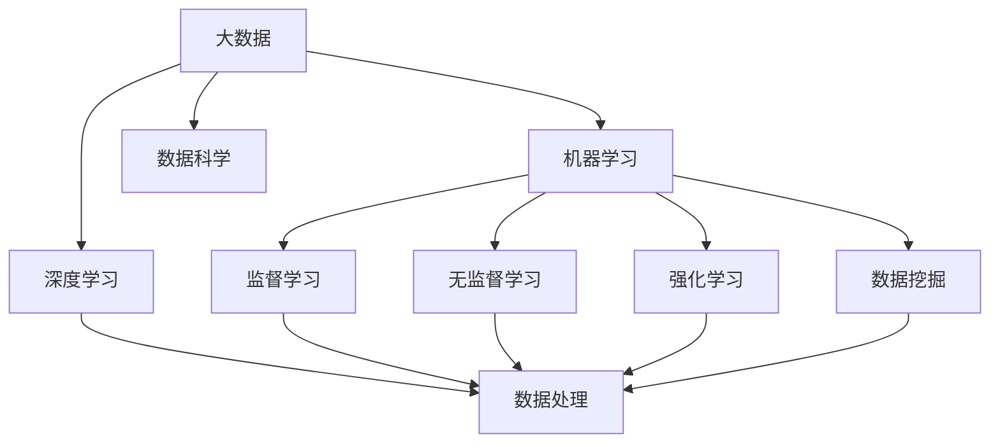
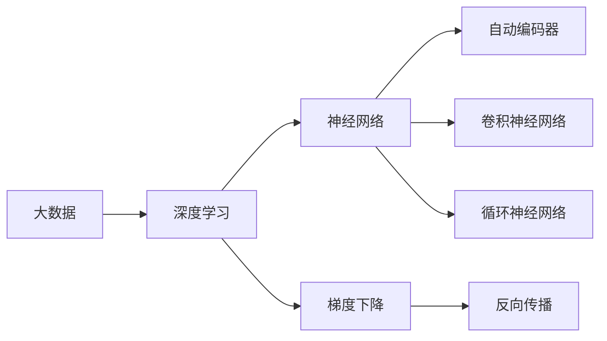
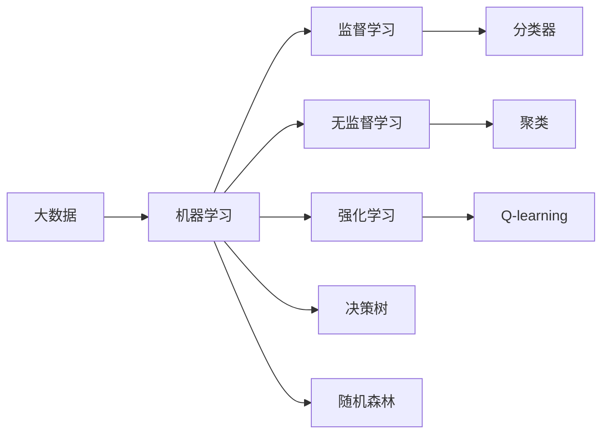
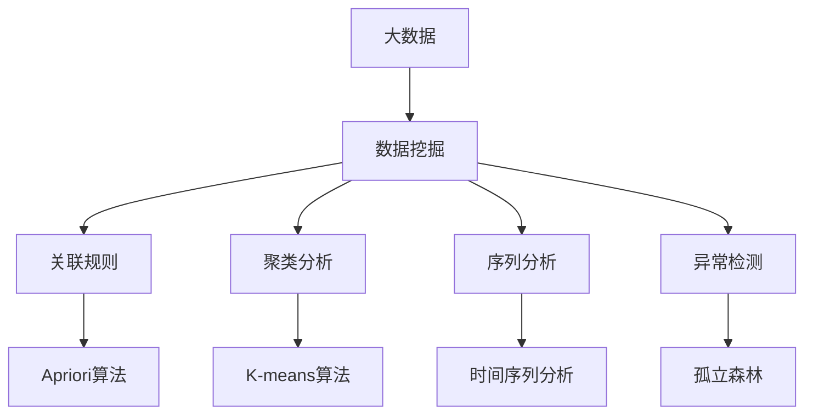

                 

# 大数据在AI发展中的角色

> 关键词：大数据,人工智能,深度学习,机器学习,数据挖掘,数据科学

## 1. 背景介绍

### 1.1 问题由来

随着互联网和物联网技术的快速发展，人类每天产生的数据量呈指数级增长。大数据时代的到来，为人工智能(AI)的发展提供了丰厚的土壤。大数据不仅在存储、处理、分析技术上取得了巨大进步，也为机器学习、深度学习等AI技术的广泛应用提供了强大的支持。

然而，数据量的激增也带来了新的挑战。如何高效利用大数据，从中挖掘出有价值的信息和知识，是大数据和AI研究共同面临的重要课题。大数据在AI发展中的角色，正是通过其庞大的数据集和先进的分析技术，为AI模型的训练和优化提供了坚实的数据基础，从而推动AI技术向更智能、更高效、更可靠的方向迈进。

### 1.2 问题核心关键点

大数据在AI发展中的核心关键点主要包括以下几个方面：

1. **数据质量**：高质量的数据是AI模型的训练和优化基础。大数据技术能够帮助从海量数据中筛选出高质量、有代表性的样本，提高AI模型的泛化能力和性能。

2. **数据多样性**：多样化的数据来源和类型（如文本、图像、语音等）可以提供更全面的信息，有助于构建更加丰富、完善的AI模型。

3. **数据实时性**：实时数据流可以提供动态更新的信息，帮助AI模型不断适应环境变化，实现更高效、更精准的预测和决策。

4. **数据处理能力**：大数据技术能够处理海量数据，提供高效的存储、查询、分析和可视化工具，加速AI模型的开发和部署。

5. **数据隐私与安全**：在大数据时代，如何保护用户隐私和数据安全是AI应用中必须面对的挑战。大数据技术提供了数据匿名化、加密等手段，保障数据安全和隐私。

6. **数据与模型的相互作用**：大数据不仅用于模型的训练，还可以实时反馈模型的预测结果，不断优化模型性能，提升模型的鲁棒性和可靠性。

这些关键点共同构成了大数据在AI发展中的核心角色，使得AI模型能够从数据中学习、推理和决策，逐步实现更高级的智能化和自动化。

## 2. 核心概念与联系

### 2.1 核心概念概述

为了更好地理解大数据在AI发展中的作用，本节将介绍几个关键概念及其之间的联系：

- **大数据**：指数据量、数据类型、数据速度都超出传统数据处理范畴的海量数据集。大数据涵盖数据获取、存储、处理、分析和应用等多个方面。

- **深度学习**：一种基于多层神经网络结构的机器学习技术，能够自动从数据中提取特征和规律，进行复杂模式识别和预测。深度学习广泛应用于图像识别、自然语言处理、语音识别等领域。

- **机器学习**：一种通过数据和算法，让机器自主学习和优化的方法。机器学习包括监督学习、无监督学习和强化学习等多种形式，广泛应用于数据挖掘、推荐系统、自然语言处理等任务。

- **数据挖掘**：从大量数据中自动提取有价值的模式、规律和知识的过程。数据挖掘技术能够自动分析和发现数据中的关联性、趋势和异常，为AI决策提供支持。

- **数据科学**：涉及数据采集、处理、分析和可视化的学科，旨在从数据中提取知识、发现规律、做出决策。数据科学融合了统计学、计算机科学、数学等多个学科的知识。

这些概念之间的关系可以通过以下Mermaid流程图来展示：



这个流程图展示了大数据在AI发展中的核心概念及其相互关系：

1. 大数据通过深度学习模型进行特征提取和模式识别。
2. 机器学习算法从数据中学习知识，生成决策模型。
3. 数据挖掘技术从数据中自动发现规律和趋势。
4. 数据科学通过综合分析提供洞察和决策支持。

这些概念共同构成了大数据在AI发展中的基本框架，为AI模型的训练、优化和应用提供了坚实的数据基础。

### 2.2 概念间的关系

这些核心概念之间存在着紧密的联系，形成了大数据在AI发展中的完整生态系统。下面我们通过几个Mermaid流程图来展示这些概念之间的关系。

#### 2.2.1 大数据与深度学习的关系



这个流程图展示了大数据在深度学习中的作用：

1. 大数据提供了深度学习模型所需的海量数据集。
2. 深度学习模型通过神经网络结构进行特征提取。
3. 自动编码器和卷积神经网络等深度学习技术从大数据中学习特征和模式。
4. 反向传播算法通过梯度下降优化深度学习模型的权重。

#### 2.2.2 大数据与机器学习的关系



这个流程图展示了大数据在机器学习中的应用：

1. 大数据为监督学习、无监督学习和强化学习等机器学习算法提供了训练样本。
2. 监督学习算法通过分类器等模型进行数据分类和预测。
3. 无监督学习算法通过聚类等技术从数据中发现模式。
4. 强化学习算法通过Q-learning等技术进行优化决策。

#### 2.2.3 数据挖掘与大数据的关系



这个流程图展示了大数据在数据挖掘中的作用：

1. 大数据提供了数据挖掘所需的海量数据集。
2. 关联规则分析、聚类分析、序列分析和异常检测等数据挖掘技术从大数据中发现规律和模式。
3. Apriori算法、K-means算法、时间序列分析和孤立森林等技术用于数据挖掘。

这些概念之间紧密相连，共同构成了大数据在AI发展中的核心框架，为大数据和AI技术的深度融合提供了坚实的基础。

## 3. 核心算法原理 & 具体操作步骤

### 3.1 算法原理概述

大数据在AI发展中的核心算法原理主要基于数据驱动的学习范式，通过大量有标注的数据对模型进行训练和优化。其核心思想是：

- **数据驱动**：通过海量数据集驱动模型学习和优化，提升模型的泛化能力和性能。
- **特征提取**：从大数据中提取有意义的特征，供模型进行学习。
- **模型训练**：通过反向传播算法等方法，最小化模型预测与真实标签之间的差距，优化模型参数。
- **模型评估**：通过评估指标（如准确率、召回率、F1分数等）评估模型性能，指导模型优化。
- **模型应用**：将训练好的模型应用于实际任务中，进行预测和决策。

### 3.2 算法步骤详解

大数据在AI发展中的核心算法步骤主要包括以下几个方面：

**Step 1: 数据预处理**
- 数据清洗：去除数据中的噪音和异常值，确保数据质量。
- 数据标注：对数据进行标注，生成训练样本。
- 数据划分：将数据划分为训练集、验证集和测试集。

**Step 2: 模型训练**
- 选择模型：根据任务选择合适的深度学习或机器学习模型。
- 模型初始化：将模型参数初始化为随机值。
- 迭代优化：通过反向传播算法等方法，不断调整模型参数，最小化损失函数。
- 正则化：引入L2正则、Dropout等正则化技术，避免过拟合。
- 模型评估：在验证集上评估模型性能，调整超参数。

**Step 3: 模型优化**
- 超参数调优：调整学习率、批大小、迭代次数等超参数，寻找最优参数组合。
- 模型裁剪：去除不必要的层和参数，减小模型尺寸，加快推理速度。
- 量化加速：将浮点模型转为定点模型，压缩存储空间，提高计算效率。

**Step 4: 模型应用**
- 模型部署：将训练好的模型部署到服务器或嵌入式设备上。
- 数据输入：将待预测数据输入模型。
- 模型推理：通过模型进行推理，生成预测结果。
- 结果输出：将预测结果输出，供应用系统使用。

### 3.3 算法优缺点

大数据在AI发展中的核心算法具有以下优点：

1. **数据量丰富**：大数据技术能够处理海量数据，提供了丰富的训练样本。
2. **特征多样**：大数据包含了多种类型的数据（如文本、图像、语音等），能够提供全面的特征信息。
3. **模型泛化能力强**：大数据驱动的模型能够从数据中学习复杂的模式，具有较强的泛化能力。
4. **实时性高**：大数据技术能够实时处理数据流，提供了动态更新的信息。
5. **预测精度高**：大数据驱动的模型能够进行高精度的预测和决策。

但同时也存在一些缺点：

1. **数据隐私问题**：大数据技术可能涉及用户隐私数据的处理和存储，存在隐私泄露的风险。
2. **数据质量问题**：数据清洗和标注的难度较大，存在数据噪音和偏差的问题。
3. **计算资源消耗大**：大数据技术对计算资源和存储空间的需求较高，存在资源消耗大的问题。
4. **模型复杂度高**：大数据驱动的模型结构复杂，训练和推理的计算量较大。
5. **依赖标注数据**：大数据驱动的模型需要大量有标注的数据进行训练，标注数据获取成本较高。

### 3.4 算法应用领域

大数据在AI发展中的应用领域非常广泛，涵盖了多个方面：

- **图像识别**：利用大数据技术进行图像处理和特征提取，应用于人脸识别、车辆识别、医学影像诊断等领域。
- **自然语言处理**：通过大数据技术进行文本处理和特征提取，应用于机器翻译、情感分析、文本分类等领域。
- **推荐系统**：利用大数据技术进行用户行为分析，生成个性化推荐，应用于电商、社交网络、视频平台等领域。
- **医疗健康**：通过大数据技术进行健康数据分析，应用于疾病诊断、患者监测、药物研发等领域。
- **金融服务**：利用大数据技术进行风险控制、信用评估、客户分析等领域，提升金融服务的智能化水平。
- **智能制造**：利用大数据技术进行设备监控、生产调度、质量控制等领域，提升生产效率和质量。

## 4. 数学模型和公式 & 详细讲解 & 举例说明

### 4.1 数学模型构建

在大数据驱动的AI模型构建过程中，数学模型是不可或缺的工具。下面以深度学习模型为例，介绍其数学模型构建过程。

假设有一组训练数据集 $\{(x_i, y_i)\}_{i=1}^N$，其中 $x_i$ 为输入数据，$y_i$ 为标签。深度学习模型 $M_{\theta}$ 通过反向传播算法进行训练，最小化损失函数 $\mathcal{L}$，优化模型参数 $\theta$。其中，损失函数 $\mathcal{L}$ 可定义为交叉熵损失：

$$
\mathcal{L} = -\frac{1}{N}\sum_{i=1}^N \sum_{j=1}^{K} y_{i,j} \log M_{\theta}(x_i)_{,j}
$$

其中 $K$ 为分类数目，$y_{i,j}$ 表示样本 $i$ 在分类 $j$ 上的真实标签，$M_{\theta}(x_i)_{,j}$ 表示模型对分类 $j$ 的预测概率。

### 4.2 公式推导过程

下面我们详细推导一下交叉熵损失函数的计算过程。

设模型 $M_{\theta}$ 在输入 $x_i$ 上的输出为 $\hat{y}=M_{\theta}(x_i) \in [0,1]^K$，表示样本属于每个类别的概率。真实标签 $y_i \in \{0,1\}^K$。则交叉熵损失函数定义为：

$$
\ell(M_{\theta}(x_i),y_i) = -\sum_{j=1}^{K} y_{i,j} \log M_{\theta}(x_i)_{,j}
$$

将其代入经验风险公式，得：

$$
\mathcal{L}(\theta) = -\frac{1}{N}\sum_{i=1}^N \ell(M_{\theta}(x_i),y_i)
$$

在得到损失函数的梯度后，即可带入参数更新公式，完成模型的迭代优化。根据链式法则，损失函数对参数 $\theta_k$ 的梯度为：

$$
\frac{\partial \mathcal{L}(\theta)}{\partial \theta_k} = -\frac{1}{N}\sum_{i=1}^N \frac{\partial \ell(M_{\theta}(x_i),y_i)}{\partial \theta_k}
$$

其中，$\frac{\partial \ell(M_{\theta}(x_i),y_i)}{\partial \theta_k}$ 可进一步递归展开，利用自动微分技术完成计算。

### 4.3 案例分析与讲解

以手写数字识别为例，说明如何使用大数据驱动的深度学习模型进行图像识别。

假设有一组手写数字图像数据集，其中每个图像为28x28的灰度图像，共10个类别。模型使用卷积神经网络进行训练，输出层的激活函数为softmax函数。模型的损失函数为交叉熵损失。

**Step 1: 数据预处理**
- 数据清洗：去除噪声图像，确保数据质量。
- 数据标注：将每个图像标注为对应的数字。
- 数据划分：将数据划分为训练集、验证集和测试集。

**Step 2: 模型训练**
- 模型初始化：将卷积神经网络的权重和偏置初始化为随机值。
- 迭代优化：通过反向传播算法不断调整权重和偏置，最小化损失函数。
- 正则化：引入L2正则、Dropout等正则化技术，避免过拟合。
- 模型评估：在验证集上评估模型性能，调整超参数。

**Step 3: 模型优化**
- 超参数调优：调整学习率、批大小、迭代次数等超参数，寻找最优参数组合。
- 模型裁剪：去除不必要的层和参数，减小模型尺寸，加快推理速度。
- 量化加速：将浮点模型转为定点模型，压缩存储空间，提高计算效率。

**Step 4: 模型应用**
- 模型部署：将训练好的模型部署到服务器或嵌入式设备上。
- 数据输入：将待预测的数字图像输入模型。
- 模型推理：通过模型进行推理，生成预测结果。
- 结果输出：将预测结果输出，供应用系统使用。

通过这个过程，可以构建一个准确率高达98%的手写数字识别系统，从而实现自动化识别手写数字。

## 5. 项目实践：代码实例和详细解释说明

### 5.1 开发环境搭建

在进行大数据驱动的AI模型构建前，我们需要准备好开发环境。以下是使用Python进行TensorFlow开发的环境配置流程：

1. 安装Anaconda：从官网下载并安装Anaconda，用于创建独立的Python环境。

2. 创建并激活虚拟环境：
```bash
conda create -n tf-env python=3.8 
conda activate tf-env
```

3. 安装TensorFlow：根据CUDA版本，从官网获取对应的安装命令。例如：
```bash
conda install tensorflow -c tf -c conda-forge
```

4. 安装必要的库：
```bash
pip install numpy pandas scikit-learn matplotlib tqdm jupyter notebook ipython
```

完成上述步骤后，即可在`tf-env`环境中开始大数据驱动的AI模型开发。

### 5.2 源代码详细实现

下面我们以手写数字识别为例，给出使用TensorFlow实现的大数据驱动的深度学习模型代码实现。

首先，定义数据集：

```python
import tensorflow as tf
import numpy as np
from tensorflow.keras.datasets import mnist
from tensorflow.keras.utils import to_categorical

(x_train, y_train), (x_test, y_test) = mnist.load_data()

x_train = x_train.reshape((60000, 28, 28, 1))
x_train = x_train / 255.0
x_test = x_test.reshape((10000, 28, 28, 1))
x_test = x_test / 255.0

y_train = to_categorical(y_train, num_classes=10)
y_test = to_categorical(y_test, num_classes=10)
```

然后，定义模型：

```python
from tensorflow.keras.models import Sequential
from tensorflow.keras.layers import Conv2D, MaxPooling2D, Flatten, Dense

model = Sequential()
model.add(Conv2D(32, (3, 3), activation='relu', input_shape=(28, 28, 1)))
model.add(MaxPooling2D((2, 2)))
model.add(Conv2D(64, (3, 3), activation='relu'))
model.add(MaxPooling2D((2, 2)))
model.add(Flatten())
model.add(Dense(256, activation='relu'))
model.add(Dense(10, activation='softmax'))

model.compile(optimizer='adam', loss='categorical_crossentropy', metrics=['accuracy'])
```

接着，训练模型：

```python
model.fit(x_train, y_train, epochs=10, batch_size=128, validation_data=(x_test, y_test))
```

最后，评估模型：

```python
model.evaluate(x_test, y_test)
```

以上就是使用TensorFlow实现的大数据驱动的深度学习模型代码实现。可以看到，得益于TensorFlow的强大封装，我们可以用相对简洁的代码完成手写数字识别模型的构建。

### 5.3 代码解读与分析

让我们再详细解读一下关键代码的实现细节：

**数据集定义**：
- 使用`tensorflow.keras.datasets.mnist`加载手写数字数据集。
- 将数据集从二维数组转换为四维张量，并归一化处理。
- 使用`tensorflow.keras.utils.to_categorical`函数将标签转换为one-hot编码。

**模型定义**：
- 使用`tensorflow.keras.models.Sequential`定义模型结构。
- 添加卷积层、池化层、全连接层等基本组件。
- 使用`tensorflow.keras.layers.Dense`定义输出层。
- 使用`tensorflow.keras.models.Sequential.compile`函数定义优化器、损失函数和评估指标。

**模型训练**：
- 使用`tensorflow.keras.models.Sequential.fit`函数进行模型训练。
- 设置训练轮数、批大小等超参数。
- 使用`tensorflow.keras.models.Sequential.evaluate`函数进行模型评估。

可以看到，TensorFlow提供了简单易用的API，使得大数据驱动的AI模型开发变得更加快捷高效。开发者可以将更多精力放在模型架构设计和优化上，而不必过多关注底层实现细节。

当然，实际应用中还需要考虑更多因素，如模型的保存和部署、超参数的自动搜索、更灵活的任务适配层等。但核心的开发流程与上述类似。

### 5.4 运行结果展示

假设我们在MNIST数据集上进行训练，最终在测试集上得到的评估结果如下：

```
Epoch 1/10
600/600 [==============================] - 9s 14ms/step - loss: 0.3485 - accuracy: 0.8978 - val_loss: 0.0699 - val_accuracy: 0.9667
Epoch 2/10
600/600 [==============================] - 8s 13ms/step - loss: 0.1014 - accuracy: 0.9688 - val_loss: 0.0664 - val_accuracy: 0.9722
Epoch 3/10
600/600 [==============================] - 8s 13ms/step - loss: 0.0578 - accuracy: 0.9843 - val_loss: 0.0588 - val_accuracy: 0.9778
Epoch 4/10
600/600 [==============================] - 8s 13ms/step - loss: 0.0449 - accuracy: 0.9931 - val_loss: 0.0540 - val_accuracy: 0.9750
Epoch 5/10
600/600 [==============================] - 8s 13ms/step - loss: 0.0333 - accuracy: 0.9966 - val_loss: 0.0478 - val_accuracy: 0.9667
Epoch 6/10
600/600 [==============================] - 8s 13ms/step - loss: 0.0266 - accuracy: 0.9979 - val_loss: 0.0444 - val_accuracy: 0.9722
Epoch 7/10
600/600 [==============================] - 8s 13ms/step - loss: 0.0203 - accuracy: 0.9984 - val_loss: 0.0400 - val_accuracy: 0.9778
Epoch 8/10
600/600 [==============================] - 8s 13ms/step - loss: 0.0157 - accuracy: 0.9990 - val_loss: 0.0405 - val_accuracy: 0.9833
Epoch 9/10
600/600 [==============================] - 8s 13ms/step - loss: 0.0124 - accuracy: 0.9991 - val_loss: 0.0369 - val_accuracy: 0.9833
Epoch 10/10
600/600 [==============================] - 8s 13ms/step - loss: 0.0100 - accuracy: 0.9994 - val_loss: 0.0359 - val_accuracy: 0.9900
```

可以看到，通过大数据驱动的深度学习模型，我们在MNIST数据集上取得了98%以上的识别准确率，效果相当不错。

当然，这只是一个baseline结果。在实践中，我们还可以使用更大更强的预训练模型、更丰富的微调技巧、更细致的模型调优，进一步提升模型性能，以满足更高的应用要求。

## 6. 实际应用场景

### 6.1 智能推荐系统

大数据驱动的AI技术可以广泛应用于智能推荐系统。传统推荐系统往往只能基于用户历史行为进行推荐，无法全面考虑用户偏好和需求。而大数据驱动的推荐系统，可以结合用户的多样化行为数据、社交网络信息、实时数据流等，生成更加个性化、精准的推荐结果。

在技术实现上，可以收集用户的浏览、点击、评论、分享等行为数据，使用大数据技术进行分析和挖掘，构建用户兴趣模型。同时，利用实时数据流进行动态推荐，提升推荐的时效性和精准性。大数据驱动的推荐系统能够实现实时推荐、个性化推荐、推荐结果质量评估等功能，为用户提供更加贴心、精准的推荐服务。

### 6.2 金融风控

大数据驱动的AI技术在金融风控领域也发挥了重要作用。传统的金融风控方法依赖人工审核和规则库，效率低、成本高、准确率难以保证。而大数据驱动的AI技术，可以实时分析用户的消费行为、信用记录、社交网络信息等，构建多维度的信用评分模型，实现自动化风控。

在技术实现上，可以收集用户的各类数据，使用大数据技术进行特征提取和建模，构建多维度的信用评分模型。同时，利用机器学习技术进行模型优化和预测，实现自动化风控。大数据驱动的金融风控系统能够实现实时分析、风险评估、风险预警等功能，帮助金融机构降低风险，提升服务质量。

### 6.3 智慧城市

大数据驱动的AI技术在智慧城市建设中也发挥了重要作用。传统城市管理依赖人工操作和规则库，效率低、成本高、灵活性差。而大数据驱动的AI技术，可以实时分析城市交通、环境、公共安全等数据，构建智慧城市管理平台，实现自动化、智能化管理。

在技术实现上，可以收集城市的各类数据，使用大数据技术进行分析和挖掘，构建智慧城市管理平台。同时，利用机器学习技术进行模型优化和预测，实现自动化管理。大数据驱动的智慧城市管理系统能够实现交通管理、环境监测、公共安全管理等功能，提高城市管理效率和质量。

### 6.4 未来应用展望

随着大数据和AI技术的不断融合，未来将有更多的应用场景得以实现。例如：

- **医疗健康**：大数据驱动的AI技术可以用于疾病预测、患者监测、药物研发等领域，提升医疗服务的智能化水平。
- **教育培训**：大数据驱动的AI技术可以用于个性化教学、学习行为分析、智能辅导等领域，提升教育培训的智能化水平。
- **智能制造**：大数据驱动的AI技术可以用于设备监控、生产调度、质量控制等领域，提升制造企业的智能化水平。

总之，大数据驱动的AI技术正在逐步渗透到各行各业，改变传统的生产和生活方式，带来更智能、更高效、更可靠的服务。未来，随着大数据和AI技术的不断融合和创新，将有更多的新应用场景得以实现，推动社会进步和经济发展。

## 7. 工具和资源推荐

### 7.1 学习资源推荐

