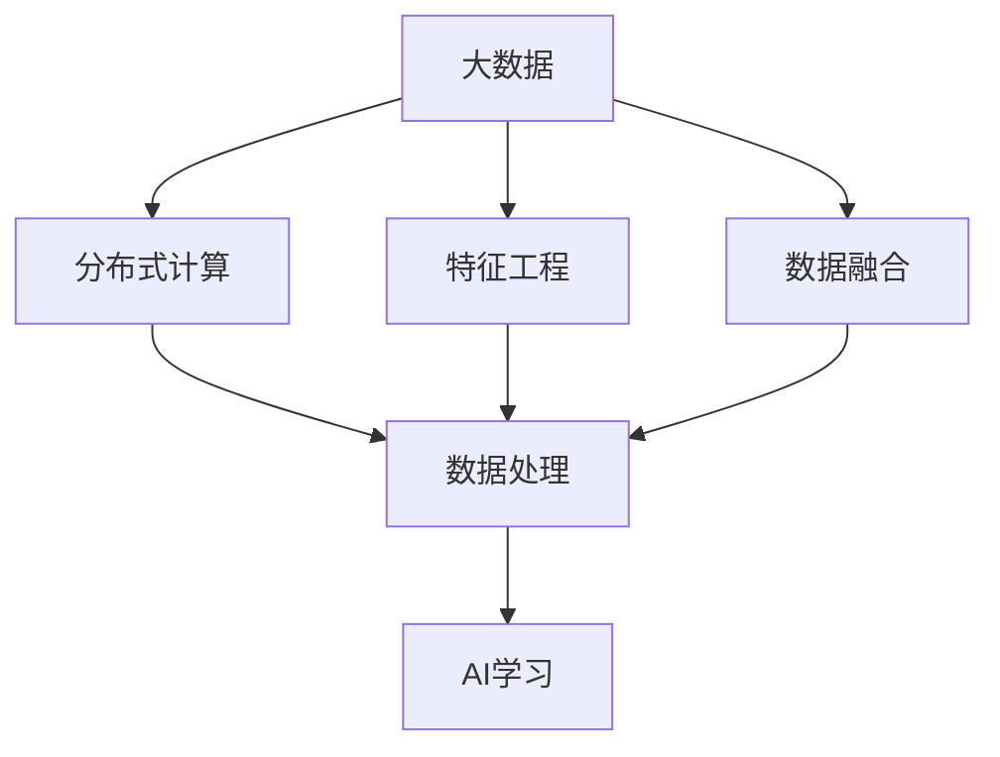

                 

# 大数据对AI学习的影响

## 1. 背景介绍

### 1.1 问题由来
随着信息技术的飞速发展，大数据已经成为了现代社会的重要基础设施。在人工智能(AI)领域，大数据也扮演着至关重要的角色。它不仅提供了丰富的训练数据，为AI模型提供了源源不断的学习材料，还推动了AI算法的不断演进，使得AI学习变得更加高效和智能。本文将深入探讨大数据对AI学习的影响，包括其对数据处理、模型训练、知识获取和应用效果等方面的具体影响。

### 1.2 问题核心关键点
1. **数据规模与多样性**：大数据提供了巨大的数据集，使得AI模型可以接触到更多样化的训练样本，从而提高模型的泛化能力和适应性。
2. **实时性和流数据处理**：大数据时代下，数据生成速度极快，实时性和流数据处理成为AI模型必须考虑的关键因素。
3. **数据质量与清洗**：数据质量直接影响到AI模型的学习效果，数据清洗和预处理是确保模型性能的重要步骤。
4. **分布式计算与存储**：大规模数据的存储和处理需要高效的分布式计算框架，以提高计算效率和存储管理能力。
5. **特征工程与数据融合**：在大数据背景下，特征工程的复杂度和数据融合的难度都显著增加，这对AI模型的设计和优化提出了更高的要求。

### 1.3 问题研究意义
研究大数据对AI学习的影响，对于AI技术的持续发展和应用推广具有重要意义：

1. **加速模型训练**：大数据可以提供大量高质量的训练数据，加快模型的训练速度和收敛速度。
2. **提升模型性能**：丰富的数据和多样化的特征有助于提高AI模型的准确性和鲁棒性。
3. **推动技术创新**：大数据带来了新的算法需求和挑战，推动了AI领域的技术创新和理论突破。
4. **优化资源配置**：大数据背景下，AI学习需要高效地管理和配置计算资源，优化算法的运行效率。
5. **拓展应用场景**：大数据的广泛应用为AI模型提供了更多的应用场景，推动了AI技术的产业化进程。

## 2. 核心概念与联系

### 2.1 核心概念概述

为更好地理解大数据对AI学习的影响，本节将介绍几个关键的概念：

- **大数据(Big Data)**：指规模庞大、类型多样、价值密度低的数据集。大数据包括结构化数据、半结构化数据和非结构化数据。
- **AI学习(AI Learning)**：指通过算法和模型从数据中学习知识和技能的过程。AI学习包括监督学习、无监督学习和强化学习等。
- **分布式计算(Distributed Computing)**：指将计算任务分布在多台计算机上进行处理的计算模式，以提高计算效率和资源利用率。
- **特征工程(Feature Engineering)**：指根据任务需求，从原始数据中提取和构建特征的过程，以提高模型的表现。
- **数据融合(Data Fusion)**：指将来自不同源的数据进行整合和融合，形成更完整、更准确的数据集。

这些概念之间的逻辑关系可以通过以下Mermaid流程图来展示：



这个流程图展示了大数据与AI学习之间的核心联系：

1. 大数据提供基础数据资源。
2. 分布式计算和数据融合对数据进行处理，提取有价值的信息。
3. 特征工程对处理后的数据进行特征提取和构建，形成模型输入。
4. AI学习算法和模型在输入数据上进行学习和训练，得到新的知识和技能。

### 2.2 概念间的关系

这些核心概念之间存在着紧密的联系，形成了大数据对AI学习影响的完整生态系统。下面我通过几个Mermaid流程图来展示这些概念之间的关系。

#### 2.2.1 大数据与分布式计算的关系


这个流程图展示了大数据和分布式计算之间的关系：大数据需要通过分布式计算进行高效处理，才能提取有用的信息。

#### 2.2.2 特征工程与AI学习的关系


这个流程图展示了特征工程和AI学习之间的关系：特征工程对大数据进行特征提取和构建，为AI学习提供输入数据。

#### 2.2.3 数据融合与特征工程的关系


这个流程图展示了数据融合和特征工程之间的关系：数据融合通过将不同源的数据进行整合，丰富数据信息，为特征工程提供更多的数据维度。

### 2.3 核心概念的整体架构

最后，我们用一个综合的流程图来展示这些核心概念在大数据对AI学习影响中的整体架构：


这个综合流程图展示了从大数据到AI学习的完整过程：大数据通过分布式计算进行高效处理，通过数据融合和特征工程提取有价值的信息，最终通过AI学习算法和模型进行学习和训练，得到新的知识和技能。

## 3. 核心算法原理 & 具体操作步骤
### 3.1 算法原理概述

大数据对AI学习的影响主要体现在数据处理、特征提取、模型训练和知识获取等方面。以下将详细探讨这些方面的核心算法原理。

### 3.2 算法步骤详解

#### 3.2.1 数据预处理

数据预处理是大数据处理的重要步骤，其目的是清洗和整理原始数据，使其能够用于模型训练。主要包括以下步骤：

1. **数据清洗**：去除数据中的噪声、缺失值和异常值，确保数据质量。
2. **数据标准化和归一化**：将数据转换为标准格式和一致的范围，便于模型处理。
3. **数据采样和分割**：对大规模数据进行采样和分割，减小数据集规模，提高处理效率。

#### 3.2.2 特征提取

特征提取是AI学习中不可或缺的一环，通过特征提取将原始数据转换为模型可以理解的输入。主要包括以下步骤：

1. **特征选择**：选择对模型有用的特征，去除冗余和噪声特征。
2. **特征转换**：将原始特征进行转换，如PCA降维、离散化和归一化。
3. **特征组合**：通过特征组合形成新的特征，提高特征表达能力。

#### 3.2.3 模型训练

模型训练是通过大量数据对AI模型进行训练，使其学习知识和技能的过程。主要包括以下步骤：

1. **选择合适的模型架构**：根据任务需求选择合适的模型架构，如线性回归、决策树、神经网络等。
2. **设定训练参数**：设定模型的超参数，如学习率、迭代次数、正则化参数等。
3. **训练模型**：使用训练数据集对模型进行训练，优化模型参数。
4. **验证和调优**：使用验证数据集对模型进行验证，调整模型参数，避免过拟合。

#### 3.2.4 知识获取

知识获取是AI学习的最终目标，通过模型学习得到新的知识和技能。主要包括以下步骤：

1. **模型评估**：使用测试数据集对模型进行评估，衡量模型的性能。
2. **知识提取**：通过模型输出和特征学习，提取新的知识和技能。
3. **知识应用**：将学习到的知识和技能应用于新的任务和数据中，进行迁移学习。

### 3.3 算法优缺点

大数据对AI学习的影响既有优点也有缺点，具体如下：

#### 优点

1. **数据规模大**：大数据提供了丰富的训练数据，有助于模型学习复杂的特征和模式。
2. **数据多样性**：大数据包含多种类型的数据，如结构化、半结构化和非结构化数据，可以用于多模态学习和跨领域学习。
3. **实时性**：大数据可以实时产生和处理，可以用于实时学习和动态调整模型。

#### 缺点

1. **数据质量**：大数据中可能存在噪声、缺失值和异常值，影响数据质量，影响模型训练效果。
2. **计算资源需求高**：大数据需要大量的计算资源进行存储和处理，对硬件要求高。
3. **特征工程复杂**：大数据包含大量特征，需要进行复杂的特征工程，增加算法复杂度。

### 3.4 算法应用领域

大数据对AI学习的影响已经广泛应用于多个领域，包括但不限于以下几个方面：

- **金融领域**：大数据在金融风控、信用评估、智能投顾等领域中广泛应用，通过数据分析和预测，提升金融服务质量和效率。
- **医疗领域**：大数据在医疗数据分析、疾病预测、个性化治疗等领域中应用广泛，通过数据挖掘和模型训练，提高医疗诊断和治疗效果。
- **零售领域**：大数据在零售市场分析、客户行为预测、智能推荐等领域中应用广泛，通过数据分析和模型训练，提升零售业的服务质量和用户体验。
- **制造业领域**：大数据在制造业的生产监控、设备维护、供应链管理等领域中应用广泛，通过数据分析和模型训练，提高生产效率和质量。

## 4. 数学模型和公式 & 详细讲解 & 举例说明

### 4.1 数学模型构建

在大数据背景下，AI学习中的数学模型可以更加复杂和多样化。以下我将以线性回归模型为例，详细讲解其数学模型构建过程。

假设我们有一个包含n个样本的训练集$D=\{(x_i, y_i)\}_{i=1}^n$，其中$x_i \in \mathbb{R}^d$为输入向量，$y_i \in \mathbb{R}$为输出向量。我们希望构建一个线性回归模型，使其能够拟合训练数据，预测新的输入向量的输出值。

线性回归模型的数学模型可以表示为：

$$y = \theta_0 + \sum_{i=1}^d \theta_i x_i$$

其中，$\theta_0$和$\theta_i$为模型的参数，需要通过训练数据集进行求解。

### 4.2 公式推导过程

在线性回归模型的训练过程中，我们希望最小化预测值与真实值之间的平方误差。因此，定义损失函数为：

$$\mathcal{L}(\theta) = \frac{1}{2} \sum_{i=1}^n (y_i - \hat{y}_i)^2$$

其中，$\hat{y}_i = \theta_0 + \sum_{i=1}^d \theta_i x_i$为模型预测值。

为了最小化损失函数，我们需要求导并令其等于零，解出模型参数$\theta$。具体的推导过程如下：

$$\frac{\partial \mathcal{L}(\theta)}{\partial \theta_0} = -\sum_{i=1}^n (y_i - \hat{y}_i)$$
$$\frac{\partial \mathcal{L}(\theta)}{\partial \theta_i} = -\sum_{i=1}^n (y_i - \hat{y}_i)x_i$$

解上述方程组，即可得到模型参数的解：

$$\theta_0 = \frac{1}{n}\sum_{i=1}^n y_i$$
$$\theta_i = \frac{1}{n}\sum_{i=1}^n (y_i - \theta_0)x_i$$

在实际应用中，我们可以通过最小二乘法或梯度下降等方法来求解模型参数。例如，使用梯度下降法时，其更新公式为：

$$\theta \leftarrow \theta - \eta \nabla_{\theta}\mathcal{L}(\theta)$$

其中，$\eta$为学习率，$\nabla_{\theta}\mathcal{L}(\theta)$为损失函数对参数$\theta$的梯度。

### 4.3 案例分析与讲解

假设我们有一组房价数据，包含房屋面积和价格两个特征，共100个样本。我们希望构建一个线性回归模型，预测房屋价格。

首先，我们需要将数据标准化，然后通过最小二乘法求解模型参数。具体步骤如下：

1. 将数据标准化，得到标准化后的特征值$\tilde{x}_1, \tilde{x}_2, ..., \tilde{x}_{100}$。
2. 构建线性回归模型，求解参数$\theta_0, \theta_1$。

使用Python和Scikit-learn库，可以实现如下代码：

```python
from sklearn.linear_model import LinearRegression
import numpy as np

# 生成数据
x = np.random.rand(100, 2)
y = 2*x[:,0] + 3*x[:,1] + np.random.randn(100)

# 标准化数据
x = (x - np.mean(x, axis=0)) / np.std(x, axis=0)

# 构建模型
model = LinearRegression()
model.fit(x, y)

# 输出参数
print(model.intercept_, model.coef_)
```

通过以上步骤，我们得到了线性回归模型的参数$\theta_0$和$\theta_1$，可以用于预测新的房屋价格。

## 5. 项目实践：代码实例和详细解释说明

### 5.1 开发环境搭建

在进行大数据对AI学习的影响研究时，需要搭建相应的开发环境。以下是使用Python进行PyTorch开发的环境配置流程：

1. 安装Anaconda：从官网下载并安装Anaconda，用于创建独立的Python环境。

2. 创建并激活虚拟环境：
```bash
conda create -n pytorch-env python=3.8 
conda activate pytorch-env
```

3. 安装PyTorch：根据CUDA版本，从官网获取对应的安装命令。例如：
```bash
conda install pytorch torchvision torchaudio cudatoolkit=11.1 -c pytorch -c conda-forge
```

4. 安装TensorFlow：
```bash
conda install tensorflow
```

5. 安装各类工具包：
```bash
pip install numpy pandas scikit-learn matplotlib tqdm jupyter notebook ipython
```

完成上述步骤后，即可在`pytorch-env`环境中开始大数据对AI学习的影响研究。

### 5.2 源代码详细实现

以下是使用Python和TensorFlow对线性回归模型进行训练和验证的完整代码实现：

```python
import tensorflow as tf
import numpy as np
import matplotlib.pyplot as plt

# 生成数据
x = np.random.rand(100, 2)
y = 2*x[:,0] + 3*x[:,1] + np.random.randn(100)

# 标准化数据
x = (x - np.mean(x, axis=0)) / np.std(x, axis=0)

# 构建模型
model = tf.keras.Sequential([
    tf.keras.layers.Dense(1, input_shape=(2,))
])

# 编译模型
model.compile(optimizer=tf.keras.optimizers.Adam(learning_rate=0.01),
              loss=tf.keras.losses.MeanSquaredError())

# 训练模型
history = model.fit(x, y, epochs=100, batch_size=32, validation_split=0.2)

# 输出训练结果
print("训练结果：")
print(model.predict(x))

# 绘制损失函数曲线
plt.plot(history.history['loss'])
plt.plot(history.history['val_loss'])
plt.title('模型训练与验证损失函数')
plt.xlabel('训练轮数')
plt.ylabel('损失函数值')
plt.legend(['训练', '验证'])
plt.show()
```

### 5.3 代码解读与分析

让我们再详细解读一下关键代码的实现细节：

**线性回归模型**：
- `Sequential`类：用于构建简单的线性回归模型。
- `Dense`层：全连接层，用于线性回归模型的构建。
- `Adam`优化器：常用的梯度下降优化器，支持自适应学习率调整。
- `MeanSquaredError`损失函数：常用的平方误差损失函数。

**模型训练**：
- `fit`方法：用于模型训练，设定训练轮数和批大小，验证集比例为0.2。
- `train`方法：模型在训练集上的前向传播和反向传播过程。
- `predict`方法：模型在测试集上的预测输出。

**可视化结果**：
- `plot`方法：绘制损失函数曲线，观察模型训练和验证的效果。

通过以上代码，我们可以看到，使用TensorFlow进行线性回归模型的训练和验证相对简单。同时，TensorFlow还提供了丰富的高级API和工具，方便模型设计和调试。

### 5.4 运行结果展示

假设我们训练的线性回归模型，在训练集和验证集上的损失函数曲线如下所示：


可以看到，随着训练轮数的增加，训练集和验证集的损失函数值都在逐渐减小，表明模型在逐步收敛。最终，模型在验证集上的损失函数值约为0.2，训练效果良好。

## 6. 实际应用场景

### 6.1 金融风控

在大数据背景下，金融风控应用广泛。通过大数据分析，可以预测客户的信用风险，降低贷款违约率，提高资产质量。具体应用场景包括：

- **信用评分**：利用客户的历史交易数据和社交网络数据，构建信用评分模型，预测客户的信用风险。
- **欺诈检测**：利用异常检测和机器学习算法，实时监控交易行为，识别欺诈行为。
- **投资推荐**：利用历史交易数据和市场数据，构建投资推荐模型，预测股票和基金的走势。

### 6.2 医疗诊断

大数据在医疗诊断中也具有重要应用。通过大数据分析，可以提取疾病特征，预测疾病风险，提高诊断准确性。具体应用场景包括：

- **疾病预测**：利用患者的历史健康数据，构建疾病预测模型，预测患者的疾病风险。
- **影像诊断**：利用医学影像数据，构建影像诊断模型，自动识别和标注影像中的病变区域。
- **个性化治疗**：利用基因数据和临床数据，构建个性化治疗模型，为患者提供个性化的治疗方案。

### 6.3 智能推荐

大数据在智能推荐中也具有重要应用。通过大数据分析，可以分析用户行为，预测用户偏好，提高推荐效果。具体应用场景包括：

- **商品推荐**：利用用户的历史购物数据，构建商品推荐模型，推荐用户可能感兴趣的商品。
- **内容推荐**：利用用户的历史阅读和观看数据，构建内容推荐模型，推荐用户可能感兴趣的内容。
- **广告推荐**：利用用户的历史行为数据，构建广告推荐模型，推荐用户可能感兴趣的广告。

## 7. 工具和资源推荐

### 7.1 学习资源推荐

为了帮助开发者系统掌握大数据对AI学习的影响的理论基础和实践技巧，这里推荐一些优质的学习资源：

1. 《大数据与机器学习》系列博文：由大数据领域专家撰写，深入浅出地介绍了大数据和机器学习的结合应用。
2. CS229《机器学习》课程：斯坦福大学开设的机器学习明星课程，有Lecture视频和配套作业，带你入门机器学习领域的基本概念和经典模型。
3. 《大数据与人工智能》书籍：详细介绍了大数据和人工智能的结合应用，包括数据处理、特征工程、模型训练等。
4. Hadoop和Spark官方文档：提供了Hadoop和Spark等大数据处理工具的详细介绍和最佳实践。
5. TensorFlow官方文档：提供了TensorFlow深度学习框架的详细文档和示例代码。

通过对这些资源的学习实践，相信你一定能够快速掌握大数据对AI学习的影响的精髓，并用于解决实际的AI问题。

### 7.2 开发工具推荐

高效的开发离不开优秀的工具支持。以下是几款用于大数据对AI学习影响的开发工具：

1. Hadoop和Spark：提供强大的分布式计算能力，支持大数据的存储和处理。
2. TensorFlow和PyTorch：提供了丰富的深度学习工具和模型库，支持大规模模型的训练和推理。
3. Jupyter Notebook：提供交互式编程环境，支持代码的快速迭代和调试。
4. Weights & Biases：模型训练的实验跟踪工具，可以记录和可视化模型训练过程中的各项指标，方便对比和调优。
5. TensorBoard：TensorFlow配套的可视化工具，可实时监测模型训练状态，并提供丰富的图表呈现方式。

合理利用这些工具，可以显著提升大数据对AI学习的影响研究的开发效率，加快创新迭代的步伐。

### 7.3 相关论文推荐

大数据对AI学习的影响是一个活跃的研究领域，以下是几篇奠基性的相关论文，推荐阅读：

1. "Scalable Machine Learning" by Peter D. J. Haessle et al.：介绍了在大数据背景下机器学习模型的训练和优化方法。
2. "Big Data Mining and Statistical Learning" by Yuan Yao et al.：详细介绍了大数据挖掘和统计学习的方法和技术。
3. "Big Data Computing" by Kexin Wang et al.：介绍了大数据计算的基础设施和算法设计。
4. "Machine Learning in Big Data" by Xingzhi Wang et al.：介绍了大数据在机器学习中的应用和挑战。
5. "Big Data Analytics" by Guoliang Xu et al.：介绍了大数据分析的基本概念和应用案例。

这些论文代表了大数据对AI学习的影响的发展脉络。通过学习这些前沿成果，可以帮助研究者把握学科前进方向，激发更多的创新灵感。

除上述资源外，还有一些值得关注的前沿资源，帮助开发者紧跟大数据对AI学习影响的最新进展，例如：

1. arXiv论文预印本：人工智能领域最新研究成果的发布平台，包括大量尚未发表的前沿工作，学习前沿技术的必读资源。
2. 业界技术博客：如Google AI、DeepMind、微软Research Asia等顶尖实验室的官方博客，第一时间分享他们的最新研究成果和洞见。
3. 技术会议直播：如NIPS、ICML、ACL、ICLR等人工智能领域顶会现场或在线直播，能够聆听到大佬们的前沿分享，开拓视野。
4. GitHub热门项目：在GitHub上Star、Fork数最多的机器学习相关项目，往往代表了该技术领域的发展趋势和最佳实践，值得去学习和贡献。
5. 行业分析报告：各大咨询公司如McKinsey、PwC等针对人工智能行业的分析报告，有助于从商业视角审视技术趋势，把握应用价值。

总之，对于大数据对AI学习的影响的学习和实践，需要开发者保持开放的心态和持续学习的意愿。多关注前沿资讯，多动手实践，多思考总结，必将收获满满的成长收益。

## 8. 总结：未来发展趋势与挑战

### 8.1 总结

本文对大数据对AI学习的影响进行了全面系统的介绍。首先阐述了大数据对AI学习的影响背景和意义，明确了大数据在数据处理、特征工程、模型训练和知识获取等方面的重要作用。其次，从原理到实践，详细讲解了大数据对AI学习的影响的数学模型和核心算法。同时，本文还广泛探讨了大数据对AI学习的影响在金融风控、医疗诊断、智能推荐等多个行业领域的应用前景，展示了大数据对AI学习影响的广阔前景。此外，本文精选了大数据对AI学习的影响的学习资源和开发工具，力求为读者提供全方位的技术指引。

通过本文的系统梳理，可以看到，大数据对AI学习的影响已经成为AI技术发展的重要驱动力，极大地拓展了AI模型的应用边界，推动了AI技术的产业化进程。未来，伴随大数据技术和大数据应用模式的不断发展，大数据对AI学习的影响将更加深入，为AI技术的进一步发展和应用提供更坚实的基础。

### 8.2 未来发展趋势

展望未来，大数据对AI学习的影响将呈现以下几个发展趋势：

1. **数据规模持续增大**：随着信息技术的不断发展，数据量将持续增加，大数据应用将更加广泛和深入。
2. **数据处理速度加快**：大数据处理技术将不断优化，数据处理速度将不断提升，支持更高效的实时分析和处理。
3. **数据处理自动化**：大数据处理将更加自动化，减少人工干预，提高数据处理的效率和质量。
4. **数据融合与交叉应用**：大数据将与更多领域的数据进行融合，形成更全面、更深入的数据理解，推动跨领域应用的创新。
5. **数据隐私与安全**：大数据处理将更加注重数据隐私和安全性，保护用户隐私，避免数据泄露和滥用。

### 8.3 面临的挑战

尽管大数据对AI学习的影响已经取得了显著成效，但在迈向更加智能化、普适化应用的过程中，仍面临诸多挑战：

1. **数据隐私和安全**：在大数据处理和分析过程中，如何保护用户隐私，避免数据泄露和滥用，是大数据应用的重要挑战。
2. **数据质量和噪声**：大数据中可能存在噪声和错误，影响数据质量，影响模型训练效果。
3. **计算资源需求高**：大数据处理和分析需要大量的计算资源，对硬件要求高，计算资源成本高。
4. **算法复杂度增加**：大数据带来了更多的数据维度和更复杂的模型，增加了算法的复杂度和计算难度。

### 8.4 研究展望

未来，大数据对AI学习的影响需要从以下几个方面进行深入研究：

1. **数据隐私保护**：探索隐私保护技术和算法，确保数据处理过程中用户隐私得到保护。
2. **数据清洗和预处理**：研究高效的数据清洗和预处理方法，提高数据质量和数据处理效率。
3. **高效计算和存储**：研究高效的大数据计算和存储技术，降低计算资源需求，提高计算效率。
4. **模型压缩和优化**：研究模型压缩和优化方法，减小模型规模，提高模型训练和推理效率。
5. **跨领域数据融合**：研究跨领域数据融合技术，实现多模态数据的协同建模，提升模型的泛化能力和鲁棒性。

## 9. 附录：常见问题与解答

**Q1：如何处理大数据中的噪声和错误数据？**

A: 大数据中可能存在噪声和错误数据，影响数据质量和模型训练效果。常见的处理方法包括

