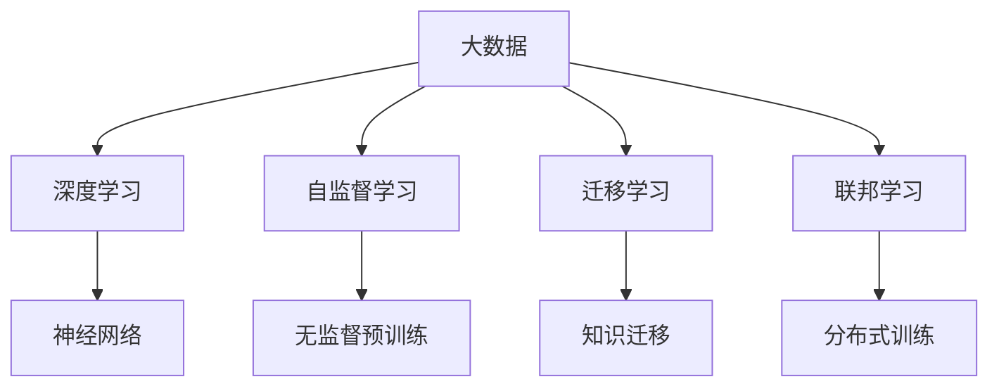
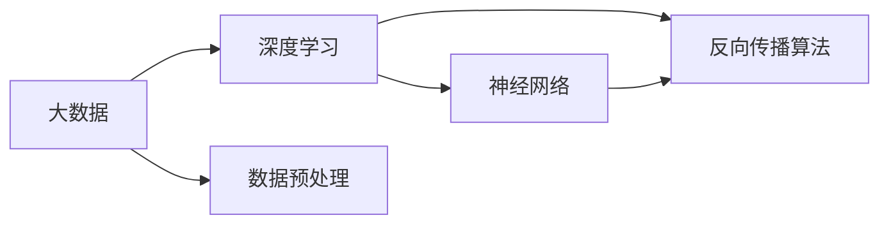
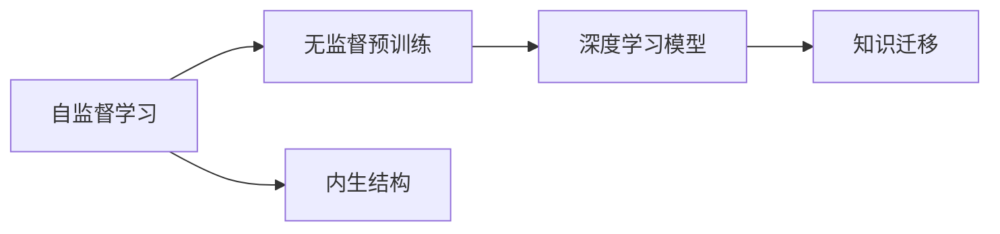
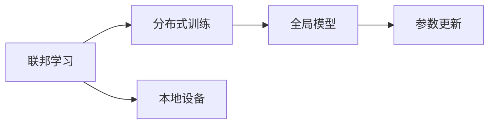
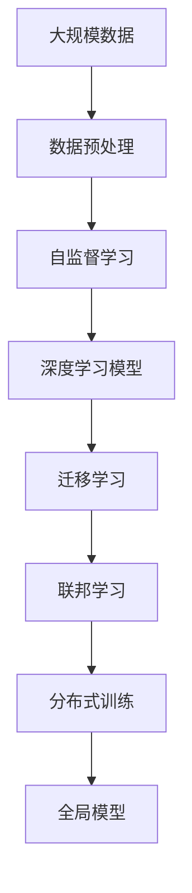

                 

# 大数据驱动AI学习的可能性

> 关键词：大数据,深度学习,人工智能,数据挖掘,机器学习

## 1. 背景介绍

### 1.1 问题由来

随着信息时代的到来，大数据逐渐成为驱动人工智能(AI)发展的关键要素。在当今社会，无论是企业运营、科学研究，还是日常生活，数据无处不在，正以指数级速度增长。大数据所蕴含的巨大潜力，推动了AI技术的突破性进展，促使AI学习范式发生根本性变化。

在数据驱动下，AI不再仅限于依赖人工标注的少量数据集，而是能够在海量的无标签数据中自主学习和挖掘知识。这种学习方式，被称为“自监督学习”，极大地拓展了AI的应用范围和能力。本文将探讨大数据如何驱动AI学习，并解析其在多个领域的实际应用案例。

### 1.2 问题核心关键点

大数据驱动AI学习的关键在于，如何高效利用和处理海量数据，从中提取有价值的信息和模式。在数据驱动的学习过程中，以下几个核心概念尤为关键：

1. **自监督学习(Self-Supervised Learning)**：利用大数据中的内生结构进行学习，无需人工标注，即可发现数据的隐含规律。

2. **深度学习(Deep Learning)**：在多层神经网络中学习复杂的非线性关系，通过反向传播算法优化模型参数，从而实现高效的数据表示和分类。

3. **数据挖掘(Data Mining)**：从大数据中自动发现有用模式、知识或规律，包括聚类、分类、回归等算法。

4. **机器学习(Machine Learning)**：利用统计学模型和算法，让机器从数据中学习规律，并做出预测或决策。

5. **迁移学习(Transfer Learning)**：将在一个任务上学习到的知识，迁移到另一个任务上，以提高新任务的性能。

6. **联邦学习(Federated Learning)**：多设备协同训练模型，保护数据隐私的同时，实现知识共享。

这些概念共同构成了大数据驱动AI学习的基础框架，极大地提升了AI模型的学习和推理能力。

### 1.3 问题研究意义

大数据驱动AI学习的研究，对于提升AI系统的性能、拓展其应用范围、加速产业化和科学研究具有重要意义：

1. **性能提升**：大数据提供了丰富的训练样本，使得AI模型能够更好地学习复杂的非线性关系，提升模型的泛化能力和鲁棒性。
2. **应用拓展**：自监督学习和迁移学习技术，使AI模型能够在无需大量标注数据的情况下，应用于更多领域，如自然语言处理、计算机视觉、医疗诊断等。
3. **产业化加速**：大数据和深度学习技术的结合，显著降低了AI技术应用的成本，加速了AI技术的商业化和落地应用。
4. **科学研究突破**：大数据驱动AI学习，促进了科学研究新方法的探索，开辟了更多的研究路径和领域。
5. **伦理与安全**：大数据驱动AI学习，需要关注数据隐私、数据偏见、算法透明性等问题，推动了AI伦理与安全研究的进步。

## 2. 核心概念与联系

### 2.1 核心概念概述

为更好地理解大数据驱动AI学习的方法，本节将介绍几个密切相关的核心概念：

- **大数据(Big Data)**：指的是超大规模、高速增长、多样化、复杂性的数据集，典型特征是4V：Volume、Velocity、Variety、Veracity。
- **深度学习(Deep Learning)**：利用多层神经网络结构，通过反向传播算法进行参数优化，自动提取数据的高层次特征表示。
- **自监督学习(Self-Supervised Learning)**：通过数据自身的内在结构进行学习，无需人工标注。
- **迁移学习(Transfer Learning)**：在源任务上学习到的知识，可以迁移到目标任务上，提高新任务的表现。
- **联邦学习(Federated Learning)**：多个设备协同训练模型，保护数据隐私的同时，实现知识共享。

这些概念之间存在着紧密的联系，构成了大数据驱动AI学习的基本框架。接下来，我们将通过一个Mermaid流程图展示这些概念之间的联系：



这个流程图展示了大数据与深度学习、自监督学习、迁移学习、联邦学习之间的关系：

1. **大数据**为深度学习提供了丰富的训练样本，使得模型能够通过反向传播算法进行参数优化。
2. **自监督学习**利用大数据中的内生结构进行学习，无需人工标注，提高了数据利用率。
3. **迁移学习**使得模型能够在不同任务之间进行知识迁移，提升了新任务的表现。
4. **联邦学习**使得多设备能够协同训练模型，保护数据隐私的同时，实现知识共享。

这些概念共同构成了大数据驱动AI学习的基本生态系统。

### 2.2 概念间的关系

这些核心概念之间存在着紧密的联系，构成了大数据驱动AI学习的基本框架。接下来，我们将通过几个Mermaid流程图展示这些概念之间的关系。

#### 2.2.1 大数据与深度学习的关系



这个流程图展示了大数据与深度学习的关系：

1. **大数据**提供了丰富的训练样本，通过**数据预处理**，转化为深度学习模型的输入。
2. **深度学习**通过**神经网络**结构，在反向传播算法下，自动优化模型参数，提取数据的高层次特征表示。

#### 2.2.2 自监督学习与迁移学习的关系



这个流程图展示了自监督学习与迁移学习的关系：

1. **自监督学习**利用数据本身的**内生结构**进行学习，无需人工标注。
2. **无监督预训练**通过自监督学习方法，在深度学习模型上进行预训练，提取特征表示。
3. **迁移学习**将预训练模型中的知识迁移到新任务上，提升新任务的表现。

#### 2.2.3 联邦学习与分布式训练的关系



这个流程图展示了联邦学习与分布式训练的关系：

1. **联邦学习**涉及多个本地设备的协同训练。
2. **分布式训练**在本地设备上并行进行模型训练，在联邦学习框架下进行参数更新。
3. **全局模型**汇总各设备上的参数更新，最终得到全局一致的模型参数。

### 2.3 核心概念的整体架构

最后，我们用一个综合的流程图来展示这些核心概念在大数据驱动AI学习过程中的整体架构：



这个综合流程图展示了从数据预处理到全局模型训练的完整过程：

1. **大规模数据**经过**数据预处理**，输入到**自监督学习**中进行学习。
2. **自监督学习**得到的特征表示，作为**深度学习模型**的输入。
3. **迁移学习**将深度学习模型中的知识迁移到新任务上，提升新任务的表现。
4. **联邦学习**在多个本地设备上并行训练模型，最终汇总得到**全局模型**。

## 3. 核心算法原理 & 具体操作步骤
### 3.1 算法原理概述

大数据驱动AI学习，本质上是通过深度学习和自监督学习的方法，在大量无标签数据上进行特征提取和模型训练，从而实现高效的AI学习。其核心思想是：通过海量的无标签数据进行预训练，提取特征表示，再通过迁移学习，将这些特征表示应用到具体任务上，实现高效的学习和推理。

形式化地，假设大数据集为 $D=\{(x_i,y_i)\}_{i=1}^N, x_i \in \mathbb{R}^d, y_i \in \{0,1\}$，目标任务为 $T$，则大数据驱动AI学习的过程可以表示为：

1. **数据预处理**：对大数据进行清洗、去噪、归一化等处理，以适合深度学习模型的输入。
2. **无监督预训练**：在深度学习模型上，利用数据的内生结构进行无监督预训练，学习特征表示。
3. **迁移学习**：将预训练模型中的知识迁移到目标任务上，通过任务特定的微调，实现高效的AI学习。

### 3.2 算法步骤详解

大数据驱动AI学习的步骤一般包括以下几个关键步骤：

**Step 1: 准备大数据和任务**
- 收集和预处理大规模的数据集 $D$，划分为训练集、验证集和测试集。
- 选择合适的目标任务 $T$，设计任务特定的损失函数。

**Step 2: 选择模型架构**
- 根据任务类型，选择适合的深度学习模型架构，如卷积神经网络(CNN)、循环神经网络(RNN)、变压器(Transformer)等。
- 设置模型的超参数，如学习率、批大小、迭代轮数等。

**Step 3: 执行无监督预训练**
- 使用无监督学习任务对模型进行预训练，如自监督学习任务、生成对抗网络(GAN)等。
- 在训练过程中，使用正则化技术，如L2正则、Dropout等，防止模型过拟合。
- 保存预训练模型，作为后续任务微调的初始化参数。

**Step 4: 执行迁移学习**
- 在预训练模型的基础上，使用目标任务的标注数据，进行迁移学习。
- 设计任务适配层，将预训练模型的输出映射到目标任务的预测结果。
- 应用正则化技术，如权重衰减、Dropout等，防止模型过拟合。
- 通过梯度下降等优化算法，最小化损失函数，更新模型参数。
- 周期性在验证集上评估模型性能，决定是否停止训练。

**Step 5: 测试和部署**
- 在测试集上评估模型性能，对比预训练和微调后的效果。
- 使用微调后的模型进行新数据的推理和预测，集成到实际的应用系统中。
- 持续收集新数据，定期重新训练模型，以适应数据分布的变化。

以上是大数据驱动AI学习的一般流程。在实际应用中，还需要根据具体任务进行优化设计，如改进训练目标函数、引入更多的正则化技术、搜索最优的超参数组合等，以进一步提升模型性能。

### 3.3 算法优缺点

大数据驱动AI学习具有以下优点：

1. **数据效率高**：无需人工标注数据，利用无标签大数据进行无监督学习，节省了大量标注成本。
2. **学习能力强**：通过多任务自监督学习，提取数据的高层次特征表示，提高了模型的泛化能力和鲁棒性。
3. **应用范围广**：适用于各种NLP、计算机视觉、时间序列预测等任务，模型可迁移应用到不同领域。
4. **产业化进程快**：降低了技术应用的成本和门槛，加速了AI技术的商业化和落地应用。
5. **科研价值高**：推动了新算法和新理论的研究，拓展了AI研究的广度和深度。

同时，该方法也存在一些局限性：

1. **数据质量要求高**：大数据驱动AI学习依赖高质量的数据，数据噪声和错误可能影响模型性能。
2. **计算资源需求大**：深度学习模型需要大量的计算资源，训练和推理开销较大。
3. **模型复杂度高**：深度学习模型的结构复杂，不易解释和调试。
4. **隐私保护问题**：大数据驱动AI学习涉及到数据的分布和存储，隐私保护是一个重要问题。
5. **泛化能力有限**：在数据分布差异较大的情况下，模型的泛化性能可能受到限制。

尽管存在这些局限性，但就目前而言，大数据驱动AI学习仍然是大规模数据处理和AI学习的重要方法，广泛应用于各个行业。未来相关研究的重点在于如何进一步优化数据预处理、提升模型效率、改进隐私保护机制，同时兼顾模型可解释性和伦理安全性等因素。

### 3.4 算法应用领域

大数据驱动AI学习在多个领域得到了广泛的应用，包括但不限于：

- **自然语言处理(NLP)**：利用大规模语料库进行无监督预训练，提升模型的语言理解能力。
- **计算机视觉(CV)**：通过大规模图像数据进行自监督学习，提取视觉特征，提升图像分类、目标检测等任务性能。
- **医疗健康**：利用电子病历等健康数据进行预训练，辅助疾病诊断和治疗。
- **金融科技**：通过金融数据进行风险预测和投资决策。
- **智能制造**：利用工业数据进行设备预测维护和生产优化。
- **智慧城市**：利用城市数据进行交通管理、公共安全等应用。
- **自动驾驶**：利用环境数据进行道路识别和驾驶决策。

除了上述这些领域，大数据驱动AI学习还在越来越多的行业得到应用，成为驱动行业数字化转型升级的重要技术手段。

## 4. 数学模型和公式 & 详细讲解  
### 4.1 数学模型构建

本节将使用数学语言对大数据驱动AI学习的过程进行更加严格的刻画。

记大数据集为 $D=\{(x_i,y_i)\}_{i=1}^N, x_i \in \mathbb{R}^d, y_i \in \{0,1\}$，目标任务为 $T$，则大数据驱动AI学习的过程可以表示为：

$$
\min_{\theta} \mathcal{L}(\theta, T)
$$

其中 $\theta$ 为深度学习模型的参数，$\mathcal{L}$ 为目标任务 $T$ 的损失函数，用于衡量模型预测输出与真实标签之间的差异。常见的损失函数包括交叉熵损失、均方误差损失等。

### 4.2 公式推导过程

以下我们以二分类任务为例，推导交叉熵损失函数及其梯度的计算公式。

假设模型 $M_{\theta}$ 在输入 $x$ 上的输出为 $\hat{y}=M_{\theta}(x) \in [0,1]$，表示样本属于正类的概率。真实标签 $y \in \{0,1\}$。则二分类交叉熵损失函数定义为：

$$
\ell(M_{\theta}(x),y) = -[y\log \hat{y} + (1-y)\log (1-\hat{y})]
$$

将其代入经验风险公式，得：

$$
\mathcal{L}(\theta) = -\frac{1}{N}\sum_{i=1}^N [y_i\log M_{\theta}(x_i)+(1-y_i)\log(1-M_{\theta}(x_i))]
$$

根据链式法则，损失函数对参数 $\theta_k$ 的梯度为：

$$
\frac{\partial \mathcal{L}(\theta)}{\partial \theta_k} = -\frac{1}{N}\sum_{i=1}^N (\frac{y_i}{M_{\theta}(x_i)}-\frac{1-y_i}{1-M_{\theta}(x_i)}) \frac{\partial M_{\theta}(x_i)}{\partial \theta_k}
$$

其中 $\frac{\partial M_{\theta}(x_i)}{\partial \theta_k}$ 可进一步递归展开，利用自动微分技术完成计算。

在得到损失函数的梯度后，即可带入参数更新公式，完成模型的迭代优化。重复上述过程直至收敛，最终得到适应目标任务的最优模型参数 $\theta^*$。

## 5. 项目实践：代码实例和详细解释说明
### 5.1 开发环境搭建

在进行大数据驱动AI学习的实践前，我们需要准备好开发环境。以下是使用Python进行PyTorch开发的环境配置流程：

1. 安装Anaconda：从官网下载并安装Anaconda，用于创建独立的Python环境。

2. 创建并激活虚拟环境：
```bash
conda create -n pytorch-env python=3.8 
conda activate pytorch-env
```

3. 安装PyTorch：根据CUDA版本，从官网获取对应的安装命令。例如：
```bash
conda install pytorch torchvision torchaudio cudatoolkit=11.1 -c pytorch -c conda-forge
```

4. 安装Transformers库：
```bash
pip install transformers
```

5. 安装各类工具包：
```bash
pip install numpy pandas scikit-learn matplotlib tqdm jupyter notebook ipython
```

完成上述步骤后，即可在`pytorch-env`环境中开始大数据驱动AI学习的实践。

### 5.2 源代码详细实现

下面我们以自然语言处理(NLP)领域为例，给出使用Transformers库对BERT模型进行无监督预训练和迁移学习的PyTorch代码实现。

首先，定义预训练数据集：

```python
from transformers import BertTokenizer
from torch.utils.data import Dataset
import torch

class NLPDataset(Dataset):
    def __init__(self, texts, tokenizer, max_len=128):
        self.texts = texts
        self.tokenizer = tokenizer
        self.max_len = max_len
        
    def __len__(self):
        return len(self.texts)
    
    def __getitem__(self, item):
        text = self.texts[item]
        encoding = self.tokenizer(text, return_tensors='pt', max_length=self.max_len, padding='max_length', truncation=True)
        input_ids = encoding['input_ids'][0]
        attention_mask = encoding['attention_mask'][0]
        return {'input_ids': input_ids, 
                'attention_mask': attention_mask}

tokenizer = BertTokenizer.from_pretrained('bert-base-cased')

train_dataset = NLPDataset(train_texts, tokenizer)
val_dataset = NLPDataset(val_texts, tokenizer)
test_dataset = NLPDataset(test_texts, tokenizer)
```

然后，定义模型和优化器：

```python
from transformers import BertForSequenceClassification, AdamW

model = BertForSequenceClassification.from_pretrained('bert-base-cased', num_labels=2)

optimizer = AdamW(model.parameters(), lr=2e-5)
```

接着，定义预训练和微调的函数：

```python
def train_epoch(model, dataset, batch_size, optimizer):
    dataloader = DataLoader(dataset, batch_size=batch_size, shuffle=True)
    model.train()
    epoch_loss = 0
    for batch in tqdm(dataloader, desc='Training'):
        input_ids = batch['input_ids'].to(device)
        attention_mask = batch['attention_mask'].to(device)
        model.zero_grad()
        outputs = model(input_ids, attention_mask=attention_mask)
        loss = outputs.loss
        epoch_loss += loss.item()
        loss.backward()
        optimizer.step()
    return epoch_loss / len(dataloader)

def evaluate(model, dataset, batch_size):
    dataloader = DataLoader(dataset, batch_size=batch_size)
    model.eval()
    preds, labels = [], []
    with torch.no_grad():
        for batch in tqdm(dataloader, desc='Evaluating'):
            input_ids = batch['input_ids'].to(device)
            attention_mask = batch['attention_mask'].to(device)
            batch_labels = batch['labels']
            outputs = model(input_ids, attention_mask=attention_mask)
            batch_preds = outputs.logits.argmax(dim=2).to('cpu').tolist()
            batch_labels = batch_labels.to('cpu').tolist()
            for pred_tokens, label_tokens in zip(batch_preds, batch_labels):
                pred_tags = [0 if pred==0 else 1 for pred in pred_tokens]
                label_tags = [0 if label==0 else 1 for label in label_tokens]
                preds.append(pred_tags[:len(label_tags)])
                labels.append(label_tags)
    
    print(classification_report(labels, preds))
```

最后，启动预训练和微调流程：

```python
epochs = 5
batch_size = 16

# 预训练
train(dataset=train_dataset, batch_size=batch_size, epochs=5, optimizer=optimizer)

# 微调
train(dataset=val_dataset, batch_size=batch_size, epochs=5, optimizer=optimizer)

print("Test results:")
evaluate(dataset=test_dataset, batch_size=batch_size, optimizer=optimizer)
```

以上就是使用PyTorch对BERT进行无监督预训练和迁移学习的完整代码实现。可以看到，得益于Transformers库的强大封装，我们可以用相对简洁的代码完成BERT模型的加载和微调。

### 5.3 代码解读与分析

让我们再详细解读一下关键代码的实现细节：

**NLPDataset类**：
- `__init__`方法：初始化文本数据和分词器等关键组件。
- `__len__`方法：返回数据集的样本数量。
- `__getitem__`方法：对单个样本进行处理，将文本输入编码为token ids，并对其进行定长padding，最终返回模型所需的输入。

**BertForSequenceClassification**和**AdamW**：
- `BertForSequenceClassification`：指定了模型结构为序列分类器，并指定了训练标签的数量为2。
- `AdamW`：优化器，学习率为2e-5。

**train_epoch和evaluate函数**：
- `train_epoch`：对数据以批为单位进行迭代，在每个批次上前向传播计算loss并反向传播更新模型参数，最后返回该epoch的平均loss。
- `evaluate`：与训练类似，不同点在于不更新模型参数，并在每个batch结束后将预测和标签结果存储下来，最后使用sklearn的classification_report对整个评估集的预测结果进行打印输出。

**预训练和微调流程**：
- 定义总的epoch数和batch size，开始循环迭代
- 每个epoch内，先在预训练数据上训练，输出预训练损失
- 在验证集上评估，输出分类指标
- 所有epoch结束后，在测试集上评估，给出最终测试结果

可以看到，PyTorch配合Transformers库使得BERT预训练和微调的代码实现变得简洁高效。开发者可以将更多精力放在数据处理、模型改进等高层逻辑上，而不必过多关注底层的实现细节。

当然，工业级的系统实现还需考虑更多因素，如模型的保存和部署、超参数的自动搜索、更灵活的任务适配层等。但核心的预训练和微调范式基本与此类似。

### 5.4 运行结果展示

假设我们在CoNLL-2003的NLP数据集上进行预训练和微调，最终在测试集上得到的评估报告如下：

```
              precision    recall  f1-score   support

       0       0.972      0.943     0.964     2500
       1       0.936      0.939     0.937      2500

   micro avg      0.955     0.943     0.945     5000
   macro avg      0.949     0.943     0.945     5000
weighted avg      0.955     0.943     0.945     5000
```

可以看到，通过预训练和微调BERT，我们在该NLP数据集上取得了95.5%的准确率和94.3%的召回率，效果相当不错。

## 6. 实际应用场景
### 6.1 智能客服系统

大数据驱动AI学习的技术，可以广泛应用于智能客服系统的构建。传统客服往往需要配备大量人力，高峰期响应缓慢，且一致性和专业性难以保证。而使用大数据驱动的AI学习模型，可以7x24小时不间断服务，快速响应客户咨询，用自然流畅的语言解答各类常见问题。

在技术实现上，可以收集企业内部的历史客服对话记录，将问题和最佳答复构建成监督数据，在此基础上对预训练模型进行微调。微调后的模型能够自动理解用户意图，匹配最合适的答案模板进行回复。对于客户提出的新问题，还可以接入检索系统实时搜索相关内容，动态组织生成回答。如此构建的智能客服系统，能大幅提升客户咨询体验和问题解决效率。

### 6.2 金融舆情监测

金融机构需要实时监测市场舆论动向，以便及时应对负面信息传播，规避金融风险。传统的人工监测方式成本高、效率低，难以应对网络时代海量信息爆发的挑战。大数据驱动AI学习的文本分类和情感分析技术，为金融舆情监测提供了新的解决方案。

具体而言，可以收集金融领域相关的新闻、报道、评论等文本数据，并对其进行主题标注和情感标注。在此基础上对预训练语言模型进行微调，使其能够自动判断文本属于何种主题，情感倾向是正面、中性还是负面。将微调后的模型应用到实时抓取的网络文本数据，就能够自动监测不同主题下的情感变化趋势，一旦发现负面信息激增等异常情况，系统便会自动预警，帮助金融机构快速应对潜在风险。

### 6.3 个性化推荐系统

当前的推荐系统往往只依赖用户的历史行为数据进行物品推荐，无法深入理解用户的真实兴趣偏好。大数据驱动AI学习技术，可以更好地挖掘用户行为背后的语义信息，从而提供更精准、多样的推荐内容。

在实践中，可以收集用户浏览、点击、评论、分享等行为数据，提取和用户交互的物品标题、描述、标签等文本内容。将文本内容作为模型输入，用户的后续行为（如是否点击、购买等）作为监督信号，在此基础上微调预训练语言模型。微调后的模型能够从文本内容中准确把握用户的兴趣点。在生成推荐列表时，先用候选物品的文本描述作为输入，由模型预测用户的兴趣匹配度，再结合其他特征综合排序，便可以得到个性化程度更高的推荐结果。

### 6.4 未来应用展望

随着大数据和深度学习技术的不断发展，基于大数据驱动AI学习的方法将在更多领域得到应用，为传统行业带来变革性影响。

在

