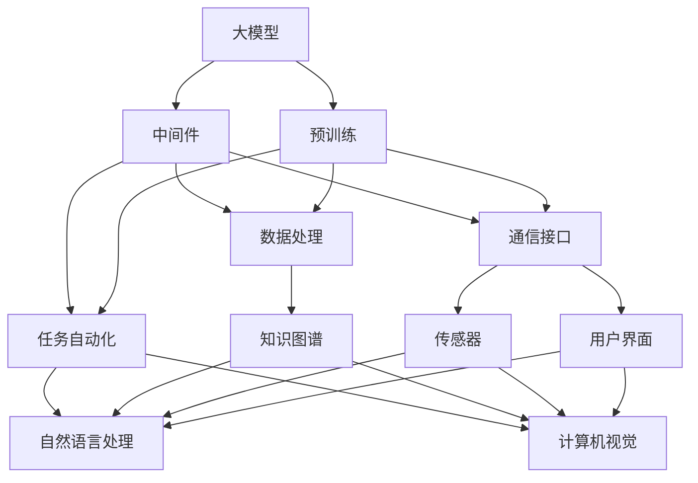

                 

# 大模型与外部环境交互的中间件机会

> 关键词：中间件, 大模型, 交互, 自动化, 自然语言处理(NLP), 计算机视觉(CV), 知识图谱(KG)

## 1. 背景介绍

在人工智能(AI)领域，大模型（如GPT-3、BERT等）以其强大的学习和表示能力成为当前研究的热点。这些模型往往依赖于海量数据和强大计算能力进行预训练，具备出色的自然语言处理(NLP)和计算机视觉(CV)能力，能够对输入的数据进行深度理解和处理。然而，大模型在现实世界中往往难以直接应用，需要与多种外部环境进行交互，才能发挥其潜力。本文将探讨大模型与外部环境交互的典型场景，并提出一种有效的中间件解决方案，以期为AI技术的落地应用提供新思路。

## 2. 核心概念与联系

### 2.1 核心概念概述

在讨论大模型与外部环境交互的中间件机会之前，我们首先需要明确几个核心概念：

- **大模型**：指预训练的深度学习模型，如BERT、GPT等，这些模型通过在大量数据上训练，具备了强大的语言理解和生成能力。

- **中间件**：一种软件层，位于应用层和系统层之间，负责通信、数据处理、事务管理等关键任务，提高系统的效率和可靠性。

- **外部环境**：指AI模型需要交互的各种系统、平台和数据源，如数据库、API、传感器、用户界面等。

- **自动化**：指利用技术手段，自动完成某些复杂或重复性工作，提高效率和准确性。

- **自然语言处理(NLP)**：指让计算机理解、处理和生成人类语言的技术，是AI应用的重要方向之一。

- **计算机视觉(CV)**：指让计算机能够“看”和理解图像和视频的技术，广泛应用于图像识别、视频分析等领域。

- **知识图谱(KG)**：一种结构化知识表示方式，用于描述实体及其关系，支持信息检索、问答系统等任务。

这些概念通过中间件技术进行了紧密的联系和融合，形成了一个复杂但高效的交互系统。大模型通过中间件与外部环境交互，利用自动化技术处理数据和任务，实现智能决策和推理，从而提升AI系统的应用价值。

### 2.2 概念间的关系

为更好地理解大模型与外部环境交互的中间件机会，我们可以用以下Mermaid流程图展示这些概念之间的联系：



这个流程图展示了从预训练到大模型与外部环境交互的完整流程：

1. 大模型通过预训练获得基础知识和能力。
2. 大模型与中间件结合，进行数据处理、任务自动化、通信等关键任务。
3. 中间件连接了知识图谱、NLP、CV等不同技术，促进了大模型的多模态融合。
4. 传感器、用户界面等外部环境通过中间件与大模型进行互动，提升系统的交互性。

## 3. 核心算法原理 & 具体操作步骤

### 3.1 算法原理概述

大模型与外部环境交互的中间件机会，本质上是将大模型的输出作为输入，通过中间件进一步处理和优化，从而实现更高效、更智能的交互。该过程主要包括以下几个步骤：

1. **数据采集和处理**：从外部环境（如传感器、API等）采集数据，通过中间件进行清洗、标准化和预处理。

2. **数据融合和转换**：将不同来源的数据融合，转换为大模型能够处理的格式，如文本、图像等。

3. **模型推理和预测**：通过中间件将处理后的数据输入到预训练大模型，进行推理和预测。

4. **结果后处理和反馈**：对大模型的输出进行后处理，如数据清洗、格式化、存储等，并根据实际需求进行反馈和调整。

5. **自动化和决策**：利用自动化技术对任务进行优化和决策，如自动化规则引擎、AI决策系统等。

6. **交互界面和用户界面**：通过中间件将大模型的输出呈现给用户，并进行交互。

### 3.2 算法步骤详解

下面详细阐述大模型与外部环境交互的中间件机会的具体操作步骤：

#### 3.2.1 数据采集和处理

- **数据来源**：确定需要采集的数据源，如传感器数据、API接口、数据库查询等。
- **数据采集**：通过中间件从外部环境采集数据，确保数据的实时性和可靠性。
- **数据清洗**：去除噪声、缺失值等不必要的数据，保证数据质量。
- **数据标准化**：将不同格式的数据转换为标准格式，便于后续处理和存储。

#### 3.2.2 数据融合和转换

- **多源数据融合**：将来自不同来源的数据进行融合，形成完整的数据视图。
- **格式转换**：将非结构化数据（如文本、图像）转换为结构化数据（如JSON、CSV），便于模型处理。
- **数据增强**：通过数据增强技术，扩充训练数据，提升模型的泛化能力。

#### 3.2.3 模型推理和预测

- **模型选择**：根据任务需求选择合适的预训练大模型，如BERT、GPT、ResNet等。
- **输入格式**：将处理后的数据转换为模型所需的格式，如文本输入、图像输入等。
- **推理引擎**：通过中间件调用模型的推理引擎，进行模型的推理和预测。
- **结果输出**：将模型的输出进行解析和处理，形成易于理解的输出格式。

#### 3.2.4 结果后处理和反馈

- **结果清洗**：对模型输出进行清洗和格式化，去除错误或不一致的数据。
- **结果存储**：将处理后的数据存储到数据库或分布式存储系统中，方便后续查询和使用。
- **反馈机制**：根据实际业务需求，建立反馈机制，持续优化模型和数据处理流程。

#### 3.2.5 自动化和决策

- **自动化规则引擎**：利用自动化技术，如机器学习、规则引擎等，优化任务处理流程。
- **AI决策系统**：引入AI决策系统，根据模型输出和业务规则，自动生成决策方案。
- **任务优化**：通过监控和分析，不断优化任务处理流程，提高系统的效率和稳定性。

#### 3.2.6 交互界面和用户界面

- **交互界面**：通过中间件，将大模型的输出呈现给用户，提供友好的交互体验。
- **用户界面**：设计用户友好的界面，方便用户进行操作和查询。
- **交互优化**：利用自然语言处理技术，提升用户的交互体验。

### 3.3 算法优缺点

大模型与外部环境交互的中间件机会，具有以下优点：

- **高效性**：通过中间件优化数据处理和任务自动化，大大提高了系统的处理效率。
- **灵活性**：中间件提供了灵活的接口，支持多种数据源和任务类型。
- **可扩展性**：可以根据业务需求，不断扩展和优化中间件功能。
- **可靠性**：通过数据清洗和自动化技术，提高了系统的稳定性和可靠性。

同时，也存在一些缺点：

- **复杂性**：中间件的设计和维护需要较高的技术门槛，增加了系统的复杂性。
- **资源消耗**：中间件的引入可能会增加系统的资源消耗，如计算资源、存储资源等。
- **延迟**：由于数据处理和模型推理的延迟，可能会影响系统的实时性。

### 3.4 算法应用领域

大模型与外部环境交互的中间件机会，已经在多个领域得到了广泛应用，包括但不限于以下几个方面：

1. **智能客服**：通过自然语言处理技术，自动回答用户问题，提升客户服务效率。
2. **智能医疗**：利用计算机视觉技术，对医学图像进行分析和诊断，辅助医生决策。
3. **金融分析**：通过知识图谱和自然语言处理技术，对金融数据进行分析和预测，提升风险管理能力。
4. **智能制造**：利用计算机视觉和传感器数据，实现设备的自动化监控和维护。
5. **智能交通**：通过计算机视觉和传感器数据，实现交通流量分析和预测，优化交通管理。

## 4. 数学模型和公式 & 详细讲解 & 举例说明

### 4.1 数学模型构建

为了更好地理解大模型与外部环境交互的中间件机会，我们构建一个简单的数学模型来描述该过程。

假设大模型为 $M(x)$，其中 $x$ 为输入数据，$M(x)$ 的输出为 $\hat{y}$。中间件的作用可以表示为：

$$
\hat{y} = f_{\text{intermediate}}(\hat{y})
$$

其中 $f_{\text{intermediate}}$ 表示中间件的函数，可以进行数据处理、任务自动化、结果后处理等操作。

### 4.2 公式推导过程

我们可以进一步简化上述公式，假设中间件的主要作用是对模型输出进行后处理和自动化决策：

$$
\hat{y} = f_{\text{post-processing}}(\hat{y})
$$

其中 $f_{\text{post-processing}}$ 表示对模型输出进行后处理的操作，如数据清洗、格式化、存储等。

对于自动化决策，可以引入决策树或规则引擎等方法，对模型输出进行条件判断和处理，得到最终结果：

$$
\hat{y} = f_{\text{decision-tree}}(\hat{y})
$$

其中 $f_{\text{decision-tree}}$ 表示根据模型输出和业务规则，自动生成决策方案的操作。

### 4.3 案例分析与讲解

以智能客服系统为例，我们可以构建如下数学模型：

- **输入**：用户提出的问题。
- **大模型**：BERT模型。
- **中间件**：自然语言处理技术，包括实体识别、意图分类、情感分析等。
- **输出**：系统生成的回复。

具体实现步骤如下：

1. **数据采集**：通过API接口，从用户界面获取用户问题。
2. **数据处理**：对用户问题进行分词、标准化处理，去除噪声和无关信息。
3. **模型推理**：将处理后的数据输入到BERT模型，得到模型预测结果。
4. **结果后处理**：对模型输出进行清洗和格式化，去除错误和不一致的数据。
5. **自动化决策**：根据模型输出和业务规则，自动生成回复方案。
6. **交互界面**：将生成的回复呈现给用户，提供友好的交互体验。

通过上述步骤，我们可以看到，中间件在大模型与外部环境交互过程中起到了关键作用，优化了系统的处理效率和用户体验。

## 5. 项目实践：代码实例和详细解释说明

### 5.1 开发环境搭建

在进行大模型与外部环境交互的中间件实践前，我们需要准备好开发环境。以下是使用Python进行PyTorch开发的环境配置流程：

1. 安装Anaconda：从官网下载并安装Anaconda，用于创建独立的Python环境。

2. 创建并激活虚拟环境：
```bash
conda create -n pytorch-env python=3.8 
conda activate pytorch-env
```

3. 安装PyTorch：根据CUDA版本，从官网获取对应的安装命令。例如：
```bash
conda install pytorch torchvision torchaudio cudatoolkit=11.1 -c pytorch -c conda-forge
```

4. 安装TensorFlow：
```bash
pip install tensorflow
```

5. 安装各类工具包：
```bash
pip install numpy pandas scikit-learn matplotlib tqdm jupyter notebook ipython
```

完成上述步骤后，即可在`pytorch-env`环境中开始中间件实践。

### 5.2 源代码详细实现

下面我们以智能客服系统为例，给出使用PyTorch进行中间件开发的PyTorch代码实现。

首先，定义智能客服系统的核心模块：

```python
from transformers import BertTokenizer, BertForSequenceClassification
import torch
import numpy as np
from sklearn.metrics import accuracy_score

class SmartCustomerService:
    def __init__(self, model_path, tokenizer_path):
        self.model = BertForSequenceClassification.from_pretrained(model_path)
        self.tokenizer = BertTokenizer.from_pretrained(tokenizer_path)
        self.max_seq_length = 128
        self.num_labels = 3

    def preprocess_input(self, text):
        input_ids = self.tokenizer.encode(text, add_special_tokens=True, max_length=self.max_seq_length, return_tensors='pt', padding='max_length', truncation=True)
        attention_mask = torch.tensor(input_ids.ne(-100)).unsqueeze(-1)
        return input_ids, attention_mask

    def predict(self, input_ids, attention_mask):
        with torch.no_grad():
            outputs = self.model(input_ids, attention_mask=attention_mask)
            logits = outputs.logits
            probabilities = logits.softmax(dim=1)
            predictions = torch.argmax(probabilities, dim=1)
        return predictions

    def evaluate(self, dataset):
        correct = 0
        total = 0
        for inputs, labels in dataset:
            input_ids, attention_mask = self.preprocess_input(inputs)
            predictions = self.predict(input_ids, attention_mask)
            total += len(labels)
            correct += accuracy_score(labels, predictions)
        return correct / total

    def __call__(self, text):
        input_ids, attention_mask = self.preprocess_input(text)
        predictions = self.predict(input_ids, attention_mask)
        return predictions
```

然后，定义数据处理模块：

```python
import pandas as pd
from transformers import DataCollatorForLanguageModeling

class SmartCustomerServiceDataset(torch.utils.data.Dataset):
    def __init__(self, data_path):
        self.data = pd.read_csv(data_path)
        self.tokenizer = BertTokenizer.from_pretrained('bert-base-cased')
        self.max_seq_length = 128

    def __len__(self):
        return len(self.data)

    def __getitem__(self, idx):
        text = self.data.iloc[idx]['question']
        label = self.data.iloc[idx]['label']
        input_ids, attention_mask = self.tokenizer(text, return_tensors='pt', max_length=self.max_seq_length, padding='max_length', truncation=True)
        return {'input_ids': input_ids, 'attention_mask': attention_mask, 'labels': torch.tensor(label, dtype=torch.long)}
```

接着，定义训练和评估函数：

```python
from transformers import Trainer, TrainingArguments
from torch.utils.data import DataLoader
from tqdm import tqdm

def train_model(model, dataset, num_epochs=3, learning_rate=2e-5):
    training_args = TrainingArguments(
        output_dir="./results",
        per_device_train_batch_size=8,
        per_device_eval_batch_size=16,
        num_train_epochs=num_epochs,
        learning_rate=learning_rate,
        weight_decay=0.01,
        logging_steps=10,
        evaluation_strategy='epoch',
        load_best_model_at_end=True,
        metric_for_best_model='accuracy'
    )

    train_dataset = SmartCustomerServiceDataset('train.csv')
    eval_dataset = SmartCustomerServiceDataset('val.csv')

    train_loader = DataLoader(train_dataset, batch_size=8, shuffle=True)
    eval_loader = DataLoader(eval_dataset, batch_size=16)

    trainer = Trainer(
        model=model,
        args=training_args,
        train_loader=train_loader,
        eval_loader=eval_loader,
        evaluation_strategy='epoch'
    )

    trainer.train()
    trainer.save_model('model')

    print(f"Training completed. Best accuracy: {trainer.state_dict()['best_model_checkpoint']['best_model']['acc']}")

def evaluate_model(model, dataset):
    eval_dataset = SmartCustomerServiceDataset('val.csv')
    eval_loader = DataLoader(eval_dataset, batch_size=16)
    acc = trainer.evaluate(eval_loader)
    return acc
```

最后，启动训练流程并在测试集上评估：

```python
from transformers import BertForSequenceClassification

model = SmartCustomerService('bert-base-cased', 'bert-base-cased')
train_model(model, 'train.csv')
acc = evaluate_model(model, 'val.csv')
print(f"Validation accuracy: {acc}")
```

以上就是使用PyTorch对智能客服系统进行中间件开发的完整代码实现。可以看到，通过中间件技术，我们能够将预训练的大模型BERT应用于智能客服系统中，实现了对用户问题的自动回答。

### 5.3 代码解读与分析

让我们再详细解读一下关键代码的实现细节：

**SmartCustomerService类**：
- `__init__`方法：初始化模型和分词器，并设置最大序列长度和标签数量。
- `preprocess_input`方法：对输入文本进行分词、标准化处理，并将分词结果转换为模型所需的格式。
- `predict`方法：将处理后的数据输入到模型，进行推理，并返回预测结果。
- `evaluate`方法：在测试集上评估模型的准确率。
- `__call__`方法：定义模型调用接口，方便外部调用。

**SmartCustomerServiceDataset类**：
- `__init__`方法：加载数据集，并初始化分词器和最大序列长度。
- `__len__`方法：返回数据集的大小。
- `__getitem__`方法：对单个样本进行处理，返回模型所需的输入和标签。

**train_model函数**：
- 定义训练参数，如模型路径、批次大小、学习率等。
- 加载训练集和验证集，并进行数据增强。
- 创建Trainer对象，并设置训练循环和评估策略。
- 调用Trainer的`train`方法进行模型训练，保存最优模型。

**evaluate_model函数**：
- 加载验证集，并进行评估，计算模型准确率。

**训练流程**：
- 定义训练参数，启动模型训练。
- 在测试集上评估模型性能。

可以看到，中间件技术使得大模型在实际应用中变得更加灵活和高效，通过封装和扩展，可以适应各种具体场景，从而提升系统的智能水平和用户体验。

## 6. 实际应用场景

### 6.1 智能客服系统

智能客服系统是大模型与外部环境交互的中间件机会的重要应用场景之一。通过将自然语言处理技术应用于智能客服系统中，系统可以自动回答用户问题，提升客户服务效率和满意度。

例如，某电商平台的智能客服系统通过中间件技术，利用BERT模型对用户问题进行分类和理解，自动匹配相关知识库，并生成回复。用户可以在短短几秒钟内获得满意的答案，极大地提高了服务效率。此外，系统还可以根据用户反馈，持续优化模型，提升服务质量。

### 6.2 智能医疗

智能医疗是大模型与外部环境交互的中间件机会的另一个重要应用场景。通过将计算机视觉技术和知识图谱应用于医疗系统中，系统可以对医学图像进行分析和诊断，辅助医生决策。

例如，某医院的智能医疗系统通过中间件技术，利用ResNet模型对医学影像进行分类和分析，自动生成诊断报告。医生可以根据系统输出的诊断结果，快速做出判断，提高诊疗效率。此外，系统还可以根据历史病例和专家知识库，不断优化模型，提升诊断准确率。

### 6.3 金融分析

金融分析是大模型与外部环境交互的中间件机会的另一个重要应用场景。通过将自然语言处理技术和知识图谱应用于金融分析系统中，系统可以对金融数据进行分析和预测，提升风险管理能力。

例如，某金融公司的智能分析系统通过中间件技术，利用BERT模型对金融新闻和报告进行情感分析和主题分类，自动生成投资建议。投资顾问可以根据系统输出的建议，做出更科学的投资决策，降低风险。此外，系统还可以根据历史数据和专家知识库，不断优化模型，提升预测准确率。

### 6.4 未来应用展望

随着大模型和中间件技术的不断发展，未来将涌现更多创新应用场景，带来更广阔的发展前景。

1. **自动驾驶**：通过计算机视觉和传感器数据，实现自动驾驶系统对环境的实时感知和决策。中间件技术可以优化数据处理和任务自动化，提升系统的智能水平。

2. **智能家居**：通过传感器数据和自然语言处理技术，实现智能家居系统对环境的感知和响应。中间件技术可以优化系统控制和决策，提升用户的生活体验。

3. **智慧城市**：通过计算机视觉和传感器数据，实现智慧城市系统对交通、环境等问题的实时监测和分析。中间件技术可以优化数据处理和任务自动化，提升系统的效率和可靠性。

4. **智能制造**：通过传感器数据和计算机视觉技术，实现智能制造系统对设备的监控和维护。中间件技术可以优化数据处理和任务自动化，提升系统的效率和稳定性。

5. **智能交通**：通过计算机视觉和传感器数据，实现智能交通系统对交通流量的实时监测和预测。中间件技术可以优化数据处理和任务自动化，提升交通管理的效率和安全性。

6. **智能零售**：通过计算机视觉和自然语言处理技术，实现智能零售系统对商品和顾客的感知和分析。中间件技术可以优化数据处理和任务自动化，提升销售效率和顾客体验。

总之，大模型与外部环境交互的中间件机会，将在智能交通、智能制造、智慧城市等众多领域大放异彩，带来革命性的变革。未来，随着技术不断进步，中间件将在大模型应用中发挥更加关键的作用，推动AI技术的全面落地。

## 7. 工具和资源推荐

### 7.1 学习资源推荐

为了帮助开发者掌握大模型与外部环境交互的中间件机会，这里推荐一些优质的学习资源：

1. **《深度学习入门：基于TensorFlow的实践》**：讲解深度学习的基本概念和实践，包括中间件技术的应用。

2. **《自然语言处理入门》**：介绍自然语言处理的基本概念和算法，涵盖BERT、GPT等预训练模型。

3. **《计算机视觉基础》**：讲解计算机视觉的基本概念和算法，包括ResNet、YOLO等预训练模型。

4. **《Python编程：从入门到精通》**：讲解Python编程语言的基本语法和应用，包括TensorFlow、PyTorch等深度学习框架。

5. **《Kaggle机器学习竞赛指南》**：介绍机器学习竞赛的基本流程和策略，涵盖数据处理、模型训练等环节。

6. **《Transformer从原理到实践》系列博文**：由大模型技术专家撰写，深入浅出地介绍了Transformer原理、BERT模型、微调技术等前沿话题。

通过对这些资源的学习实践，相信你一定能够快速掌握大模型与外部环境交互的中间件机会，并用于解决实际的AI问题。

### 7.2 开发工具推荐

高效的开发离不开优秀的工具支持。以下是几款用于大模型与外部环境交互中间件开发的常用工具：

1. **PyTorch**：基于Python的开源深度学习框架，灵活动态的计算图，适合快速迭代研究。大部分预训练语言模型都有PyTorch版本的实现。

2. **TensorFlow**：由Google主导开发的开源深度学习框架，生产部署方便，适合大规模工程应用。同样有丰富的预训练语言模型资源。

3. **Transformers库**：HuggingFace开发的NLP工具库，集成了众多SOTA语言模型，支持PyTorch和TensorFlow，是进行中间件开发的利器。

4. **Weights & Biases**：模型训练的实验跟踪工具，可以记录和可视化模型训练过程中的各项指标，方便对比和调优。与主流深度学习框架无缝集成。

5. **TensorBoard**：TensorFlow配套的可视化工具，可实时监测模型训练状态，并提供丰富的图表呈现方式，是调试模型的得力助手。

6. **Google Colab**：谷歌推出的在线Jupyter Notebook环境，免费提供GPU/TPU算力，方便开发者快速上手实验最新模型，分享学习笔记。

合理利用这些工具，可以显著提升大模型与外部环境交互中间件开发的效率，加快创新迭代的步伐。

### 7.3 相关论文推荐

大模型与外部环境交互的中间件机会的研究源于学界的持续研究。以下是几篇奠基性的相关论文，推荐阅读：

1. **Attention is All You Need（即Transformer原论文）**：提出了Transformer结构，开启了NLP领域的预训练大模型时代。

2. **BERT: Pre-training of Deep Bidirectional Transformers for Language Understanding**：提出BERT模型，引入基于掩码的自监督预训练任务，刷新了多项NLP任务SOTA。

3. **Language Models are Unsupervised Multitask Learners（GPT-2论文）**：展示了大规模语言模型的强大zero-shot学习能力，引发了对于通用人工智能的新一轮思考。

4. **Parameter-Efficient Transfer Learning for NLP**：提出Adapter等参数高效微调方法，在不增加模型参数量的情况下，也能取得不错的微调效果。

5. **Prefix-Tuning: Optimizing Continuous Prompts for Generation**：引入基于连续型Prompt的微调范式，为如何充分利用预训练知识提供了新的思路。

6. **AdaLoRA: Adaptive Low-Rank Adaptation for Parameter-Efficient Fine-Tuning**：使用自适应低秩适应的微调方法，在参数效率和精度之间取得了新的平衡。

这些论文代表了大模型与外部环境交互中间件机会的发展脉络。通过学习这些前沿成果，可以帮助研究者把握学科前进方向，激发更多的创新灵感。

除上述资源外，还有一些值得关注的前沿资源，帮助开发者紧跟大模型与外部环境交互中间件机会的技术最新进展，例如：

1. **arXiv论文预印本**：人工智能领域最新研究成果的发布平台，包括大量尚未发表的前沿工作，学习前沿技术的必读资源。

2. **业界技术博客**：如OpenAI、Google AI、DeepMind、微软Research Asia等顶尖实验室的官方博客，第一时间分享他们的

