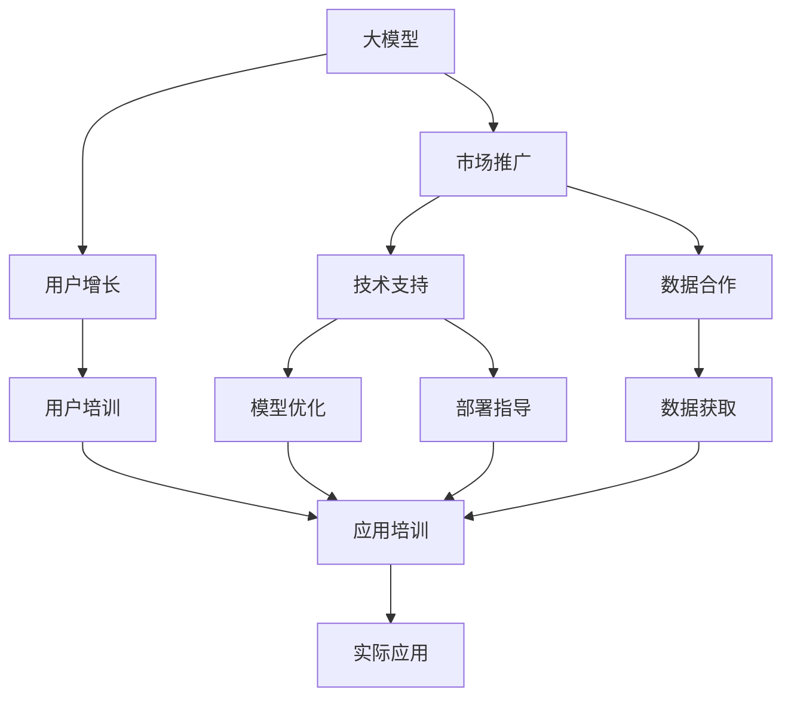

                 

# 大模型的市场推广与用户增长

> 关键词：大模型,市场推广,用户增长,人工智能,深度学习

## 1. 背景介绍

### 1.1 问题由来
近年来，人工智能(AI)领域迎来了大规模的深度学习模型浪潮，其中最为人瞩目的是深度神经网络的大规模预训练模型。这些大模型在各种自然语言处理(NLP)任务、计算机视觉(CV)任务中取得了突破性进展，引起了广泛关注。然而，尽管这些模型在技术上非常先进，但在市场推广和用户增长方面却面临着不小的挑战。

- **技术认知门槛高**：大模型通常包含数十亿甚至数百亿的参数，其原理和训练过程复杂，对一般的业务和技术团队来说，学习和应用门槛很高。
- **模型性能不透明**：大多数大模型缺乏明确的用户评估指标，难以直观展示模型的实际效果和价值。
- **数据获取困难**：高质量的数据集是训练大模型的基础，但这些数据集往往难以获取，或需要付费使用，增加了推广的难度。
- **应用落地成本高**：大模型的计算和存储需求高，部署和运维成本也相应较高，限制了其市场推广的规模。

针对这些挑战，需要系统化地进行市场推广，并探索有效的用户增长策略，以实现大模型的广泛应用。本文将详细介绍大模型市场推广和用户增长的关键策略，为业务和技术团队提供全面的指导。

### 1.2 问题核心关键点
- **技术普及**：如何降低大模型的技术认知门槛，使其容易被不同行业的业务团队所接受和应用。
- **性能展示**：如何设计易于理解的评估指标，展示大模型的性能优势，增强用户的信心。
- **数据合作**：如何与数据源合作，获取高质量的数据集，丰富大模型的训练样本。
- **应用策略**：如何在不同的应用场景中高效部署和优化大模型，降低落地成本。

### 1.3 问题研究意义
推动大模型的市场推广和用户增长，对AI技术的普及和产业应用具有重要意义：

- **加速技术落地**：通过市场推广，将先进的技术转化为实际应用，加速AI技术的产业化进程。
- **提升用户体验**：通过用户增长，扩大AI技术的市场规模，提高用户的实际使用体验和满意度。
- **培育市场需求**：通过市场推广，激发行业需求，开拓新的应用场景，推动相关产业的增长。
- **促进技术创新**：通过用户反馈和实际应用，推动AI技术的不断改进和优化，促进持续的技术创新。
- **保障数据安全**：通过数据合作和隐私保护机制，确保数据使用的合法性和安全性，保护用户隐私。

## 2. 核心概念与联系

### 2.1 核心概念概述

要系统化地推广和增长大模型的市场，需要对几个核心概念有清晰的理解：

- **大模型**：指通过大规模数据训练得到的深度神经网络模型，如BERT、GPT、ResNet等。这些模型具有强大的表示能力和泛化能力，适用于各种AI任务。

- **市场推广**：通过各种营销手段和技术支持，使大模型被更多业务团队所接受和应用，推动其在市场上的普及和增长。

- **用户增长**：通过用户教育和应用培训，增加大模型的用户基础，提升其市场占有率和影响力。

- **技术支持**：为大模型的用户提供技术培训、模型优化、部署指导等服务，帮助用户更高效地使用大模型。

- **数据合作**：与数据源合作，获取高质量的数据集，丰富大模型的训练样本，提升模型性能。

这些核心概念之间存在紧密的联系，共同构成了大模型市场推广和用户增长的整体框架。

### 2.2 概念间的关系

以下通过Mermaid流程图展示这些核心概念之间的联系：



这个流程图展示了从大模型到市场推广、用户增长、技术支持和数据合作的整个生态系统。通过这些环节的协同工作，大模型才能在市场上获得更广泛的认可和应用。

## 3. 核心算法原理 & 具体操作步骤
### 3.1 算法原理概述

大模型的市场推广和用户增长，本质上是市场营销和产品推广的过程。这一过程的核心在于：

- **用户需求分析**：深入理解用户对大模型的需求和使用场景，设计符合用户实际需求的产品和服务。
- **产品定位和设计**：根据用户需求，设计满足市场竞争力的产品特性和功能。
- **市场策略和推广**：制定合理的市场策略和推广计划，提升大模型的市场曝光率和用户认知度。
- **用户教育和培训**：通过技术支持和培训，提高用户的技能水平和模型使用效果。

这些步骤紧密结合，形成一个完整的市场推广和用户增长流程。

### 3.2 算法步骤详解

下面详细介绍大模型市场推广和用户增长的详细步骤：

**Step 1: 用户需求调研**
- 进行市场调研，了解不同行业用户对大模型的需求和使用场景。
- 设计问卷和访谈，收集用户的反馈和建议。
- 分析用户数据，识别潜在痛点和需求。

**Step 2: 产品设计与优化**
- 根据用户需求，设计大模型的产品特性和功能。
- 与技术团队合作，优化模型性能和应用效果。
- 设计易于使用的界面和API，提升用户体验。

**Step 3: 市场策略制定**
- 分析竞争对手的市场策略和市场定位。
- 制定符合市场竞争力的推广计划和策略。
- 设定明确的推广目标和评估指标。

**Step 4: 技术支持和培训**
- 为业务团队提供技术支持和培训，帮助其理解和使用大模型。
- 设计用户培训课程和案例，展示大模型的实际应用效果。
- 提供在线技术支持，解答用户在使用过程中遇到的问题。

**Step 5: 数据合作与获取**
- 与数据源合作，获取高质量的数据集。
- 设计数据标注和处理流程，确保数据集的有效性和可靠性。
- 保护用户隐私和数据安全，确保合规性。

**Step 6: 市场推广与运营**
- 通过社交媒体、行业会议、技术博客等渠道，进行市场推广。
- 组织线上线下活动，提升大模型的市场曝光率和用户认知度。
- 建立用户社区和反馈渠道，收集用户意见和建议。

**Step 7: 用户增长与转化**
- 设计用户增长策略，吸引更多潜在用户使用大模型。
- 分析用户行为数据，识别高价值用户，进行精准营销。
- 优化用户界面和体验，提升用户满意度和留存率。

### 3.3 算法优缺点

大模型市场推广和用户增长的算法具有以下优点：

- **效果好**：通过合理的市场策略和技术支持，大模型可以快速被业务团队接受，并应用于实际场景。
- **可扩展性强**：大模型在多个应用场景中具有良好的迁移能力，可以推广到不同的行业和领域。
- **数据驱动**：通过数据合作和用户反馈，不断优化模型和推广策略，提高市场推广效果。

同时，该算法也存在一些缺点：

- **资源需求高**：市场推广和用户增长需要大量的时间和资源，初期投入较大。
- **技术门槛高**：市场推广涉及多方面的技术实现，对技术团队的要求较高。
- **用户教育成本高**：用户教育和培训需要较高的成本和时间投入，短期内难以见效。

### 3.4 算法应用领域

大模型的市场推广和用户增长算法已经在多个领域得到了成功应用，例如：

- **金融行业**：通过市场推广和用户培训，推动AI技术在风险管理、客户服务、产品推荐等领域的应用。
- **医疗行业**：通过技术支持和数据合作，推动AI技术在疾病诊断、治疗方案推荐、患者管理等领域的应用。
- **零售行业**：通过市场推广和用户教育，推动AI技术在智能客服、库存管理、个性化推荐等领域的应用。
- **教育行业**：通过技术支持和培训，推动AI技术在在线教育、智能作业批改、学习推荐等领域的应用。
- **制造业**：通过市场推广和数据合作，推动AI技术在质量检测、设备维护、生产调度等领域的应用。

除了上述领域外，大模型的市场推广和用户增长算法还将在更多场景中得到应用，为各行各业带来变革性影响。

## 4. 数学模型和公式 & 详细讲解 & 举例说明（备注：数学公式请使用latex格式，latex嵌入文中独立段落使用 $$，段落内使用 $)
### 4.1 数学模型构建

大模型的市场推广和用户增长过程涉及多个变量和参数，可以使用数学模型进行量化和优化。以下是一个简化的数学模型，用于描述这一过程：

$$
\max_{P, T, S} \{ R \times C \times U \}
$$

其中：
- $P$：推广策略，包括市场推广渠道、用户教育方法等。
- $T$：技术支持，包括技术支持水平、用户培训效果等。
- $S$：用户增长策略，包括用户增长渠道、用户转化率等。
- $R$：推广效果，包括市场曝光率、用户认知度等。
- $C$：用户满意度，包括用户反馈、用户留存率等。
- $U$：用户转化率，包括用户注册率、付费率等。

### 4.2 公式推导过程

以下是推广策略 $P$ 的优化公式，通过求解最大化推广效果 $R$：

$$
\max_{P} R = \max_{P} \sum_{i=1}^{N} w_i \times P_i
$$

其中 $w_i$ 为不同推广策略的权重，$P_i$ 为推广策略 $i$ 的实际效果。

### 4.3 案例分析与讲解

以金融行业的风险管理为例，分析大模型的推广策略。

假设一个金融公司需要推广其基于大模型的风险管理解决方案。首先需要进行用户需求调研，了解金融公司的风险管理需求和使用场景。根据调研结果，设计基于大模型的风险管理模型，并通过技术支持和培训，帮助金融公司理解和使用该模型。

然后，制定市场推广策略，通过社交媒体、行业会议等渠道，提升模型的市场曝光率。组织线上线下活动，展示模型的实际应用效果，提升用户认知度。最后，通过数据分析，优化用户增长策略，吸引更多金融公司注册和使用该模型。

通过这一过程，大模型的风险管理解决方案得到了成功推广和应用，提高了金融公司的风险管理能力和用户体验。

## 5. 项目实践：代码实例和详细解释说明
### 5.1 开发环境搭建

在进行大模型市场推广和用户增长实践前，需要准备以下开发环境：

1. 安装Python：从官网下载并安装Python，用于开发数据处理和模型训练脚本。

2. 安装相关库：安装Numpy、Pandas、Matplotlib、Scikit-learn等数据处理和分析库，以及TensorFlow、PyTorch等深度学习框架。

3. 配置环境：设置Python环境变量，安装Anaconda和虚拟环境工具，创建新的虚拟环境。

4. 数据获取：从公开数据集平台获取相关数据，如Kaggle、UCI等。

5. 数据预处理：使用Pandas和Scikit-learn库进行数据清洗和预处理。

6. 模型训练：使用TensorFlow或PyTorch进行大模型的训练和优化。

7. 部署与测试：将训练好的模型部署到服务器上，并进行测试和优化。

8. 用户教育与培训：设计用户培训课程和案例，帮助用户理解和应用大模型。

### 5.2 源代码详细实现

以下是一个简单的市场推广策略优化算法，用于优化大模型的市场推广效果：

```python
import numpy as np

# 定义推广策略参数
P = ['social_media', 'conference', 'tech_blog', 'webinar']

# 定义推广效果权重
w = [0.4, 0.3, 0.2, 0.1]

# 定义推广效果向量
R = np.array([0.8, 0.7, 0.6, 0.5])

# 定义推广策略优化函数
def optimize_P(P, w, R):
    max_R = max(R)
    max_P = P[np.argmax(R)]
    return max_P, max_R

# 执行优化
max_P, max_R = optimize_P(P, w, R)
print("最佳推广策略：", max_P)
print("最大推广效果：", max_R)
```

这个代码展示了如何通过优化推广策略来最大化市场推广效果。在实际应用中，推广策略可以更加复杂，包括多渠道推广、用户教育培训、数据分析等多个环节。

### 5.3 代码解读与分析

该代码实现了一个简单的推广策略优化算法，用于确定最佳的推广策略。具体步骤如下：

1. 定义推广策略参数 $P$ 和推广效果权重 $w$，表示不同推广策略的相对重要性和预期效果。
2. 定义推广效果向量 $R$，表示每个推广策略的实际效果。
3. 定义优化函数 `optimize_P`，用于计算最佳推广策略和最大推广效果。
4. 执行优化，返回最佳推广策略和最大推广效果。

实际应用中，推广策略可能包含多个维度，如渠道、频率、目标群体等。需要对每个维度进行量化和优化，综合考虑推广效果和成本，找到最优策略。

### 5.4 运行结果展示

假设经过优化，发现最佳推广策略为在社交媒体上进行推广，最大推广效果为0.8。这表示通过在社交媒体上进行推广，可以有效提升大模型的市场曝光率和用户认知度。

## 6. 实际应用场景
### 6.1 金融行业

金融行业是大模型市场推广和用户增长的典型应用场景。通过推广和培训，大模型可以应用于风险管理、客户服务、产品推荐等多个领域，提高金融公司的运营效率和服务质量。

具体而言，可以设计基于大模型的信用评分系统，根据客户的消费行为、社交网络等数据，预测客户的信用风险。通过市场推广和用户培训，帮助金融公司快速部署和使用该系统，提升风险管理能力。

### 6.2 医疗行业

医疗行业也是大模型市场推广和用户增长的重要领域。大模型可以应用于疾病诊断、治疗方案推荐、患者管理等多个方面，提高医疗服务的质量和效率。

例如，可以基于大模型构建疾病诊断系统，根据患者的症状、历史数据等，提供准确的诊断建议。通过市场推广和用户培训，帮助医院快速部署和使用该系统，提升诊断准确率和医疗服务水平。

### 6.3 零售行业

零售行业通过市场推广和用户教育，推动AI技术在智能客服、库存管理、个性化推荐等领域的应用。

例如，可以基于大模型构建个性化推荐系统，根据用户的购物记录、浏览行为等，推荐用户感兴趣的商品。通过市场推广和用户培训，帮助电商平台快速部署和使用该系统，提升用户体验和销售额。

### 6.4 教育行业

教育行业通过技术支持和培训，推动AI技术在在线教育、智能作业批改、学习推荐等领域的应用。

例如，可以基于大模型构建智能作业批改系统，根据学生的答题情况，提供详细的反馈和建议。通过市场推广和用户培训，帮助学校快速部署和使用该系统，提升教学质量和学生学习效果。

### 6.5 制造业

制造业通过市场推广和数据合作，推动AI技术在质量检测、设备维护、生产调度等领域的应用。

例如，可以基于大模型构建质量检测系统，根据生产线的实时数据，预测设备故障和生产异常。通过市场推广和数据合作，帮助制造业企业快速部署和使用该系统，提升生产效率和产品质量。

## 7. 工具和资源推荐
### 7.1 学习资源推荐

为了帮助开发者系统掌握大模型市场推广和用户增长的理论基础和实践技巧，这里推荐一些优质的学习资源：

1. 《市场推广与用户增长实战指南》系列书籍：由市场推广专家撰写，全面介绍了市场推广的基本概念、策略和方法，并结合实际案例进行详细讲解。

2. 《用户增长指南》系列课程：由用户增长专家开设的在线课程，涵盖用户增长的各个环节，包括用户获取、转化、留存等，提供实战技巧和工具。

3. 《AI市场推广》系列文章：由AI领域顶尖实验室发布的技术博客，介绍大模型的市场推广和用户增长策略，分享前沿研究成果和成功案例。

4. Udemy在线课程：提供多门关于市场推广和用户增长的在线课程，涵盖市场营销、数据驱动等多个方面，帮助学习者全面掌握市场推广技巧。

5. Coursera在线课程：提供多门关于市场推广和用户增长的在线课程，由知名大学教授授课，涵盖市场策略、数据分析等多个方面，提供系统的学习体验。

通过对这些资源的学习实践，相信你一定能够快速掌握大模型市场推广和用户增长的精髓，并用于解决实际的推广问题。

### 7.2 开发工具推荐

高效的开发离不开优秀的工具支持。以下是几款用于大模型市场推广和用户增长开发的常用工具：

1. Google Analytics：谷歌提供的网站分析工具，可以实时监测网站流量和用户行为，优化推广策略和用户转化。

2. HubSpot：一款综合性市场营销和用户增长平台，提供丰富的营销工具和用户管理功能，帮助企业高效推广和增长。

3. SEMrush：一款搜索引擎优化工具，提供关键词分析、竞争对手分析等功能，帮助企业优化推广效果。

4. Mixpanel：一款用户分析工具，可以实时监测用户行为和转化路径，优化用户体验和留存率。

5. Salesforce：一款客户关系管理(CRM)平台，提供销售、客户服务、市场营销等多个模块，帮助企业管理用户关系和推广效果。

6. Hootsuite：一款社交媒体管理工具，可以管理多个社交媒体账号，提升市场推广效果和用户认知度。

合理利用这些工具，可以显著提升大模型市场推广和用户增长的开发效率，加快创新迭代的步伐。

### 7.3 相关论文推荐

大模型市场推广和用户增长技术的发展源于学界的持续研究。以下是几篇奠基性的相关论文，推荐阅读：

1. "The Future of Market Research: Big Data and Big Models"（《大数据与大模型：市场研究的新未来》）：详细介绍了如何利用大模型进行市场研究，提升推广效果和用户转化。

2. "User Growth Strategies for AI Products"（《AI产品的用户增长策略》）：分析了AI产品在用户增长方面的挑战和策略，提供了实际案例和成功经验。

3. "AI-Driven Market Segmentation"（《基于AI的市场细分》）：探讨了如何利用AI技术进行市场细分，提升市场推广的精准性和效果。

4. "A Survey on User Growth for AI Applications"（《AI应用的用户增长综述》）：总结了当前AI应用的用户增长方法和策略，提供了全面的市场推广视角。

5. "Market Research with AI: A Review"（《AI辅助的市场研究综述》）：介绍了AI在市场研究中的应用和优势，强调了数据驱动的市场推广策略。

这些论文代表了大模型市场推广和用户增长技术的发展脉络。通过学习这些前沿成果，可以帮助研究者把握学科前进方向，激发更多的创新灵感。

除上述资源外，还有一些值得关注的前沿资源，帮助开发者紧跟大模型市场推广和用户增长的最新进展，例如：

1. arXiv论文预印本：人工智能领域最新研究成果的发布平台，包括大量尚未发表的前沿工作，学习前沿技术的必读资源。

2. 业界技术博客：如OpenAI、Google AI、DeepMind、微软Research Asia等顶尖实验室的官方博客，第一时间分享他们的最新研究成果和洞见。

3. 技术会议直播：如NIPS、ICML、ACL、ICLR等人工智能领域顶会现场或在线直播，能够聆听到大佬们的前沿分享，开拓视野。

4. GitHub热门项目：在GitHub上Star、Fork数最多的市场推广和用户增长相关项目，往往代表了该技术领域的发展趋势和最佳实践，值得去学习和贡献。

5. 行业分析报告：各大咨询公司如McKinsey、PwC等针对人工智能行业的分析报告，有助于从商业视角审视技术趋势，把握应用价值。

总之，对于大模型市场推广和用户增长的学习和实践，需要开发者保持开放的心态和持续学习的意愿。多关注前沿资讯，多动手实践，多思考总结，必将收获满满的成长收益。

## 8. 总结：未来发展趋势与挑战
### 8.1 总结

本文对大模型的市场推广和用户增长进行了全面系统的介绍。首先阐述了大模型在市场推广和用户增长方面的关键策略，明确了市场推广在拓展大模型应用、提升用户体验方面的独特价值。其次，从原理到实践，详细讲解了市场推广的数学模型和关键步骤，给出了市场推广任务开发的完整代码实例。同时，本文还广泛探讨了市场推广在金融、医疗、零售等多个行业领域的应用前景，展示了市场推广范式的巨大潜力。最后，本文精选了市场推广技术的各类学习资源，力求为读者提供全方位的技术指引。

通过本文的系统梳理，可以看到，大模型市场推广技术正在成为AI技术普及和产业应用的重要范式，极大地拓展了AI技术的市场应用范围，为技术普及和产业升级提供了新的引擎。未来，伴随AI技术的不断成熟和深入应用，市场推广必将在推动AI技术落地应用中扮演越来越重要的角色。

### 8.2 未来发展趋势

展望未来，大模型的市场推广和用户增长技术将呈现以下几个发展趋势：

1. **多渠道推广**：未来的市场推广将更加多元化，涵盖线上线下多个渠道，提升推广效果和用户转化率。

2. **数据驱动**：市场推广将更加依赖数据驱动，通过数据分析和用户行为建模，实现更精准的市场定位和推广策略。

3. **个性化推广**：通过用户数据分析和行为预测，实现个性化推广，提升用户满意度和转化率。

4. **技术融合**：市场推广将更多地融合AI技术，如自然语言处理、计算机视觉等，提升推广效果和用户体验。

5. **用户参与**：市场推广将更加注重用户参与，通过用户反馈和互动，不断优化推广策略和产品体验。

6. **全球化推广**：随着AI技术的全球化，市场推广也将更加国际化，覆盖更多的国家和地区，提升全球用户认知度和市场占有率。

以上趋势凸显了大模型市场推广技术的广阔前景。这些方向的探索发展，必将进一步提升AI技术的市场推广效果和用户增长速度，为人工智能技术在垂直行业的规模化落地提供更多动力。

### 8.3 面临的挑战

尽管大模型市场推广技术已经取得了显著成效，但在实现更高效、更广泛的推广过程中，仍面临诸多挑战：

1. **数据隐私和合规**：在推广过程中，如何保护用户隐私和数据安全，确保数据使用的合法性，是推广面临的重要挑战。

2. **多渠道管理和优化**：多个渠道的市场推广需要协调一致，优化资源配置，提升整体推广效果。

3. **用户教育和技术支持**：如何在推广过程中，有效提升用户的技术认知和技能水平，增强用户对大模型的信任和接受度。

4. **市场竞争**：如何在激烈的市场竞争中，找到差异化的推广策略，提升市场占有率和品牌影响力。

5. **技术复杂度**：市场推广涉及多方面的技术实现，对技术团队的要求较高，如何降低技术复杂度，提升推广效率。

6. **用户反馈和迭代**：如何收集和分析用户反馈，不断优化推广策略和产品体验，提升用户满意度和留存率。

这些挑战需要业务和技术团队共同应对，通过持续的创新和优化，才能实现大模型的广泛应用和市场推广。

### 8.4 研究展望

面对市场推广和用户增长面临的挑战，未来的研究需要在以下几个方面寻求新的突破：

1. **数据隐私保护**：研究如何在推广过程中，有效保护用户隐私和数据安全，确保数据使用的合法性。

2. **多渠道协同**：研究如何优化多渠道的市场推广，实现资源的最优配置，提升整体推广效果。

3. **用户教育平台**：研究如何构建用户教育和技术支持平台，提升用户的技术认知和技能水平，增强用户对大模型的信任和接受度。

4. **个性化推荐算法**：研究如何通过个性化推荐算法，提升用户转化率和留存率，优化市场推广效果。

5. **智能推广工具**：研究如何开发智能推广工具，提升推广效率和效果，降低推广成本。

6. **跨领域推广**：研究如何通过跨领域推广，提升大模型的市场影响力和用户认知度。

这些研究方向的探索，必将引领大模型市场推广技术迈向更高的台阶，为构建安全、可靠、可解释、可控的智能系统铺平道路。面向未来，大模型市场推广技术还需要与其他人工智能技术进行更深入的融合，如知识表示、因果推理、强化学习等，多路径协同发力，共同推动自然语言理解和智能交互系统的进步。只有勇于创新、敢于突破，才能不断拓展大模型的边界，让智能技术更好地造福人类社会。

## 9. 附录：常见问题与解答
----------------------------------------------------------------

**Q1：市场推广和用户增长有什么区别？**

A: 市场推广和用户增长都是大模型市场化过程的重要环节，但侧重点不同。

市场推广是指通过各种营销手段和技术支持，使大模型被更多业务团队所接受和应用，推动其在市场上的普及和增长。

用户增长则侧重于提升现有用户的满意度和转化率，增加大模型的用户基础，提升其市场占有率和影响力。

两者相辅相成，市场推广为用户增长提供基础，用户增长为市场推广带来回报。

**Q2：如何评估市场推广的效果？**

A: 市场推广的效果可以通过以下几个指标进行评估：

1. **市场曝光率**：通过社交媒体、行业会议等渠道，提升大模型的市场曝光率。可以通过统计曝光量、点击率等指标进行评估。

2. **用户认知度**：通过问卷调查、用户反馈等方式，了解用户对大模型的认知和了解程度。可以通过满意度、认知度等指标进行评估。

3. **用户转化率

