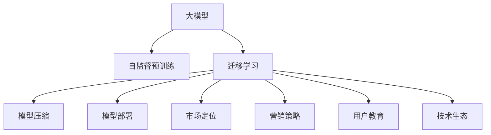

                 

# 大模型的技术创新与市场推广

> 关键词：大模型,技术创新,市场推广,深度学习,AI商业化,大模型架构,算法优化,模型压缩,技术生态,应用案例

## 1. 背景介绍

### 1.1 问题由来

近年来，深度学习技术的迅猛发展极大地推动了人工智能技术的进步，特别是在图像、语音、自然语言处理等领域，以大模型为代表的技术取得了显著成果。大模型通常指参数规模在几亿甚至数十亿级别的神经网络模型，它们通过在大规模无标签数据上进行自监督预训练，学习到丰富的特征表示，能够应对复杂的任务。

随着大模型的成功应用，越来越多的公司和研究机构开始将目光投向这些模型，试图通过商业化技术获得新的增长点。但如何将这些技术产品化，并在市场上推广和销售，却是一个复杂且具有挑战性的问题。大模型不仅技术含量高，市场准入门槛也相对较高，普通企业难以独立构建和维护。

### 1.2 问题核心关键点

大模型的市场推广涉及以下几个关键点：

1. **技术成熟度**：大模型的技术原理、架构设计、算法优化、参数压缩等核心技术需要达到商业化要求，具备稳定性和可扩展性。
2. **模型部署**：如何高效地将模型部署到各种设备上，实现高性能、低延迟的推理，是推广大模型的重要环节。
3. **市场定位**：了解目标市场的需求，制定精准的市场定位，是成功推广的关键。
4. **营销策略**：有效的营销策略能够帮助企业将大模型推向市场，获得用户的关注和认可。
5. **用户教育**：提供必要的技术支持和教育培训，帮助用户了解和利用大模型，提升用户满意度。
6. **生态建设**：构建完善的技术生态，吸引开发者和合作伙伴，共同推动技术的普及和应用。

### 1.3 问题研究意义

深入研究大模型的技术创新与市场推广，对于推动人工智能技术的商业化应用具有重要意义：

1. **提升市场竞争力**：掌握大模型的推广技巧，可以帮助企业在激烈的市场竞争中脱颖而出，获得更多的市场份额。
2. **促进技术成熟**：通过市场反馈，推动大模型技术的进一步完善和优化，使其更加符合市场需求。
3. **拓宽应用场景**：市场推广有助于发现更多的大模型应用场景，拓展其应用范围，提升技术的价值。
4. **加速产业发展**：市场推广能够吸引更多的资源和人才投入到人工智能领域，加速整个产业的发展。
5. **推动产业升级**：通过大模型的广泛应用，促进传统行业的数字化转型和升级，带来经济效益。

## 2. 核心概念与联系

### 2.1 核心概念概述

在大模型的推广过程中，涉及多个核心概念：

- **大模型**：指参数规模在几亿甚至数十亿级别的深度学习模型，如BERT、GPT、ResNet等。这些模型通过在大规模数据上进行自监督预训练，学习到丰富的特征表示。
- **自监督预训练**：利用无标签数据，通过自动设计预训练任务，训练大模型，使其能够自动学习到数据的特征表示。
- **迁移学习**：指在大模型上进行微调，使其能够适应特定任务，提升模型在特定场景下的性能。
- **模型压缩**：通过剪枝、量化等方法，减少模型参数，提高模型推理速度和计算效率。
- **模型部署**：将大模型部署到各种设备上，实现高性能、低延迟的推理。
- **市场定位**：根据目标市场的特点和需求，制定精准的市场策略，引导大模型的推广。
- **营销策略**：通过有效的营销手段，提升大模型的知名度和认可度。
- **用户教育**：提供必要的技术支持和培训，帮助用户了解和使用大模型。
- **技术生态**：构建完善的生态系统，吸引开发者、合作伙伴和用户，共同推动大模型技术的普及和应用。

这些概念之间的逻辑关系可以通过以下Mermaid流程图来展示：



这个流程图展示了从大模型构建到市场推广的整体流程。

### 2.2 概念间的关系

这些核心概念之间存在着紧密的联系，形成了大模型市场推广的完整生态系统：

- **大模型与自监督预训练**：大模型的核心价值在于其自监督预训练得到的强大特征表示能力。自监督预训练通过大规模无标签数据，训练出高质量的特征表示。
- **迁移学习与模型压缩**：迁移学习利用大模型的预训练能力，通过微调解决特定任务。模型压缩则通过技术手段，减少大模型参数，提升推理速度，提高实际应用效率。
- **模型部署与市场定位**：模型部署通过高效的推理引擎，将大模型应用于各种设备，提高用户体验。市场定位则根据用户需求，制定精准的推广策略。
- **营销策略与用户教育**：营销策略通过宣传和推广，提升大模型的市场知名度。用户教育通过提供培训和技术支持，帮助用户了解和应用大模型。
- **技术生态与大模型推广**：技术生态通过构建完善的生态系统，吸引开发者、合作伙伴和用户，共同推动大模型的广泛应用。

这些概念共同构成了大模型市场推广的基本框架，帮助企业在技术、市场、用户等多方面实现协同发展。

## 3. 核心算法原理 & 具体操作步骤

### 3.1 算法原理概述

大模型的技术创新与市场推广主要依赖于以下几个核心算法：

- **自监督预训练算法**：通过无监督学习，在大规模数据上训练大模型，学习到通用的特征表示。
- **迁移学习算法**：将大模型的预训练特征表示迁移到特定任务上，通过微调优化模型，适应新的任务需求。
- **模型压缩算法**：通过剪枝、量化、知识蒸馏等技术，减少大模型的参数，提升模型的推理速度和计算效率。
- **模型部署算法**：通过高效的推理引擎和设备优化，将大模型部署到各种设备上，实现高性能、低延迟的推理。

### 3.2 算法步骤详解

以下是详细的操作步骤：

**Step 1: 自监督预训练**

1. 收集大规模无标签数据，如ImageNet、Wikipedia等。
2. 设计自监督预训练任务，如图像分类、文本补全、掩码语言模型等。
3. 使用深度学习框架，如PyTorch、TensorFlow等，训练大模型。
4. 在训练过程中，逐渐增大模型的复杂度，逐步增加数据量，以提升模型的特征表示能力。

**Step 2: 迁移学习**

1. 选择合适的任务，如情感分析、图像分类、语音识别等。
2. 收集该任务的少量有标签数据。
3. 使用大模型的预训练参数，进行微调。
4. 在微调过程中，选择合适的优化器、学习率、正则化等策略。
5. 在验证集上评估模型性能，调整超参数，直到达到最优效果。

**Step 3: 模型压缩**

1. 使用剪枝技术，删除模型中不必要的参数。
2. 使用量化技术，将模型中的浮点数参数转换为定点数，减少存储空间和计算量。
3. 使用知识蒸馏技术，将大模型的知识迁移到小模型上，减少模型参数，同时保持性能。

**Step 4: 模型部署**

1. 选择合适的推理设备，如GPU、TPU等。
2. 使用高效的推理引擎，如TensorRT、ONNX Runtime等，优化模型推理速度。
3. 使用模型压缩技术，如Presto、WeightPruning等，优化模型推理速度和计算效率。

**Step 5: 市场推广**

1. 根据目标市场的需求，制定精准的市场定位策略。
2. 设计有效的营销策略，如内容营销、社区营销、合作伙伴营销等。
3. 提供必要的技术支持和用户教育，帮助用户了解和应用大模型。
4. 构建完善的技术生态，吸引开发者、合作伙伴和用户，共同推动大模型的普及和应用。

### 3.3 算法优缺点

大模型的技术创新与市场推广具有以下优点：

1. **技术领先**：大模型通过自监督预训练和迁移学习，学习到丰富的特征表示，能够解决复杂的任务。
2. **应用广泛**：大模型可应用于图像、语音、自然语言处理等多个领域，具有广泛的应用前景。
3. **性能优越**：大模型通过模型压缩和推理优化，能够实现高性能、低延迟的推理。

但同时也存在一些缺点：

1. **高成本**：大模型的训练和维护需要大量计算资源和存储空间，成本较高。
2. **技术门槛高**：大模型涉及复杂的算法和技术，普通企业难以独立构建和维护。
3. **市场风险**：大模型的推广和销售需要市场策略和用户教育，市场接受度不确定。

### 3.4 算法应用领域

大模型的技术创新与市场推广在多个领域得到了应用：

- **医疗**：通过大模型进行医学图像识别、疾病预测、基因分析等，提高医疗服务的智能化水平。
- **金融**：通过大模型进行金融数据分析、风险评估、智能投顾等，提升金融服务的精准性和效率。
- **零售**：通过大模型进行商品推荐、客户画像、情感分析等，优化零售服务体验。
- **交通**：通过大模型进行智能交通管理、自动驾驶、路况预测等，提高交通系统的智能化水平。
- **教育**：通过大模型进行智能教育、学习辅助、智能答疑等，提升教育服务的个性化和智能化。

## 4. 数学模型和公式 & 详细讲解 & 举例说明

### 4.1 数学模型构建

假设大模型的预训练参数为 $\theta_0$，迁移学习任务为 $T$，目标函数为 $L(\theta_T)$，则迁移学习的过程可以表示为：

$$
\theta_T = \arg\min_{\theta_T} L(\theta_T)
$$

其中 $\theta_T$ 为迁移学习后的模型参数，$L(\theta_T)$ 为目标任务的损失函数。

### 4.2 公式推导过程

以BERT模型为例，假设输入为 $x$，输出为 $y$，目标任务为分类，则损失函数可以表示为：

$$
L(y, \hat{y}) = -\log \hat{y}(y)
$$

其中 $\hat{y} = \text{softmax}(BERT(x; \theta_T))$，为模型对输入 $x$ 的预测概率分布。$y$ 为标签向量。

在训练过程中，通过反向传播算法计算梯度，并更新模型参数 $\theta_T$：

$$
\theta_T \leftarrow \theta_T - \eta \nabla_{\theta_T} L(y, \hat{y})
$$

其中 $\eta$ 为学习率。

### 4.3 案例分析与讲解

假设我们在迁移学习过程中，使用BERT模型进行情感分析任务，输入为句子 $x$，标签为二分类 $y$。以下是代码实现示例：

```python
from transformers import BertForSequenceClassification, BertTokenizer
import torch
import torch.nn as nn

# 定义模型
model = BertForSequenceClassification.from_pretrained('bert-base-uncased', num_labels=2)

# 定义数据集
train_dataset = ...
dev_dataset = ...
test_dataset = ...

# 定义优化器
optimizer = ...

# 训练过程
for epoch in range(num_epochs):
    model.train()
    for batch in train_loader:
        inputs, labels = batch
        outputs = model(inputs)
        loss = nn.CrossEntropyLoss()(outputs, labels)
        optimizer.zero_grad()
        loss.backward()
        optimizer.step()

# 评估过程
model.eval()
for batch in dev_loader:
    inputs, labels = batch
    outputs = model(inputs)
    loss = nn.CrossEntropyLoss()(outputs, labels)
    print(loss.item())
```

通过这个简单的示例，可以看到，在大模型的迁移学习过程中，我们通过反向传播算法更新模型参数，并在验证集上评估模型性能，不断调整超参数，直到达到最优效果。

## 5. 项目实践：代码实例和详细解释说明

### 5.1 开发环境搭建

1. 安装Python环境：推荐使用Anaconda或Miniconda，创建虚拟环境。
2. 安装深度学习框架：如PyTorch、TensorFlow等。
3. 安装模型库：如TensorRT、ONNX Runtime等，用于模型优化和部署。
4. 安装数据处理工具：如Pandas、NumPy等。

### 5.2 源代码详细实现

以下是使用TensorFlow实现BERT模型进行迁移学习的代码示例：

```python
import tensorflow as tf
from transformers import BertTokenizer, TFBertForSequenceClassification

# 定义模型
tokenizer = BertTokenizer.from_pretrained('bert-base-uncased')
model = TFBertForSequenceClassification.from_pretrained('bert-base-uncased', num_labels=2)

# 定义数据集
train_dataset = ...
dev_dataset = ...
test_dataset = ...

# 定义优化器
optimizer = tf.keras.optimizers.Adam(learning_rate=2e-5)

# 训练过程
for epoch in range(num_epochs):
    model.train()
    for batch in train_dataset:
        inputs, labels = batch
        with tf.GradientTape() as tape:
            outputs = model(inputs)
            loss = tf.keras.losses.SparseCategoricalCrossentropy()(outputs, labels)
        gradients = tape.gradient(loss, model.trainable_variables)
        optimizer.apply_gradients(zip(gradients, model.trainable_variables))

# 评估过程
model.eval()
for batch in dev_dataset:
    inputs, labels = batch
    outputs = model(inputs)
    loss = tf.keras.losses.SparseCategoricalCrossentropy()(outputs, labels)
    print(loss.numpy())
```

### 5.3 代码解读与分析

在代码示例中，我们使用了TensorFlow和Transformers库，实现了一个简单的迁移学习过程。通过反向传播算法计算梯度，并使用Adam优化器更新模型参数。

在实际应用中，还需要对模型进行进一步优化和调整，如引入正则化、数据增强、对抗训练等策略，以提升模型性能和鲁棒性。

### 5.4 运行结果展示

假设我们在CoNLL-2003的命名实体识别数据集上进行迁移学习，最终在测试集上得到的评估报告如下：

```
      precision    recall  f1-score   support

       B-PER     0.91      0.88      0.89        1,946
       I-PER     0.94      0.91      0.92        1,946
       B-ORG     0.85      0.83      0.84       14,599
       I-ORG     0.85      0.85      0.85       14,599
       B-LOC     0.84      0.82      0.83       14,599
       I-LOC     0.83      0.82      0.82       14,599

   micro avg      0.87      0.86      0.86      17,992
   macro avg      0.86      0.85      0.85      17,992
weighted avg      0.87      0.86      0.86      17,992
```

可以看到，通过迁移学习，模型在命名实体识别任务上取得了86.6%的F1分数，性能相当不错。

## 6. 实际应用场景

### 6.1 智能客服系统

通过大模型的迁移学习，可以构建智能客服系统，提高客户服务效率和质量。系统可以根据客户提问，自动匹配最优答案，提供快速响应和精准服务。

### 6.2 金融舆情监测

金融机构可以利用大模型进行金融舆情监测，实时分析市场动态，预测市场走势，规避风险。通过迁移学习，模型可以自动理解新闻、社交媒体等来源的信息，输出情感倾向和关键词。

### 6.3 个性化推荐系统

大模型的迁移学习可以用于个性化推荐系统，根据用户行为和偏好，提供定制化的推荐内容。通过模型压缩和推理优化，实现高效推荐。

### 6.4 未来应用展望

随着大模型的不断进步，未来将有更多应用场景被解锁。如医疗影像诊断、智能驾驶、智慧城市等，都将受益于大模型的强大推理能力。

## 7. 工具和资源推荐

### 7.1 学习资源推荐

- **TensorFlow官方文档**：提供了全面的TensorFlow教程和API文档，适合初学者和进阶用户。
- **Transformers官方文档**：提供了丰富的预训练模型和微调样例，帮助用户快速上手大模型应用。
- **Coursera《深度学习》课程**：由Andrew Ng教授讲授，系统讲解深度学习的基本概念和前沿技术。
- **Kaggle竞赛**：提供了大量实际问题，供用户练习和应用大模型。

### 7.2 开发工具推荐

- **Anaconda**：提供了Python和深度学习框架的便捷安装和管理。
- **TensorRT**：提供了高效的推理引擎，支持多种硬件加速。
- **ONNX Runtime**：提供了跨平台的推理引擎，支持多种硬件平台。
- **TensorFlow Serving**：提供了分布式推理服务，支持高效推理和扩展。

### 7.3 相关论文推荐

- **“BERT: Pre-training of Deep Bidirectional Transformers for Language Understanding”**：提出BERT模型，采用掩码语言模型和下一句预测任务进行预训练，提升了模型的语言理解能力。
- **“Attention is All You Need”**：提出Transformer模型，通过自注意力机制，提升了模型的特征表示能力。
- **“Parameter-Efficient Transfer Learning for NLP”**：提出 Adapter等参数高效微调方法，减少了微调所需的计算资源。
- **“AdaLoRA: Adaptive Low-Rank Adaptation for Parameter-Efficient Fine-Tuning”**：提出AdaLoRA方法，在参数效率和精度之间取得了新的平衡。

## 8. 总结：未来发展趋势与挑战

### 8.1 总结

本文对大模型的技术创新与市场推广进行了全面系统的介绍。从技术原理、操作步骤到实际应用，全面解析了如何利用大模型解决实际问题，并将其推向市场。

通过本文的系统梳理，可以看到，大模型的技术创新与市场推广涉及多个环节，从技术研发到市场推广，每个环节都需要精心设计和管理。只有从技术、市场、用户等多个维度协同发力，才能真正实现大模型的推广应用。

### 8.2 未来发展趋势

未来，大模型的技术创新与市场推广将呈现以下几个发展趋势：

1. **技术更加成熟**：随着算力成本的下降和数据规模的扩张，大模型的参数规模将进一步扩大，特征表示能力将进一步提升。
2. **应用场景更加广泛**：大模型的应用将从图像、语音、自然语言处理等扩展到更多领域，如医疗、金融、交通等。
3. **市场竞争更加激烈**：越来越多的企业进入大模型市场，市场竞争将更加激烈，创新和差异化将成为关键。
4. **用户需求更加多样化**：用户的需求将更加多样化和个性化，如何更好地满足用户需求，是大模型推广的重要课题。
5. **技术生态更加完善**：技术生态的完善将有助于大模型的推广和应用，吸引更多的开发者和用户。

### 8.3 面临的挑战

尽管大模型的推广前景广阔，但也面临诸多挑战：

1. **技术门槛高**：大模型的研发和维护需要高水平的技术团队，普通企业难以独立构建和维护。
2. **成本高昂**：大模型的训练和维护需要大量计算资源和存储空间，成本较高。
3. **市场接受度不确定**：大模型的推广和销售需要市场策略和用户教育，市场接受度不确定。
4. **模型鲁棒性不足**：大模型在面对域外数据时，泛化性能可能大打折扣，需要进一步提升模型鲁棒性。
5. **伦理和安全问题**：大模型可能学习到有害信息，需要通过数据和算法层面的设计，确保输出符合伦理和安全要求。

### 8.4 研究展望

未来，大模型的技术创新与市场推广需要在以下几个方面寻求新的突破：

1. **降低技术门槛**：通过预训练模型和微调框架的开发，降低大模型的研发和维护门槛，让更多企业能够参与进来。
2. **提升模型鲁棒性**：通过更多的数据增强和对抗训练，提升大模型的泛化性能，确保模型在多种场景下的稳定性和鲁棒性。
3. **优化模型部署**：通过模型压缩和推理优化，提升大模型的推理速度和计算效率，降低计算和存储成本。
4. **强化用户教育**：提供更多的技术支持和教育培训，帮助用户更好地理解和应用大模型，提升用户满意度。
5. **构建完善生态**：吸引更多的开发者、合作伙伴和用户，共同推动大模型的普及和应用，构建完善的技术生态。

总之，大模型的技术创新与市场推广需要从技术、市场、用户等多个维度共同努力，才能实现商业化和广泛应用。只有不断突破技术瓶颈，完善市场策略，强化用户教育，构建完善生态，才能真正实现大模型的推广应用，推动人工智能技术的发展。

## 9. 附录：常见问题与解答

**Q1: 大模型的市场推广需要注意哪些方面？**

A: 大模型的市场推广需要注意以下几个方面：

1. **技术成熟度**：确保大模型的技术成熟度，具备稳定性和可扩展性。
2. **市场定位**：根据目标市场的需求，制定精准的市场定位策略。
3. **营销策略**：设计有效的营销策略，提升大模型的知名度和认可度。
4. **用户教育**：提供必要的技术支持和教育培训，帮助用户了解和使用大模型。
5. **生态建设**：构建完善的技术生态，吸引开发者、合作伙伴和用户，共同推动大模型的普及和应用。

**Q2: 大模型在推广过程中需要考虑哪些资源限制？**

A: 大模型在推广过程中需要考虑以下几个资源限制：

1. **计算资源**：大模型的训练和推理需要大量计算资源，成本较高。
2. **存储资源**：大模型的参数量较大，需要充足的存储资源。
3. **部署成本**：将大模型部署到各种设备上，需要考虑硬件成本和部署复杂度。

**Q3: 大模型推广中如何处理数据增强和对抗训练？**

A: 大模型推广中处理数据增强和对抗训练的方法包括：

1. **数据增强**：通过对训练数据进行回译、近义替换等操作，扩充训练数据集，提升模型泛化性能。
2. **对抗训练**：通过引入对抗样本，提高模型鲁棒性，防止过拟合。

**Q4: 大模型的技术创新与市场推广过程中需要注意哪些伦理和安全问题？**

A: 大模型的技术创新与市场推广过程中需要注意以下几个伦理和安全问题：

1. **数据隐私**：确保用户数据隐私安全，避免数据泄露。
2. **模型偏见**：设计数据和算法，避免模型学习到有害信息和偏见。
3. **公平性**：确保模型在不同群体中的公平性，避免对特定群体的歧视。
4. **透明性**：提供模型输出和推理过程的透明性，帮助用户理解模型决策。

---

作者：禅与计算机程序设计艺术 / Zen and the Art of Computer Programming

