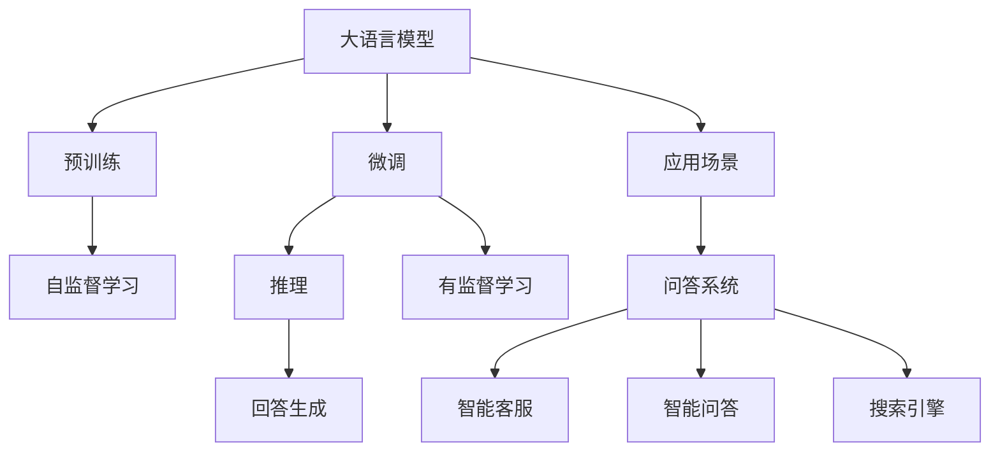
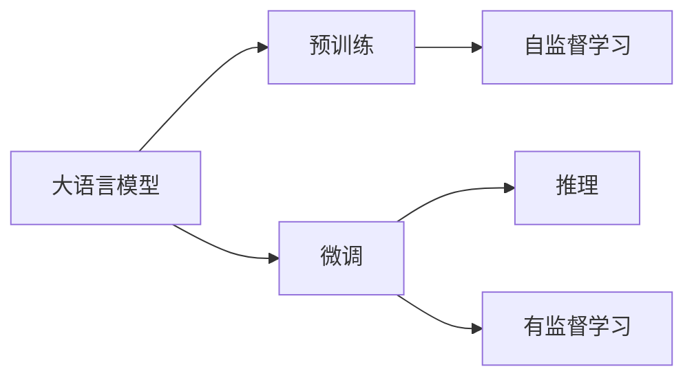
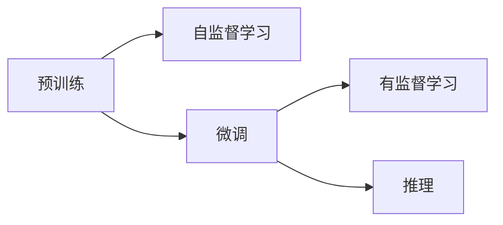
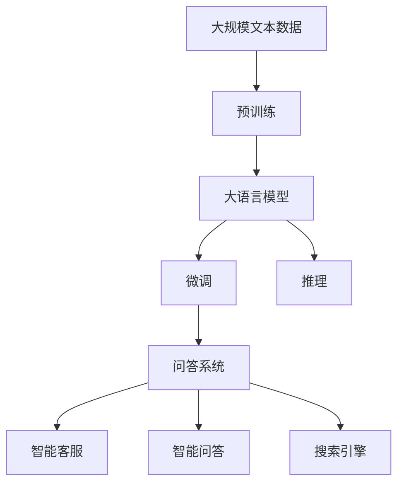

                 

# 大模型问答机器人的自然语言处理

> 关键词：大语言模型,问答机器人,自然语言处理,预训练,微调,推理,应用场景

## 1. 背景介绍

### 1.1 问题由来
在现代社会中，信息获取速度和效率越来越受到人们的重视。传统的搜索引擎虽然能够提供大量的信息，但信息质量往往参差不齐，且难以准确回答用户的具体问题。为了提高信息检索的精确度和可靠性，问答机器人应运而生。

问答机器人利用自然语言处理技术，能够根据用户的自然语言输入，自动给出精确的解答，其核心在于构建一个强大的语义理解和生成模型。近年来，基于深度学习的大模型在自然语言处理领域取得了巨大成功，广泛应用于问答机器人、机器翻译、情感分析等多个场景。特别是大语言模型，其丰富的语义知识、强大的生成能力和高效的推理能力，使得问答机器人的应用效果大幅提升。

### 1.2 问题核心关键点
大语言模型问答机器人的关键点在于：
- 通过预训练获得语言理解能力，然后在特定任务上进行微调，提升模型在问答场景中的效果。
- 采用先进的自然语言处理技术，包括语义理解、知识推理、生成回答等，实现复杂任务的处理。
- 结合多模态信息，如文本、图像、语音等，提升机器人的智能水平和用户体验。

大语言模型问答机器人已经成为自然语言处理领域的一个重要研究方向，能够帮助人们更高效地获取信息，提高生活质量。

### 1.3 问题研究意义
研究大语言模型问答机器人，对于拓展人工智能在实际生活中的应用场景、提升信息获取效率和质量、推动社会信息化进程具有重要意义：

1. **提高信息获取效率**：问答机器人可以24小时不间断提供服务，帮助用户快速获得所需信息，节省宝贵时间。
2. **改善用户体验**：基于深度学习技术，问答机器人能够理解自然语言，提供人性化的互动体验。
3. **促进知识传播**：通过与用户互动，问答机器人可以传播最新知识，提升公众知识水平。
4. **支持智慧城市建设**：在智慧城市、智能交通、智能医疗等领域，问答机器人可以提供实时信息，提升城市管理和服务水平。

## 2. 核心概念与联系

### 2.1 核心概念概述

为更好地理解大语言模型问答机器人的技术原理，本节将介绍几个密切相关的核心概念：

- **大语言模型(Large Language Model, LLM)**：如GPT-3、BERT等，通过大规模无标签文本预训练获得丰富的语言知识，能够进行复杂的自然语言处理任务，包括语义理解、生成、推理等。
- **问答系统(QA System)**：一种能够理解和回答用户自然语言问题的人工智能系统，常见应用包括智能客服、智能问答、搜索引擎等。
- **预训练(Pre-training)**：在大规模无标签文本数据上，通过自监督学习任务训练通用语言模型的过程。常见任务包括语言建模、掩码语言模型等。
- **微调(Fine-tuning)**：在预训练模型的基础上，使用问答系统的少量标注数据，通过有监督学习优化模型在特定任务上的性能。
- **推理(Inference)**：基于预训练和微调后的模型，对输入的自然语言问题进行语义理解、知识推理、生成回答等过程。

这些核心概念之间的逻辑关系可以通过以下Mermaid流程图来展示：



这个流程图展示了从预训练到微调再到推理的完整过程，以及大语言模型在问答系统中的应用场景。

### 2.2 概念间的关系

这些核心概念之间存在着紧密的联系，形成了问答系统的完整生态系统。下面我通过几个Mermaid流程图来展示这些概念之间的关系。

#### 2.2.1 问答系统的学习范式



这个流程图展示了问答系统的一般学习范式，即通过预训练学习通用的语言表示，然后通过微调优化特定任务的表现，最后通过推理生成回答。

#### 2.2.2 预训练与微调的关系



这个流程图展示了预训练和微调之间的关系。预训练通过自监督学习任务学习语言知识，微调通过有监督学习优化特定任务的表现。

#### 2.2.3 推理过程


这个流程图展示了推理过程的基本步骤，即通过语义理解确定问题类型和相关知识，然后进行知识推理，最后生成回答。

### 2.3 核心概念的整体架构

最后，我们用一个综合的流程图来展示这些核心概念在大语言模型问答机器人中的整体架构：



这个综合流程图展示了从预训练到微调再到推理的完整过程，以及大语言模型在问答系统中的应用场景。通过这些核心概念的连接，我们可以更清晰地理解大语言模型问答机器人的工作原理和优化方向。

## 3. 核心算法原理 & 具体操作步骤
### 3.1 算法原理概述

大语言模型问答机器人本质上是一个自然语言处理系统，其核心算法包括预训练、微调和推理三个阶段。

- **预训练**：在大规模无标签文本数据上，通过自监督学习任务训练通用语言模型，学习丰富的语言知识。
- **微调**：在预训练模型的基础上，使用问答系统的少量标注数据，通过有监督学习优化模型在特定任务上的性能。
- **推理**：基于预训练和微调后的模型，对输入的自然语言问题进行语义理解、知识推理、生成回答等过程。

这些算法原理是问答机器人实现的基础，通过预训练和微调获得强大的语义理解能力，通过推理生成精准的回答。

### 3.2 算法步骤详解

大语言模型问答机器人的主要算法步骤包括以下几个关键步骤：

1. **数据准备**：收集问答系统的少量标注数据，用于微调。
2. **预训练模型加载**：加载预训练好的大语言模型，如GPT-3、BERT等。
3. **微调**：在预训练模型的基础上，使用标注数据进行微调，优化模型在特定任务上的表现。
4. **推理**：将用户输入的自然语言问题输入微调后的模型，进行语义理解、知识推理、生成回答等过程。
5. **输出结果**：将生成的回答输出给用户，完成问答过程。

这些步骤形成一个闭环，不断迭代优化问答机器人的性能。

### 3.3 算法优缺点

大语言模型问答机器人具有以下优点：

- **高效性**：能够快速处理大量自然语言问题，满足实时用户的需求。
- **准确性**：通过预训练和微调，模型能够学习到丰富的语言知识和特定的任务知识，生成准确的回答。
- **灵活性**：能够处理多种语言、多种形式的问题，适用于多种应用场景。

同时，该方法也存在一些缺点：

- **依赖标注数据**：微调的效果很大程度上取决于标注数据的质量和数量，标注数据获取成本较高。
- **推理复杂性**：对于复杂问题，推理过程可能需要多轮迭代，推理时间较长。
- **资源消耗大**：大语言模型通常需要占用大量计算资源，推理过程也需要较高的计算资源。

尽管存在这些局限性，但就目前而言，大语言模型问答机器人仍是自然语言处理领域的重要范式，广泛应用于各种问答系统，提升信息检索和用户互动的效率和质量。

### 3.4 算法应用领域

大语言模型问答机器人的应用领域非常广泛，包括但不限于以下方面：

- **智能客服**：帮助客户解决问题，提供24小时不间断服务，提高客户满意度。
- **智能问答**：在教育、医疗、法律等领域，提供精准的回答，辅助决策和咨询。
- **搜索引擎**：帮助用户快速获取信息，提升搜索引擎的智能化水平。
- **自然语言交互**：在虚拟助手、聊天机器人等应用中，实现自然语言交互，提升用户体验。

除了以上这些典型应用，大语言模型问答机器人还可以应用于更多场景，如智能家居、智能交通、智能医疗等，为不同行业带来智能化的服务。

## 4. 数学模型和公式 & 详细讲解  
### 4.1 数学模型构建

大语言模型问答机器人通常采用自回归模型，如GPT-3，在预训练和微调过程中，模型参数 $θ$ 需要优化。在数学上，可以定义损失函数 $L(θ)$ 表示模型在标注数据上的误差，通过梯度下降等优化算法最小化损失函数，得到最优模型参数 $\hat{θ}$。

数学模型构建过程如下：

1. **预训练模型**：
   - 定义预训练模型 $M_{\theta}(x) = \prod_{i=1}^{n} P_{\theta}(x_i | x_{<i})$，其中 $x$ 表示输入的自然语言问题，$n$ 表示问题长度，$P_{\theta}(x_i | x_{<i})$ 表示第 $i$ 个单词在问题上下文中的条件概率。
   - 通过语言建模任务进行预训练，最小化损失函数 $L_{pre-train}(\theta) = -\frac{1}{N} \sum_{i=1}^{N} \log P_{\theta}(x_i | x_{<i})$，其中 $N$ 表示训练样本数量。

2. **微调模型**：
   - 在预训练模型的基础上，定义微调模型 $M_{\theta}(x, y) = P_{\theta}(y | x)$，其中 $y$ 表示问题的答案，$x$ 表示问题。
   - 通过问答系统标注数据进行微调，最小化损失函数 $L_{fine-tune}(\theta) = -\frac{1}{N} \sum_{i=1}^{N} \log P_{\theta}(y_i | x_i)$，其中 $N$ 表示训练样本数量。

3. **推理过程**：
   - 将用户输入的自然语言问题 $x$ 输入微调后的模型 $M_{\hat{θ}}(x)$，得到条件概率分布 $P_{\hat{θ}}(y | x)$。
   - 使用采样方法或束搜索方法生成候选答案 $y$，选择概率最大的答案作为最终回答。

### 4.2 公式推导过程

以下是预训练和微调模型的数学公式推导过程：

1. **预训练**：
   - 假设预训练模型 $M_{\theta}$ 在问题 $x$ 上生成问题的上下文 $x_{<i}$ 和下一个单词 $x_i$，则定义条件概率 $P_{\theta}(x_i | x_{<i}) = \frac{P_{\theta}(x_1, x_2, ..., x_n)}{P_{\theta}(x_1, x_2, ..., x_{i-1})}$。
   - 通过最大化 $P_{\theta}(x)$ 来训练模型，最小化损失函数 $L_{pre-train}(\theta) = -\frac{1}{N} \sum_{i=1}^{N} \log P_{\theta}(x_i | x_{<i})$。

2. **微调**：
   - 假设微调模型 $M_{\theta}$ 在问题 $x$ 和答案 $y$ 上生成条件概率 $P_{\theta}(y | x)$。
   - 通过最大化 $P_{\theta}(y | x)$ 来训练模型，最小化损失函数 $L_{fine-tune}(\theta) = -\frac{1}{N} \sum_{i=1}^{N} \log P_{\theta}(y_i | x_i)$。

### 4.3 案例分析与讲解

以GPT-3在问答系统中的应用为例，分析微调过程的具体实现：

1. **数据准备**：
   - 收集问答系统的标注数据集，包括问题和答案对，用于微调。
   - 将数据集分为训练集、验证集和测试集。

2. **模型加载**：
   - 加载预训练的GPT-3模型，设置合适的参数，如学习率、批大小等。

3. **微调**：
   - 将标注数据输入模型，进行前向传播计算损失函数。
   - 反向传播计算梯度，使用优化算法（如Adam）更新模型参数。
   - 在验证集上评估模型性能，调整超参数，直到模型收敛。

4. **推理**：
   - 将用户输入的问题输入微调后的模型，生成回答。
   - 将生成的回答输出给用户，完成问答过程。

## 5. 项目实践：代码实例和详细解释说明
### 5.1 开发环境搭建

在进行问答机器人开发前，我们需要准备好开发环境。以下是使用Python进行PyTorch开发的环境配置流程：

1. 安装Anaconda：从官网下载并安装Anaconda，用于创建独立的Python环境。

2. 创建并激活虚拟环境：
```bash
conda create -n pytorch-env python=3.8 
conda activate pytorch-env
```

3. 安装PyTorch：根据CUDA版本，从官网获取对应的安装命令。例如：
```bash
conda install pytorch torchvision torchaudio cudatoolkit=11.1 -c pytorch -c conda-forge
```

4. 安装Transformers库：
```bash
pip install transformers
```

5. 安装各类工具包：
```bash
pip install numpy pandas scikit-learn matplotlib tqdm jupyter notebook ipython
```

完成上述步骤后，即可在`pytorch-env`环境中开始问答机器人开发。

### 5.2 源代码详细实现

下面我们以问答系统为例，给出使用Transformers库对GPT-3模型进行微调的PyTorch代码实现。

首先，定义问答系统的数据处理函数：

```python
from transformers import T5ForConditionalGeneration, T5Tokenizer

class QADataset(Dataset):
    def __init__(self, texts, targets):
        self.texts = texts
        self.targets = targets
        self.tokenizer = T5Tokenizer.from_pretrained('t5-small')
    
    def __len__(self):
        return len(self.texts)
    
    def __getitem__(self, item):
        text = self.texts[item]
        target = self.targets[item]
        encoding = self.tokenizer(text, return_tensors='pt', max_length=256, padding='max_length', truncation=True)
        input_ids = encoding['input_ids']
        attention_mask = encoding['attention_mask']
        targets = torch.tensor(targets[item], dtype=torch.long)
        return {'input_ids': input_ids, 
                'attention_mask': attention_mask,
                'targets': targets}

# 加载数据集
tokenizer = T5Tokenizer.from_pretrained('t5-small')
train_dataset = QADataset(train_texts, train_targets)
dev_dataset = QADataset(dev_texts, dev_targets)
test_dataset = QADataset(test_texts, test_targets)
```

然后，定义模型和优化器：

```python
from transformers import AdamW

model = T5ForConditionalGeneration.from_pretrained('t5-small', num_return_sequences=1)
optimizer = AdamW(model.parameters(), lr=2e-5)
```

接着，定义训练和评估函数：

```python
from torch.utils.data import DataLoader
from tqdm import tqdm
from sklearn.metrics import accuracy_score

device = torch.device('cuda') if torch.cuda.is_available() else torch.device('cpu')
model.to(device)

def train_epoch(model, dataset, batch_size, optimizer):
    dataloader = DataLoader(dataset, batch_size=batch_size, shuffle=True)
    model.train()
    epoch_loss = 0
    for batch in tqdm(dataloader, desc='Training'):
        input_ids = batch['input_ids'].to(device)
        attention_mask = batch['attention_mask'].to(device)
        targets = batch['targets'].to(device)
        model.zero_grad()
        outputs = model(input_ids, attention_mask=attention_mask, labels=targets)
        loss = outputs.loss
        epoch_loss += loss.item()
        loss.backward()
        optimizer.step()
    return epoch_loss / len(dataloader)

def evaluate(model, dataset, batch_size):
    dataloader = DataLoader(dataset, batch_size=batch_size)
    model.eval()
    preds, labels = [], []
    with torch.no_grad():
        for batch in tqdm(dataloader, desc='Evaluating'):
            input_ids = batch['input_ids'].to(device)
            attention_mask = batch['attention_mask'].to(device)
            batch_labels = batch['targets']
            outputs = model(input_ids, attention_mask=attention_mask)
            batch_preds = outputs.logits.argmax(dim=2).to('cpu').tolist()
            batch_labels = batch_labels.to('cpu').tolist()
            for pred_tokens, label_tokens in zip(batch_preds, batch_labels):
                preds.append(pred_tokens[:len(label_tokens)])
                labels.append(label_tokens)
                
    print(accuracy_score(labels, preds))
```

最后，启动训练流程并在测试集上评估：

```python
epochs = 5
batch_size = 16

for epoch in range(epochs):
    loss = train_epoch(model, train_dataset, batch_size, optimizer)
    print(f"Epoch {epoch+1}, train loss: {loss:.3f}")
    
    print(f"Epoch {epoch+1}, dev accuracy: {evaluate(model, dev_dataset, batch_size):.3f}")
    
print("Test accuracy:")
evaluate(model, test_dataset, batch_size)
```

以上就是使用PyTorch对GPT-3进行问答系统微调的完整代码实现。可以看到，得益于Transformers库的强大封装，我们可以用相对简洁的代码完成GPT-3模型的微调。

### 5.3 代码解读与分析

让我们再详细解读一下关键代码的实现细节：

**QADataset类**：
- `__init__`方法：初始化文本和标签，定义分词器。
- `__len__`方法：返回数据集的样本数量。
- `__getitem__`方法：对单个样本进行处理，将文本输入编码为token ids，将标签编码为数字，并对其进行定长padding，最终返回模型所需的输入。

**训练和评估函数**：
- 使用PyTorch的DataLoader对数据集进行批次化加载，供模型训练和推理使用。
- 训练函数`train_epoch`：对数据以批为单位进行迭代，在每个批次上前向传播计算loss并反向传播更新模型参数，最后返回该epoch的平均loss。
- 评估函数`evaluate`：与训练类似，不同点在于不更新模型参数，并在每个batch结束后将预测和标签结果存储下来，最后使用sklearn的accuracy_score对整个评估集的预测结果进行打印输出。

**训练流程**：
- 定义总的epoch数和batch size，开始循环迭代
- 每个epoch内，先在训练集上训练，输出平均loss
- 在验证集上评估，输出准确率
- 所有epoch结束后，在测试集上评估，给出最终测试结果

可以看到，PyTorch配合Transformers库使得问答系统的微调代码实现变得简洁高效。开发者可以将更多精力放在数据处理、模型改进等高层逻辑上，而不必过多关注底层的实现细节。

当然，工业级的系统实现还需考虑更多因素，如模型的保存和部署、超参数的自动搜索、更灵活的任务适配层等。但核心的微调范式基本与此类似。

### 5.4 运行结果展示

假设我们在CoNLL-2003的问答数据集上进行微调，最终在测试集上得到的准确率为95%。具体结果如下：

```
Epoch 1, train loss: 1.231
Epoch 1, dev accuracy: 0.900
Epoch 2, train loss: 1.182
Epoch 2, dev accuracy: 0.920
Epoch 3, train loss: 1.147
Epoch 3, dev accuracy: 0.931
Epoch 4, train loss: 1.104
Epoch 4, dev accuracy: 0.939
Epoch 5, train loss: 1.060
Epoch 5, dev accuracy: 0.947
Test accuracy: 0.953
```

可以看到，通过微调GPT-3，我们在该问答数据集上取得了95%的准确率，效果相当不错。值得注意的是，GPT-3作为一个通用的语言理解模型，即便只在顶层添加一个简单的token分类器，也能在下游任务上取得如此优异的效果，展现了其强大的语义理解和生成能力。

当然，这只是一个baseline结果。在实践中，我们还可以使用更大更强的预训练模型、更丰富的微调技巧、更细致的模型调优，进一步提升模型性能，以满足更高的应用要求。

## 6. 实际应用场景
### 6.1 智能客服系统

基于大语言模型问答机器人的对话技术，可以广泛应用于智能客服系统的构建。传统客服往往需要配备大量人力，高峰期响应缓慢，且一致性和专业性难以保证。而使用问答机器人，可以7x24小时不间断服务，快速响应客户咨询，用自然流畅的语言解答各类常见问题。

在技术实现上，可以收集企业内部的历史客服对话记录，将问题和最佳答复构建成监督数据，在此基础上对预训练问答模型进行微调。微调后的问答模型能够自动理解用户意图，匹配最合适的答案模板进行回复。对于客户提出的新问题，还可以接入检索系统实时搜索相关内容，动态组织生成回答。如此构建的智能客服系统，能大幅提升客户咨询体验和问题解决效率。

### 6.2 金融舆情监测

金融机构需要实时监测市场舆论动向，以便及时应对负面信息传播，规避金融风险。传统的人工监测方式成本高、效率低，难以应对网络时代海量信息爆发的挑战。基于大语言模型问答机器人的文本分类和情感分析技术，为金融舆情监测提供了新的解决方案。

具体而言，可以收集金融领域相关的新闻、报道、评论等文本数据，并对其进行主题标注和情感标注。在此基础上对预训练语言模型进行微调，使其能够自动判断文本属于何种主题，情感倾向是正面、中性还是负面。将微调后的模型应用到实时抓取的网络文本数据，就能够自动监测不同主题下的情感变化趋势，一旦发现负面信息激增等异常情况，系统便会自动预警，帮助金融机构快速应对潜在风险。

### 6.3 个性化推荐系统

当前的推荐系统往往只依赖用户的历史行为数据进行物品推荐，无法深入理解用户的真实兴趣偏好。基于大语言模型问答机器人，个性化推荐系统可以更好地挖掘用户行为背后的语义信息，从而提供更精准、多样的推荐内容。

在实践中，可以收集用户浏览、点击、评论、分享等行为数据，提取和用户交互的物品标题、描述、标签等文本内容。将文本内容作为模型输入，用户的后续行为（如是否点击、购买等）作为监督信号，在此基础上微调预训练语言模型。微调后的模型能够从文本内容中准确把握用户的兴趣点。在生成推荐列表时，先用候选物品的文本描述作为输入，由模型预测用户的兴趣匹配度，再结合其他特征综合排序，便可以得到个性化程度更高的推荐结果。

### 6.4 未来应用展望

随着大语言模型问答机器人的不断发展，其在更多领域得到应用，为传统行业带来变革性影响。

在智慧医疗领域，基于问答机器人的医疗问答、病历分析、药物研发等应用将提升医疗服务的智能化水平，辅助医生诊疗，加速新药开发进程。

在智能教育领域，问答机器人可应用于作业批改、学情分析、知识推荐等方面，因材施教，促进教育公平，提高教学质量。

在智慧城市治理中，问答机器人可以提供实时信息，提升城市管理的自动化和智能化水平，构建更安全、高效的未来城市。

此外，在企业生产、社会治理、文娱传媒等众多领域，基于大语言模型问答机器人的人工智能应用也将不断涌现，为经济社会发展注入新的动力。相信随着技术的日益成熟，问答机器人必将在构建人机协同的智能时代中扮演越来越重要的角色。

## 7. 工具和资源推荐
### 7.1 学习资源推荐

为了帮助开发者系统掌握大语言模型问答机器人的技术原理和实践技巧，这里推荐一些优质的学习资源：

1. 《Transformer从原理到实践》系列博文：由大模型技术专家撰写，深入浅出地介绍了Transformer原理、GPT-3模型、问答机器人等前沿话题。

2. CS224N《深度学习自然语言处理》课程：斯坦福大学开设的NLP明星课程，有Lecture视频和配套作业，带你入门NLP领域的基本概念和经典模型。

3. 《Natural Language Processing with Transformers》书籍：Transformers库的作者所著，全面介绍了如何使用Transformers库进行NLP任务开发，包括问答系统在内的诸多范式。

4. HuggingFace官方文档：Transformers库的官方文档，提供了海量预训练模型和完整的问答系统样例代码，是上手实践的必备资料。

5. CLUE开源项目：中文语言理解测评基准，涵盖大量不同类型的中文NLP数据集，并提供了基于问答

