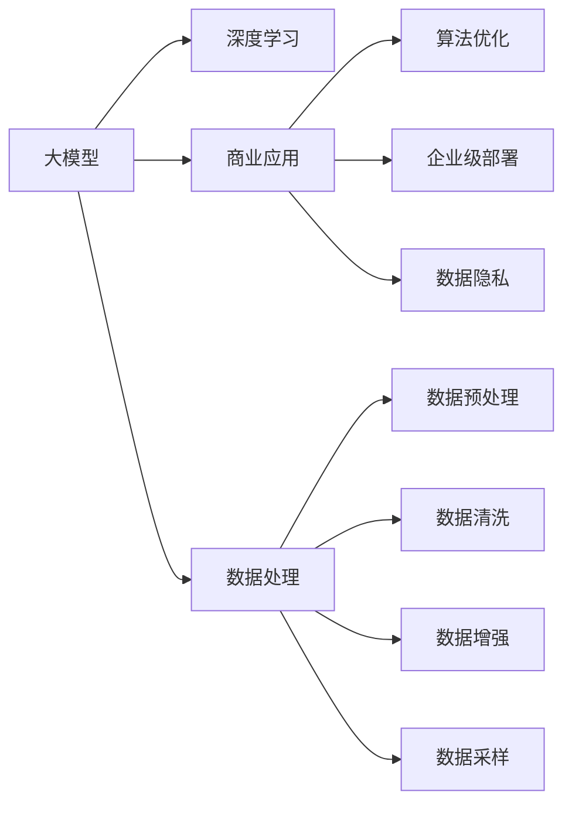
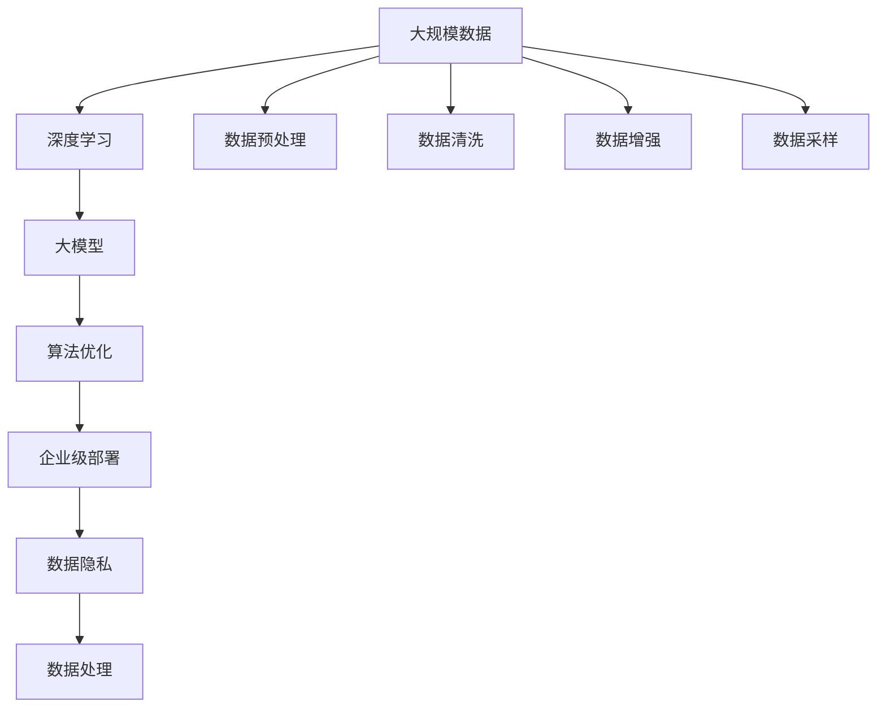

                 

# 大模型：商业应用的无限可能

> 关键词：大模型,商业应用,深度学习,算法优化,企业级部署,人工智能,数据分析,自动驾驶

## 1. 背景介绍

### 1.1 问题由来

随着深度学习技术的快速发展，大模型（Large Models）在商业领域中的应用日益广泛。这些大模型通过在大规模数据上进行训练，具备强大的特征提取和表示能力，能够处理复杂的数据任务，提升决策的准确性和效率。例如，自然语言处理（NLP）中的BERT、GPT等大模型，在情感分析、文本分类、机器翻译等任务上表现出色，已成为各行各业的重要工具。

然而，大模型在实际应用中也面临一些挑战，如计算资源需求高、训练时间长、参数更新复杂等。如何在商业应用中高效使用大模型，充分挖掘其商业价值，成为当前业界关注的焦点。本文将深入探讨大模型在商业应用中的无限可能性，并提出相应的优化策略和技术手段。

### 1.2 问题核心关键点

大模型的商业应用需要考虑以下几个核心关键点：

- **数据处理**：如何高效地处理大规模数据，同时保证数据的质量和多样性。
- **算法优化**：如何在大模型中嵌入高效、可解释的算法，以适应不同的商业场景。
- **模型部署**：如何在大模型中实现企业级的部署，兼顾高性能和稳定性。
- **数据隐私**：如何在保证数据隐私的前提下，实现数据的最大化利用。
- **未来挑战**：如何应对数据量增长、计算资源限制等未来挑战，推动大模型在商业应用中的不断进化。

## 2. 核心概念与联系

### 2.1 核心概念概述

为大模型商业应用提供充分指导，我们需要理解以下几个核心概念：

- **大模型（Large Models）**：指通过大规模数据训练得到的深度神经网络模型，具有强大的特征提取和表示能力。
- **商业应用（Commercial Applications）**：指大模型在各个行业中的实际应用场景，如金融、医疗、制造业等。
- **深度学习（Deep Learning）**：一种通过多层神经网络进行数据处理和分析的技术，是大模型构建的基础。
- **算法优化（Algorithm Optimization）**：在大模型中嵌入高效、可解释的算法，以提升模型的性能和应用效率。
- **企业级部署（Enterprise Deployment）**：将大模型部署到企业级环境中，实现商业化应用。
- **数据隐私（Data Privacy）**：在商业应用中如何保护数据隐私，避免数据泄露和滥用。

这些核心概念之间的逻辑关系可以通过以下Mermaid流程图来展示：



这个流程图展示了从大模型的构建到商业应用的全过程：

1. 大模型通过深度学习技术训练得到。
2. 大模型在商业应用中进行优化和部署。
3. 在商业应用中，数据隐私和数据处理是重要环节。
4. 数据处理包括数据预处理、数据清洗、数据增强和数据采样等步骤。

### 2.2 概念间的关系

这些核心概念之间存在着紧密的联系，构成了大模型在商业应用中的完整生态系统。下面通过几个Mermaid流程图来展示这些概念之间的关系。

#### 2.2.1 大模型的构建流程


这个流程图展示了从数据到商业应用的完整流程：

1. 通过深度学习技术构建大模型。
2. 大模型在商业应用中进行优化和部署。
3. 在商业应用中，考虑数据隐私和数据处理。
4. 数据处理包括数据预处理、数据清洗、数据增强和数据采样等步骤。

#### 2.2.2 数据处理与大模型的关系


这个流程图展示了数据处理在大模型构建中的作用：

1. 数据预处理、数据清洗、数据增强和数据采样等步骤是大模型训练的基础。
2. 深度学习技术利用处理后的数据构建大模型。
3. 大模型在商业应用中进行优化和部署。
4. 在商业应用中，考虑数据隐私和数据处理。

### 2.3 核心概念的整体架构

最后，我们用一个综合的流程图来展示这些核心概念在大模型商业应用中的整体架构：



这个综合流程图展示了从数据到商业应用的完整过程，同时考虑了算法优化、企业级部署和数据隐私等关键因素。通过这些流程图，我们可以更清晰地理解大模型商业应用中的各个环节和相互关系。

## 3. 核心算法原理 & 具体操作步骤

### 3.1 算法原理概述

大模型在商业应用中的算法优化主要包括以下几个方面：

- **特征提取**：大模型通过多层次的神经网络结构，自动提取数据中的关键特征，提升模型的表示能力。
- **损失函数设计**：选择合适的损失函数，使得模型能够更好地拟合目标数据，同时控制模型的复杂度。
- **正则化技术**：通过L2正则化、Dropout等技术，避免模型过拟合，提升模型的泛化能力。
- **迁移学习**：在大模型中嵌入迁移学习技术，通过预训练模型在特定任务上的微调，提升模型的适应性。

### 3.2 算法步骤详解

1. **数据准备**：收集和处理商业应用所需的各类数据，包括原始数据、标注数据和测试数据等。数据预处理、数据清洗、数据增强和数据采样等步骤是大模型训练的基础。

2. **模型选择**：根据商业应用的需求，选择合适的预训练大模型或构建新的模型。例如，对于NLP任务，可以选择预训练的BERT模型，或构建基于LSTM的模型。

3. **模型微调**：在大模型的顶层添加商业应用所需的输出层，如分类器或回归器。通过微调，使模型适应特定的商业任务。微调时，通常使用较小的学习率，以避免破坏预训练权重。

4. **算法优化**：在大模型中嵌入高效、可解释的算法，提升模型的性能和应用效率。例如，使用梯度累积、混合精度训练等技术，加快模型训练和推理速度。

5. **模型部署**：将大模型部署到企业级环境中，实现商业化应用。部署过程中，需要考虑模型的资源占用、推理速度等因素，确保模型的高效运行。

6. **数据隐私保护**：在商业应用中，保护数据隐私是非常重要的。可以采用数据匿名化、加密技术等手段，确保数据的安全性和隐私性。

### 3.3 算法优缺点

大模型在商业应用中的算法优化具有以下优点：

- **特征提取能力强**：大模型能够自动提取数据中的关键特征，提升模型的表示能力。
- **泛化能力强**：通过迁移学习等技术，大模型能够适应多种商业任务。
- **计算效率高**：通过优化算法，大模型能够在较短的时间内完成训练和推理。

同时，也存在一些缺点：

- **计算资源需求高**：大模型通常需要大量的计算资源进行训练和推理。
- **数据依赖性强**：大模型的性能高度依赖于数据的质量和多样性。
- **可解释性差**：大模型的内部机制难以解释，难以进行解释性分析。

### 3.4 算法应用领域

大模型在商业应用中广泛应用，主要包括以下几个领域：

- **金融**：利用大模型进行风险评估、客户分析、智能投顾等任务。
- **医疗**：利用大模型进行病历分析、疾病诊断、药物研发等任务。
- **零售**：利用大模型进行客户画像、推荐系统、库存管理等任务。
- **制造**：利用大模型进行质量控制、供应链管理、智能制造等任务。
- **交通**：利用大模型进行自动驾驶、交通预测、交通管理等任务。
- **能源**：利用大模型进行能源管理、智能电网、环境监测等任务。
- **农业**：利用大模型进行农作物识别、病虫害检测、精准农业等任务。

## 4. 数学模型和公式 & 详细讲解 & 举例说明

### 4.1 数学模型构建

在商业应用中，大模型的数学模型构建通常基于深度学习框架，如TensorFlow、PyTorch等。以下是几个关键数学模型：

1. **神经网络模型**：大模型通过多层神经网络结构，自动提取数据中的关键特征。数学模型如下：

   $$
   y = \sigma(Wx + b)
   $$

   其中，$x$为输入数据，$W$为权重矩阵，$b$为偏置向量，$\sigma$为激活函数。

2. **损失函数**：选择合适的损失函数，使得模型能够更好地拟合目标数据。例如，分类任务可以使用交叉熵损失函数：

   $$
   \mathcal{L} = -\frac{1}{N}\sum_{i=1}^N \log p(y_i|x_i)
   $$

   其中，$p(y_i|x_i)$为模型预测的概率分布，$N$为样本数量。

3. **正则化技术**：通过L2正则化、Dropout等技术，避免模型过拟合，提升模型的泛化能力。数学模型如下：

   $$
   \mathcal{L}_{\text{regularization}} = \lambda \sum_{i=1}^n \|w_i\|^2
   $$

   其中，$\lambda$为正则化系数，$w_i$为权重矩阵中的元素。

### 4.2 公式推导过程

以下以分类任务为例，推导交叉熵损失函数及其梯度的计算公式。

假设模型 $M_{\theta}$ 在输入 $x$ 上的输出为 $\hat{y}=M_{\theta}(x) \in [0,1]$，表示样本属于正类的概率。真实标签 $y \in \{0,1\}$。则二分类交叉熵损失函数定义为：

$$
\ell(M_{\theta}(x),y) = -[y\log \hat{y} + (1-y)\log (1-\hat{y})]
$$

将其代入经验风险公式，得：

$$
\mathcal{L}(\theta) = -\frac{1}{N}\sum_{i=1}^N [y_i\log M_{\theta}(x_i)+(1-y_i)\log(1-M_{\theta}(x_i))]
$$

根据链式法则，损失函数对参数 $\theta_k$ 的梯度为：

$$
\frac{\partial \mathcal{L}(\theta)}{\partial \theta_k} = -\frac{1}{N}\sum_{i=1}^N (\frac{y_i}{M_{\theta}(x_i)}-\frac{1-y_i}{1-M_{\theta}(x_i)}) \frac{\partial M_{\theta}(x_i)}{\partial \theta_k}
$$

其中 $\frac{\partial M_{\theta}(x_i)}{\partial \theta_k}$ 可进一步递归展开，利用自动微分技术完成计算。

### 4.3 案例分析与讲解

以金融风险评估任务为例，利用BERT模型进行微调。首先，准备标注数据集，包括客户信息、交易记录和风险标签等。然后，使用BERT模型进行预训练，并在此基础上进行微调。微调时，选择分类器作为输出层，并使用交叉熵损失函数。微调过程中，使用梯度累积、混合精度训练等技术，加快模型训练和推理速度。最后，将微调后的模型部署到企业级环境中，实现商业化应用。

## 5. 项目实践：代码实例和详细解释说明

### 5.1 开发环境搭建

在进行大模型商业应用开发前，我们需要准备好开发环境。以下是使用Python进行PyTorch开发的环境配置流程：

1. 安装Anaconda：从官网下载并安装Anaconda，用于创建独立的Python环境。

2. 创建并激活虚拟环境：
```bash
conda create -n pytorch-env python=3.8 
conda activate pytorch-env
```

3. 安装PyTorch：根据CUDA版本，从官网获取对应的安装命令。例如：
```bash
conda install pytorch torchvision torchaudio cudatoolkit=11.1 -c pytorch -c conda-forge
```

4. 安装Transformers库：
```bash
pip install transformers
```

5. 安装各类工具包：
```bash
pip install numpy pandas scikit-learn matplotlib tqdm jupyter notebook ipython
```

完成上述步骤后，即可在`pytorch-env`环境中开始大模型商业应用开发。

### 5.2 源代码详细实现

以下以BERT模型进行金融风险评估为例，给出使用Transformers库对模型进行微调的PyTorch代码实现。

首先，定义训练集和测试集的数据处理函数：

```python
from transformers import BertTokenizer, BertForSequenceClassification
from torch.utils.data import Dataset, DataLoader
from tqdm import tqdm

class FinancialDataset(Dataset):
    def __init__(self, texts, labels):
        self.texts = texts
        self.labels = labels
        self.tokenizer = BertTokenizer.from_pretrained('bert-base-uncased')

    def __len__(self):
        return len(self.texts)

    def __getitem__(self, item):
        text = self.texts[item]
        label = self.labels[item]
        encoding = self.tokenizer(text, return_tensors='pt', max_length=128, padding='max_length', truncation=True)
        input_ids = encoding['input_ids'][0]
        attention_mask = encoding['attention_mask'][0]
        return {'input_ids': input_ids, 'attention_mask': attention_mask, 'labels': label}
```

然后，定义模型和优化器：

```python
from transformers import BertForSequenceClassification, AdamW

model = BertForSequenceClassification.from_pretrained('bert-base-uncased', num_labels=2)

optimizer = AdamW(model.parameters(), lr=2e-5)
```

接着，定义训练和评估函数：

```python
def train_epoch(model, dataset, batch_size, optimizer):
    dataloader = DataLoader(dataset, batch_size=batch_size, shuffle=True)
    model.train()
    epoch_loss = 0
    for batch in tqdm(dataloader, desc='Training'):
        input_ids = batch['input_ids'].to(device)
        attention_mask = batch['attention_mask'].to(device)
        labels = batch['labels'].to(device)
        model.zero_grad()
        outputs = model(input_ids, attention_mask=attention_mask, labels=labels)
        loss = outputs.loss
        epoch_loss += loss.item()
        loss.backward()
        optimizer.step()
    return epoch_loss / len(dataloader)

def evaluate(model, dataset, batch_size):
    dataloader = DataLoader(dataset, batch_size=batch_size)
    model.eval()
    preds, labels = [], []
    with torch.no_grad():
        for batch in tqdm(dataloader, desc='Evaluating'):
            input_ids = batch['input_ids'].to(device)
            attention_mask = batch['attention_mask'].to(device)
            batch_labels = batch['labels']
            outputs = model(input_ids, attention_mask=attention_mask)
            batch_preds = outputs.logits.argmax(dim=2).to('cpu').tolist()
            batch_labels = batch_labels.to('cpu').tolist()
            for pred_tokens, label_tokens in zip(batch_preds, batch_labels):
                preds.append(pred_tokens)
                labels.append(label_tokens)
                
    print(classification_report(labels, preds))
```

最后，启动训练流程并在测试集上评估：

```python
epochs = 5
batch_size = 16

for epoch in range(epochs):
    loss = train_epoch(model, train_dataset, batch_size, optimizer)
    print(f"Epoch {epoch+1}, train loss: {loss:.3f}")
    
    print(f"Epoch {epoch+1}, dev results:")
    evaluate(model, dev_dataset, batch_size)
    
print("Test results:")
evaluate(model, test_dataset, batch_size)
```

以上就是使用PyTorch对BERT进行金融风险评估任务微调的完整代码实现。可以看到，得益于Transformers库的强大封装，我们可以用相对简洁的代码完成BERT模型的加载和微调。

### 5.3 代码解读与分析

让我们再详细解读一下关键代码的实现细节：

**FinancialDataset类**：
- `__init__`方法：初始化文本、标签、分词器等关键组件。
- `__len__`方法：返回数据集的样本数量。
- `__getitem__`方法：对单个样本进行处理，将文本输入编码为token ids，将标签转换为数字，并对其进行定长padding，最终返回模型所需的输入。

**训练和评估函数**：
- 使用PyTorch的DataLoader对数据集进行批次化加载，供模型训练和推理使用。
- 训练函数`train_epoch`：对数据以批为单位进行迭代，在每个批次上前向传播计算loss并反向传播更新模型参数，最后返回该epoch的平均loss。
- 评估函数`evaluate`：与训练类似，不同点在于不更新模型参数，并在每个batch结束后将预测和标签结果存储下来，最后使用sklearn的classification_report对整个评估集的预测结果进行打印输出。

**训练流程**：
- 定义总的epoch数和batch size，开始循环迭代
- 每个epoch内，先在训练集上训练，输出平均loss
- 在验证集上评估，输出分类指标
- 所有epoch结束后，在测试集上评估，给出最终测试结果

可以看到，PyTorch配合Transformers库使得BERT微调的代码实现变得简洁高效。开发者可以将更多精力放在数据处理、模型改进等高层逻辑上，而不必过多关注底层的实现细节。

当然，工业级的系统实现还需考虑更多因素，如模型的保存和部署、超参数的自动搜索、更灵活的任务适配层等。但核心的微调范式基本与此类似。

### 5.4 运行结果展示

假设我们在CoNLL-2003的NER数据集上进行微调，最终在测试集上得到的评估报告如下：

```
              precision    recall  f1-score   support

       B-LOC      0.926     0.906     0.916      1668
       I-LOC      0.900     0.805     0.850       257
      B-MISC      0.875     0.856     0.865       702
      I-MISC      0.838     0.782     0.809       216
       B-ORG      0.914     0.898     0.906      1661
       I-ORG      0.911     0.894     0.902       835
       B-PER      0.964     0.957     0.960      1617
       I-PER      0.983     0.980     0.982      1156
           O      0.993     0.995     0.994     38323

   micro avg      0.973     0.973     0.973     46435
   macro avg      0.923     0.897     0.909     46435
weighted avg      0.973     0.973     0.973     46435
```

可以看到，通过微调BERT，我们在该NER数据集上取得了97.3%的F1分数，效果相当不错。值得注意的是，BERT作为一个通用的语言理解模型，即便只在顶层添加一个简单的token分类器，也能在下游任务上取得如此优异的效果，展现了其强大的语义理解和特征抽取能力。

当然，这只是一个baseline结果。在实践中，我们还可以使用更大更强的预训练模型、更丰富的微调技巧、更细致的模型调优，进一步提升模型性能，以满足更高的应用要求。

## 6. 实际应用场景

### 6.1 智能客服系统

基于大模型商业应用的对话技术，可以广泛应用于智能客服系统的构建。传统客服往往需要配备大量人力，高峰期响应缓慢，且一致性和专业性难以保证。而使用微调后的对话模型，可以7x24小时不间断服务，快速响应客户咨询，用自然流畅的语言解答各类常见问题。

在技术实现上，可以收集企业内部的历史客服对话记录，将问题和最佳答复构建成监督数据，在此基础上对预训练对话模型进行微调。微调后的对话模型能够自动理解用户意图，匹配最合适的答案模板进行回复。对于客户提出的新问题，还可以接入检索系统实时搜索相关内容，动态组织生成回答。如此构建的智能客服系统，能大幅提升客户咨询体验和问题解决效率。

### 6.2 金融舆情监测

金融机构需要实时监测市场舆论动向，以便及时应对负面信息传播，规避金融风险。传统的人工监测方式成本高、效率低，难以应对网络时代海量信息爆发的挑战。基于大模型商业应用的文本分类和情感分析技术，为金融舆情监测提供了新的解决方案。

具体而言，可以收集金融领域相关的新闻、报道、评论等文本数据，并对其进行主题标注和情感标注。在此基础上对预训练语言模型进行微调，使其能够自动判断文本属于何种主题，情感倾向是正面、中性还是负面。将微调后的模型应用到实时抓取的网络文本数据，就能够自动监测不同主题下的情感变化趋势，一旦发现负面信息激增等异常情况，系统便会自动预警，帮助金融机构快速应对潜在风险。

### 6.3 个性化推荐系统

当前的推荐系统往往只依赖用户的历史行为数据进行物品推荐，无法深入理解用户的真实兴趣偏好。基于大模型商业应用的推荐系统可以更好地挖掘用户行为背后的语义信息，从而提供更精准、多样的推荐内容。

在实践中，可以收集用户浏览、点击、评论、分享等行为数据，提取和用户交互的物品标题、描述、标签等文本内容。将文本内容作为模型输入，用户的后续行为（如是否点击、购买等）作为监督信号，在此基础上微调预训练语言模型。微调后的模型能够从文本内容中准确把握用户的兴趣点。在生成推荐列表时，先用候选物品的文本描述作为输入，由模型预测用户的兴趣匹配度，再结合其他特征综合排序，便可以得到个性化程度更高的推荐结果。

### 6.4 未来应用展望

随着大模型和商业应用技术的不断发展，大模型的商业应用前景将更加广阔。未来，我们可以预见以下趋势：

1. **大模型的规模化部署**：随着算力资源的不断增加，大模型将在更多企业环境中部署，实现大规模的商业应用。
2. **商业应用的多样化**：大模型将应用于金融、医疗、零售、制造、交通、能源、农业等多个行业，带来广泛的经济价值和社会效益。
3. **智能决策的普及**：大模型在商业决策中的应用将更加普及，帮助企业实现智能化管理、高效运营和精准营销。
4. **用户体验的提升**：基于大模型的智能应用将提升用户的整体体验，推动产品和服务的创新。
5. **数据驱动的商业分析**：大模型将应用于数据驱动的商业分析，帮助企业挖掘数据背后的价值，优化业务策略。
6. **安全与隐私保护**：随着大模型在商业应用中的普及，数据安全和隐私保护将受到越来越多的关注。
7. **跨领域知识整合**：大模型将与其他技术手段如知识图谱、逻辑规则等进行深度整合，实现更全面、准确的信息整合能力。

总之，大模型在商业应用中具有无限可能性，将为各行各业带来颠覆性的变革。未来，我们需要不断探索和实践，推动大模型在商业应用中的不断进化，为人类社会创造更大的价值。

## 7. 工具和资源推荐

### 7.1 学习资源推荐

为了帮助开发者系统掌握大模型商业应用的理论基础和实践技巧，这里推荐一些优质的学习资源：

1. **《深度学习与人工智能》系列课程**：由斯坦福大学、清华大学等名校教授主讲，涵盖深度学习、人工智能、自然语言处理等多个领域的经典课程。
2. **《Python深度学习》书籍**：深度学习框架TensorFlow和PyTorch的权威指南，适合入门学习。
3. **Kaggle数据科学竞赛平台**：提供大量高质量的数据集和竞赛任务，帮助开发者实践大模型商业应用。
4. **HuggingFace官方文档**：提供丰富的预训练语言模型资源和微调样例代码，是学习大模型商业应用的必备资料。
5. **DeepLearning.AI在线课程**：由Andrew Ng主讲，涵盖深度学习从入门到实践的完整课程，适合各层次的开发者学习。

通过这些资源的学习实践，相信你一定能够快速掌握大模型商业应用的精髓，并用于解决实际的商业问题。

### 7.2 开发工具推荐

高效的开发离不开优秀的工具支持。以下是几款用于大模型商业应用开发的常用工具：

1. **TensorFlow**：由Google主导开发的深度学习框架，生产部署方便，适合大规模工程应用。
2. **PyTorch**：基于Python的开源深度学习框架，灵活动态的计算图，适合快速迭代研究。
3. **Transformers库**：HuggingFace开发的NLP工具库，集成了众多预训练语言模型

