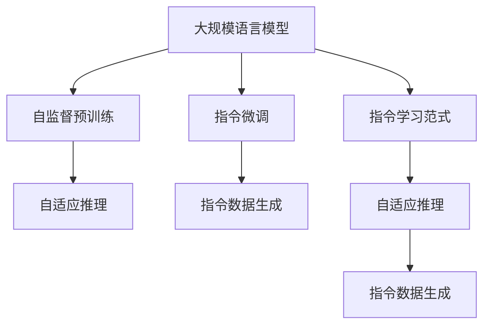
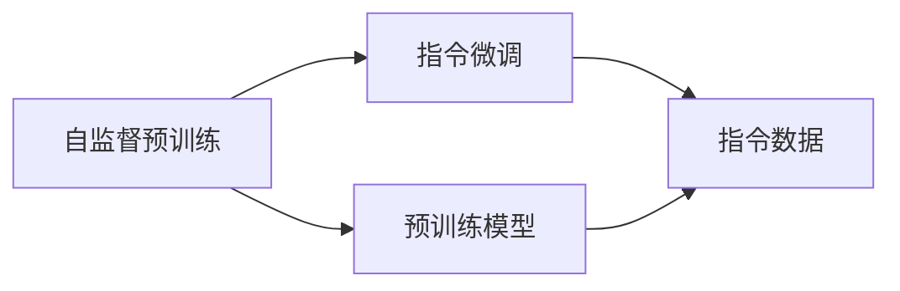
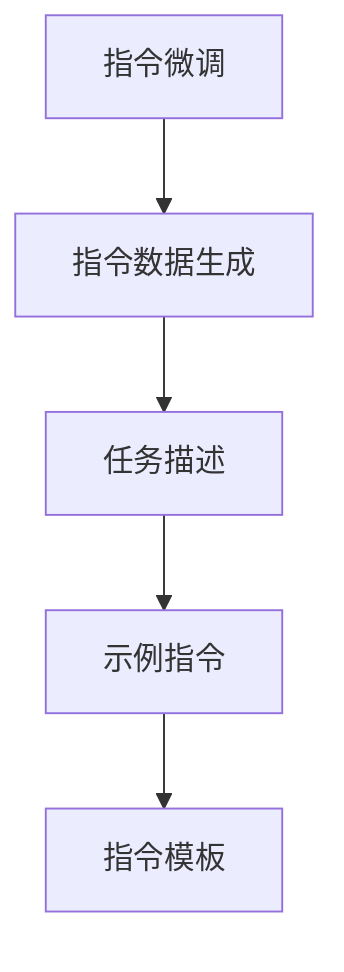
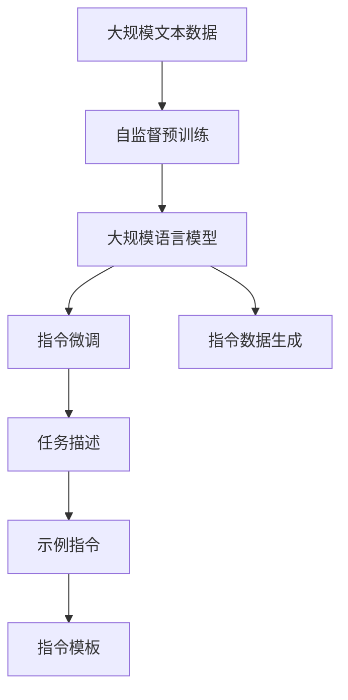

                 

# 大规模语言模型从理论到实践 指令数据的构建

> 关键词：大规模语言模型, 指令数据构建, 自监督学习, 指令微调, 自适应推理, 指令学习范式, 自监督预训练, 指令数据生成

## 1. 背景介绍

### 1.1 问题由来

近年来，自然语言处理(Natural Language Processing, NLP)领域取得了一系列突破性进展，尤其是大规模预训练语言模型（Large Language Models, LLMs）的问世，使得NLP技术在各种应用场景中表现出色。这些模型通过在大规模无标签文本数据上进行自监督预训练，学习到了丰富的语言知识，并具备了强大的语言理解和生成能力。

然而，这些通用模型在特定领域应用时，效果往往难以达到实际应用的要求。为了更好地适应特定任务，研究者们开始探索如何通过指令微调（Instruction Fine-tuning）的方式，在大规模语言模型上进行优化。指令微调是指在预训练模型的基础上，使用包含特定任务指导的指令数据进行微调，使得模型能够执行特定任务。

### 1.2 问题核心关键点

指令微调的核心在于如何构建和利用指令数据，使模型能够理解并执行各种任务。指令数据通常包含任务的详细描述和示例，用于指导模型推理和生成。构建高质量指令数据的方法和策略，以及如何通过指令微调提升模型性能，是当前研究的热点问题。

指令微调的关键在于：

1. 如何设计有效的指令数据，使其能够准确反映任务的本质，避免引导偏差。
2. 如何处理指令数据的多样性和噪声，确保模型能够在不同环境中表现稳定。
3. 如何在微调过程中避免模型过拟合，同时最大程度发挥预训练模型的泛化能力。
4. 如何评估和优化指令微调的效果，确保模型能够执行不同任务，且执行结果符合人类期望。

### 1.3 问题研究意义

指令微调在大规模语言模型中的应用，具有重要意义：

1. **提升模型性能**：通过指令微调，模型能够更准确地执行特定任务，取得更好的性能表现。
2. **加速模型应用**：指令微调使得通用模型能够快速适应特定领域的应用需求，大大缩短了模型开发周期。
3. **降低标注成本**：指令微调可以利用有限的指令数据进行微调，减少对标注数据的依赖。
4. **提高可解释性**：通过指令微调，模型能够执行更复杂的任务，其内部推理过程更易于解释和调试。
5. **促进跨领域应用**：指令微调使得模型能够跨领域执行多种任务，拓展了语言模型的应用范围。

## 2. 核心概念与联系

### 2.1 核心概念概述

为更好地理解指令微调及其与大规模语言模型的关系，本节将介绍几个密切相关的核心概念：

- **大规模语言模型(Large Language Models, LLMs)**：以自回归模型（如GPT系列）或自编码模型（如BERT）为代表的大规模预训练语言模型。这些模型通过在大规模无标签文本数据上进行自监督预训练，学习到了丰富的语言知识，并具备了强大的语言理解和生成能力。

- **自监督预训练(Self-Supervised Pre-training)**：通过在无标签数据上设计自监督任务（如语言模型预测、掩码语言模型预测等），使模型学习到语言的基础结构和模式。自监督预训练是大规模语言模型训练的常见方法。

- **指令微调(Instruction Fine-tuning)**：在预训练模型的基础上，使用包含特定任务指导的指令数据进行微调，使模型能够执行特定任务。指令微调是大规模语言模型应用的重要方法。

- **自适应推理(Adaptive Inference)**：基于指令微调，模型能够自适应地推理和生成，根据不同的指令执行相应的任务。

- **指令学习范式(Instruction Learning Paradigm)**：一种使用指令数据指导模型推理和生成的学习范式，通过微调模型参数，使其能够理解和执行多种自然语言指令。

- **指令数据生成(Instruction Data Generation)**：生成高质量的指令数据，用于指导模型的指令微调过程。

这些核心概念之间的逻辑关系可以通过以下Mermaid流程图来展示：



这个流程图展示了大规模语言模型的核心概念及其之间的关系：

1. 大规模语言模型通过自监督预训练获得基础能力。
2. 自适应推理使得模型能够根据不同的指令执行相应的任务。
3. 指令微调在预训练模型的基础上，使用指令数据进一步优化模型，使其能够执行特定任务。
4. 指令数据生成为模型提供高质量的指令样本，指导其指令微调过程。
5. 指令学习范式指导模型如何理解和执行指令。

这些概念共同构成了大规模语言模型微调的完整生态系统，使其能够在各种场景下发挥强大的语言理解和生成能力。通过理解这些核心概念，我们可以更好地把握大规模语言模型的学习原理和优化方向。

### 2.2 概念间的关系

这些核心概念之间存在着紧密的联系，形成了大规模语言模型微调的完整生态系统。下面我通过几个Mermaid流程图来展示这些概念之间的关系。

#### 2.2.1 大规模语言模型的学习范式


这个流程图展示了大规模语言模型的三种主要学习范式：自监督预训练、指令微调和自适应推理。自监督预训练主要采用自监督学习方法，而指令微调则是有监督学习的过程。自适应推理使得模型能够根据不同的指令执行相应的任务。

#### 2.2.2 指令微调与自监督预训练的关系



这个流程图展示了自监督预训练与指令微调之间的关系。自监督预训练主要采用自监督学习方法，使模型学习到语言的通用表示。指令微调在预训练模型的基础上，使用指令数据进一步优化模型，使其能够执行特定任务。

#### 2.2.3 指令数据生成的策略



这个流程图展示了指令数据生成的过程。指令数据生成主要包含任务描述、示例指令和指令模板等组成部分，用于指导模型的指令微调过程。

### 2.3 核心概念的整体架构

最后，我们用一个综合的流程图来展示这些核心概念在大规模语言模型微调过程中的整体架构：



这个综合流程图展示了从自监督预训练到大规模语言模型微调，再到指令数据生成的完整过程。大规模语言模型首先在大规模文本数据上进行自监督预训练，然后通过指令微调（包括指令数据生成）进一步优化模型，使其能够执行各种特定任务。最终，通过自适应推理，模型能够根据不同的指令执行相应的任务。 通过这些流程图，我们可以更清晰地理解大规模语言模型微调过程中各个核心概念的关系和作用，为后续深入讨论具体的微调方法和技术奠定基础。

## 3. 核心算法原理 & 具体操作步骤
### 3.1 算法原理概述

指令微调的本质是有监督的细粒度迁移学习过程。其核心思想是：将预训练的大规模语言模型视作一个强大的"推理器"，通过在包含特定任务指导的指令数据上进行微调，使得模型能够执行特定任务。

形式化地，假设预训练模型为 $M_{\theta}$，其中 $\theta$ 为预训练得到的模型参数。给定指令数据集 $D=\{(x_i,y_i)\}_{i=1}^N$，其中 $x_i$ 为指令描述，$y_i$ 为模型执行该指令后的输出，指令微调的目标是找到新的模型参数 $\hat{\theta}$，使得：

$$
\hat{\theta}=\mathop{\arg\min}_{\theta} \mathcal{L}(M_{\theta},D)
$$

其中 $\mathcal{L}$ 为针对任务 $T$ 设计的损失函数，用于衡量模型执行指令后的输出与真实标签之间的差异。常见的损失函数包括交叉熵损失、均方误差损失等。

通过梯度下降等优化算法，微调过程不断更新模型参数 $\theta$，最小化损失函数 $\mathcal{L}$，使得模型输出逼近真实标签。由于 $\theta$ 已经通过自监督预训练获得了较好的初始化，因此即便在小规模数据集 $D$ 上进行微调，也能较快收敛到理想的模型参数 $\hat{\theta}$。

### 3.2 算法步骤详解

指令微调一般包括以下几个关键步骤：

**Step 1: 准备预训练模型和指令数据**
- 选择合适的预训练语言模型 $M_{\theta}$ 作为初始化参数，如 BERT、GPT 等。
- 准备指令数据集 $D=\{(x_i,y_i)\}_{i=1}^N$，其中 $x_i$ 为指令描述，$y_i$ 为模型执行该指令后的输出。
- 对指令数据进行清洗、标准化和标注，去除噪声和错误数据。

**Step 2: 设计指令微调目标函数**
- 根据指令任务类型，设计合适的输出层和损失函数。
- 对于分类任务，通常在顶层添加线性分类器和交叉熵损失函数。
- 对于生成任务，通常使用语言模型的解码器输出概率分布，并以负对数似然为损失函数。

**Step 3: 设置微调超参数**
- 选择合适的优化算法及其参数，如 AdamW、SGD 等，设置学习率、批大小、迭代轮数等。
- 设置正则化技术及强度，包括权重衰减、Dropout、Early Stopping 等。
- 确定冻结预训练参数的策略，如仅微调顶层，或全部参数都参与微调。

**Step 4: 执行梯度训练**
- 将指令数据分批次输入模型，前向传播计算损失函数。
- 反向传播计算参数梯度，根据设定的优化算法和学习率更新模型参数。
- 周期性在验证集上评估模型性能，根据性能指标决定是否触发 Early Stopping。
- 重复上述步骤直到满足预设的迭代轮数或 Early Stopping 条件。

**Step 5: 测试和部署**
- 在测试集上评估微调后模型 $M_{\hat{\theta}}$ 的性能，对比微调前后的效果提升。
- 使用微调后的模型对新指令进行推理预测，集成到实际的应用系统中。
- 持续收集新的指令，定期重新微调模型，以适应新的指令需求。

以上是指令微调的一般流程。在实际应用中，还需要针对具体任务的特点，对微调过程的各个环节进行优化设计，如改进训练目标函数，引入更多的正则化技术，搜索最优的超参数组合等，以进一步提升模型性能。

### 3.3 算法优缺点

指令微调方法具有以下优点：

1. 简单高效。只需准备少量指令数据，即可对预训练模型进行快速适配，获得较大的性能提升。
2. 通用适用。适用于各种NLP下游任务，包括分类、匹配、生成等，设计简单的指令适配层即可实现微调。
3. 参数高效。利用参数高效微调技术，在固定大部分预训练参数的情况下，仍可取得不错的微调效果。
4. 效果显著。在学术界和工业界的诸多任务上，基于指令微调的方法已经刷新了最先进的性能指标。

同时，该方法也存在一定的局限性：

1. 依赖指令数据。指令微调的效果很大程度上取决于指令数据的质量和数量，获取高质量指令数据的成本较高。
2. 迁移能力有限。当目标任务与预训练指令的分布差异较大时，指令微调的性能提升有限。
3. 负面效果传递。预训练模型的固有偏见、有害信息等，可能通过指令微调传递到下游任务，造成负面影响。
4. 可解释性不足。指令微调模型的决策过程通常缺乏可解释性，难以对其推理逻辑进行分析和调试。

尽管存在这些局限性，但就目前而言，指令微调方法仍是大规模语言模型应用的最主流范式。未来相关研究的重点在于如何进一步降低指令数据对预训练模型的依赖，提高模型的少样本学习和跨领域迁移能力，同时兼顾可解释性和伦理安全性等因素。

### 3.4 算法应用领域

指令微调在大规模语言模型中的应用，在NLP领域已经得到了广泛的应用，覆盖了几乎所有常见任务，例如：

- 文本分类：如情感分析、主题分类、意图识别等。通过微调使模型学习指令-标签映射。
- 命名实体识别：识别文本中的人名、地名、机构名等特定实体。通过微调使模型掌握指令-实体边界映射。
- 关系抽取：从文本中抽取实体之间的语义关系。通过微调使模型学习指令-关系三元组。
- 问答系统：对自然语言问题给出答案。将问题-答案对作为指令，微调模型学习匹配答案。
- 机器翻译：将源语言文本翻译成目标语言。通过微调使模型学习指令-语言映射。
- 文本摘要：将长文本压缩成简短摘要。通过微调使模型学习抓取要点。
- 对话系统：使机器能够与人自然对话。将多轮对话历史作为上下文，微调模型进行回复生成。

除了上述这些经典任务外，指令微调也被创新性地应用到更多场景中，如可控文本生成、常识推理、代码生成、数据增强等，为NLP技术带来了全新的突破。随着预训练模型和指令微调方法的不断进步，相信NLP技术将在更广阔的应用领域大放异彩。

## 4. 数学模型和公式 & 详细讲解 & 举例说明

### 4.1 数学模型构建

本节将使用数学语言对指令微调过程进行更加严格的刻画。

记预训练语言模型为 $M_{\theta}$，其中 $\theta$ 为预训练得到的模型参数。假设指令微调任务为 $T$，指令数据集为 $D=\{(x_i,y_i)\}_{i=1}^N$，其中 $x_i$ 为指令描述，$y_i$ 为模型执行该指令后的输出。

定义模型 $M_{\theta}$ 在指令数据样本 $(x,y)$ 上的损失函数为 $\ell(M_{\theta}(x),y)$，则在指令数据集 $D$ 上的经验风险为：

$$
\mathcal{L}(\theta) = \frac{1}{N} \sum_{i=1}^N \ell(M_{\theta}(x_i),y_i)
$$

指令微调的优化目标是最小化经验风险，即找到最优参数：

$$
\theta^* = \mathop{\arg\min}_{\theta} \mathcal{L}(\theta)
$$

在实践中，我们通常使用基于梯度的优化算法（如AdamW、SGD等）来近似求解上述最优化问题。设 $\eta$ 为学习率，$\lambda$ 为正则化系数，则参数的更新公式为：

$$
\theta \leftarrow \theta - \eta \nabla_{\theta}\mathcal{L}(\theta) - \eta\lambda\theta
$$

其中 $\nabla_{\theta}\mathcal{L}(\theta)$ 为损失函数对参数 $\theta$ 的梯度，可通过反向传播算法高效计算。

### 4.2 公式推导过程

以下我们以二分类任务为例，推导交叉熵损失函数及其梯度的计算公式。

假设模型 $M_{\theta}$ 在指令 $x$ 上的输出为 $\hat{y}=M_{\theta}(x) \in [0,1]$，表示模型执行指令后预测为正类的概率。真实标签 $y \in \{0,1\}$。则二分类交叉熵损失函数定义为：

$$
\ell(M_{\theta}(x),y) = -[y\log \hat{y} + (1-y)\log (1-\hat{y})]
$$

将其代入经验风险公式，得：

$$
\mathcal{L}(\theta) = -\frac{1}{N}\sum_{i=1}^N [y_i\log M_{\theta}(x_i)+(1-y_i)\log(1-M_{\theta}(x_i))]
$$

根据链式法则，损失函数对参数 $\theta_k$ 的梯度为：

$$
\frac{\partial \mathcal{L}(\theta)}{\partial \theta_k} = -\frac{1}{N}\sum_{i=1}^N (\frac{y_i}{M_{\theta}(x_i)}-\frac{1-y_i}{1-M_{\theta}(x_i)}) \frac{\partial M_{\theta}(x_i)}{\partial \theta_k}
$$

其中 $\frac{\partial M_{\theta}(x_i)}{\partial \theta_k}$ 可进一步递归展开，利用自动微分技术完成计算。

在得到损失函数的梯度后，即可带入参数更新公式，完成模型的迭代优化。重复上述过程直至收敛，最终得到适应指令任务的最优模型参数 $\theta^*$。

### 4.3 案例分析与讲解

假设我们要训练一个模型，使其能够识别中文文本中的命名实体（如人名、地名、机构名等）。我们可以设计一个简单的指令模板，例如：

```
识别文本中的命名实体
输入：<文本>
输出：<命名实体列表>
```

然后，收集包含大量命名实体标注的中文文本数据，并使用指令模板进行标记。例如：

```
识别文本中的命名实体
输入：中国人民银行是中国的中央银行。
输出：[中国人民, 中国]
```

接下来，对数据进行清洗和标准化，去除噪声和错误数据。然后，将指令数据输入模型进行指令微调。具体步骤如下：

**Step 1: 准备预训练模型和指令数据**

- 使用BERT作为预训练模型。
- 准备包含命名实体标注的中文文本数据，划分为训练集、验证集和测试集。

**Step 2: 设计指令微调目标函数**

- 设计输出层为线性分类器，分类标签为人名、地名、机构名等。
- 设计损失函数为交叉熵损失。

**Step 3: 设置微调超参数**

- 选择AdamW优化器，设置学习率为1e-5。
- 设置权重衰减系数为0.001。

**Step 4: 执行梯度训练**

- 将指令数据分批次输入模型，前向传播计算损失函数。
- 反向传播计算参数梯度，根据AdamW算法更新模型参数。
- 周期性在验证集上评估模型性能，根据性能指标决定是否触发Early Stopping。

**Step 5: 测试和部署**

- 在测试集上评估微调后模型 $M_{\hat{\theta}}$ 的性能，对比微调前后的效果提升。
- 使用微调后的模型对新文本进行推理预测，输出命名实体列表。

在实际应用中，我们还可以使用更大更强的预训练模型，引入更多的正则化技术，如Dropout、L2正则等，以进一步提升模型性能。

## 5. 项目实践：代码实例和详细解释说明

### 5.1 开发环境搭建

在进行指令微调实践前，我们需要准备好开发环境。以下是使用Python进行PyTorch开发的环境配置流程：

1. 安装Anaconda：从官网下载并安装Anaconda，用于创建独立的Python环境。

2. 创建并激活虚拟环境：
```bash
conda create -n pytorch-env python=3.8 
conda activate pytorch-env
```

3. 安装PyTorch：根据CUDA版本，从官网获取对应的安装命令。例如：
```bash
conda install pytorch torchvision torchaudio cudatoolkit=11.1 -c pytorch -c conda-forge
```

4. 安装Transformers库：
```bash
pip install transformers
```

5. 安装各类工具包：
```bash
pip install numpy pandas scikit-learn matplotlib tqdm jupyter notebook ipython
```

完成上述步骤后，即可在`pytorch-env`环境中开始指令微调实践。

### 5.2 源代码详细实现

下面我们以命名实体识别(NER)任务为例，给出使用Transformers库对BERT模型进行指令微调的PyTorch代码实现。

首先，定义NER任务的数据处理函数：

```python
from transformers import BertTokenizer
from torch.utils.data import Dataset
import torch

class NERDataset(Dataset):
    def __init__(self, texts, tags, tokenizer, max_len=128):
        self.texts = texts
        self.tags = tags
        self.tokenizer = tokenizer
        self.max_len = max_len
        
    def __len__(self):
        return len(self.texts)
    
    def __getitem__(self, item):
        text = self.texts[item]
        tags = self.tags[item]
        
        encoding = self.tokenizer(text, return_tensors='pt', max_length=self.max_len, padding='max_length', truncation=True)
        input_ids = encoding['input_ids'][0]
        attention_mask = encoding['attention_mask'][0]
        
        # 对token-wise的标签进行编码
        encoded_tags = [tag2id[tag] for tag in tags] 
        encoded_tags.extend([tag2id['O']] * (self.max_len - len(encoded_tags)))
        labels = torch.tensor(encoded_tags, dtype=torch.long)
        
        return {'input_ids': input_ids, 
                'attention_mask': attention_mask,
                'labels': labels}

# 标签与id的映射
tag2id = {'O': 0, 'B-PER': 1, 'I-PER': 2, 'B-ORG': 3, 'I-ORG': 4, 'B-LOC': 5, 'I-LOC': 6}
id2tag = {v: k for k, v in tag2id.items()}

# 创建dataset
tokenizer = BertTokenizer.from_pretrained('bert-base-cased')

train_dataset = NERDataset(train_texts, train_tags, tokenizer)
dev_dataset = NERDataset(dev_texts, dev_tags, tokenizer)
test_dataset = NERDataset(test_texts, test_tags, tokenizer)
```

然后，定义模型和优化器：

```python
from transformers import BertForTokenClassification, AdamW

model = BertForTokenClassification.from_pretrained('bert-base-cased', num_labels=len(tag2id))

optimizer = AdamW(model.parameters(), lr=2e-5)
```

接着，定义训练和评估函数：

```python
from torch.utils.data import DataLoader
from tqdm import tqdm
from sklearn.metrics import classification_report

device = torch.device('cuda') if torch.cuda.is_available() else torch.device('cpu')
model.to(device)

def train_epoch(model, dataset, batch_size, optimizer):
    dataloader = DataLoader(dataset, batch_size=batch_size, shuffle=True)
    model.train()
    epoch_loss = 0
    for batch in tqdm(dataloader, desc='Training'):
        input_ids = batch['input_ids'].to(device)
        attention_mask = batch['attention_mask'].to(device)
        labels = batch['labels'].to(device)
        model.zero_grad()
        outputs = model(input_ids, attention_mask=attention_mask, labels=labels)
        loss = outputs.loss
        epoch_loss += loss.item()
        loss.backward()
        optimizer.step()
    return epoch_loss / len(dataloader)

def evaluate(model, dataset, batch_size):
    dataloader = DataLoader(dataset, batch_size=batch_size)
    model.eval()
    preds, labels = [], []
    with torch.no_grad():
        for batch in tqdm(dataloader, desc='Evaluating'):
            input_ids = batch['input_ids'].to(device)
            attention_mask = batch['attention_mask'].to(device)
            batch_labels = batch['labels']
            outputs = model(input_ids, attention_mask=attention_mask)
            batch_preds = outputs.logits.argmax(dim=2).to('cpu').tolist()
            batch_labels = batch_labels.to('cpu').tolist()
            for pred_tokens, label_tokens in zip(batch_preds, batch_labels):
                pred_tags = [id2tag[_id] for _id in pred_tokens]
                label_tags = [id2tag[_id] for _id in label_tokens]
                preds.append(pred_tags[:len(label_tags)])
                labels.append(label_tags)
                
    print(classification_report(labels, preds))
```

最后，启动训练流程并在测试集上评估：

```python
epochs = 5
batch_size = 16

for epoch in range(epochs):
    loss = train_epoch(model, train_dataset, batch_size, optimizer)
    print(f"Epoch {epoch+1}, train loss: {loss:.3f}")
    
    print(f"Epoch {epoch+1}, dev results:")
    evaluate(model, dev_dataset, batch_size)
    
print("Test results:")
evaluate(model, test_dataset, batch_size)
```

以上就是使用PyTorch对BERT进行命名实体识别任务指令微调的完整代码实现。可以看到，得益于

