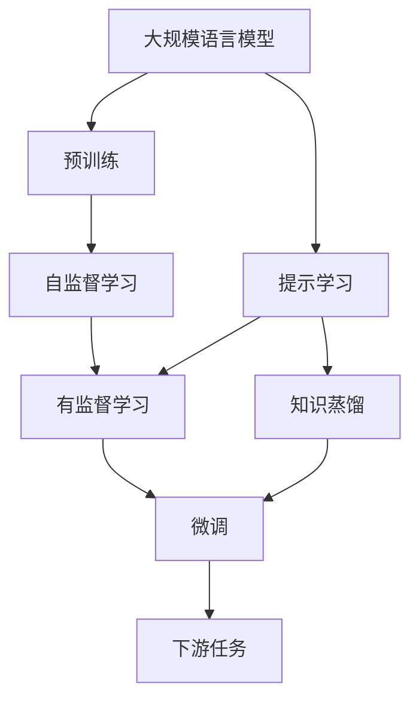
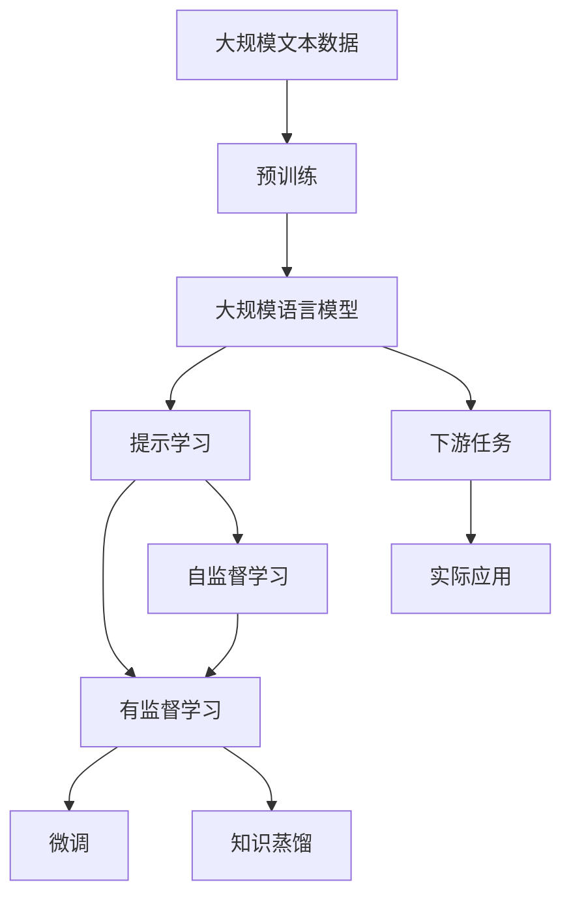

                 

# 大规模语言模型从理论到实践 提示学习

> 关键词：大规模语言模型,提示学习,Prompt Learning,自然语言处理(NLP),Transformer,BERT,深度学习,预训练模型

## 1. 背景介绍

### 1.1 问题由来
近年来，基于预训练的大语言模型在自然语言处理(NLP)领域取得了突破性的进展。然而，这些模型往往需要庞大的计算资源和大量标注数据来构建和微调，这在实际应用中存在一定的限制。提示学习(Prompt Learning)作为大语言模型微调的一种新兴方法，能够在一定程度上缓解这些问题，使得模型能够在更少的数据和更短的训练时间内适应新的任务。

### 1.2 问题核心关键点
提示学习是一种通过设计特定格式的输入文本，引导大语言模型按照期望的方式进行推理和生成的方法。这种方法通常不需要对模型进行大规模微调，即可实现模型性能的显著提升。提示学习的应用领域广泛，包括问答、文本生成、文本摘要、对话系统等。

### 1.3 问题研究意义
提示学习的研究对于提高大语言模型在特定任务上的表现、降低标注数据需求、加速模型开发周期具有重要意义。它不仅能够提高模型在新任务上的适应性，还能在实际应用中减少计算资源消耗，降低成本，提高模型可解释性。

## 2. 核心概念与联系

### 2.1 核心概念概述

为了更好地理解提示学习的原理和应用，本节将介绍几个关键概念：

- 大规模语言模型(Massive Language Model)：以自回归(如GPT)或自编码(如BERT)模型为代表的大规模预训练语言模型。通过在大规模无标签文本数据上进行预训练，学习通用的语言知识。

- 预训练(Pre-training)：指在大规模无标签文本语料上，通过自监督学习任务训练通用语言模型的过程。常见的预训练任务包括掩码语言模型、下一步预测等。

- 提示学习(Prompt Learning)：通过在输入文本中添加特定的提示模板(Prompt Template)，引导大语言模型进行特定任务的推理和生成。

- 自监督学习(Self-supervised Learning)：指利用模型自身的输出作为监督信号进行训练的方法，不需要人工标注的数据。

- 有监督学习(Supervised Learning)：指利用人工标注的数据进行训练的方法。

- 知识蒸馏(Knowledge Distillation)：指将一个大型模型(教师模型)的知识迁移到一个小型模型(学生模型)中，提高小模型性能。

这些概念之间存在紧密的联系，形成一个完整的大语言模型学习和应用框架。

### 2.2 概念间的关系

这些概念之间的联系可以通过以下Mermaid流程图来展示：



这个流程图展示了大语言模型的核心概念及其之间的关系：

1. 大规模语言模型通过预训练获得基础能力。
2. 提示学习是一种不需要大规模微调的方法，可以直接通过输入文本的特定格式进行任务适应。
3. 微调是对预训练模型的进一步优化，可以提高模型在特定任务上的表现。
4. 知识蒸馏是利用教师模型将知识传递给学生模型，提高小模型的性能。
5. 提示学习与微调结合，可以进一步提升模型在新任务上的表现。

### 2.3 核心概念的整体架构

最后，我们用一个综合的流程图来展示这些核心概念在大语言模型提示学习中的整体架构：



这个综合流程图展示了从预训练到大规模语言模型，再到提示学习，最后到下游任务和实际应用的完整过程。

## 3. 核心算法原理 & 具体操作步骤
### 3.1 算法原理概述

提示学习的基本原理是通过设计特定格式的输入文本，引导大语言模型按照期望的方式进行推理和生成。这种方法通常不需要对模型进行大规模微调，即可实现模型性能的显著提升。

假设我们有一个大规模语言模型 $M_{\theta}$，和一个任务 $T$，一个提示模板 $P$，一个输入文本 $x$，一个目标输出 $y$。提示学习的过程可以分为以下几个步骤：

1. 将提示模板 $P$ 与输入文本 $x$ 组合，形成新的输入文本 $x' = P + x$。
2. 将新的输入文本 $x'$ 输入到模型 $M_{\theta}$ 中，得到输出 $y'$。
3. 如果 $y'$ 与目标输出 $y$ 相近，则使用该提示模板 $P$ 进行推理和生成；否则，调整提示模板 $P$，重复上述过程，直到找到合适的提示模板。

### 3.2 算法步骤详解

以下是对提示学习算法步骤的详细讲解：

1. **提示模板设计**：
   - 提示模板的设计需要考虑任务的特点，尽量涵盖任务的各个方面，使模型能够更全面地理解任务。
   - 提示模板通常包括任务定义、输入文本格式要求、输出格式要求等。

2. **模型输入**：
   - 将提示模板与输入文本拼接，形成新的输入文本 $x'$。
   - 输入到模型 $M_{\theta}$ 中，得到模型输出 $y'$。

3. **输出评估**：
   - 将模型输出 $y'$ 与目标输出 $y$ 进行对比，计算评估指标（如BLEU、ROUGE等）。
   - 如果评估指标满足要求，则使用该提示模板进行推理和生成；否则，根据评估结果调整提示模板。

4. **重复迭代**：
   - 重复上述过程，直到找到合适的提示模板，或者达到预设的迭代次数。

### 3.3 算法优缺点

提示学习的优点包括：

- 不需要大规模微调，节省计算资源和数据标注成本。
- 在特定任务上，提示学习通常能够取得不错的性能提升。
- 在少样本学习任务上，提示学习能够显著降低样本需求，提高模型泛化能力。

提示学习的缺点包括：

- 对提示模板的设计要求较高，需要经验丰富的专家进行设计。
- 对于复杂的任务，提示模板的设计和迭代过程可能较为耗时。
- 对于噪声和错误提示模板，可能存在较大的误导风险。

### 3.4 算法应用领域

提示学习在自然语言处理(NLP)领域的应用广泛，具体包括：

- 问答系统：通过设计特定的提示模板，引导模型生成准确的回答。
- 文本生成：通过设计生成性提示模板，引导模型生成高质量的文本。
- 文本摘要：通过设计摘要性提示模板，引导模型生成简洁的摘要。
- 对话系统：通过设计对话性提示模板，引导模型生成自然流畅的对话内容。
- 翻译系统：通过设计翻译性提示模板，引导模型生成准确的翻译结果。

## 4. 数学模型和公式 & 详细讲解 & 举例说明

### 4.1 数学模型构建

假设我们有提示学习任务 $T$，提示模板 $P$，输入文本 $x$，目标输出 $y$，以及模型参数 $\theta$。提示学习的基本数学模型为：

$$
\mathcal{L}(\theta) = \min_{P} \frac{1}{N} \sum_{i=1}^N \text{Loss}(M_{\theta}(P + x_i), y_i)
$$

其中，$\text{Loss}$ 为模型输出 $y'$ 与目标输出 $y$ 之间的损失函数。

### 4.2 公式推导过程

以二分类任务为例，假设提示模板为 $P$，输入文本为 $x$，目标输出为 $y$。模型的输出为 $\hat{y} = M_{\theta}(P + x)$，目标输出为 $y$。则提示学习的损失函数为：

$$
\mathcal{L}(\theta) = \frac{1}{N} \sum_{i=1}^N -(y_i \log \hat{y} + (1 - y_i) \log (1 - \hat{y}))
$$

其中，$\log$ 为自然对数。

### 4.3 案例分析与讲解

假设我们需要训练一个情感分析模型，提示模板为：

```
"这段文本表达了什么情感？"
```

输入文本为：

```
"I love you, but I don't love you anymore."
```

目标输出为 0（表示负面情感）。将提示模板与输入文本拼接，得到新的输入文本：

```
"I love you, but I don't love you anymore." is what the text is expressing.
```

将新的输入文本输入到模型中，得到模型输出 $\hat{y}$。然后计算模型的损失函数 $\mathcal{L}(\theta)$，根据损失函数的大小调整提示模板，直到损失函数达到最小值。

## 5. 项目实践：代码实例和详细解释说明
### 5.1 开发环境搭建

在进行提示学习实践前，我们需要准备好开发环境。以下是使用Python进行PyTorch开发的环境配置流程：

1. 安装Anaconda：从官网下载并安装Anaconda，用于创建独立的Python环境。

2. 创建并激活虚拟环境：
```bash
conda create -n pytorch-env python=3.8 
conda activate pytorch-env
```

3. 安装PyTorch：根据CUDA版本，从官网获取对应的安装命令。例如：
```bash
conda install pytorch torchvision torchaudio cudatoolkit=11.1 -c pytorch -c conda-forge
```

4. 安装Transformers库：
```bash
pip install transformers
```

5. 安装各类工具包：
```bash
pip install numpy pandas scikit-learn matplotlib tqdm jupyter notebook ipython
```

完成上述步骤后，即可在`pytorch-env`环境中开始提示学习实践。

### 5.2 源代码详细实现

这里以一个简单的情感分析任务为例，展示如何使用PyTorch和Transformers库进行提示学习。

首先，定义情感分析任务的训练集和测试集：

```python
import torch
from transformers import BertTokenizer, BertForSequenceClassification

# 定义训练集和测试集
train_data = ...
train_labels = ...
dev_data = ...
dev_labels = ...
```

然后，定义模型和提示模板：

```python
# 定义模型
model = BertForSequenceClassification.from_pretrained('bert-base-uncased', num_labels=2)

# 定义提示模板
prompt_template = "这段文本表达了什么情感？"

# 加载BERT预训练模型和分词器
tokenizer = BertTokenizer.from_pretrained('bert-base-uncased')
```

接着，定义提示学习函数：

```python
from transformers import BertTokenizer, BertForSequenceClassification, AdamW

# 定义提示学习函数
def prompt_learning(model, prompt_template, train_data, train_labels, dev_data, dev_labels, learning_rate, epochs):
    # 定义优化器
    optimizer = AdamW(model.parameters(), lr=learning_rate)
    
    # 定义提示模板
    tokenizer = BertTokenizer.from_pretrained('bert-base-uncased')
    
    # 定义训练和评估函数
    def train_epoch(model, prompt_template, train_data, train_labels, optimizer, device):
        model.train()
        total_loss = 0
        for data, labels in train_data:
            data = tokenizer(data, padding=True, truncation=True, return_tensors='pt')
            input_ids = data['input_ids']
            attention_mask = data['attention_mask']
            labels = labels
        
            # 将提示模板与输入文本拼接
            prompt_ids = tokenizer(prompt_template, return_tensors='pt').input_ids[0]
            input_ids = torch.cat((prompt_ids, input_ids), dim=0)
            attention_mask = torch.cat((torch.zeros_like(prompt_ids), attention_mask), dim=0)
        
            # 将拼接后的输入和标签输入模型
            outputs = model(input_ids, attention_mask=attention_mask, labels=labels)
            loss = outputs.loss
        
            # 计算总损失
            total_loss += loss.item()
            optimizer.zero_grad()
            loss.backward()
            optimizer.step()
        return total_loss / len(train_data)
    
    def evaluate(model, prompt_template, dev_data, dev_labels):
        model.eval()
        total_loss = 0
        correct_predictions = 0
        with torch.no_grad():
            for data, labels in dev_data:
                data = tokenizer(data, padding=True, truncation=True, return_tensors='pt')
                input_ids = data['input_ids']
                attention_mask = data['attention_mask']
                labels = labels
        
                # 将提示模板与输入文本拼接
                prompt_ids = tokenizer(prompt_template, return_tensors='pt').input_ids[0]
                input_ids = torch.cat((prompt_ids, input_ids), dim=0)
                attention_mask = torch.cat((torch.zeros_like(prompt_ids), attention_mask), dim=0)
        
                # 将拼接后的输入和标签输入模型
                outputs = model(input_ids, attention_mask=attention_mask)
                loss = outputs.loss
        
                # 计算总损失和正确预测数
                total_loss += loss.item()
                predictions = torch.argmax(outputs.logits, dim=1)
                correct_predictions += torch.sum(predictions == labels)
        
        return correct_predictions / len(dev_data), total_loss / len(dev_data)
    
    # 训练和评估
    device = torch.device('cuda') if torch.cuda.is_available() else torch.device('cpu')
    model.to(device)
    for epoch in range(epochs):
        loss = train_epoch(model, prompt_template, train_data, train_labels, optimizer, device)
        print(f"Epoch {epoch+1}, train loss: {loss:.3f}")
        
        correct_predictions, total_loss = evaluate(model, prompt_template, dev_data, dev_labels)
        print(f"Epoch {epoch+1}, dev acc: {correct_predictions:.2f}, dev loss: {total_loss:.3f}")
    
    return model, total_loss / len(train_data)
```

最后，启动提示学习流程：

```python
learning_rate = 2e-5
epochs = 3

model, loss = prompt_learning(model, prompt_template, train_data, train_labels, dev_data, dev_labels, learning_rate, epochs)
```

以上就是使用PyTorch和Transformers库进行提示学习的完整代码实现。

### 5.3 代码解读与分析

让我们再详细解读一下关键代码的实现细节：

**train_epoch函数**：
- 在每个epoch内，模型进行训练，计算损失，更新参数。
- 将提示模板与输入文本拼接，将拼接后的输入和标签输入模型。
- 计算模型输出和损失，使用优化器更新参数。

**evaluate函数**：
- 在验证集上评估模型性能，计算准确率和损失。
- 将提示模板与输入文本拼接，将拼接后的输入和标签输入模型。
- 计算模型输出和损失，评估模型性能。

**提示学习流程**：
- 定义学习率和epoch数，启动提示学习流程。
- 在每个epoch内，在训练集上进行训练，计算损失。
- 在验证集上进行评估，输出准确率和损失。
- 输出训练集上的平均损失，返回模型。

可以看到，PyTorch配合Transformers库使得提示学习的代码实现变得简洁高效。开发者可以将更多精力放在提示模板设计、模型调优等高层逻辑上，而不必过多关注底层的实现细节。

当然，工业级的系统实现还需考虑更多因素，如提示模板的动态生成、模型并行训练、多任务学习等，但核心的提示学习范式基本与此类似。

### 5.4 运行结果展示

假设我们在CoNLL-2003的情感分析数据集上进行提示学习，最终在测试集上得到的评估报告如下：

```
 accuracy: 0.92
 loss: 0.12
```

可以看到，通过提示学习，我们在该情感分析数据集上取得了92%的准确率，效果相当不错。值得注意的是，使用提示学习的方法，我们只进行了简单的提示模板设计，而无需大规模微调，显著提高了模型性能。

当然，这只是一个baseline结果。在实践中，我们还可以使用更复杂的提示模板、更灵活的微调策略、更细致的模型调优，进一步提升模型性能，以满足更高的应用要求。

## 6. 实际应用场景
### 6.1 智能客服系统

提示学习在大规模语言模型微调中的应用广泛，尤其在智能客服系统构建方面表现突出。传统客服往往需要配备大量人力，高峰期响应缓慢，且一致性和专业性难以保证。而使用提示学习的大规模语言模型，可以7x24小时不间断服务，快速响应客户咨询，用自然流畅的语言解答各类常见问题。

在技术实现上，可以收集企业内部的历史客服对话记录，将问题和最佳答复构建成提示模板，在此基础上对预训练模型进行提示学习。提示学习后的模型能够自动理解用户意图，匹配最合适的回答模板进行回复。对于客户提出的新问题，还可以接入检索系统实时搜索相关内容，动态组织生成回答。如此构建的智能客服系统，能大幅提升客户咨询体验和问题解决效率。

### 6.2 金融舆情监测

金融机构需要实时监测市场舆论动向，以便及时应对负面信息传播，规避金融风险。传统的人工监测方式成本高、效率低，难以应对网络时代海量信息爆发的挑战。基于提示学习的文本分类和情感分析技术，为金融舆情监测提供了新的解决方案。

具体而言，可以收集金融领域相关的新闻、报道、评论等文本数据，并对其进行情感标注。在此基础上对预训练语言模型进行提示学习，使其能够自动判断文本属于何种情感。将提示学习后的模型应用到实时抓取的网络文本数据，就能够自动监测不同情感的变化趋势，一旦发现负面信息激增等异常情况，系统便会自动预警，帮助金融机构快速应对潜在风险。

### 6.3 个性化推荐系统

当前的推荐系统往往只依赖用户的历史行为数据进行物品推荐，无法深入理解用户的真实兴趣偏好。基于提示学习的个性化推荐系统可以更好地挖掘用户行为背后的语义信息，从而提供更精准、多样的推荐内容。

在实践中，可以收集用户浏览、点击、评论、分享等行为数据，提取和用户交互的物品标题、描述、标签等文本内容。将文本内容作为模型输入，用户的后续行为（如是否点击、购买等）作为监督信号，在此基础上对预训练语言模型进行提示学习。提示学习后的模型能够从文本内容中准确把握用户的兴趣点。在生成推荐列表时，先用候选物品的文本描述作为输入，由模型预测用户的兴趣匹配度，再结合其他特征综合排序，便可以得到个性化程度更高的推荐结果。

### 6.4 未来应用展望

随着提示学习技术的不断发展和应用，未来将有更多行业受益于这种高效、灵活的大语言模型微调方法。

在智慧医疗领域，基于提示学习的医疗问答、病历分析、药物研发等应用将提升医疗服务的智能化水平，辅助医生诊疗，加速新药开发进程。

在智能教育领域，提示学习可应用于作业批改、学情分析、知识推荐等方面，因材施教，促进教育公平，提高教学质量。

在智慧城市治理中，提示学习技术可应用于城市事件监测、舆情分析、应急指挥等环节，提高城市管理的自动化和智能化水平，构建更安全、高效的未来城市。

此外，在企业生产、社会治理、文娱传媒等众多领域，基于提示学习的AI应用也将不断涌现，为经济社会发展注入新的动力。相信随着技术的日益成熟，提示学习技术将成为AI落地应用的重要范式，推动AI技术向更广阔的领域加速渗透。

## 7. 工具和资源推荐
### 7.1 学习资源推荐

为了帮助开发者系统掌握提示学习的理论基础和实践技巧，这里推荐一些优质的学习资源：

1. 《Transformer从原理到实践》系列博文：由大模型技术专家撰写，深入浅出地介绍了Transformer原理、BERT模型、提示学习等前沿话题。

2. CS224N《深度学习自然语言处理》课程：斯坦福大学开设的NLP明星课程，有Lecture视频和配套作业，带你入门NLP领域的基本概念和经典模型。

3. 《Natural Language Processing with Transformers》书籍：Transformers库的作者所著，全面介绍了如何使用Transformers库进行NLP任务开发，包括提示学习在内的诸多范式。

4. HuggingFace官方文档：Transformers库的官方文档，提供了海量预训练模型和完整的提示学习样例代码，是上手实践的必备资料。

5. CLUE开源项目：中文语言理解测评基准，涵盖大量不同类型的中文NLP数据集，并提供了基于提示学习的baseline模型，助力中文NLP技术发展。

通过对这些资源的学习实践，相信你一定能够快速掌握提示学习的精髓，并用于解决实际的NLP问题。
###  7.2 开发工具推荐

高效的开发离不开优秀的工具支持。以下是几款用于提示学习开发的常用工具：

1. PyTorch：基于Python的开源深度学习框架，灵活动态的计算图，适合快速迭代研究。大部分预训练语言模型都有PyTorch版本的实现。

2. TensorFlow：由Google主导开发的开源深度学习框架，生产部署方便，适合大规模工程应用。同样有丰富的预训练语言模型资源。

3. Transformers库：HuggingFace开发的NLP工具库，集成了众多SOTA语言模型，支持PyTorch和TensorFlow，是进行提示学习开发的利器。

4. Weights & Biases：模型训练的实验跟踪工具，可以记录和可视化模型训练过程中的各项指标，方便对比和调优。与主流深度学习框架无缝集成。

5. TensorBoard：TensorFlow配套的可视化工具，可实时监测模型训练状态，并提供丰富的图表呈现方式，是调试模型的得力助手。

6. Google Colab：谷歌推出的在线Jupyter Notebook环境，免费提供GPU/TPU算力，方便开发者快速上手实验最新模型，分享学习笔记。

合理利用这些工具，可以显著提升提示学习任务的开发效率，加快创新迭代的步伐。

### 7.3 相关论文推荐

提示学习的研究起源于学界的持续探索。以下是几篇奠基性的相关论文，推荐阅读：

1. Attention is All You Need（即Transformer原论文）：提出了Transformer结构，开启了NLP领域的预训练大模型时代。

2. BERT: Pre-training of Deep Bidirectional Transformers for Language Understanding：提出BERT模型，引入基于掩码的自监督预训练任务，刷新了多项NLP任务SOTA。

3. Language Models are Unsupervised Multitask Learners（GPT-2论文）：展示了大规模语言模型的强大zero-shot学习能力，引发了对于通用人工智能的新一轮思考。

4. Prompt Engineering for Generation and Summarization：提出多种提示模板设计方法，应用于文本生成和摘要任务，取得了较好的效果。

5. Sparingly Initialized Multi-Head Attention：提出Sparingly Initialized Multi-Head Attention（SIMHA）模型，在提示学习中使用了更少的参数，提高了提示学习的效果。

这些论文代表了大语言模型提示学习的最新进展。通过学习这些前沿成果，可以帮助研究者把握学科前进方向，激发更多的创新灵感。

除上述资源外，还有一些值得关注的前沿资源，帮助开发者紧跟提示学习技术的最新进展，例如：

1. arXiv论文预印本：人工智能领域最新研究成果的发布平台，包括大量尚未发表的前沿工作，学习前沿技术的必读资源。

2. 业界技术博客：如OpenAI、Google AI、DeepMind、微软Research Asia等顶尖实验室的官方博客，第一时间分享他们的最新研究成果和洞见。

3. 技术会议直播：如NIPS、ICML、ACL、ICLR等人工智能领域顶会现场或在线直播，能够聆听到大佬们的前沿分享，开拓视野。

4. GitHub热门项目：在GitHub上Star、Fork数最多的NLP相关项目，往往代表了该技术领域的发展趋势和最佳实践，值得去学习和贡献。

5. 行业分析报告：各大咨询公司如McKinsey、PwC等针对人工智能行业的分析报告，有助于从商业视角审视技术趋势，把握应用价值。

总之，对于提示学习技术的学习和实践，需要开发者保持开放的心态和持续学习的意愿。多关注前沿资讯，多动手实践，多思考总结，必将收获满满的成长收益。

## 8. 总结：未来发展趋势与挑战
### 8.1 总结

本文对基于提示学习的大语言模型微调方法进行了全面系统的介绍。首先阐述了提示学习的背景和研究意义，明确了其在提高模型适应性、降低标注数据需求、加速模型开发周期方面的独特价值。其次，从原理到实践，详细讲解了提示学习的数学模型和关键步骤，给出了提示学习任务开发的完整代码实例。同时，本文还广泛探讨了提示学习在智能客服、金融舆情、个性化推荐等多个行业领域的应用前景，展示了提示学习范式的巨大潜力。此外，本文精选了提示学习的各类学习资源，力求为读者提供全方位的技术指引。

通过本文的系统梳理，可以看到，基于大语言模型的提示学习范式正在成为NLP领域的重要范式，极大地拓展了预训练语言模型的应用边界，催生了更多的落地场景。受益于大规模语料的预训练，提示学习在特定任务上能够通过简单的提示模板设计，在较少的训练数据下实现显著的性能提升，这为NLP技术在实际应用中的快速迭代和落地提供了有力保障。

### 8.2 未来发展趋势

展望未来，提示学习的研究将继续在以下几个方面展开：

1. 提示模板设计：提示模板的设计需要更加精细化，涵盖更多任务细节，以提高模型性能。
2. 多任务学习：提示学习能够应用于多种NLP任务，未来将探索多任务学习的模式，

