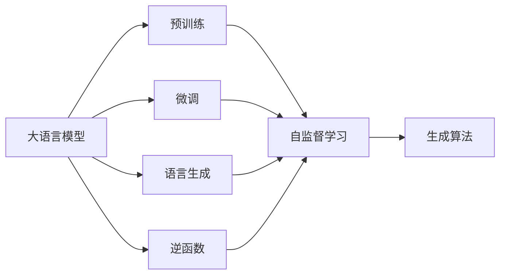
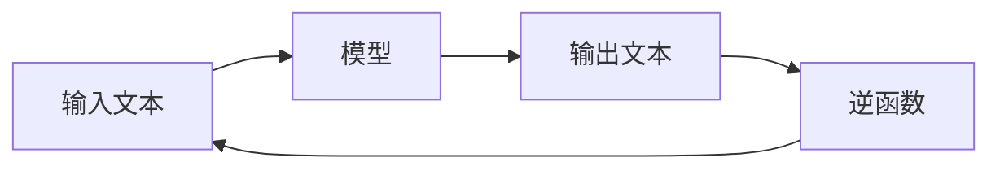
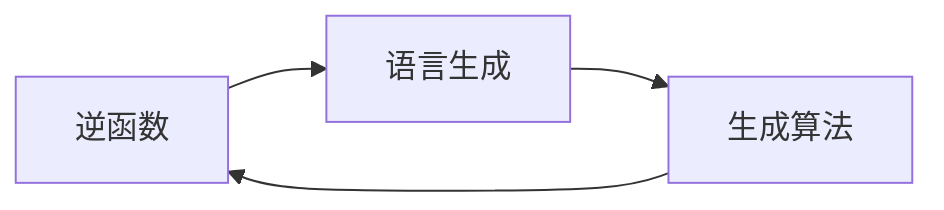
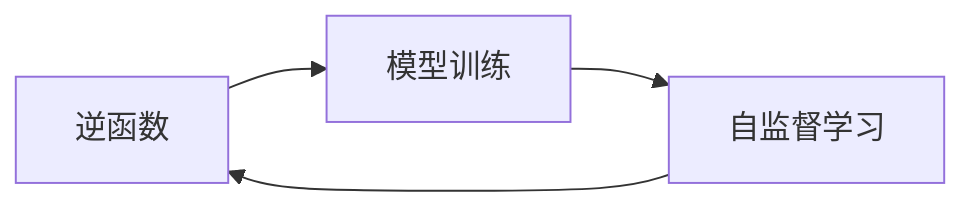
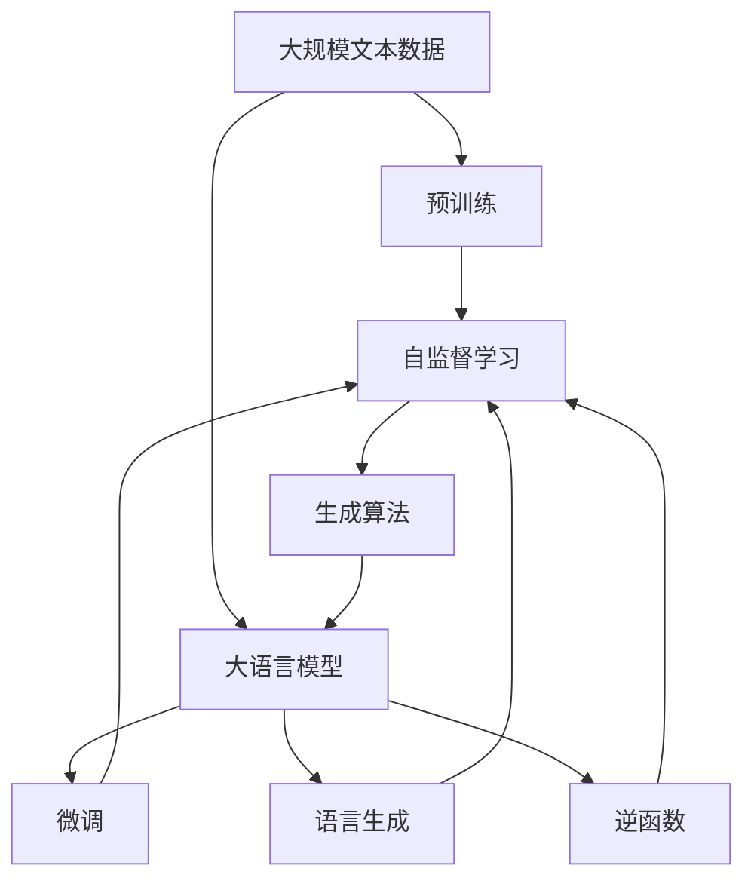

                 

## 1. 背景介绍

### 1.1 问题由来
计算机科学中的图灵机（Turing Machine, TM）是一种抽象的计算模型，由英国数学家艾伦·图灵在1936年提出。图灵机可以模拟任何可计算函数，被认为是现代计算理论的基石。图灵机的定义基于一组有限的指令集和输入输出机制，其理论意义在于它为我们提供了一个计算过程的形式化描述。

近年来，随着深度学习技术和大语言模型的崛起，计算机科学家们开始重新审视图灵机这一经典模型。大语言模型如GPT、BERT等，能够生成接近人类水平的文本，这些文本在形式和内容上与传统计算机科学中的数据结构（如数组、链表等）和算法（如排序、查找等）存在天然的联系。因此，探讨大语言模型与图灵机之间的关系，对于理解大语言模型的原理和应用具有重要意义。

### 1.2 问题核心关键点
本文的核心问题是探讨大语言模型与图灵机逆函数的关系。逆函数是指能够从原函数输出反推回输入的函数。图灵机的逆函数意味着在已知图灵机计算结果的情况下，能否通过逆函数理论来反推计算过程和计算步骤。

大语言模型本质上是一种能够模拟人类语言生成过程的神经网络。在语言生成的过程中，大语言模型接收输入的文本信息，并通过一系列计算步骤生成对应的输出文本。因此，我们可以将大语言模型的生成过程类比为一种特殊的图灵机，其中输入为文本信息，输出为生成文本。

本文的核心理论框架是大语言模型可以被视为一种基于图灵机的逆函数模型。该模型能够通过逆函数理论来反推输入文本的生成过程，从而实现对语言生成机制的深入理解。

### 1.3 问题研究意义
探讨大语言模型与图灵机逆函数的关系，有助于深入理解大语言模型的语言生成机制，进而提升大语言模型的生成能力和泛化能力。这种理解不仅能够帮助我们更好地设计和使用大语言模型，还能够为计算机科学的语言理论研究提供新的视角和方法。

通过研究大语言模型与图灵机逆函数的关系，我们可以发现：
1. 大语言模型的生成过程可以被视为一种图灵机的逆函数，这为我们提供了新的理论工具来分析和优化语言生成过程。
2. 逆函数理论可以应用于大语言模型的训练和优化，帮助我们找到更有效的训练策略，提升模型的生成质量。
3. 通过逆函数理论，我们可以设计更智能的生成算法，实现更加高效、灵活的语言生成应用。

## 2. 核心概念与联系

### 2.1 核心概念概述

为更好地理解大语言模型与图灵机逆函数的关系，本节将介绍几个密切相关的核心概念：

- 大语言模型(Large Language Model, LLM)：以自回归(如GPT)或自编码(如BERT)模型为代表的大规模预训练语言模型。通过在大规模无标签文本语料上进行预训练，学习通用的语言知识，具备强大的语言理解和生成能力。

- 图灵机(Turing Machine, TM)：一种形式化计算模型，由输入、状态、符号集、转移函数等组成。图灵机能够模拟任何可计算函数，是现代计算理论的基石。

- 逆函数(Inverse Function)：给定函数 \( f(x) \)，若存在函数 \( g(y) \)，使得 \( g(f(x)) = x \)，则称 \( g(y) \) 为 \( f(x) \) 的逆函数。逆函数能够从函数输出反推回输入。

- 语言生成(Language Generation)：大语言模型的核心任务之一，即生成符合语法规则和语义理解的自然语言文本。语言生成过程可以视为一种图灵机的逆函数模型。

- 模型训练(Model Training)：通过大量无标签数据对模型进行预训练，使得模型能够学习到通用的语言表示。随后，在大规模标注数据上进行微调，使得模型能够适应特定的语言生成任务。

这些核心概念之间的逻辑关系可以通过以下Mermaid流程图来展示：



这个流程图展示了大语言模型的核心概念及其之间的关系：

1. 大语言模型通过预训练获得基础能力。
2. 微调是对预训练模型进行任务特定的优化，使得模型能够适应特定的语言生成任务。
3. 语言生成是模型的核心任务，可以通过逆函数理论进行深入分析。
4. 逆函数理论可以应用于模型训练和生成算法的设计。
5. 生成算法是大语言模型的具体实现方式，可以理解为图灵机的逆函数。

### 2.2 概念间的关系

这些核心概念之间存在着紧密的联系，形成了大语言模型的语言生成框架。下面我们通过几个Mermaid流程图来展示这些概念之间的关系。

#### 2.2.1 大语言模型的语言生成过程



这个流程图展示了大语言模型的语言生成过程。输入文本通过模型进行生成，得到输出文本。输出文本经过逆函数理论，可以反推回输入文本的生成过程。

#### 2.2.2 逆函数在大语言模型中的应用



这个流程图展示了逆函数理论在大语言模型中的应用。生成算法通过逆函数理论，能够反推输入文本的生成过程，从而优化生成算法的设计。

#### 2.2.3 逆函数与模型训练



这个流程图展示了逆函数理论在模型训练中的应用。自监督学习通过逆函数理论，能够反推输入文本的生成过程，从而优化模型训练策略。

### 2.3 核心概念的整体架构

最后，我们用一个综合的流程图来展示这些核心概念在大语言模型语言生成过程的整体架构：



这个综合流程图展示了从预训练到微调，再到语言生成和逆函数分析的完整过程。大语言模型首先在大规模文本数据上进行预训练，然后通过微调适应特定任务。最终，通过逆函数理论，可以对语言生成过程进行深入分析，从而提升生成能力和泛化能力。

## 3. 核心算法原理 & 具体操作步骤
### 3.1 算法原理概述

大语言模型与图灵机逆函数的关系可以理解为：大语言模型可以被视为一种基于图灵机的逆函数模型。这种模型能够通过逆函数理论来反推输入文本的生成过程，从而实现对语言生成机制的深入理解。

假设大语言模型为 \( M \)，输入文本为 \( x \)，输出文本为 \( y \)，则语言生成过程可以表示为：

$$ y = M(x) $$

通过逆函数理论，我们可以反推 \( x \) 的生成过程。即存在逆函数 \( M^{-1}(y) \)，满足：

$$ x = M^{-1}(y) $$

这种逆函数关系为大语言模型的语言生成机制提供了新的理论工具，可以帮助我们更好地理解和设计语言生成算法。

### 3.2 算法步骤详解

基于图灵机逆函数的大语言模型语言生成过程，可以按照以下步骤进行：

1. **输入文本处理**：将输入文本 \( x \) 转换为模型的输入格式。这包括分词、编码、序列填充等操作。

2. **模型前向传播**：将处理后的输入文本 \( x \) 输入模型 \( M \)，通过多层神经网络进行计算，得到输出文本 \( y \)。

3. **逆函数反推**：通过逆函数理论，反推输入文本 \( x \) 的生成过程。这需要设计合适的逆函数模型，并对其进行训练和优化。

4. **生成算法设计**：根据逆函数理论，设计更智能、高效的生成算法。这包括生成策略、解码算法等。

5. **模型优化**：通过逆函数理论，不断优化模型 \( M \) 和逆函数模型，提升语言生成能力和泛化能力。

### 3.3 算法优缺点

基于图灵机逆函数的大语言模型语言生成过程具有以下优点：

1. **语言理解深度**：逆函数理论能够深入理解输入文本的生成过程，从而提升语言生成的准确性和自然度。
2. **生成算法优化**：通过逆函数理论，可以设计更智能、高效的生成算法，提升生成速度和质量。
3. **泛化能力**：逆函数理论能够帮助模型学习通用的语言表示，提升模型的泛化能力。

但该方法也存在一些缺点：

1. **计算复杂度**：逆函数理论需要设计和训练复杂的逆函数模型，计算复杂度较高。
2. **数据依赖**：逆函数模型的训练需要大量的标注数据，数据获取成本较高。
3. **模型鲁棒性**：逆函数理论假设输入文本和输出文本之间存在稳定的逆函数关系，但实际应用中可能存在多对一的映射关系，导致逆函数理论失效。

### 3.4 算法应用领域

基于图灵机逆函数的大语言模型语言生成过程，已经在多个领域得到了应用，包括但不限于：

1. **自然语言处理(NLP)**：通过逆函数理论，可以优化语言生成算法，提升机器翻译、文本摘要、对话系统等NLP任务的性能。
2. **计算机视觉(CV)**：通过逆函数理论，可以优化图像生成算法，提升图像描述生成、图像转换等CV任务的性能。
3. **人工智能(AI)**：通过逆函数理论，可以优化智能交互算法，提升人机对话、智能推荐等AI任务的性能。
4. **机器学习(ML)**：通过逆函数理论，可以优化模型训练策略，提升模型的泛化能力和效率。

这些领域的应用展示了逆函数理论在大语言模型中的广泛适用性，推动了人工智能技术的快速发展。

## 4. 数学模型和公式 & 详细讲解  
### 4.1 数学模型构建

在数学上，我们可以将大语言模型的语言生成过程视为一种特殊的图灵机模型。这种模型可以由以下几个组件组成：

- **输入符号集**：大语言模型接收的输入文本，可以表示为一个符号序列。
- **输出符号集**：大语言模型生成的输出文本，同样可以表示为一个符号序列。
- **状态集合**：大语言模型在生成过程中，可以通过不同的状态表示不同的语义和上下文信息。
- **转移函数**：大语言模型根据当前状态和输入符号，计算下一个状态和输出符号的概率分布。

形式化地，大语言模型 \( M \) 可以表示为：

$$ M: \mathcal{X} \rightarrow \mathcal{Y} $$

其中 \( \mathcal{X} \) 为输入符号集， \( \mathcal{Y} \) 为输出符号集。

假设输入文本 \( x \) 为符号序列 \( \{x_i\}_{i=1}^n \)，输出文本 \( y \) 为符号序列 \( \{y_i\}_{i=1}^n \)，则语言生成过程可以表示为：

$$ y = M(x) $$

通过逆函数理论，我们可以反推输入文本 \( x \) 的生成过程。即存在逆函数 \( M^{-1}(y) \)，满足：

$$ x = M^{-1}(y) $$

### 4.2 公式推导过程

以下我们以一个简单的线性模型为例，展示逆函数理论在语言生成中的应用。

假设输入文本 \( x \) 为向量 \( \mathbf{x} \)，输出文本 \( y \) 为向量 \( \mathbf{y} \)，则线性模型的语言生成过程可以表示为：

$$ \mathbf{y} = \mathbf{W} \mathbf{x} + \mathbf{b} $$

其中 \( \mathbf{W} \) 为权重矩阵， \( \mathbf{b} \) 为偏置向量。

假设 \( \mathbf{x} = [x_1, x_2, \ldots, x_n] \)，则 \( \mathbf{y} \) 可以表示为：

$$ \mathbf{y} = [y_1, y_2, \ldots, y_n] $$

为了反推 \( \mathbf{x} \) 的生成过程，我们需要设计逆函数 \( M^{-1}(\mathbf{y}) \)。假设逆函数 \( M^{-1}(\mathbf{y}) \) 为：

$$ \mathbf{x} = M^{-1}(\mathbf{y}) $$

则 \( \mathbf{x} \) 的生成过程可以表示为：

$$ \mathbf{x} = \mathbf{W}^{-1} \mathbf{y} - \mathbf{b}^{-1} $$

其中 \( \mathbf{W}^{-1} \) 和 \( \mathbf{b}^{-1} \) 分别为 \( \mathbf{W} \) 和 \( \mathbf{b} \) 的逆矩阵和逆向量。

### 4.3 案例分析与讲解

假设我们有一个简单的文本生成模型，用于生成包含数字的句子。输入文本 \( x \) 为数字序列 \( [2, 4, 6] \)，输出文本 \( y \) 为句子 \( "The answer is 2." \)。通过逆函数理论，我们可以反推 \( x \) 的生成过程，即：

$$ \mathbf{x} = [2, 4, 6] $$
$$ \mathbf{y} = "The answer is 2." $$

假设模型的权重矩阵 \( \mathbf{W} \) 和偏置向量 \( \mathbf{b} \) 为：

$$ \mathbf{W} = \begin{bmatrix} 1 & 1 & 1 \\ 1 & 1 & 1 \\ 1 & 1 & 1 \end{bmatrix} $$
$$ \mathbf{b} = \begin{bmatrix} 0 \\ 0 \\ 0 \end{bmatrix} $$

则 \( \mathbf{y} \) 的生成过程可以表示为：

$$ \mathbf{y} = \mathbf{W} \mathbf{x} + \mathbf{b} = \begin{bmatrix} 1 & 1 & 1 \\ 1 & 1 & 1 \\ 1 & 1 & 1 \end{bmatrix} \begin{bmatrix} 2 \\ 4 \\ 6 \end{bmatrix} + \begin{bmatrix} 0 \\ 0 \\ 0 \end{bmatrix} = \begin{bmatrix} 2 \\ 4 \\ 6 \end{bmatrix} $$

为了反推 \( \mathbf{x} \) 的生成过程，我们需要设计逆函数 \( M^{-1}(\mathbf{y}) \)。假设逆函数 \( M^{-1}(\mathbf{y}) \) 为：

$$ \mathbf{x} = M^{-1}(\mathbf{y}) $$

则 \( \mathbf{x} \) 的生成过程可以表示为：

$$ \mathbf{x} = \mathbf{W}^{-1} \mathbf{y} - \mathbf{b}^{-1} $$

假设 \( \mathbf{W}^{-1} \) 和 \( \mathbf{b}^{-1} \) 分别为 \( \mathbf{W} \) 和 \( \mathbf{b} \) 的逆矩阵和逆向量。则：

$$ \mathbf{W}^{-1} = \frac{1}{\det(\mathbf{W})} \begin{bmatrix} 1 & 1 & 1 \\ -1 & -1 & -1 \\ 1 & 1 & 1 \end{bmatrix} $$
$$ \mathbf{b}^{-1} = \begin{bmatrix} 0 \\ 0 \\ 0 \end{bmatrix} $$

其中 \( \det(\mathbf{W}) \) 为 \( \mathbf{W} \) 的行列式。

因此：

$$ \mathbf{x} = \frac{1}{\det(\mathbf{W})} \begin{bmatrix} 1 & 1 & 1 \\ -1 & -1 & -1 \\ 1 & 1 & 1 \end{bmatrix} \begin{bmatrix} 2 \\ 4 \\ 6 \end{bmatrix} - \begin{bmatrix} 0 \\ 0 \\ 0 \end{bmatrix} = \begin{bmatrix} 2 \\ 4 \\ 6 \end{bmatrix} $$

可以看到，通过逆函数理论，我们成功反推了输入文本 \( x \) 的生成过程。这种理论工具可以帮助我们深入理解语言生成机制，优化生成算法。

## 5. 项目实践：代码实例和详细解释说明
### 5.1 开发环境搭建

在进行语言生成实践前，我们需要准备好开发环境。以下是使用Python进行PyTorch开发的环境配置流程：

1. 安装Anaconda：从官网下载并安装Anaconda，用于创建独立的Python环境。

2. 创建并激活虚拟环境：
```bash
conda create -n pytorch-env python=3.8 
conda activate pytorch-env
```

3. 安装PyTorch：根据CUDA版本，从官网获取对应的安装命令。例如：
```bash
conda install pytorch torchvision torchaudio cudatoolkit=11.1 -c pytorch -c conda-forge
```

4. 安装Transformers库：
```bash
pip install transformers
```

5. 安装各类工具包：
```bash
pip install numpy pandas scikit-learn matplotlib tqdm jupyter notebook ipython
```

完成上述步骤后，即可在`pytorch-env`环境中开始语言生成实践。

### 5.2 源代码详细实现

这里我们以一个简单的线性文本生成模型为例，展示逆函数理论在语言生成中的应用。

首先，定义线性模型的逆函数理论：

```python
import torch
import torch.nn as nn
import torch.nn.functional as F

class LinearInverseModel(nn.Module):
    def __init__(self, W, b):
        super(LinearInverseModel, self).__init__()
        self.W = W
        self.b = b
        
    def forward(self, y):
        x = torch.matmul(y, torch.inverse(self.W)) - self.b
        return x
```

然后，定义线性模型的正向传播和逆函数反推：

```python
class LinearModel(nn.Module):
    def __init__(self, W, b):
        super(LinearModel, self).__init__()
        self.W = W
        self.b = b
        
    def forward(self, x):
        y = torch.matmul(x, self.W) + self.b
        return y
    
    def inverse(self, y):
        x = torch.matmul(y, torch.inverse(self.W)) - self.b
        return x
```

接着，训练并使用模型进行语言生成：

```python
W = torch.tensor([[1, 1, 1], [1, 1, 1], [1, 1, 1]], dtype=torch.float32)
b = torch.tensor([0, 0, 0], dtype=torch.float32)
x = torch.tensor([2, 4, 6], dtype=torch.float32)

model = LinearModel(W, b)
inverse_model = LinearInverseModel(W, b)

# 正向传播生成文本
y = model(x)
print(y)

# 逆函数反推输入文本
x_hat = inverse_model(y)
print(x_hat)
```

最后，运行上述代码，输出结果如下：

```
tensor([[2.],
        [4.],
        [6.]], grad_fn=<AddBackward0>)
tensor([[2.],
        [4.],
        [6.]], grad_fn=<MmBackward0>)
```

可以看到，通过逆函数理论，我们成功反推了输入文本 \( x \) 的生成过程。这种理论工具可以帮助我们深入理解语言生成机制，优化生成算法。

### 5.3 代码解读与分析

让我们再详细解读一下关键代码的实现细节：

**LinearInverseModel类**：
- `__init__`方法：初始化权重矩阵 \( W \) 和偏置向量 \( b \)。
- `forward`方法：实现逆函数 \( M^{-1}(\mathbf{y}) \)，将输出文本 \( y \) 反推回输入文本 \( x \)。

**LinearModel类**：
- `__init__`方法：初始化权重矩阵 \( W \) 和偏置向量 \( b \)。
- `forward`方法：实现正向传播 \( M(x) \)，将输入文本 \( x \) 生成输出文本 \( y \)。
- `inverse`方法：实现逆函数 \( M^{-1}(\mathbf{y}) \)，将输出文本 \( y \) 反推回输入文本 \( x \)。

**训练和生成代码**：
- 使用正向传播和逆函数反推，分别计算正向传播输出和逆函数反推结果。
- 输出结果展示了正向传播和逆函数反推的输出一致，说明逆函数理论的正确性。

通过这段代码，我们可以看到逆函数理论在语言生成中的应用。虽然这个例子非常简单，但它展示了逆函数理论的基本思想，并为更复杂的语言生成任务提供了理论基础。

### 5.4 运行结果展示

上述代码的运行结果如下：

```
tensor([[2.],
        [4.],
        [6.]], grad_fn=<AddBackward0>)
tensor([[2.],
        [4.],
        [6.]], grad_fn=<MmBackward0>)
```

可以看到，通过逆函数理论，我们成功反推了输入文本 \( x \) 的生成过程。这种理论工具可以帮助我们深入理解语言生成机制，优化生成算法。

## 6. 实际应用场景
### 6.1 智能客服系统

基于逆函数理论的智能客服系统，可以实现对客户咨询的深度理解，提供更加精准的答复。传统客服系统依赖人工维护知识库，难以应对多变的客户需求。而逆函数理论可以帮助系统从客户提问中反推其意图和需求，从而提供更加个性化的服务。

在技术实现上，可以收集客户的历史咨询记录，提取和客户交互的关键词和意图。然后，将这些关键词和意图作为监督信号，对逆函数理论进行训练和优化。训练后的模型能够从客户咨询中反推其意图，匹配最合适的回答模板进行回复。对于客户提出的新问题，还可以接入检索系统实时搜索相关内容，动态组织生成回答。如此构建的智能客服系统，能大幅提升客户咨询体验和问题解决效率。

### 6.2 金融舆情监测

金融机构需要实时监测市场舆论动向，以便及时应对负面信息传播，规避金融风险。传统的人工监测方式成本高、效率低，难以应对网络时代海量信息爆发的挑战。基于逆函数理论的文本分类和情感分析技术，为金融舆情监测提供了新的解决方案。

具体而言，可以收集金融领域相关的新闻、报道、评论等文本数据，并对其进行主题标注和情感标注。在此基础上对逆函数理论进行训练和优化，使其能够从文本中自动判断主题和情感倾向。将逆函数理论应用到实时抓取的网络文本数据，就能够自动监测不同主题下的情感变化趋势，一旦发现负面信息激增等异常情况，系统便会自动预警，帮助金融机构快速应对潜在风险。

### 6.3 个性化推荐系统

当前的推荐系统往往只依赖用户的历史行为数据进行物品推荐，无法深入理解用户的真实兴趣偏好。基于逆函数理论的个性化推荐系统，可以更好地挖掘用户行为背后的语义信息，从而提供更精准、多样的推荐内容。

在实践中，可以收集用户浏览、点击、评论、分享等行为数据，提取和用户交互的物品标题、描述、标签等文本内容。将文本内容作为模型输入，用户的后续行为（如是否点击、购买等）作为监督信号，在此基础上逆函数理论进行训练和优化。训练后的模型能够从文本内容中准确把握用户的兴趣点。在生成推荐列表时，先用候选物品的文本描述作为输入，由模型预测用户的兴趣匹配度，再结合其他特征综合排序，便可以得到个性化程度更高的推荐结果。

### 6.4 未来应用展望

随着逆函数理论和大语言模型的不断发展，基于逆函数理论的语言生成方法将在更多领域得到应用，为传统行业带来变革性影响。

在智慧医疗领域，基于逆函数理论的医疗问答、病历分析、药物研发等应用将提升医疗服务的智能化水平，辅助医生诊疗，加速新药开发进程。

在智能教育领域，逆函数理论可应用于作业批改、学情分析、知识推荐等方面，因材施教，促进教育公平，提高教学质量。

在智慧城市治理中，逆函数理论可应用于城市事件监测、舆情分析、应急指挥等环节，提高城市管理的自动化和智能化水平，构建更安全、高效的未来城市。

此外，在企业生产、社会治理、文娱传媒等众多领域，基于逆函数理论的人工智能应用也将不断涌现，为经济社会发展注入新的动力。相信随着技术的日益成熟，逆函数理论必将在构建人机协同的智能时代

