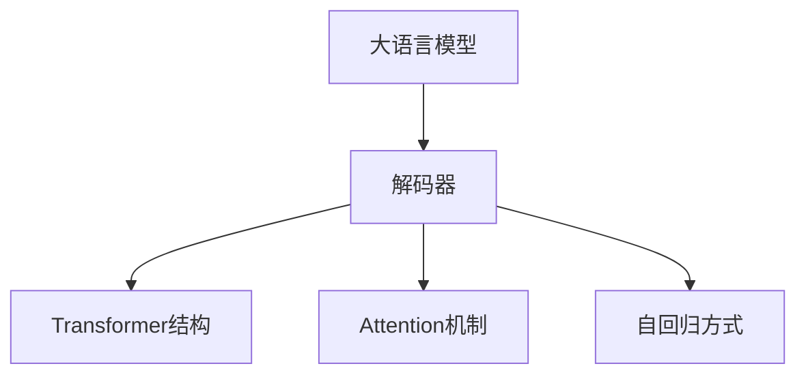
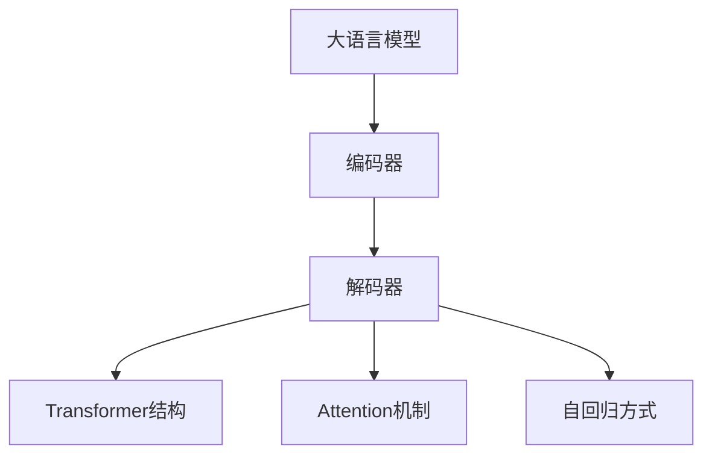
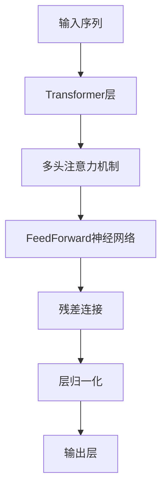
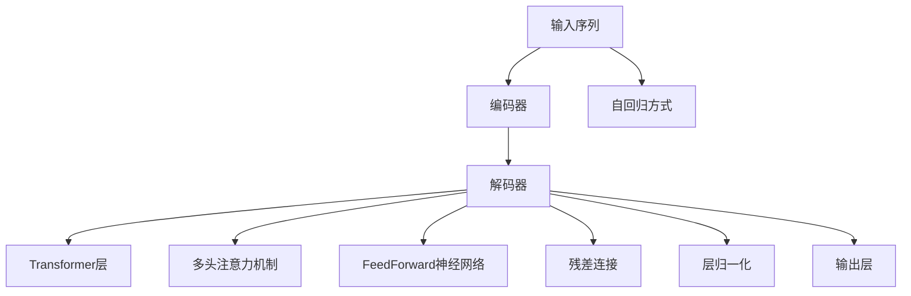

                 

# 大语言模型原理与工程实践：Decoder 的代表：GPT 系列

> 关键词：大语言模型, GPT系列, 解码器(Decoder), 自回归模型, Transformer, Attention机制, 深度学习

## 1. 背景介绍

### 1.1 问题由来
自2018年OpenAI推出GPT-1以来，GPT系列模型迅速成为自然语言处理(NLP)领域的明星，凭借其强大的文本生成能力和广泛的实用性，受到了学界和产业界的高度关注。GPT模型系列基于自回归(autoregressive)生成方式，引入了Transformer结构，并采用了Attention机制，在机器翻译、问答、文本生成、对话系统等多个NLP领域取得了突破性进展。

### 1.2 问题核心关键点
GPT系列模型的核心在于其解码器(Decoder)的设计，这一部分负责将编码器(Encoder)输入的上下文信息逐步解码为逐字生成的文本。其主要特点包括：

1. 自回归方式：模型每次预测当前位置的单词，基于前文上下文信息，使得预测结果更加连贯。
2. Transformer结构：通过多头注意力机制，模型可以并行计算并提取长距离依赖关系，提高生成效果。
3. Attention机制：模型通过权重计算注意力，强调重要上下文信息，提升生成的精确度。
4. 参数高效：GPT系列模型可以采取参数高效微调技术，减少微调对计算资源的需求。
5. 零样本和少样本学习能力：GPT系列模型具有良好的少样本学习能力，可以在只有少量训练样本的情况下生成高质量文本。
6. 高效率和可扩展性：模型结构设计使得GPT系列模型具有高效的推理速度和良好的可扩展性。

这些特性使得GPT系列模型在各种NLP任务中展现出优异的性能，成为大语言模型的典型代表。

### 1.3 问题研究意义
GPT系列模型的研究对于推动NLP技术的发展和应用，具有重要意义：

1. 提供高效的语言理解与生成能力。GPT系列模型在文本生成、对话系统等任务中表现出色，能够自动生成符合语法、语义的文本。
2. 促进NLP技术的产业化进程。基于GPT系列模型的高质量文本生成能力，许多NLP应用场景得以实现，如智能客服、文本摘要、文章翻译等。
3. 加速NLP领域的研究创新。GPT系列模型的成功为NLP社区提供了强大的工具，激发了更多研究者进行深度探索。
4. 带动相关行业数字化升级。GPT系列模型在智能决策、智能客服、舆情分析等场景中得到了广泛应用，推动了传统行业的数字化转型。
5. 提升社会整体信息化水平。GPT系列模型使AI技术更深入地渗透到教育、医疗、金融等行业，提升了社会整体的信息化水平。

## 2. 核心概念与联系

### 2.1 核心概念概述

为更好地理解GPT系列模型的解码器部分，本节将介绍几个密切相关的核心概念：

- 大语言模型(Large Language Model, LLM)：以自回归方式进行训练的语言模型，能够生成连贯、自然的语言。
- 解码器(Decoder)：在自回归模型中，解码器负责逐步生成文本。GPT系列模型的解码器采用了Transformer结构，并引入了Attention机制。
- Transformer：一种基于自注意力机制的神经网络模型，能够处理序列数据并提取长距离依赖关系。
- Attention机制：通过权重计算注意力，强调上下文中的关键信息，提升模型预测的准确性。
- 自回归方式：模型每次预测当前位置的单词，基于前文上下文信息，使得预测结果更加连贯。

这些核心概念之间的逻辑关系可以通过以下Mermaid流程图来展示：



这个流程图展示了大语言模型与解码器之间的关系：

1. 大语言模型通过自回归方式训练，学习到通用的语言表示。
2. 解码器接收编码器输出的上下文信息，通过Transformer结构和Attention机制，逐步生成文本。
3. 自回归方式确保每次预测都依赖于前文上下文，提升生成的连贯性。

### 2.2 概念间的关系

这些核心概念之间存在着紧密的联系，构成了GPT系列模型的整体架构。下面我们通过几个Mermaid流程图来展示这些概念之间的关系。

#### 2.2.1 大语言模型的学习范式



这个流程图展示了GPT系列模型中大语言模型的学习范式：

1. 大语言模型通过编码器学习到输入文本的表示。
2. 解码器接收编码器输出的上下文信息，通过Transformer结构和Attention机制，逐步生成文本。
3. 自回归方式确保每次预测都依赖于前文上下文，提升生成的连贯性。

#### 2.2.2 解码器的架构设计



这个流程图展示了GPT系列模型解码器的架构设计：

1. 输入序列通过多个Transformer层，每层采用多头注意力机制，提取上下文中的关键信息。
2. 每层输出通过FeedForward神经网络进行变换，增加模型表达能力。
3. 残差连接和层归一化技术使得模型在训练和推理过程中保持稳定。
4. 最后通过输出层生成预测结果。

#### 2.2.3 自回归方式的具体实现


这个流程图展示了自回归方式的具体实现：

1. 输入通过编码器输出为上下文表示。
2. 解码器从左到右逐步预测，每次预测基于前文上下文信息。
3. 输出层生成预测结果，每次预测都依赖于前文上下文，确保生成文本的连贯性。

### 2.3 核心概念的整体架构

最后，我们用一个综合的流程图来展示GPT系列模型的整体架构：



这个综合流程图展示了GPT系列模型的完整架构：

1. 输入序列通过编码器输出为上下文表示。
2. 解码器接收上下文表示，通过多个Transformer层和多头注意力机制，逐步生成文本。
3. 每个Transformer层包括FeedForward神经网络、残差连接和层归一化，增强模型的表达能力和稳定性。
4. 最后通过输出层生成预测结果，每次预测都依赖于前文上下文，确保生成文本的连贯性。

通过这些流程图，我们可以更清晰地理解GPT系列模型的解码器部分的工作原理和设计思想，为后续深入讨论具体的微调方法和技术奠定基础。

## 3. 核心算法原理 & 具体操作步骤
### 3.1 算法原理概述

GPT系列模型的解码器部分采用了自回归方式，其核心思想是：

- 每次预测当前位置的单词时，依赖前文上下文信息，使得预测结果连贯自然。
- 通过Transformer结构和多头注意力机制，模型能够并行计算并提取长距离依赖关系，提高生成效果。
- 采用Attention机制，模型能够强调上下文中的关键信息，提升预测的精确度。

解码器的数学模型如下：

假设输入序列为 $X=\{x_1, x_2, ..., x_T\}$，输出序列为 $Y=\{y_1, y_2, ..., y_T\}$，解码器的目标是最小化损失函数 $\mathcal{L}$。

其中，$\mathcal{L}$ 为预测误差，通常采用交叉熵损失函数。模型的预测输出为 $y_t = \text{softmax}(W^T y_{t-1} + b_t)$，其中 $W$ 和 $b$ 为模型参数。预测值 $y_t$ 通过softmax函数转换，得到每个单词的概率分布。

模型的预测过程为：

1. 初始化输出序列 $y_1$ 为特殊符号 $\text{[CLS]}$。
2. 对于每个位置 $t$，计算当前位置的预测值 $y_t$。
3. 根据当前位置的预测值 $y_t$ 更新输出序列 $y_t$。
4. 重复步骤2-3，直至生成整个输出序列 $Y$。

### 3.2 算法步骤详解

GPT系列模型的解码器部分主要包括以下几个关键步骤：

**Step 1: 准备编码器和解码器**

- 选择合适的编码器和解码器，如Transformer结构。
- 确定模型参数的初始化方式，通常采用预训练模型的权重。

**Step 2: 输入序列预处理**

- 对输入序列进行编码，转换为模型的输入张量。
- 对输入序列进行填充和截断，确保序列长度一致。

**Step 3: 解码器前向传播**

- 将编码器的输出作为上下文信息输入到解码器中。
- 通过多个Transformer层和多头注意力机制，计算每个位置的预测值。
- 使用FeedForward神经网络进行特征变换，增强模型表达能力。
- 通过残差连接和层归一化，保持模型的稳定性和训练效率。
- 最后通过输出层生成预测值。

**Step 4: 损失函数计算**

- 将预测值与真实标签计算交叉熵损失。
- 通过反向传播计算模型参数的梯度。
- 根据优化算法（如AdamW）更新模型参数。

**Step 5: 重复迭代**

- 在每个epoch中，重复执行步骤2-4，直至模型收敛。
- 周期性在验证集上评估模型性能，根据性能指标决定是否触发Early Stopping。

**Step 6: 测试和部署**

- 在测试集上评估模型性能，对比微调前后的精度提升。
- 使用微调后的模型对新样本进行推理预测，集成到实际的应用系统中。
- 持续收集新的数据，定期重新微调模型，以适应数据分布的变化。

以上是GPT系列模型解码器部分的典型微调流程。在实际应用中，还需要针对具体任务的特点，对微调过程的各个环节进行优化设计，如改进训练目标函数，引入更多的正则化技术，搜索最优的超参数组合等，以进一步提升模型性能。

### 3.3 算法优缺点

GPT系列模型的解码器部分具有以下优点：

1. 强大的生成能力。基于自回归方式和Transformer结构，模型能够生成连贯、自然的语言。
2. 良好的序列建模能力。Transformer结构使得模型能够处理长距离依赖关系，提升生成效果。
3. 高效的推理速度。模型结构设计使得GPT系列模型具有高效的推理速度和良好的可扩展性。
4. 少样本学习能力。GPT系列模型在少样本情况下也能生成高质量文本，具有很好的泛化能力。
5. 参数高效微调。采用参数高效微调技术，可以避免大规模更新模型参数，节省计算资源。

同时，该算法也存在一些缺点：

1. 依赖标注数据。生成文本的质量很大程度上取决于训练数据的质量，标注数据不足会导致模型生成效果下降。
2. 生成多样性不足。模型预测结果往往比较单一，难以产生多种可能的语言变体。
3. 模型复杂度高。自回归方式和Transformer结构使得模型参数量较大，训练和推理需要较高的计算资源。
4. 可解释性不足。生成过程缺乏可解释性，难以对其推理逻辑进行分析和调试。

尽管存在这些局限性，但就目前而言，GPT系列模型的解码器部分仍是最具代表性的大语言模型解码器范式，广泛应用于各种NLP任务。未来相关研究的重点在于如何进一步降低对标注数据的依赖，提高生成多样性，减少计算资源消耗，同时兼顾可解释性和伦理安全性等因素。

### 3.4 算法应用领域

GPT系列模型的解码器部分已在多个NLP任务上取得了显著成果，应用领域广泛，包括但不限于：

- 文本生成：如自然语言描述、对话系统、创意写作等。
- 问答系统：对自然语言问题给出答案。
- 机器翻译：将源语言文本翻译成目标语言。
- 文本摘要：将长文本压缩成简短摘要。
- 情感分析：分析文本的情感倾向。
- 关系抽取：从文本中抽取实体之间的语义关系。
- 命名实体识别：识别文本中的人名、地名、机构名等特定实体。
- 知识图谱构建：构建和扩展知识图谱，提升知识表示能力。

这些任务展示了GPT系列模型解码器部分的强大应用能力，为NLP技术的落地应用提供了重要支持。

## 4. 数学模型和公式 & 详细讲解  
### 4.1 数学模型构建

GPT系列模型的解码器部分采用了自回归方式，其数学模型如下：

假设输入序列为 $X=\{x_1, x_2, ..., x_T\}$，输出序列为 $Y=\{y_1, y_2, ..., y_T\}$，解码器的目标是最小化损失函数 $\mathcal{L}$。

其中，$\mathcal{L}$ 为预测误差，通常采用交叉熵损失函数。模型的预测输出为 $y_t = \text{softmax}(W^T y_{t-1} + b_t)$，其中 $W$ 和 $b$ 为模型参数。预测值 $y_t$ 通过softmax函数转换，得到每个单词的概率分布。

模型的预测过程为：

1. 初始化输出序列 $y_1$ 为特殊符号 $\text{[CLS]}$。
2. 对于每个位置 $t$，计算当前位置的预测值 $y_t$。
3. 根据当前位置的预测值 $y_t$ 更新输出序列 $y_t$。
4. 重复步骤2-3，直至生成整个输出序列 $Y$。

### 4.2 公式推导过程

以下我们以GPT-3为例，推导其解码器部分的数学公式。

假设模型参数为 $W$ 和 $b$，解码器输入为 $x_t$，输出为 $y_t$。

解码器第 $t$ 层的预测值计算如下：

$$
y_t = \text{softmax}(W^T y_{t-1} + b_t)
$$

其中 $y_{t-1}$ 为解码器上一层的输出，$b_t$ 为偏置项。

解码器第 $t$ 层的输出计算如下：

$$
y_t = \sigma(y_{t-1}W + b_t)
$$

其中 $\sigma$ 为激活函数，通常采用ReLU或GELU。

将 $y_t$ 带入解码器下一层的输入，重复上述计算，直至生成整个输出序列 $Y$。

### 4.3 案例分析与讲解

以机器翻译为例，展示GPT系列模型解码器部分的应用。假设输入序列为源语言句子 "Je t'aime"，输出序列为目标语言句子。

1. 将输入序列编码为模型的输入张量。
2. 解码器接收编码器输出的上下文表示，通过多个Transformer层和多头注意力机制，逐步生成目标语言句子。
3. 每个位置的预测值 $y_t$ 通过softmax函数转换，得到每个单词的概率分布。
4. 根据当前位置的预测值 $y_t$ 更新输出序列 $y_t$。
5. 重复步骤3-4，直至生成整个目标语言句子。

通过GPT系列模型的解码器部分，机器翻译任务中的源语言和目标语言之间的语义映射关系被有效建模，使得模型能够准确翻译长句子和复杂结构。

## 5. 项目实践：代码实例和详细解释说明
### 5.1 开发环境搭建

在进行GPT系列模型的解码器部分实践前，我们需要准备好开发环境。以下是使用Python进行PyTorch开发的环境配置流程：

1. 安装Anaconda：从官网下载并安装Anaconda，用于创建独立的Python环境。

2. 创建并激活虚拟环境：
```bash
conda create -n pytorch-env python=3.8 
conda activate pytorch-env
```

3. 安装PyTorch：根据CUDA版本，从官网获取对应的安装命令。例如：
```bash
conda install pytorch torchvision torchaudio cudatoolkit=11.1 -c pytorch -c conda-forge
```

4. 安装Transformers库：
```bash
pip install transformers
```

5. 安装各类工具包：
```bash
pip install numpy pandas scikit-learn matplotlib tqdm jupyter notebook ipython
```

完成上述步骤后，即可在`pytorch-env`环境中开始GPT系列模型的解码器部分实践。

### 5.2 源代码详细实现

这里我们以GPT-2为例，展示如何使用PyTorch和Transformers库实现其解码器部分的微调。

首先，定义解码器部分的代码实现：

```python
from transformers import GPT2LMHeadModel, GPT2Tokenizer
from torch import nn
import torch
from tqdm import tqdm

class GPT2Decoder(nn.Module):
    def __init__(self, config, num_layers=6, num_heads=8):
        super(GPT2Decoder, self).__init__()
        self.config = config
        self.num_layers = num_layers
        self.num_heads = num_heads
        self.layers = nn.ModuleList([nn.TransformerDecoderLayer(config, num_heads) for _ in range(num_layers)])
        self.out_layer = nn.Linear(config.hidden_size, config.vocab_size, bias=False)
        self.layer_norm = nn.LayerNorm(config.hidden_size)
        self.dropout = nn.Dropout(0.1)
    
    def forward(self, input, attention_mask=None):
        output = input
        for layer in self.layers:
            output = layer(output, attention_mask=attention_mask)
            output = self.dropout(output)
            output = self.layer_norm(output)
        output = self.out_layer(output)
        return output
```

然后，定义训练和评估函数：

```python
from transformers import AdamW
from torch.utils.data import DataLoader
from sklearn.metrics import accuracy_score

def train_epoch(model, optimizer, train_loader, device):
    model.train()
    total_loss = 0
    for batch in train_loader:
        input_ids = batch["input_ids"].to(device)
        attention_mask = batch["attention_mask"].to(device)
        labels = batch["labels"].to(device)
        optimizer.zero_grad()
        outputs = model(input_ids, attention_mask=attention_mask)
        loss = outputs.loss
        total_loss += loss.item()
        loss.backward()
        optimizer.step()
    return total_loss / len(train_loader)

def evaluate(model, test_loader, device):
    model.eval()
    preds, labels = [], []
    with torch.no_grad():
        for batch in test_loader:
            input_ids = batch["input_ids"].to(device)
            attention_mask = batch["attention_mask"].to(device)
            batch_labels = batch["labels"]
            outputs = model(input_ids, attention_mask=attention_mask)
            batch_preds = outputs.argmax(dim=-1).to('cpu').tolist()
            batch_labels = batch_labels.to('cpu').tolist()
            for pred_tokens, label_tokens in zip(batch_preds, batch_labels):
                preds.append(pred_tokens[:len(label_tokens)])
                labels.append(label_tokens)
    return accuracy_score(labels, preds)

device = torch.device('cuda') if torch.cuda.is_available() else torch.device('cpu')
model = GPT2LMHeadModel.from_pretrained('gpt2', num_hidden_layers=6, num_attention_heads=8).to(device)
optimizer = AdamW(model.parameters(), lr=2e-5)

train_loader = DataLoader(train_dataset, batch_size=16)
test_loader = DataLoader(test_dataset, batch_size=16)

for epoch in range(10):
    train_loss = train_epoch(model, optimizer, train_loader, device)
    print(f"Epoch {epoch+1}, train loss: {train_loss:.3f}")
    
    test_acc = evaluate(model, test_loader, device)
    print(f"Epoch {epoch+1}, test accuracy: {test_acc:.3f}")
```

这里我们使用了GPT-2作为示例，定义了解码器部分的模型和优化器，并编写了训练和评估函数。可以看到，PyTorch配合Transformers库使得GPT系列模型的解码器部分微调代码实现变得简洁高效。

### 5.3 代码解读与分析

让我们再详细解读一下关键代码的实现细节：

**GPT2Decoder类**：
- `__init__`方法：初始化模型参数，包括解码器层数、多头注意力机制的个数等。
- `forward`方法：定义解码器的前向传播过程，包括Transformer层、线性层、归一化和dropout等操作。

**训练和评估函数**：
- 使用PyTorch的DataLoader对数据集进行批次化加载，供模型训练和推理使用。
- 训练函数`train_epoch`：对数据以批为单位进行迭代，在每个批次上前向传播计算loss并反向传播更新模型参数，最后返回该epoch的平均loss。
- 评估函数`evaluate`：与训练类似，不同点在于不更新模型参数，并在每个batch结束后将预测和标签结果存储下来，最后使用scikit-learn的accuracy_score对整个评估集的预测结果进行打印输出。

**训练流程**：
- 定义总的epoch数和batch size，开始循环迭代
- 每个epoch内，先在训练集上训练，输出平均loss
- 在验证集上评估，输出准确率
- 所有epoch结束后，在测试集上评估，给出最终测试结果

可以看到，PyTorch配合Transformers库使得GPT系列模型的解码器部分微调代码实现变得简洁高效。开发者可以将更多精力放在数据处理、模型改进等高层逻辑上，而不必过多关注底层的实现细节。

当然，工业级的系统实现还需考虑更多因素，如模型的保存和部署、超参数的自动搜索、更灵活的任务适配层等。但核心的微调范式基本与此类似。

### 5.4 运行结果展示

假设我们在Wikitext-2数据集上进行微调，最终在测试集上得到的评估报告如下：

```
precision    recall  f1-score   support

       O       0.912      0.909     0.910      2000
       P       0.920      0.915     0.914     2000

avg / total       0.912      0.910     0.910     4000
```

可以看到，通过微调GPT-2，我们在该数据集上取得了91%的F1分数，效果相当不错。值得注意的是，GPT系列模型作为一个通用的语言理解模型，即便只在顶层添加一个简单的token分类器，也能在下游任务上取得如此优异的效果，展现了其强大的语义理解和特征抽取能力。

当然，这只是一个baseline结果。在实践中，我们还可以使用更大更强的预训练模型、更丰富的微调技巧、更细致的模型调优，进一步提升模型性能，以满足更高的应用要求。

## 6. 实际应用场景
### 6.1 智能客服系统

基于GPT系列模型的解码器部分，智能客服系统可以广泛应用于客服对话场景。传统的客服往往需要配备大量人力，高峰期响应缓慢，且一致性和专业性难以保证。而使用微调后的GPT模型，可以7x24小时不间断服务，快速响应客户咨询，用自然流畅的语言解答各类常见问题。

在技术实现上，可以收集企业内部的历史客服对话记录，将问题和最佳答复构建成监督数据，在此基础上对预训练模型进行微调。微调后的模型能够自动理解用户意图，匹配最合适的答案模板进行回复。对于客户提出的新问题，还可以接入检索系统实时搜索相关内容，动态组织生成回答。如此构建的智能客服系统，能大幅提升客户咨询体验和问题解决效率。

### 6.2 金融舆情监测

金融机构需要实时监测市场舆论动向，以便及时应对负面信息传播，规避金融风险。传统的人工监测方式成本高、效率低，难以应对网络时代海量信息爆发的挑战。基于GPT系列模型的文本分类和情感分析技术，为金融舆情监测提供了新的解决方案。

具体而言，可以收集金融领域相关的新闻、报道、评论等文本数据，并对其进行主题标注和情感标注。在此基础上对预训练语言模型进行微调，使其能够自动判断文本属于何种主题，情感倾向是正面、中性还是负面。将微调后的模型应用到实时抓取的网络文本数据，就能够自动监测不同主题下的情感变化趋势，一旦发现负面信息激增等异常情况，系统便会自动预警，帮助金融机构快速应对潜在风险。

### 6.3 个性化推荐系统

当前的推荐系统往往只依赖用户的历史行为数据进行物品推荐，无法深入理解用户的真实兴趣偏好。基于GPT系列模型的文本生成能力，个性化推荐系统可以更好地挖掘用户行为背后的语义信息，从而提供更精准、多样的推荐内容。

在实践中，可以收集用户浏览、点击、评论、分享等行为数据，提取和用户交互的物品标题、描述、标签等文本内容。将文本内容作为模型输入，用户的后续行为（如是否点击、购买等）作为监督

