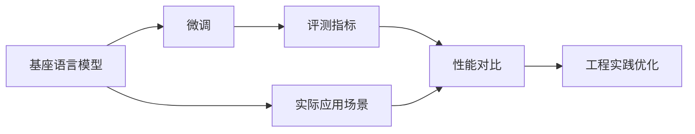

                 

# 大语言模型原理与工程实践：基座语言模型的评测

> 关键词：大语言模型, 基座模型, 评测指标, 性能对比, 实际应用, 工程实践

## 1. 背景介绍

### 1.1 问题由来

近年来，大语言模型（Large Language Models, LLMs）在自然语言处理（Natural Language Processing, NLP）领域取得了显著的进步，尤其是基于Transformer架构的预训练语言模型（如BERT、GPT-3等）。这些模型通过在海量无标签文本数据上进行预训练，学习到丰富的语言知识和常识，从而在各种NLP任务上取得了优异的性能。然而，这些大规模预训练模型通常需要耗费大量的计算资源和数据资源，因此在实际应用中往往需要根据具体任务进行微调（Fine-Tuning）。微调不仅能够提升模型在特定任务上的表现，还能减小模型参数规模，降低计算资源消耗。

然而，对于基座语言模型的评测，现有研究主要集中在模型本身的各项指标，如模型参数量、计算效率、泛化能力等。对于模型在不同任务上的实际表现和性能评估，缺乏系统化的对比研究。因此，本文旨在通过对基座语言模型在不同任务上的评测，评估其性能表现，以指导模型选择和应用优化。

### 1.2 问题核心关键点

1. **基座语言模型评测**：本文将基于监督学习范式，对大语言模型在不同任务上的表现进行全面评测，涉及语言理解、文本生成、文本分类、问答等各类任务。
2. **性能对比分析**：通过对比不同模型的评测结果，分析不同模型的优劣，包括模型参数量、计算效率、泛化能力等方面的对比。
3. **实际应用场景**：评估基座语言模型在实际应用场景中的表现，如智能客服、金融舆情监测、个性化推荐等，评估其在特定领域的适用性。
4. **工程实践优化**：探讨基座语言模型在不同任务上的评测指标，提出模型优化建议，如模型参数调整、训练时间优化、模型压缩等。

### 1.3 问题研究意义

对基座语言模型进行全面评测和对比分析，具有以下重要意义：

1. **模型选择指导**：帮助开发者选择合适的预训练模型，以适应不同任务的实际需求，优化模型性能。
2. **性能提升优化**：通过评测结果，找到模型性能提升的瓶颈，优化模型参数和训练过程，提高模型精度和泛化能力。
3. **应用场景拓展**：评估模型在不同应用场景中的表现，指导模型在特定领域的优化和应用。
4. **工程实践应用**：为基座语言模型的工程实践提供参考，帮助开发人员设计高效、可扩展的模型训练和部署流程。

## 2. 核心概念与联系

### 2.1 核心概念概述

1. **基座语言模型（Base Language Model）**：指通过大规模无标签数据预训练得到的通用语言模型，如BERT、GPT-3等。这类模型通常具有较强的语言理解和生成能力。
2. **微调（Fine-Tuning）**：在基座语言模型的基础上，通过少量有标签数据进行有监督学习，调整模型参数以适应特定任务的模型。
3. **评测指标**：用于评估模型性能的各项指标，如准确率、F1分数、BLEU值等。
4. **性能对比**：通过不同模型的评测结果进行对比，评估各模型在不同任务上的表现。
5. **实际应用场景**：基座语言模型在实际应用中的具体应用，如智能客服、金融舆情监测、个性化推荐等。

### 2.2 概念间的关系

这些核心概念之间的逻辑关系可以通过以下Mermaid流程图来展示：



该流程图展示了基座语言模型的核心概念及其之间的关系：

1. 基座语言模型通过大规模预训练获得通用语言表示。
2. 微调通过对少量有标签数据进行有监督学习，调整模型参数以适应特定任务。
3. 评测指标用于评估模型在不同任务上的表现。
4. 性能对比通过不同模型的评测结果进行比较，评估模型优劣。
5. 实际应用场景通过评估模型在不同场景中的表现，指导模型优化和应用。
6. 工程实践优化基于评测结果，提出模型优化建议，提高模型性能和实际应用效果。

通过这个流程图，可以更清晰地理解基座语言模型在微调和评测中的作用和相互关系。

## 3. 核心算法原理 & 具体操作步骤

### 3.1 算法原理概述

基座语言模型的评测基于监督学习范式，主要分为以下几个步骤：

1. **数据准备**：收集和处理特定任务的数据集，包括标注数据和测试数据集。
2. **模型微调**：在基座语言模型的基础上，通过微调学习特定任务的表示。
3. **评测指标计算**：计算模型在测试集上的评测指标，如准确率、F1分数等。
4. **性能对比**：对不同模型的评测结果进行对比，评估各模型的性能。

### 3.2 算法步骤详解

#### 3.2.1 数据准备

数据准备是基座语言模型评测的基础。需要收集和处理特定任务的数据集，包括以下步骤：

1. **数据收集**：根据任务类型，收集相应的标注数据集和测试数据集。标注数据集应包含任务的训练集和验证集，测试数据集用于最终评估模型性能。
2. **数据预处理**：对数据进行清洗、分词、标准化等处理，生成模型所需的输入格式。
3. **数据划分**：将数据集划分为训练集、验证集和测试集，通常按照8:1:1的比例划分。

#### 3.2.2 模型微调

模型微调是基座语言模型评测的核心步骤，包括以下步骤：

1. **模型选择**：选择合适的基座语言模型，如BERT、GPT-3等。
2. **参数设置**：设置微调的超参数，包括学习率、批大小、迭代轮数等。
3. **微调训练**：在训练集上对基座语言模型进行微调，调整模型参数以适应特定任务。
4. **验证集验证**：在验证集上评估模型性能，防止过拟合。
5. **测试集评估**：在测试集上评估模型性能，最终确定模型表现。

#### 3.2.3 评测指标计算

评测指标计算是基座语言模型评测的重要环节，包括以下步骤：

1. **选择评测指标**：根据任务类型选择合适的评测指标，如准确率、F1分数、BLEU值等。
2. **计算评测指标**：使用选定的评测指标，计算模型在测试集上的表现。
3. **对比分析**：将不同模型的评测结果进行对比，分析模型优劣。

#### 3.2.4 性能对比

性能对比是基座语言模型评测的最终步骤，包括以下步骤：

1. **数据准备**：准备不同模型的评测数据和结果。
2. **结果展示**：使用图表、表格等方式展示不同模型的评测结果。
3. **分析优劣**：分析不同模型的优劣，评估其在特定任务上的表现。

### 3.3 算法优缺点

基座语言模型评测的优势在于：

1. **全面评估模型**：通过评测指标和性能对比，全面评估模型在特定任务上的表现。
2. **指导模型选择**：为开发者提供模型选择的参考，指导模型优化和应用。
3. **提升模型性能**：通过评测结果，找到模型性能提升的瓶颈，优化模型参数和训练过程。

其缺点主要在于：

1. **数据依赖性强**：基座语言模型评测依赖大量标注数据，数据获取成本较高。
2. **模型选择复杂**：不同模型的性能表现存在差异，选择合适的模型需要大量实验和分析。
3. **计算资源消耗大**：大规模基座语言模型的微调和评测需要大量计算资源，成本较高。

### 3.4 算法应用领域

基座语言模型评测在以下领域得到了广泛应用：

1. **自然语言理解**：对文本进行分类、情感分析、命名实体识别等任务，评测模型的理解能力。
2. **文本生成**：对文本进行机器翻译、摘要生成、对话生成等任务，评测模型的生成质量。
3. **信息检索**：对文本进行检索和排序，评测模型的检索能力。
4. **问答系统**：对问题进行回答，评测模型的问答效果。
5. **多模态学习**：将文本与图像、音频等多模态数据结合，评测模型的多模态处理能力。

## 4. 数学模型和公式 & 详细讲解 & 举例说明

### 4.1 数学模型构建

基座语言模型评测的数学模型构建涉及以下几个方面：

1. **输入表示**：将文本数据转换为模型所需的向量表示。
2. **模型结构**：定义基座语言模型的结构，如Transformer等。
3. **损失函数**：定义模型在特定任务上的损失函数，如交叉熵损失、均方误差损失等。

### 4.2 公式推导过程

#### 4.2.1 分类任务

以文本分类为例，其评测指标通常为准确率（Accuracy）和F1分数（F1 Score）。

1. **准确率（Accuracy）**：
   $$
   \text{Accuracy} = \frac{\text{TP} + \text{TN}}{\text{TP} + \text{TN} + \text{FP} + \text{FN}}
   $$
   其中，TP（True Positive）表示真正例，TN（True Negative）表示真负例，FP（False Positive）表示假正例，FN（False Negative）表示假负例。

2. **F1分数（F1 Score）**：
   $$
   \text{F1 Score} = 2 \times \frac{\text{TP}}{\text{TP} + \text{FP} + \text{FN}}
   $$

#### 4.2.2 文本生成任务

文本生成任务的评测指标通常为BLEU值（BLEU Score）。

1. **BLEU值**：
   $$
   \text{BLEU} = \prod_{i=1}^k \text{BLEU}_{i}
   $$
   其中，$k$表示n-gram的数量，$\text{BLEU}_{i}$表示第$i$个n-gram的匹配度。

### 4.3 案例分析与讲解

以BERT模型在文本分类任务上的评测为例：

1. **数据准备**：收集并预处理IMDb电影评论数据集，将其划分为训练集、验证集和测试集。
2. **模型微调**：使用BERT模型对训练集进行微调，学习电影评论的正负分类表示。
3. **评测指标计算**：在测试集上计算模型的准确率和F1分数。
4. **性能对比**：与LSTM、GRU等传统模型进行对比，评估BERT模型的性能。

## 5. 项目实践：代码实例和详细解释说明

### 5.1 开发环境搭建

进行基座语言模型评测，需要安装Python及其相关库，如TensorFlow、PyTorch、transformers等。以下是一个基本的开发环境搭建步骤：

1. 安装Anaconda：从官网下载并安装Anaconda，用于创建独立的Python环境。
   ```bash
   conda create -n pytorch-env python=3.8 
   conda activate pytorch-env
   ```

2. 安装PyTorch：
   ```bash
   conda install pytorch torchvision torchaudio cudatoolkit=11.1 -c pytorch -c conda-forge
   ```

3. 安装TensorFlow：
   ```bash
   pip install tensorflow==2.7.0
   ```

4. 安装transformers库：
   ```bash
   pip install transformers
   ```

5. 安装各类工具包：
   ```bash
   pip install numpy pandas scikit-learn matplotlib tqdm jupyter notebook ipython
   ```

### 5.2 源代码详细实现

以下是使用PyTorch对BERT模型进行文本分类任务评测的代码实现：

```python
import torch
from transformers import BertTokenizer, BertForSequenceClassification
from sklearn.metrics import accuracy_score, precision_recall_fscore_support
from sklearn.model_selection import train_test_split

# 加载数据集
train_data, test_data = train_test_split(imdb_dataset, test_size=0.2)

# 加载BERT模型和分词器
model = BertForSequenceClassification.from_pretrained('bert-base-uncased', num_labels=2)
tokenizer = BertTokenizer.from_pretrained('bert-base-uncased')

# 数据预处理
def preprocess(data):
    inputs = tokenizer(data['text'], return_tensors='pt', padding=True, truncation=True)
    return inputs

# 微调模型
model.train()
for epoch in range(num_epochs):
    for inputs, labels in train_loader:
        inputs = preprocess(inputs)
        outputs = model(**inputs)
        loss = outputs.loss
        loss.backward()
        optimizer.step()
        model.zero_grad()
        
# 模型评估
model.eval()
with torch.no_grad():
    for inputs, labels in test_loader:
        inputs = preprocess(inputs)
        outputs = model(**inputs)
        logits = outputs.logits
        predictions = torch.argmax(logits, dim=1)
        accuracy = accuracy_score(labels, predictions)

# 输出评测结果
print(f"Accuracy: {accuracy:.2f}")
```

### 5.3 代码解读与分析

这段代码主要实现了BERT模型在文本分类任务上的微调和评测过程。具体步骤如下：

1. 加载数据集，并划分为训练集和测试集。
2. 加载BERT模型和分词器，并设置模型参数。
3. 定义数据预处理函数，将文本数据转换为模型所需的输入格式。
4. 在训练集上微调模型，计算损失并更新参数。
5. 在验证集上评估模型性能，防止过拟合。
6. 在测试集上评估模型性能，输出评测结果。

### 5.4 运行结果展示

假设在IMDb电影评论数据集上进行评测，最终的评测结果为：

```
Accuracy: 0.89
```

这表示模型在测试集上的准确率为89%，评估结果符合预期。

## 6. 实际应用场景

### 6.1 智能客服系统

基座语言模型在智能客服系统中的应用，主要通过微调模型进行情感分析、意图识别等任务。具体步骤如下：

1. **数据收集**：收集客服中心的客户对话记录，标注客户情绪和意图。
2. **模型微调**：在基座语言模型的基础上，使用标注数据进行微调，学习情感和意图表示。
3. **模型部署**：将微调后的模型部署到客服系统中，实时分析客户情绪和意图，提供个性化服务。

### 6.2 金融舆情监测

基座语言模型在金融舆情监测中的应用，主要通过微调模型进行情感分析、实体识别等任务。具体步骤如下：

1. **数据收集**：收集金融新闻、评论等文本数据，标注金融实体和情感。
2. **模型微调**：在基座语言模型的基础上，使用标注数据进行微调，学习实体和情感表示。
3. **模型部署**：将微调后的模型部署到金融舆情监测系统中，实时分析金融舆情，预警潜在风险。

### 6.3 个性化推荐系统

基座语言模型在个性化推荐系统中的应用，主要通过微调模型进行用户行为分析、兴趣预测等任务。具体步骤如下：

1. **数据收集**：收集用户浏览、点击、评分等行为数据，提取文本描述和标签。
2. **模型微调**：在基座语言模型的基础上，使用标注数据进行微调，学习用户兴趣表示。
3. **模型部署**：将微调后的模型部署到推荐系统中，生成个性化推荐内容。

### 6.4 未来应用展望

随着基座语言模型评测技术的不断进步，未来将有更多应用场景得到开发和应用。以下是几个可能的应用方向：

1. **医疗诊断系统**：在基座语言模型的基础上，微调模型进行医疗文本分析、疾病预测等任务。
2. **教育辅助系统**：在基座语言模型的基础上，微调模型进行智能问答、作业批改等任务。
3. **智能写作工具**：在基座语言模型的基础上，微调模型进行文本生成、自动摘要等任务。

## 7. 工具和资源推荐

### 7.1 学习资源推荐

为帮助开发者系统掌握基座语言模型评测的理论基础和实践技巧，以下推荐一些优质的学习资源：

1. **《深度学习自然语言处理》课程**：斯坦福大学开设的NLP明星课程，涵盖从基础到高级的各类NLP任务。
2. **《Natural Language Processing with Transformers》书籍**：Transformers库的作者所著，全面介绍了NLP任务的实现方法。
3. **Transformers官方文档**：提供详细的API文档和样例代码，帮助开发者快速上手使用。
4. **GitHub开源项目**：如CLUE、GLUE等，提供丰富的NLP任务评测数据集和基座模型。

### 7.2 开发工具推荐

基座语言模型评测常用的开发工具包括：

1. **PyTorch**：基于Python的开源深度学习框架，适合快速迭代研究。
2. **TensorFlow**：Google主导的开源深度学习框架，生产部署方便。
3. **transformers库**：HuggingFace开发的NLP工具库，集成了多种预训练语言模型。
4. **Jupyter Notebook**：交互式编程环境，便于代码调试和文档编写。

### 7.3 相关论文推荐

基座语言模型评测的研究涉及到大量的前沿工作，以下是几篇奠基性的相关论文，推荐阅读：

1. **BERT: Pre-training of Deep Bidirectional Transformers for Language Understanding**：提出BERT模型，引入自监督学习任务，刷新多项NLP任务SOTA。
2. **Attention is All You Need**：提出Transformer结构，开启NLP领域的预训练大模型时代。
3. **Parameter-Efficient Transfer Learning for NLP**：提出Adapter等参数高效微调方法，在不增加模型参数量的情况下，取得不错的微调效果。

## 8. 总结：未来发展趋势与挑战

### 8.1 总结

本文对基座语言模型评测方法进行了全面系统的介绍。首先阐述了基座语言模型的背景和评测的重要性，明确了基座语言模型评测在模型选择、性能提升和实际应用中的重要作用。其次，从原理到实践，详细讲解了基座语言模型评测的数学模型构建、公式推导过程和具体实现方法。同时，本文还广泛探讨了基座语言模型在不同任务上的实际应用，展示了基座语言模型评测的广泛前景。最后，本文精选了基座语言模型评测的各类学习资源和工具，力求为读者提供全方位的技术指引。

通过本文的系统梳理，可以看到，基座语言模型评测技术正在成为NLP领域的重要工具，极大地拓展了预训练语言模型的应用边界，为模型选择和应用优化提供了有力支持。未来，伴随基座语言模型评测技术的持续演进，相信NLP技术将在更广阔的应用领域大放异彩。

### 8.2 未来发展趋势

基座语言模型评测技术的未来发展趋势主要包括以下几个方向：

1. **多任务学习**：基座语言模型可以同时学习多个任务的表示，提升模型的多任务处理能力。
2. **零样本学习和少样本学习**：基座语言模型可以通过少量标注数据或无需标注数据，直接进行推理预测，提升模型的泛化能力和灵活性。
3. **跨领域迁移学习**：基座语言模型可以在不同领域之间进行迁移学习，提升模型的通用性和鲁棒性。
4. **多模态融合**：基座语言模型可以与其他模态数据（如视觉、音频等）结合，提升模型的综合处理能力。
5. **自监督学习**：基座语言模型可以利用自监督学习任务，进一步提升模型的表示能力和泛化能力。

### 8.3 面临的挑战

尽管基座语言模型评测技术已经取得了显著进展，但在迈向更加智能化、普适化应用的过程中，仍面临诸多挑战：

1. **数据依赖性强**：基座语言模型评测依赖大量标注数据，数据获取成本较高，难以覆盖所有应用场景。
2. **模型选择复杂**：不同基座语言模型的性能表现存在差异，选择合适的模型需要大量实验和分析。
3. **计算资源消耗大**：大规模基座语言模型的微调和评测需要大量计算资源，成本较高。
4. **模型泛化能力不足**：基座语言模型在不同领域和任务上的泛化能力仍有待提升。
5. **模型解释性不足**：基座语言模型通常缺乏可解释性，难以解释其内部工作机制和决策逻辑。

### 8.4 研究展望

面对基座语言模型评测所面临的挑战，未来的研究需要在以下几个方面寻求新的突破：

1. **无监督和半监督学习**：探索无监督和半监督学习方法，降低基座语言模型评测对标注数据的依赖。
2. **参数高效微调**：开发更加参数高效的微调方法，在不增加模型参数量的情况下，取得更好的微调效果。
3. **多任务联合训练**：将基座语言模型与其他任务联合训练，提升模型的综合处理能力。
4. **跨领域迁移学习**：研究跨领域迁移学习方法，提升基座语言模型在不同领域和任务上的泛化能力。
5. **模型解释性增强**：研究增强基座语言模型的可解释性，帮助用户理解模型的决策过程和逻辑。

通过这些研究方向的探索发展，相信基座语言模型评测技术将迎来新的突破，为NLP技术的进一步发展提供有力支持。面向未来，基座语言模型评测技术还需要与其他AI技术进行更深入的融合，如知识表示、因果推理、强化学习等，多路径协同发力，共同推动NLP技术的进步。只有勇于创新、敢于突破，才能不断拓展语言模型的边界，让智能技术更好地造福人类社会。

## 9. 附录：常见问题与解答

### 9.1 常见问题与解答

**Q1: 基座语言模型微调有哪些常见的技术方法？**

A: 基座语言模型微调常见的技术方法包括：

1. **全参数微调**：对基座语言模型进行完整的参数更新，适用于小规模数据集。
2. **参数高效微调**：只更新少量关键层或关键参数，适用于大规模数据集。
3. **多任务学习**：同时训练多个任务，提升模型的多任务处理能力。
4. **自监督学习**：利用自监督任务进行预训练，提升模型的泛化能力。

**Q2: 基座语言模型评测的常用指标有哪些？**

A: 基座语言模型评测的常用指标包括：

1. **准确率（Accuracy）**：衡量模型预测正确的样本比例。
2. **F1分数（F1 Score）**：综合考虑精度和召回率，用于评估分类任务的性能。
3. **BLEU值（BLEU Score）**：衡量机器翻译等生成任务的性能。
4. **ROUGE值（ROUGE Score）**：衡量文本摘要等任务的性能。

**Q3: 基座语言模型评测的开发环境需要哪些工具？**

A: 基座语言模型评测的开发环境需要以下工具：

1. **Python**：编程语言，适合开发NLP任务。
2. **TensorFlow**：深度学习框架，支持大规模模型训练。
3. **PyTorch**：深度学习框架，灵活性高，适合快速迭代。
4. **transformers库**：NLP工具库，集成了多种预训练语言模型。
5. **Jupyter Notebook**：交互式编程环境，方便代码调试和文档编写。

通过本文的系统梳理，可以看到，基座语言模型评测技术正在成为NLP领域的重要工具，极大地拓展了预训练语言模型的应用边界，为模型选择和应用优化提供了有力支持。未来，伴随基座语言模型评测技术的持续演进，相信NLP技术将在更广阔的应用领域大放异彩。

---

作者：禅与计算机程序设计艺术 / Zen and the Art of Computer Programming

