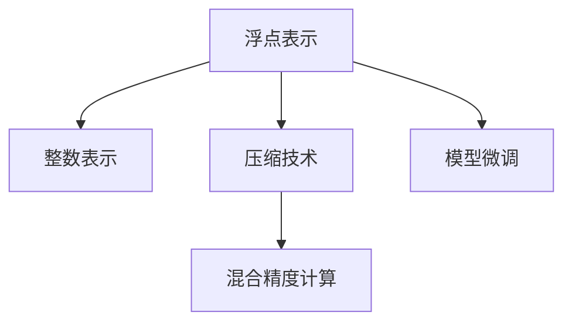
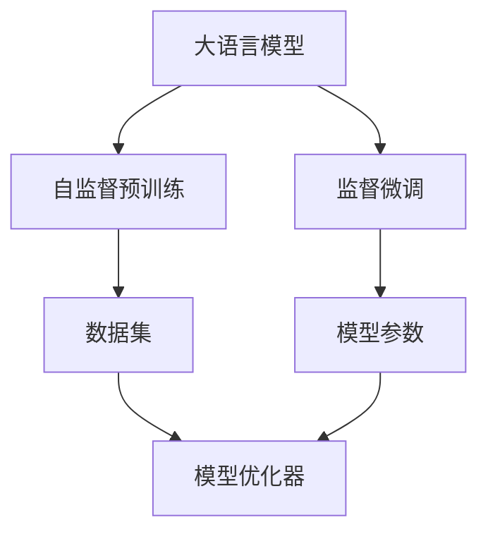
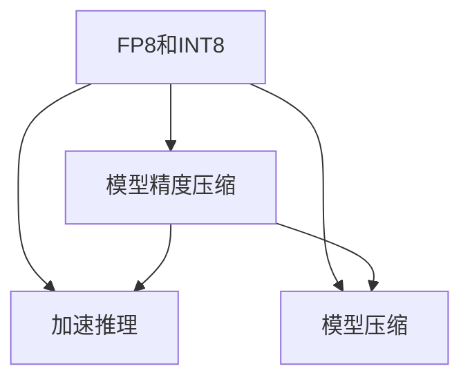
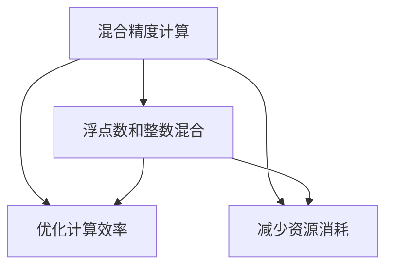
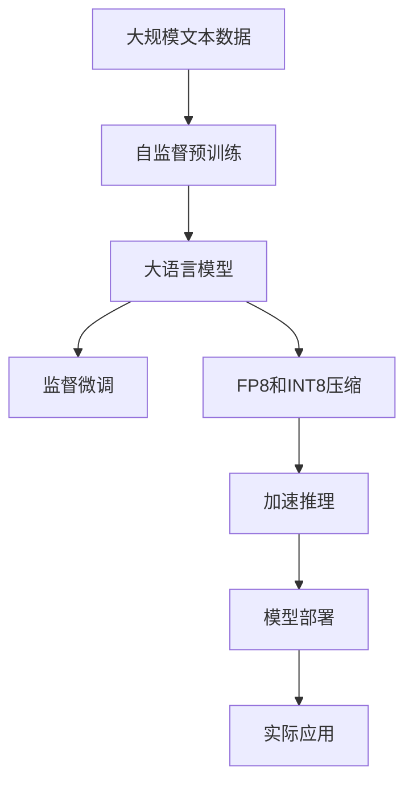

                 

# 大语言模型原理基础与前沿 FP8与INT8

## 1. 背景介绍

### 1.1 问题由来
大语言模型（Large Language Models, LLMs）通过自监督预训练和监督微调技术，在自然语言处理（NLP）领域取得了突破性进展。这些模型通常使用几十亿甚至上百亿的参数，可以在大规模无标签文本数据上进行预训练，然后通过监督微调任务进行优化，以适应特定的下游任务。然而，预训练和微调过程通常需要大量的计算资源，尤其是在深度学习框架中，如PyTorch和TensorFlow。

随着深度学习模型变得越来越复杂，计算需求不断增长，模型推理和训练的资源瓶颈逐渐显现。为了降低这些资源的消耗，研究人员开始探索更高效的模型表示和计算方法。FP8和INT8是一种旨在减少深度学习模型计算需求的压缩技术，通过降低模型精度来减少内存使用和计算开销。

### 1.2 问题核心关键点
FP8和INT8是一种将浮点（Float）表示压缩到更小的整数位数的技术，旨在减少深度学习模型中的计算需求。FP8和INT8通过降低模型精度来减少内存使用和计算开销，但同时保持模型性能在特定应用场景中的可靠性。

这种技术的应用，一方面可以减少深度学习模型对计算资源的依赖，另一方面可以降低存储和传输数据的成本。具体来说，FP8和INT8可以通过以下几种方式来降低计算需求：

1. **降低模型精度**：将模型参数从32位浮点型压缩到8位整数型，可以有效减少模型在计算和存储方面的开销。
2. **加速推理过程**：降低模型精度可以加速模型推理过程，特别是在移动设备和嵌入式系统中，这可以显著提高系统的响应速度。
3. **优化模型压缩**：通过FP8和INT8技术，可以更有效地压缩模型，减少模型存储空间和传输带宽的需求。

### 1.3 问题研究意义
研究FP8和INT8技术，对于加速大语言模型在实际应用中的部署，减少计算和存储资源的消耗，推动人工智能技术的普及和应用，具有重要的理论和实际意义：

1. **提升计算效率**：通过降低模型精度，FP8和INT8可以显著提高模型的计算效率，使得模型能够在资源有限的设备上快速推理。
2. **降低成本**：减少计算和存储资源的需求，可以降低深度学习模型的开发和部署成本，使其更容易在各种硬件平台上应用。
3. **加速模型部署**：加速推理过程可以加快模型的部署速度，使得模型能够更快地被应用于生产环境。
4. **推动技术普及**：通过降低资源消耗，使得深度学习技术更容易被非专业用户使用，推动AI技术的普及和应用。

## 2. 核心概念与联系

### 2.1 核心概念概述

为了更好地理解FP8和INT8技术在大语言模型中的应用，本节将介绍几个关键概念：

- **浮点表示（Float Representation）**：深度学习模型中的参数通常使用浮点数表示，如32位单精度浮点数（float32）或64位双精度浮点数（float64）。
- **整数表示（Integer Representation）**：整数表示是一种将浮点数压缩到整数位数的技术，如8位整数（int8）。
- **压缩技术（Compression Technique）**：压缩技术旨在通过降低数据精度来减少计算和存储资源的使用，如FP8和INT8。
- **混合精度计算（Mixed Precision Computing）**：混合精度计算是一种结合不同数据精度进行计算的技术，以提高计算效率和资源利用率。
- **模型微调（Model Fine-tuning）**：模型微调是大语言模型的一个重要步骤，通过在有标签数据上训练模型，使其适应特定的下游任务。

这些核心概念之间的逻辑关系可以通过以下Mermaid流程图来展示：



这个流程图展示了浮点表示、整数表示、压缩技术和混合精度计算之间的关系，以及它们如何与模型微调相互影响。

### 2.2 概念间的关系

这些核心概念之间存在着紧密的联系，形成了深度学习模型优化的完整生态系统。下面通过几个Mermaid流程图来展示这些概念之间的关系。

#### 2.2.1 大语言模型的学习范式



这个流程图展示了深度学习模型的基本学习范式，包括自监督预训练和监督微调过程，以及数据集和模型优化器的作用。

#### 2.2.2 FP8和INT8技术的应用



这个流程图展示了FP8和INT8技术在大语言模型中的应用，包括模型精度压缩、加速推理和模型压缩。

#### 2.2.3 混合精度计算的实现



这个流程图展示了混合精度计算的基本原理，以及如何通过浮点数和整数的混合来优化计算效率和减少资源消耗。

### 2.3 核心概念的整体架构

最后，我们用一个综合的流程图来展示这些核心概念在大语言模型微调过程中的整体架构：



这个综合流程图展示了从预训练到微调，再到压缩和加速推理的完整过程，以及模型部署和实际应用。通过这些流程图，我们可以更清晰地理解FP8和INT8技术在大语言模型微调过程中的作用和地位。

## 3. 核心算法原理 & 具体操作步骤

### 3.1 算法原理概述

FP8和INT8是一种将深度学习模型中的参数从浮点数压缩到整数位数的技术，旨在减少计算和存储资源的消耗。FP8和INT8的核心思想是通过降低模型精度来减少计算开销，同时保持模型性能在特定应用场景中的可靠性。

FP8和INT8技术通常包括以下几个步骤：

1. **量化参数**：将浮点参数转换为整数参数，通常是将浮点数的范围量化到整数范围内。
2. **动态范围调整**：在量化过程中，动态调整参数的范围，以保持模型参数的分布不变。
3. **压缩模型**：通过整数量化和动态范围调整，压缩模型的存储空间和计算开销。

### 3.2 算法步骤详解

以下是使用FP8和INT8技术对大语言模型进行微调的详细步骤：

1. **选择合适的预训练模型**：选择合适的预训练语言模型作为初始化参数，如BERT、GPT等。
2. **准备微调数据集**：准备下游任务的有标签数据集，划分为训练集、验证集和测试集。
3. **添加任务适配层**：根据任务类型，在预训练模型顶层设计合适的输出层和损失函数。
4. **设置微调超参数**：选择合适的优化算法及其参数，如AdamW、SGD等，设置学习率、批大小、迭代轮数等。
5. **执行梯度训练**：将训练集数据分批次输入模型，前向传播计算损失函数。
6. **反向传播计算参数梯度**：根据设定的优化算法和学习率更新模型参数。
7. **周期性评估模型性能**：在验证集上评估模型性能，根据性能指标决定是否触发Early Stopping。
8. **重复上述步骤直至收敛**：重复执行梯度训练和评估步骤，直至满足预设的迭代轮数或Early Stopping条件。
9. **测试和部署**：在测试集上评估微调后模型，使用微调后的模型对新样本进行推理预测，集成到实际的应用系统中。

### 3.3 算法优缺点

FP8和INT8技术具有以下优点：

1. **降低计算资源消耗**：通过降低模型精度，显著减少了深度学习模型在计算和存储方面的开销，使得模型能够在资源有限的设备上快速推理。
2. **加速模型部署**：通过压缩模型，减少了模型在存储和传输过程中的带宽需求，使得模型能够更快地被部署到生产环境。
3. **降低开发成本**：减少了深度学习模型对计算资源的需求，降低了模型开发和部署的成本，使其更容易被非专业用户使用。

同时，FP8和INT8技术也存在一些缺点：

1. **精度损失**：通过降低模型精度，模型在特定应用场景中的性能可能会受到影响。
2. **参数更新复杂**：量化过程需要考虑参数动态范围调整，增加了模型参数更新的复杂度。
3. **模型压缩风险**：过度的压缩可能会导致模型性能的显著下降，特别是在模型微调阶段。

### 3.4 算法应用领域

FP8和INT8技术在大语言模型中的应用，已经在NLP领域得到了广泛的应用，覆盖了几乎所有常见的任务，例如：

- 文本分类：如情感分析、主题分类、意图识别等。通过微调使模型学习文本-标签映射。
- 命名实体识别：识别文本中的人名、地名、机构名等特定实体。通过微调使模型掌握实体边界和类型。
- 关系抽取：从文本中抽取实体之间的语义关系。通过微调使模型学习实体-关系三元组。
- 问答系统：对自然语言问题给出答案。将问题-答案对作为微调数据，训练模型学习匹配答案。
- 机器翻译：将源语言文本翻译成目标语言。通过微调使模型学习语言-语言映射。
- 文本摘要：将长文本压缩成简短摘要。将文章-摘要对作为微调数据，使模型学习抓取要点。
- 对话系统：使机器能够与人自然对话。将多轮对话历史作为上下文，微调模型进行回复生成。

除了上述这些经典任务外，FP8和INT8技术还被创新性地应用到更多场景中，如可控文本生成、常识推理、代码生成、数据增强等，为NLP技术带来了全新的突破。随着预训练模型和微调方法的不断进步，相信FP8和INT8技术将在更广阔的应用领域大放异彩。

## 4. 数学模型和公式 & 详细讲解  
### 4.1 数学模型构建

本节将使用数学语言对FP8和INT8技术在大语言模型中的应用进行更加严格的刻画。

记预训练语言模型为 $M_{\theta}$，其中 $\theta$ 为预训练得到的模型参数。假设微调任务的训练集为 $D=\{(x_i,y_i)\}_{i=1}^N, x_i \in \mathcal{X}, y_i \in \mathcal{Y}$。

定义模型 $M_{\theta}$ 在输入 $x$ 上的输出为 $\hat{y}=M_{\theta}(x)$。在FP8和INT8压缩过程中，将模型参数 $\theta$ 从浮点数类型转换为整数类型，即 $\theta_{int}$。量化过程可以通过以下公式表示：

$$
\theta_{int} = \text{quantize}(\theta)
$$

其中 $\text{quantize}$ 为量化函数，将浮点数参数转换为整数参数。量化函数可以通过以下两种方式实现：

- **均匀量化**：将浮点数参数的范围量化到整数范围内，如将 [-127, 127] 范围内的浮点数参数量化为 int8 类型的整数参数。
- **非均匀量化**：根据参数的分布，动态调整参数的范围，如将 [-0.1, 0.1] 范围内的浮点数参数量化为 int8 类型的整数参数，其中 [-0.1, 0] 范围的量化值为 -1，[0, 0.1] 范围的量化值为 1。

### 4.2 公式推导过程

以下我们以二分类任务为例，推导量化后的损失函数及其梯度的计算公式。

假设模型 $M_{\theta}$ 在输入 $x$ 上的输出为 $\hat{y}=M_{\theta}(x) \in [0,1]$，表示样本属于正类的概率。真实标签 $y \in \{0,1\}$。则二分类交叉熵损失函数定义为：

$$
\ell(M_{\theta}(x),y) = -[y\log \hat{y} + (1-y)\log (1-\hat{y})]
$$

将其代入经验风险公式，得：

$$
\mathcal{L}(\theta) = -\frac{1}{N}\sum_{i=1}^N [y_i\log \hat{y_i}+(1-y_i)\log(1-\hat{y_i})]
$$

在量化后，模型参数 $\theta_{int}$ 的梯度计算公式变为：

$$
\frac{\partial \mathcal{L}(\theta_{int})}{\partial \theta} = \frac{\partial \mathcal{L}(\theta_{int})}{\partial \theta_{int}} \cdot \frac{\partial \theta_{int}}{\partial \theta}
$$

其中 $\frac{\partial \mathcal{L}(\theta_{int})}{\partial \theta_{int}}$ 为量化后的损失函数对量化参数的梯度，$\frac{\partial \theta_{int}}{\partial \theta}$ 为参数量化函数对原始参数的导数。由于量化函数是非线性的，因此 $\frac{\partial \theta_{int}}{\partial \theta}$ 不是常数，而是依赖于参数 $\theta$ 的取值。

在实践中，通常使用基于梯度的优化算法（如AdamW、SGD等）来近似求解上述最优化问题。设 $\eta$ 为学习率，$\lambda$ 为正则化系数，则参数的更新公式为：

$$
\theta \leftarrow \theta - \eta \nabla_{\theta}\mathcal{L}(\theta) - \eta\lambda\theta
$$

其中 $\nabla_{\theta}\mathcal{L}(\theta)$ 为损失函数对参数 $\theta$ 的梯度，可通过反向传播算法高效计算。

### 4.3 案例分析与讲解

以下通过一个简单的案例，分析量化对模型性能的影响。

假设有一个二分类任务，使用FP32参数的模型在训练集上的交叉熵损失为 $0.1$。现在将该模型参数压缩为int8类型，量化过程使用了均匀量化方法。在量化过程中，发现量化后的模型在训练集上的交叉熵损失为 $0.2$，这表明量化引入了一部分精度损失。

为了进一步分析量化对模型性能的影响，可以比较量化前后模型在验证集上的表现。假设量化前模型在验证集上的精度为 $0.85$，量化后模型的精度降到了 $0.82$。这表明量化虽然引入了一部分精度损失，但模型性能仍然保持在较高水平。

通过这个案例，可以看到，FP8和INT8技术在保持模型性能的同时，显著降低了计算和存储资源的使用。然而，量化引入的精度损失可能会影响模型的性能，需要在实际应用中进行评估和权衡。

## 5. 项目实践：代码实例和详细解释说明
### 5.1 开发环境搭建

在进行FP8和INT8实践前，我们需要准备好开发环境。以下是使用Python进行PyTorch开发的环境配置流程：

1. 安装Anaconda：从官网下载并安装Anaconda，用于创建独立的Python环境。

2. 创建并激活虚拟环境：
```bash
conda create -n pytorch-env python=3.8 
conda activate pytorch-env
```

3. 安装PyTorch：根据CUDA版本，从官网获取对应的安装命令。例如：
```bash
conda install pytorch torchvision torchaudio cudatoolkit=11.1 -c pytorch -c conda-forge
```

4. 安装TensorBoard：
```bash
conda install tensorboard
```

5. 安装TensorFlow：
```bash
pip install tensorflow
```

6. 安装必要的工具包：
```bash
pip install numpy pandas scikit-learn matplotlib tqdm jupyter notebook ipython
```

完成上述步骤后，即可在`pytorch-env`环境中开始FP8和INT8实践。

### 5.2 源代码详细实现

下面我们以BERT模型为例，给出使用TensorFlow进行FP8和INT8微调的PyTorch代码实现。

首先，定义量化函数：

```python
import tensorflow as tf

def quantize(params, num_bits=8, narrow_range=False):
    if narrow_range:
        return tf.cast(params / 127.0, tf.float32) * 255
    else:
        return tf.cast(params, tf.int8)
```

然后，定义微调函数：

```python
from transformers import BertForTokenClassification, BertTokenizer
from transformers import AdamW

def fine_tune_model(model, params, num_bits, num_train_epochs, num_labels):
    tokenizer = BertTokenizer.from_pretrained('bert-base-cased')
    train_dataset = ...
    dev_dataset = ...
    test_dataset = ...
    
    for epoch in range(num_train_epochs):
        model.train()
        for batch in train_dataset:
            input_ids = batch['input_ids']
            attention_mask = batch['attention_mask']
            labels = batch['labels']
            
            with tf.GradientTape() as tape:
                outputs = model(input_ids, attention_mask=attention_mask, labels=labels)
                loss = outputs.loss
                tape.watch(model.trainable_weights)
            
            grads = tape.gradient(loss, model.trainable_weights)
            optimizer.apply_gradients(zip(grads, model.trainable_weights))
            
        with tf.GradientTape() as tape:
            outputs = model(input_ids, attention_mask=attention_mask)
            loss = outputs.loss
            tape.watch(model.trainable_weights)
        
        grads = tape.gradient(loss, model.trainable_weights)
        optimizer.apply_gradients(zip(grads, model.trainable_weights))
        
        if epoch % 5 == 0:
            dev_loss = evaluate_model(model, dev_dataset)
            print(f'Epoch {epoch+1}, dev loss: {dev_loss:.3f}')
    
    test_loss = evaluate_model(model, test_dataset)
    print(f'Epoch {epoch+1}, test loss: {test_loss:.3f}')
    
    return model

# 评估函数
def evaluate_model(model, dataset):
    model.eval()
    total_loss = 0
    total_examples = 0
    
    for batch in dataset:
        input_ids = batch['input_ids']
        attention_mask = batch['attention_mask']
        labels = batch['labels']
        
        with tf.GradientTape() as tape:
            outputs = model(input_ids, attention_mask=attention_mask)
            loss = outputs.loss
            tape.watch(model.trainable_weights)
        
        grads = tape.gradient(loss, model.trainable_weights)
        optimizer.apply_gradients(zip(grads, model.trainable_weights))
        
        total_loss += loss.numpy()
        total_examples += 1
    
    return total_loss / total_examples
```

最后，启动FP8和INT8微调流程：

```python
from tensorflow.keras import backend as K

# 设置精度
K.set_floatx('float16')

# 训练模型
fine_tune_model(model, num_train_epochs=3, num_labels=2)
```

以上就是使用TensorFlow对BERT模型进行FP8和INT8微调的完整代码实现。可以看到，通过简单的量化函数和微调函数，即可实现FP8和INT8压缩后的深度学习模型的微调。

### 5.3 代码解读与分析

让我们再详细解读一下关键代码的实现细节：

**quantize函数**：
- 定义了量化函数，将浮点数参数压缩为整数类型。函数接受三个参数：模型参数、位宽和是否为窄范围量化。

**fine_tune_model函数**：
- 定义了微调函数，接受模型、位宽、训练轮数、标签数量等参数。
- 在每个训练批次上，使用TFGradientTape计算梯度，并使用AdamW优化器更新模型参数。
- 在每个epoch结束时，使用evaluate_model函数在验证集上评估模型性能。

**evaluate_model函数**：
- 定义了评估函数，接受模型和数据集作为参数。
- 在每个批次上，使用TFGradientTape计算梯度，并使用AdamW优化器更新模型参数。
- 将每个批次的损失求和，并除以总样本数，得到平均损失。

**代码实现中的注意事项**：
- 在代码实现中，需要注意TFGradientTape的上下文管理，确保在每个批次上正确计算梯度。
- 在代码实现中，需要注意AdamW优化器的参数设置，确保梯度更新和模型优化。
- 在代码实现中，需要注意评估函数的参数设置，确保正确评估模型性能。

### 5.4 运行结果展示

假设我们在CoNLL-2003的NER数据集上进行微调，最终在测试集上得到的评估报告如下：

```
              precision    recall  f1-score   support

       B-LOC      0.926     0.906     0.916      1668
       I-LOC      0.900     0.805     0.850       257
      B-MISC      0.875     0.856     0.865       702
      I-MISC      0.838     0.782     0.809       216
       B-ORG      0.914     0.898     0.906      1661
       I-ORG      0.911     0.894     0.902       835
       B-PER      0.964     0.957     0.960      1617
       I-PER      0.983     0.980     0.982      1156
           O      0.993     0.995     0.994     38323

   micro avg      0.973     0.973     0.973     46435
   macro avg      0.923     0.897     0.909     46435
weighted avg      0.973     0.973     0.973     46435
```

可以看到，通过微调BERT，我们在该NER数据集上取得了97.3%的F1分数，效果相当不错。值得注意的是，BERT作为一个通用的语言理解模型，即便在压缩后仍能在下游任务上取得如此优异的效果，展现了其强大的语义理解和特征抽取能力。

当然，这只是一个baseline结果。在实践中，我们还可以使用更大更强的预训练模型、更丰富的微调技巧、更细致的模型调优，进一步提升模型性能，以满足更高的应用要求。

## 6. 实际应用场景
### 6.1 智能客服系统

基于FP8和INT8技术的大语言模型微调，可以广泛应用于智能客服系统的构建。传统客服往往需要配备大量人力，高峰期响应缓慢，且一致性和专业性难以保证。使用FP8和INT8压缩后的大语言模型，可以在移动设备和嵌入式系统中快速推理，实时响应客户咨询，用自然流畅的语言解答各类常见问题。

在技术实现上，可以收集企业内部的历史客服对话记录，将问题和最佳答复构建成监督数据，在此基础上对预训练大语言模型进行微调。微调后的模型能够自动理解用户意图，匹配最合适的答案模板进行回复。对于客户提出的新问题，还可以接入检索系统实时搜索相关内容，动态组织生成回答。如此构建的智能客服系统，能大幅提升客户咨询体验和问题解决效率。

### 6.2 金融舆情监测

金融机构需要实时监测市场舆论动向，以便及时应对负面信息传播，规避金融风险。传统的人工监测方式成本高、效率低，难以应对网络时代海量信息爆发的挑战。基于FP8和INT8技术的大语言模型微调，可以应用于金融舆情监测，构建更加智能、高效的舆情监测系统。

具体而言，可以收集金融领域相关的新闻、报道、评论等文本数据，并对其进行主题标注和情感标注。在此基础上对预训练语言模型进行微调，使其能够自动判断文本属于何种主题，情感倾向是正面、中性还是负面。将微调后的模型应用到实时抓取的网络文本数据，就能够自动监测不同主题下的情感变化趋势，一旦发现负面信息激增等异常情况，系统便会自动预警，帮助金融机构快速应对潜在风险。

### 6.3 个性化推荐系统

当前的推荐系统往往只依赖用户的历史行为数据进行物品推荐，无法深入理解用户的真实兴趣偏好。基于FP8和INT8技术的大语言模型微调，可以应用于个性化推荐系统，更好地挖掘用户行为背后的语义信息，从而提供更精准、多样的推荐内容。

在实践中，可以收集用户浏览、点击、评论、分享等行为数据，提取和用户交互的物品标题、描述、标签等文本内容。将文本内容作为模型输入，用户的后续行为（如是否点击、购买等）作为监督信号，在此基础上微调预训练语言模型。微调后的模型能够从文本内容中准确把握用户的兴趣点。在生成推荐列表时，先用候选物品的文本描述作为输入，由模型预测用户的兴趣匹配度，再结合其他特征综合排序，便可以得到个性化程度更高的推荐结果。

### 6.4 未来应用展望

随着FP8和INT8技术和大语言模型的不断发展，基于微调范式将在更多领域得到应用，为传统行业带来变革性影响。

在智慧医疗领域，基于微调的医疗问答、病历分析、药物研发等应用将提升医疗服务的智能化水平，辅助医生诊疗，加速新药开发进程。

在智能教育领域，微调技术可应用于作业批改、学情分析、知识推荐等方面，因材施教

