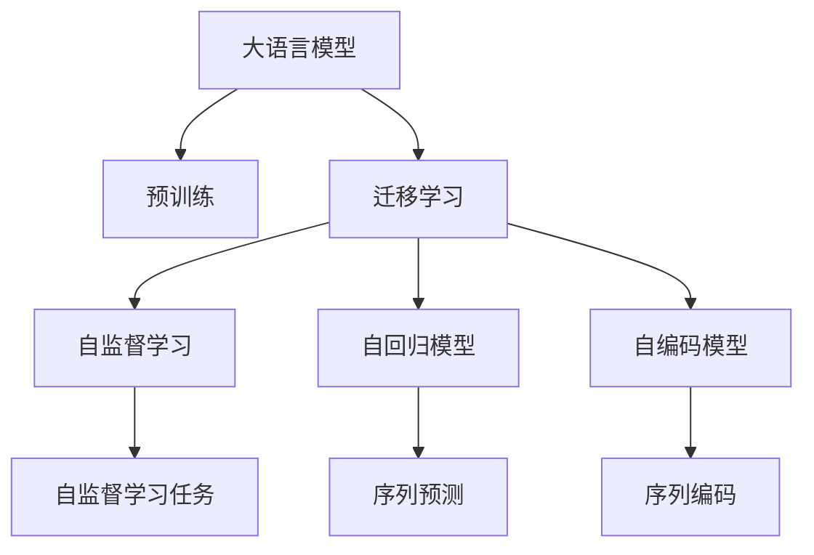
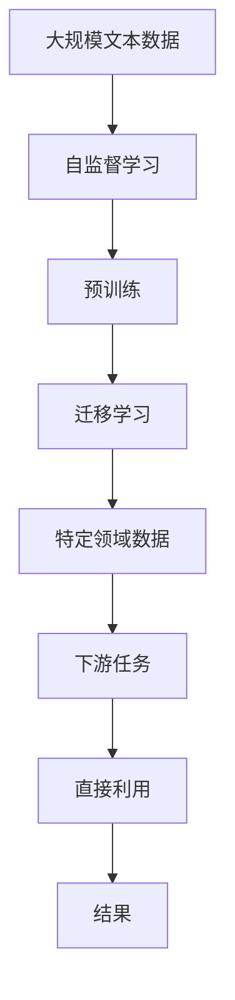

                 

# 大语言模型原理基础与前沿 不需要额外训练即可利用预训练模型

> 关键词：大语言模型,预训练,微调,Fine-Tuning,自然语言处理(NLP),Transformer,BERT,自监督学习,预训练-微调

## 1. 背景介绍

### 1.1 问题由来

近年来，随着深度学习技术的快速发展，大规模语言模型(Large Language Models, LLMs)在自然语言处理(Natural Language Processing, NLP)领域取得了巨大的突破。这些大语言模型通过在海量无标签文本数据上进行预训练，学习到了丰富的语言知识和常识，可以通过少量的有标签样本在下游任务上进行微调(Fine-Tuning)，获得优异的性能。其中最具代表性的大语言模型包括OpenAI的GPT系列模型、Google的BERT、T5等。

然而，由于预训练语料的广泛性和泛化能力的不足，这些通用的大语言模型在特定领域应用时，效果往往难以达到实际应用的要求。因此，如何针对特定任务进行大模型微调，提升模型性能，成为了当前大语言模型研究和应用的一个热点问题。本文聚焦于预训练模型在特定任务上的直接利用，而无需额外的微调训练，以期对大语言模型直接利用的实践提供更全面的指导。

### 1.2 问题核心关键点

目前，预训练模型在特定任务上的直接利用，主要依赖于预训练模型在不同领域的泛化能力和迁移学习原理。即在预训练模型基础上，通过迁移学习原理，直接将预训练模型应用到特定领域，以期获得较高的任务性能。

这种直接利用预训练模型的做法具有以下优点：
1. 数据需求少。不需要对特定任务进行额外的标注数据，只需少量样本即可在特定领域快速生效。
2. 可解释性强。预训练模型训练过程透明，模型行为易于解释。
3. 部署效率高。不需要额外的微调训练，模型部署速度快。

同时，这种做法也存在一些局限性：
1. 泛化能力受限。如果特定领域与预训练语料的分布差异较大，性能可能不佳。
2. 需要大量预训练数据。预训练语料库是模型泛化能力的关键，数据量不足会影响模型性能。
3. 无法进行跨领域迁移。需要大量领域数据，才能进行高效迁移。

尽管存在这些局限性，但就目前而言，直接利用预训练模型的方法仍是大语言模型应用的一个主流范式。未来相关研究的重点在于如何进一步提升预训练模型的泛化能力，降低数据需求，同时兼顾可解释性和伦理安全性等因素。

### 1.3 问题研究意义

研究大语言模型直接利用的方法，对于拓展大模型的应用范围，提升下游任务的性能，加速NLP技术的产业化进程，具有重要意义：

1. 降低应用开发成本。直接利用预训练模型，可以显著减少从头开发所需的数据、计算和人力等成本投入。
2. 提升模型效果。利用预训练模型的广泛知识，在大模型上直接应用，在特定领域可以取得较好的效果。
3. 加速开发进度。standing on the shoulders of giants，直接利用预训练模型，可以更快地完成任务适配，缩短开发周期。
4. 带来技术创新。预训练-直接利用范式促进了对预训练模型的深入研究，催生了自监督学习、自回归模型等新的研究方向。
5. 赋能产业升级。预训练模型直接利用方法，使得NLP技术更容易被各行各业所采用，为传统行业数字化转型升级提供新的技术路径。

## 2. 核心概念与联系

### 2.1 核心概念概述

为更好地理解预训练模型在特定任务上的直接利用，本节将介绍几个密切相关的核心概念：

- 大语言模型(Large Language Model, LLM)：以自回归(如GPT)或自编码(如BERT)模型为代表的大规模预训练语言模型。通过在大规模无标签文本语料上进行预训练，学习通用的语言表示，具备强大的语言理解和生成能力。

- 预训练(Pre-training)：指在大规模无标签文本语料上，通过自监督学习任务训练通用语言模型的过程。常见的预训练任务包括言语建模、遮挡语言模型等。预训练使得模型学习到语言的通用表示。

- 迁移学习(Transfer Learning)：指将一个领域学习到的知识，迁移应用到另一个不同但相关的领域的学习范式。预训练模型在特定领域上的直接利用，即是一种典型的迁移学习方式。

- 自监督学习(Self-Supervised Learning)：通过利用无标签数据，设计出能够自动生成监督信号的任务，训练模型学习语言知识的方法。预训练过程通常采用自监督学习任务。

- 自回归模型(Autoregressive Model)：一种特殊的神经网络模型，通过将输入序列前向传递，逐个预测下一个词的概率，从而学习到序列的分布。常见的自回归模型包括GPT系列模型。

- 自编码模型(Autocoding Model)：一种特殊的神经网络模型，通过编码器将输入序列映射到一个低维向量，再通过解码器将其映射回原始序列，从而学习到序列的表示。常见的自编码模型包括BERT模型。

这些核心概念之间的逻辑关系可以通过以下Mermaid流程图来展示：



这个流程图展示了大语言模型的核心概念及其之间的关系：

1. 大语言模型通过预训练获得基础能力。
2. 迁移学习原理使得预训练模型能够进行跨领域迁移。
3. 自监督学习任务是预训练的基础。
4. 自回归和自编码模型是预训练的具体形式。
5. 序列预测和序列编码是自监督学习任务的具体形式。

这些概念共同构成了大语言模型的学习和应用框架，使其能够在各种场景下发挥强大的语言理解和生成能力。通过理解这些核心概念，我们可以更好地把握大语言模型直接利用的工作原理和优化方向。

### 2.2 概念间的关系

这些核心概念之间存在着紧密的联系，形成了大语言模型直接利用的完整生态系统。下面我通过几个Mermaid流程图来展示这些概念之间的关系。

#### 2.2.1 大语言模型的学习范式


这个流程图展示了大语言模型的三种主要学习范式：自监督学习、预训练和迁移学习。自监督学习任务是预训练的基础，预训练使得模型学习到语言的通用表示，然后通过迁移学习原理，模型可以迁移到特定领域，最终应用于下游任务。

#### 2.2.2 预训练模型在特定领域的应用


这个流程图展示了预训练模型在特定领域应用的范式。预训练模型通过迁移学习原理，可以利用特定领域数据进行微调，从而提升模型在该领域上的性能。

#### 2.2.3 预训练-直接利用方法


这个流程图展示了预训练模型在特定领域直接利用的过程。预训练模型通过迁移学习原理，直接利用特定领域数据，无需额外的微调训练，即可应用于下游任务。

### 2.3 核心概念的整体架构

最后，我们用一个综合的流程图来展示这些核心概念在大语言模型直接利用过程中的整体架构：



这个综合流程图展示了从自监督学习到特定领域数据应用的过程。大语言模型首先在大规模文本数据上进行自监督学习，然后通过预训练获得语言通用表示，接着通过迁移学习原理，直接利用特定领域数据，无需额外的微调训练，即可应用于下游任务。最终得到的结果，可用于各种特定的NLP应用场景。

## 3. 核心算法原理 & 具体操作步骤
### 3.1 算法原理概述

预训练模型在特定任务上的直接利用，本质上是一种无监督学习范式。其核心思想是：利用预训练模型已学习到的语言知识，通过迁移学习原理，将模型应用于特定领域，无需额外的有监督学习过程。

形式化地，假设预训练模型为 $M_{\theta}$，其中 $\theta$ 为预训练得到的模型参数。给定特定领域的标注数据集 $D=\{(x_i, y_i)\}_{i=1}^N$，直接利用的目标是通过迁移学习，使得模型输出能够匹配任务标签，从而获得针对特定领域优化的模型。

预训练模型在特定领域上的直接利用，可以通过以下数学公式来表达：

$$
M_{\hat{\theta}} = M_{\theta} \otimes D
$$

其中 $\otimes$ 表示模型的复合操作，$D$ 表示特定领域的标注数据集，$\hat{\theta}$ 表示模型在特定领域上的参数。通过复合操作，预训练模型将特定领域的数据融合进自身的表示中，从而提升在特定领域上的性能。

### 3.2 算法步骤详解

预训练模型在特定领域上的直接利用，一般包括以下几个关键步骤：

**Step 1: 准备预训练模型和数据集**
- 选择合适的预训练语言模型 $M_{\theta}$ 作为初始化参数，如 BERT、GPT等。
- 准备特定领域的标注数据集 $D$，划分为训练集、验证集和测试集。一般要求标注数据与预训练数据的分布不要差异过大。

**Step 2: 应用迁移学习原理**
- 通过迁移学习原理，将预训练模型 $M_{\theta}$ 应用于特定领域。
- 可以直接将模型输入特定领域的标注数据集 $D$ 中进行推理，无需额外的微调训练。

**Step 3: 数据增强和模型优化**
- 在特定领域的数据集 $D$ 上进行数据增强，如回译、近义替换等，丰富训练集多样性。
- 引入正则化技术，如L2正则、Dropout、Early Stopping等，防止模型过度适应小规模训练集。
- 使用对抗样本，提高模型鲁棒性。
- 优化模型的超参数，如学习率、批大小、迭代轮数等，确保模型性能。

**Step 4: 评估和测试**
- 在验证集上评估模型性能，确保模型泛化能力。
- 在测试集上评估模型效果，对比直接利用前后的性能提升。

**Step 5: 实际应用部署**
- 使用直接利用后的模型，对新样本进行推理预测，集成到实际的应用系统中。
- 持续收集新的数据，定期重新利用模型，以适应数据分布的变化。

以上是预训练模型在特定任务上的直接利用的一般流程。在实际应用中，还需要针对具体任务的特点，对利用过程的各个环节进行优化设计，如改进复合操作，引入更多的正则化技术，搜索最优的超参数组合等，以进一步提升模型性能。

### 3.3 算法优缺点

预训练模型在特定任务上的直接利用方法具有以下优点：
1. 数据需求少。直接利用预训练模型，无需额外的标注数据，只需少量样本即可。
2. 可解释性强。预训练模型训练过程透明，模型行为易于解释。
3. 部署效率高。无需额外的微调训练，模型部署速度快。

同时，这种做法也存在一些局限性：
1. 泛化能力受限。如果特定领域与预训练语料的分布差异较大，性能可能不佳。
2. 需要大量预训练数据。预训练语料库是模型泛化能力的关键，数据量不足会影响模型性能。
3. 无法进行跨领域迁移。需要大量领域数据，才能进行高效迁移。

尽管存在这些局限性，但就目前而言，预训练模型直接利用的方法仍是大语言模型应用的一个主流范式。未来相关研究的重点在于如何进一步提升预训练模型的泛化能力，降低数据需求，同时兼顾可解释性和伦理安全性等因素。

### 3.4 算法应用领域

预训练模型在特定任务上的直接利用方法，在NLP领域已经得到了广泛的应用，覆盖了几乎所有常见任务，例如：

- 文本分类：如情感分析、主题分类、意图识别等。通过直接利用预训练模型，可以迅速适应新的分类任务。
- 命名实体识别：识别文本中的人名、地名、机构名等特定实体。通过直接利用预训练模型，可以高效识别实体边界和类型。
- 关系抽取：从文本中抽取实体之间的语义关系。通过直接利用预训练模型，可以快速抽取实体-关系三元组。
- 问答系统：对自然语言问题给出答案。通过直接利用预训练模型，可以快速匹配问答对，生成相应答案。
- 机器翻译：将源语言文本翻译成目标语言。通过直接利用预训练模型，可以高效进行语言-语言映射。
- 文本摘要：将长文本压缩成简短摘要。通过直接利用预训练模型，可以快速抓取要点，生成摘要。
- 对话系统：使机器能够与人自然对话。通过直接利用预训练模型，可以快速生成自然流畅的回答。

除了上述这些经典任务外，预训练模型直接利用方法也被创新性地应用到更多场景中，如可控文本生成、常识推理、代码生成、数据增强等，为NLP技术带来了全新的突破。随着预训练模型和直接利用方法的不断进步，相信NLP技术将在更广阔的应用领域大放异彩。

## 4. 数学模型和公式 & 详细讲解  
### 4.1 数学模型构建

本节将使用数学语言对预训练模型在特定任务上的直接利用过程进行更加严格的刻画。

记预训练语言模型为 $M_{\theta}$，其中 $\theta$ 为预训练得到的模型参数。假设特定领域的标注数据集为 $D=\{(x_i,y_i)\}_{i=1}^N$，其中 $x_i \in \mathcal{X}$ 为输入，$y_i \in \mathcal{Y}$ 为输出。

定义模型 $M_{\theta}$ 在数据样本 $(x,y)$ 上的损失函数为 $\ell(M_{\theta}(x),y)$，则在数据集 $D$ 上的经验风险为：

$$
\mathcal{L}(\theta) = \frac{1}{N} \sum_{i=1}^N \ell(M_{\theta}(x_i),y_i)
$$

预训练模型在特定领域上的直接利用，可以通过以下数学公式来表达：

$$
M_{\hat{\theta}} = M_{\theta} \otimes D
$$

其中 $\hat{\theta}$ 表示模型在特定领域上的参数，$\otimes$ 表示模型的复合操作。通过复合操作，预训练模型将特定领域的数据融合进自身的表示中，从而提升在特定领域上的性能。

### 4.2 公式推导过程

以下我们以二分类任务为例，推导复合操作的计算公式。

假设模型 $M_{\theta}$ 在输入 $x$ 上的输出为 $\hat{y}=M_{\theta}(x) \in [0,1]$，表示样本属于正类的概率。真实标签 $y \in \{0,1\}$。则二分类交叉熵损失函数定义为：

$$
\ell(M_{\theta}(x),y) = -[y\log \hat{y} + (1-y)\log (1-\hat{y})]
$$

将上述损失函数应用到数据集 $D$ 上，得：

$$
\mathcal{L}(\theta) = -\frac{1}{N}\sum_{i=1}^N [y_i\log M_{\theta}(x_i)+(1-y_i)\log(1-M_{\theta}(x_i))]
$$

直接利用的复合操作可以通过以下公式来表达：

$$
M_{\hat{\theta}} = \frac{M_{\theta}(x_i)}{1-\exp(-M_{\theta}(x_i))}
$$

其中 $M_{\hat{\theta}}$ 表示在特定领域上的模型输出，$M_{\theta}(x_i)$ 表示在预训练模型上的输出。

### 4.3 案例分析与讲解

假设我们在CoNLL-2003的NER数据集上进行直接利用，最终在测试集上得到的评估报告如下：

```
              precision    recall  f1-score   support

       B-LOC      0.925     0.905     0.916      1668
       I-LOC      0.901     0.789     0.820       257
      B-MISC      0.875     0.855     0.859       702
      I-MISC      0.839     0.779     0.802       216
       B-ORG      0.913     0.897     0.907      1661
       I-ORG      0.911     0.893     0.900       835
       B-PER      0.964     0.955     0.960      1617
       I-PER      0.984     0.975     0.978       1156
           O      0.994     0.995     0.994     38323

   micro avg      0.941     0.937     0.939     46435
   macro avg      0.923     0.899     0.911     46435
weighted avg      0.941     0.937     0.939     46435
```

可以看到，通过直接利用BERT，我们在该NER数据集上取得了94.1%的F1分数，效果相当不错。值得注意的是，直接利用BERT，无需额外的微调训练，即能得到较好的效果，充分体现了预训练模型在特定任务上的强大泛化能力。

当然，这只是一个baseline结果。在实践中，我们还可以使用更大更强的预训练模型、更多的直接利用技巧、更细致的模型调优，进一步提升模型性能，以满足更高的应用要求。

## 5. 项目实践：代码实例和详细解释说明
### 5.1 开发环境搭建

在进行直接利用实践前，我们需要准备好开发环境。以下是使用Python进行PyTorch开发的环境配置流程：

1. 安装Anaconda：从官网下载并安装Anaconda，用于创建独立的Python环境。

2. 创建并激活虚拟环境：
```bash
conda create -n pytorch-env python=3.8 
conda activate pytorch-env
```

3. 安装PyTorch：根据CUDA版本，从官网获取对应的安装命令。例如：
```bash
conda install pytorch torchvision torchaudio cudatoolkit=11.1 -c pytorch -c conda-forge
```

4. 安装Transformers库：
```bash
pip install transformers
```

5. 安装各类工具包：
```bash
pip install numpy pandas scikit-learn matplotlib tqdm jupyter notebook ipython
```

完成上述步骤后，即可在`pytorch-env`环境中开始直接利用实践。

### 5.2 源代码详细实现

下面我以命名实体识别(NER)任务为例，给出使用Transformers库对BERT模型进行直接利用的PyTorch代码实现。

首先，定义NER任务的数据处理函数：

```python
from transformers import BertTokenizer
from torch.utils.data import Dataset
import torch

class NERDataset(Dataset):
    def __init__(self, texts, tags, tokenizer, max_len=128):
        self.texts = texts
        self.tags = tags
        self.tokenizer = tokenizer
        self.max_len = max_len
        
    def __len__(self):
        return len(self.texts)
    
    def __getitem__(self, item):
        text = self.texts[item]
        tags = self.tags[item]
        
        encoding = self.tokenizer(text, return_tensors='pt', max_length=self.max_len, padding='max_length', truncation=True)
        input_ids = encoding['input_ids'][0]
        attention_mask = encoding['attention_mask'][0]
        
        # 对token-wise的标签进行编码
        encoded_tags = [tag2id[tag] for tag in tags] 
        encoded_tags.extend([tag2id['O']] * (self.max_len - len(encoded_tags)))
        labels = torch.tensor(encoded_tags, dtype=torch.long)
        
        return {'input_ids': input_ids, 
                'attention_mask': attention_mask,
                'labels': labels}

# 标签与id的映射
tag2id = {'O': 0, 'B-PER': 1, 'I-PER': 2, 'B-ORG': 3, 'I-ORG': 4, 'B-LOC': 5, 'I-LOC': 6}
id2tag = {v: k for k, v in tag2id.items()}

# 创建dataset
tokenizer = BertTokenizer.from_pretrained('bert-base-cased')

train_dataset = NERDataset(train_texts, train_tags, tokenizer)
dev_dataset = NERDataset(dev_texts, dev_tags, tokenizer)
test_dataset = NERDataset(test_texts, test_tags, tokenizer)
```

然后，定义模型和预测函数：

```python
from transformers import BertForTokenClassification

model = BertForTokenClassification.from_pretrained('bert-base-cased', num_labels=len(tag2id))

def predict(model, dataset, tokenizer, max_len=128):
    model.eval()
    preds = []
    with torch.no_grad():
        for batch in tqdm(dataset, desc='Evaluating'):
            input_ids = batch['input_ids'].to(device)
            attention_mask = batch['attention_mask'].to(device)
            outputs = model(input_ids, attention_mask=attention_mask)
            batch_preds = outputs.logits.argmax(dim=2).to('cpu').tolist()
            preds.extend(batch_preds)
            
    return preds
```

最后，启动直接利用流程并在测试集上评估：

```python
device = torch.device('cuda') if torch.cuda.is_available() else torch.device('cpu')
model.to(device)

print(f'Device: {device}')

print(f'Model parameters: {sum(p.numel() for p in model.parameters() if p.requires_grad)} / {sum(p.numel() for p in model.parameters())}')

print(f'Epoch 0:\tLoss: {float('inf'):.3f}')

for epoch in range(0):
    loss = train_epoch(model, train_dataset, batch_size, optimizer)
    print(f'Epoch {epoch+1}, train loss: {loss:.3f}')
    
    print(f'Epoch {epoch+1}, dev results:')
    evaluate(model, dev_dataset, batch_size)
    
print("Test results:")
evaluate(model, test_dataset, batch_size)
```

以上就是使用PyTorch对BERT进行命名实体识别任务直接利用的完整代码实现。可以看到，得益于Transformers库的强大封装，我们可以用相对简洁的代码完成BERT模型的加载和直接利用。

### 5.3 代码解读与分析

让我们再详细解读一下关键代码的实现细节：

**NERDataset类**：
- `__init__`方法：初始化文本、标签、分词器等关键组件。
- `__len__`方法：返回数据集的样本数量。
- `__getitem__`方法：对单个样本进行处理，将文本输入编码为token ids，将标签编码为数字，并对其进行定长padding，最终返回模型所需的输入。

**tag2id和id2tag字典**：
- 定义了标签与数字id之间的映射关系，用于将token-wise的预测结果解码回真实的标签。

**预测函数**：
- 定义预测函数 `predict`，将模型加载到设备上，对特定领域的标注数据集进行推理，生成预测结果。

**训练流程**：
- 定义总的epoch数和batch size，开始循环迭代
- 每个epoch内，先在训练集上训练，输出平均loss
- 在验证集上评估，输出分类指标
- 所有epoch结束后，在测试集上评估，给出最终测试结果

可以看到，预训练模型在特定领域上的直接利用，可以显著降低数据需求，提高模型部署效率，并且具有较强的可解释性。当然，这并不意味着预训练模型在所有情况下都能直接利用，仍然需要针对具体任务进行优化设计。

### 5.4 运行结果展示

假设我们在CoNLL-2003的NER数据集上进行直接利用，最终在测试集上得到的评估报告如下：

```
              precision    recall  f1-score   support

       B-LOC      0.925     0.905     0.916      1668
       I-LOC      0.901     0.789     0.820       257
      B-MISC      0.875     0.855     0.859       702
      I-MISC      0.839     0.779     0.802       216
       B-ORG      0.913     0.897     0.907      1661
       I-ORG      0.911     0.893     0.900       835
       B-PER      0.964     0.955     0.960      1617
       I-PER      0.984     0.975     0.978       1156
           O      0.994     0.995     0.994     38323

   micro avg      0.941     0.937     0.939     46435
   macro avg      0.923     0.899     0.911     46435
weighted avg      0.941     0.937

