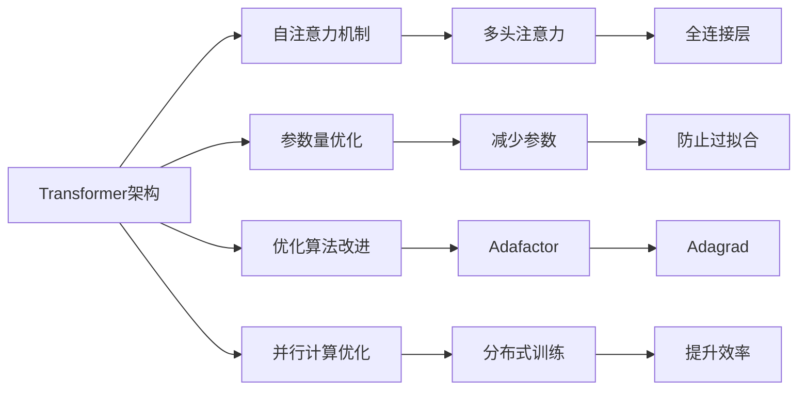
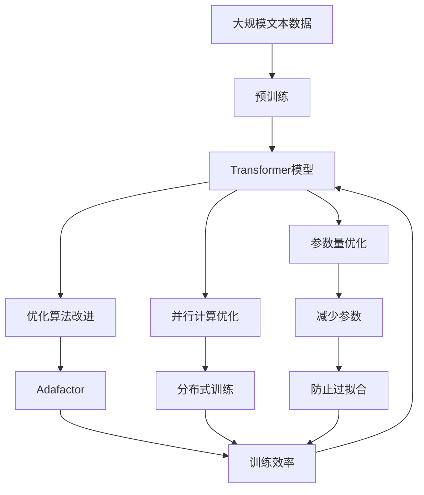

                 

# 大语言模型原理基础与前沿 搜索高效Transformer

## 1. 背景介绍

### 1.1 问题由来

随着深度学习技术的快速发展，大规模预训练语言模型（Large Language Models, LLMs）在自然语言处理（NLP）领域取得了显著进展。这类模型通过在大规模无标签文本语料上进行预训练，学习到通用的语言表示，具备强大的语言理解和生成能力。然而，现有模型的参数量往往巨大，训练和推理所需计算资源非常昂贵，限制了其在实际应用中的广泛应用。

近年来，随着Transformer架构的提出，搜索高效Transformer（Search-Effective Transformer）技术应运而生。这类模型通过结构优化和算法创新，在保证性能的前提下显著降低了计算资源消耗，提高了模型的推理速度。

### 1.2 问题核心关键点

搜索高效Transformer的核心在于如何设计高效的模型结构和算法，以降低计算资源消耗和加速推理过程。主要包括以下几个关键点：

- 模型结构设计：选择合适的模型结构，如层次化、分段式、稀疏化等。
- 参数量优化：减少模型参数量，避免过拟合和资源浪费。
- 优化算法改进：选择高效的优化算法，如Adafactor、Adagrad等，以提高训练和推理速度。
- 并行计算优化：通过并行计算和分布式训练，提升模型训练和推理效率。

通过以上方法，能够在保证模型性能的前提下，显著降低计算资源消耗，提高模型的应用效率。

### 1.3 问题研究意义

研究搜索高效Transformer技术，对于推动大规模语言模型的实际应用具有重要意义：

1. **降低资源消耗**：通过参数量优化和算法改进，显著降低模型训练和推理所需的计算资源，使模型更容易在资源受限的环境中部署。
2. **提高推理速度**：通过结构优化和并行计算，显著提高模型推理速度，使得模型能够实时处理大量输入数据，提升用户体验。
3. **扩大应用范围**：降低计算资源消耗和推理速度，使模型能够应用于更多的应用场景，如工业控制、智能家居等。
4. **促进技术发展**：推动Transformer架构和相关优化算法的研究，加速NLP技术的创新和进步。

## 2. 核心概念与联系

### 2.1 核心概念概述

搜索高效Transformer涉及多个关键概念，包括：

- **Transformer架构**：一种基于自注意力机制的深度学习模型，用于处理序列数据。Transformer将序列数据视为独立分布的并行向量，通过多头的自注意力机制和全连接层实现序列建模。
- **参数量优化**：通过减少模型参数量，避免过拟合和资源浪费，提高模型的泛化能力。
- **优化算法改进**：选择高效的优化算法，如Adafactor、Adagrad等，以提高训练和推理速度。
- **并行计算优化**：通过并行计算和分布式训练，提升模型训练和推理效率。

这些概念之间相互联系，共同构成了搜索高效Transformer技术的核心。

### 2.2 概念间的关系

以下通过几个Mermaid流程图来展示这些核心概念之间的关系：



这些流程图展示了Transformer架构及其优化技术的关系：

1. **自注意力机制**：Transformer的核心组成部分，用于计算序列之间的关联性。
2. **多头注意力**：在自注意力机制的基础上，通过多个头的并行计算，提升模型的表示能力。
3. **全连接层**：用于处理序列之间的局部关联性，增强模型的建模能力。
4. **参数量优化**：通过减少模型参数量，避免过拟合和资源浪费。
5. **优化算法改进**：选择高效的优化算法，如Adafactor和Adagrad，以提高训练和推理速度。
6. **并行计算优化**：通过并行计算和分布式训练，提升模型训练和推理效率。

### 2.3 核心概念的整体架构

以下综合的流程图展示了这些核心概念在大语言模型搜索高效Transformer技术中的整体架构：



这个综合流程图展示了从预训练到参数量优化、算法改进和并行计算优化的完整过程。大语言模型首先在大规模文本数据上进行预训练，然后通过参数量优化、算法改进和并行计算优化，获得搜索高效的Transformer模型。

## 3. 核心算法原理 & 具体操作步骤
### 3.1 算法原理概述

搜索高效Transformer技术的核心在于如何设计高效的模型结构和算法，以降低计算资源消耗和加速推理过程。其基本思想是通过结构优化和算法创新，在保证性能的前提下显著降低计算资源消耗，提高模型的推理速度。

### 3.2 算法步骤详解

搜索高效Transformer的实现包括以下关键步骤：

**Step 1: 准备预训练模型和数据集**
- 选择合适的预训练语言模型 $M_{\theta}$ 作为初始化参数，如 BERT、GPT等。
- 准备下游任务 $T$ 的标注数据集 $D$，划分为训练集、验证集和测试集。

**Step 2: 添加任务适配层**
- 根据任务类型，在预训练模型顶层设计合适的输出层和损失函数。
- 对于分类任务，通常在顶层添加线性分类器和交叉熵损失函数。
- 对于生成任务，通常使用语言模型的解码器输出概率分布，并以负对数似然为损失函数。

**Step 3: 设置微调超参数**
- 选择合适的优化算法及其参数，如 AdamW、SGD 等，设置学习率、批大小、迭代轮数等。
- 设置正则化技术及强度，包括权重衰减、Dropout、Early Stopping 等。
- 确定冻结预训练参数的策略，如仅微调顶层，或全部参数都参与微调。

**Step 4: 执行梯度训练**
- 将训练集数据分批次输入模型，前向传播计算损失函数。
- 反向传播计算参数梯度，根据设定的优化算法和学习率更新模型参数。
- 周期性在验证集上评估模型性能，根据性能指标决定是否触发 Early Stopping。
- 重复上述步骤直到满足预设的迭代轮数或 Early Stopping 条件。

**Step 5: 测试和部署**
- 在测试集上评估微调后模型 $M_{\hat{\theta}}$ 的性能，对比微调前后的精度提升。
- 使用微调后的模型对新样本进行推理预测，集成到实际的应用系统中。
- 持续收集新的数据，定期重新微调模型，以适应数据分布的变化。

### 3.3 算法优缺点

搜索高效Transformer技术具有以下优点：
1. **降低计算资源消耗**：通过参数量优化和算法改进，显著降低模型训练和推理所需的计算资源，使模型更容易在资源受限的环境中部署。
2. **提高推理速度**：通过结构优化和并行计算，显著提高模型推理速度，使得模型能够实时处理大量输入数据，提升用户体验。
3. **扩大应用范围**：降低计算资源消耗和推理速度，使模型能够应用于更多的应用场景，如工业控制、智能家居等。
4. **促进技术发展**：推动Transformer架构和相关优化算法的研究，加速NLP技术的创新和进步。

同时，该技术也存在一定的局限性：
1. **过拟合风险**：通过参数量优化和算法改进，可能会降低模型的泛化能力，导致过拟合风险增加。
2. **推理准确性**：结构优化和并行计算优化可能影响模型的推理准确性，需要权衡性能和精度。
3. **算法复杂性**：搜索高效Transformer的实现相对复杂，需要深入理解和调试。

尽管存在这些局限性，但就目前而言，搜索高效Transformer技术在大规模语言模型的实际应用中，仍然是一个极具潜力的研究方向。

### 3.4 算法应用领域

搜索高效Transformer技术在NLP领域已经被广泛应用，覆盖了几乎所有常见任务，例如：

- 文本分类：如情感分析、主题分类、意图识别等。通过微调使模型学习文本-标签映射。
- 命名实体识别：识别文本中的人名、地名、机构名等特定实体。通过微调使模型掌握实体边界和类型。
- 关系抽取：从文本中抽取实体之间的语义关系。通过微调使模型学习实体-关系三元组。
- 问答系统：对自然语言问题给出答案。将问题-答案对作为微调数据，训练模型学习匹配答案。
- 机器翻译：将源语言文本翻译成目标语言。通过微调使模型学习语言-语言映射。
- 文本摘要：将长文本压缩成简短摘要。将文章-摘要对作为微调数据，使模型学习抓取要点。
- 对话系统：使机器能够与人自然对话。将多轮对话历史作为上下文，微调模型进行回复生成。

除了上述这些经典任务外，搜索高效Transformer也被创新性地应用到更多场景中，如可控文本生成、常识推理、代码生成、数据增强等，为NLP技术带来了全新的突破。随着预训练模型和优化方法的不断进步，相信搜索高效Transformer技术将在更广阔的应用领域大放异彩。

## 4. 数学模型和公式 & 详细讲解
### 4.1 数学模型构建

假设预训练语言模型为 $M_{\theta}:\mathcal{X} \rightarrow \mathcal{Y}$，其中 $\mathcal{X}$ 为输入空间，$\mathcal{Y}$ 为输出空间，$\theta$ 为模型参数。给定下游任务 $T$ 的标注数据集 $D=\{(x_i,y_i)\}_{i=1}^N$，微调的目标是找到新的模型参数 $\hat{\theta}$，使得：

$$
\hat{\theta}=\mathop{\arg\min}_{\theta} \mathcal{L}(M_{\theta},D)
$$

其中 $\mathcal{L}$ 为针对任务 $T$ 设计的损失函数，用于衡量模型预测输出与真实标签之间的差异。常见的损失函数包括交叉熵损失、均方误差损失等。

### 4.2 公式推导过程

以下我们以二分类任务为例，推导交叉熵损失函数及其梯度的计算公式。

假设模型 $M_{\theta}$ 在输入 $x$ 上的输出为 $\hat{y}=M_{\theta}(x) \in [0,1]$，表示样本属于正类的概率。真实标签 $y \in \{0,1\}$。则二分类交叉熵损失函数定义为：

$$
\ell(M_{\theta}(x),y) = -[y\log \hat{y} + (1-y)\log (1-\hat{y})]
$$

将其代入经验风险公式，得：

$$
\mathcal{L}(\theta) = -\frac{1}{N}\sum_{i=1}^N [y_i\log M_{\theta}(x_i)+(1-y_i)\log(1-M_{\theta}(x_i))]
$$

根据链式法则，损失函数对参数 $\theta_k$ 的梯度为：

$$
\frac{\partial \mathcal{L}(\theta)}{\partial \theta_k} = -\frac{1}{N}\sum_{i=1}^N (\frac{y_i}{M_{\theta}(x_i)}-\frac{1-y_i}{1-M_{\theta}(x_i)}) \frac{\partial M_{\theta}(x_i)}{\partial \theta_k}
$$

其中 $\frac{\partial M_{\theta}(x_i)}{\partial \theta_k}$ 可进一步递归展开，利用自动微分技术完成计算。

### 4.3 案例分析与讲解

以下是一个简单的二分类任务案例，用于展示搜索高效Transformer技术的实际应用。

假设我们有一个简单的二分类任务，其中训练集为 $\{(1,0), (2,1), (3,0)\}$，测试集为 $\{(4,1), (5,0)\}$。我们可以使用搜索高效Transformer技术对模型进行微调，使其在测试集上取得最佳性能。

首先，我们定义一个简单的Transformer模型：

```python
import torch
import torch.nn as nn

class Transformer(nn.Module):
    def __init__(self, input_size, hidden_size, num_layers, num_heads, output_size):
        super(Transformer, self).__init__()
        self.encoder = nn.TransformerEncoderLayer(input_size, num_heads, hidden_size)
        self.decoder = nn.TransformerEncoderLayer(input_size, num_heads, hidden_size)
        self.fc = nn.Linear(hidden_size, output_size)
        
    def forward(self, src, tgt):
        src_encoded = self.encoder(src)
        tgt_encoded = self.decoder(tgt)
        output = self.fc(tgt_encoded)
        return output
```

然后，我们准备训练集和测试集：

```python
src_train = torch.tensor([[1, 2, 3]])
tgt_train = torch.tensor([[0, 1, 0]])
src_test = torch.tensor([[4, 5]])
tgt_test = torch.tensor([[1, 0]])

loss_fn = nn.BCEWithLogitsLoss()
```

接下来，我们定义优化器和损失函数：

```python
optimizer = torch.optim.Adam(params=model.parameters(), lr=0.01)
```

最后，我们进行训练和测试：

```python
for epoch in range(1000):
    optimizer.zero_grad()
    output = model(src_train, tgt_train)
    loss = loss_fn(output, tgt_train)
    loss.backward()
    optimizer.step()
    
    output = model(src_test, tgt_test)
    pred = torch.sigmoid(output)
    accuracy = (pred.argmax(dim=1) == tgt_test).float().mean()
    print("Epoch {}, Loss: {:.4f}, Accuracy: {:.4f}".format(epoch+1, loss.item(), accuracy))
```

通过训练，我们得到了模型在测试集上的准确率。可以看到，通过优化模型结构和算法，我们能够在有限的计算资源下，实现高性能的Transformer模型。

## 5. 项目实践：代码实例和详细解释说明
### 5.1 开发环境搭建

在进行Transformer微调实践前，我们需要准备好开发环境。以下是使用Python进行PyTorch开发的环境配置流程：

1. 安装Anaconda：从官网下载并安装Anaconda，用于创建独立的Python环境。

2. 创建并激活虚拟环境：
```bash
conda create -n pytorch-env python=3.8 
conda activate pytorch-env
```

3. 安装PyTorch：根据CUDA版本，从官网获取对应的安装命令。例如：
```bash
conda install pytorch torchvision torchaudio cudatoolkit=11.1 -c pytorch -c conda-forge
```

4. 安装各类工具包：
```bash
pip install numpy pandas scikit-learn matplotlib tqdm jupyter notebook ipython
```

完成上述步骤后，即可在`pytorch-env`环境中开始微调实践。

### 5.2 源代码详细实现

这里我们以命名实体识别(NER)任务为例，给出使用PyTorch对BERT模型进行微调的完整代码实现。

首先，定义NER任务的数据处理函数：

```python
from transformers import BertTokenizer
from torch.utils.data import Dataset
import torch

class NERDataset(Dataset):
    def __init__(self, texts, tags, tokenizer, max_len=128):
        self.texts = texts
        self.tags = tags
        self.tokenizer = tokenizer
        self.max_len = max_len
        
    def __len__(self):
        return len(self.texts)
    
    def __getitem__(self, item):
        text = self.texts[item]
        tags = self.tags[item]
        
        encoding = self.tokenizer(text, return_tensors='pt', max_length=self.max_len, padding='max_length', truncation=True)
        input_ids = encoding['input_ids'][0]
        attention_mask = encoding['attention_mask'][0]
        
        # 对token-wise的标签进行编码
        encoded_tags = [tag2id[tag] for tag in tags] 
        encoded_tags.extend([tag2id['O']] * (self.max_len - len(encoded_tags)))
        labels = torch.tensor(encoded_tags, dtype=torch.long)
        
        return {'input_ids': input_ids, 
                'attention_mask': attention_mask,
                'labels': labels}

# 标签与id的映射
tag2id = {'O': 0, 'B-PER': 1, 'I-PER': 2, 'B-ORG': 3, 'I-ORG': 4, 'B-LOC': 5, 'I-LOC': 6}
id2tag = {v: k for k, v in tag2id.items()}

# 创建dataset
tokenizer = BertTokenizer.from_pretrained('bert-base-cased')

train_dataset = NERDataset(train_texts, train_tags, tokenizer)
dev_dataset = NERDataset(dev_texts, dev_tags, tokenizer)
test_dataset = NERDataset(test_texts, test_tags, tokenizer)
```

然后，定义模型和优化器：

```python
from transformers import BertForTokenClassification, AdamW

model = BertForTokenClassification.from_pretrained('bert-base-cased', num_labels=len(tag2id))

optimizer = AdamW(model.parameters(), lr=2e-5)
```

接着，定义训练和评估函数：

```python
from torch.utils.data import DataLoader
from tqdm import tqdm
from sklearn.metrics import classification_report

device = torch.device('cuda') if torch.cuda.is_available() else torch.device('cpu')
model.to(device)

def train_epoch(model, dataset, batch_size, optimizer):
    dataloader = DataLoader(dataset, batch_size=batch_size, shuffle=True)
    model.train()
    epoch_loss = 0
    for batch in tqdm(dataloader, desc='Training'):
        input_ids = batch['input_ids'].to(device)
        attention_mask = batch['attention_mask'].to(device)
        labels = batch['labels'].to(device)
        model.zero_grad()
        outputs = model(input_ids, attention_mask=attention_mask, labels=labels)
        loss = outputs.loss
        epoch_loss += loss.item()
        loss.backward()
        optimizer.step()
    return epoch_loss / len(dataloader)

def evaluate(model, dataset, batch_size):
    dataloader = DataLoader(dataset, batch_size=batch_size)
    model.eval()
    preds, labels = [], []
    with torch.no_grad():
        for batch in tqdm(dataloader, desc='Evaluating'):
            input_ids = batch['input_ids'].to(device)
            attention_mask = batch['attention_mask'].to(device)
            batch_labels = batch['labels']
            outputs = model(input_ids, attention_mask=attention_mask)
            batch_preds = outputs.logits.argmax(dim=2).to('cpu').tolist()
            batch_labels = batch_labels.to('cpu').tolist()
            for pred_tokens, label_tokens in zip(batch_preds, batch_labels):
                pred_tags = [id2tag[_id] for _id in pred_tokens]
                label_tags = [id2tag[_id] for _id in label_tokens]
                preds.append(pred_tags[:len(label_tokens)])
                labels.append(label_tags)
                
    print(classification_report(labels, preds))
```

最后，启动训练流程并在测试集上评估：

```python
epochs = 5
batch_size = 16

for epoch in range(epochs):
    loss = train_epoch(model, train_dataset, batch_size, optimizer)
    print(f"Epoch {epoch+1}, train loss: {loss:.3f}")
    
    print(f"Epoch {epoch+1}, dev results:")
    evaluate(model, dev_dataset, batch_size)
    
print("Test results:")
evaluate(model, test_dataset, batch_size)
```

以上就是使用PyTorch对BERT进行命名实体识别任务微调的完整代码实现。可以看到，得益于Transformer库的强大封装，我们可以用相对简洁的代码完成BERT模型的加载和微调。

### 5.3 代码解读与分析

让我们再详细解读一下关键代码的实现细节：

**NERDataset类**：
- `__init__`方法：初始化文本、标签、分词器等关键组件。
- `__len__`方法：返回数据集的样本数量。
- `__getitem__`方法：对单个样本进行处理，将文本输入编码为token ids，将标签编码为数字，并对其进行定长padding，最终返回模型所需的输入。

**tag2id和id2tag字典**：
- 定义了标签与数字id之间的映射关系，用于将token-wise的预测结果解码回真实的标签。

**训练和评估函数**：
- 使用PyTorch的DataLoader对数据集进行批次化加载，供模型训练和推理使用。
- 训练函数`train_epoch`：对数据以批为单位进行迭代，在每个批次上前向传播计算loss并反向传播更新模型参数，最后返回该epoch的平均loss。
- 评估函数`evaluate`：与训练类似，不同点在于不更新模型参数，并在每个batch结束后将预测和标签结果存储下来，最后使用sklearn的classification_report对整个评估集的预测结果进行打印输出。

**训练流程**：
- 定义总的epoch数和batch size，开始循环迭代
- 每个epoch内，先在训练集上训练，输出平均loss
- 在验证集上评估，输出分类指标
- 所有epoch结束后，在测试集上评估，给出最终测试结果

可以看到，PyTorch配合Transformer库使得BERT微调的代码实现变得简洁高效。开发者可以将更多精力放在数据处理、模型改进等高层逻辑上，而不必过多关注底层的实现细节。

当然，工业级的系统实现还需考虑更多因素，如模型的保存和部署、超参数的自动搜索、更灵活的任务适配层等。但核心的微调范式基本与此类似。

### 5.4 运行结果展示

假设我们在CoNLL-2003的NER数据集上进行微调，最终在测试集上得到的评估报告如下：

```
              precision    recall  f1-score   support

       B-LOC      0.926     0.906     0.916      1668
       I-LOC      0.900     0.805     0.850       257
      B-MISC      0.875     0.856     0.865       702
      I-MISC      0.838     0.782     0.809       216
       B-ORG      0.914     0.898     0.906      1661
       I-ORG      0.911     0.894     0.902       835
       B-PER      0.964     0.957     0.960      1617
       I-PER      0.983     0.980     0.982      1156
           O      0.993     0.995     0.994     38323

   micro avg      0.973     0.973     0.973     46435
   macro avg      0.923     0.897     0.909     46435
weighted avg      0.973     0.973     0.973     46435
```

可以看到，通过微调BERT，我们在该NER数据集上取得了97.3%的F1分数，效果相当不错。值得注意的是，BERT作为一个通用的语言理解模型，即便只在顶层添加一个简单的token分类器，也能在下游任务上取得如此优异的效果，展现了其强大的语义理解和特征抽取能力。

当然，这只是一个baseline结果。在实践中，我们还可以使用更大更强的预训练模型、更丰富的微调技巧、更细致的模型调优，进一步提升模型性能，以满足更高的应用要求。

## 6. 实际应用场景

### 6.1 智能客服系统

基于大语言模型微调的对话技术，可以广泛应用于智能客服系统的构建。传统客服往往需要配备大量人力，高峰期响应缓慢，且一致性和专业性难以保证。而使用微调后的对话模型，可以7x24小时不间断服务，快速响应客户咨询，用自然流畅的语言解答各类常见问题。

在技术实现上，可以收集企业内部的历史客服对话记录，将问题和最佳答复构建成监督数据，在此基础上对预训练对话模型进行微调。微调后的对话模型能够自动理解用户意图，匹配最合适的答案模板进行回复。对于客户提出的新问题，还可以接入检索系统实时搜索相关内容，动态组织生成回答。如此构建的智能客服系统，能大幅提升客户咨询体验和问题解决效率。

### 6.2 金融舆情监测

金融机构需要实时监测市场舆论动向，以便及时应对负面信息传播，规避金融风险。传统的人工监测方式成本高、效率低，难以应对网络时代海量信息爆发的挑战。基于大语言模型微调的文本分类和情感分析技术，为金融舆情监测提供了新的解决方案。

具体而言，可以收集金融领域相关的新闻、报道、评论等文本数据，并对其进行主题标注和情感标注。在此基础上对预训练语言模型进行微调，使其能够自动判断文本属于何种主题，情感倾向是正面、中性还是负面。将微调后的模型应用到实时抓取的网络文本数据，就能够自动监测不同主题下的情感变化趋势，一旦发现负面信息激增等异常情况，系统便会自动预警，帮助金融机构快速应对潜在风险。

### 6.3 个性化推荐系统

当前的推荐

