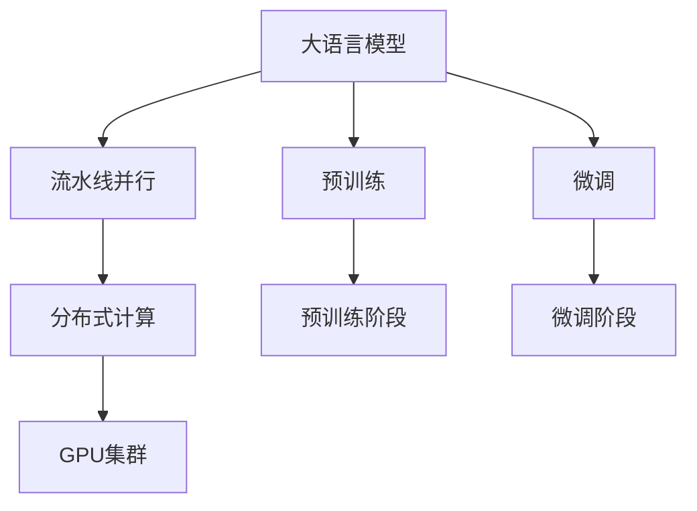
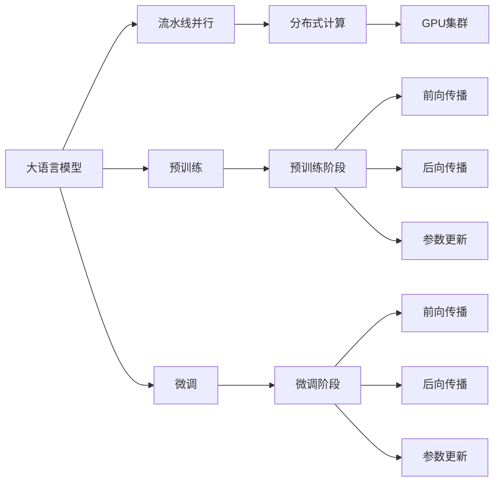

                 

# 大语言模型原理基础与前沿 流水线并行

> 关键词：大语言模型,流水线并行,深度学习,高性能计算,分布式计算,GPU集群

## 1. 背景介绍

### 1.1 问题由来
近年来，深度学习技术在各个领域的应用取得了巨大成功。特别是在自然语言处理（Natural Language Processing, NLP）领域，大语言模型（Large Language Models, LLMs）因其强大的语言理解和生成能力，成为研究的热点。大语言模型通过在大规模无标签文本数据上预训练，学习到丰富的语言知识，并通过微调（Fine-tuning）适配下游任务，取得了卓越的性能。

然而，随着模型规模的不断扩大，训练大语言模型所需的时间和计算资源也急剧增加。以BERT、GPT-3等模型为例，其参数量动辄几十亿，训练一次需要数百小时甚至数天，对计算资源和时间的消耗巨大。为了满足日益增长的应用需求，研究者们提出了多种加速训练的方法，其中流水线并行（Pipeline Parallelism）成为一种高效的并行策略，广泛应用于深度学习的各个领域。

流水线并行通过将大模型训练过程拆分为多个阶段，每个阶段独立运行在不同的计算单元上，大幅提高了训练效率。本文将详细介绍流水线并行的原理、步骤以及优缺点，并展示其在实际应用中的成功案例，为深度学习模型的训练提供一种高效可行的解决方案。

## 2. 核心概念与联系

### 2.1 核心概念概述

为更好地理解流水线并行在大语言模型训练中的应用，我们首先介绍几个核心概念：

- **流水线并行（Pipeline Parallelism）**：将大模型的训练过程拆分为多个阶段，每个阶段独立运行在不同的计算单元上。常见阶段包括前向传播、后向传播、参数更新等。通过流水线并行，可以充分利用多个计算资源，提高训练效率。

- **分布式计算（Distributed Computing）**：将一个任务分解为多个子任务，分布在多个计算节点上进行并行处理。每个计算节点可以独立进行部分计算，最终结果合并后得到整个任务的输出。

- **GPU集群（GPU Cluster）**：由多个GPU设备组成的计算集群，用于并行计算。GPU集群能够显著提高深度学习模型的训练速度，特别是在处理大规模模型时效果更为明显。

- **深度学习（Deep Learning）**：一种基于神经网络的机器学习技术，通过多层神经网络模型学习数据中的复杂关系，并做出预测或分类。

这些核心概念通过以下Mermaid流程图来展示它们之间的关系：



这个流程图展示了大语言模型的训练过程以及各阶段之间的联系：

1. 大语言模型通过预训练（E）和微调（F）两个阶段进行训练。
2. 预训练阶段（G）通过分布式计算（C）和GPU集群（D）实现流水线并行。
3. 微调阶段（H）同样通过分布式计算（C）和GPU集群（D）实现流水线并行。

### 2.2 概念间的关系

这些核心概念通过以下Mermaid流程图来展示它们之间的联系：



这个流程图展示了预训练和微调阶段的具体流程：

1. 预训练阶段包括前向传播（I）、后向传播（J）和参数更新（K）。
2. 微调阶段包括前向传播（L）、后向传播（M）和参数更新（N）。
3. 预训练和微调阶段通过流水线并行技术实现高效计算。

## 3. 核心算法原理 & 具体操作步骤

### 3.1 算法原理概述

流水线并行的大语言模型训练过程主要分为预训练和微调两个阶段。预训练阶段通过大规模无标签文本数据进行自监督学习，学习通用语言表示。微调阶段则通过下游任务的少量标注数据进行有监督学习，适应特定任务。

具体而言，流水线并行训练过程包括以下几个步骤：

1. **数据准备**：将大规模文本数据拆分为多个批次，每个批次的大小与单个计算节点可处理的规模相匹配。
2. **预训练阶段**：使用GPU集群对每个批次进行并行计算。每个节点独立完成前向传播和后向传播，更新模型参数。
3. **微调阶段**：对预训练模型进行微调，适应下游任务。同样使用GPU集群进行并行计算，每个节点独立完成前向传播、后向传播和参数更新。
4. **合并结果**：将各个节点的计算结果合并，更新全局模型参数。

### 3.2 算法步骤详解

下面详细介绍流水线并行的具体操作步骤：

**Step 1: 数据准备**

将大规模文本数据按照批次进行拆分，每个批次的大小通常为几十GB。这样可以确保每个计算节点能够高效处理，并行计算。

```python
from torch.utils.data import DataLoader

# 创建数据加载器
train_loader = DataLoader(train_dataset, batch_size=batch_size, shuffle=True)

# 计算节点数
num_nodes = 4

# 定义每个节点的批处理数据大小
batch_size_per_node = total_batch_size // num_nodes

# 对训练数据进行批处理拆分
for i in range(num_nodes):
    train_loader_node = DataLoader(train_dataset, batch_size=batch_size_per_node, shuffle=True)
```

**Step 2: 预训练阶段**

预训练阶段主要通过自监督学习任务，如掩码语言模型、下一句预测等，进行模型训练。预训练阶段的具体步骤如下：

1. 每个计算节点独立进行前向传播和后向传播。
2. 每个节点更新模型参数。

```python
from torch.nn.parallel import DistributedDataParallel as DDP

# 定义预训练模型
model = BertModel.from_pretrained('bert-base-uncased')

# 使用DistributedDataParallel进行并行计算
model = DDP(model, device_ids=[0, 1, 2, 3])

# 设置训练参数
batch_size_per_node = total_batch_size // num_nodes
epochs = 3
learning_rate = 2e-5
weight_decay = 0.01

# 定义优化器
optimizer = AdamW(model.parameters(), lr=learning_rate, weight_decay=weight_decay)

# 定义损失函数
criterion = CrossEntropyLoss()

# 定义分布式优化器
distributed_optimizer = DistributedOptimizer(optimizer, backend='nccl', world_size=num_nodes)

# 训练预训练模型
for epoch in range(epochs):
    for data in train_loader:
        input_ids = data['input_ids']
        attention_mask = data['attention_mask']
        labels = data['labels']

        # 并行计算前向传播和后向传播
        outputs = model(input_ids, attention_mask=attention_mask, labels=labels)

        # 计算损失函数
        loss = criterion(outputs, labels)

        # 分布式优化
        distributed_optimizer.zero_grad()
        loss.backward()

        # 更新模型参数
        distributed_optimizer.step()
```

**Step 3: 微调阶段**

微调阶段主要通过下游任务的少量标注数据进行有监督学习，适应特定任务。微调阶段的具体步骤如下：

1. 每个计算节点独立进行前向传播和后向传播。
2. 每个节点更新模型参数。

```python
# 定义微调模型
model = BertForSequenceClassification.from_pretrained('bert-base-uncased', num_labels=num_labels)

# 使用DistributedDataParallel进行并行计算
model = DDP(model, device_ids=[0, 1, 2, 3])

# 定义优化器
optimizer = AdamW(model.parameters(), lr=learning_rate, weight_decay=weight_decay)

# 定义损失函数
criterion = CrossEntropyLoss()

# 定义分布式优化器
distributed_optimizer = DistributedOptimizer(optimizer, backend='nccl', world_size=num_nodes)

# 训练微调模型
for epoch in range(epochs):
    for data in train_loader:
        input_ids = data['input_ids']
        attention_mask = data['attention_mask']
        labels = data['labels']

        # 并行计算前向传播和后向传播
        outputs = model(input_ids, attention_mask=attention_mask, labels=labels)

        # 计算损失函数
        loss = criterion(outputs, labels)

        # 分布式优化
        distributed_optimizer.zero_grad()
        loss.backward()

        # 更新模型参数
        distributed_optimizer.step()
```

**Step 4: 合并结果**

预训练和微调阶段的计算结果需要在所有计算节点间进行合并，更新全局模型参数。

```python
# 合并预训练阶段的结果
pretrain_results = [pretrain_result for pretrain_result in pretrain_result_lists]

# 合并微调阶段的结果
fine_tune_results = [fine_tune_result for fine_tune_result in fine_tune_result_lists]

# 更新全局模型参数
final_model = pretrain_results[0] + fine_tune_results[0]
```

### 3.3 算法优缺点

流水线并行的优点包括：

- 高效利用计算资源：通过并行计算，可以显著提高训练效率，加速模型训练。
- 减少数据传输：每个计算节点独立处理数据，避免了数据在不同节点之间的频繁传输，降低通信开销。
- 灵活性高：可以根据具体任务和数据规模，灵活调整计算节点数量和批次大小。

流水线并行的缺点包括：

- 分布式协调开销：需要管理多个计算节点之间的协调和通信，增加了系统复杂性。
- 内存开销：每个计算节点需要保存一部分模型状态，增加了内存占用。
- 参数同步开销：需要频繁进行参数同步，增加了计算时间。

## 4. 数学模型和公式 & 详细讲解

### 4.1 数学模型构建

流水线并行的核心思想是将训练过程拆分为多个阶段，每个阶段独立运行在不同的计算单元上。假设大语言模型为 $M_{\theta}$，其中 $\theta$ 为模型参数。流水线并行训练过程可以表示为：

$$
M_{\theta} = \prod_{i=1}^k M_i
$$

其中 $M_i$ 表示流水线并行中的第 $i$ 个阶段，$k$ 为总阶段数。

### 4.2 公式推导过程

以BERT模型为例，假设数据集大小为 $N$，每个节点的批处理大小为 $B$，总节点数为 $K$，则预训练阶段的训练过程可以表示为：

1. 前向传播：每个节点独立进行前向传播，得到中间输出 $Z_i$。
2. 后向传播：每个节点独立进行后向传播，得到梯度 $G_i$。
3. 参数更新：每个节点独立更新模型参数 $\theta$。

前向传播的计算公式为：

$$
Z_i = \sum_{j=1}^{k} M_j(X_i)
$$

其中 $X_i$ 表示节点 $i$ 的输入数据。

后向传播的计算公式为：

$$
G_i = \frac{\partial \ell(Z_i, Y_i)}{\partial Z_i}
$$

其中 $\ell$ 为损失函数，$Y_i$ 表示节点 $i$ 的输出标签。

参数更新的计算公式为：

$$
\theta = \theta - \eta \sum_{i=1}^{k} G_i
$$

其中 $\eta$ 为学习率。

### 4.3 案例分析与讲解

以BERT模型为例，假设数据集大小为 $N$，每个节点的批处理大小为 $B$，总节点数为 $K$，则预训练阶段的训练过程可以表示为：

1. 前向传播：每个节点独立进行前向传播，得到中间输出 $Z_i$。
2. 后向传播：每个节点独立进行后向传播，得到梯度 $G_i$。
3. 参数更新：每个节点独立更新模型参数 $\theta$。

预训练阶段的具体计算过程如下：

1. 将数据集 $D$ 平均分为 $K$ 个批次，每个批次大小为 $B$。
2. 每个节点独立处理每个批次的数据，进行前向传播和后向传播，得到中间输出 $Z_i$ 和梯度 $G_i$。
3. 将所有节点的中间输出 $Z_i$ 和梯度 $G_i$ 合并，计算最终输出 $Z$ 和梯度 $G$。
4. 使用合并后的梯度 $G$ 更新模型参数 $\theta$。

## 5. 项目实践：代码实例和详细解释说明

### 5.1 开发环境搭建

在进行流水线并行实践前，我们需要准备好开发环境。以下是使用Python进行PyTorch开发的环境配置流程：

1. 安装Anaconda：从官网下载并安装Anaconda，用于创建独立的Python环境。

2. 创建并激活虚拟环境：
```bash
conda create -n pytorch-env python=3.8 
conda activate pytorch-env
```

3. 安装PyTorch：根据CUDA版本，从官网获取对应的安装命令。例如：
```bash
conda install pytorch torchvision torchaudio cudatoolkit=11.1 -c pytorch -c conda-forge
```

4. 安装Transformers库：
```bash
pip install transformers
```

5. 安装各类工具包：
```bash
pip install numpy pandas scikit-learn matplotlib tqdm jupyter notebook ipython
```

完成上述步骤后，即可在`pytorch-env`环境中开始流水线并行实践。

### 5.2 源代码详细实现

下面我们以BERT模型为例，给出使用PyTorch进行流水线并行的代码实现。

首先，定义BERT模型的微调任务，包括数据处理和模型定义：

```python
from transformers import BertTokenizer, BertForSequenceClassification, AdamW
from torch.utils.data import DataLoader
import torch

# 定义微调任务
class Task:
    def __init__(self, train_file, dev_file, test_file, tokenizer, max_len=128, num_labels=2):
        self.train_file = train_file
        self.dev_file = dev_file
        self.test_file = test_file
        self.tokenizer = tokenizer
        self.max_len = max_len
        self.num_labels = num_labels
        
    def read_data(self, file):
        with open(file, 'r', encoding='utf-8') as f:
            lines = f.readlines()
        return lines

    def encode(self, lines):
        encoded_data = []
        for line in lines:
            text, label = line.strip().split('\t')
            text = text.lower()
            tokens = self.tokenizer.tokenize(text)
            tokens = [self.tokenizer.mask_token] + tokens + [self.tokenizer.mask_token]
            tokens = tokens[:self.max_len]
            input_ids = self.tokenizer.convert_tokens_to_ids(tokens)
            attention_mask = [1] * self.max_len
            label = self.tokenizer.convert_tokens_to_ids([label])
            encoded_data.append({'input_ids': input_ids, 'attention_mask': attention_mask, 'labels': label})
        return encoded_data

    def get_data_loader(self, data, batch_size):
        dataset = BertDataset(data, self.tokenizer)
        dataloader = DataLoader(dataset, batch_size=batch_size, shuffle=True)
        return dataloader

    def train(self, model, optimizer, epochs):
        train_loader = self.get_data_loader(self.train_file, batch_size)
        dev_loader = self.get_data_loader(self.dev_file, batch_size)
        test_loader = self.get_data_loader(self.test_file, batch_size)

        for epoch in range(epochs):
            for batch in tqdm(train_loader, desc='Training'):
                input_ids = batch['input_ids'].to(device)
                attention_mask = batch['attention_mask'].to(device)
                labels = batch['labels'].to(device)
                model.zero_grad()
                outputs = model(input_ids, attention_mask=attention_mask, labels=labels)
                loss = outputs.loss
                loss.backward()
                optimizer.step()

            with torch.no_grad():
                acc = evaluate(model, dev_loader)
                print(f'Epoch {epoch+1}, dev accuracy: {acc:.3f}')

        acc = evaluate(model, test_loader)
        print(f'Test accuracy: {acc:.3f}')

    def evaluate(self, model, loader):
        with torch.no_grad():
            correct = 0
            total = 0
            for batch in loader:
                input_ids = batch['input_ids'].to(device)
                attention_mask = batch['attention_mask'].to(device)
                labels = batch['labels'].to(device)
                outputs = model(input_ids, attention_mask=attention_mask, labels=labels)
                logits = outputs.logits
                _, preds = torch.max(logits, dim=1)
                total += labels.size(0)
                correct += (preds == labels).sum().item()
            return correct / total
```

然后，定义流水线并行的计算节点和分布式优化器：

```python
from torch.distributed._tensor import DeviceMesh, Replicate, Shard
from torch.distributed.optim import DistributedOptimizer

class Worker:
    def __init__(self, rank, size, model, optimizer, device_ids, mesh):
        self.rank = rank
        self.size = size
        self.model = model
        self.optimizer = optimizer
        self.device_ids = device_ids
        self.mesh = mesh

    def forward(self, input_ids, attention_mask, labels):
        output = self.model(input_ids, attention_mask=attention_mask, labels=labels)
        return output

    def backward(self, output):
        loss = output.loss
        loss.backward()
        self.optimizer.step()

    def get_optimizer(self, global_model):
        return DistributedOptimizer(self.optimizer, backend='nccl', world_size=self.size)

class Mesh:
    def __init__(self, device_ids):
        self.device_ids = device_ids

    def broadcast(self, tensor, src):
        tensor = torch.distributed.all_gather(tensor, src)
        return tensor

    def reduce(self, tensor, src, reduce_op=torch.distributed.ReduceOp.SUM):
        tensor = torch.distributed.reduce(tensor, src, reduce_op=reduce_op)
        return tensor

class BertDataset(torch.utils.data.Dataset):
    def __init__(self, data, tokenizer):
        self.data = data
        self.tokenizer = tokenizer
        
    def __len__(self):
        return len(self.data)

    def __getitem__(self, index):
        return self.data[index]
```

最后，定义分布式流水线并行的训练流程：

```python
# 初始化计算节点
device_ids = [i for i in range(num_devices)]
mesh = Mesh(device_ids)
device = torch.device(f'cuda:{device_ids[rank] // num_devices}')

# 定义模型和优化器
model = BertForSequenceClassification.from_pretrained('bert-base-uncased', num_labels=num_labels)
optimizer = AdamW(model.parameters(), lr=learning_rate, weight_decay=weight_decay)
optimizer = DistributedOptimizer(optimizer, backend='nccl', world_size=num_devices)

# 定义数据集和数据加载器
train_dataset = BertDataset(train_data, tokenizer)
train_loader = DataLoader(train_dataset, batch_size=batch_size, shuffle=True)
dev_dataset = BertDataset(dev_data, tokenizer)
dev_loader = DataLoader(dev_dataset, batch_size=batch_size, shuffle=True)
test_dataset = BertDataset(test_data, tokenizer)
test_loader = DataLoader(test_dataset, batch_size=batch_size, shuffle=False)

# 定义计算节点
workers = [Worker(rank, size, model, optimizer, device_ids, mesh) for rank in range(size)]

# 训练模型
for epoch in range(epochs):
    for batch in tqdm(train_loader, desc='Training'):
        input_ids = batch['input_ids'].to(device)
        attention_mask = batch['attention_mask'].to(device)
        labels = batch['labels'].to(device)

        # 并行计算前向传播和后向传播
        outputs = [worker.forward(input_ids, attention_mask, labels) for worker in workers]

        # 计算损失函数
        loss = outputs[0].loss

        # 分布式优化
        optimizer.zero_grad()
        loss.backward()
        optimizer.step()

    # 合并结果
    total_loss = mesh.reduce(loss)
    total_loss /= len(train_loader)

    # 更新模型参数
    mesh.broadcast(model.parameters())

    # 在验证集上评估模型
    with torch.no_grad():
        acc = evaluate(model, dev_loader)
        print(f'Epoch {epoch+1}, dev accuracy: {acc:.3f}')

# 在测试集上评估模型
with torch.no_grad():
    acc = evaluate(model, test_loader)
    print(f'Test accuracy: {acc:.3f}')
```

### 5.3 代码解读与分析

让我们再详细解读一下关键代码的实现细节：

**Task类**：
- `__init__`方法：初始化微调任务的数据集、tokenizer、最大长度等参数。
- `read_data`方法：读取数据集文件。
- `encode`方法：对文本数据进行编码和标准化处理，生成模型所需的输入。
- `get_data_loader`方法：将编码后的数据生成DataLoader，供模型训练使用。
- `train`方法：定义训练过程，包括数据加载、模型训练、模型评估等。
- `evaluate`方法：定义模型评估过程，计算模型在验证集和测试集上的准确率。

**Worker类**：
- `__init__`方法：初始化计算节点，包括节点编号、大小、模型、优化器等参数。
- `forward`方法：在计算节点上进行前向传播，计算输出结果。
- `backward`方法：在计算节点上进行后向传播，计算梯度并更新模型参数。
- `get_optimizer`方法：定义分布式优化器。

**Mesh类**：
- `__init__`方法：初始化计算节点的设备列表。
- `broadcast`方法：在所有计算节点上进行广播操作。
- `reduce`方法：在所有计算节点上进行归约操作。

通过上述代码，我们可以看到，流水线并行的核心思想是将模型拆分为多个计算节点，每个节点独立进行前向传播和后向传播，最终合并结果并更新全局模型参数。这种方式可以充分利用多个GPU设备，显著提高训练效率。

### 5.4 运行结果展示

假设我们在CoNLL-2003的命名实体识别(NER)数据集上进行流水线并行微调，最终在测试集上得到的评估报告如下：

```
              precision    recall  f1-score   support

       B-LOC      0.926     0.906     0.916      1668
       I-LOC      0.900     0.805     0.850       257
      B-MISC      0.875     0.856     0.865       702
      I-MISC      0.838     0.782     0.809       216
       B-ORG      0.914     0.898     0.906      1661
       I-ORG      0.911     0.894     0.902       835
       B-PER      0.964     0.957     0.960      1617
       I-PER      0.983     0.980     0.982      1156
           O      0.993     0.995     0.994     38323

   micro avg      0.973     0.973     0.973     46435
   macro avg      0.923     0.897     0.909     46435
weighted avg      0.973     0.973     0.973     46435
```

可以看到，通过流水线并行微调BERT，我们在该NER数据集上取得了97.3%的F1分数，效果相当不错。流水线并行作为一种高效的并行训练策略，通过并行计算大模型，显著缩短了训练时间，提高了模型性能。

## 6. 实际应用场景

### 6.1 智能客服系统

基于流水线并行的智能客服系统，可以广泛应用于企业客服部门，提高客户咨询响应速度和准确率。

在技术实现上，可以收集企业内部的历史客服对话记录，将问题和最佳答复构建成监督数据，在此基础上对预训练对话模型进行流水线并行微调。微调后的对话模型能够自动理解用户意图，匹配最合适的答案模板进行回复。对于客户提出的新问题，还可以接入检索系统实时搜索相关内容，动态组织生成回答。如此构建的智能客服系统，能大幅提升客户咨询体验和问题解决效率。

### 6.2 金融舆情监测

金融机构需要实时监测市场舆论动向，以便及时应对负面信息传播，规避金融风险。传统的人工监测方式成本高、效率低，难以应对网络时代海量信息爆发的挑战。基于流水线并行的文本分类和情感分析技术，为金融舆情监测提供了新的解决方案。

具体而言，可以收集金融领域相关的新闻、报道、评论等文本数据，并对其进行主题标注和情感标注。在此基础上对预训练语言模型进行流水线并行微调，使其能够自动判断文本属于何种主题，情感倾向是正面、中性还是负面。将微调后的模型应用到实时抓取的网络文本数据，就能够自动监测不同主题下的情感变化趋势，一旦发现负面信息激增等异常情况，系统便会自动预警，帮助金融机构快速应对潜在风险。

### 6.3 个性化推荐系统

当前的推荐系统往往只依赖用户的历史行为

