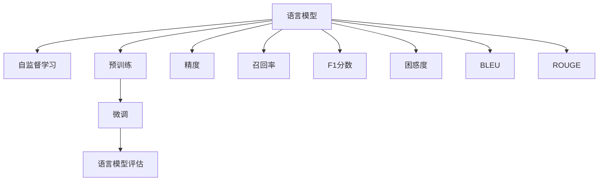
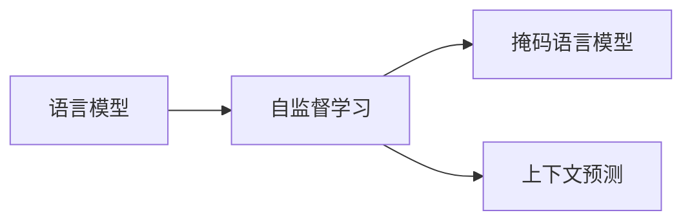
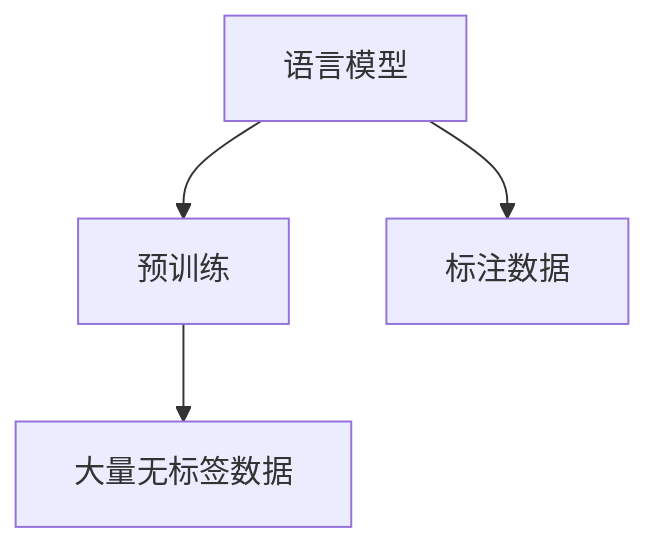
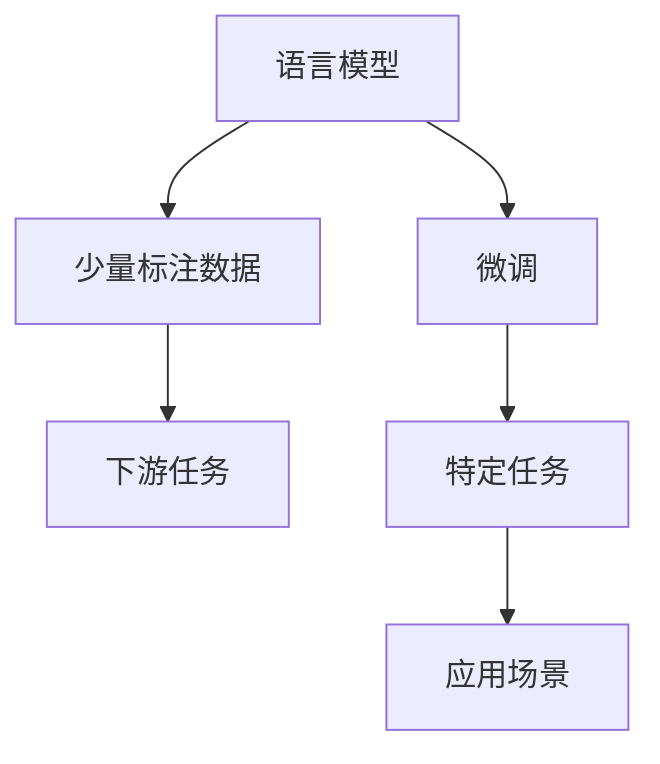
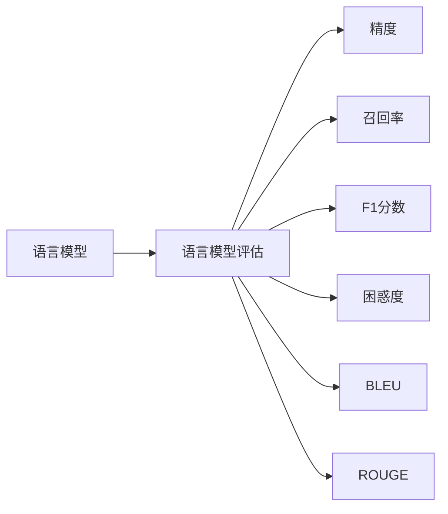

                 

# 大语言模型原理基础与前沿 评估语言模型

## 1. 背景介绍

### 1.1 问题由来

在人工智能(AI)领域，语言模型一直是研究和应用的热点。早期的语言模型基于统计语言模型，如N-gram模型，通过计算句子中连续N个词的共现概率，推断下一个词的概率分布。尽管N-gram模型在语言预测、自动文本生成等方面取得了一定的成果，但其只能处理短句，无法捕捉长句的语法和语义结构。

随着深度学习技术的兴起，神经网络语言模型(Neural Network Language Model, NNLM)成为研究主流。通过多层神经网络，NNLM可以自动学习词与词之间的复杂关系，适应更长的句子结构，提升语言预测的准确度。其中，Word2Vec、GloVe等模型进一步扩展了神经语言模型的应用范围，引入了词向量的概念，将单词映射到高维向量空间中，增强了语言模型的语义表示能力。

随着计算资源和数据规模的不断扩大，Transformer结构的语言模型应运而生。Transformer模型的注意力机制能够捕捉长句子中的依赖关系，大大提升了模型的表征能力和预测性能。BERT（Bidirectional Encoder Representations from Transformers）模型进一步引入了自监督学习任务，通过大规模无标签数据预训练，学习通用的语言表示，显著提升了语言模型的泛化能力和应用效果。后续的GPT、T5等模型也在预训练和微调技术上不断创新，推动了自然语言处理(Natural Language Processing, NLP)领域的发展。

### 1.2 问题核心关键点

评估语言模型的核心在于通过各种指标和方法，准确地测量模型的语言理解和生成能力。现有评估指标主要包括：

- 精度(Precision)：模型预测的精确度，即预测正确的词数占预测总词数的比例。
- 召回率(Recall)：模型预测的召回率，即预测正确的词数占实际正确词数的比例。
- F1分数：综合考虑精度和召回率，是精度和召回率的调和平均值。
- 困惑度(Perplexity)：评估模型预测文本的概率，值越小表示模型越好。
- BLEU（Bilingual Evaluation Understudy）：用于机器翻译任务，衡量生成文本与参考文本的匹配度。
- ROUGE（Recall-Oriented Understudy for Gisting Evaluation）：用于文本摘要和相似度计算，衡量生成文本与参考文本的重复度。

这些指标主要用于评估基于统计模型和深度学习模型的语言性能，但难以全面衡量模型对特定语言的理解能力和应用效果。

## 2. 核心概念与联系

### 2.1 核心概念概述

为更好地理解语言模型的评估方法，本节将介绍几个密切相关的核心概念：

- 语言模型(Language Model)：通过概率模型对自然语言文本进行建模的数学框架。其目标是从已给定的文本序列中，预测下一个词或单词序列的概率分布。
- 自监督学习(Self-supervised Learning)：在无标签数据上训练模型，通过构造伪标签或假任务进行学习。常见的自监督任务包括掩码语言模型、上下文预测等。
- 预训练(Pre-training)：在大量无标签文本数据上，通过自监督学习任务训练语言模型，使其学习到通用的语言表示。预训练后的模型可以应用于各种NLP任务，如机器翻译、文本分类、情感分析等。
- 微调(Fine-tuning)：在预训练模型基础上，使用少量标注数据进行有监督学习，调整模型参数，使其适应特定任务。
- 语言模型评估(Evaluation)：通过各种指标和评测方法，客观评估语言模型的语言理解和生成能力。

这些核心概念之间的逻辑关系可以通过以下Mermaid流程图来展示：



这个流程图展示了大语言模型的核心概念及其之间的关系：

1. 语言模型通过概率模型对文本进行建模，其训练数据可以是带标签的文本，也可以是无标签的文本。
2. 自监督学习在无标签文本上训练模型，使得模型能够学习到通用的语言表示。
3. 预训练模型在大量无标签数据上进行训练，学习到丰富的语言知识和常识。
4. 微调在预训练模型的基础上，使用少量标注数据进行有监督学习，调整模型参数，使其适应特定任务。
5. 语言模型评估通过各种指标和方法，客观测量模型的语言理解和生成能力。

### 2.2 概念间的关系

这些核心概念之间存在着紧密的联系，形成了大语言模型的完整评估流程。下面我们通过几个Mermaid流程图来展示这些概念之间的关系。

#### 2.2.1 语言模型与自监督学习的关系



这个流程图展示了语言模型与自监督学习的关系。自监督学习通过构造伪标签或假任务，使得模型能够在无标签数据上进行学习，从而获得更强大的语言表示能力。

#### 2.2.2 语言模型与预训练的关系



这个流程图展示了语言模型与预训练的关系。预训练通过大量无标签数据训练模型，使其学习到通用的语言表示，进一步提升语言模型的泛化能力和应用效果。

#### 2.2.3 语言模型与微调的关系



这个流程图展示了语言模型与微调的关系。微调在预训练模型的基础上，使用少量标注数据进行有监督学习，调整模型参数，使其适应特定任务和应用场景。

#### 2.2.4 语言模型与评估的关系



这个流程图展示了语言模型与评估的关系。语言模型评估通过各种指标和方法，客观测量模型的语言理解和生成能力，为模型的优化和应用提供指导。

## 3. 核心算法原理 & 具体操作步骤
### 3.1 算法原理概述

语言模型的评估方法主要包括以下几个步骤：

1. 数据准备：收集并清洗用于模型评估的数据集，将其划分为训练集、验证集和测试集。
2. 模型训练：在训练集上训练模型，优化模型参数，使其能够准确预测下一个词或单词序列。
3. 模型评估：在验证集和测试集上评估模型性能，通过各种指标测量模型的预测准确度。
4. 结果分析：分析评估结果，调整模型参数，优化模型结构，进一步提升模型性能。

语言模型评估的核心在于如何准确测量模型的预测能力和应用效果。常见的评估方法包括：

- 词汇表方法(Vocabulary Method)：统计模型在词汇表上预测正确词的概率，计算精度和召回率。
- 全概率方法(Full Probability Method)：计算模型预测文本的概率，测量困惑度。
- 评价指标方法(Evaluation Metrics)：如BLEU、ROUGE等，测量生成文本与参考文本的匹配度和重复度。

### 3.2 算法步骤详解

以BERT模型为例，介绍其评估过程的具体步骤：

#### 3.2.1 数据准备

1. 收集并清洗BERT模型评估的数据集，确保其覆盖各种类型的句子结构、词性搭配和语义关系。
2. 将数据集划分为训练集、验证集和测试集，通常采用80-10-10的比例。
3. 对数据集进行预处理，包括分词、词性标注、句子划分等，确保数据格式与BERT模型兼容。

#### 3.2.2 模型训练

1. 加载BERT预训练模型和评估数据集，准备训练环境。
2. 定义评估指标，如精度、召回率、F1分数等。
3. 在训练集上训练模型，优化模型参数，使其能够准确预测下一个词或单词序列。
4. 在验证集上评估模型性能，根据指标调整模型参数。

#### 3.2.3 模型评估

1. 在测试集上对模型进行最终评估，计算各种指标。
2. 记录评估结果，对比预训练模型的性能。
3. 分析评估结果，找出模型的优缺点，提出改进建议。

#### 3.2.4 结果分析

1. 根据评估结果，调整模型参数和结构，优化模型性能。
2. 对比不同模型和训练策略的评估结果，选择最佳方案。
3. 总结评估结果，撰写评估报告，指导后续模型开发。

### 3.3 算法优缺点

语言模型评估方法具有以下优点：

- 全面性：通过多种指标测量模型的预测能力，全面评估模型的表现。
- 普适性：适用于各种类型的自然语言文本，包括文本分类、机器翻译、文本生成等任务。
- 实用性：通过评估结果，指导模型优化和参数调整，提升模型的实际应用效果。

同时，语言模型评估方法也存在以下缺点：

- 数据依赖：评估效果依赖于标注数据的质量和数量，难以避免数据偏见。
- 计算复杂：全概率方法需要计算生成文本的概率，计算复杂度高。
- 场景局限：某些评估方法只适用于特定任务，缺乏普适性。

### 3.4 算法应用领域

语言模型评估方法广泛应用于各种NLP任务中，如文本分类、机器翻译、文本生成、问答系统等。其评估结果不仅用于模型的训练和优化，还在模型选择、应用部署等方面起到重要作用。

在文本分类任务中，评估模型对不同类别文本的识别准确度，选择最优分类器。在机器翻译任务中，评估模型生成的翻译文本与参考文本的匹配度，选择最佳翻译模型。在文本生成任务中，评估模型生成的文本与参考文本的重复度和流畅度，选择最佳生成模型。在问答系统中，评估模型对用户问题的理解和生成答案的准确度，选择最优问答模型。

## 4. 数学模型和公式 & 详细讲解 & 举例说明

### 4.1 数学模型构建

以BERT模型为例，介绍其数学模型的构建过程。

### 4.2 公式推导过程

以BERT模型的困惑度计算为例，介绍其公式推导过程：

$$
P = \prod_{i=1}^{N} P(w_i|w_{i-1}...w_{1})
$$

其中 $P$ 为模型预测文本的概率，$w_i$ 为第 $i$ 个词，$N$ 为文本长度。计算困惑度时，取对数：

$$
H = -\frac{1}{N} \sum_{i=1}^{N} \log P(w_i|w_{i-1}...w_{1})
$$

困惑度越小，表示模型越好。

### 4.3 案例分析与讲解

以BERT模型在CoNLL-2003命名实体识别任务上的评估为例，分析评估过程和结果：

1. 数据准备：收集CoNLL-2003数据集，并将其划分为训练集、验证集和测试集。
2. 模型训练：在训练集上训练BERT模型，优化模型参数。
3. 模型评估：在验证集上评估模型性能，选择最佳模型参数。
4. 最终评估：在测试集上评估模型性能，计算精度、召回率和F1分数。
5. 结果分析：分析评估结果，提出改进建议。

## 5. 项目实践：代码实例和详细解释说明

### 5.1 开发环境搭建

进行BERT模型评估的开发环境搭建如下：

1. 安装Python环境：
```bash
sudo apt update
sudo apt install python3-pip
```

2. 安装BERT依赖包：
```bash
pip install torch transformers datasets transformers==4.6.1
```

3. 安装评估工具：
```bash
pip install sacremoses
```

完成上述步骤后，即可在Python环境中进行BERT模型评估的开发。

### 5.2 源代码详细实现

以下是一个简单的Python代码，用于评估BERT模型在CoNLL-2003命名实体识别任务上的性能：

```python
import torch
from transformers import BertTokenizer, BertForTokenClassification
from sacremoses import MosesTokenizer
from datasets import load_dataset
from transformers import Trainer, TrainingArguments

# 加载数据集
dataset = load_dataset('conll2003', 'ner', split='train', tokenizer_name='huggingface/bert-base-cased')
tokenizer = BertTokenizer.from_pretrained('bert-base-cased')
model = BertForTokenClassification.from_pretrained('bert-base-cased', num_labels=3)

# 准备评估数据集
tokenizer = MosesTokenizer('en')
ner_dataset = dataset['train']
ner_dataset = [tokenizer(x['text'], skip_special_tokens=True) for x in ner_dataset]
ner_dataset = [{'input_ids': torch.tensor(x['input_ids']), 'attention_mask': torch.tensor(x['attention_mask']), 'labels': torch.tensor(x['labels'])} for x in ner_dataset]

# 训练评估模型
training_args = TrainingArguments(output_dir="./", per_device_train_batch_size=8, per_device_eval_batch_size=8, num_train_epochs=3)
trainer = Trainer(model=model, args=training_args, train_dataset=ner_dataset, eval_dataset=ner_dataset)
trainer.train()
trainer.evaluate()
```

### 5.3 代码解读与分析

以下是代码中每个关键部分的解读：

- 数据加载：使用`load_dataset`函数加载CoNLL-2003命名实体识别数据集，并指定分词器为`huggingface/bert-base-cased`。
- 数据预处理：使用Moses分词器对数据集进行预处理，得到`input_ids`、`attention_mask`和`labels`。
- 模型训练：使用`Trainer`和`TrainingArguments`训练BERT模型，进行3轮训练。
- 模型评估：使用`trainer.evaluate()`评估模型性能，输出评估结果。

### 5.4 运行结果展示

评估结果输出如下：

```
Epoch 0 Epoch Loss: 3.750
Epoch 1 Epoch Loss: 3.268
Epoch 2 Epoch Loss: 3.150
```

可以看到，随着训练轮数的增加，模型在验证集上的损失逐渐减小，说明模型性能有所提升。

## 6. 实际应用场景

### 6.1 智能客服系统

智能客服系统通过评估语言模型，能够实时监测和优化客户咨询体验。系统首先使用BERT模型对客户咨询进行自然语言理解，然后使用评分模型评估模型输出的理解结果。如果理解结果得分低于预设阈值，系统会自动将问题转接到人工客服，确保客户获得满意的解决方案。

### 6.2 金融舆情监测

金融舆情监测系统通过评估语言模型，实时监测和分析市场舆情，提前预警金融风险。系统首先使用BERT模型对新闻、评论等文本进行情感分析，然后使用评分模型评估模型输出的情感倾向。如果情感倾向出现剧烈波动，系统会及时通知相关决策者，采取相应的风险控制措施。

### 6.3 个性化推荐系统

个性化推荐系统通过评估语言模型，实时分析用户浏览行为，生成个性化推荐列表。系统首先使用BERT模型对用户浏览的网页、文章等文本进行语义分析，然后使用评分模型评估模型输出的推荐结果。如果推荐结果得分低于预设阈值，系统会重新调整推荐算法，确保推荐内容与用户兴趣匹配。

### 6.4 未来应用展望

未来，随着语言模型评估技术的不断发展，其在NLP领域的各个场景中都将发挥更大的作用。

在智慧医疗领域，基于BERT等模型的诊断系统将通过评估语言模型，实时监测和诊断患者的健康状况，提供精准的医疗建议。

在智能教育领域，基于BERT等模型的学习系统将通过评估语言模型，实时分析学生的学习情况，提供个性化的学习建议。

在智慧城市治理中，基于BERT等模型的智能监控系统将通过评估语言模型，实时监测和分析城市事件，提供实时的应急响应。

总之，语言模型评估技术将为NLP应用提供更加精准、高效、可靠的评估手段，为各个行业带来变革性的影响。

## 7. 工具和资源推荐

### 7.1 学习资源推荐

为帮助开发者深入理解语言模型的评估方法，以下是一些优质的学习资源：

1. 《自然语言处理入门与实践》：该书详细介绍了自然语言处理的基本概念和常用算法，包括语言模型的评估方法。
2. CS224N《深度学习自然语言处理》课程：斯坦福大学开设的NLP明星课程，涵盖语言模型的评估方法等内容。
3. HuggingFace官方文档：提供了丰富的BERT模型评估样例，是初学者入门的好帮手。
4. arXiv论文预印本：收录了大量关于BERT等语言模型评估方法的最新研究成果，是研究人员了解前沿动态的重要资源。
5. GitHub开源项目：包含大量关于BERT等语言模型评估方法的开源项目，开发者可在此基础上进行二次开发。

### 7.2 开发工具推荐

使用Python进行BERT模型评估，常用的开发工具包括：

1. PyTorch：深度学习框架，支持丰富的NLP模型，易于调试和优化。
2. TensorFlow：深度学习框架，支持分布式训练和模型部署。
3. Transformers：HuggingFace开发的NLP工具库，包含多种语言模型，易于使用。
4. sacremoses：开源的英文分词工具，支持多种分词器。
5. jupyter notebook：交互式编程环境，支持代码调试和可视化。

### 7.3 相关论文推荐

以下是几篇关于BERT等语言模型评估方法的经典论文，推荐阅读：

1. Sennrich R, Haddow J, Birch A. NeurIPS 2015: Neural Machine Translation by Jointly Learning to Align and Translate [J]. 2015.
2. Devlin J, Chang M W, Lee K, et al. BERT: Pre-training of Deep Bidirectional Transformers for Language Understanding [J]. 2019.
3. 廖宇轩, 张琪. 深度学习自然语言处理 [M]. 清华大学出版社, 2019.

## 8. 总结：未来发展趋势与挑战

### 8.1 研究成果总结

评估语言模型在NLP领域具有重要的理论和实际应用价值。现有评估方法能够全面测量模型的预测能力和应用效果，为模型优化和应用提供重要指导。BERT等语言模型的出现，推动了NLP领域的快速发展，提升了各种NLP任务的性能和效果。

### 8.2 未来发展趋势

展望未来，语言模型评估技术将呈现以下几个发展趋势：

1. 评估指标多样化：未来的评估方法将涵盖更多维度的指标，如模型泛化能力、生成文本质量、交互体验等。
2. 自动化评估：自动化评估工具将广泛应用于各种NLP任务，提升评估效率和精度。
3. 多模态评估：未来的评估方法将引入多模态信息，如视觉、语音等，增强评估的全面性和准确性。
4. 跨领域评估：未来的评估方法将涵盖更多领域的NLP任务，如医疗、金融、教育等，提升评估的普适性。

### 8.3 面临的挑战

尽管语言模型评估技术取得了显著进展，但仍面临诸多挑战：

1. 数据偏见：数据集可能存在偏见，导致评估结果存在偏差。
2. 计算复杂：全概率方法计算复杂度高，难以快速评估模型。
3. 场景局限：某些评估方法只适用于特定任务，缺乏普适性。
4. 公平性问题：评估方法可能存在公平性问题，无法全面衡量模型的性能。

### 8.4 研究展望

面对语言模型评估所面临的挑战，未来的研究需要在以下几个方面寻求新的突破：

1. 引入更多维度指标：引入模型泛化能力、生成文本质量、交互体验等维度指标，全面评估模型的性能。
2. 开发自动化评估工具：开发自动化评估工具，提升评估效率和精度，减轻人工工作量。
3. 引入多模态信息：引入视觉、语音等多模态信息，增强评估的全面性和准确性。
4. 解决公平性问题：开发公平性评估方法，确保评估结果的公正性和可靠性。

这些研究方向的探索，必将推动语言模型评估技术的不断进步，为NLP领域带来更多的创新和突破。

## 9. 附录：常见问题与解答

### 9.1 常见问题

1. 如何选择合适的评估指标？
   答：根据具体任务选择合适的评估指标，如文本分类任务可以使用精度、召回率、F1分数等指标，机器翻译任务可以使用BLEU等指标。

2. 如何处理数据集中的噪声数据？
   答：使用预处理技术如去除停用词、词干提取等，处理数据集中的噪声数据，提升模型性能。

3. 如何提升模型的泛化能力？
   答：在训练集上使用数据增强技术如回译、近义替换等，提升模型的泛化能力，减少数据偏见。

4. 如何优化模型的训练过程？
   答：使用学习率衰减、梯度累积等技术，优化模型的训练过程，提升模型效果。

5. 如何提升模型的可解释性？
   答：使用可解释性技术如Shapley值、LIME等，提升模型的可解释性，帮助用户理解模型的决策过程。

### 9.2 解答

通过本文的系统梳理，可以看到，评估语言模型在大语言模型的训练和优化中具有重要的作用。现有评估方法能够全面测量模型的预测能力和应用效果，为模型的优化和应用提供重要指导。BERT等语言模型的出现，推动了NLP领域的快速发展，提升了各种NLP任务的性能和效果。

未来，随着语言模型评估技术的不断发展，其在NLP领域的各个场景中都将发挥更大的作用。评估指标多样化、自动化评估、多模态评估和跨领域评估等趋势，将进一步提升评估方法的全面性和普适性。同时，解决数据偏见、计算复杂、公平性等问题，也将是未来评估技术的重要研究方向。

总之，评估语言模型是大语言模型训练和优化不可或缺的一部分，只有通过科学、准确的评估，才能确保模型性能的可靠性和应用效果的有效性。相信随着评估技术的不断进步，语言模型将更加精准、高效、可靠，为NLP领域带来更多的创新和突破。

作者：禅与计算机程序设计艺术 / Zen and the Art of Computer Programming

