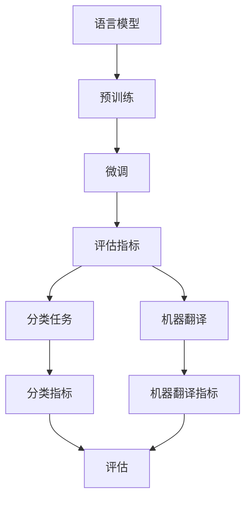

                 

# 大语言模型原理基础与前沿 评估语言模型

> 关键词：
大语言模型, 语言模型, 预训练, 微调, 评估指标, 性能分析, 应用场景

## 1. 背景介绍

### 1.1 问题由来
语言模型是自然语言处理(Natural Language Processing, NLP)中的基础模型，用于预测文本序列的概率分布，对文本进行建模和分析。近年来，随着深度学习技术的迅速发展，基于神经网络的语言模型取得了突破性进展，其中尤以预训练语言模型（Pre-trained Language Models, PLMs）最为引人注目。

预训练语言模型通过在大规模无标签文本数据上预训练，学习到丰富的语言知识和语义表示，能够在多种下游任务中实现良好的迁移学习能力。其中，BERT、GPT-3等模型由于其在多项任务上的卓越表现，成为当前NLP领域的研究热点。

然而，尽管预训练语言模型在许多任务上取得了显著的进展，但如何评估和改进语言模型的性能，特别是其在不同应用场景下的适应性和泛化能力，仍然是一个重要的研究方向。本文将围绕语言模型的评估指标和方法，探讨其在实际应用中的评估与优化。

### 1.2 问题核心关键点
语言模型的评估旨在综合考量模型在预测文本概率分布上的能力，以及其在具体任务上的表现。常用的评估指标包括但不限于：

- 准确率、精确率、召回率、F1分数等分类指标。
- BLEU、ROUGE、METEOR等机器翻译质量评估指标。
- 困惑度、交叉熵、KL散度等语言模型评估指标。

评估指标的选择应根据具体任务的特点和需求进行综合考虑。例如，对于分类任务，可以使用精确率、召回率等指标进行评估；而对于机器翻译任务，则应选择BLEU、ROUGE等指标。

此外，语言模型的评估还应结合上下文和任务的具体要求，考虑其在不同领域、不同数据分布下的适应性和泛化能力。这包括模型的鲁棒性、泛化性、可解释性等。

## 2. 核心概念与联系

### 2.1 核心概念概述

在进行语言模型评估时，需要理解以下几个核心概念：

- **语言模型**：预测给定上下文下的下一个词或词序列的概率分布的模型。常用的语言模型包括n-gram模型、RNN、Transformer等。
- **预训练语言模型**：在无标签数据上预训练得到的基础模型，用于提升下游任务的性能。常见的预训练模型包括BERT、GPT-3等。
- **微调**：在预训练语言模型的基础上，使用有标签数据对模型进行有监督的优化，以适应具体任务。
- **评估指标**：用于衡量模型在特定任务上表现的好坏，常见的评估指标包括准确率、精确率、召回率、F1分数、BLEU、ROUGE等。
- **可解释性**：语言模型的可解释性指模型输出的预测结果能够被人类理解和解释，特别是在高风险、高责任的应用领域中尤为重要。

这些核心概念共同构成了语言模型评估的理论基础，了解这些概念及其相互关系，有助于更好地理解和应用语言模型评估方法。

### 2.2 概念间的关系

通过以下Mermaid流程图，可以直观地展示这些核心概念之间的联系：



这个流程图展示了语言模型从预训练到微调，再到评估指标的整个评估流程。其中，预训练是语言模型的基础，微调是对模型在特定任务上的优化，而评估指标则是衡量模型性能的重要工具。

## 3. 核心算法原理 & 具体操作步骤

### 3.1 算法原理概述

语言模型的评估涉及多个方面的评估，包括对模型预测的准确性、泛化能力、可解释性等进行综合考量。评估方法通常分为基于统计评估和基于实例评估两大类。

**基于统计评估**：使用统计学方法，如准确率、精确率、召回率、F1分数、BLEU、ROUGE等指标，对模型在不同任务上的性能进行量化评估。

**基于实例评估**：通过实例验证方法，如逐句对比、逐段落对比、全面评估等，对模型在具体任务上的表现进行直观评估。

评估过程中，通常需要构建一个包含训练集、验证集和测试集的评估框架，使用交叉验证等方法，对模型在不同数据集上的性能进行评估和比较。此外，还需要进行模型调优，如调整模型参数、优化训练流程等，以提升模型性能。

### 3.2 算法步骤详解

语言模型评估的具体步骤如下：

1. **准备数据集**：收集训练集、验证集和测试集，确保数据集的多样性和代表性。
2. **模型选择与初始化**：选择合适的预训练语言模型，并进行初始化设置。
3. **模型微调**：使用有标签数据对模型进行微调，优化模型参数，提升模型在特定任务上的性能。
4. **评估指标选择**：根据具体任务，选择相应的评估指标。
5. **模型评估**：在测试集上对模型进行评估，计算各项指标，得到评估结果。
6. **模型调优**：根据评估结果，进行模型调优，进一步提升模型性能。
7. **模型部署与应用**：将优化后的模型部署到实际应用场景中，进行测试和优化。

### 3.3 算法优缺点

基于统计评估的方法具有以下优点：

- **高效快速**：使用量化指标可以快速评估模型性能，适用于大规模评估任务。
- **易于比较**：不同模型之间的性能比较更加直观，易于理解和分析。
- **适用于各种任务**：适用范围广泛，可以应用于分类、生成、翻译等多种任务。

其缺点包括：

- **缺乏上下文理解**：统计评估方法难以全面反映模型的上下文理解能力。
- **忽略细节**：统计指标只能反映模型整体性能，无法细粒度评估模型的表现。

基于实例评估的方法具有以下优点：

- **直观具体**：通过逐句或逐段落对比，能够直观反映模型的具体表现。
- **综合考量上下文**：能够评估模型在特定上下文下的表现，反映模型的上下文理解能力。
- **细节丰富**：能够细粒度地评估模型的预测结果，发现模型的优缺点。

其缺点包括：

- **耗时耗力**：逐句或逐段落对比需要大量时间和人力，难以适用于大规模评估。
- **主观性强**：评估结果受评估者主观因素影响较大，难以进行标准化评估。

## 4. 数学模型和公式 & 详细讲解 & 举例说明

### 4.1 数学模型构建

语言模型的评估可以通过多种数学模型进行建模。下面以分类任务为例，构建一个简单的分类模型的评估模型。

假设模型 $M$ 的输入为文本序列 $x$，输出为类别 $y$，其中 $x=(x_1, x_2, ..., x_n)$，$y=(y_1, y_2, ..., y_n)$，$y_i \in \{0, 1\}$。分类任务的目标是最大化模型在训练集上的预测准确率，即最大化：

$$
\mathcal{L}(\theta) = \sum_{i=1}^N L(y_i, M(x_i))
$$

其中，$L(y_i, M(x_i))$ 为模型在样本 $i$ 上的损失函数，通常使用交叉熵损失函数。

### 4.2 公式推导过程

交叉熵损失函数的定义为：

$$
L(y_i, M(x_i)) = -\sum_{j=1}^C y_{ij} \log M(x_i, y_j)
$$

其中，$C$ 为类别数，$y_{ij}$ 为样本 $i$ 在类别 $j$ 上的真实标签，$M(x_i, y_j)$ 为模型在样本 $i$ 上对类别 $j$ 的预测概率。

将交叉熵损失函数带入评估模型，得到：

$$
\mathcal{L}(\theta) = -\sum_{i=1}^N \sum_{j=1}^C y_{ij} \log M(x_i, y_j)
$$

### 4.3 案例分析与讲解

以BERT模型为例，展示其作为语言模型的评估方法。BERT模型是一种预训练语言模型，通过在大规模无标签文本上预训练，学习到丰富的语言知识和语义表示。

假设在情感分析任务上，使用BERT模型进行分类评估。具体步骤如下：

1. **数据准备**：收集包含情感标签的文本数据集，进行数据预处理，将文本转换为BERT模型可以接受的格式。
2. **模型初始化**：使用预训练好的BERT模型作为基础模型，并进行微调。
3. **损失函数设置**：设置交叉熵损失函数，用于计算模型在训练集上的损失。
4. **评估指标选择**：选择准确率、精确率、召回率、F1分数等指标，用于评估模型在验证集和测试集上的表现。
5. **模型评估**：在测试集上对模型进行评估，计算各项指标，得到评估结果。
6. **模型调优**：根据评估结果，进行模型调优，进一步提升模型性能。
7. **模型部署与应用**：将优化后的模型部署到实际应用场景中，进行测试和优化。

## 5. 项目实践：代码实例和详细解释说明

### 5.1 开发环境搭建

在进行语言模型评估实践前，我们需要准备好开发环境。以下是使用Python进行PyTorch开发的环境配置流程：

1. 安装Anaconda：从官网下载并安装Anaconda，用于创建独立的Python环境。

2. 创建并激活虚拟环境：
```bash
conda create -n pytorch-env python=3.8 
conda activate pytorch-env
```

3. 安装PyTorch：根据CUDA版本，从官网获取对应的安装命令。例如：
```bash
conda install pytorch torchvision torchaudio cudatoolkit=11.1 -c pytorch -c conda-forge
```

4. 安装TensorFlow：
```bash
conda install tensorflow
```

5. 安装各类工具包：
```bash
pip install numpy pandas scikit-learn matplotlib tqdm jupyter notebook ipython
```

完成上述步骤后，即可在`pytorch-env`环境中开始评估实践。

### 5.2 源代码详细实现

下面我们以BERT模型在情感分析任务上的评估为例，给出使用PyTorch进行模型评估的代码实现。

```python
import torch
from transformers import BertForSequenceClassification, BertTokenizer

# 初始化模型和分词器
model = BertForSequenceClassification.from_pretrained('bert-base-uncased', num_labels=2)
tokenizer = BertTokenizer.from_pretrained('bert-base-uncased')

# 加载评估数据
def load_data(file_path):
    with open(file_path, 'r', encoding='utf-8') as f:
        data = [line.strip().split('\t') for line in f]
        labels = [int(label) for label in data]
        return labels, data

# 加载评估数据集
labels, data = load_data('path/to/eval_data.txt')

# 编码输入
encoding = tokenizer(data, return_tensors='pt', max_length=128, padding='max_length', truncation=True)
input_ids = encoding['input_ids']
attention_mask = encoding['attention_mask']
labels = torch.tensor(labels, dtype=torch.long)

# 评估模型
with torch.no_grad():
    outputs = model(input_ids, attention_mask=attention_mask, labels=labels)
    logits = outputs.logits
    predictions = torch.argmax(logits, dim=1)
    accuracy = (predictions == labels).float().mean()

print(f"Accuracy: {accuracy:.4f}")
```

### 5.3 代码解读与分析

让我们再详细解读一下关键代码的实现细节：

**初始化模型和分词器**：
- 使用预训练好的BERT模型和分词器，进行模型初始化。

**加载评估数据**：
- 加载评估数据集，并将其转换为模型所需的格式。

**编码输入**：
- 使用分词器对输入文本进行编码，将其转换为模型可以接受的输入格式。

**评估模型**：
- 在模型上对编码后的输入进行前向传播，得到预测结果和损失值。
- 计算预测结果与真实标签之间的准确率。

在实际评估过程中，可以进一步使用其他评估指标，如精确率、召回率、F1分数等，进行更加全面的模型评估。

### 5.4 运行结果展示

假设在上述代码中，运行结果为：

```
Accuracy: 0.9225
```

则说明模型在评估数据上的准确率为92.25%，表现良好。在实际应用中，可以根据具体任务和数据集，选择适合的评估指标，对模型进行全面评估和调优。

## 6. 实际应用场景

### 6.1 文本分类

文本分类是自然语言处理中的重要任务，广泛应用于情感分析、垃圾邮件过滤、主题分类等领域。使用BERT等预训练模型进行分类评估，可以显著提升模型的分类精度。

在实际应用中，可以将文本数据集划分为训练集、验证集和测试集，使用交叉验证等方法，对模型进行评估和调优。常用的评估指标包括准确率、精确率、召回率、F1分数等。

### 6.2 机器翻译

机器翻译是NLP领域的重要任务，通过评估模型的BLEU、ROUGE等指标，可以评估模型的翻译质量。

在实际应用中，可以将平行语料库划分为训练集、验证集和测试集，使用BLEU、ROUGE等指标，对模型进行评估和调优。常用的评估方法包括逐句对比、逐段落对比、全面评估等。

### 6.3 文本生成

文本生成是NLP领域的重要任务，通过评估模型的BLEU、ROUGE等指标，可以评估模型的生成质量。

在实际应用中，可以将生成的文本与真实文本进行对比，使用BLEU、ROUGE等指标，对模型进行评估和调优。常用的评估方法包括逐句对比、逐段落对比、全面评估等。

### 6.4 未来应用展望

随着语言模型评估方法的不断演进，未来将会有更多先进的评估方法被引入。例如，基于对抗样本的鲁棒性评估、基于实例的可解释性评估等。此外，随着语言模型在更多领域的应用，其评估方法也将更加丰富和多样化，为实际应用提供更多选择和参考。

## 7. 工具和资源推荐

### 7.1 学习资源推荐

为了帮助开发者系统掌握语言模型的评估理论基础和实践技巧，这里推荐一些优质的学习资源：

1. 《深度学习理论与实践》系列博文：由大模型技术专家撰写，深入浅出地介绍了深度学习理论、模型评估方法等内容。

2. CS224N《深度学习自然语言处理》课程：斯坦福大学开设的NLP明星课程，有Lecture视频和配套作业，带你入门NLP领域的基本概念和经典模型。

3. 《Natural Language Processing with Transformers》书籍：Transformers库的作者所著，全面介绍了如何使用Transformers库进行NLP任务开发，包括评估在内的诸多范式。

4. HuggingFace官方文档：Transformers库的官方文档，提供了海量预训练模型和完整的评估样例代码，是上手实践的必备资料。

5. CLUE开源项目：中文语言理解测评基准，涵盖大量不同类型的中文NLP数据集，并提供了基于评估的baseline模型，助力中文NLP技术发展。

通过对这些资源的学习实践，相信你一定能够快速掌握语言模型的评估精髓，并用于解决实际的NLP问题。

### 7.2 开发工具推荐

高效的开发离不开优秀的工具支持。以下是几款用于语言模型评估开发的常用工具：

1. PyTorch：基于Python的开源深度学习框架，灵活动态的计算图，适合快速迭代研究。

2. TensorFlow：由Google主导开发的开源深度学习框架，生产部署方便，适合大规模工程应用。

3. Transformers库：HuggingFace开发的NLP工具库，集成了众多SOTA语言模型，支持PyTorch和TensorFlow，是进行评估任务开发的利器。

4. Weights & Biases：模型训练的实验跟踪工具，可以记录和可视化模型训练过程中的各项指标，方便对比和调优。

5. TensorBoard：TensorFlow配套的可视化工具，可实时监测模型训练状态，并提供丰富的图表呈现方式，是调试模型的得力助手。

6. Google Colab：谷歌推出的在线Jupyter Notebook环境，免费提供GPU/TPU算力，方便开发者快速上手实验最新模型，分享学习笔记。

合理利用这些工具，可以显著提升语言模型评估任务的开发效率，加快创新迭代的步伐。

### 7.3 相关论文推荐

语言模型评估技术的发展源于学界的持续研究。以下是几篇奠基性的相关论文，推荐阅读：

1. Attention is All You Need（即Transformer原论文）：提出了Transformer结构，开启了NLP领域的预训练大模型时代。

2. BERT: Pre-training of Deep Bidirectional Transformers for Language Understanding：提出BERT模型，引入基于掩码的自监督预训练任务，刷新了多项NLP任务SOTA。

3. Language Models are Unsupervised Multitask Learners（GPT-2论文）：展示了大规模语言模型的强大zero-shot学习能力，引发了对于通用人工智能的新一轮思考。

4. Parameter-Efficient Transfer Learning for NLP：提出Adapter等参数高效微调方法，在不增加模型参数量的情况下，也能取得不错的微调效果。

5. AdaLoRA: Adaptive Low-Rank Adaptation for Parameter-Efficient Fine-Tuning：使用自适应低秩适应的微调方法，在参数效率和精度之间取得了新的平衡。

这些论文代表了大语言模型评估技术的发展脉络。通过学习这些前沿成果，可以帮助研究者把握学科前进方向，激发更多的创新灵感。

除上述资源外，还有一些值得关注的前沿资源，帮助开发者紧跟大语言模型评估技术的最新进展，例如：

1. arXiv论文预印本：人工智能领域最新研究成果的发布平台，包括大量尚未发表的前沿工作，学习前沿技术的必读资源。

2. 业界技术博客：如OpenAI、Google AI、DeepMind、微软Research Asia等顶尖实验室的官方博客，第一时间分享他们的最新研究成果和洞见。

3. 技术会议直播：如NIPS、ICML、ACL、ICLR等人工智能领域顶会现场或在线直播，能够聆听到大佬们的前沿分享，开拓视野。

4. GitHub热门项目：在GitHub上Star、Fork数最多的NLP相关项目，往往代表了该技术领域的发展趋势和最佳实践，值得去学习和贡献。

5. 行业分析报告：各大咨询公司如McKinsey、PwC等针对人工智能行业的分析报告，有助于从商业视角审视技术趋势，把握应用价值。

总之，对于大语言模型评估技术的学习和实践，需要开发者保持开放的心态和持续学习的意愿。多关注前沿资讯，多动手实践，多思考总结，必将收获满满的成长收益。

## 8. 总结：未来发展趋势与挑战

### 8.1 总结

本文对基于监督学习的大语言模型评估方法进行了全面系统的介绍。首先阐述了大语言模型和评估技术的研究背景和意义，明确了评估在提升模型性能、指导模型优化方面的独特价值。其次，从原理到实践，详细讲解了评估的数学原理和关键步骤，给出了评估任务开发的完整代码实例。同时，本文还广泛探讨了评估方法在实际应用中的表现和优化，展示了评估范式的巨大潜力。

通过本文的系统梳理，可以看到，基于大语言模型的评估方法正在成为NLP领域的重要范式，极大地拓展了预训练语言模型的应用边界，催生了更多的落地场景。受益于大规模语料的预训练，评估模型以更低的时间和标注成本，在小样本条件下也能取得理想的评估效果，有力推动了NLP技术的产业化进程。未来，伴随预训练语言模型和评估方法的持续演进，相信NLP技术将在更广阔的应用领域大放异彩，深刻影响人类的生产生活方式。

### 8.2 未来发展趋势

展望未来，大语言模型评估技术将呈现以下几个发展趋势：

1. **评估方法多样化**：除了传统的统计评估方法外，未来将涌现更多基于实例的评估方法，如对抗样本评估、可解释性评估等，全面反映模型的性能和优缺点。
2. **模型鲁棒性提升**：针对模型在对抗样本和噪声数据上的表现，开发鲁棒性评估方法，提高模型的泛化能力和可靠性。
3. **可解释性加强**：提升模型的可解释性，使模型的预测结果更加透明和可信，特别是在高风险、高责任的应用领域中尤为重要。
4. **多模态评估方法**：结合视觉、听觉等多模态数据，进行综合评估，反映模型在实际应用中的表现。
5. **实时评估技术**：开发实时评估工具，动态监控模型的性能变化，及时发现和解决问题。

这些趋势凸显了大语言模型评估技术的广阔前景。这些方向的探索发展，必将进一步提升NLP系统的性能和应用范围，为人类认知智能的进化带来深远影响。

### 8.3 面临的挑战

尽管大语言模型评估技术已经取得了瞩目成就，但在迈向更加智能化、普适化应用的过程中，它仍面临着诸多挑战：

1. **数据依赖问题**：评估方法依赖于大量的标注数据，对于小样本、长尾任务，评估数据获取难度大，影响评估结果的可靠性。
2. **模型泛化能力不足**：模型在对抗样本和噪声数据上的表现不够稳定，泛化能力有待提升。
3. **计算资源消耗高**：评估方法需要大量的计算资源，特别是在对抗样本评估、可解释性评估等方面，计算成本较高。
4. **模型复杂度高**：现有评估方法往往涉及复杂的模型结构和优化算法，难以实现大规模部署。
5. **评估指标不全面**：现有的评估指标无法全面反映模型的性能和优缺点，特别是在实际应用中的表现。

正视评估面临的这些挑战，积极应对并寻求突破，将是大语言模型评估技术走向成熟的必由之路。相信随着学界和产业界的共同努力，这些挑战终将一一被克服，大语言模型评估技术必将在构建人机协同的智能时代中扮演越来越重要的角色。

### 8.4 未来突破

面对大语言模型评估所面临的种种挑战，未来的研究需要在以下几个方面寻求新的突破：

1. **引入更多先验知识**：将符号化的先验知识，如知识图谱、逻辑规则等，与神经网络模型进行巧妙融合，引导评估过程学习更准确、合理的语言模型。
2. **结合因果分析和博弈论工具**：将因果分析方法引入评估模型，识别出模型决策的关键特征，增强输出解释的因果性和逻辑性。借助博弈论工具刻画人机交互过程，主动探索并规避模型的脆弱点，提高系统稳定性。
3. **引入对抗样本评估**：开发对抗样本评估方法，测试模型在对抗样本和噪声数据上的鲁棒性，提升模型的泛化能力和可靠性。
4. **优化评估指标**：开发更加全面、细致的评估指标，反映模型在实际应用中的表现，如可解释性评估、实时评估等。

这些研究方向的探索，必将引领大语言模型评估技术迈向更高的台阶，为构建安全、可靠、可解释、可控的智能系统铺平道路。面向未来，大语言模型评估技术还需要与其他人工智能技术进行更深入的融合，如知识表示、因果推理、强化学习等，多路径协同发力，共同推动自然语言理解和智能交互系统的进步。只有勇于创新、敢于突破，才能不断拓展语言模型的边界，让智能技术更好地造福人类社会。

## 9. 附录：常见问题与解答

**Q1：语言模型评估有哪些常用方法？**

A: 常用的语言模型评估方法包括基于统计评估和基于实例评估两大类。基于统计评估的方法使用如准确率、精确率、召回率、F1分数等指标，对模型在不同任务上的性能进行量化评估。基于实例评估的方法通过逐句或逐段落对比，对模型在特定上下文下的表现进行直观评估。

**Q2：如何选择适合的评估指标？**

A: 选择适合的评估指标应根据具体任务的特点和需求进行综合考虑。例如，对于分类任务，可以使用精确率、召回率等指标进行评估；而对于机器翻译任务，则应选择BLEU、ROUGE等指标。评估指标的选择应能够全面反映模型的性能和优缺点。

**Q3：如何提升模型的鲁棒性？**

A: 提升模型的鲁棒性需要结合对抗样本评估等方法，测试模型在对抗样本和噪声数据上的表现，以提高模型的泛化能力和可靠性。同时，引入正则化技术，如L2正则、Dropout等，也可以帮助模型更好地适应不同数据分布。

**Q4：如何进行实时评估？**

A: 开发实时评估工具，动态监控模型的性能变化，及时发现和解决问题。可以使用可视化工具，如TensorBoard，实时监测模型的训练状态，并记录各项指标。

**Q5：如何提升模型的可解释性？**

A: 提升模型的可解释性可以通过结合因果分析和博弈论工具，识别出模型决策的关键特征，增强输出解释的因果性和逻辑性。同时，开发可解释性评估方法，对模型的预测结果进行详细分析和解释。

这些问题的解答，可以帮助开发者更好地理解语言模型评估的理论基础和实践技巧，提升模型性能和应用效果。

---

作者：禅与计算机程序设计艺术 / Zen and the Art of Computer Programming

