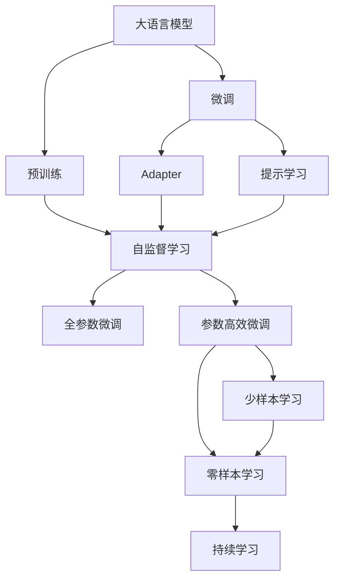
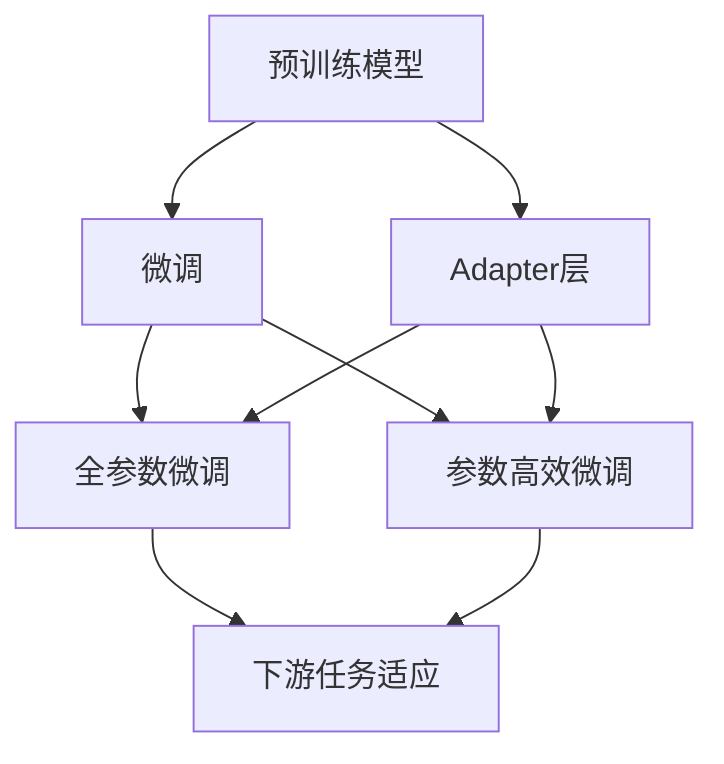
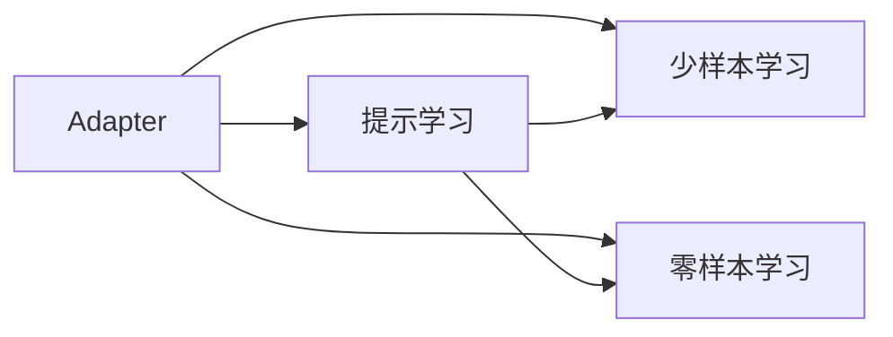
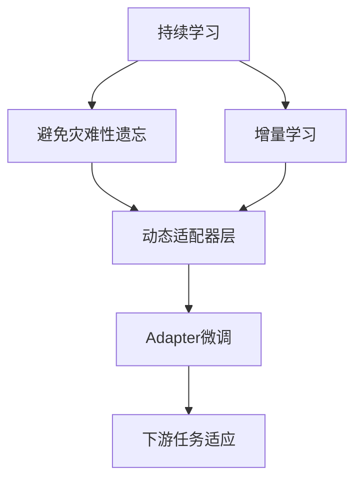
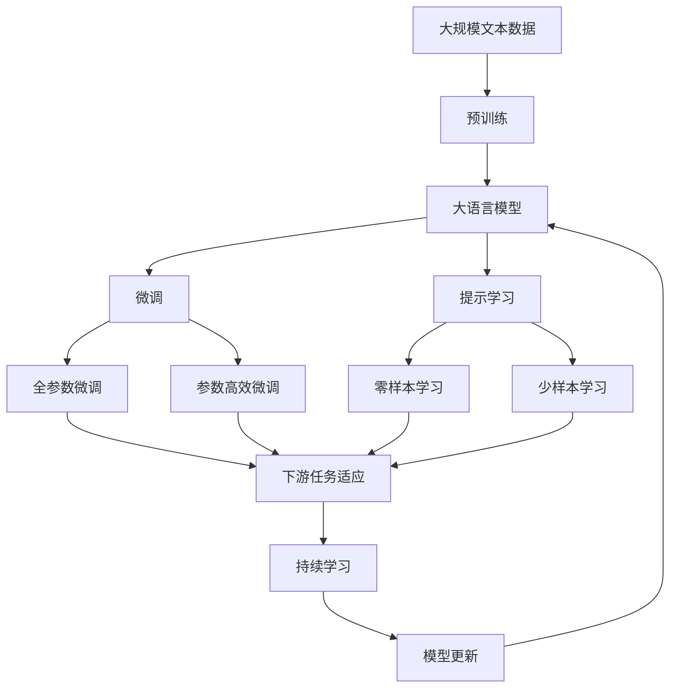

                 

# 大语言模型应用指南：Adapter高效微调

> 关键词：大语言模型,Adapter,高效微调,参数高效,Fine-Tuning,自适应,语言理解,自然语言处理(NLP)

## 1. 背景介绍

### 1.1 问题由来
在自然语言处理(NLP)领域，大语言模型通过在大规模无标签文本语料上进行预训练，学习到了丰富的语言知识和常识。然而，对于特定领域的应用，直接应用这些通用模型往往无法满足需求。因此，如何在大模型上进行高效微调，使其在特定领域中达到更好的表现，成为了当前研究的热点。

### 1.2 问题核心关键点
Adapter方法是近年来提出的一种参数高效微调方法，通过在通用大模型的基础上添加一个小的 Adapter 层，来实现高效的微调。 Adapter 层只包含少量的可训练参数，与预训练模型的大部分参数共享，从而避免了从头训练大模型所需的巨大计算资源和时间成本。这种方法在各种NLP任务上取得了显著的性能提升，并且能够快速适应新的领域。

### 1.3 问题研究意义
Adapter方法的高效性使得大语言模型微调更加实用，尤其在资源有限的场景下，其优势尤为明显。通过Adapter微调，开发者可以在保持模型大体重量参数不变的情况下，针对特定任务进行优化，加速任务开发，降低成本。同时，Adapter方法也促进了深度学习模型在实际应用中的广泛部署和普及。

## 2. 核心概念与联系

### 2.1 核心概念概述

为更好地理解Adapter方法，本节将介绍几个密切相关的核心概念：

- 大语言模型(Large Language Model, LLM)：以自回归(如GPT)或自编码(如BERT)模型为代表的大规模预训练语言模型。通过在大规模无标签文本语料上进行预训练，学习通用的语言表示，具备强大的语言理解和生成能力。

- Adapter：一种轻量级的模块，用于在预训练模型基础上进行高效微调。Adapter层一般包含若干个全连接层，只包含少量可训练参数，能够快速适应新任务。

- 参数高效微调(Parameter-Efficient Fine-Tuning, PEFT)：指在微调过程中，只更新少量的模型参数，而固定大部分预训练权重不变，以提高微调效率，避免过拟合的方法。

- 迁移学习(Transfer Learning)：指将一个领域学习到的知识，迁移应用到另一个不同但相关的领域的学习范式。Adapter方法即是一种典型的迁移学习方式。

- 自适应学习(Adaptation)：指模型根据新数据或任务的变化，动态调整参数和结构，以提高适应性和泛化能力。

- 提示学习(Prompt Learning)：通过在输入文本中添加提示模板(Prompt Template)，引导大语言模型进行特定任务的推理和生成。 Adapter方法也可以与提示学习结合，进一步提高微调效果。

- 少样本学习(Few-shot Learning)：指在只有少量标注样本的情况下，模型能够快速适应新任务的学习方法。 Adapter方法通常能在少样本情况下取得不错的性能。

- 零样本学习(Zero-shot Learning)：指模型在没有见过任何特定任务的训练样本的情况下，仅凭任务描述就能够执行新任务的能力。 Adapter方法可以通过适当的提示学习，实现零样本学习。

- 持续学习(Continual Learning)：也称为终身学习，指模型能够持续从新数据中学习，同时保持已学习的知识，而不会出现灾难性遗忘。这对于保持Adapter模型的时效性和适应性至关重要。

这些核心概念之间的逻辑关系可以通过以下Mermaid流程图来展示：



这个流程图展示了大语言模型的核心概念及其之间的关系：

1. 大语言模型通过预训练获得基础能力。
2. 微调是对预训练模型进行任务特定的优化，可以分为全参数微调和参数高效微调（PEFT）。
3. Adapter方法是一种高效的微调方式，只更新少量的可训练参数，固定大部分预训练权重。
4. Adapter方法可以与提示学习结合，进一步提高微调效果。
5. 持续学习可以保持Adapter模型的时效性和适应性。

这些概念共同构成了Adapter微调的完整生态系统，使其能够在各种场景下发挥强大的语言理解和生成能力。通过理解这些核心概念，我们可以更好地把握Adapter微调的工作原理和优化方向。

### 2.2 概念间的关系

这些核心概念之间存在着紧密的联系，形成了Adapter微调的完整生态系统。下面我们通过几个Mermaid流程图来展示这些概念之间的关系。

#### 2.2.1 Adapter的高效微调



这个流程图展示了Adapter方法的基本原理，预训练模型通过添加Adapter层，可以更高效地微调。微调可以分为全参数微调和参数高效微调两种方式，Adapter层在这两种微调中都发挥作用。

#### 2.2.2 Adapter与提示学习的关系



这个流程图展示了Adapter方法与提示学习的关系。Adapter层可以与提示学习结合，在零样本和少样本学习中发挥作用。

#### 2.2.3 Adapter的持续学习



这个流程图展示了持续学习在大模型Adapter微调中的应用。持续学习可以动态调整Adapter层，使其能够不断学习新知识，适应新的任务。

### 2.3 核心概念的整体架构

最后，我们用一个综合的流程图来展示这些核心概念在大语言模型Adapter微调过程中的整体架构：



这个综合流程图展示了从预训练到Adapter微调，再到持续学习的完整过程。大语言模型首先在大规模文本数据上进行预训练，然后通过Adapter微调进行任务适配，再通过提示学习实现零样本和少样本学习，最后通过持续学习技术，模型可以不断更新和适应新的任务和数据。 通过这些流程图，我们可以更清晰地理解Adapter微调过程中各个核心概念的关系和作用，为后续深入讨论具体的微调方法和技术奠定基础。

## 3. 核心算法原理 & 具体操作步骤
### 3.1 算法原理概述

Adapter方法是近年来提出的一种高效的参数微调方法，通过在预训练模型基础上添加一个小的Adapter层，来实现高效的微调。Adapter层只包含少量的可训练参数，与预训练模型的大部分参数共享，从而避免了从头训练大模型所需的巨大计算资源和时间成本。

形式化地，假设预训练模型为 $M_{\theta}$，其中 $\theta$ 为预训练得到的模型参数。给定下游任务 $T$ 的标注数据集 $D=\{(x_i,y_i)\}_{i=1}^N, x_i \in \mathcal{X}, y_i \in \mathcal{Y}$。Adapter方法通过在 $M_{\theta}$ 的输出上添加一个Adapter层 $A_{\phi}$，得到一个新的模型 $M_{\theta}A_{\phi}$。Adapter层只包含少量的可训练参数 $\phi$，通过最小化任务损失函数 $\mathcal{L}$ 来更新这些参数，使得模型 $M_{\theta}A_{\phi}$ 在任务 $T$ 上的表现优于原模型 $M_{\theta}$。

$$
\theta^*,\phi^* = \mathop{\arg\min}_{\theta,\phi} \mathcal{L}(M_{\theta}A_{\phi},D)
$$

### 3.2 算法步骤详解

Adapter方法的微调过程一般包括以下几个关键步骤：

**Step 1: 准备预训练模型和数据集**
- 选择合适的预训练语言模型 $M_{\theta}$ 作为初始化参数，如 BERT、GPT 等。
- 准备下游任务 $T$ 的标注数据集 $D$，划分为训练集、验证集和测试集。一般要求标注数据与预训练数据的分布不要差异过大。

**Step 2: 添加Adapter层**
- 根据任务类型，在预训练模型顶层设计合适的Adapter层。
- 对于分类任务，通常在顶层添加线性分类器或注意力机制的Adapter层。
- 对于生成任务，通常使用语言模型的解码器输出概率分布，并以负对数似然为损失函数。

**Step 3: 设置微调超参数**
- 选择合适的优化算法及其参数，如 AdamW、SGD 等，设置学习率、批大小、迭代轮数等。
- 设置正则化技术及强度，包括权重衰减、Dropout、Early Stopping 等。
- 确定冻结预训练参数的策略，如仅微调Adapter层，或全部参数都参与微调。

**Step 4: 执行梯度训练**
- 将训练集数据分批次输入模型，前向传播计算损失函数。
- 反向传播计算Adapter层参数梯度，根据设定的优化算法和学习率更新Adapter层参数。
- 周期性在验证集上评估模型性能，根据性能指标决定是否触发 Early Stopping。
- 重复上述步骤直到满足预设的迭代轮数或 Early Stopping 条件。

**Step 5: 测试和部署**
- 在测试集上评估微调后模型 $M_{\theta}A_{\phi}$ 的性能，对比微调前后的精度提升。
- 使用微调后的模型对新样本进行推理预测，集成到实际的应用系统中。
- 持续收集新的数据，定期重新微调模型，以适应数据分布的变化。

以上是Adapter方法的基本微调流程。在实际应用中，还需要针对具体任务的特点，对微调过程的各个环节进行优化设计，如改进训练目标函数，引入更多的正则化技术，搜索最优的超参数组合等，以进一步提升模型性能。

### 3.3 算法优缺点

Adapter方法在参数高效微调方面具有以下优点：
1. 简单高效。只需添加少量的Adapter层，即可对预训练模型进行快速适配，获得较大的性能提升。
2. 参数高效。Adapter层只包含少量的可训练参数，可以避免从头训练大模型所需的巨大计算资源和时间成本。
3. 通用适用。 Adapter方法适用于各种NLP下游任务，包括分类、匹配、生成等，设计简单的Adapter层即可实现微调。

Adapter方法也存在一定的局限性：
1. 依赖标注数据。Adapter方法仍然需要标注数据进行微调，尽管需求量较低，但获取高质量标注数据的成本仍然较高。
2. 迁移能力有限。当目标任务与预训练数据的分布差异较大时，Adapter方法的性能提升有限。
3. 参数更新较少。由于Adapter层只包含少量的可训练参数，可能导致模型更新缓慢，影响收敛速度。
4. 可解释性不足。Adapter层中的参数更新机制较为复杂，难以解释其内部工作机制和决策逻辑。

尽管存在这些局限性，但Adapter方法在参数高效微调方面的优势使其成为NLP领域的重要技术。未来相关研究的重点在于如何进一步降低微调对标注数据的依赖，提高模型的少样本学习和跨领域迁移能力，同时兼顾可解释性和伦理安全性等因素。

### 3.4 算法应用领域

Adapter方法在NLP领域已经得到了广泛的应用，覆盖了几乎所有常见任务，例如：

- 文本分类：如情感分析、主题分类、意图识别等。通过微调使模型学习文本-标签映射。
- 命名实体识别：识别文本中的人名、地名、机构名等特定实体。通过微调使模型掌握实体边界和类型。
- 关系抽取：从文本中抽取实体之间的语义关系。通过微调使模型学习实体-关系三元组。
- 问答系统：对自然语言问题给出答案。将问题-答案对作为微调数据，训练模型学习匹配答案。
- 机器翻译：将源语言文本翻译成目标语言。通过微调使模型学习语言-语言映射。
- 文本摘要：将长文本压缩成简短摘要。将文章-摘要对作为微调数据，使模型学习抓取要点。
- 对话系统：使机器能够与人自然对话。将多轮对话历史作为上下文，微调模型进行回复生成。

除了上述这些经典任务外，Adapter方法也被创新性地应用到更多场景中，如可控文本生成、常识推理、代码生成、数据增强等，为NLP技术带来了全新的突破。随着 Adapter 方法的持续演进，相信其在NLP技术落地应用中的前景将更加广阔。

## 4. 数学模型和公式 & 详细讲解  
### 4.1 数学模型构建

本节将使用数学语言对Adapter方法进行更加严格的刻画。

记预训练语言模型为 $M_{\theta}$，其中 $\theta$ 为预训练得到的模型参数。假设微调任务的训练集为 $D=\{(x_i,y_i)\}_{i=1}^N, x_i \in \mathcal{X}, y_i \in \mathcal{Y}$。

定义模型 $M_{\theta}$ 在输入 $x$ 上的损失函数为 $\ell(M_{\theta}(x),y)$，则在数据集 $D$ 上的经验风险为：

$$
\mathcal{L}(\theta) = \frac{1}{N} \sum_{i=1}^N \ell(M_{\theta}(x_i),y_i)
$$

在Adapter层中添加少量可训练参数 $\phi$，定义微调后的模型为 $M_{\theta}A_{\phi}$。Adapter层的输出为：

$$
A_{\phi}(M_{\theta}(x)) = \tanh(\phi M_{\theta}(x))
$$

其中 $\tanh$ 为非线性激活函数。

 Adapter层的损失函数为：

$$
\mathcal{L}_A(\phi) = \frac{1}{N} \sum_{i=1}^N \ell(M_{\theta}(x_i),y_i)
$$

微调的优化目标是最小化 Adapter 层和下游任务的联合损失：

$$
\theta^*,\phi^* = \mathop{\arg\min}_{\theta,\phi} \mathcal{L}(M_{\theta}A_{\phi},D)
$$

在实践中，我们通常使用基于梯度的优化算法（如AdamW、SGD等）来近似求解上述最优化问题。设 $\eta$ 为学习率，$\lambda$ 为正则化系数，则 Adapter 层参数的更新公式为：

$$
\phi \leftarrow \phi - \eta \nabla_{\phi}\mathcal{L}_A(\phi) - \eta\lambda\phi
$$

其中 $\nabla_{\phi}\mathcal{L}_A(\phi)$ 为Adapter层损失函数对参数 $\phi$ 的梯度，可通过反向传播算法高效计算。

### 4.2 公式推导过程

以下我们以二分类任务为例，推导Adapter层损失函数及其梯度的计算公式。

假设模型 $M_{\theta}$ 在输入 $x$ 上的输出为 $\hat{y}=M_{\theta}(x) \in [0,1]$，表示样本属于正类的概率。真实标签 $y \in \{0,1\}$。则二分类交叉熵损失函数定义为：

$$
\ell(M_{\theta}(x),y) = -[y\log \hat{y} + (1-y)\log (1-\hat{y})]
$$

在Adapter层中，输入 $\hat{y}$ 通过非线性激活函数转换为新的输出 $A_{\phi}(\hat{y})$，则 Adapter 层的损失函数为：

$$
\mathcal{L}_A(\phi) = \frac{1}{N} \sum_{i=1}^N \ell(M_{\theta}A_{\phi}(x_i),y_i)
$$

根据链式法则，Adapter层损失函数对参数 $\phi$ 的梯度为：

$$
\frac{\partial \mathcal{L}_A(\phi)}{\partial \phi} = \frac{1}{N}\sum_{i=1}^N (\frac{\partial \ell(M_{\theta}A_{\phi}(x_i),y_i)}{\partial \hat{y}} \frac{\partial \hat{y}}{\partial M_{\theta}(x_i)} \frac{\partial M_{\theta}(x_i)}{\partial \phi}
$$

其中 $\frac{\partial \ell(M_{\theta}A_{\phi}(x_i),y_i)}{\partial \hat{y}}$ 为交叉熵损失对 $\hat{y}$ 的梯度，$\frac{\partial \hat{y}}{\partial M_{\theta}(x_i)}$ 为 $\hat{y}$ 对 $M_{\theta}(x_i)$ 的梯度，$\frac{\partial M_{\theta}(x_i)}{\partial \phi}$ 为预训练模型对 Adapter 层参数的梯度，可通过反向传播算法计算得到。

在得到Adapter层损失函数的梯度后，即可带入 Adapter 层参数更新公式，完成模型的迭代优化。重复上述过程直至收敛，最终得到适应下游任务的最优Adapter层参数 $\phi^*$。

## 5. 项目实践：代码实例和详细解释说明
### 5.1 开发环境搭建

在进行Adapter微调实践前，我们需要准备好开发环境。以下是使用Python进行PyTorch开发的环境配置流程：

1. 安装Anaconda：从官网下载并安装Anaconda，用于创建独立的Python环境。

2. 创建并激活虚拟环境：
```bash
conda create -n pytorch-env python=3.8 
conda activate pytorch-env
```

3. 安装PyTorch：根据CUDA版本，从官网获取对应的安装命令。例如：
```bash
conda install pytorch torchvision torchaudio cudatoolkit=11.1 -c pytorch -c conda-forge
```

4. 安装Transformers库：
```bash
pip install transformers
```

5. 安装各类工具包：
```bash
pip install numpy pandas scikit-learn matplotlib tqdm jupyter notebook ipython
```

完成上述步骤后，即可在`pytorch-env`环境中开始Adapter微调实践。

### 5.2 源代码详细实现

下面我们以命名实体识别(NER)任务为例，给出使用Transformers库对BERT模型进行Adapter微调的PyTorch代码实现。

首先，定义NER任务的数据处理函数：

```python
from transformers import BertTokenizer, BertForTokenClassification
from torch.utils.data import Dataset
import torch

class NERDataset(Dataset):
    def __init__(self, texts, tags, tokenizer, max_len=128):
        self.texts = texts
        self.tags = tags
        self.tokenizer = tokenizer
        self.max_len = max_len
        
    def __len__(self):
        return len(self.texts)
    
    def __getitem__(self, item):
        text = self.texts[item]
        tags = self.tags[item]
        
        encoding = self.tokenizer(text, return_tensors='pt', max_length=self.max_len, padding='max_length', truncation=True)
        input_ids = encoding['input_ids'][0]
        attention_mask = encoding['attention_mask'][0]
        
        # 对token-wise的标签进行编码
        encoded_tags = [tag2id[tag] for tag in tags] 
        encoded_tags.extend([tag2id['O']] * (self.max_len - len(encoded_tags)))
        labels = torch.tensor(encoded_tags, dtype=torch.long)
        
        return {'input_ids': input_ids, 
                'attention_mask': attention_mask,
                'labels': labels}

# 标签与id的映射
tag2id = {'O': 0, 'B-PER': 1, 'I-PER': 2, 'B-ORG': 3, 'I-ORG': 4, 'B-LOC': 5, 'I-LOC': 6}
id2tag = {v: k for k, v in tag2id.items()}

# 创建dataset
tokenizer = BertTokenizer.from_pretrained('bert-base-cased')

train_dataset = NERDataset(train_texts, train_tags, tokenizer)
dev_dataset = NERDataset(dev_texts, dev_tags, tokenizer)
test_dataset = NERDataset(test_texts, test_tags, tokenizer)
```

然后，定义模型和优化器：

```python
from transformers import BertForTokenClassification, AdamW

model = BertForTokenClassification.from_pretrained('bert-base-cased', num_labels=len(tag2id))

# 添加Adapter层
adapter_layer = torch.nn.Linear(768, 768, bias=False)

modeladapter = BertForTokenClassification(model, adapter_layer)

# 修改优化器
optimizer = AdamW(modeladapter.parameters(), lr=2e-5)
```

接着，定义训练和评估函数：

```python
from torch.utils.data import DataLoader
from tqdm import tqdm
from sklearn.metrics import classification_report

device = torch.device('cuda') if torch.cuda.is_available() else torch.device('cpu')
modeladapter.to(device)

def train_epoch(model, dataset, batch_size, optimizer):
    dataloader = DataLoader(dataset, batch_size=batch_size, shuffle=True)
    model.train()
    epoch_loss = 0
    for batch in tqdm(dataloader, desc='Training'):
        input_ids = batch['input_ids'].to(device)
        attention_mask = batch['attention_mask'].to(device)
        labels = batch['labels'].to(device)
        modeladapter.zero_grad()
        outputs = modeladapter(input_ids, attention_mask=attention_mask, labels=labels)
        loss = outputs.loss
        epoch_loss += loss.item()
        loss.backward()
        optimizer.step()
    return epoch_loss / len(dataloader)

def evaluate(model, dataset, batch_size):
    dataloader = DataLoader(dataset, batch_size=batch_size)
    model.eval()
    preds, labels = [], []
    with torch.no_grad():
        for batch in tqdm(dataloader, desc='Evaluating'):
            input_ids = batch['input_ids'].to(device)
            attention_mask = batch['attention_mask'].to(device)
            batch_labels = batch['labels']
            outputs = modeladapter(input_ids, attention_mask=attention_mask)
            batch_preds = outputs.logits.argmax(dim=2).to('cpu').tolist()
            batch_labels = batch_labels.to('cpu').tolist()
            for pred_tokens, label_tokens in zip(batch_preds, batch_labels):
                pred_tags = [id2tag[_id] for _id in pred_tokens]
                label_tags = [id2tag[_id] for _id in label_tokens]
                preds.append(pred_tags[:len(label_tags)])
                labels.append(label_tags)
                
    print(classification_report(labels, preds))
```

最后，启动训练流程并在测试集上评估：

```python
epochs = 5
batch_size = 16

for epoch in range(epochs):
    loss = train_epoch(modeladapter, train_dataset, batch_size, optimizer)
    print(f"Epoch {epoch+1}, train loss: {loss:.3f}")
    
    print(f"Epoch {epoch+1}, dev results:")
    evaluate(modeladapter, dev_dataset, batch_size)
    
print("Test results:")
evaluate(modeladapter, test_dataset, batch_size)
```

以上就是使用PyTorch对BERT进行命名实体识别任务Adapter微调的完整代码实现。可以看到，得益于Transformers库的强大封装，我们可以用相对简洁的代码完成BERT模型的加载和Adapter微调。

### 5.3 代码解读与分析

让我们再详细解读一下关键代码的实现细节：

**NERDataset类**：
- `__init__`方法：初始化文本、标签、分词器等关键组件。
- `__len__`方法：返回数据集的样本数量。
- `__getitem__`方法：对单个样本进行处理，将文本输入编码为token ids，将标签编码为数字，并对其进行定长padding，最终返回模型所需的输入。

**tag2id和id2tag字典**：
- 定义了标签与数字id之间的映射关系，用于将token-wise的预测结果解码回真实的标签。

**训练和评估函数**：
- 使用PyTorch的DataLoader对数据集进行批次化加载，供模型训练和推理使用。
- 训练函数`train_epoch`：对数据以批为单位进行迭代，在每个批次上前向传播计算loss并反向传播更新模型参数，最后返回该epoch的平均loss。
- 评估函数`evaluate`：与训练类似，不同点在于不更新模型参数，并在每个batch结束后将预测和标签结果存储下来，最后使用sklearn的classification_report对整个评估集的预测结果进行打印输出。

**训练流程**：
- 定义总的epoch数和batch size，开始循环迭代
- 每个epoch内，先在训练集

