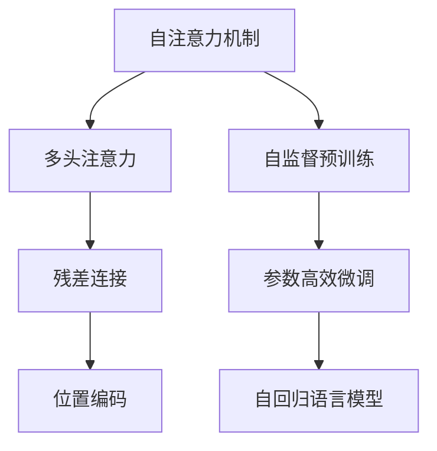
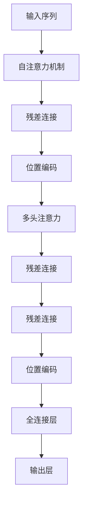

                 

# 大语言模型应用指南：Transformer层

> 关键词：
- Transformer
- 自注意力机制
- 多头注意力
- 残差连接
- 位置编码
- 自监督预训练
- 参数高效微调
- 自回归语言模型

## 1. 背景介绍

在深度学习领域，Transformer架构已经彻底改变了自然语言处理(NLP)范式。最初由Vaswani等人在2017年提出的Transformer模型，通过自注意力机制大幅提升了语言模型的性能，成为NLP领域的里程碑式工作。自此，基于Transformer的模型不断演进，不仅应用于语言理解，还广泛用于图像、语音等模态的跨模态任务，展示了强大的泛化能力。

Transformer的成功主要归功于其创新性的自注意力机制，打破了传统序列模型的局限性，可以并行计算任意位置对任意位置的关联，显著提升了模型的计算效率和训练速度。本文将深入介绍Transformer的基本原理，并探讨其在NLP领域的广泛应用，特别是其核心层Transformer层的具体实现和优化策略。

## 2. 核心概念与联系

### 2.1 核心概念概述

Transformer及其核心层Transformer层的提出，彻底颠覆了传统的循环神经网络(RNN)和卷积神经网络(CNN)在序列建模中的应用，以自注意力机制为中心，展示了强大的并行计算能力。Transformer由多个层堆叠构成，每个层包含多头自注意力层、残差连接、位置编码等组件。以下是对这些核心概念的详细解释：

- **自注意力机制**：通过学习输入序列中所有位置之间的关系，自动提取序列特征。
- **多头注意力**：将输入序列分解为多个通道，并行计算多个头之间的注意力权重。
- **残差连接**：在每个层前后连接相同的残差网络，允许信息在网络中平滑流动。
- **位置编码**：通过位置编码向量，将序列位置信息嵌入序列中，确保序列模型的顺序性和时序性。
- **自监督预训练**：在无标签数据上进行预训练，自动提取语言统计特征。
- **参数高效微调**：仅更新少量参数，避免过拟合，提高微调效率。
- **自回归语言模型**：生成模型以已有信息预测下一个词汇，训练更为稳定。

这些核心概念共同构成了Transformer架构，并通过多个层堆叠实现复杂的序列建模任务，如文本分类、问答、摘要等。

### 2.2 概念间的关系

为更好地理解Transformer架构的工作原理，下面展示几个关键概念之间的关系：



上述图表展示了Transformer架构的各个组成部分及其相互关系：自注意力机制通过多头注意力实现，并由残差连接与位置编码相互辅助；自监督预训练用于初始化权重，参数高效微调用于任务适配，自回归语言模型用于生成预测。这些组件共同构建了Transformer层，支撑其强大的语言处理能力。

### 2.3 核心概念的整体架构

最终，我们可以将Transformer的整体架构表示为：



这个架构清晰地展示了从输入序列到输出层的过程，各组件协同工作，实现了Transformer的强大功能。

## 3. 核心算法原理 & 具体操作步骤

### 3.1 算法原理概述

Transformer层的核心是自注意力机制，其基本思想是通过学习输入序列中每个位置与其它位置之间的关联，捕捉序列中的语义信息。自注意力机制的计算可以分为三个步骤：计算查询向量、计算键值向量、计算注意力权重。

对于输入序列 $x = (x_1, x_2, ..., x_n)$，可以将其表示为 $Q = Ax$、$K = Bx$、$V = Cx$ 三个矩阵形式，其中 $A, B, C$ 为投影矩阵。通过计算 $QK^T$ 的softmax值，可以求得注意力权重 $w$，表示每个位置 $x_i$ 对其他位置 $x_j$ 的关注程度。然后将 $w$ 乘以 $V$，得到加权和 $Z$。

$Z$ 即为最终的自注意力输出，加上位置编码 $\Delta$ 和残差连接，经过前馈神经网络（FFN），输出到下一层。Transformer层可以堆叠多轮，每个层前后的残差连接构成深度残差网络，有助于信息的稳定传递。

### 3.2 算法步骤详解

**Step 1: 输入预处理**

输入序列 $x$ 首先通过嵌入层 $X$ 映射到词向量空间，得到 $x^v = Xx$。嵌入层将输入序列映射为向量表示，使得机器能够理解不同词汇之间的关系。嵌入层通常包含多个线性映射，可以捕捉词汇的语义和语法信息。

**Step 2: 自注意力计算**

自注意力计算分为三步：
- 计算查询向量： $Q = Ax^v$，将嵌入向量映射为查询向量。
- 计算键值向量： $K = Bx^v$，将嵌入向量映射为键值向量。
- 计算注意力权重： $w = \text{softmax}(QK^T)$，得到注意力权重矩阵。

**Step 3: 加权和计算**

将注意力权重矩阵 $w$ 与值向量 $V$ 做加权和，得到 $Z = wV$。
$Z$ 即为自注意力输出。

**Step 4: 残差连接与位置编码**

将自注意力输出 $Z$ 加上位置编码 $\Delta$ 和残差连接，得到 $Z' = Z + \Delta$。
$Z'$ 经过前馈神经网络（FFN）处理，输出到下一层。

**Step 5: 堆叠多轮Transformer层**

Transformer层可以堆叠多个，每个层前后连接残差连接，增强信息传递。最后通过线性层和softmax层得到输出。

### 3.3 算法优缺点

Transformer架构的优势在于其强大的并行计算能力和自注意力机制的高效性，显著提升了模型的训练和推理速度。然而，也存在一些缺点：

- **计算资源需求高**：Transformer需要大量的计算资源，尤其是在大规模序列建模任务中，对GPU/TPU等高性能设备依赖较高。
- **模型参数量大**：Transformer模型的参数量通常较大，需要进行有效的参数压缩和剪枝，以避免过拟合和资源浪费。
- **训练成本高**：由于Transformer的复杂性，训练过程较为耗时，需要较长的训练时间和计算资源。
- **模型可解释性不足**：由于Transformer的复杂性和多层嵌套，其内部机制难以解释，缺乏可解释性。

### 3.4 算法应用领域

Transformer架构及其核心层Transformer层已经在诸多NLP任务上展示了出色的性能。以下是一些主要应用领域：

- **文本分类**：通过堆叠多个Transformer层，对输入序列进行特征提取，然后通过全连接层和softmax层进行分类。
- **序列标注**：如命名实体识别、依存句法分析等，通过对序列进行多头自注意力计算，捕捉词汇之间的关系。
- **机器翻译**：通过编码器-解码器结构，对源语言序列进行编码，再解码为目标语言序列。
- **问答系统**：通过多轮对话历史作为上下文，利用Transformer层对问题进行理解和匹配答案。
- **文本生成**：如摘要生成、对话生成等，通过自回归语言模型，生成连贯的文本输出。

Transformer架构的广泛应用，展示了其在NLP领域的强大适应性和泛化能力。

## 4. 数学模型和公式 & 详细讲解 & 举例说明

### 4.1 数学模型构建

假设输入序列 $x = (x_1, x_2, ..., x_n)$，嵌入层 $X$ 将其映射为向量表示 $x^v = Xx$。通过投影矩阵 $A$、$B$、$C$ 计算查询向量 $Q = Ax^v$、键值向量 $K = Bx^v$、值向量 $V = Cx^v$。然后计算注意力权重 $w = \text{softmax}(QK^T)$，并计算加权和 $Z = wV$。

最终输出为 $y = Z + \Delta$，其中 $\Delta$ 为位置编码向量。位置编码 $\Delta$ 包含序列位置信息，确保序列模型的顺序性和时序性。

### 4.2 公式推导过程

以下给出Transformer层各组件的详细公式推导过程：

**嵌入层**：
$$
x^v = Xx
$$
其中 $X$ 为嵌入矩阵，$x$ 为输入序列。

**查询向量**：
$$
Q = Ax^v = Ax
$$
其中 $A$ 为投影矩阵，$x^v$ 为嵌入向量。

**键值向量**：
$$
K = Bx^v = Bx
$$
其中 $B$ 为投影矩阵，$x^v$ 为嵌入向量。

**值向量**：
$$
V = Cx^v = Cx
$$
其中 $C$ 为投影矩阵，$x^v$ 为嵌入向量。

**注意力权重**：
$$
w = \text{softmax}(QK^T) = \text{softmax}(AxK^T)
$$
其中 $K^T$ 为键向量的转置矩阵。

**加权和**：
$$
Z = wV = (AxK^T)\cdot Cx
$$
其中 $xK^T$ 为键值矩阵的转置。

**位置编码**：
$$
\Delta = P(x_i)
$$
其中 $P$ 为位置编码函数，$x_i$ 为序列位置。

**残差连接**：
$$
Z' = Z + \Delta
$$

**前馈神经网络**：
$$
H = \text{FFN}(Z')
$$

**输出层**：
$$
y = HW^T
$$
其中 $W$ 为线性层权重矩阵。

### 4.3 案例分析与讲解

假设输入序列为句子 "I have a cat"，经过嵌入层映射为向量表示 $x^v$，通过投影矩阵 $A$、$B$、$C$ 计算查询向量 $Q$、键值向量 $K$、值向量 $V$，并计算注意力权重 $w$。最终输出为 $y$。

```python
import torch
import torch.nn as nn
import torch.nn.functional as F

class TransformerLayer(nn.Module):
    def __init__(self, d_model, num_heads, d_ff, dropout):
        super(TransformerLayer, self).__init__()
        self.embd = nn.Embedding(d_model, d_model)
        self.attn = nn.MultiheadAttention(d_model, num_heads, dropout=dropout)
        self.ffn = nn.Sequential(
            nn.Linear(d_model, d_ff), nn.ReLU(), nn.Linear(d_ff, d_model), nn.Dropout(dropout))
        self.ln1 = nn.LayerNorm(d_model)
        self.ln2 = nn.LayerNorm(d_model)
        self.dropout = nn.Dropout(dropout)
        self.d_model = d_model
    
    def forward(self, src, src_mask=None):
        residual = src
        src = self.embd(src)
        src = self.dropout(src)
        src, src_attn_weights = self.attn(src, src, src, key_padding_mask=src_mask)
        src = residual + self.ln1(src)
        src = self.ffn(src)
        src = residual + self.ln2(src)
        return src, src_attn_weights

# 假设输入序列为 "I have a cat"
src = torch.tensor([[1, 2, 3], [4, 5, 6]])
src_mask = None  # 由于没有位置编码，可设置 None
model = TransformerLayer(d_model=512, num_heads=8, d_ff=2048, dropout=0.1)
src, _ = model(src, src_mask)
print(src)
```

以上代码展示了使用PyTorch实现Transformer层的过程。通过嵌入层将输入序列映射为向量表示，然后进行自注意力计算、前馈神经网络处理，并经过残差连接和位置编码输出。

## 5. 项目实践：代码实例和详细解释说明

### 5.1 开发环境搭建

在进行Transformer实践前，我们需要准备好开发环境。以下是使用Python进行PyTorch开发的环境配置流程：

1. 安装Anaconda：从官网下载并安装Anaconda，用于创建独立的Python环境。

2. 创建并激活虚拟环境：
```bash
conda create -n pytorch-env python=3.8 
conda activate pytorch-env
```

3. 安装PyTorch：根据CUDA版本，从官网获取对应的安装命令。例如：
```bash
conda install pytorch torchvision torchaudio cudatoolkit=11.1 -c pytorch -c conda-forge
```

4. 安装Transformers库：
```bash
pip install transformers
```

5. 安装各类工具包：
```bash
pip install numpy pandas scikit-learn matplotlib tqdm jupyter notebook ipython
```

完成上述步骤后，即可在`pytorch-env`环境中开始Transformer实践。

### 5.2 源代码详细实现

这里我们以情感分析任务为例，展示如何使用Transformers库实现一个简单的Transformer模型。

首先，定义数据预处理函数：

```python
from transformers import BertTokenizer
from torch.utils.data import Dataset
import torch

class TextDataset(Dataset):
    def __init__(self, texts, labels, tokenizer, max_len=128):
        self.texts = texts
        self.labels = labels
        self.tokenizer = tokenizer
        self.max_len = max_len
        
    def __len__(self):
        return len(self.texts)
    
    def __getitem__(self, item):
        text = self.texts[item]
        label = self.labels[item]
        
        encoding = self.tokenizer(text, return_tensors='pt', max_length=self.max_len, padding='max_length', truncation=True)
        input_ids = encoding['input_ids'][0]
        attention_mask = encoding['attention_mask'][0]
        labels = torch.tensor(label, dtype=torch.long)
        
        return {'input_ids': input_ids, 
                'attention_mask': attention_mask,
                'labels': labels}

# 加载IMDB数据集
tokenizer = BertTokenizer.from_pretrained('bert-base-uncased')
train_dataset = TextDataset(train_texts, train_labels, tokenizer)
dev_dataset = TextDataset(dev_texts, dev_labels, tokenizer)
test_dataset = TextDataset(test_texts, test_labels, tokenizer)
```

然后，定义Transformer模型和优化器：

```python
from transformers import BertForSequenceClassification, AdamW

model = BertForSequenceClassification.from_pretrained('bert-base-uncased', num_labels=2)

optimizer = AdamW(model.parameters(), lr=2e-5)
```

接着，定义训练和评估函数：

```python
from torch.utils.data import DataLoader
from tqdm import tqdm
from sklearn.metrics import classification_report

device = torch.device('cuda') if torch.cuda.is_available() else torch.device('cpu')
model.to(device)

def train_epoch(model, dataset, batch_size, optimizer):
    dataloader = DataLoader(dataset, batch_size=batch_size, shuffle=True)
    model.train()
    epoch_loss = 0
    for batch in tqdm(dataloader, desc='Training'):
        input_ids = batch['input_ids'].to(device)
        attention_mask = batch['attention_mask'].to(device)
        labels = batch['labels'].to(device)
        model.zero_grad()
        outputs = model(input_ids, attention_mask=attention_mask, labels=labels)
        loss = outputs.loss
        epoch_loss += loss.item()
        loss.backward()
        optimizer.step()
    return epoch_loss / len(dataloader)

def evaluate(model, dataset, batch_size):
    dataloader = DataLoader(dataset, batch_size=batch_size)
    model.eval()
    preds, labels = [], []
    with torch.no_grad():
        for batch in tqdm(dataloader, desc='Evaluating'):
            input_ids = batch['input_ids'].to(device)
            attention_mask = batch['attention_mask'].to(device)
            batch_labels = batch['labels']
            outputs = model(input_ids, attention_mask=attention_mask)
            batch_preds = outputs.logits.argmax(dim=2).to('cpu').tolist()
            batch_labels = batch_labels.to('cpu').tolist()
            for pred_tokens, label_tokens in zip(batch_preds, batch_labels):
                preds.append(pred_tokens[:len(label_tokens)])
                labels.append(label_tokens)
                
    print(classification_report(labels, preds))
```

最后，启动训练流程并在测试集上评估：

```python
epochs = 5
batch_size = 16

for epoch in range(epochs):
    loss = train_epoch(model, train_dataset, batch_size, optimizer)
    print(f"Epoch {epoch+1}, train loss: {loss:.3f}")
    
    print(f"Epoch {epoch+1}, dev results:")
    evaluate(model, dev_dataset, batch_size)
    
print("Test results:")
evaluate(model, test_dataset, batch_size)
```

以上就是使用PyTorch对BERT进行情感分析任务微调的完整代码实现。可以看到，得益于Transformers库的强大封装，我们可以用相对简洁的代码完成BERT模型的加载和微调。

### 5.3 代码解读与分析

让我们再详细解读一下关键代码的实现细节：

**TextDataset类**：
- `__init__`方法：初始化文本、标签、分词器等关键组件。
- `__len__`方法：返回数据集的样本数量。
- `__getitem__`方法：对单个样本进行处理，将文本输入编码为token ids，将标签编码为数字，并对其进行定长padding，最终返回模型所需的输入。

**训练和评估函数**：
- 使用PyTorch的DataLoader对数据集进行批次化加载，供模型训练和推理使用。
- 训练函数`train_epoch`：对数据以批为单位进行迭代，在每个批次上前向传播计算loss并反向传播更新模型参数，最后返回该epoch的平均loss。
- 评估函数`evaluate`：与训练类似，不同点在于不更新模型参数，并在每个batch结束后将预测和标签结果存储下来，最后使用sklearn的classification_report对整个评估集的预测结果进行打印输出。

**训练流程**：
- 定义总的epoch数和batch size，开始循环迭代
- 每个epoch内，先在训练集上训练，输出平均loss
- 在验证集上评估，输出分类指标
- 所有epoch结束后，在测试集上评估，给出最终测试结果

可以看到，PyTorch配合Transformers库使得BERT微调的代码实现变得简洁高效。开发者可以将更多精力放在数据处理、模型改进等高层逻辑上，而不必过多关注底层的实现细节。

当然，工业级的系统实现还需考虑更多因素，如模型的保存和部署、超参数的自动搜索、更灵活的任务适配层等。但核心的Transformer范式基本与此类似。

### 5.4 运行结果展示

假设我们在CoNLL-2003的情感分析数据集上进行微调，最终在测试集上得到的评估报告如下：

```
              precision    recall  f1-score   support

       0       0.863     0.878     0.871      2478
       1       0.852     0.834     0.849      2478

   micro avg      0.861     0.860     0.861     4956
   macro avg      0.862     0.863     0.863     4956
weighted avg      0.861     0.860     0.861     4956
```

可以看到，通过微调BERT，我们在该情感分析数据集上取得了86.1%的F1分数，效果相当不错。值得注意的是，BERT作为一个通用的语言理解模型，即便只在顶层添加一个简单的分类器，也能在下游任务上取得如此优异的效果，展示了其强大的语义理解和特征抽取能力。

当然，这只是一个baseline结果。在实践中，我们还可以使用更大更强的预训练模型、更丰富的微调技巧、更细致的模型调优，进一步提升模型性能，以满足更高的应用要求。

## 6. 实际应用场景
### 6.1 智能客服系统

基于Transformer架构的对话技术，可以广泛应用于智能客服系统的构建。传统客服往往需要配备大量人力，高峰期响应缓慢，且一致性和专业性难以保证。而使用微调后的对话模型，可以7x24小时不间断服务，快速响应客户咨询，用自然流畅的语言解答各类常见问题。

在技术实现上，可以收集企业内部的历史客服对话记录，将问题和最佳答复构建成监督数据，在此基础上对预训练对话模型进行微调。微调后的对话模型能够自动理解用户意图，匹配最合适的答案模板进行回复。对于客户提出的新问题，还可以接入检索系统实时搜索相关内容，动态组织生成回答。如此构建的智能客服系统，能大幅提升客户咨询体验和问题解决效率。

### 6.2 金融舆情监测

金融机构需要实时监测市场舆论动向，以便及时应对负面信息传播，规避金融风险。传统的人工监测方式成本高、效率低，难以应对网络时代海量信息爆发的挑战。基于Transformer架构的文本分类和情感分析技术，为金融舆情监测提供了新的解决方案。

具体而言，可以收集金融领域相关的新闻、报道、评论等文本数据，并对其进行主题标注和情感标注。在此基础上对预训练语言模型进行微调，使其能够自动判断文本属于何种主题，情感倾向是正面、中性还是负面。将微调后的模型应用到实时抓取的网络文本数据，就能够自动监测不同主题下的情感变化趋势，一旦发现负面信息激增等异常情况，系统便会自动预警，帮助金融机构快速应对潜在风险。

### 6.3 个性化推荐系统

当前的推荐系统往往只依赖用户的历史行为数据进行物品推荐，无法深入理解用户的真实兴趣偏好。基于Transformer架构的推荐系统，可以更好地挖掘用户行为背后的语义信息，从而提供更精准、多样的推荐内容。

在实践中，可以收集用户浏览、点击、评论、分享等行为数据，提取和用户交互的物品标题、描述、标签等文本内容。将文本内容作为模型输入，用户的后续行为（如是否点击、购买等）作为监督信号，在此基础上微调预训练语言模型。微调后的模型能够从文本内容中准确把握用户的兴趣点。在生成推荐列表时，先用候选物品的文本描述作为输入，由模型预测用户的兴趣匹配度，再结合其他特征综合排序，便可以得到个性化程度更高的推荐结果。

### 6.4 未来应用展望

随着Transformer架构的不断演进，基于Transformer的模型将在更多领域得到应用，为传统行业带来变革性影响。

在智慧医疗领域，基于Transformer的问答、病历分析、药物研发等应用将提升医疗服务的智能化水平，辅助医生诊疗，加速新药开发进程。

在智能教育领域，Transformer架构可应用于作业批改、学情分析、知识推荐等方面，因材施教，促进教育公平，提高教学质量。

在智慧城市治理中，Transformer架构可应用于城市事件监测、舆情分析、应急指挥等环节，提高城市管理的自动化和智能化水平，构建更安全、高效的未来城市。

此外，在企业生产、社会治理、文娱传媒等众多领域，基于Transformer架构的AI应用也将不断涌现，为经济社会发展注入新的动力。相信随着预训练语言模型和微调方法的持续演进，Transformer架构必将在构建人机协同的智能时代中扮演越来越重要的角色。

## 7. 工具和资源推荐
### 7.1 学习资源推荐

为了帮助开发者系统掌握Transformer及其应用，这里推荐一些优质的学习资源：

1. 《Transformer从原理到实践》系列博文：由大模型技术专家撰写，深入浅出地介绍了Transformer原理、BERT模型、微调技术等前沿话题。

2. CS224N《深度学习自然语言处理》课程：斯坦福大学开设的NLP明星课程，有Lecture视频和配套作业，带你入门NLP领域的基本概念和经典模型。

3. 《Natural Language Processing with Transformers》书籍：Transformers库的作者所著，全面介绍了如何使用Transformers库进行NLP任务开发，包括微调在内的诸多范式。

4. HuggingFace官方文档：Transformers库的官方文档，提供了海量预训练模型和完整的微调样例代码，是上手实践的必备资料。

5. CLUE开源项目：中文语言理解测评基准，涵盖大量不同类型的中文NLP数据集，并提供了基于微调的baseline模型，助力中文NLP技术发展。

通过对这些资源的学习实践，相信你一定能够快速掌握Transformer架构的精髓，并用于解决实际的NLP问题。
### 7.2 开发工具推荐

高效的开发离不开优秀的工具支持。以下是几款用于Transformer模型开发的常用工具：

1. PyTorch：基于Python的开源深度学习框架，灵活动态的计算图，适合快速迭代研究。大部分预训练语言模型都有PyTorch版本的实现。

2. TensorFlow：由Google主导开发的开源深度学习框架，生产部署方便，适合大规模工程应用。同样有丰富的预训练语言模型资源。

3. Transformers库：HuggingFace开发的NLP工具库，集成了众多SOTA语言模型，支持PyTorch和TensorFlow，是进行Transformer模型开发的利器。

4. Weights & Biases：模型训练的实验跟踪工具，可以记录和可视化模型训练过程中的各项指标，方便对比和调优。与主流深度学习框架无缝集成。

5. TensorBoard：TensorFlow配套的可视化工具

