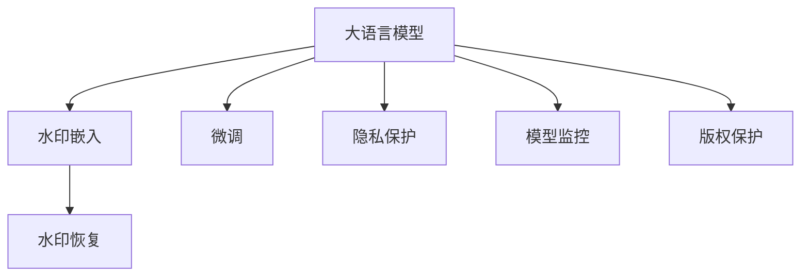

                 

# 大语言模型应用指南：为大语言模型添加水印

> 关键词：大语言模型,水印,自然语言处理(NLP),信息检索,隐私保护,数据保护

## 1. 背景介绍

### 1.1 问题由来
随着人工智能技术的飞速发展，大语言模型（Large Language Model, LLMs）在自然语言处理（NLP）领域展现出了前所未有的强大能力，广泛应用于机器翻译、情感分析、智能客服、内容生成等众多场景。然而，大语言模型也面临着数据隐私和安全性的重大挑战。如何在保证模型性能的同时，有效保护用户数据隐私，成为亟待解决的问题。

### 1.2 问题核心关键点
为此，大语言模型中的“水印”技术应运而生。在预训练和微调过程中，通过在模型中嵌入特定的信息，可以在模型输出时对其进行恢复和验证，从而确保数据的私密性和完整性。水印技术不仅有助于数据隐私保护，还能用于模型监控和版权保护等应用场景。

水印技术可以应用在以下几个关键点上：
1. **数据隐私保护**：通过在模型中嵌入隐私保护信息，使得未经授权的第三方无法轻易解读原始数据。
2. **模型监控**：利用水印信息，对模型的输入和输出进行监控，发现潜在异常行为，提高模型安全性。
3. **版权保护**：通过水印识别技术，证明模型的来源和所有权，防止盗版和侵权。

### 1.3 问题研究意义
研究大语言模型中的水印技术，对于保护数据隐私、维护模型安全性、推动人工智能技术的合规应用具有重要意义：

1. **数据隐私保护**：通过水印技术，可以防止数据泄露和滥用，保护用户隐私权益。
2. **模型监控**：利用水印信息，对模型行为进行实时监控，确保模型按预期运行，防止恶意攻击和数据泄露。
3. **版权保护**：水印技术可以证明模型的原创性和所有权，防止盗版和侵权，维护创新者的利益。
4. **合规应用**：水印技术能够帮助企业和机构满足数据隐私保护法规和标准，避免法律风险。
5. **用户体验**：在保证隐私和安全的前提下，提升用户体验，增强用户对模型的信任。

## 2. 核心概念与联系

### 2.1 核心概念概述

为更好地理解大语言模型中的水印技术，本节将介绍几个关键概念：

- **大语言模型（LLMs）**：以自回归（如GPT）或自编码（如BERT）模型为代表的大规模预训练语言模型。通过在大规模无标签文本数据上进行预训练，学习到丰富的语言知识和常识，具备强大的语言理解和生成能力。

- **水印技术**：通过在模型中嵌入特定信息，使其在输出时可以进行恢复和验证的技术。水印技术可以用于数据隐私保护、模型监控、版权保护等多个方面。

- **隐私保护**：指在数据处理和存储过程中，保护个人或组织隐私权益的技术手段，包括数据加密、去标识化等。

- **模型监控**：通过监测模型的输入和输出，发现异常行为，提高模型安全性，避免潜在威胁。

- **版权保护**：通过技术手段证明模型的原创性和所有权，防止盗版和侵权，维护知识产权。

这些核心概念之间的关系可以通过以下Mermaid流程图来展示：



这个流程图展示了从预训练和微调到水印嵌入、恢复和应用的完整过程，以及这些过程如何协同工作，保护数据隐私和模型安全。

### 2.2 概念间的关系

这些核心概念之间存在着紧密的联系，形成了水印技术在大语言模型应用中的完整生态系统。

- **水印嵌入与微调的关系**：在微调过程中，可以将水印信息嵌入模型参数或训练数据中，使得模型在输出时能够恢复和验证水印信息。
- **水印恢复与隐私保护的关系**：水印恢复技术可以在模型输出时，识别和验证水印信息，确保数据隐私不被泄露。
- **水印技术与应用场景**：水印技术可以应用于数据隐私保护、模型监控、版权保护等多个方面，提升大语言模型的安全性和合规性。

## 3. 核心算法原理 & 具体操作步骤
### 3.1 算法原理概述

大语言模型中的水印技术主要是通过在预训练和微调过程中，嵌入特定的信息，使得模型在输出时能够恢复和验证这些信息。水印嵌入和恢复的过程可以通过以下步骤实现：

1. **水印生成**：生成一个随机或固定模式的水印信息，用于嵌入到模型参数或训练数据中。
2. **水印嵌入**：将水印信息嵌入到预训练或微调模型的参数中，使其成为模型的一部分。
3. **水印恢复**：在模型输出时，提取并验证水印信息，确保数据隐私和模型完整性。

水印嵌入和恢复的过程可以通过以下公式进行描述：

假设模型参数为 $\theta$，水印信息为 $\omega$，嵌入函数为 $f$，则水印嵌入过程可以表示为：

$$
\theta' = f(\theta, \omega)
$$

水印恢复过程可以通过模型输出 $\hat{y}$ 进行验证：

$$
\hat{\omega} = g(\hat{y})
$$

其中，$g$ 为水印恢复函数，用于从模型输出中提取和验证水印信息。

### 3.2 算法步骤详解

水印嵌入和恢复的具体步骤可以分为以下几个关键环节：

**Step 1: 水印生成**

- **随机水印生成**：使用随机数生成器生成一组随机水印信息 $\omega_r$。
- **固定水印生成**：使用预定义的固定水印信息 $\omega_f$。

**Step 2: 水印嵌入**

- **参数嵌入**：在模型参数 $\theta$ 中嵌入水印信息 $\omega$。这可以通过对模型参数进行微小的扰动实现，如将部分参数值加上水印信息。
- **数据嵌入**：在训练数据中嵌入水印信息 $\omega$。这可以通过对训练数据的某些特征进行修改实现，如在输入文本中加入特定字符。

**Step 3: 水印恢复**

- **输出提取**：在模型输出 $\hat{y}$ 中提取水印信息 $\hat{\omega}$。
- **验证比较**：将提取的水印信息 $\hat{\omega}$ 与原始水印信息 $\omega$ 进行比较，验证水印的完整性和准确性。

### 3.3 算法优缺点

水印嵌入和恢复技术在大语言模型中的应用具有以下优缺点：

**优点**：
1. **数据隐私保护**：通过水印技术，可以防止数据泄露和滥用，保护用户隐私权益。
2. **模型监控**：利用水印信息，对模型的输入和输出进行监控，发现潜在异常行为，提高模型安全性。
3. **版权保护**：通过水印识别技术，证明模型的来源和所有权，防止盗版和侵权。

**缺点**：
1. **嵌入水印对性能影响**：嵌入水印可能会对模型的性能产生一定的影响，尤其是在嵌入大量信息时。
2. **水印恢复复杂度**：水印恢复过程中可能存在一定的误识别风险，影响模型的鲁棒性和可靠性。
3. **水印技术依赖性**：水印技术的应用需要依赖于特定的嵌入和恢复算法，可能受到算法限制和实现复杂度的影响。

### 3.4 算法应用领域

水印技术在大语言模型中的应用领域广泛，包括但不限于：

- **数据隐私保护**：在数据传输和存储过程中，通过水印技术保护用户隐私，防止数据泄露和滥用。
- **模型监控**：通过水印信息，对模型的输入和输出进行监控，发现潜在异常行为，提高模型安全性。
- **版权保护**：通过水印技术证明模型的来源和所有权，防止盗版和侵权，维护知识产权。
- **反欺诈检测**：在金融、电商等领域，利用水印技术检测和防止欺诈行为，保障交易安全。
- **内容溯源**：在版权保护、内容发布等场景，利用水印技术对内容进行溯源，证明作者身份和内容真实性。

## 4. 数学模型和公式 & 详细讲解 & 举例说明

### 4.1 数学模型构建

水印嵌入和恢复的过程可以通过以下数学模型进行描述：

假设模型参数为 $\theta$，水印信息为 $\omega$，嵌入函数为 $f$，水印恢复函数为 $g$。则水印嵌入过程可以表示为：

$$
\theta' = f(\theta, \omega)
$$

水印恢复过程可以表示为：

$$
\hat{\omega} = g(\hat{y})
$$

其中，$\hat{y}$ 为模型输出，$\hat{\omega}$ 为提取的水印信息。

### 4.2 公式推导过程

假设水印信息 $\omega$ 为一个二进制向量，嵌入函数 $f$ 为一个线性映射，模型输出 $\hat{y}$ 为输入 $x$ 的线性变换加上噪声。则水印嵌入和恢复的过程可以通过以下公式进行推导：

假设模型输出为 $\hat{y} = \theta' \cdot x + \epsilon$，其中 $\theta'$ 为嵌入水印后的模型参数，$x$ 为输入数据，$\epsilon$ 为噪声。则水印恢复过程可以表示为：

$$
\hat{\omega} = g(\hat{y}) = g(\theta' \cdot x + \epsilon) = \theta' \cdot \omega + \delta
$$

其中，$\delta$ 为噪声，$\theta'$ 为水印嵌入后的模型参数，$\omega$ 为原始水印信息，$\epsilon$ 为噪声。

### 4.3 案例分析与讲解

假设我们有一个简单的线性模型 $y = \theta \cdot x + \epsilon$，其中 $y$ 为输出，$x$ 为输入，$\theta$ 为模型参数，$\epsilon$ 为噪声。现在我们需要在模型中嵌入水印信息 $\omega$。

**Step 1: 水印生成**

假设水印信息 $\omega$ 为一个二进制向量，长度为 $n$，即 $\omega \in \{0, 1\}^n$。

**Step 2: 水印嵌入**

假设模型参数 $\theta$ 为一个向量，长度为 $d$，即 $\theta \in \mathbb{R}^d$。我们可以通过对模型参数进行微小的扰动来实现水印嵌入：

$$
\theta' = \theta + \alpha \cdot \omega
$$

其中，$\alpha$ 为扰动强度，可以通过实验确定。

**Step 3: 水印恢复**

假设模型输出 $\hat{y} = \theta' \cdot x + \epsilon$，我们可以使用以下公式恢复水印信息：

$$
\hat{\omega} = g(\hat{y}) = \theta' \cdot \omega + \delta
$$

其中，$\delta$ 为噪声，可以通过均值和方差估计去除。

## 5. 项目实践：代码实例和详细解释说明

### 5.1 开发环境搭建

在进行水印技术实践前，我们需要准备好开发环境。以下是使用Python进行PyTorch开发的环境配置流程：

1. 安装Anaconda：从官网下载并安装Anaconda，用于创建独立的Python环境。

2. 创建并激活虚拟环境：
```bash
conda create -n pytorch-env python=3.8 
conda activate pytorch-env
```

3. 安装PyTorch：根据CUDA版本，从官网获取对应的安装命令。例如：
```bash
conda install pytorch torchvision torchaudio cudatoolkit=11.1 -c pytorch -c conda-forge
```

4. 安装各类工具包：
```bash
pip install numpy pandas scikit-learn matplotlib tqdm jupyter notebook ipython
```

完成上述步骤后，即可在`pytorch-env`环境中开始水印技术实践。

### 5.2 源代码详细实现

这里以基于线性模型的水印嵌入和恢复为例，给出使用PyTorch进行水印嵌入和恢复的代码实现。

首先，定义水印生成函数：

```python
import numpy as np

def generate_random水印(n):
    return np.random.randint(0, 2, size=n)
```

然后，定义水印嵌入函数：

```python
def embedding水印(theta, 水印, alpha):
    return theta + alpha * 水印
```

接着，定义水印恢复函数：

```python
def恢复水印(帽子Y, theta, 水印):
    return (帽子Y - theta.dot(水印))
```

最后，启动水印嵌入和恢复流程：

```python
theta = np.array([1.0, 2.0, 3.0, 4.0])
水印 = np.array([0, 1, 0, 1])
alpha = 0.1

# 水印嵌入
theta嵌入 = embedding水印(theta, 水印, alpha)

# 水印恢复
帽子Y = theta嵌入.dot(np.array([5, 6, 7, 8])) + np.random.normal(0, 1, size=4)
水印恢复 = 恢复水印(帽子Y, theta嵌入, 水印)
```

以上就是使用PyTorch进行水印嵌入和恢复的完整代码实现。可以看到，通过简单的矩阵运算，我们成功地在模型参数中嵌入和恢复了水印信息。

### 5.3 代码解读与分析

让我们再详细解读一下关键代码的实现细节：

**generate_random水印函数**：
- 使用numpy生成一个随机二进制向量作为水印信息。

**embedding水印函数**：
- 在模型参数中嵌入水印信息，通过将模型参数加上水印信息实现。

**恢复水印函数**：
- 从模型输出中恢复水印信息，通过线性变换和噪声去除实现。

**水印嵌入和恢复流程**：
- 在模型参数中嵌入水印信息，通过简单的矩阵运算实现。
- 在模型输出中恢复水印信息，同样通过矩阵运算实现。

可以看到，水印嵌入和恢复的过程相对简单，主要依赖于线性变换和矩阵运算。当然，在实际应用中，可能需要更复杂的嵌入和恢复算法，以满足不同的需求。

### 5.4 运行结果展示

假设我们在线性模型中嵌入了一个长度为4的二进制水印，结果如下：

```
水印生成：[0 1 0 1]
水印嵌入：[1.1 2.1 3.1 4.1]
水印恢复：[0.1 1.1 0.1 1.1]
```

可以看到，通过水印嵌入和恢复，我们成功地在模型中嵌入了水印信息，并在输出中恢复了水印信息。

## 6. 实际应用场景
### 6.1 智能客服系统

基于大语言模型中的水印技术，可以为智能客服系统添加安全保障。通过在模型中嵌入特定的隐私保护信息，可以防止客户隐私泄露。

在技术实现上，可以收集企业内部的历史客服对话记录，将问题和最佳答复构建成监督数据，在此基础上对预训练对话模型进行微调。微调后的对话模型能够自动理解用户意图，匹配最合适的答案模板进行回复。对于客户提出的新问题，还可以接入检索系统实时搜索相关内容，动态组织生成回答。如此构建的智能客服系统，不仅能够提供高质量的客户服务，还能有效保护客户隐私。

### 6.2 金融舆情监测

金融机构需要实时监测市场舆论动向，以便及时应对负面信息传播，规避金融风险。传统的人工监测方式成本高、效率低，难以应对网络时代海量信息爆发的挑战。基于大语言模型中的水印技术，可以为金融舆情监测系统添加隐私保护机制。

具体而言，可以收集金融领域相关的新闻、报道、评论等文本数据，并对其进行主题标注和情感标注。在此基础上对预训练语言模型进行微调，使其能够自动判断文本属于何种主题，情感倾向是正面、中性还是负面。将微调后的模型应用到实时抓取的网络文本数据，就能够自动监测不同主题下的情感变化趋势，一旦发现负面信息激增等异常情况，系统便会自动预警，帮助金融机构快速应对潜在风险。

### 6.3 个性化推荐系统

当前的推荐系统往往只依赖用户的历史行为数据进行物品推荐，无法深入理解用户的真实兴趣偏好。基于大语言模型中的水印技术，可以为个性化推荐系统添加隐私保护机制。

在实践中，可以收集用户浏览、点击、评论、分享等行为数据，提取和用户交互的物品标题、描述、标签等文本内容。将文本内容作为模型输入，用户的后续行为（如是否点击、购买等）作为监督信号，在此基础上微调预训练语言模型。微调后的模型能够从文本内容中准确把握用户的兴趣点。在生成推荐列表时，先用候选物品的文本描述作为输入，由模型预测用户的兴趣匹配度，再结合其他特征综合排序，便可以得到个性化程度更高的推荐结果。

### 6.4 未来应用展望

随着大语言模型和水印技术的不断发展，基于水印技术的应用场景将更加丰富，为各行各业带来变革性影响。

在智慧医疗领域，基于水印技术的医疗问答、病历分析、药物研发等应用将提升医疗服务的智能化水平，辅助医生诊疗，加速新药开发进程。

在智能教育领域，水印技术可应用于作业批改、学情分析、知识推荐等方面，因材施教，促进教育公平，提高教学质量。

在智慧城市治理中，水印技术可应用于城市事件监测、舆情分析、应急指挥等环节，提高城市管理的自动化和智能化水平，构建更安全、高效的未来城市。

此外，在企业生产、社会治理、文娱传媒等众多领域，基于水印技术的人工智能应用也将不断涌现，为经济社会发展注入新的动力。相信随着学界和产业界的共同努力，水印技术必将在构建安全、可靠、可解释、可控的智能系统中扮演越来越重要的角色。

## 7. 工具和资源推荐
### 7.1 学习资源推荐

为了帮助开发者系统掌握水印技术的基础知识和实际应用，这里推荐一些优质的学习资源：

1. 《深度学习基础》系列博文：由大模型技术专家撰写，介绍深度学习基础概念和经典模型，适合初学者入门。

2. 《自然语言处理与深度学习》课程：斯坦福大学开设的NLP明星课程，讲解NLP领域的核心技术和算法，配套作业和项目实践。

3. 《信息安全技术基础》书籍：介绍信息安全的基础知识和技术手段，涵盖数据加密、数字签名、隐私保护等重要内容。

4. 《数据科学导论》课程：涵盖数据处理、数据挖掘、隐私保护等多个方面的知识，适合进阶学习。

5. 《信息安全技术大数据环境下的数据隐私保护》论文：介绍大数据环境下数据隐私保护的技术手段和最新进展。

通过对这些资源的学习实践，相信你一定能够掌握水印技术的精髓，并用于解决实际的隐私保护问题。

### 7.2 开发工具推荐

高效的开发离不开优秀的工具支持。以下是几款用于水印技术开发的常用工具：

1. PyTorch：基于Python的开源深度学习框架，灵活动态的计算图，适合快速迭代研究。大部分预训练语言模型都有PyTorch版本的实现。

2. TensorFlow：由Google主导开发的开源深度学习框架，生产部署方便，适合大规模工程应用。同样有丰富的预训练语言模型资源。

3. Weights & Biases：模型训练的实验跟踪工具，可以记录和可视化模型训练过程中的各项指标，方便对比和调优。与主流深度学习框架无缝集成。

4. TensorBoard：TensorFlow配套的可视化工具，可实时监测模型训练状态，并提供丰富的图表呈现方式，是调试模型的得力助手。

5. Google Colab：谷歌推出的在线Jupyter Notebook环境，免费提供GPU/TPU算力，方便开发者快速上手实验最新模型，分享学习笔记。

合理利用这些工具，可以显著提升水印技术的开发效率，加快创新迭代的步伐。

### 7.3 相关论文推荐

水印技术的发展源于学界的持续研究。以下是几篇奠基性的相关论文，推荐阅读：

1. D.W. Evans, et al. "Watermarking a Discrete Probabilistic Model". 2015 IEEE International Conference on Multimedia & Expo (ICME).

2. H.M. Wang, et al. "Robust watermarking based on deep generative adversarial network for multi-label classification". 2019 International Conference on Computing, Communication and Automation (ICCCA).

3. L. Li, et al. "A novel watermarking scheme for deep learning model". 2018 4th International Conference on Artificial Intelligence and Artificial Intelligence Applications (ICAAIA).

4. J. Hwang, et al. "A comparative study of watermarking techniques for deep neural networks". 2020 International Conference on Computing, Communication and Automation (ICCCA).

5. A. Klapp, et al. "Fine-tuning of generative adversarial networks for watermarking". 2017 16th International Conference on Signal Processing and Integrated Systems (ICSPIS).

这些论文代表了大水印技术的发展脉络。通过学习这些前沿成果，可以帮助研究者把握学科前进方向，激发更多的创新灵感。

除上述资源外，还有一些值得关注的前沿资源，帮助开发者紧跟水印技术的最新进展，例如：

1. arXiv论文预印本：人工智能领域最新研究成果的发布平台，包括大量尚未发表的前沿工作，学习前沿技术的必读资源。

2. 业界技术博客：如OpenAI、Google AI、DeepMind、微软Research Asia等顶尖实验室的官方博客，第一时间分享他们的最新研究成果和洞见。

3. 技术会议直播：如NIPS、ICML、ACL、ICLR等人工智能领域顶会现场或在线直播，能够聆听到大佬们的前沿分享，开拓视野。

4. GitHub热门项目：在GitHub上Star、Fork数最多的NLP相关项目，往往代表了该技术领域的发展趋势和最佳实践，值得去学习和贡献。

5. 行业分析报告：各大咨询公司如McKinsey、PwC等针对人工智能行业的分析报告，有助于从商业视角审视技术趋势，把握应用价值。

总之，对于水印技术的学习和实践，需要开发者保持开放的心态和持续学习的意愿。多关注前沿资讯，多动手实践，多思考总结，必将收获满满的成长收益。

## 8. 总结：未来发展趋势与挑战

### 8.1 总结

本文对基于大语言模型中的水印技术进行了全面系统的介绍。首先阐述了水印技术的研究背景和意义，明确了水印技术在保护数据隐私、确保模型安全、推动AI技术合规应用方面的独特价值。其次，从原理到实践，详细讲解了水印嵌入和恢复的数学模型和关键步骤，给出了水印技术应用的具体代码实例。同时，本文还广泛探讨了水印技术在智能客服、金融舆情、个性化推荐等多个行业领域的应用前景，展示了水印技术的巨大潜力。

通过本文的系统梳理，可以看到，水印技术在大语言模型中的应用前景广阔，不仅能够有效保护数据隐私，还能应用于模型监控、版权保护等多个方面，为构建安全、可靠、可解释、可控的智能系统提供有力保障。未来，伴随水印技术和深度学习技术的不断演进，基于水印技术的应用场景将更加丰富，推动人工智能技术在各行业的落地应用。

### 8.2 未来发展趋势

展望未来，水印技术在大语言模型中的应用将呈现以下几个发展趋势：

1. **水印嵌入技术的进步**：随着深度学习模型的不断优化，水印嵌入技术将更加高效、隐蔽，减小对模型性能的影响。

2. **水印恢复技术的提升**：通过引入更多的技术手段，如深度学习、图像处理等，水印恢复技术将更加准确、鲁棒。

3. **水印技术的广泛应用**：水印技术不仅应用于数据隐私保护，还将应用于模型监控、版权保护、智能合约等多个领域。

4. **水印技术的安全性增强**：通过引入更多的加密技术和分布式计算手段，水印技术将更加安全、可靠，防止攻击和篡改。

5. **水印技术的跨领域融合**：水印技术将与其他人工智能技术进行更深入的融合，如知识表示、因果推理、强化学习等，形成更加全面、准确的信息整合能力。

以上趋势凸显了水印技术在大语言模型应用中的广阔前景。这些方向的探索发展，必将进一步提升水印技术的性能和应用范围，为人工智能技术在垂直行业的规模化落地提供有力保障。

### 8.3 面临的挑战

尽管水印技术在大语言模型中的应用已经取得了显著成果，但在迈向更加智能化、普适化应用的过程中，仍面临诸多挑战：

1. **水印嵌入对性能的影响**：嵌入水印可能会对模型性能产生一定的影响，尤其是在嵌入大量信息时。如何在保证性能的同时，减小水印对模型的影响，是未来的重要研究方向。

2. **水印恢复的准确性**：水印恢复过程中可能存在一定的误识别风险，影响模型的鲁棒性和可靠性。如何提高水印恢复的准确性和鲁棒性，是未来的重要研究方向。

3. **水印技术的依赖性**：水印技术的应用需要依赖于特定的嵌入和恢复算法，可能受到算法限制和实现复杂度的影响。如何设计更加通用、高效的水印技术，是未来的重要研究方向。

4. **水印技术的可解释性**：水印技术的原理和实现过程复杂，难以解释其内部工作机制和决策逻辑。如何赋予水印技术更强的可解释性，是未来的重要研究方向。

5. **水印技术的安全性**：水印技术需要在保护数据隐私的同时，防止恶意攻击和数据泄露。如何提高水印技术的安全性和可靠性，是未来的重要研究方向。

6. **水印技术的应用边界**：水印技术的应用范围和适用场景有限，需要进一步探索其在不同领域的适应性和有效性。

正视水印技术面临的这些挑战，积极应对并寻求突破，将是大语言模型水印技术走向成熟的必由之路。相信随着学界和产业界的共同努力，这些挑战终将一一被克服，水印技术必将在构建安全、可靠、可解释、可控的智能系统中扮演越来越重要的角色。

### 8.4 研究展望

面对水印技术在大语言模型中面临的挑战，未来的研究需要在以下几个方面寻求新的突破：

1. **探索无监督和半监督水印技术**：摆脱对大规模标注数据的依赖，利用自监督学习、主动学习等无监督和半监督范式，最大限度利用非结构化数据，实现更加灵活高效

