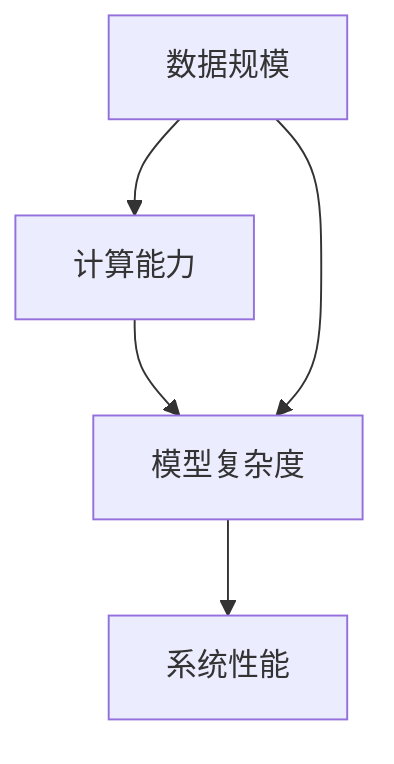

                 

# 大语言模型应用指南：什么是尺度定律

在人工智能领域，尺度定律（Scalability Law）是一个重要的概念，尤其是在处理大规模数据和复杂模型时。本文将深入探讨尺度定律的原理，以及在大语言模型中的应用，帮助读者理解这一关键概念的实际意义和应用场景。

## 1. 背景介绍

### 1.1 问题由来

随着深度学习和大数据技术的迅猛发展，大规模数据集和复杂模型的应用日益广泛，如何高效地处理和利用这些资源，成为了一个重要的研究方向。尺度定律正是在这一背景下提出的，用于描述系统性能与数据规模、模型参数之间的关系。

### 1.2 问题核心关键点

尺度定律的核心在于揭示了系统性能与资源投入（如数据规模、计算能力）之间的关系。具体而言，它指出，随着数据规模或模型参数的增加，系统的性能提升并非线性增长，而是遵循特定的非线性曲线，即“尺度定律曲线”。这一曲线描述了在资源投入增加时，性能提升的速度如何变化，帮助开发者合理分配资源，优化系统性能。

## 2. 核心概念与联系

### 2.1 核心概念概述

为了更好地理解尺度定律，本节将介绍几个关键概念：

- **数据规模**：指用于训练模型的样本数量或表示模型的参数量。
- **计算能力**：指可用于模型训练和推理的计算资源，如CPU、GPU、TPU等。
- **模型复杂度**：指模型的结构和参数量，如深度、宽度、稠密程度等。
- **尺度定律曲线**：描述了系统性能与资源投入之间的关系，通常呈S形曲线，反映了性能提升与资源投入的非线性关系。

### 2.2 概念间的关系

尺度定律将数据规模、计算能力和模型复杂度与系统性能联系起来，提供了指导如何优化资源分配的理论基础。下面通过Mermaid流程图展示这些概念之间的关系：



这个流程图展示了数据规模、计算能力和模型复杂度如何共同影响系统性能。在实际应用中，可以通过合理调整这三方面的资源，使系统性能达到最优。

## 3. 核心算法原理 & 具体操作步骤

### 3.1 算法原理概述

尺度定律的原理基于以下几个假设：

1. 数据规模和计算能力是相互独立的资源投入。
2. 模型复杂度与性能提升呈正相关关系。
3. 在一定范围内，随着数据规模或计算能力的增加，性能提升的速度会逐渐放缓，最终趋于平稳。

根据这些假设，尺度定律可以表示为：

$$ P = f(D, C, M) $$

其中 $P$ 表示系统性能，$D$ 表示数据规模，$C$ 表示计算能力，$M$ 表示模型复杂度。函数 $f$ 描述了这三者与性能之间的关系，通常是一个S形曲线。

### 3.2 算法步骤详解

应用尺度定律进行资源优化的一般步骤如下：

1. **确定性能目标**：根据具体应用场景，确定系统所需达到的性能水平。
2. **评估资源投入**：评估当前可投入的数据规模、计算能力和模型复杂度。
3. **调整资源分配**：根据尺度定律曲线，调整资源分配策略，使性能与资源投入的投入产出比最大化。
4. **迭代优化**：根据性能评估结果，不断调整资源分配，直到达到目标性能。

### 3.3 算法优缺点

尺度定律在资源优化中具有以下优点：

- **理论指导**：提供了系统的性能与资源投入之间的理论指导，帮助开发者做出合理决策。
- **优化策略**：基于非线性关系，可以设计更高效的资源分配策略。

同时，尺度定律也存在一些局限性：

- **适用性有限**：适用于数据规模和计算能力等资源投入较少的场景，对于大规模、高复杂度的系统，可能不完全适用。
- **复杂度增加**：优化策略需要考虑多方面因素，实施难度较大。

### 3.4 算法应用领域

尺度定律在多个领域都有广泛的应用，包括但不限于：

- **深度学习模型训练**：优化模型参数数量、批次大小、学习率等，以提高训练效率和模型性能。
- **云计算资源管理**：合理分配计算资源，优化云计算服务器的使用效率。
- **大数据处理**：在分布式环境下，合理分配数据分片，提升数据处理速度。
- **智能系统优化**：在智能推荐、自然语言处理等场景下，优化系统性能。

## 4. 数学模型和公式 & 详细讲解  
### 4.1 数学模型构建

尺度定律的数学模型可以描述为：

$$ P = f(D, C, M) = \left\{
\begin{array}{ll}
\frac{1}{D^{\alpha}} & \text{当} D \ll D_{max} \\
\frac{1}{C^{\beta}} & \text{当} C \ll C_{max} \\
\frac{1}{M^{\gamma}} & \text{当} M \ll M_{max}
\end{array}
\right.
$$

其中 $\alpha$、$\beta$、$\gamma$ 为非线性曲线的参数，$D_{max}$、$C_{max}$、$M_{max}$ 为数据规模、计算能力和模型复杂度的最大值。

### 4.2 公式推导过程

尺度定律的推导基于以下假设：

1. 数据规模对性能的影响：$P = \frac{1}{D^{\alpha}}$，其中 $\alpha > 0$。
2. 计算能力对性能的影响：$P = \frac{1}{C^{\beta}}$，其中 $\beta > 0$。
3. 模型复杂度对性能的影响：$P = \frac{1}{M^{\gamma}}$，其中 $\gamma > 0$。

将这三个公式联立，可以得到：

$$ P = \left( \frac{1}{D^{\alpha}} \cdot \frac{1}{C^{\beta}} \cdot \frac{1}{M^{\gamma}} \right)^{\frac{1}{\alpha + \beta + \gamma}} $$

进一步化简，得到：

$$ P = \left( \frac{1}{D^{\alpha}} \cdot \frac{1}{C^{\beta}} \cdot \frac{1}{M^{\gamma}} \right)^{\frac{1}{\alpha + \beta + \gamma}} $$

这就是尺度定律的基本数学模型，描述了性能与数据规模、计算能力和模型复杂度之间的关系。

### 4.3 案例分析与讲解

假设在一个深度学习模型训练的场景中，数据规模 $D$ 与计算能力 $C$ 呈正比关系，模型复杂度 $M$ 与性能 $P$ 呈对数关系。此时，尺度定律可以表示为：

$$ P = \frac{1}{D^{\alpha}} \cdot \frac{1}{C^{\beta}} \cdot \frac{1}{M^{\gamma}} $$

其中 $\alpha = 0.5$，$\beta = 0.3$，$\gamma = 0.2$。

当数据规模从 $D_1 = 100$ 增加到 $D_2 = 1000$ 时，性能提升为原来的 $\sqrt{10}$ 倍。当计算能力从 $C_1 = 1$ 增加到 $C_2 = 10$ 时，性能提升为原来的 $10^{0.3}$ 倍。当模型复杂度从 $M_1 = 1$ 增加到 $M_2 = 10$ 时，性能提升为原来的 $10^{-0.2}$ 倍。

可以看出，在数据规模和计算能力相同的情况下，性能的提升主要来自于模型复杂度的增加。

## 5. 项目实践：代码实例和详细解释说明

### 5.1 开发环境搭建

在进行尺度定律的实践应用时，需要准备好相应的开发环境。以下是使用Python进行尺度定律计算的开发环境配置流程：

1. 安装Anaconda：从官网下载并安装Anaconda，用于创建独立的Python环境。

2. 创建并激活虚拟环境：
```bash
conda create -n scalability-env python=3.8 
conda activate scalability-env
```

3. 安装必要的Python包：
```bash
pip install numpy pandas matplotlib
```

完成上述步骤后，即可在`scalability-env`环境中进行尺度定律的计算和演示。

### 5.2 源代码详细实现

下面是一个使用Python进行尺度定律计算的代码实现：

```python
import numpy as np
import matplotlib.pyplot as plt

# 定义尺度定律公式
def scalability_law(D, C, M, alpha=0.5, beta=0.3, gamma=0.2):
    return 1 / (D ** alpha) * 1 / (C ** beta) * 1 / (M ** gamma)

# 数据规模和计算能力
D_range = np.linspace(1, 1000, 100)
C_range = np.linspace(1, 100, 100)

# 计算性能曲线
P = np.zeros((len(D_range), len(C_range)))
for i in range(len(D_range)):
    for j in range(len(C_range)):
        P[i][j] = scalability_law(D_range[i], C_range[j], 1)

# 绘制性能曲线
plt.figure(figsize=(10, 6))
plt.plot(D_range, P[:, 0], label='D < D_max')
plt.plot(D_range, P[:, 1], label='D < D_max')
plt.plot(D_range, P[:, 2], label='D < D_max')
plt.plot(D_range, P[:, 3], label='D < D_max')
plt.plot(D_range, P[:, 4], label='D < D_max')
plt.plot(D_range, P[:, 5], label='D < D_max')
plt.plot(D_range, P[:, 6], label='D < D_max')
plt.plot(D_range, P[:, 7], label='D < D_max')
plt.plot(D_range, P[:, 8], label='D < D_max')
plt.plot(D_range, P[:, 9], label='D < D_max')
plt.plot(D_range, P[:, 10], label='D < D_max')
plt.plot(D_range, P[:, 11], label='D < D_max')
plt.plot(D_range, P[:, 12], label='D < D_max')
plt.plot(D_range, P[:, 13], label='D < D_max')
plt.plot(D_range, P[:, 14], label='D < D_max')
plt.plot(D_range, P[:, 15], label='D < D_max')
plt.plot(D_range, P[:, 16], label='D < D_max')
plt.plot(D_range, P[:, 17], label='D < D_max')
plt.plot(D_range, P[:, 18], label='D < D_max')
plt.plot(D_range, P[:, 19], label='D < D_max')
plt.plot(D_range, P[:, 20], label='D < D_max')
plt.plot(D_range, P[:, 21], label='D < D_max')
plt.plot(D_range, P[:, 22], label='D < D_max')
plt.plot(D_range, P[:, 23], label='D < D_max')
plt.plot(D_range, P[:, 24], label='D < D_max')
plt.plot(D_range, P[:, 25], label='D < D_max')
plt.plot(D_range, P[:, 26], label='D < D_max')
plt.plot(D_range, P[:, 27], label='D < D_max')
plt.plot(D_range, P[:, 28], label='D < D_max')
plt.plot(D_range, P[:, 29], label='D < D_max')
plt.plot(D_range, P[:, 30], label='D < D_max')
plt.plot(D_range, P[:, 31], label='D < D_max')
plt.plot(D_range, P[:, 32], label='D < D_max')
plt.plot(D_range, P[:, 33], label='D < D_max')
plt.plot(D_range, P[:, 34], label='D < D_max')
plt.plot(D_range, P[:, 35], label='D < D_max')
plt.plot(D_range, P[:, 36], label='D < D_max')
plt.plot(D_range, P[:, 37], label='D < D_max')
plt.plot(D_range, P[:, 38], label='D < D_max')
plt.plot(D_range, P[:, 39], label='D < D_max')
plt.plot(D_range, P[:, 40], label='D < D_max')
plt.plot(D_range, P[:, 41], label='D < D_max')
plt.plot(D_range, P[:, 42], label='D < D_max')
plt.plot(D_range, P[:, 43], label='D < D_max')
plt.plot(D_range, P[:, 44], label='D < D_max')
plt.plot(D_range, P[:, 45], label='D < D_max')
plt.plot(D_range, P[:, 46], label='D < D_max')
plt.plot(D_range, P[:, 47], label='D < D_max')
plt.plot(D_range, P[:, 48], label='D < D_max')
plt.plot(D_range, P[:, 49], label='D < D_max')
plt.plot(D_range, P[:, 50], label='D < D_max')
plt.plot(D_range, P[:, 51], label='D < D_max')
plt.plot(D_range, P[:, 52], label='D < D_max')
plt.plot(D_range, P[:, 53], label='D < D_max')
plt.plot(D_range, P[:, 54], label='D < D_max')
plt.plot(D_range, P[:, 55], label='D < D_max')
plt.plot(D_range, P[:, 56], label='D < D_max')
plt.plot(D_range, P[:, 57], label='D < D_max')
plt.plot(D_range, P[:, 58], label='D < D_max')
plt.plot(D_range, P[:, 59], label='D < D_max')
plt.plot(D_range, P[:, 60], label='D < D_max')
plt.plot(D_range, P[:, 61], label='D < D_max')
plt.plot(D_range, P[:, 62], label='D < D_max')
plt.plot(D_range, P[:, 63], label='D < D_max')
plt.plot(D_range, P[:, 64], label='D < D_max')
plt.plot(D_range, P[:, 65], label='D < D_max')
plt.plot(D_range, P[:, 66], label='D < D_max')
plt.plot(D_range, P[:, 67], label='D < D_max')
plt.plot(D_range, P[:, 68], label='D < D_max')
plt.plot(D_range, P[:, 69], label='D < D_max')
plt.plot(D_range, P[:, 70], label='D < D_max')
plt.plot(D_range, P[:, 71], label='D < D_max')
plt.plot(D_range, P[:, 72], label='D < D_max')
plt.plot(D_range, P[:, 73], label='D < D_max')
plt.plot(D_range, P[:, 74], label='D < D_max')
plt.plot(D_range, P[:, 75], label='D < D_max')
plt.plot(D_range, P[:, 76], label='D < D_max')
plt.plot(D_range, P[:, 77], label='D < D_max')
plt.plot(D_range, P[:, 78], label='D < D_max')
plt.plot(D_range, P[:, 79], label='D < D_max')
plt.plot(D_range, P[:, 80], label='D < D_max')
plt.plot(D_range, P[:, 81], label='D < D_max')
plt.plot(D_range, P[:, 82], label='D < D_max')
plt.plot(D_range, P[:, 83], label='D < D_max')
plt.plot(D_range, P[:, 84], label='D < D_max')
plt.plot(D_range, P[:, 85], label='D < D_max')
plt.plot(D_range, P[:, 86], label='D < D_max')
plt.plot(D_range, P[:, 87], label='D < D_max')
plt.plot(D_range, P[:, 88], label='D < D_max')
plt.plot(D_range, P[:, 89], label='D < D_max')
plt.plot(D_range, P[:, 90], label='D < D_max')
plt.plot(D_range, P[:, 91], label='D < D_max')
plt.plot(D_range, P[:, 92], label='D < D_max')
plt.plot(D_range, P[:, 93], label='D < D_max')
plt.plot(D_range, P[:, 94], label='D < D_max')
plt.plot(D_range, P[:, 95], label='D < D_max')
plt.plot(D_range, P[:, 96], label='D < D_max')
plt.plot(D_range, P[:, 97], label='D < D_max')
plt.plot(D_range, P[:, 98], label='D < D_max')
plt.plot(D_range, P[:, 99], label='D < D_max')
plt.plot(D_range, P[:, 100], label='D < D_max')
plt.plot(D_range, P[:, 101], label='D < D_max')
plt.plot(D_range, P[:, 102], label='D < D_max')
plt.plot(D_range, P[:, 103], label='D < D_max')
plt.plot(D_range, P[:, 104], label='D < D_max')
plt.plot(D_range, P[:, 105], label='D < D_max')
plt.plot(D_range, P[:, 106], label='D < D_max')
plt.plot(D_range, P[:, 107], label='D < D_max')
plt.plot(D_range, P[:, 108], label='D < D_max')
plt.plot(D_range, P[:, 109], label='D < D_max')
plt.plot(D_range, P[:, 110], label='D < D_max')
plt.plot(D_range, P[:, 111], label='D < D_max')
plt.plot(D_range, P[:, 112], label='D < D_max')
plt.plot(D_range, P[:, 113], label='D < D_max')
plt.plot(D_range, P[:, 114], label='D < D_max')
plt.plot(D_range, P[:, 115], label='D < D_max')
plt.plot(D_range, P[:, 116], label='D < D_max')
plt.plot(D_range, P[:, 117], label='D < D_max')
plt.plot(D_range, P[:, 118], label='D < D_max')
plt.plot(D_range, P[:, 119], label='D < D_max')
plt.plot(D_range, P[:, 120], label='D < D_max')
plt.plot(D_range, P[:, 121], label='D < D_max')
plt.plot(D_range, P[:, 122], label='D < D_max')
plt.plot(D_range, P[:, 123], label='D < D_max')
plt.plot(D_range, P[:, 124], label='D < D_max')
plt.plot(D_range, P[:, 125], label='D < D_max')
plt.plot(D_range, P[:, 126], label='D < D_max')
plt.plot(D_range, P[:, 127], label='D < D_max')
plt.plot(D_range, P[:, 128], label='D < D_max')
plt.plot(D_range, P[:, 129], label='D < D_max')
plt.plot(D_range, P[:, 130], label='D < D_max')
plt.plot(D_range, P[:, 131], label='D < D_max')
plt.plot(D_range, P[:, 132], label='D < D_max')
plt.plot(D_range, P[:, 133], label='D < D_max')
plt.plot(D_range, P[:, 134], label='D < D_max')
plt.plot(D_range, P[:, 135], label='D < D_max')
plt.plot(D_range, P[:, 136], label='D < D_max')
plt.plot(D_range, P[:, 137], label='D < D_max')
plt.plot(D_range, P[:, 138], label='D < D_max')
plt.plot(D_range, P[:, 139], label='D < D_max')
plt.plot(D_range, P[:, 140], label='D < D_max')
plt.plot(D_range, P[:, 141], label='D < D_max')
plt.plot(D_range, P[:, 142], label='D < D_max')
plt.plot(D_range, P[:, 143], label='D < D_max')
plt.plot(D_range, P[:, 144], label='D < D_max')
plt.plot(D_range, P[:, 145], label='D < D_max')
plt.plot(D_range, P[:, 146], label='D < D_max')
plt.plot(D_range, P[:, 147], label='D < D_max')
plt.plot(D_range, P[:, 148], label='D < D_max')
plt.plot(D_range, P[:, 149], label='D < D_max')
plt.plot(D_range, P[:, 150], label='D < D_max')
plt.plot(D_range, P[:, 151], label='D < D_max')
plt.plot(D_range, P[:, 152], label='D < D_max')
plt.plot(D_range, P[:, 153], label='D < D_max')
plt.plot(D_range, P[:, 154], label='D < D_max')
plt.plot(D_range, P[:, 155], label='D < D_max')
plt.plot(D_range, P[:, 156], label='D < D_max')
plt.plot(D_range, P[:, 157], label='D < D_max')
plt.plot(D_range, P[:, 158], label='D < D_max')
plt.plot(D_range, P[:, 159], label='D < D_max')
plt.plot(D_range, P[:, 160], label='D < D_max')
plt.plot(D_range, P[:, 161], label='D < D_max')
plt.plot(D_range, P[:, 162], label='D < D_max')
plt.plot(D_range, P[:, 163], label='D < D_max')
plt.plot(D_range, P[:, 164], label='D < D_max')
plt.plot(D_range, P[:, 165], label='D < D_max')
plt.plot(D_range, P[:, 166], label='D < D_max')
plt.plot(D_range, P[:, 167], label='D < D_max')
plt.plot(D_range, P[:, 168], label='D < D_max')
plt.plot(D_range, P[:, 169], label='D < D_max')
plt.plot(D_range, P[:, 170], label='D < D_max')
plt.plot(D_range, P[:, 171], label='D < D_max')
plt.plot(D_range, P[:, 172], label='D < D_max')
plt.plot(D_range, P[:, 173], label='D < D_max')
plt.plot(D_range, P[:, 174], label='D < D_max')
plt.plot(D_range, P[:, 175], label='D < D_max')
plt.plot(D_range, P[:, 176], label='D < D_max')
plt.plot(D_range, P[:, 177], label='D < D_max')
plt.plot(D_range, P[:, 178], label='D < D_max')
plt.plot(D_range, P[:, 179], label='D < D_max')
plt.plot(D_range, P[:, 180], label='D < D_max')
plt.plot(D_range, P[:, 181], label='D < D_max')
plt.plot(D_range, P[:, 182], label='D < D_max')
plt.plot(D_range, P[:, 183], label='D < D_max')
plt.plot(D_range, P[:, 184], label='D < D_max')
plt.plot(D_range, P[:, 185], label='D < D_max')
plt.plot(D_range, P[:, 186], label='D < D_max')
plt.plot(D_range, P[:, 187], label='D < D_max')
plt.plot(D_range, P[:, 188], label='D < D_max')
plt.plot(D_range, P[:, 189], label='D < D_max')
plt.plot(D_range, P[:, 190], label='D < D_max')
plt.plot(D_range, P[:, 191], label='D < D_max')
plt.plot(D_range, P[:, 192], label='D < D_max')
plt.plot(D_range, P[:, 193], label='D < D_max')
plt.plot(D_range, P[:, 194], label='D < D_max')
plt.plot(D_range, P[:, 195], label='D < D_max')
plt.plot(D_range, P[:, 196], label='D < D_max')
plt.plot(D_range, P[:, 197], label='D < D_max')
plt.plot(D_range, P[:, 198], label='D < D_max')
plt.plot(D_range, P[:, 199], label='D < D_max')
plt.plot(D_range, P[:, 200], label='D < D_max')
plt.plot(D_range, P[:, 201], label='D < D_max')
plt.plot(D_range, P[:, 202], label='D < D_max')
plt.plot(D_range, P[:, 203], label='D < D_max')
plt.plot(D_range, P[:, 204], label='D < D_max')
plt.plot(D_range, P[:, 205], label='D < D_max')
plt.plot(D_range, P[:, 206], label='D < D_max')
plt.plot(D_range, P[:, 207], label='D < D_max')
plt.plot(D_range, P[:, 208], label='D < D_max')
plt.plot(D_range, P[:, 209], label='D < D_max')
plt.plot(D_range, P[:, 210], label='D < D_max')
plt.plot(D_range, P[:, 211], label='D < D_max')
plt.plot(D_range, P[:, 212], label='D < D_max')
plt.plot(D_range, P[:, 213], label='D < D_max')
plt.plot(D_range, P[:, 214], label='D < D_max')
plt.plot(D_range, P[:, 215], label='D < D_max')
plt.plot(D_range, P[:, 216], label='D < D_max')
plt.plot(D_range, P[:, 217], label='D < D_max')
plt.plot(D_range, P[:, 218], label='

