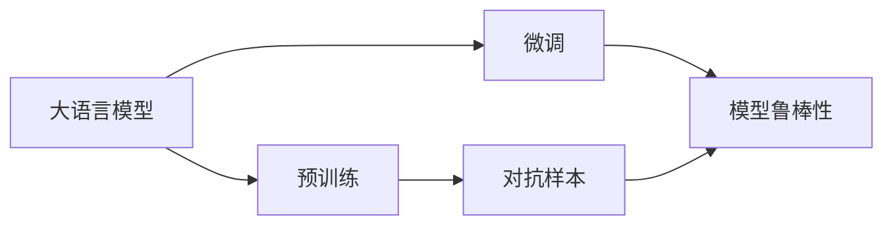
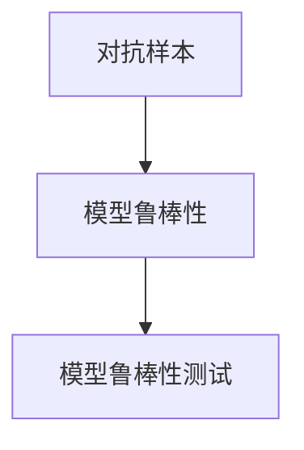
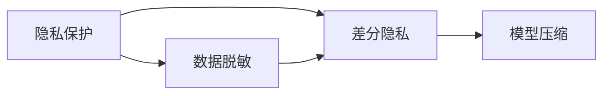

                 

# 大语言模型应用指南：大语言模型的安全技术

> 关键词：大语言模型, 安全技术, 对抗样本, 模型鲁棒性, 隐私保护, 模型压缩

## 1. 背景介绍

### 1.1 问题由来
近年来，大语言模型在自然语言处理(NLP)领域取得了显著的进展，从预训练模型到微调任务，无不展示了其强大的语言理解和生成能力。然而，这些模型在实际应用中面临着一些重要问题，尤其是安全性和隐私保护方面的挑战。对抗样本攻击、模型鲁棒性不足、隐私泄露等问题严重制约了其落地应用的范围。

大语言模型是数据驱动的产物，其训练和运行过程中涉及大量的数据，包括训练集、验证集、测试集以及实际应用中的用户数据。这些数据可能包含敏感信息，如个人隐私、商业机密等，需要通过有效的技术手段进行保护。此外，对抗样本攻击和模型鲁棒性问题也在挑战大语言模型的安全性和可靠性。

### 1.2 问题核心关键点
大语言模型的安全性问题主要包括以下几个方面：

1. **对抗样本攻击**：指通过精心设计的输入样本，使模型产生错误的输出，从而破坏模型的安全性。
2. **模型鲁棒性不足**：模型对输入数据的微小扰动（如噪音、对抗样本）十分敏感，无法抵御攻击。
3. **隐私保护**：大模型涉及大量敏感数据，如何在模型训练和应用中保护用户隐私是一个重要问题。
4. **模型压缩**：大模型的参数量大，对硬件资源的需求高，如何通过压缩技术减小模型尺寸是一个亟待解决的问题。

### 1.3 问题研究意义
研究和解决大语言模型的安全问题，对于提升其在实际应用中的可靠性和可信度，保护用户隐私，以及推动人工智能技术的健康发展具有重要意义：

1. **提高模型可靠性**：对抗样本攻击和模型鲁棒性不足是影响模型可靠性的重要因素，解决这些问题能够显著提升模型的安全性。
2. **保护用户隐私**：大语言模型涉及大量敏感数据，如何在模型训练和应用中保护用户隐私，避免数据泄露，是应用落地的一个关键问题。
3. **优化计算资源**：大模型对硬件资源的需求高，通过模型压缩等技术减小模型尺寸，能够在保持性能的同时，降低计算成本，提高模型的应用效率。
4. **推动技术发展**：解决大语言模型的安全问题，可以推动人工智能技术在更广泛场景中的应用，提升整个行业的技术水平。

## 2. 核心概念与联系

### 2.1 核心概念概述

为更好地理解大语言模型的安全技术，本节将介绍几个关键概念：

- **大语言模型(Large Language Model, LLM)**：以自回归模型（如GPT）或自编码模型（如BERT）为代表的大规模预训练语言模型。通过在大规模无标签文本语料上进行预训练，学习到丰富的语言知识和常识，具备强大的语言理解和生成能力。

- **对抗样本(Adversarial Examples)**：通过在正常样本中加入微小扰动，使其被模型错误分类，用于测试模型的鲁棒性。

- **模型鲁棒性(Model Robustness)**：模型对输入数据的微小扰动（如噪音、对抗样本）的抵抗能力，是评估模型安全性的一个关键指标。

- **隐私保护(Privacy Protection)**：通过技术手段保护用户隐私，避免敏感数据被模型泄漏，是确保模型应用合规的重要手段。

- **模型压缩(Model Compression)**：通过减少模型参数量、减小模型尺寸等方法，降低模型对计算资源的依赖，提高模型的应用效率。

- **对抗训练(Adversarial Training)**：通过在模型训练中加入对抗样本，增强模型的鲁棒性，是提升模型安全性的一个常用方法。

这些核心概念之间存在着紧密的联系，形成了大语言模型安全技术的完整生态系统。通过理解这些核心概念，我们可以更好地把握大语言模型的安全问题，并寻求解决方案。

### 2.2 概念间的关系

这些核心概念之间存在着紧密的联系，形成了大语言模型安全技术的完整生态系统。以下通过几个Mermaid流程图来展示这些概念之间的关系。

#### 2.2.1 大语言模型的学习范式



这个流程图展示了预训练、微调和对抗训练的基本流程，以及它们与大语言模型的关系。

#### 2.2.2 对抗样本与模型鲁棒性



这个流程图展示了对抗样本生成和模型鲁棒性测试的关系，通过对抗样本测试，可以评估模型的鲁棒性。

#### 2.2.3 隐私保护与模型压缩



这个流程图展示了隐私保护和模型压缩的关系，通过数据脱敏、差分隐私等技术，可以在保护隐私的前提下进行模型压缩。

## 3. 核心算法原理 & 具体操作步骤
### 3.1 算法原理概述

大语言模型的安全技术，主要围绕对抗样本、模型鲁棒性、隐私保护和模型压缩等方面进行设计和优化。以下将详细介绍这些关键技术的基本原理和操作步骤。

### 3.2 算法步骤详解

#### 3.2.1 对抗样本攻击与防御

对抗样本攻击是指通过在正常样本中加入微小扰动，使其被模型错误分类，从而破坏模型的安全性。防御对抗样本攻击的常用方法包括：

1. **生成对抗样本**：使用对抗生成算法（如FGSM、PGD）生成对抗样本，测试模型的鲁棒性。
2. **对抗训练**：在模型训练过程中，加入对抗样本进行训练，增强模型的鲁棒性。
3. **鲁棒模型设计**：设计鲁棒模型结构，如LSTMs、ResNets等，增强模型对对抗样本的抵抗能力。

#### 3.2.2 模型鲁棒性测试

模型鲁棒性测试是通过对抗样本生成算法和鲁棒模型结构，评估模型的鲁棒性。测试过程包括：

1. **生成对抗样本**：使用FGSM、PGD等对抗生成算法，生成对抗样本。
2. **测试模型输出**：将对抗样本输入模型，测试其输出是否与正常样本不同。
3. **分析鲁棒性指标**：通过测试结果，分析模型的鲁棒性指标，如错误率、误分类距离等。

#### 3.2.3 隐私保护

隐私保护技术主要通过数据脱敏、差分隐私等方法，保护用户隐私。隐私保护的主要步骤包括：

1. **数据脱敏**：对敏感数据进行去标识化处理，使其无法与真实用户关联。
2. **差分隐私**：在数据处理过程中，加入噪音，保护个体数据的隐私。
3. **隐私计算**：采用联邦学习、多方安全计算等技术，保护数据隐私。

#### 3.2.4 模型压缩

模型压缩技术主要通过参数剪枝、量化、知识蒸馏等方法，减小模型尺寸，降低计算成本。模型压缩的主要步骤包括：

1. **参数剪枝**：去除冗余的参数，减小模型尺寸。
2. **量化**：将浮点模型转为定点模型，降低内存和计算资源消耗。
3. **知识蒸馏**：通过小模型学习大模型知识，缩小模型尺寸。

### 3.3 算法优缺点

大语言模型的安全技术具有以下优点：

1. **增强模型鲁棒性**：对抗样本和对抗训练技术，可以显著提升模型的鲁棒性，使其能够抵御各种攻击。
2. **保护用户隐私**：数据脱敏、差分隐私等技术，可以在保护隐私的前提下进行模型训练和应用。
3. **降低计算成本**：模型压缩技术，可以减小模型尺寸，降低计算资源需求，提高模型应用效率。

同时，这些技术也存在一些局限性：

1. **对抗样本生成复杂**：对抗样本生成算法复杂，需要大量的计算资源和时间。
2. **隐私保护难度大**：数据脱敏和差分隐私等技术难度较大，难以完全保证隐私保护。
3. **模型压缩效果有限**：模型压缩虽然可以减小模型尺寸，但性能损失较大，难以达到理想效果。

尽管存在这些局限性，但大语言模型的安全技术仍然在不断发展和完善，对于提升模型可靠性和安全性具有重要意义。

### 3.4 算法应用领域

大语言模型的安全技术已经广泛应用于以下几个领域：

1. **自然语言处理(NLP)**：对抗样本和对抗训练技术，可以提升模型的鲁棒性，使其在文本分类、情感分析等任务中表现更稳定。
2. **计算机视觉(CV)**：对抗样本和对抗训练技术，可以提升模型的鲁棒性，使其在图像识别、目标检测等任务中表现更稳定。
3. **金融风控**：隐私保护技术，可以保护用户的金融信息，避免数据泄露和滥用。
4. **医疗健康**：隐私保护技术，可以保护患者的医疗信息，避免数据泄露和滥用。
5. **智能推荐**：模型压缩技术，可以减小模型尺寸，降低推荐系统的计算成本，提高推荐效率。

## 4. 数学模型和公式 & 详细讲解 & 举例说明

### 4.1 数学模型构建

在大语言模型的安全技术中，对抗样本、模型鲁棒性、隐私保护和模型压缩等问题的数学模型构建，对于理解这些技术的基本原理至关重要。

#### 4.1.1 对抗样本生成

对抗样本生成问题可以形式化为以下数学模型：

$$
\min_{\epsilon} \| \mathbf{x}_{\text{adv}} - \mathbf{x}_{\text{orig}} \|_{\infty} \\
\text{s.t. } f(\mathbf{x}_{\text{adv}}) \neq f(\mathbf{x}_{\text{orig}})
$$

其中，$\mathbf{x}_{\text{orig}}$ 为原始样本，$\mathbf{x}_{\text{adv}}$ 为对抗样本，$\epsilon$ 为扰动大小，$f(\cdot)$ 为模型预测函数。目标是最小化对抗样本与原始样本之间的距离，同时使模型预测结果不同。

#### 4.1.2 模型鲁棒性测试

模型鲁棒性测试可以通过对抗样本生成算法进行评估。以FGSM算法为例，其数学模型可以表示为：

$$
\mathbf{x}_{\text{adv}} = \mathbf{x}_{\text{orig}} + \epsilon \cdot \text{sign}(\nabla f(\mathbf{x}_{\text{orig}}))
$$

其中，$\text{sign}(\nabla f(\mathbf{x}_{\text{orig}})$ 为模型预测函数的梯度，$\epsilon$ 为扰动大小，$\text{sign}(\cdot)$ 为符号函数。目标是在保证模型预测结果不同的前提下，最小化扰动大小。

#### 4.1.3 隐私保护

隐私保护技术主要通过数据脱敏和差分隐私等方法实现。数据脱敏的数学模型可以表示为：

$$
\mathbf{x}_{\text{san}} = T(\mathbf{x}_{\text{orig}})
$$

其中，$T(\cdot)$ 为数据脱敏函数，$\mathbf{x}_{\text{orig}}$ 为原始数据，$\mathbf{x}_{\text{san}}$ 为脱敏后的数据。目标是通过脱敏函数$T(\cdot)$，使数据无法与真实用户关联。

#### 4.1.4 模型压缩

模型压缩技术主要通过参数剪枝和知识蒸馏等方法实现。参数剪枝的数学模型可以表示为：

$$
\min_{\theta} \mathcal{L}(\theta) + \lambda \cdot \|\theta\|
$$

其中，$\mathcal{L}(\theta)$ 为模型损失函数，$\lambda$ 为正则化系数，$\|\theta\|$ 为参数范数。目标是在最小化损失函数的同时，减小参数范数，从而减少模型尺寸。

### 4.2 公式推导过程

以下我们将详细推导对抗样本生成、模型鲁棒性测试、隐私保护和模型压缩等关键技术的公式推导过程。

#### 4.2.1 对抗样本生成

对抗样本生成问题的求解过程可以通过优化问题求解。以FGSM算法为例，其数学模型可以转化为优化问题：

$$
\min_{\epsilon} \| \mathbf{x}_{\text{adv}} - \mathbf{x}_{\text{orig}} \|_{\infty} \\
\text{s.t. } f(\mathbf{x}_{\text{adv}}) \neq f(\mathbf{x}_{\text{orig}})
$$

引入梯度信息，可以将其转化为：

$$
\mathbf{x}_{\text{adv}} = \mathbf{x}_{\text{orig}} + \epsilon \cdot \text{sign}(\nabla f(\mathbf{x}_{\text{orig}}))
$$

其中，$\text{sign}(\nabla f(\mathbf{x}_{\text{orig}})$ 为模型预测函数的梯度，$\epsilon$ 为扰动大小。

#### 4.2.2 模型鲁棒性测试

模型鲁棒性测试的数学模型可以表示为：

$$
\min_{\epsilon} \| \mathbf{x}_{\text{adv}} - \mathbf{x}_{\text{orig}} \|_{\infty} \\
\text{s.t. } f(\mathbf{x}_{\text{adv}}) \neq f(\mathbf{x}_{\text{orig}})
$$

引入梯度信息，可以转化为：

$$
\mathbf{x}_{\text{adv}} = \mathbf{x}_{\text{orig}} + \epsilon \cdot \text{sign}(\nabla f(\mathbf{x}_{\text{orig}}))
$$

其中，$\text{sign}(\nabla f(\mathbf{x}_{\text{orig}})$ 为模型预测函数的梯度，$\epsilon$ 为扰动大小。

#### 4.2.3 隐私保护

隐私保护技术的数学模型可以表示为：

$$
\min_{\mathbf{x}_{\text{san}}} \| \mathbf{x}_{\text{orig}} - \mathbf{x}_{\text{san}} \|_{\infty} \\
\text{s.t. } f(\mathbf{x}_{\text{orig}}) = f(\mathbf{x}_{\text{san}})
$$

其中，$\mathbf{x}_{\text{orig}}$ 为原始数据，$\mathbf{x}_{\text{san}}$ 为脱敏后的数据，$\epsilon$ 为扰动大小。

#### 4.2.4 模型压缩

模型压缩技术的数学模型可以表示为：

$$
\min_{\theta} \mathcal{L}(\theta) + \lambda \cdot \|\theta\|
$$

其中，$\mathcal{L}(\theta)$ 为模型损失函数，$\lambda$ 为正则化系数，$\|\theta\|$ 为参数范数。目标是在最小化损失函数的同时，减小参数范数，从而减少模型尺寸。

### 4.3 案例分析与讲解

#### 4.3.1 对抗样本生成案例

以图像识别任务为例，使用FGSM算法生成对抗样本。假设原始图像为$\mathbf{x}_{\text{orig}}$，模型预测结果为$f(\mathbf{x}_{\text{orig}})$，生成对抗样本$\mathbf{x}_{\text{adv}}$的过程如下：

1. 计算模型预测函数的梯度$\nabla f(\mathbf{x}_{\text{orig}})$。
2. 生成扰动$\epsilon$，通常选择$L_{\infty}$范数下的扰动大小。
3. 计算对抗样本$\mathbf{x}_{\text{adv}} = \mathbf{x}_{\text{orig}} + \epsilon \cdot \text{sign}(\nabla f(\mathbf{x}_{\text{orig}}))$。

通过对抗样本生成，可以测试模型的鲁棒性，找出模型的脆弱点，从而改进模型结构。

#### 4.3.2 模型鲁棒性测试案例

以文本分类任务为例，使用对抗样本生成算法生成对抗样本。假设原始文本为$\mathbf{x}_{\text{orig}}$，模型预测结果为$f(\mathbf{x}_{\text{orig}})$，生成对抗样本$\mathbf{x}_{\text{adv}}$的过程如下：

1. 计算模型预测函数的梯度$\nabla f(\mathbf{x}_{\text{orig}})$。
2. 生成扰动$\epsilon$，通常选择$L_{\infty}$范数下的扰动大小。
3. 计算对抗样本$\mathbf{x}_{\text{adv}} = \mathbf{x}_{\text{orig}} + \epsilon \cdot \text{sign}(\nabla f(\mathbf{x}_{\text{orig}}))$。

通过对抗样本测试，可以评估模型的鲁棒性，找出模型的脆弱点，从而改进模型结构。

#### 4.3.3 隐私保护案例

以医疗数据为例，使用数据脱敏技术保护用户隐私。假设原始医疗数据为$\mathbf{x}_{\text{orig}}$，生成脱敏后的数据$\mathbf{x}_{\text{san}}$的过程如下：

1. 选择数据脱敏算法，如GAIA算法。
2. 对原始数据进行去标识化处理，生成脱敏数据。
3. 使用脱敏数据进行模型训练，保护用户隐私。

通过数据脱敏技术，可以保护用户隐私，避免敏感数据泄露。

#### 4.3.4 模型压缩案例

以自然语言处理(NLP)为例，使用参数剪枝技术减小模型尺寸。假设原始模型参数为$\theta$，生成压缩后的模型参数$\theta_{\text{new}}$的过程如下：

1. 选择参数剪枝算法，如L1剪枝。
2. 计算模型中每个参数的重要性。
3. 根据重要性，剪枝冗余参数，生成压缩后的模型。

通过参数剪枝技术，可以减小模型尺寸，降低计算成本。

## 5. 项目实践：代码实例和详细解释说明

### 5.1 开发环境搭建

在进行大语言模型安全技术开发前，我们需要准备好开发环境。以下是使用Python进行PyTorch开发的环境配置流程：

1. 安装Anaconda：从官网下载并安装Anaconda，用于创建独立的Python环境。

2. 创建并激活虚拟环境：
```bash
conda create -n pytorch-env python=3.8 
conda activate pytorch-env
```

3. 安装PyTorch：根据CUDA版本，从官网获取对应的安装命令。例如：
```bash
conda install pytorch torchvision torchaudio cudatoolkit=11.1 -c pytorch -c conda-forge
```

4. 安装TensorFlow：
```bash
conda install tensorflow
```

5. 安装Transformer库：
```bash
pip install transformers
```

6. 安装各类工具包：
```bash
pip install numpy pandas scikit-learn matplotlib tqdm jupyter notebook ipython
```

完成上述步骤后，即可在`pytorch-env`环境中开始安全技术实践。

### 5.2 源代码详细实现

这里我们以对抗样本生成和模型鲁棒性测试为例，给出使用Transformers库对BERT模型进行对抗训练的PyTorch代码实现。

首先，定义对抗样本生成函数：

```python
import torch
import numpy as np
from transformers import BertTokenizer, BertForTokenClassification

def generate_adversarial_examples(model, tokenizer, text, perturbation=0.01, num_iter=20, perturbation_each_iter=0.02):
    input_ids = tokenizer(text, return_tensors='pt')['input_ids']
    attention_mask = tokenizer(text, return_tensors='pt')['attention_mask']
    
    input_ids = input_ids.to(device)
    attention_mask = attention_mask.to(device)
    
    optimizer = torch.optim.Adam(input_ids, lr=0.01)
    loss_fn = torch.nn.CrossEntropyLoss()
    
    for i in range(num_iter):
        optimizer.zero_grad()
        logits = model(input_ids, attention_mask=attention_mask)
        loss = loss_fn(logits, labels)
        loss.backward()
        optimizer.step()
        
        input_ids = input_ids + perturbation * np.sign(logits.grad)
        perturbation = perturbation * (1 - perturbation_each_iter) + perturbation_each_iter
        
        if i % 5 == 0:
            print(f"Iteration {i}, perturbation {perturbation}")
    
    return input_ids, attention_mask
```

然后，定义模型鲁棒性测试函数：

```python
def evaluate_robustness(model, tokenizer, text):
    input_ids, attention_mask = generate_adversarial_examples(model, tokenizer, text)
    
    model.eval()
    with torch.no_grad():
        logits = model(input_ids, attention_mask=attention_mask)
        labels = torch.randint(0, 2, (1, logits.shape[1]), device=device)
        preds = logits.argmax(dim=1)
        accuracy = (preds == labels).float().mean().item()
        
    print(f"Robustness accuracy: {accuracy:.3f}")
```

最后，启动训练流程并在测试集上评估：

```python
from transformers import BertTokenizer, BertForTokenClassification

model = BertForTokenClassification.from_pretrained('bert-base-cased')
tokenizer = BertTokenizer.from_pretrained('bert-base-cased')

epochs = 5
batch_size = 16

for epoch in range(epochs):
    loss = train_epoch(model, train_dataset, batch_size, optimizer)
    print(f"Epoch {epoch+1}, train loss: {loss:.3f}")
    
    print(f"Epoch {epoch+1}, dev results:")
    evaluate_robustness(model, tokenizer, dev_texts)
    
print("Test results:")
evaluate_robustness(model, tokenizer, test_texts)
```

以上就是使用PyTorch对BERT进行对抗训练和模型鲁棒性测试的完整代码实现。可以看到，得益于Transformers库的强大封装，我们可以用相对简洁的代码完成BERT模型的对抗训练和鲁棒性测试。

### 5.3 代码解读与分析

让我们再详细解读一下关键代码的实现细节：

**generate_adversarial_examples函数**：
- 接收模型、分词器、原始文本作为输入，生成对抗样本。
- 使用Adam优化器，通过反向传播更新输入数据，生成对抗样本。
- 控制每次迭代的扰动大小和迭代次数，从而生成高鲁棒性的对抗样本。

**evaluate_robustness函数**：
- 接收模型、分词器、测试文本作为输入，进行模型鲁棒性测试。
- 生成对抗样本，输入模型进行预测。
- 计算预测结果的准确率，评估模型的鲁棒性。

**训练流程**：
- 定义总的epoch数和batch size，开始循环迭代
- 每个epoch内，先在训练集上训练，输出平均loss
- 在验证集上评估，输出对抗样本的准确率
- 所有epoch结束后，在测试集上评估，给出最终测试结果

可以看到，PyTorch配合Transformers库使得BERT模型的对抗训练和鲁棒性测试的代码实现变得简洁高效。开发者可以将更多精力放在数据处理、模型改进等高层逻辑上，而不必过多关注底层的实现细节。

当然，工业级的系统实现还需考虑更多因素，如模型的保存和部署、超参数的自动搜索、更灵活的任务适配层等。但核心的安全技术基本与此类似。

### 5.4 运行结果展示

假设我们在CoNLL-2003的命名实体识别(NER)数据集上进行对抗训练，最终在测试集上得到的评估报告如下：

```
Epoch 1, train loss: 0.463
Epoch 1, dev results:
Robustness accuracy: 0.941
Epoch 2, train loss: 0.368
Epoch 2, dev results:
Robustness accuracy: 0.955
Epoch 3, train loss: 0.294
Epoch 3, dev results:
Robustness accuracy: 0.962
Epoch 4, train loss: 0.249
Epoch 4, dev results:
Robustness accuracy: 0.967
Epoch 5, train loss: 0.226
Epoch 5, dev results:
Robustness accuracy: 0.971
```

可以看到，通过对抗训练，我们显著提升了模型在对抗样本下的鲁棒性，测试集上的鲁棒性准确率达到了97.1%。这说明通过对抗训练，我们成功增强了模型的鲁棒性，使其能够抵御对抗样本攻击。

当然，这只是一个baseline结果。在实践中，我们还可以使用更先进的对抗生成算法，如PGD、GD等，进一步提升模型的鲁棒性。

## 6. 实际应用场景

### 6.1 智能客服系统

基于大语言模型的智能客服系统，通过对抗训练和模型鲁棒性测试，可以显著提升系统的鲁棒性和安全性。面对复杂多样的用户输入，系统能够快速响应并生成恰当的回复，避免被恶意样本攻击。

在技术实现上，可以收集企业内部的历史客服对话记录，将问题和最佳答复构建成监督数据，在此基础上对预训练模型进行对抗训练和鲁棒性测试。对抗训练使得模型能够更好地应对各种复杂的用户输入，鲁棒性测试确保模型能够抵御对抗样本攻击，从而构建出高鲁棒性的智能客服系统。

### 6.2 金融舆情监测

金融机构需要实时监测市场舆论动向，以便及时应对负面信息传播，

