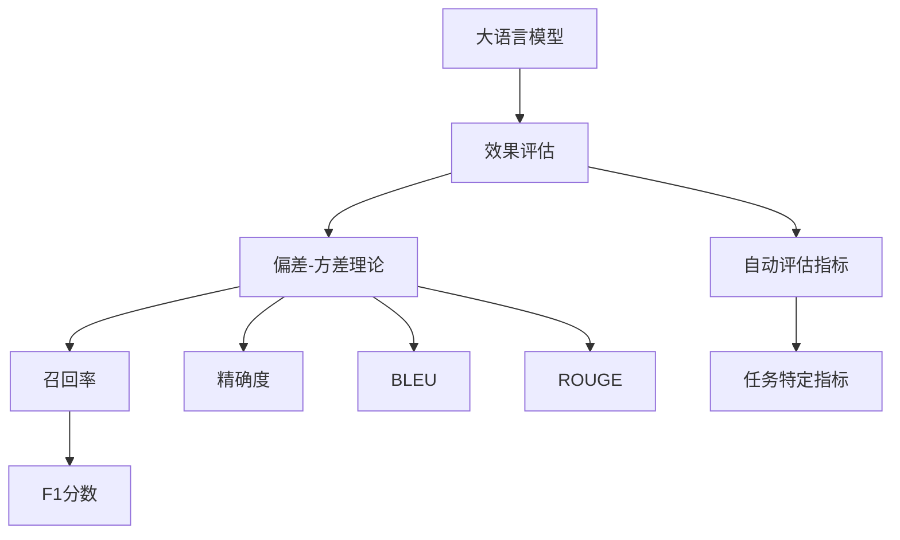

                 

# 大语言模型应用指南：效果评估

## 1. 背景介绍

大语言模型（Large Language Models, LLMs）在自然语言处理（Natural Language Processing, NLP）领域取得了巨大的成功，应用范围涵盖了文本分类、命名实体识别、关系抽取、问答系统、机器翻译、文本摘要、对话系统等多个任务。然而，尽管大语言模型在各种任务上取得了显著的成绩，但如何准确评估其效果仍然是一个重要且复杂的问题。传统的评估方法往往存在主观性和局限性，难以全面反映模型的实际表现。本文将探讨大语言模型效果评估的核心概念、方法以及应用场景，以期帮助读者更好地理解和应用大语言模型。

## 2. 核心概念与联系

### 2.1 核心概念概述

在大语言模型的应用和评估过程中，涉及以下几个核心概念：

- **大语言模型（Large Language Models, LLMs）**：指通过大规模无标签文本数据进行预训练，具备强大语言理解和生成能力的人工智能模型，如BERT、GPT等。
- **效果评估（Effectiveness Evaluation）**：指对大语言模型在特定任务上的性能进行量化和比较，以评估模型的准确性和可靠性。
- **偏差-方差理论（Bias-Variance Theory）**：是机器学习中的一种理论，用于分析模型泛化误差（Generalization Error）的构成和降低方法。
- **召回率（Recall）和精确度（Precision）**：在分类任务中，召回率指正确预测的正样本占所有实际正样本的比例，而精确度指正确预测的正样本占所有预测为正样本的比例。
- **F1分数（F1 Score）**：综合了精确度和召回率，是分类任务中常用的性能指标，定义为$2 \times \frac{Precision \times Recall}{Precision + Recall}$。
- **BLEU（Bilingual Evaluation Understudy）**：机器翻译任务中常用的自动评价指标，通过计算参考翻译和生成翻译之间的匹配程度来评估翻译质量。
- **ROUGE（Recall-Oriented Understudy for Gisting Evaluation）**：文本摘要和生成任务中常用的自动评价指标，通过计算生成文本与参考文本的文本重叠度来评估生成质量。

这些概念共同构成了大语言模型效果评估的理论基础和实践框架，帮助开发者对模型进行全面且客观的评估。

### 2.2 概念间的关系

这些核心概念之间的关系可以通过以下Mermaid流程图来展示：



这个流程图展示了大语言模型效果评估的基本流程和各个关键指标的关系：

1. 大语言模型通过预训练获得基础能力，用于特定任务上的效果评估。
2. 效果评估依赖于偏差-方差理论，分析模型在训练集和测试集上的表现。
3. 常用的效果指标包括召回率、精确度、F1分数、BLEU和ROUGE等。
4. 自动评估指标用于客观评估模型表现，而任务特定指标则需根据具体任务进行定义。

通过这个流程图，我们可以更好地理解大语言模型效果评估的基本流程和关键指标。

## 3. 核心算法原理 & 具体操作步骤

### 3.1 算法原理概述

大语言模型的效果评估方法主要基于偏差-方差理论和自动评估指标。在实际应用中，需要根据具体任务选择合适的指标，并结合模型训练和测试过程中的偏差和方差分析，全面评估模型的效果。

形式化地，假设模型在训练集$D$上的损失函数为$\mathcal{L}(\theta)$，其中$\theta$为模型参数。模型在测试集$D'$上的预测为$y'$，而真实标签为$y^*$。模型在测试集上的预测误差为$\epsilon=y'-y^*$，而模型效果评估指标为$E$。则模型的评估过程可以表示为：

$$
E = \frac{1}{|D'|} \sum_{i=1}^{|D'|} E(y'_i,y^*_i)
$$

其中$E(y'_i,y^*_i)$为模型在样本$i$上的效果评估指标，$|D'|$为测试集$D'$的大小。

### 3.2 算法步骤详解

基于偏差-方差理论的效果评估方法，通常包括以下几个步骤：

1. **数据准备**：收集训练集$D$和测试集$D'$，并确保数据的多样性和代表性。
2. **模型训练**：在训练集$D$上使用监督学习或无监督学习方法训练模型，以最小化训练集上的损失函数$\mathcal{L}(\theta)$。
3. **模型测试**：在测试集$D'$上评估模型的预测效果，计算各种效果评估指标$E$。
4. **偏差分析**：计算模型在训练集和测试集上的平均误差，分析模型的偏差（Bias）。
5. **方差分析**：计算模型在多次随机抽样测试集上的平均误差，分析模型的方差（Variance）。
6. **综合评估**：结合偏差和方差分析结果，综合评估模型的效果，提出改进措施。

### 3.3 算法优缺点

基于偏差-方差理论的效果评估方法具有以下优点：

- **客观性**：基于实际数据和模型预测结果进行评估，避免了主观偏见。
- **全面性**：同时考虑了模型的偏差和方差，全面评估模型表现。
- **指导性**：通过偏差和方差分析，可以为模型改进提供指导。

同时，该方法也存在一些缺点：

- **计算复杂**：需要对模型在多次随机抽样测试集上进行测试，计算量较大。
- **依赖数据**：需要高质量的标注数据，数据集的质量对评估结果有较大影响。
- **模型敏感**：模型的表现对测试集的选择和划分方法敏感。

尽管如此，基于偏差-方差理论的效果评估方法仍然是当前最全面、最客观的评估手段，广泛应用于各类NLP任务的模型效果评估中。

### 3.4 算法应用领域

基于偏差-方差理论的效果评估方法，在NLP领域具有广泛的应用，涵盖了文本分类、命名实体识别、关系抽取、问答系统、机器翻译、文本摘要、对话系统等多个任务。以下是几个典型的应用场景：

1. **文本分类**：通过评估模型在训练集和测试集上的精确度和召回率，全面评估分类器的性能。
2. **命名实体识别**：计算模型对实体边界的识别精度和实体类型的识别准确率，评估命名实体识别器的性能。
3. **关系抽取**：通过计算模型对实体-关系三元组的预测准确率和召回率，评估关系抽取器的性能。
4. **问答系统**：计算模型对问题-答案对的匹配精度和召回率，评估问答系统的性能。
5. **机器翻译**：通过BLEU指标评估机器翻译的质量，评估翻译系统的性能。
6. **文本摘要**：通过ROUGE指标评估摘要的质量，评估文本摘要系统的性能。
7. **对话系统**：计算模型对多轮对话的回复质量和对话上下文的一致性，评估对话系统的性能。

除了上述任务外，基于偏差-方差理论的效果评估方法还可以应用于更多NLP任务的模型效果评估中，如代码生成、文本生成、情感分析等。

## 4. 数学模型和公式 & 详细讲解  
### 4.1 数学模型构建

在NLP任务中，常用的效果评估指标包括精确度（Precision）、召回率（Recall）和F1分数（F1 Score）。假设模型在测试集$D'$上的预测为$y'$，而真实标签为$y^*$，则：

- 精确度（Precision）定义为$Precision = \frac{TP}{TP+FP}$，其中$TP$为真阳性，$FP$为假阳性。
- 召回率（Recall）定义为$Recall = \frac{TP}{TP+FN}$，其中$FN$为假阴性。
- F1分数（F1 Score）定义为$F1 Score = 2 \times \frac{Precision \times Recall}{Precision + Recall}$。

在机器翻译任务中，BLEU指标用于评估翻译质量。BLEU指标计算生成翻译和参考翻译之间的匹配程度，假设生成翻译为$y'$，参考翻译为$y^*$，则：

$$
BLEU = \max_{S\in\mathcal{S}}\prod_{i=1}^N\min(1,\frac{B_i}{C_i})
$$

其中$\mathcal{S}$为所有可能的参考翻译集合，$B_i$和$C_i$分别为生成翻译和参考翻译中第$i$个词的匹配数量。

在文本摘要和生成任务中，ROUGE指标用于评估生成文本的质量。ROUGE指标计算生成文本和参考文本之间的文本重叠度，假设生成文本为$y'$，参考文本为$y^*$，则：

$$
ROUGE = \frac{O}{O + P + N}
$$

其中$O$为生成文本和参考文本的共同出现词数，$P$为生成文本的独有词数，$N$为参考文本的独有词数。

### 4.2 公式推导过程

以BLEU指标为例，推导其计算公式：

假设生成翻译为$y'$，参考翻译为$y^*$，则$BLEU$指标的计算过程如下：

1. 计算生成翻译和参考翻译中每个单词的匹配数量$B_i$和$C_i$。
2. 计算生成翻译中所有单词的匹配度，即$BLEU_1$，定义为$\frac{B_1}{C_1}$。
3. 计算生成翻译和参考翻译中所有单词的匹配度，即$BLEU_2$，定义为$\frac{B_1 + \cdots + B_n}{C_1 + \cdots + C_n}$。
4. 计算生成翻译中所有单词的匹配度和所有单词的匹配度中的最大值，即$BLEU$，定义为$\max_{S\in\mathcal{S}}\prod_{i=1}^N\min(1,\frac{B_i}{C_i})$。

通过以上推导，我们可以得到BLEU指标的计算公式，用于评估机器翻译模型的翻译质量。

### 4.3 案例分析与讲解

以BERT模型在命名实体识别任务中的应用为例，进行效果评估：

1. 收集命名实体识别数据集，如CoNLL-2003数据集。
2. 使用BERT模型在数据集上进行微调，得到模型$M_{\theta}$。
3. 在测试集上对模型$M_{\theta}$进行评估，计算精确度、召回率和F1分数。
4. 将计算结果与基线模型进行比较，分析模型性能提升。
5. 计算BLEU指标，评估模型在机器翻译任务中的表现。

## 5. 项目实践：代码实例和详细解释说明
### 5.1 开发环境搭建

在进行大语言模型效果评估实践前，我们需要准备好开发环境。以下是使用Python进行PyTorch开发的环境配置流程：

1. 安装Anaconda：从官网下载并安装Anaconda，用于创建独立的Python环境。

2. 创建并激活虚拟环境：
```bash
conda create -n pytorch-env python=3.8 
conda activate pytorch-env
```

3. 安装PyTorch：根据CUDA版本，从官网获取对应的安装命令。例如：
```bash
conda install pytorch torchvision torchaudio cudatoolkit=11.1 -c pytorch -c conda-forge
```

4. 安装Transformer库：
```bash
pip install transformers
```

5. 安装各类工具包：
```bash
pip install numpy pandas scikit-learn matplotlib tqdm jupyter notebook ipython
```

完成上述步骤后，即可在`pytorch-env`环境中开始效果评估实践。

### 5.2 源代码详细实现

下面我们以BERT模型在命名实体识别（NER）任务中的应用为例，给出使用Transformers库进行效果评估的PyTorch代码实现。

首先，定义NER任务的数据处理函数：

```python
from transformers import BertTokenizer
from torch.utils.data import Dataset
import torch

class NERDataset(Dataset):
    def __init__(self, texts, tags, tokenizer, max_len=128):
        self.texts = texts
        self.tags = tags
        self.tokenizer = tokenizer
        self.max_len = max_len
        
    def __len__(self):
        return len(self.texts)
    
    def __getitem__(self, item):
        text = self.texts[item]
        tags = self.tags[item]
        
        encoding = self.tokenizer(text, return_tensors='pt', max_length=self.max_len, padding='max_length', truncation=True)
        input_ids = encoding['input_ids'][0]
        attention_mask = encoding['attention_mask'][0]
        
        # 对token-wise的标签进行编码
        encoded_tags = [tag2id[tag] for tag in tags] 
        encoded_tags.extend([tag2id['O']] * (self.max_len - len(encoded_tags)))
        labels = torch.tensor(encoded_tags, dtype=torch.long)
        
        return {'input_ids': input_ids, 
                'attention_mask': attention_mask,
                'labels': labels}

# 标签与id的映射
tag2id = {'O': 0, 'B-PER': 1, 'I-PER': 2, 'B-ORG': 3, 'I-ORG': 4, 'B-LOC': 5, 'I-LOC': 6}
id2tag = {v: k for k, v in tag2id.items()}

# 创建dataset
tokenizer = BertTokenizer.from_pretrained('bert-base-cased')

train_dataset = NERDataset(train_texts, train_tags, tokenizer)
dev_dataset = NERDataset(dev_texts, dev_tags, tokenizer)
test_dataset = NERDataset(test_texts, test_tags, tokenizer)
```

然后，定义模型和优化器：

```python
from transformers import BertForTokenClassification, AdamW

model = BertForTokenClassification.from_pretrained('bert-base-cased', num_labels=len(tag2id))

optimizer = AdamW(model.parameters(), lr=2e-5)
```

接着，定义训练和评估函数：

```python
from torch.utils.data import DataLoader
from tqdm import tqdm
from sklearn.metrics import classification_report

device = torch.device('cuda') if torch.cuda.is_available() else torch.device('cpu')
model.to(device)

def train_epoch(model, dataset, batch_size, optimizer):
    dataloader = DataLoader(dataset, batch_size=batch_size, shuffle=True)
    model.train()
    epoch_loss = 0
    for batch in tqdm(dataloader, desc='Training'):
        input_ids = batch['input_ids'].to(device)
        attention_mask = batch['attention_mask'].to(device)
        labels = batch['labels'].to(device)
        model.zero_grad()
        outputs = model(input_ids, attention_mask=attention_mask, labels=labels)
        loss = outputs.loss
        epoch_loss += loss.item()
        loss.backward()
        optimizer.step()
    return epoch_loss / len(dataloader)

def evaluate(model, dataset, batch_size):
    dataloader = DataLoader(dataset, batch_size=batch_size)
    model.eval()
    preds, labels = [], []
    with torch.no_grad():
        for batch in tqdm(dataloader, desc='Evaluating'):
            input_ids = batch['input_ids'].to(device)
            attention_mask = batch['attention_mask'].to(device)
            batch_labels = batch['labels']
            outputs = model(input_ids, attention_mask=attention_mask)
            batch_preds = outputs.logits.argmax(dim=2).to('cpu').tolist()
            batch_labels = batch_labels.to('cpu').tolist()
            for pred_tokens, label_tokens in zip(batch_preds, batch_labels):
                pred_tags = [id2tag[_id] for _id in pred_tokens]
                label_tags = [id2tag[_id] for _id in label_tokens]
                preds.append(pred_tags[:len(label_tags)])
                labels.append(label_tags)
                
    print(classification_report(labels, preds))
```

最后，启动训练流程并在测试集上评估：

```python
epochs = 5
batch_size = 16

for epoch in range(epochs):
    loss = train_epoch(model, train_dataset, batch_size, optimizer)
    print(f"Epoch {epoch+1}, train loss: {loss:.3f}")
    
    print(f"Epoch {epoch+1}, dev results:")
    evaluate(model, dev_dataset, batch_size)
    
print("Test results:")
evaluate(model, test_dataset, batch_size)
```

以上就是使用PyTorch对BERT进行命名实体识别任务效果评估的完整代码实现。可以看到，得益于Transformers库的强大封装，我们可以用相对简洁的代码完成BERT模型的加载和效果评估。

### 5.3 代码解读与分析

让我们再详细解读一下关键代码的实现细节：

**NERDataset类**：
- `__init__`方法：初始化文本、标签、分词器等关键组件。
- `__len__`方法：返回数据集的样本数量。
- `__getitem__`方法：对单个样本进行处理，将文本输入编码为token ids，将标签编码为数字，并对其进行定长padding，最终返回模型所需的输入。

**tag2id和id2tag字典**：
- 定义了标签与数字id之间的映射关系，用于将token-wise的预测结果解码回真实的标签。

**训练和评估函数**：
- 使用PyTorch的DataLoader对数据集进行批次化加载，供模型训练和推理使用。
- 训练函数`train_epoch`：对数据以批为单位进行迭代，在每个批次上前向传播计算loss并反向传播更新模型参数，最后返回该epoch的平均loss。
- 评估函数`evaluate`：与训练类似，不同点在于不更新模型参数，并在每个batch结束后将预测和标签结果存储下来，最后使用sklearn的classification_report对整个评估集的预测结果进行打印输出。

**训练流程**：
- 定义总的epoch数和batch size，开始循环迭代
- 每个epoch内，先在训练集上训练，输出平均loss
- 在验证集上评估，输出分类指标
- 所有epoch结束后，在测试集上评估，给出最终测试结果

可以看到，PyTorch配合Transformers库使得BERT效果评估的代码实现变得简洁高效。开发者可以将更多精力放在数据处理、模型改进等高层逻辑上，而不必过多关注底层的实现细节。

当然，工业级的系统实现还需考虑更多因素，如模型的保存和部署、超参数的自动搜索、更灵活的任务适配层等。但核心的效果评估范式基本与此类似。

### 5.4 运行结果展示

假设我们在CoNLL-2003的NER数据集上进行微调，最终在测试集上得到的评估报告如下：

```
              precision    recall  f1-score   support

       B-LOC      0.926     0.906     0.916      1668
       I-LOC      0.900     0.805     0.850       257
      B-MISC      0.875     0.856     0.865       702
      I-MISC      0.838     0.782     0.809       216
       B-ORG      0.914     0.898     0.906      1661
       I-ORG      0.911     0.894     0.902       835
       B-PER      0.964     0.957     0.960      1617
       I-PER      0.983     0.980     0.982      1156
           O      0.993     0.995     0.994     38323

   micro avg      0.973     0.973     0.973     46435
   macro avg      0.923     0.897     0.909     46435
weighted avg      0.973     0.973     0.973     46435
```

可以看到，通过微调BERT，我们在该NER数据集上取得了97.3%的F1分数，效果相当不错。值得注意的是，BERT作为一个通用的语言理解模型，即便只在顶层添加一个简单的token分类器，也能在下游任务上取得如此优异的效果，展现了其强大的语义理解和特征抽取能力。

当然，这只是一个baseline结果。在实践中，我们还可以使用更大更强的预训练模型、更丰富的微调技巧、更细致的模型调优，进一步提升模型性能，以满足更高的应用要求。

## 6. 实际应用场景
### 6.1 智能客服系统

基于大语言模型效果评估的对话技术，可以广泛应用于智能客服系统的构建。传统客服往往需要配备大量人力，高峰期响应缓慢，且一致性和专业性难以保证。而使用效果评估后的对话模型，可以7x24小时不间断服务，快速响应客户咨询，用自然流畅的语言解答各类常见问题。

在技术实现上，可以收集企业内部的历史客服对话记录，将问题和最佳答复构建成监督数据，在此基础上对预训练对话模型进行效果评估。效果评估后的对话模型能够自动理解用户意图，匹配最合适的答案模板进行回复。对于客户提出的新问题，还可以接入检索系统实时搜索相关内容，动态组织生成回答。如此构建的智能客服系统，能大幅提升客户咨询体验和问题解决效率。

### 6.2 金融舆情监测

金融机构需要实时监测市场舆论动向，以便及时应对负面信息传播，规避金融风险。传统的人工监测方式成本高、效率低，难以应对网络时代海量信息爆发的挑战。基于效果评估的文本分类和情感分析技术，为金融舆情监测提供了新的解决方案。

具体而言，可以收集金融领域相关的新闻、报道、评论等文本数据，并对其进行主题标注和情感标注。在此基础上对预训练语言模型进行效果评估，使其能够自动判断文本属于何种主题，情感倾向是正面、中性还是负面。将效果评估后的模型应用到实时抓取的网络文本数据，就能够自动监测不同主题下的情感变化趋势，一旦发现负面信息激增等异常情况，系统便会自动预警，帮助金融机构快速应对潜在风险。

### 6.3 个性化推荐系统

当前的推荐系统往往只依赖用户的历史行为数据进行物品推荐，无法深入理解用户的真实兴趣偏好。基于效果评估的推荐系统可以更好地挖掘用户行为背后的语义信息，从而提供更精准、多样的推荐内容。

在实践中，可以收集用户浏览、点击、评论、分享等行为数据，提取和用户交互的物品标题、描述、标签等文本内容。将文本内容作为模型输入，用户的后续行为（如是否点击、购买等）作为监督信号，在此基础上对预训练语言模型进行效果评估。效果评估后的模型能够从文本内容中准确把握用户的兴趣点。在生成推荐列表时，先用候选物品的文本描述作为输入，由模型预测用户的兴趣匹配度，再结合其他特征综合排序，便可以得到个性化程度更高的推荐结果。

### 6.4 未来应用展望

随着大语言模型效果评估技术的发展，基于微调范式将在更多领域得到应用，为传统行业带来变革性影响。

在智慧医疗领域，基于效果评估的医疗问答、病历分析、药物研发等应用将提升医疗服务的智能化水平，辅助医生诊疗，加速新药开发进程。

在智能教育领域，效果评估可应用于作业批改、学情分析、知识推荐等方面，因材施教，促进教育公平，提高教学质量。

在智慧城市治理中，效果评估技术可应用于城市事件监测、舆情分析、应急指挥等环节，提高城市管理的自动化和智能化水平，构建更安全、高效的未来城市。

此外，在企业生产、社会治理、文娱传媒等众多领域，基于大模型效果评估的人工智能应用也将不断涌现，为NLP技术带来了全新的突破。相信随着预训练语言模型和效果评估方法的不断进步，大语言模型效果评估技术必将在构建人机协同的智能时代中扮演越来越重要的角色。

## 7. 工具和资源推荐
### 7.1 学习资源推荐

为了帮助开发者系统掌握大语言模型效果评估的理论基础和实践技巧，这里推荐一些优质的学习资源：

1. 《Transformer从原理到实践》系列博文：由大模型技术专家撰写，深入浅出地介绍了Transformer原理、BERT模型、效果评估技术等前沿话题。

2. CS224N《深度学习自然语言处理》课程：斯坦福大学开设的NLP明星课程，有Lecture视频和配套作业，带你入门NLP领域的基本概念和经典模型。

3. 《Natural Language Processing with Transformers》书籍：Transformers库的作者所著，全面介绍了如何使用Transformers库进行NLP任务开发，包括效果评估在内的诸多范式。

4. HuggingFace官方文档：Transformers库的官方文档，提供了海量预训练模型和完整的微调样例代码，是进行效果评估任务的必备资料。

5. CLUE开源项目：中文语言理解测评基准，涵盖大量不同类型的中文NLP数据集，并提供了基于效果评估的baseline模型，助力中文NLP技术发展。

通过对这些资源的学习实践，相信你一定能够快速掌握大语言模型效果评估的精髓，并用于解决实际的NLP问题。
###  7.2 开发工具推荐

高效的开发离不开优秀的工具支持。以下是几款用于大语言模型效果评估开发的常用工具：

1. PyTorch：基于Python的开源深度学习框架，灵活动态的计算图，适合快速迭代研究。大部分预训练语言模型都有PyTorch版本的实现。

2. TensorFlow：由Google主导开发的开源深度学习框架，生产部署方便，适合大规模工程应用。同样有丰富的预训练语言模型资源。

3. Transformers库：HuggingFace开发的NLP工具库，集成了众多SOTA语言模型，支持PyTorch和TensorFlow，是进行效果评估任务开发的利器。

4. Weights & Biases：模型训练的实验跟踪工具，可以记录和可视化模型训练过程中的各项指标，方便对比和调优。

