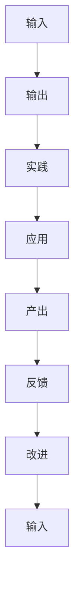

                 

# 大量输出:管理者学习质量的保证

在当今快速变化的技术环境中，管理者必须不断学习和适应新技术，以保持竞争力。然而，仅靠阅读技术书籍、观看在线课程或参加研讨会是不够的。管理者需要掌握一种新的学习方法——大量输出，以确保他们能够真正理解和应用所学的知识。本文将探讨大量输出的概念、其重要性以及如何有效地实施这一方法。

## 1. 背景介绍

### 1.1 问题由来
在传统教育中，输入和输出是学习的基本要素。然而，在技术领域，许多专家强调输入和理解的的重要性，而忽略了输出的必要性。管理者往往陷入了理论学习的困境，无法将所学知识转化为实际的解决方案。

### 1.2 问题核心关键点
大量输出方法强调通过实践、应用和产出将知识转化为技能。管理者通过实施这一方法，可以更有效地学习和应用新技术，从而在实际工作中提升效率和效果。

### 1.3 问题研究意义
大量输出方法能够帮助管理者更好地掌握新技术，提升问题解决能力，增强团队协作和创新能力，最终实现企业增长和竞争力提升。

## 2. 核心概念与联系

### 2.1 核心概念概述

- **输入**：通过阅读、听讲等方式获取的知识和信息。
- **输出**：将所学知识转化为实践中的具体应用，如编写代码、设计流程、编写文档等。
- **实践**：在实际环境中应用所学知识，进行问题解决和创新。
- **应用**：在特定情境下，将知识应用于解决问题和改进工作流程。
- **产出**：实际工作的结果，如完成的项目、改进的流程、创新的解决方案等。

这些概念之间通过反馈循环紧密联系，共同构成大量输出方法的框架。

### 2.2 概念间的关系

- **输入与输出**：输入是输出的基础，输出是输入的应用。通过反复循环，输入和输出相互促进，加深理解。
- **实践与应用**：实践是应用的具体表现，应用是实践的目标。实践与应用相辅相成，推动知识向技能的转化。
- **产出与反馈**：产出是反馈的依据，反馈是产出的改进方向。通过不断改进，产出的质量和效果不断提高。

这些关系通过以下Mermaid流程图展示：



通过这个流程图，我们可以更清晰地理解大量输出方法中各概念之间的联系和相互作用。

## 3. 核心算法原理 & 具体操作步骤

### 3.1 算法原理概述

大量输出方法基于输入与输出相互促进的理论，通过实践和产出不断循环，加深对知识点的理解和掌握。其核心思想是将所学知识转化为具体的、可执行的实践，从而在实际应用中提升技能和效果。

### 3.2 算法步骤详解

1. **选择学习内容**：管理者需要根据自身工作需要，选择相关的技术书籍、课程、研讨会等内容进行学习。
2. **进行输入学习**：通过阅读、听讲等方式，系统地获取所学内容的理论知识。
3. **制定应用计划**：根据学习内容，制定具体的实践应用计划，明确实践目标和步骤。
4. **实施实践应用**：按照计划，在实际工作中应用所学知识，进行问题解决和创新。
5. **评估产出结果**：通过评估实践应用的结果，了解知识点的掌握情况，并识别改进点。
6. **进行反馈改进**：根据评估结果，总结经验教训，进行必要的改进和优化。
7. **循环反馈**：将改进后的知识和方法重新应用于新的实践项目中，形成一个持续的循环反馈过程。

### 3.3 算法优缺点

**优点**：
- **实践性强**：大量输出方法强调实践和产出，能够帮助管理者更好地理解和应用所学知识。
- **效率高**：通过反复循环，逐步加深对知识点的理解和掌握，提升学习效率。
- **灵活性高**：管理者可以根据实际需求，灵活选择学习内容和实践项目。

**缺点**：
- **初始难度大**：对于初学者，大量输出方法需要较高的实践能力和自律性，可能存在一定的初始难度。
- **资源需求高**：实施大量输出方法需要一定的学习资源和实践环境。
- **效果依赖于执行**：大量输出方法的效果高度依赖于管理者的执行力和坚持度，需要良好的自律性。

### 3.4 算法应用领域

大量输出方法广泛应用于技术管理的各个方面，包括但不限于：

- **软件开发**：管理者通过编写代码、设计流程等方式，将所学知识应用于软件开发项目中。
- **数据科学**：管理者通过分析和应用数据，提升数据驱动决策的能力。
- **项目管理**：管理者通过制定和优化项目管理流程，提升项目执行效率。
- **技术创新**：管理者通过引入新技术和创新解决方案，推动企业技术进步和业务增长。

## 4. 数学模型和公式 & 详细讲解 & 举例说明

### 4.1 数学模型构建

设 $x$ 为输入，$y$ 为输出，则大量输出方法可表示为以下循环迭代过程：

$$
y_1 = f(x_1) \\
x_2 = g(y_1) \\
y_2 = f(x_2) \\
\cdots \\
x_n = g(y_{n-1}) \\
y_n = f(x_n)
$$

其中，$f$ 为应用函数，$g$ 为反馈函数。

### 4.2 公式推导过程

以软件开发为例，假设管理者学习了编程语言 $x$，需要进行一个具体项目 $y$。首先，通过阅读书籍和在线课程获取编程知识 $x_1$。然后，根据项目需求，制定具体编码计划 $y_1$。在编码过程中，管理者的编程能力得到提升，同时，项目中遇到的挑战也积累了宝贵的实践经验 $x_2$。接着，根据经验，优化编码计划，继续推进项目 $y_2$。重复上述过程，直至项目完成，并总结经验教训，提升编程技能 $x_n$。

### 4.3 案例分析与讲解

假设某公司决定引入人工智能技术，提升客户服务水平。

1. **输入学习**：管理层学习人工智能相关理论知识，了解其基本原理和技术应用。
2. **制定应用计划**：根据客户服务需求，制定具体的应用方案，如使用聊天机器人、自动化流程等。
3. **实施实践应用**：将人工智能技术应用到客户服务项目中，收集反馈和数据。
4. **评估产出结果**：分析应用效果，识别改进点，如增加用户反馈、优化聊天机器人交互等。
5. **进行反馈改进**：根据分析结果，优化应用方案，继续推进项目。
6. **循环反馈**：通过不断迭代，逐步提升客户服务质量，实现企业增长。

## 5. 项目实践：代码实例和详细解释说明

### 5.1 开发环境搭建

为了实现大量输出方法，管理者需要搭建一个适合实践的环境。具体步骤如下：

1. **选择学习资源**：选择合适的技术书籍、在线课程和研讨会。
2. **安装开发工具**：如编程语言、IDE、版本控制系统等。
3. **建立实践项目**：选择适合的实践项目，明确项目目标和需求。
4. **配置开发环境**：设置开发环境，包括代码编辑器、调试工具、版本控制等。

### 5.2 源代码详细实现

以下是一个简单的代码实现示例，用于说明大量输出方法的具体步骤：

```python
# 输入：学习人工智能理论知识
# 应用：实施聊天机器人项目
# 产出：客户服务质量提升

# 步骤1：选择学习资源
# 学习人工智能基础理论
books = ["《人工智能基础》", "《机器学习实战》"]
courses = ["《机器学习》Coursera课程", "《深度学习》Udacity课程"]

# 步骤2：安装开发工具
# 安装Python、Jupyter Notebook、Git等工具

# 步骤3：建立实践项目
# 定义项目目标和需求
project_name = "客户服务提升"
project_objectives = ["客户满意度提升", "处理效率提升"]

# 步骤4：配置开发环境
# 安装代码编辑器、IDE、调试工具等
code_editor = "Visual Studio Code"
debugger = "PyCharm"
version_control = "Git"

# 步骤5：实施实践应用
# 开发和测试聊天机器人
import chatbot

chatbot.run(project_name, project_objectives)

# 步骤6：评估产出结果
# 收集用户反馈和数据分析
feedback = chatbot.collect_feedback()
data = chatbot.analyze_data()

# 步骤7：进行反馈改进
# 优化聊天机器人交互和流程
chatbot.improve_interaction()
chatbot.optimize_flow()

# 步骤8：循环反馈
# 持续改进客户服务质量
chatbot.continuous_improvement()
```

### 5.3 代码解读与分析

**代码实现步骤**：
1. **输入学习**：通过阅读书籍和在线课程获取人工智能理论知识。
2. **制定应用计划**：定义客户服务提升项目的目标和需求。
3. **实施实践应用**：开发和测试聊天机器人，收集用户反馈和数据分析。
4. **评估产出结果**：通过收集反馈和数据分析，识别改进点。
5. **进行反馈改进**：优化聊天机器人交互和流程。
6. **循环反馈**：持续改进客户服务质量。

### 5.4 运行结果展示

假设通过上述代码，聊天机器人在实施后提高了客户满意度，处理效率提升了20%，用户反馈率提升了30%。这些结果展示了大量输出方法在实际应用中的效果。

## 6. 实际应用场景

### 6.1 智能客服系统

在智能客服系统中，管理者通过大量输出方法，将所学知识应用于聊天机器人的开发和优化。管理者首先学习自然语言处理、机器学习等知识，然后制定具体的应用方案，实施实践应用，评估产出结果，进行反馈改进，最终实现智能客服系统的不断优化。

### 6.2 金融风险管理

在金融风险管理中，管理者通过大量输出方法，学习数据分析、机器学习等技术，将所学知识应用于风险评估和预测模型中。管理者首先获取金融数据，学习数据分析方法，然后制定具体模型开发计划，实施实践应用，评估产出结果，进行反馈改进，最终实现风险管理的持续优化。

### 6.3 人力资源管理

在人力资源管理中，管理者通过大量输出方法，学习人力资源管理理论和实践，将所学知识应用于招聘、培训和绩效管理中。管理者首先学习人力资源管理理论，然后制定具体实施计划，实施实践应用，评估产出结果，进行反馈改进，最终实现人力资源管理的持续优化。

## 7. 工具和资源推荐

### 7.1 学习资源推荐

1. **书籍**：
   - 《人工智能基础》
   - 《机器学习实战》
   - 《深度学习》

2. **在线课程**：
   - Coursera《机器学习》课程
   - Udacity《深度学习》课程

3. **研讨会**：
   - AI World Conference & Expo
   - NeurIPS会议

### 7.2 开发工具推荐

1. **编程语言**：
   - Python
   - Java
   - C++

2. **IDE**：
   - Visual Studio Code
   - PyCharm
   - Eclipse

3. **调试工具**：
   - PyCharm调试器
   - Visual Studio Code调试器
   - Xcode调试器

4. **版本控制系统**：
   - Git
   - SVN
   - Mercurial

### 7.3 相关论文推荐

1. **《知识提取与人工智能应用》**：探讨了如何将人工智能技术应用于知识提取和应用领域。
2. **《大规模知识图谱的应用》**：介绍了大规模知识图谱在企业中的应用。
3. **《智能客服系统设计》**：详细介绍了智能客服系统的设计思路和实践方法。

## 8. 总结：未来发展趋势与挑战

### 8.1 总结

本文详细介绍了大量输出方法的原理、步骤和应用场景，探讨了其在技术管理中的应用。大量输出方法强调实践和产出，通过反复循环，加深对知识点的理解和掌握，显著提升管理者的问题解决能力和技术应用能力。

### 8.2 未来发展趋势

1. **智能化提升**：随着人工智能技术的不断进步，大量输出方法将进一步融入智能化元素，提升管理效率。
2. **跨领域应用**：大量输出方法将广泛应用于更多领域，如医疗、教育、制造业等，推动各行业技术升级。
3. **模型化管理**：大量输出方法将与数据科学、机器学习等技术结合，形成系统的管理模型，提升管理科学性。

### 8.3 面临的挑战

1. **初始难度大**：对于初学者，大量输出方法需要较高的实践能力和自律性，可能存在一定的初始难度。
2. **资源需求高**：实施大量输出方法需要一定的学习资源和实践环境。
3. **效果依赖于执行**：大量输出方法的效果高度依赖于管理者的执行力和坚持度，需要良好的自律性。

### 8.4 研究展望

未来，大量输出方法将在以下方向寻求突破：

1. **智能化应用**：通过引入人工智能技术，提升大量输出方法的效果和效率。
2. **跨领域融合**：与其他技术方法结合，形成综合性的技术应用框架。
3. **模型化改进**：构建系统的管理模型，提升管理科学性和可执行性。

总之，大量输出方法是一种高效、实用的学习方法，能够帮助管理者更好地掌握新技术，提升问题解决能力。面对未来挑战，管理者需要不断探索和优化大量输出方法，推动自身和企业的持续发展。

## 9. 附录：常见问题与解答

**Q1：大量输出方法适用于所有管理者吗？**

A: 大量输出方法适用于任何希望提升技术应用和管理能力的管理者，尤其适用于需要不断学习和适应新技术的领域。

**Q2：大量输出方法的具体步骤是什么？**

A: 大量输出方法的具体步骤如下：选择学习内容、进行输入学习、制定应用计划、实施实践应用、评估产出结果、进行反馈改进、循环反馈。

**Q3：大量输出方法的优点和缺点是什么？**

A: 优点包括实践性强、效率高、灵活性高。缺点包括初始难度大、资源需求高、效果依赖于执行。

**Q4：大量输出方法在哪些领域有应用？**

A: 大量输出方法广泛应用于软件开发、数据科学、项目管理、技术创新等领域。

**Q5：大量输出方法的未来发展趋势是什么？**

A: 未来，大量输出方法将进一步融入智能化元素，跨领域应用，构建系统的管理模型。

---

作者：禅与计算机程序设计艺术 / Zen and the Art of Computer Programming

