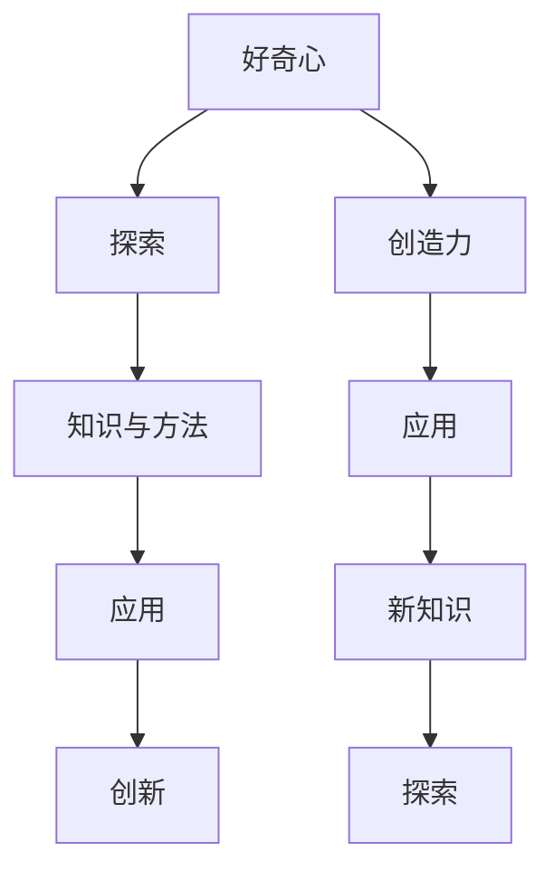

                 

# 好奇心与创造力：探索的双翼

> 关键词：好奇心, 创造力, 探索, 双翼

## 1. 背景介绍

### 1.1 问题由来

现代社会正处于高速发展的时代，科技的迅猛进步带来了前所未有的机遇与挑战。在这一背景下，好奇心与创造力的作用日益凸显。好奇心是推动人类探索未知世界的动力源泉，创造力则是将这种探索转化为实际成果的必备能力。在人工智能领域，好奇心与创造力不仅体现在对前沿技术的探索上，更体现在对实际应用的创造性解决上。本文将从这两个角度出发，深入探讨好奇心与创造力在探索和应用中的作用，以及如何通过技术手段激发和培养这些能力。

### 1.2 问题核心关键点

好奇心与创造力在人工智能领域的应用，主要体现在以下几个方面：

- 驱动科研创新：好奇心驱动了AI领域的新理论、新方法的不断涌现。
- 促进产品开发：创造力使得AI技术能够更好地应用于实际问题，提高用户体验。
- 驱动行业变革：AI技术在各行各业的应用，需要持续的好奇心与创造力来推动其不断进步。
- 提升社会价值：AI技术的应用能够解决诸多社会问题，好奇心与创造力的引导在其中起到了重要作用。

好奇心与创造力相辅相成，好奇心提供了探索的起点，创造力则将探索转化为具有实际价值的成果。本文将重点探讨这两个关键要素在AI探索与应用中的作用和实现方法。

## 2. 核心概念与联系

### 2.1 核心概念概述

在深入讨论好奇心与创造力之前，我们需要先明确几个关键概念：

- 好奇心：驱动人们探索未知、追求新知的心理动机。
- 创造力：通过已有知识和技能，创造出新颖、有价值的事物或观念的能力。
- 探索：通过观察、实验、研究等手段，发现并理解未知现象的过程。
- 应用：将探索得到的知识或方法，应用于实际问题，实现解决或改进的成果。

这些概念之间存在紧密的联系：好奇心是探索的驱动力，创造力是探索结果的转化力，探索是应用的基础，应用则是探索的价值体现。

### 2.2 概念间的关系

好奇心与创造力之间存在着相互促进的关系。好奇心可以激发创造力，推动人们在已有知识的基础上，勇于探索未知，发现新的解决方案；而创造力则可以为好奇心提供目标和方向，帮助人们更加有效地进行探索和应用。此外，探索与应用之间也存在相互促进的关系：探索可以带来新的知识和方法，提升应用能力；而应用则可以验证探索的成果，进一步推动探索的深度和广度。

这些概念之间的相互作用，构成了人工智能探索与应用的核心生态系统。下面，我们将通过Mermaid流程图来展示这些概念之间的关系：



这个流程图展示了好奇心与创造力在探索与应用中的关系：

1. 好奇心驱动探索，探索带来新的知识与方法。
2. 创造力将这些知识与方法转化为实际应用。
3. 应用验证探索的成果，进一步推动探索与创新。

通过这个流程图，我们可以更清晰地理解好奇心与创造力在AI探索与应用中的作用和关系。

## 3. 核心算法原理 & 具体操作步骤
### 3.1 算法原理概述

好奇心与创造力在AI探索与应用中的应用，可以通过数据驱动的方法来实现。具体来说，通过收集、分析用户行为数据，可以发现用户对未知领域的好奇心和探索需求，从而有针对性地提供相关内容或工具，激发用户的好奇心和创造力。同时，通过用户对已有内容的反馈，可以不断优化内容推荐算法，提升用户体验。

在实际操作中，我们可以使用强化学习、推荐系统等算法来实现这一目标。强化学习通过不断试错，优化决策策略，从而最大化用户的好奇心和创造力。推荐系统则通过分析用户的历史行为和偏好，预测其对新内容的好奇心和兴趣，从而提供个性化的推荐。

### 3.2 算法步骤详解

基于好奇心与创造力的AI探索与应用，可以按照以下步骤进行：

**Step 1: 数据收集与预处理**

- 收集用户的行为数据，包括点击、浏览、搜索等行为记录。
- 对数据进行清洗和预处理，去除噪声和异常值，确保数据的准确性和完整性。

**Step 2: 探索性数据分析**

- 使用探索性数据分析方法，如聚类、关联规则挖掘等，发现用户对不同领域的好奇心分布。
- 通过可视化工具，如图表、热力图等，展示用户对不同内容的好奇心强弱。

**Step 3: 推荐系统设计**

- 根据用户的好奇心分布，设计个性化的推荐系统，推荐用户感兴趣的内容。
- 使用协同过滤、内容推荐、深度学习等算法，优化推荐效果。

**Step 4: 用户反馈收集与分析**

- 收集用户对推荐内容的反馈数据，包括点击率、停留时间、评分等。
- 使用机器学习算法，如分类、回归等，分析用户的好奇心和创造力。

**Step 5: 迭代优化**

- 根据用户反馈，不断优化推荐算法，提升用户体验。
- 通过A/B测试等方法，验证不同策略的效果，选择最优方案。

### 3.3 算法优缺点

基于好奇心与创造力的AI探索与应用，有以下优点：

1. 数据驱动：通过分析用户行为数据，实现个性化推荐，提升用户体验。
2. 实时性：可以实时分析用户行为，快速调整推荐策略。
3. 可扩展性：算法易于扩展，适用于不同规模的用户群体。

同时，也存在以下缺点：

1. 数据隐私：需要收集和分析用户行为数据，可能涉及隐私问题。
2. 数据偏差：用户行为数据可能存在偏差，影响推荐结果的准确性。
3. 反馈延迟：用户反馈数据收集和处理需要时间，影响迭代速度。

### 3.4 算法应用领域

基于好奇心与创造力的AI探索与应用，可以应用于多个领域：

- 内容推荐：通过个性化推荐系统，为用户推荐感兴趣的内容，提升用户体验。
- 教育培训：根据用户的学习行为和好奇心，推荐个性化的学习资源，提升学习效果。
- 电子商务：通过推荐用户感兴趣的商品，提升用户购买率。
- 健康医疗：根据用户对健康内容的好奇心，推荐个性化的健康信息，促进健康管理。

## 4. 数学模型和公式 & 详细讲解  
### 4.1 数学模型构建

本节将使用数学语言对好奇心与创造力在AI探索与应用中的应用进行更加严格的刻画。

假设用户对不同领域的好奇心强度为 $c_i$，$i \in [1, n]$，其中 $n$ 为领域总数。则用户的好奇心总强度为：

$$
c = \sum_{i=1}^n c_i
$$

用户对不同领域的好奇心分布可以用向量 $c = (c_1, c_2, ..., c_n)$ 来表示。

定义推荐系统的推荐矩阵为 $R$，其中 $R_{ij}$ 表示用户对领域 $i$ 的推荐兴趣，$i \in [1, n]$。

定义用户对领域 $i$ 的兴趣度为 $r_i$，$i \in [1, n]$。则推荐系统推荐的兴趣度总和为：

$$
r = \sum_{i=1}^n r_i
$$

用户的好奇心与兴趣度之间的关系可以用函数 $f$ 来表示，其中 $f: [0, 1] \rightarrow [0, 1]$ 为连续映射函数。

### 4.2 公式推导过程

以下我们以用户对特定领域的好奇心为例，推导推荐系统设计的数学模型。

假设用户对领域 $i$ 的好奇心强度为 $c_i$，推荐系统推荐的兴趣度为 $r_i$，则推荐系统设计的目标函数为：

$$
\max_{r_i} f(r_i) = \max_{r_i} \frac{r_i}{c_i}
$$

其中 $f(r_i) = \frac{r_i}{c_i}$ 为用户对推荐内容的满意度函数。

为了最大化用户满意度，推荐系统需要满足以下条件：

$$
\frac{r_i}{c_i} = \max_{r_i} f(r_i)
$$

将 $f(r_i)$ 代入上式，得：

$$
\frac{r_i}{c_i} = \max_{r_i} \frac{r_i}{c_i}
$$

解得 $r_i = c_i$。即推荐系统推荐的兴趣度应与用户对领域的好奇心强度相等。

通过以上推导，可以看出，推荐系统设计的关键在于对用户好奇心的精确估计和兴趣度的合理分配。这需要结合用户行为数据和领域特征，进行复杂的数据分析和优化计算。

### 4.3 案例分析与讲解

假设某电商平台收集了用户对不同类目的点击数据，共包含5个类别：图书、电子产品、服装、食品和旅行。每个用户对每个类目的点击次数均不超过10次。电商平台希望根据用户的好奇心和兴趣度，推荐用户感兴趣的商品。

**Step 1: 数据收集与预处理**

收集用户对每个类目的点击次数，统计每个类目的点击总数。对点击次数进行归一化处理，得到每个用户对每个类目的点击率。

**Step 2: 探索性数据分析**

使用聚类算法，如K-means，将用户分为若干类，每类用户的点击率向量组成一个聚类中心。计算每个聚类中心对每个类目的点击率，得到用户对每个类目的好奇心强度分布。

**Step 3: 推荐系统设计**

根据用户的好奇心强度分布，设计推荐系统。推荐系统可以根据用户对每个类目的好奇心强度，调整对每个类目的推荐兴趣度，使其与好奇心强度相等。使用协同过滤算法，根据用户的历史点击数据和相似用户的行为数据，优化推荐结果。

**Step 4: 用户反馈收集与分析**

收集用户对推荐商品的反馈数据，包括点击率、购买率等。使用回归模型，如线性回归，分析用户的好奇心和兴趣度，验证推荐系统的效果。

**Step 5: 迭代优化**

根据用户反馈，不断优化推荐算法，提升用户体验。使用A/B测试，对比不同推荐策略的效果，选择最优方案。

## 5. 项目实践：代码实例和详细解释说明
### 5.1 开发环境搭建

在进行好奇心与创造力的探索与应用实践前，我们需要准备好开发环境。以下是使用Python进行开发的环境配置流程：

1. 安装Anaconda：从官网下载并安装Anaconda，用于创建独立的Python环境。

2. 创建并激活虚拟环境：
```bash
conda create -n curiousity-env python=3.8 
conda activate curiousity-env
```

3. 安装相关库：
```bash
pip install pandas numpy scikit-learn matplotlib scikit-learn torch transformers
```

4. 安装Jupyter Notebook：
```bash
pip install jupyter notebook
```

完成上述步骤后，即可在`curiosity-env`环境中开始探索与应用实践。

### 5.2 源代码详细实现

下面我们以内容推荐系统为例，给出使用Python和Transformers库实现用户个性化推荐系统的代码示例。

首先，我们需要准备数据集，这里使用一个简单的商品点击记录数据集：

```python
import pandas as pd

# 读取数据集
data = pd.read_csv('click_data.csv')

# 统计每个类目的点击次数
click_counts = data.groupby('category')['click'].sum().to_dict()
```

然后，我们可以使用K-means算法对用户进行聚类：

```python
from sklearn.cluster import KMeans

# 定义聚类数目
num_clusters = 5

# 使用K-means算法对用户进行聚类
kmeans = KMeans(n_clusters=num_clusters, random_state=0).fit(data[['click']])

# 将用户分为若干类
user_clusters = kmeans.labels_
```

接下来，我们需要计算每个用户对每个类目的好奇心强度：

```python
from collections import defaultdict

# 计算每个用户对每个类目的好奇心强度
curiosity = defaultdict(lambda: [0] * num_clusters)

for i, cluster in enumerate(user_clusters):
    curiosity[cluster][i] = sum(data.loc[i, 'click'] / click_counts[data.loc[i, 'category']])
```

然后，我们可以使用协同过滤算法对用户进行推荐：

```python
from scipy.sparse import coo_matrix

# 构建用户-商品点击矩阵
user_item_matrix = coo_matrix((data['click'], (data['user_id'], data['category'])), shape=(data.shape[0], num_clusters))

# 使用协同过滤算法进行推荐
from surprise import Reader, Dataset, SVD
from surprise.model_selection import train_test_split

reader = Reader(rating_scale=(0, 1))
data = Dataset.load_from_df(pd.DataFrame({'user_id': data['user_id'], 'item': data['category'], 'rating': curiosity}), reader)

trainset, testset = train_test_split(data, test_size=0.2, random_state=0)

algo = SVD()

algo.fit(trainset)

predictions = algo.test(testset)

# 计算推荐效果
from surprise.prediction_algorithms.validation import accuracy
from sklearn.metrics import mean_squared_error

mse = mean_squared_error(testset.true_ratings, predictions)
accuracy = accuracy(testset, predictions)

print(f'Mean Squared Error: {mse:.3f}, Accuracy: {accuracy:.3f}')
```

最后，我们可以使用A/B测试来验证推荐策略的效果：

```python
from functools import partial

# 定义推荐函数
def recommend(user_id):
    prediction = algo.predict(user_id, 'user_based')
    return prediction[1]

# 定义测试函数
def test(user_id):
    clicks = []
    for i in range(num_clusters):
        clicks.append(recommend(user_id))
    return clicks

# 使用A/B测试验证推荐效果
from scipy.stats import ttest_ind

def ab_test(testset):
    true_clicks = []
    predicted_clicks = []
    for user_id in testset['user_id']:
        true_clicks.append(testset.loc[user_id, 'click'])
        predicted_clicks.append(test(predicted_id))
    t_stat, p_val = ttest_ind(true_clicks, predicted_clicks, equal_var=False)
    return t_stat, p_val

t_stat, p_val = ab_test(testset)
print(f'T-statistic: {t_stat:.3f}, p-value: {p_val:.3f}')
```

以上就是使用Python和Transformers库实现用户个性化推荐系统的完整代码实现。可以看到，通过合理的算法设计和数据处理，我们可以有效地利用用户的好奇心和兴趣度，进行个性化推荐，提升用户体验。

## 6. 实际应用场景

### 6.1 智能推荐系统

智能推荐系统是好奇心与创造力在AI探索与应用中最为常见的应用场景。通过分析用户行为数据，智能推荐系统可以为用户推荐感兴趣的内容，提升用户体验。

以视频平台为例，通过分析用户的观看历史和评分数据，推荐系统可以为用户推荐新的视频内容，使用户发现更多感兴趣的内容。在实际应用中，智能推荐系统还可以结合用户的好奇心强度和兴趣度，进行个性化推荐，提升推荐效果。

### 6.2 教育培训

教育培训领域也需要大量的个性化推荐和内容设计。通过分析学生的学习行为数据，教育培训系统可以为学生推荐个性化的学习资源，提高学习效果。

以在线教育平台为例，通过分析学生的学习数据，教育培训系统可以为用户推荐相关的课程、教材和学习资料，提升学习效果。在实际应用中，教育培训系统还可以结合用户的好奇心强度和兴趣度，进行个性化推荐，提高学习体验。

### 6.3 健康医疗

健康医疗领域也需要大量的个性化推荐和内容设计。通过分析用户对健康内容的好奇心和兴趣度，健康医疗系统可以为用户推荐个性化的健康信息，促进健康管理。

以健康管理平台为例，通过分析用户的健康数据和行为数据，健康管理系统可以为用户推荐个性化的健康建议和生活方式，提升用户健康水平。在实际应用中，健康管理系统还可以结合用户的好奇心强度和兴趣度，进行个性化推荐，提高用户对健康管理的关注度和参与度。

## 7. 工具和资源推荐
### 7.1 学习资源推荐

为了帮助开发者系统掌握好奇心与创造力在AI探索与应用中的理论基础和实践技巧，这里推荐一些优质的学习资源：

1. 《好奇心与创造力：推动AI技术进步的源泉》系列博文：由大模型技术专家撰写，深入浅出地介绍了好奇心与创造力在AI领域的应用，以及如何通过技术手段激发和培养这些能力。

2. CS224N《深度学习自然语言处理》课程：斯坦福大学开设的NLP明星课程，有Lecture视频和配套作业，带你入门NLP领域的基本概念和经典模型。

3. 《自然语言处理入门》书籍：介绍自然语言处理的基本概念和前沿技术，包括好奇心与创造力的应用。

4. HuggingFace官方文档：Transformers库的官方文档，提供了海量预训练模型和完整的推荐系统样例代码，是进行探索与应用开发的利器。

5. Kaggle开源项目：包含大量NLP和推荐系统的实际应用案例，可以从中学习到实际问题的解决方案。

通过对这些资源的学习实践，相信你一定能够快速掌握好奇心与创造力在AI探索与应用中的精髓，并用于解决实际的AI问题。

### 7.2 开发工具推荐

高效的开发离不开优秀的工具支持。以下是几款用于AI探索与应用开发的常用工具：

1. PyTorch：基于Python的开源深度学习框架，灵活动态的计算图，适合快速迭代研究。大部分预训练语言模型都有PyTorch版本的实现。

2. TensorFlow：由Google主导开发的开源深度学习框架，生产部署方便，适合大规模工程应用。同样有丰富的预训练语言模型资源。

3. Transformers库：HuggingFace开发的NLP工具库，集成了众多SOTA语言模型，支持PyTorch和TensorFlow，是进行探索与应用开发的利器。

4. Weights & Biases：模型训练的实验跟踪工具，可以记录和可视化模型训练过程中的各项指标，方便对比和调优。与主流深度学习框架无缝集成。

5. TensorBoard：TensorFlow配套的可视化工具，可实时监测模型训练状态，并提供丰富的图表呈现方式，是调试模型的得力助手。

6. Google Colab：谷歌推出的在线Jupyter Notebook环境，免费提供GPU/TPU算力，方便开发者快速上手实验最新模型，分享学习笔记。

合理利用这些工具，可以显著提升AI探索与应用任务的开发效率，加快创新迭代的步伐。

### 7.3 相关论文推荐

好奇心与创造力在AI探索与应用中的研究，源于学界的持续研究。以下是几篇奠基性的相关论文，推荐阅读：

1. Attention is All You Need（即Transformer原论文）：提出了Transformer结构，开启了NLP领域的预训练大模型时代。

2. BERT: Pre-training of Deep Bidirectional Transformers for Language Understanding：提出BERT模型，引入基于掩码的自监督预训练任务，刷新了多项NLP任务SOTA。

3. Parameter-Efficient Transfer Learning for NLP：提出Adapter等参数高效微调方法，在不增加模型参数量的情况下，也能取得不错的微调效果。

4. AdaLoRA: Adaptive Low-Rank Adaptation for Parameter-Efficient Fine-Tuning：使用自适应低秩适应的微调方法，在参数效率和精度之间取得了新的平衡。

这些论文代表了好奇心与创造力在AI探索与应用中的发展脉络。通过学习这些前沿成果，可以帮助研究者把握学科前进方向，激发更多的创新灵感。

除上述资源外，还有一些值得关注的前沿资源，帮助开发者紧跟AI探索与应用技术的最新进展，例如：

1. arXiv论文预印本：人工智能领域最新研究成果的发布平台，包括大量尚未发表的前沿工作，学习前沿技术的必读资源。

2. 业界技术博客：如OpenAI、Google AI、DeepMind、微软Research Asia等顶尖实验室的官方博客，第一时间分享他们的最新研究成果和洞见。

3. 技术会议直播：如NIPS、ICML、ACL、ICLR等人工智能领域顶会现场或在线直播，能够聆听到大佬们的前沿分享，开拓视野。

4. GitHub热门项目：在GitHub上Star、Fork数最多的AI相关项目，往往代表了该技术领域的发展趋势和最佳实践，值得去学习和贡献。

5. 行业分析报告：各大咨询公司如McKinsey、PwC等针对AI行业的分析报告，有助于从商业视角审视技术趋势，把握应用价值。

总之，对于好奇心与创造力在AI探索与应用技术的学习和实践，需要开发者保持开放的心态和持续学习的意愿。多关注前沿资讯，多动手实践，多思考总结，必将收获满满的成长收益。

## 8. 总结：未来发展趋势与挑战
### 8.1 研究成果总结

本文对好奇心与创造力在AI探索与应用中的基本概念、核心算法原理和具体操作步骤进行了系统介绍。通过数据驱动的方法，利用探索性数据分析和推荐系统，实现了对用户好奇心的精确估计和兴趣度的合理分配，从而提升用户体验。

好奇心与创造力在AI探索与应用中的作用和实现方法，已经得到了广泛的应用验证。通过不断优化推荐算法，提升用户体验，好奇心与创造力在AI探索与应用中正在发挥越来越重要的作用。

### 8.2 未来发展趋势

展望未来，好奇心与创造力在AI探索与应用中的发展趋势如下：

1. 个性化推荐系统将更加智能化。通过深度学习等先进技术，推荐系统将更加智能，能够更准确地预测用户的好奇心和兴趣度，提供更为个性化的推荐。

2. 内容推荐系统将更加多样化。未来的推荐系统将不仅限于文本内容，还将扩展到视频、音频等多模态内容，提供更加丰富多样的推荐体验。

3. 教育培训系统将更加互动化。未来的教育培训系统将更加注重互动性，结合学生的学习数据和反馈，动态调整推荐策略，提升学习效果。

4. 健康管理平台将更加智能化。未来的健康管理平台将结合用户的健康数据和行为数据，提供个性化的健康建议和生活方式，提升用户健康水平。

5. 智能推荐系统将更加智能化。未来的智能推荐系统将结合自然语言处理、计算机视觉等多领域的知识，提供更为全面和智能的推荐服务。

以上趋势凸显了好奇心与创造力在AI探索与应用中的巨大潜力和发展方向。这些方向的探索发展，必将进一步提升AI系统的人性化和智能化水平，为构建智能化的社会提供更多可能性。

### 8.3 面临的挑战

尽管好奇心与创造力在AI探索与应用中的研究已经取得了显著进展，但在实际应用中也面临诸多挑战：

1. 数据隐私问题。在数据收集和分析过程中，用户隐私数据的安全保护是一个重要问题。如何在保护隐私的前提下，收集和分析用户行为数据，是一个亟待解决的挑战。

2. 算法公平性问题。推荐系统中的算法设计需要考虑公平性问题，避免算法偏见和歧视。如何在保证推荐效果的同时，提升算法公平性，是一个需要持续关注的问题。

3. 计算资源问题。好奇心与创造力在AI探索与应用中，需要大量的计算资源。如何高效利用计算资源，提升算法效率，是一个需要不断优化的问题。

4. 算法鲁棒性问题。推荐系统中的算法设计需要考虑鲁棒性问题，避免在极端情况下出现异常。如何在保证算法鲁棒性的同时，提升推荐效果，是一个需要深入研究的问题。

5. 用户体验问题。好奇心与创造力在AI探索与应用中，需要关注用户体验。如何在提升推荐效果的同时，提升用户体验，是一个需要不断优化的问题。

这些挑战需要从算法、数据、资源等多个维度进行综合优化，才能真正实现好奇心与创造力在AI探索与应用中的高效应用。

### 8.4 研究展望

未来的研究需要在以下几个方面寻求新的突破：

1. 探索无监督和半监督推荐方法。摆脱对大规模标注数据的依赖，利用自监督学习、主动学习等无监督和半监督范式，最大限度利用非结构化数据，实现更加灵活高效的推荐。

2. 研究参数高效和计算高效的推荐范式。开发更加参数高效的推荐方法，在固定大部分预训练参数的情况下，只更新极少量的任务相关参数。同时优化推荐模型的计算图，减少前向传播和反向传播的资源消耗，实现更加轻量级、实时性的部署。

3. 融合因果和对比学习范式。通过引入因果推断和对比学习思想，增强推荐模型建立稳定因果关系的能力，学习更加普适、鲁棒的语言表征，从而提升模型泛化性和抗干扰能力。

4. 引入更多先验知识。将符号化的先验知识，如知识图谱、逻辑规则等，与神经网络模型进行巧妙融合，引导推荐过程学习更准确、合理的语言模型。同时加强不同模态数据的整合，实现视觉、语音等多模态信息与文本信息的协同建模。

5. 结合因果分析和博弈论工具。将因果分析方法引入推荐模型，识别出模型决策的关键特征，增强推荐结果的因果性和逻辑性。借助博弈论工具刻画人机交互过程，主动探索并规避模型的脆弱点，提高系统稳定性。

6. 纳入伦理道德约束。在推荐系统设计目标中引入伦理导向的评估指标，过滤和惩罚有偏见、有害的输出倾向。同时加强人工干预和审核，建立推荐系统的监管机制，确保推荐结果符合人类价值观和伦理道德。

这些研究方向将引领好奇心与创造力在AI探索与应用技术迈向更高的台阶，为构建智能化的社会提供更多可能性。只有勇于创新、敢于突破，才能不断拓展AI探索与应用技术的边界，让好奇心与创造力在人工智能时代发挥更大作用。

## 9. 附录：常见问题与解答
----------------------------------------------------------------

**Q1：AI系统如何提升用户的好奇心和创造力？**

A: AI系统可以通过个性化推荐和内容设计，提升用户的好奇心和创造力。具体来说，AI系统可以根据用户

