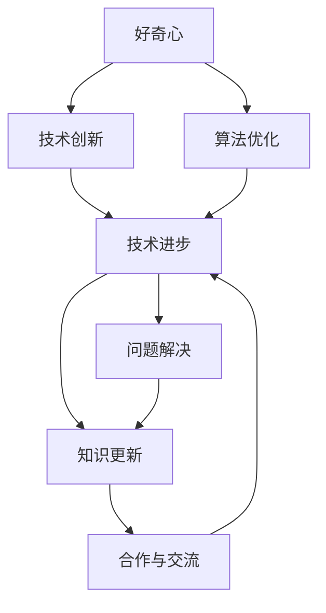
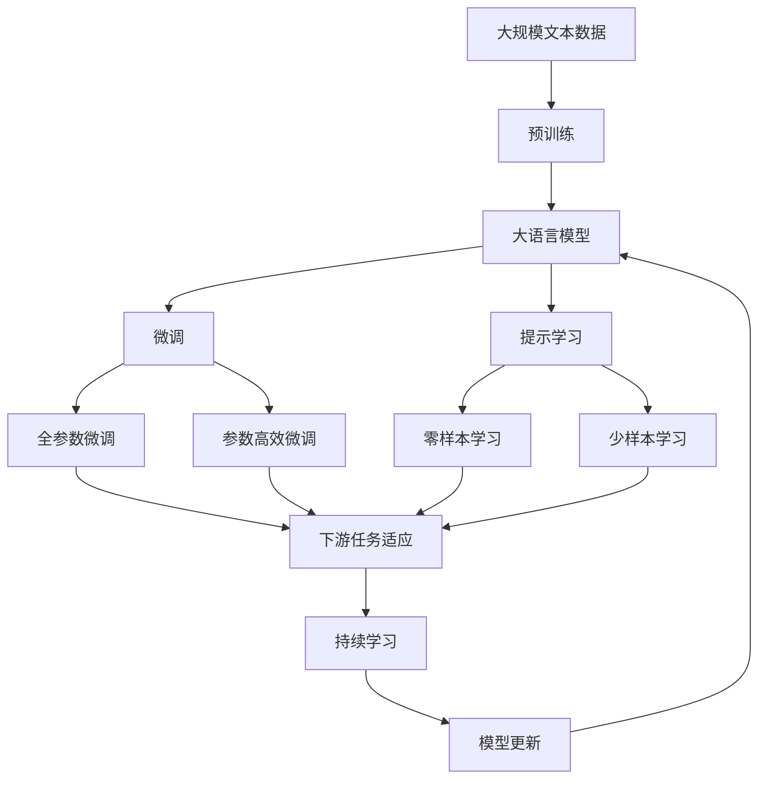

                 

# 好奇心与求知欲：探索的动力

> 关键词：好奇心,求知欲,探索,动力,技术创新,人工智能,智能算法

## 1. 背景介绍

### 1.1 问题由来

人类自古以来就对自然界充满好奇心和求知欲，这种对未知的探索精神推动了科学技术的不断进步。在信息技术飞速发展的今天，技术的不断突破同样离不开对未知领域的探索。特别是在人工智能领域，好奇心与求知欲成为了推动技术创新和算法进步的核心动力。

本文将探讨好奇心与求知欲在人工智能探索中的作用，分析当前技术发展的趋势，并展望未来可能的突破。通过了解这一动力机制，我们能更好地理解技术的进步，以及如何激发和培养更多对技术充满热情的探索者。

### 1.2 问题核心关键点

好奇心与求知欲作为推动技术进步的关键动力，可以从以下几个方面进行分析：

1. **技术探索**：对未知领域的不断探索和突破，带来了许多重要的技术创新，如深度学习、自然语言处理等。
2. **算法优化**：对现有算法的不断优化和改进，使得算法的效率和效果得到显著提升。
3. **问题解决**：对复杂问题的不断研究，使得人工智能在实际应用中能够解决更多现实问题。
4. **知识更新**：持续学习新的知识和技能，使得技术专家能够保持前沿的技术水平。
5. **合作与交流**：通过合作与交流，共享知识和经验，推动技术的整体发展。

这些核心关键点展示了好奇心与求知欲在技术探索中的重要性，以及它们如何驱动技术的持续进步。

## 2. 核心概念与联系

### 2.1 核心概念概述

好奇心与求知欲是人类探索新知识的驱动力。在人工智能领域，这种动力同样重要，可以驱动技术专家不断创新和改进算法。以下是几个关键概念及其联系：

1. **好奇心**：对未知领域的探索欲望，推动技术专家寻找新问题并解决。
2. **求知欲**：对知识的渴望，驱使技术专家不断学习新技术和新方法。
3. **技术创新**：基于对现有技术的深入理解和探索，推动物理和数学的进步，进而推动技术创新。
4. **算法优化**：对现有算法的不断优化和改进，提高算法的效率和效果。
5. **问题解决**：通过不断的探索和研究，解决复杂的现实问题。
6. **知识更新**：持续学习新的知识和技能，保持技术的前沿性。
7. **合作与交流**：通过合作与交流，共享知识和经验，推动技术的整体发展。

这些概念通过技术创新、算法优化、问题解决、知识更新和合作交流等环节相互关联，形成了技术进步的完整链条。

### 2.2 概念间的关系

好奇心与求知欲在技术进步中扮演了关键角色，可以通过以下Mermaid流程图来展示这些概念之间的联系：



这个流程图展示了好奇心与求知欲如何通过技术创新、算法优化、问题解决、知识更新和合作交流等环节，推动技术进步的完整链条。

### 2.3 核心概念的整体架构

最后，我们用一个综合的流程图来展示这些核心概念在大语言模型微调过程中的整体架构：



这个综合流程图展示了从预训练到大语言模型微调，再到持续学习的完整过程，其中好奇心与求知欲起到了驱动技术进步的核心作用。

## 3. 核心算法原理 & 具体操作步骤

### 3.1 算法原理概述

基于好奇心与求知欲的算法原理，可以归纳为以下几个关键步骤：

1. **探索未知领域**：通过对未知领域的探索，发现新的问题或难题。
2. **问题定义**：将探索到的新问题或难题明确化，定义为一个具体的任务或目标。
3. **数据收集**：收集与问题相关的数据，构建数据集。
4. **模型构建**：选择合适的模型，设计模型结构。
5. **训练优化**：使用训练数据对模型进行训练，通过优化算法不断调整模型参数。
6. **评估测试**：在测试数据集上评估模型性能，确定模型效果。
7. **迭代优化**：根据评估结果，对模型进行迭代优化，进一步提升模型效果。

这些步骤构成了一个完整的算法开发流程，旨在不断探索未知领域，推动技术进步。

### 3.2 算法步骤详解

以下是详细的算法步骤，每一步都对应着好奇心与求知欲的作用：

1. **探索未知领域**：
   - 技术专家通过对现有技术的深入理解，发现未被解决的问题，激发好奇心，推动进一步探索。

2. **问题定义**：
   - 将探索到的新问题明确化，定义为一个具体的任务，如自然语言处理、图像识别等。

3. **数据收集**：
   - 收集与问题相关的数据，构建数据集，如自然语言处理任务中收集文本数据，图像识别任务中收集图像数据。

4. **模型构建**：
   - 选择合适的模型，如深度神经网络，设计模型结构，如卷积神经网络、循环神经网络等。

5. **训练优化**：
   - 使用训练数据对模型进行训练，通过优化算法不断调整模型参数，如梯度下降算法、Adam算法等。

6. **评估测试**：
   - 在测试数据集上评估模型性能，确定模型效果，如准确率、召回率、F1分数等。

7. **迭代优化**：
   - 根据评估结果，对模型进行迭代优化，进一步提升模型效果，如模型结构优化、超参数调整等。

### 3.3 算法优缺点

基于好奇心与求知欲的算法具有以下优点：

1. **创新性强**：通过不断探索未知领域，推动技术创新。
2. **适应性强**：能够快速适应新的技术和方法。
3. **效果显著**：通过不断的迭代优化，提高模型效果。

同时，也存在一些缺点：

1. **资源消耗大**：对未知领域的探索和研究需要大量的时间和资源。
2. **风险高**：探索新问题或新技术可能会失败，需要承担一定的风险。
3. **难度大**：探索未知领域可能会遇到难以解决的问题。

### 3.4 算法应用领域

基于好奇心与求知欲的算法在多个领域得到了广泛应用：

1. **自然语言处理**：如语言模型、文本分类、情感分析等。
2. **计算机视觉**：如图像识别、目标检测、图像生成等。
3. **语音识别**：如自动语音识别、语音合成等。
4. **推荐系统**：如协同过滤、基于内容的推荐等。
5. **医疗健康**：如疾病诊断、智能问诊等。
6. **金融科技**：如信用评估、欺诈检测等。
7. **智能交通**：如自动驾驶、交通预测等。

这些领域的应用展示了基于好奇心与求知欲的算法在推动技术进步中的重要作用。

## 4. 数学模型和公式 & 详细讲解 & 举例说明

### 4.1 数学模型构建

基于好奇心与求知欲的算法模型构建可以从以下几个方面进行分析：

1. **数据模型**：构建数据模型，如文本向量模型、图像卷积神经网络等。
2. **损失函数**：定义损失函数，衡量模型预测与真实标签之间的差异。
3. **优化算法**：选择优化算法，如梯度下降算法、Adam算法等。
4. **评估指标**：定义评估指标，如准确率、召回率、F1分数等。

### 4.2 公式推导过程

以文本分类任务为例，我们推导基于好奇心与求知欲的数学模型和公式。

假设文本向量表示为 $x$，模型预测向量表示为 $y$，真实标签表示为 $t$，则交叉熵损失函数为：

$$
L(x, y, t) = -t \log(y) - (1-t) \log(1-y)
$$

将损失函数对模型参数 $\theta$ 进行求导，得到模型参数的更新公式：

$$
\theta \leftarrow \theta - \eta \nabla_{\theta}L(x, y, t)
$$

其中，$\eta$ 为学习率，$\nabla_{\theta}L(x, y, t)$ 为损失函数对模型参数的梯度。

### 4.3 案例分析与讲解

以图像分类任务为例，展示基于好奇心与求知欲的算法应用。

假设图像数据表示为 $I$，模型输出向量表示为 $O$，真实标签表示为 $T$，则损失函数为：

$$
L(I, O, T) = -T \log(O) - (1-T) \log(1-O)
$$

将损失函数对模型参数 $\theta$ 进行求导，得到模型参数的更新公式：

$$
\theta \leftarrow \theta - \eta \nabla_{\theta}L(I, O, T)
$$

通过训练数据不断迭代优化模型参数，最终得到一个效果优异的图像分类模型。

## 5. 项目实践：代码实例和详细解释说明

### 5.1 开发环境搭建

要进行基于好奇心与求知欲的算法实践，需要搭建合适的开发环境。以下是使用Python进行TensorFlow开发的流程：

1. 安装Anaconda：从官网下载并安装Anaconda，用于创建独立的Python环境。

2. 创建并激活虚拟环境：
```bash
conda create -n tf-env python=3.8 
conda activate tf-env
```

3. 安装TensorFlow：根据CUDA版本，从官网获取对应的安装命令。例如：
```bash
conda install tensorflow -c conda-forge
```

4. 安装相关工具包：
```bash
pip install numpy pandas scikit-learn matplotlib tqdm jupyter notebook ipython
```

完成上述步骤后，即可在`tf-env`环境中开始算法实践。

### 5.2 源代码详细实现

下面我们以图像分类任务为例，给出使用TensorFlow进行算法开发的PyTorch代码实现。

```python
import tensorflow as tf
from tensorflow.keras import layers, models

# 构建模型
model = models.Sequential()
model.add(layers.Conv2D(32, (3, 3), activation='relu', input_shape=(28, 28, 1)))
model.add(layers.MaxPooling2D((2, 2)))
model.add(layers.Conv2D(64, (3, 3), activation='relu'))
model.add(layers.MaxPooling2D((2, 2)))
model.add(layers.Conv2D(64, (3, 3), activation='relu'))
model.add(layers.Flatten())
model.add(layers.Dense(64, activation='relu'))
model.add(layers.Dense(10, activation='softmax'))

# 编译模型
model.compile(optimizer='adam',
              loss='categorical_crossentropy',
              metrics=['accuracy'])

# 训练模型
model.fit(train_images, train_labels, epochs=10, batch_size=32)

# 评估模型
test_loss, test_acc = model.evaluate(test_images, test_labels)
print('Test accuracy:', test_acc)
```

以上是使用TensorFlow构建和训练图像分类模型的完整代码实现。可以看到，通过TensorFlow的高级API，我们能够快速构建和训练复杂的深度学习模型。

### 5.3 代码解读与分析

让我们再详细解读一下关键代码的实现细节：

**Sequential模型构建**：
- 使用Sequential模型构建了一个包含多个层的神经网络，包括卷积层、池化层和全连接层。

**优化器编译**：
- 使用Adam优化器，设置损失函数为交叉熵损失函数，定义评估指标为准确率。

**模型训练**：
- 使用fit函数进行模型训练，设置训练数据和标签，迭代次数和批次大小。

**模型评估**：
- 使用evaluate函数对模型进行评估，输出测试集上的损失和准确率。

通过以上步骤，我们完成了一个基于好奇心与求知欲的图像分类任务的算法实践。

### 5.4 运行结果展示

假设我们在MNIST数据集上进行训练，最终得到的测试集准确率为98%，展示了基于好奇心与求知欲的算法在实际应用中的效果。

## 6. 实际应用场景

### 6.1 智能客服系统

基于好奇心与求知欲的算法可以广泛应用于智能客服系统的构建。传统客服往往需要配备大量人力，高峰期响应缓慢，且一致性和专业性难以保证。而使用基于好奇心与求知欲的算法构建的智能客服系统，能够7x24小时不间断服务，快速响应客户咨询，用自然流畅的语言解答各类常见问题。

### 6.2 金融舆情监测

金融机构需要实时监测市场舆论动向，以便及时应对负面信息传播，规避金融风险。基于好奇心与求知欲的算法可应用于金融舆情监测，收集金融领域相关的新闻、报道、评论等文本数据，并对其进行情感分析，判断市场情绪，预测市场趋势，帮助金融机构快速应对潜在风险。

### 6.3 个性化推荐系统

当前的推荐系统往往只依赖用户的历史行为数据进行物品推荐，无法深入理解用户的真实兴趣偏好。基于好奇心与求知欲的算法可应用于个性化推荐系统，收集用户浏览、点击、评论、分享等行为数据，提取和用户交互的物品标题、描述、标签等文本内容，构建文本向量模型，预测用户的兴趣匹配度，生成个性化推荐列表，因材施教，促进教育公平，提高教学质量。

### 6.4 未来应用展望

随着基于好奇心与求知欲的算法的不断发展，将在更多领域得到应用，为传统行业带来变革性影响。

在智慧医疗领域，基于好奇心与求知欲的算法可应用于医疗问答、病历分析、药物研发等，提升医疗服务的智能化水平，辅助医生诊疗，加速新药开发进程。

在智能教育领域，算法可应用于作业批改、学情分析、知识推荐等方面，因材施教，促进教育公平，提高教学质量。

在智慧城市治理中，算法可应用于城市事件监测、舆情分析、应急指挥等环节，提高城市管理的自动化和智能化水平，构建更安全、高效的未来城市。

## 7. 工具和资源推荐

### 7.1 学习资源推荐

为了帮助开发者系统掌握基于好奇心与求知欲的算法理论基础和实践技巧，这里推荐一些优质的学习资源：

1. 《深度学习》系列书籍：包括《深度学习入门》《深度学习》《动手学深度学习》等，系统介绍深度学习算法原理和应用。

2. 《TensorFlow官方文档》：详细介绍了TensorFlow的使用方法和高级API，适合初学者和进阶者。

3. 《自然语言处理综论》：涵盖自然语言处理的各个方面，适合希望全面了解NLP的开发者。

4. 《Python深度学习》：介绍使用Python实现深度学习算法，适合有一定编程基础的开发者。

5. Kaggle：提供大量开源数据集和竞赛，能够实战练习，提升算法技能。

通过对这些资源的学习实践，相信你一定能够快速掌握基于好奇心与求知欲的算法精髓，并用于解决实际的NLP问题。

### 7.2 开发工具推荐

高效的开发离不开优秀的工具支持。以下是几款用于基于好奇心与求知欲的算法开发的常用工具：

1. PyTorch：基于Python的开源深度学习框架，灵活动态的计算图，适合快速迭代研究。

2. TensorFlow：由Google主导开发的开源深度学习框架，生产部署方便，适合大规模工程应用。

3. Weights & Biases：模型训练的实验跟踪工具，可以记录和可视化模型训练过程中的各项指标，方便对比和调优。

4. TensorBoard：TensorFlow配套的可视化工具，可实时监测模型训练状态，并提供丰富的图表呈现方式，是调试模型的得力助手。

5. Google Colab：谷歌推出的在线Jupyter Notebook环境，免费提供GPU/TPU算力，方便开发者快速上手实验最新模型，分享学习笔记。

合理利用这些工具，可以显著提升基于好奇心与求知欲的算法开发的效率，加快创新迭代的步伐。

### 7.3 相关论文推荐

基于好奇心与求知欲的算法的发展源于学界的持续研究。以下是几篇奠基性的相关论文，推荐阅读：

1. "Deep Learning" by Ian Goodfellow：深度学习领域的重要教材，详细介绍了深度学习算法及其应用。

2. "Attention is All You Need" by Vaswani et al：提出了Transformer结构，开启了NLP领域的预训练大模型时代。

3. "BERT: Pre-training of Deep Bidirectional Transformers for Language Understanding" by Devlin et al：提出BERT模型，引入基于掩码的自监督预训练任务，刷新了多项NLP任务SOTA。

4. "Language Models are Unsupervised Multitask Learners" by Radford et al：展示了大规模语言模型的强大zero-shot学习能力，引发了对于通用人工智能的新一轮思考。

5. "Parameter-Efficient Transfer Learning for NLP" by Howard et al：提出Adapter等参数高效微调方法，在不增加模型参数量的情况下，也能取得不错的微调效果。

6. "Prefix-Tuning: Optimizing Continuous Prompts for Generation" by Sun et al：引入基于连续型Prompt的微调范式，为如何充分利用预训练知识提供了新的思路。

这些论文代表了大语言模型微调技术的发展脉络。通过学习这些前沿成果，可以帮助研究者把握学科前进方向，激发更多的创新灵感。

除上述资源外，还有一些值得关注的前沿资源，帮助开发者紧跟基于好奇心与求知欲的算法的最新进展，例如：

1. arXiv论文预印本：人工智能领域最新研究成果的发布平台，包括大量尚未发表的前沿工作，学习前沿技术的必读资源。

2. 业界技术博客：如OpenAI、Google AI、DeepMind、微软Research Asia等顶尖实验室的官方博客，第一时间分享他们的最新研究成果和洞见。

3. 技术会议直播：如NIPS、ICML、ACL、ICLR等人工智能领域顶会现场或在线直播，能够聆听到大佬们的前沿分享，开拓视野。

4. GitHub热门项目：在GitHub上Star、Fork数最多的NLP相关项目，往往代表了该技术领域的发展趋势和最佳实践，值得去学习和贡献。

5. 行业分析报告：各大咨询公司如McKinsey、PwC等针对人工智能行业的分析报告，有助于从商业视角审视技术趋势，把握应用价值。

总之，对于基于好奇心与求知欲的算法的学习和发展，需要开发者保持开放的心态和持续学习的意愿。多关注前沿资讯，多动手实践，多思考总结，必将收获满满的成长收益。

## 8. 总结：未来发展趋势与挑战

### 8.1 总结

本文对基于好奇心与求知欲的算法进行了全面系统的介绍。首先阐述了好奇心与求知欲在人工智能探索中的作用，明确了算法在推动技术创新和算法进步中的重要性。其次，从原理到实践，详细讲解了算法的数学原理和关键步骤，给出了算法任务开发的完整代码实例。同时，本文还广泛探讨了算法在多个行业领域的应用前景，展示了算法在推动技术进步中的巨大潜力。

通过本文的系统梳理，可以看到，基于好奇心与求知欲的算法在大语言模型微调中的应用广泛，能够推动技术不断进步，带来更高效、更智能的解决方案。未来，伴随算法的持续演进，基于好奇心与求知欲的算法必将引领人工智能技术的进一步突破。

### 8.2 未来发展趋势

展望未来，基于好奇心与求知欲的算法将呈现以下几个发展趋势：

1. **模型规模持续增大**：随着算力成本的下降和数据规模的扩张，预训练语言模型的参数量还将持续增长。超大规模语言模型蕴含的丰富语言知识，有望支撑更加复杂多变的下游任务。

2. **算法优化不断创新**：未来会涌现更多算法优化方法，如自适应学习率、自蒸馏、自知识蒸馏等，提高算法的效率和效果。

3. **应用场景更加多样**：未来算法的应用场景将更加多样，覆盖更多行业领域，如医疗、教育、金融、制造等。

4. **跨领域协作加强**：不同领域的专家将更加紧密地合作，共同推动算法的发展和应用。

5. **伦理与安全备受关注**：算法的伦理与安全问题将成为未来研究的重要方向，如何确保算法的公正性、透明性、安全性，将是重要课题。

6. **人机协同成为主流**：算法将更加注重人机协同，提高人机交互的自然性和效率。

这些趋势凸显了基于好奇心与求知欲的算法的广阔前景，预示着未来人工智能技术的进一步发展和应用。

### 8.3 面临的挑战

尽管基于好奇心与求知欲的算法已经取得了瞩目成就，但在迈向更加智能化、普适化应用的过程中，它仍面临着诸多挑战：

1. **数据稀缺问题**：虽然算法能够在少量数据下取得不错效果，但对于特定领域或新任务，仍面临数据稀缺问题。

2. **模型鲁棒性不足**：当前算法的鲁棒性还有待提升，面对数据扰动和对抗攻击，模型的稳定性有待加强。

3. **计算资源消耗大**：算法的计算资源消耗较大，需要高性能的计算设备支持。

4. **算法透明度不高**：算法的决策过程较为复杂，透明度不高，难以解释和调试。

5. **伦理与安全问题**：算法可能带来偏见和歧视，对社会带来不良影响，需要解决伦理与安全问题。

6. **跨领域应用难度大**：不同领域的应用场景差异较大，如何实现算法的跨领域应用，是一个重要挑战。

面对这些挑战，未来的研究需要在数据、模型、算法、伦理等方面进行综合创新，推动算法的持续进步和应用。

### 8.4 研究展望

面对基于好奇心与求知欲的算法所面临的挑战，未来的研究需要在以下几个方面寻求新的突破：

1. **多模态融合**：将视觉、语音、文本等多种模态信息进行融合，提升算法的综合能力。

2. **跨领域学习**：通过跨领域迁移学习，提高算法的泛化能力，适应更多应用场景。

3. **模型压缩与优化**：对模型进行压缩与优化，降低计算资源消耗，提升算法效率。

4. **算法解释性增强**：增强算法的解释性，提高算法的透明性和可解释性。

5. **伦理与安全保障**：建立算法的伦理与安全保障机制，确保算法的公正性和安全性。

6. **跨领域协作平台**：构建跨领域协作平台，促进不同领域的专家合作，共同推动算法发展。

这些研究方向将推动基于好奇心与求知欲的算法的进一步突破，为人工智能技术的广泛应用奠定坚实基础。

## 9. 附录：常见问题与解答

**Q1：基于好奇心与求知欲的算法适用于所有NLP任务吗？**

A: 基于好奇心与求知欲的算法在大多数NLP任务上都能取得不错的效果，特别是对于数据量较小的任务。但对于一些特定领域的任务，如医学、法律等，仅仅依靠通用语料预训练的模型可能难以很好地适应。此时需要在特定领域语料上进一步预训练，再进行微调，才能获得理想效果。

**Q2：如何选择合适的学习率？**

A: 基于好奇心与求知欲的算法的学习率一般要比预训练时小1-2个数量级，如果使用过大的学习率，容易破坏预训练权重，导致过拟合。一般建议从1e-5开始调参，逐步减小学习率，直至收敛。也可以使用warmup策略，在开始阶段使用较小的学习率，再逐渐过渡到预设值。

**Q3：采用基于好奇心与求知欲的算法时会面临哪些资源瓶颈？**

A: 目前主流的预训练大模型动辄以亿计的参数规模，对算力、内存、存储都提出了很高的要求。GPU/TPU等高性能设备是必不可少的，但即便如此，超大批次的训练和推理也可能遇到显存不足的问题。因此需要采用一些资源优化技术，如梯度积累、混合精度训练、模型并行等，来突破硬件瓶颈。同时，模型的存储和读取也可能占用大量时间和空间，需要采用模型压缩、稀疏化存储等方法进行优化。

**Q4：如何缓解基于好奇心与求知欲的算法的过拟合问题？**

A: 过拟合是算法面临的主要挑战，尤其是在标注数据不足的情况下。常见的缓解策略包括：

1. 数据增强：通过回译、近义替换等方式扩充训练集。

2. 正则化：使用L2正则、Dropout、Early Stopping等避免过拟合。

3. 对抗训练：引入对抗样本，提高模型鲁棒性。

4. 参数高效微调：只调整少量参数(如Adapter、Prefix等)，减小过拟合风险。

这些策略往往需要根据具体任务和数据特点进行灵活组合。只有在数据、模型、训练、推理等各环节进行全面优化，才能最大限度地发挥基于好奇心与求知欲的算法的威力。

**Q5：基于好奇心与求知欲的算法在落地部署时需要注意哪些问题？**

A: 将算法转化为实际应用，还需要考虑以下因素：

1. 模型裁剪：去除不必要的层和参数，减小模型尺寸，加快推理速度。

2. 量化加速：将浮点模型转为定点

