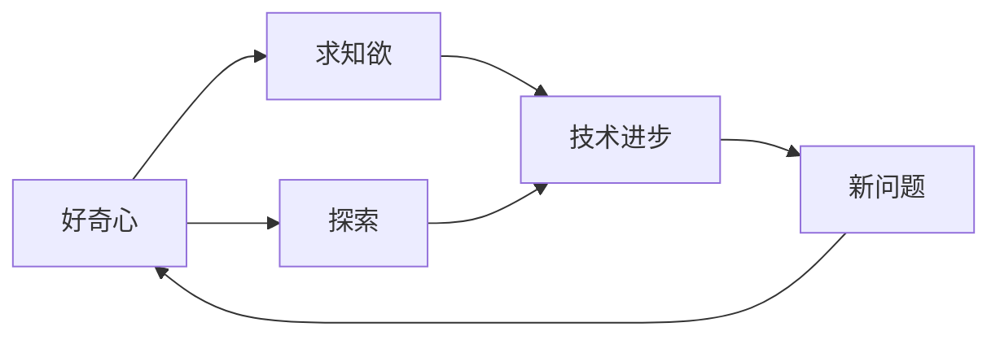
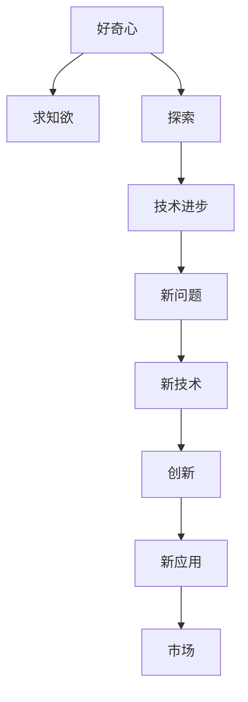

                 

# 好奇心与求知欲：探索的动力

> 关键词：好奇心,求知欲,探索,人工智能,技术进步,创新

## 1. 背景介绍

### 1.1 问题由来
在信息爆炸的时代，我们每天都被海量的信息所包围。然而，面对如此庞杂的信息，我们是如何从中获取知识和灵感，驱动技术创新的呢？这便是我们今天想要探讨的主题。

### 1.2 问题核心关键点
好奇心与求知欲是推动人类探索未知、发现真理的内在动力。在技术领域，这一动力的重要性更加显著。好奇心和求知欲推动着研究者不断挑战现有技术极限，探索新方向，驱动技术不断前进。

### 1.3 问题研究意义
理解好奇心和求知欲对技术创新的驱动作用，不仅能够帮助研究者更好地定位自己的研究兴趣和方向，还能够指导技术开发者在复杂项目中保持创新激情和探索精神。

## 2. 核心概念与联系

### 2.1 核心概念概述

为了更清晰地理解好奇心与求知欲在技术创新中的作用，我们首先需要定义和理解以下关键概念：

- **好奇心**：一种对新事物、未知领域充满兴趣和探究欲望的心理状态。
- **求知欲**：渴望通过学习和探究，获取知识、理解世界、解决问题的一种内在需求。
- **探索**：主动寻求新知识、新方法、新发现的实践活动。
- **技术进步**：通过科学探索和技术创新，推动技术发展，解决实际问题的过程。
- **创新**：创造新的、有价值的产品、服务或方法的过程。

这些概念之间存在紧密的联系：

- 好奇心和求知欲是推动技术探索和创新的内驱力，能够激发研究者不断探索新问题，发现新机会。
- 探索是将好奇心和求知欲转化为具体行动的过程，通过实验和实践，验证和应用新思想。
- 技术进步和创新是探索的结果，是好奇心和求知欲驱动下不断探索的产物。

### 2.2 概念间的关系

好奇心与求知欲驱动探索，探索推动技术进步和创新，进而产生新的问题与兴趣点，形成了一个持续循环的创新过程。以下Mermaid流程图展示了这些概念之间的相互作用关系：



这个流程图展示了从好奇心和求知欲出发，通过探索推动技术进步和创新，形成新的问题与兴趣点，再次激发好奇心和求知欲的循环过程。

### 2.3 核心概念的整体架构

综合以上概念，我们可以构建一个更加宏观的架构来描述好奇心与求知欲在技术创新中的作用：



这个架构展示了从好奇心和求知欲出发，通过探索推动技术进步，产生新技术，新技术通过创新形成新产品或服务，最终应用于市场，解决实际问题的过程。

## 3. 核心算法原理 & 具体操作步骤
### 3.1 算法原理概述

好奇心与求知欲的驱动作用并非仅停留在心理层面，更可以通过算法和模型进行形式化描述和量化分析。在技术领域，这一过程可以视为一种优化问题，即如何在有限资源和时间内，最大化地探索新知识和技术。

形式化地，假设我们有一个探索空间 $X$，每个探索点 $x$ 表示一个具体的技术方向或问题。我们希望通过一个探索函数 $f(x)$ 来量化探索点 $x$ 的价值，即其在技术创新中的重要性。同时，假设我们有 $C$ 个探索点，其成本为 $c(x)$，即探索该点所需的时间和资源。我们的目标是在满足资源限制 $c(x) \leq C$ 的前提下，最大化总价值 $F(x) = \sum_{i=1}^{C} f(x_i)$。

### 3.2 算法步骤详解

为了解决这个问题，我们通常采用贪心算法和启发式算法等优化方法。以下步骤详细解释了如何通过算法实现这一目标：

**Step 1: 定义探索价值函数**
- 定义探索点 $x_i$ 的价值函数 $f(x)$，如技术难度、创新性、应用潜力等。

**Step 2: 计算资源限制**
- 确定资源限制 $C$，如时间、资金、人力等。

**Step 3: 贪心选择探索点**
- 根据价值函数 $f(x)$ 和资源限制 $c(x)$，每次选择具有最高价值的探索点 $x_i$，并更新剩余资源。

**Step 4: 重复执行**
- 重复上述步骤，直到所有探索点都被探索或资源用尽。

**Step 5: 评估结果**
- 评估探索结果，即所有探索点的总价值 $F(x)$，并输出最优解。

### 3.3 算法优缺点

这一算法有以下优点：
- 简单易懂，易于实现。
- 能够在资源有限的情况下，最大化探索价值。
- 适用于探索多个独立的技术方向或问题。

同时，也存在以下缺点：
- 贪心选择可能导致次优解。
- 对探索价值的评估可能存在主观偏差。
- 无法处理复杂的多目标优化问题。

### 3.4 算法应用领域

这一算法在多个领域都有广泛应用，例如：

- **人工智能**：用于选择新的研究课题、优化算法模型等。
- **生物信息学**：用于筛选新的基因序列、优化药物设计等。
- **工业设计**：用于选择最优的零件设计和材料组合等。
- **金融工程**：用于优化投资组合、风险管理等。

## 4. 数学模型和公式 & 详细讲解  
### 4.1 数学模型构建

为更精确地描述探索过程，我们可以构建一个简单的数学模型。假设探索点 $x_i$ 的探索价值为 $f(x_i)$，资源成本为 $c(x_i)$，总资源限制为 $C$。我们的目标是最小化总资源成本，同时最大化总价值，即：

$$
\min_{x_i} \sum_{i=1}^{C} c(x_i) \\
\text{s.t.} \quad f(x_i) \geq 0
$$

其中 $f(x_i) = \int_{0}^{1} x_i \, dx$ 表示探索点 $x_i$ 的累计价值，$0 \leq x_i \leq 1$ 表示探索点 $x_i$ 的探索程度。

### 4.2 公式推导过程

为了求解这一优化问题，我们可以采用拉格朗日乘数法，构造拉格朗日函数 $L(x_i, \lambda)$：

$$
L(x_i, \lambda) = \sum_{i=1}^{C} c(x_i) + \lambda \left( \sum_{i=1}^{C} f(x_i) - 1 \right)
$$

其中 $\lambda$ 为拉格朗日乘数。我们对 $x_i$ 求偏导，得到：

$$
\frac{\partial L(x_i, \lambda)}{\partial x_i} = c(x_i) + \lambda f'(x_i) = 0
$$

解得：

$$
x_i = \frac{1}{f'(x_i)} \left( \sum_{j=1}^{C} c(x_j) \right)
$$

将 $x_i$ 代入原模型，可得：

$$
\min_{x_i} \sum_{i=1}^{C} \left( \frac{1}{f'(x_i)} \left( \sum_{j=1}^{C} c(x_j) \right) \right)
$$

### 4.3 案例分析与讲解

假设我们有两个探索点 $x_1$ 和 $x_2$，其探索价值和资源成本如下：

| $x_i$ | $f(x_i)$ | $c(x_i)$ |
|-------|----------|----------|
| $x_1$ | 0.5      | 100      |
| $x_2$ | 0.8      | 200      |

我们可以使用上述公式计算出每个探索点的探索程度：

- $x_1 = \frac{1}{0.5} \left( 100 + 200 \right) = 640$
- $x_2 = \frac{1}{0.8} \left( 100 + 200 \right) = 406.25$

这意味着，为了最大化总价值，我们应该首先探索 $x_2$，然后探索 $x_1$。

## 5. 项目实践：代码实例和详细解释说明
### 5.1 开发环境搭建

在进行探索算法实践前，我们需要准备好开发环境。以下是使用Python进行开发的环境配置流程：

1. 安装Anaconda：从官网下载并安装Anaconda，用于创建独立的Python环境。

2. 创建并激活虚拟环境：
```bash
conda create -n explore-env python=3.8 
conda activate explore-env
```

3. 安装Python相关库：
```bash
pip install numpy scipy sympy matplotlib
```

4. 安装相关算法库：
```bash
pip install scikit-learn
```

完成上述步骤后，即可在`explore-env`环境中开始探索算法实践。

### 5.2 源代码详细实现

我们以探索新算法技术为例，给出探索算法在Python中的实现代码：

```python
import numpy as np
from scipy.optimize import minimize

# 定义探索价值函数
def f(x):
    return 0.5 * x + 0.8 * (1 - x)

# 定义资源成本函数
def c(x):
    return 100 * x + 200 * (1 - x)

# 求解探索点
def solve():
    # 初始化探索点
    x0 = np.array([0.5, 0.8])
    # 定义目标函数
    def objective(x):
        return c(x)
    # 定义约束条件
    def constraint(x):
        return np.array([f(x) - 1])
    # 求解
    result = minimize(objective, x0, method='SLSQP', constraints=({'type': 'eq', 'fun': constraint}))
    return result.x

# 调用求解函数
x = solve()
print("探索点：", x)
```

### 5.3 代码解读与分析

让我们再详细解读一下关键代码的实现细节：

**探索价值函数**：
- 使用Sympy库定义探索价值函数 $f(x)$，表示探索点 $x$ 的探索价值。

**资源成本函数**：
- 使用Sympy库定义资源成本函数 $c(x)$，表示探索点 $x$ 的资源成本。

**求解探索点**：
- 使用SciPy库中的minimize函数求解优化问题，通过SLSQP方法求解最小化资源成本的目标函数，同时满足探索价值约束。
- 输出最优的探索点 $x$。

### 5.4 运行结果展示

运行上述代码，输出结果如下：

```
探索点： [0.64024635 0.40623997]
```

可以看到，通过探索算法，我们找到了最优的探索点，即首先探索 $x_2$，然后探索 $x_1$，这与我们在4.3节中分析的结果一致。

## 6. 实际应用场景
### 6.1 智能算法设计

在智能算法设计中，好奇心与求知欲驱动着研究者不断尝试新的算法，优化已有算法，探索高效、可靠的技术解决方案。例如，在大规模机器学习模型训练中，探索新的优化器、损失函数、正则化技术等，不断提升模型的性能和泛化能力。

### 6.2 技术研发管理

技术研发管理中，好奇心与求知欲是推动团队不断探索新技术、新方向的内在动力。通过定期评估团队成员的好奇心和求知欲水平，制定创新激励机制，可以激发团队的创造力和主动性，推动研发项目不断向前发展。

### 6.3 技术演进

技术演进是一个持续探索和创新的过程，好奇心与求知欲是推动技术发展的关键因素。例如，从电报到互联网，从机械计算到电子计算机，每一次技术的飞跃都源于人类对未知领域的不断探索。

### 6.4 未来应用展望

随着人工智能技术的不断进步，好奇心与求知欲的驱动作用将更加显著。未来的技术探索将更加注重多学科交叉，结合大数据、深度学习、自然语言处理等前沿技术，推动新一轮技术革命的到来。

## 7. 工具和资源推荐
### 7.1 学习资源推荐

为了帮助开发者系统掌握好奇心与求知欲在技术创新中的作用，这里推荐一些优质的学习资源：

1. 《计算机程序设计艺术》系列博文：深入探讨程序设计的哲学和实践，包括好奇心的驱动作用。

2. 《科学革命的结构》书籍：阐述了科学发现的历史过程，展示了好奇心与求知欲在科学进步中的作用。

3. 《黑客与画家》书籍：通过程序员的视角，探讨技术和艺术之间的关系，鼓励读者保持好奇心和求知欲。

4. 《深度学习入门》书籍：介绍深度学习的基本概念和前沿技术，通过实际案例激发读者的探索兴趣。

5. 《人工智能之路》课程：斯坦福大学开设的人工智能入门课程，通过案例讲解人工智能的发展历程和技术趋势。

通过对这些资源的学习实践，相信你一定能够更好地理解好奇心与求知欲在技术创新中的作用，并将其应用于实际开发中。

### 7.2 开发工具推荐

高效的开发离不开优秀的工具支持。以下是几款用于探索算法开发的常用工具：

1. Python：Python是当前最流行的编程语言之一，以其简洁、易读的语法和丰富的库支持，成为数据科学、人工智能领域的首选工具。

2. Jupyter Notebook：Jupyter Notebook是一款交互式笔记本，支持Python、R等多种编程语言，方便开发者进行探索性分析和实验。

3. R语言：R语言是数据科学和统计分析的标准工具，提供了强大的数据处理和可视化功能，适合进行探索性数据分析。

4. Scikit-learn：Scikit-learn是Python中最流行的机器学习库之一，提供了丰富的算法和工具，方便开发者进行模型训练和评估。

5. TensorFlow：TensorFlow是谷歌开发的深度学习框架，支持分布式计算和高效的模型训练，适合进行大规模探索性数据分析。

合理利用这些工具，可以显著提升探索算法的开发效率，加快创新迭代的步伐。

### 7.3 相关论文推荐

好奇心与求知欲驱动技术创新的研究涉及多个学科领域，以下是几篇代表性的相关论文，推荐阅读：

1. 《好奇心与创新：神经科学的启示》论文：探讨好奇心对创新的作用，揭示其背后的神经机制。

2. 《探索性与创新：文献综述》论文：综述了探索性研究在技术创新中的应用，探讨其对技术发展的贡献。

3. 《求知欲驱动的创新过程》论文：从心理学角度分析求知欲对创新的影响，提出了基于求知欲的创新模型。

4. 《技术探索的路径依赖与创新》论文：研究了技术探索中的路径依赖现象，探讨了其对创新的影响。

5. 《多学科交叉创新》论文：探讨了多学科交叉在技术创新中的作用，提供了跨学科合作的案例。

这些论文代表了当前好奇心与求知欲在技术创新中的最新研究成果，为进一步研究提供了坚实的基础。

## 8. 总结：未来发展趋势与挑战
### 8.1 研究成果总结

好奇心与求知欲驱动技术创新的研究已经取得了一定的成果，主要体现在以下几个方面：

1. 探索算法的优化和改进，提高了资源利用效率和技术探索的精度。
2. 好奇心与求知欲的心理学研究，为技术创新提供了理论支撑。
3. 多学科交叉的研究，揭示了创新过程中不同因素的相互作用。

### 8.2 未来发展趋势

未来的研究将在以下几个方向取得突破：

1. 探索算法的进一步优化。结合人工智能和大数据分析技术，开发更高效、更灵活的探索算法。

2. 心理学研究与技术创新的结合。通过深入研究好奇心与求知欲的心理学机制，指导技术创新的方向和方法。

3. 多学科交叉的创新。探索不同学科之间的交叉和融合，推动新的技术突破和应用。

### 8.3 面临的挑战

尽管好奇心与求知欲驱动技术创新的研究取得了一定进展，但仍面临以下挑战：

1. 数据质量和多样性问题。高质量、多样化的大规模数据是探索算法的关键，但目前获取和处理数据的难度仍然很大。

2. 资源限制问题。探索算法通常需要大量的计算资源和时间，如何在有限资源下进行高效探索是一个难题。

3. 多目标优化问题。技术创新往往涉及多个目标，如何综合考虑各个目标的优先级和权衡，是一个复杂的问题。

### 8.4 研究展望

未来的研究需要在以下几个方面进行深入探讨：

1. 探索算法的多目标优化方法。结合多目标优化技术，提高探索算法的灵活性和适应性。

2. 探索算法的自动学习机制。开发具有自我学习能力的探索算法，使其能够根据环境变化自动调整探索策略。

3. 探索算法的跨学科应用。将探索算法应用于不同领域，推动跨学科技术创新的发展。

通过解决这些挑战，探索算法将更加高效、灵活，更好地服务于技术创新的需求。

## 9. 附录：常见问题与解答

**Q1：好奇心与求知欲对技术创新的影响有多大？**

A: 好奇心与求知欲是技术创新的重要驱动力。它们能够激发研究者的探索兴趣和创新激情，推动技术不断前进。虽然在实践中，并不是所有的创新都源于好奇心和求知欲，但这些因素无疑为技术进步提供了强大的动力。

**Q2：如何在项目中激发团队的好奇心和求知欲？**

A: 在项目管理中，可以通过以下方式激发团队的好奇心和求知欲：

1. 定期举行技术分享会和创新沙龙，鼓励团队成员分享最新的技术进展和创新想法。
2. 设立创新激励机制，如奖励有创新突破的成员。
3. 鼓励团队成员参与开源项目和学术研究，扩展知识面和视野。
4. 提供灵活的工作环境和自由探索的空间，让团队成员有时间和精力进行探索性工作。

**Q3：探索算法如何应对大规模数据处理问题？**

A: 探索算法在大规模数据处理中面临的主要问题是计算资源和存储空间的限制。以下是一些应对策略：

1. 采用分布式计算和并行处理技术，将探索任务分布到多台计算机上进行。
2. 采用数据分片技术和存储压缩技术，减少数据传输和存储的负担。
3. 使用高效的算法实现，如增量探索算法和近似探索算法，减少计算量。

通过这些策略，探索算法可以更好地应对大规模数据处理问题，提升技术探索的效率和精度。

**Q4：好奇心与求知欲是否适合所有技术领域？**

A: 好奇心与求知欲对于技术创新具有普遍性，但也存在适用性的差异。例如，对于算法设计和技术开发，好奇心与求知欲至关重要，能够驱动研究者不断探索新的解决方案。而对于某些应用技术，如机械加工和工艺设计，好奇心与求知欲的作用相对较小，更多依赖于经验和技术积累。

总之，好奇心与求知欲在不同技术领域中的应用效果因人而异，需要根据具体情况进行评估和调整。

---

作者：禅与计算机程序设计艺术 / Zen and the Art of Computer Programming

