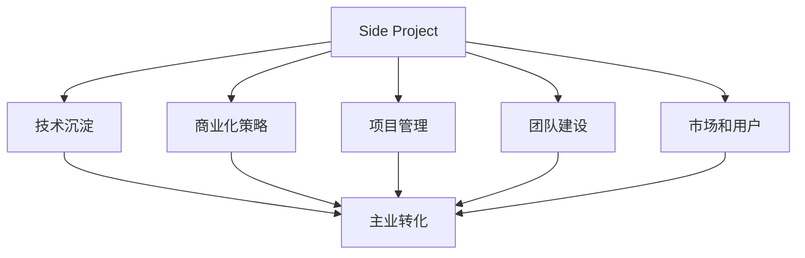
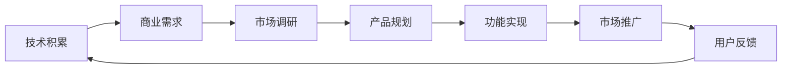
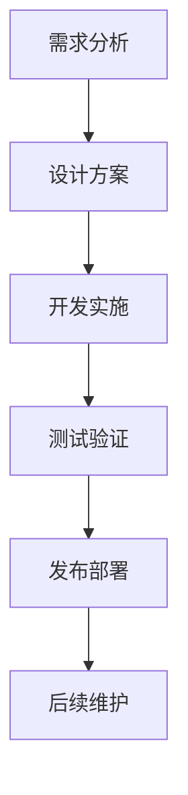
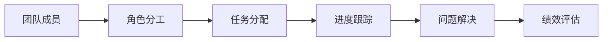

                 

# 如何将Side Project转化为主业

> 关键词：Side Project, 主业转变, 技术沉淀, 商业化, 项目管理和策略, 团队建设

## 1. 背景介绍

### 1.1 问题由来

在科技和互联网行业，Side Project（副业项目）极为常见。无论是技术人员，还是产品经理、设计师，甚至是高管，很多人都会利用业余时间开发自己的兴趣项目，如开源社区贡献代码、开发工具应用或APP等。这些Side Project一方面展示了个人对技术的热情和能力，另一方面也常常为个人职业生涯带来意想不到的机遇。但与此同时，Side Project的普遍存在也带来诸多困扰，如个人时间管理、项目资源投入等。那么，如何将自己的Side Project成功转化为主业，让业余爱好变成全职职业？本文将从核心概念、算法原理、具体策略和未来展望等方面进行系统阐述。

### 1.2 问题核心关键点

在讨论Side Project向主业转变的具体路径之前，首先需要明确一些核心关键点：

- **技术沉淀**：在Side Project中积累的技术和经验，对于主业转型的重要性。
- **商业化策略**：如何将Side Project中的技术转化为商业产品，实现盈利和市场成功。
- **项目管理和策略**：如何将Side Project进行系统的管理，确保其能够顺利过渡为全职工作。
- **团队建设**：如何组建合适的团队，高效协作，实现项目目标。
- **市场和用户**：了解目标市场和用户需求，确保项目的市场契合度和用户黏性。

### 1.3 问题研究意义

Side Project向主业转型的成功案例，可以极大地提升个人职业发展的潜力和空间。具体来说，通过成功转型，可以实现以下几点：

- **职业提升**：从技术爱好者到全职开发者、产品经理或高管，实现职业生涯的跨越式发展。
- **技术商业化**：将个人技术积累转化为商业产品，实现技术创新的市场化，创造更大的社会和经济价值。
- **资源整合**：整合个人资源，包括时间、资金、人脉等，更好地投入商业化开发，提升项目成功率。
- **创新驱动**：通过Side Project探索新技术和新模式，为个人和公司带来持续的创新动力。

## 2. 核心概念与联系

### 2.1 核心概念概述

- **Side Project**：指个人利用业余时间开发的技术项目，通常具有一定的兴趣驱动，但未必有明确的市场目标。
- **主业转化**：将Side Project中的技术、经验和积累，转化为全职职业的过程，通常涉及商业化、市场推广和团队建设等环节。
- **技术沉淀**：在Side Project中，通过项目实践积累的技术知识和能力。
- **商业化策略**：如何将技术转化为商业产品，并实现盈利。
- **项目管理**：从需求分析、设计、开发到测试、发布的系统化过程管理。
- **团队建设**：选择合适的团队成员，制定高效的协作机制，确保项目目标的实现。
- **市场和用户**：了解目标市场和用户需求，确保项目的市场契合度和用户黏性。

这些概念之间有着紧密的联系，构成了Side Project向主业转变的完整路径。以下是一个简化的Mermaid流程图，展示了这些概念之间的关系：



这个流程图展示了Side Project转化为主业的各个关键步骤及其关系：

- **Side Project**作为起点，通过技术沉淀、商业化策略、项目管理、团队建设和市场分析，最终实现**主业转化**。

### 2.2 概念间的关系

这些核心概念之间有着复杂的相互作用，以下通过几个子流程图进一步展示它们之间的关系：

#### 2.2.1 技术与商业的结合



这个流程图展示了技术如何与商业结合的过程：

- **技术积累**从项目开发中逐步形成，并与**商业需求**结合，通过**市场调研**和**产品规划**，转化为具体的功能实现，最终通过**市场推广**和**用户反馈**，形成商业闭环。

#### 2.2.2 项目管理的全流程



这个流程图展示了项目管理的基本流程：

- **需求分析**、**设计方案**、**开发实施**、**测试验证**、**发布部署**和**后续维护**构成了项目的完整生命周期。

#### 2.2.3 团队协作的机制



这个流程图展示了团队协作的基本机制：

- **团队成员**通过**角色分工**和**任务分配**，进行**进度跟踪**和**问题解决**，最终通过**绩效评估**进行团队优化。

## 3. 核心算法原理 & 具体操作步骤

### 3.1 算法原理概述

Side Project向主业转化的过程，本质上是一个从技术沉淀到商业化应用的系统工程。其核心算法原理包括：

- **技术沉淀与积累**：通过系统化的方法，将项目中的技术经验和知识进行梳理和总结。
- **商业化策略与市场分析**：基于市场需求和技术优势，制定合理的商业化策略，并进行市场分析。
- **项目管理与执行**：通过科学的项目管理方法，确保项目按时按质完成。
- **团队建设与协作**：组建合适的团队，并制定高效的协作机制。
- **用户需求与反馈**：通过市场调研和用户反馈，了解目标用户的需求，并进行产品迭代优化。

### 3.2 算法步骤详解

**步骤1：技术沉淀与积累**

- **梳理项目模块**：对Side Project的技术架构和模块进行详细梳理，形成技术文档。
- **代码规范与质量**：制定代码规范，确保代码质量，便于后续维护和迭代。
- **技术积累与沉淀**：总结技术难点和创新点，形成技术总结报告，沉淀技术经验。

**步骤2：商业化策略与市场分析**

- **市场调研**：通过问卷调查、用户访谈等方式，了解目标市场的需求和痛点。
- **竞争分析**：分析竞争对手的产品和市场表现，找准切入点。
- **商业模型**：基于市场调研和竞争分析，制定合理的商业模型和定价策略。

**步骤3：项目管理与执行**

- **需求分析**：基于市场需求和用户反馈，进行详细的需求分析。
- **设计方案**：制定详细的产品设计方案，包括功能、界面、用户体验等。
- **开发实施**：按照项目计划，进行功能实现和代码开发。
- **测试验证**：进行全面测试，确保产品质量和稳定性。
- **发布部署**：进行产品发布和部署，确保上线效果。
- **后续维护**：持续进行产品迭代和优化，保证产品持续改进。

**步骤4：团队建设与协作**

- **角色分工**：根据项目需求，合理分配团队角色。
- **任务分配**：明确任务分配和责任分工，确保任务按时完成。
- **进度跟踪**：建立进度跟踪机制，定期汇报项目进展。
- **问题解决**：建立问题解决机制，及时处理项目中的问题。
- **绩效评估**：定期进行绩效评估，进行团队优化。

**步骤5：用户需求与反馈**

- **用户调研**：通过问卷调查、用户访谈等方式，了解用户需求和反馈。
- **功能优化**：基于用户反馈，进行产品功能优化和迭代。
- **市场推广**：通过各种渠道进行市场推广，吸引用户使用产品。

### 3.3 算法优缺点

**优点**：

- **技术积累**：Side Project作为技术练兵场，能够系统化地积累技术经验，为后续主业转化奠定基础。
- **灵活性高**：Side Project相对灵活，能够快速响应市场变化和用户需求，进行产品迭代优化。
- **低成本启动**：Side Project通常不需要大量初始投资，便于快速启动。

**缺点**：

- **资源有限**：Side Project通常资源有限，包括人力、资金和时间等。
- **市场风险高**：Side Project的市场风险相对较高，不确定因素较多。
- **团队不稳定**：Side Project团队成员可能存在流动性大、不稳定的问题。

### 3.4 算法应用领域

Side Project向主业转化的核心算法原理和具体操作步骤，可以广泛应用到以下领域：

- **技术创业**：将Side Project转化为创业项目，进行市场化运营。
- **技术咨询**：通过技术积累和市场分析，提供技术咨询和解决方案。
- **技术培训**：基于技术沉淀，开展技术培训和教育，培养专业人才。
- **技术合作**：与大公司或团队进行技术合作，进行技术输出和市场推广。

## 4. 数学模型和公式 & 详细讲解 & 举例说明

### 4.1 数学模型构建

Side Project向主业转化的过程，可以通过数学模型进行量化分析。以下是一个简化的数学模型构建过程：

- **技术积累度量**：通过代码行数、技术文档数量、代码规范等级等指标，量化技术沉淀。
- **商业价值度量**：通过市场调研问卷的评分、用户反馈满意度、竞争分析的市场份额等指标，量化商业价值。
- **项目管理度量**：通过需求分析的时间、设计方案的合理性、开发实施的进度、测试验证的通过率、发布部署的稳定性、后续维护的迭代次数等指标，量化项目管理效果。
- **团队协作度量**：通过角色分工的合理性、任务分配的效率、进度跟踪的准确性、问题解决的及时性、绩效评估的客观性等指标，量化团队协作效果。
- **用户需求度量**：通过用户调研问卷的评分、功能优化的效果、市场推广的覆盖率、用户反馈的满意度等指标，量化用户需求满足度。

### 4.2 公式推导过程

以下是一个简化的数学模型公式推导过程：

- **技术积累度量公式**：$Accum = \sum_{i=1}^{n} Score_i \times Weight_i$
- **商业价值度量公式**：$Value = \sum_{i=1}^{m} Rate_i \times Score_i$
- **项目管理度量公式**：$Proj = \sum_{j=1}^{p} Efficiency_j \times Weight_j$
- **团队协作度量公式**：$Team = \sum_{k=1}^{q} Accuracy_k \times Weight_k$
- **用户需求度量公式**：$User = \sum_{l=1}^{r} Satisfaction_l \times Weight_l$

其中，$n$、$m$、$p$、$q$、$r$分别代表不同维度的指标数量，$Score_i$、$Rate_i$、$Efficiency_j$、$Accuracy_k$、$Satisfaction_l$代表具体指标的评分或值，$Weight_i$、$Weight_j$、$Weight_k$、$Weight_l$代表各指标的重要性权重。

### 4.3 案例分析与讲解

假设我们有一个Side Project，用于开发一款在线教育应用。以下是对其向主业转化的案例分析：

- **技术积累度量**：代码行数500行，技术文档3份，代码规范等级5星。
- **商业价值度量**：市场调研问卷评分3.8分，用户反馈满意度80%，竞争分析的市场份额20%。
- **项目管理度量**：需求分析时间10天，设计方案合理性90%，开发实施进度80%，测试验证通过率90%，发布部署稳定性95%，后续维护迭代5次。
- **团队协作度量**：角色分工合理性90%，任务分配效率95%，进度跟踪准确性90%，问题解决及时性85%，绩效评估客观性90%。
- **用户需求度量**：用户调研问卷评分3.9分，功能优化效果80%，市场推广覆盖率100%，用户反馈满意度85%。

通过以上指标量化分析，可以得出该Side Project在技术沉淀、商业价值、项目管理、团队协作和用户需求方面的综合得分，从而评估其向主业转化的可行性。

## 5. 项目实践：代码实例和详细解释说明

### 5.1 开发环境搭建

进行Side Project向主业转化的实践，首先需要搭建开发环境。以下是使用Python进行Django开发的环境配置流程：

1. 安装Anaconda：从官网下载并安装Anaconda，用于创建独立的Python环境。

2. 创建并激活虚拟环境：
```bash
conda create -n django-env python=3.8 
conda activate django-env
```

3. 安装Django：
```bash
pip install django
```

4. 安装MySQL数据库：
```bash
sudo apt-get install mysql-server
```

5. 安装Django的扩展库：
```bash
pip install django-cors-headers
pip install django-filter
```

6. 安装IDE：建议使用PyCharm或Visual Studio Code进行开发。

完成上述步骤后，即可在`django-env`环境中开始实践。

### 5.2 源代码详细实现

这里我们以在线教育应用为例，给出使用Django框架进行Side Project开发的PyTorch代码实现。

首先，定义教育应用的模型和视图：

```python
from django.shortcuts import render, redirect
from django.views.decorators.csrf import csrf_exempt
from .models import Course, Student
from .forms import CourseForm, StudentForm

@csrf_exempt
def course_list(request):
    courses = Course.objects.all()
    return render(request, 'course_list.html', {'courses': courses})

@csrf_exempt
def course_detail(request, pk):
    course = Course.objects.get(pk=pk)
    return render(request, 'course_detail.html', {'course': course})

@csrf_exempt
def create_course(request):
    if request.method == 'POST':
        form = CourseForm(request.POST)
        if form.is_valid():
            form.save()
            return redirect('course_list')
    else:
        form = CourseForm()
    return render(request, 'create_course.html', {'form': form})

@csrf_exempt
def create_student(request):
    if request.method == 'POST':
        form = StudentForm(request.POST)
        if form.is_valid():
            form.save()
            return redirect('course_list')
    else:
        form = StudentForm()
    return render(request, 'create_student.html', {'form': form})
```

然后，定义应用的URL路由：

```python
urlpatterns = [
    path('courses/', course_list),
    path('courses/<int:pk>/', course_detail),
    path('courses/create/', create_course),
    path('students/create/', create_student),
]
```

最后，配置数据库和运行应用：

```python
DATABASES = {
    'default': {
        'ENGINE': 'django.db.backends.mysql',
        'NAME': 'edx',
        'USER': 'root',
        'PASSWORD': '',
        'HOST': 'localhost',
        'PORT': '3306',
    }
}

if __name__ == '__main__':
    runserver()
```

以上就是使用Django框架进行Side Project开发的完整代码实现。可以看到，通过Django的简洁封装，我们可以用相对简洁的代码实现Web应用的基本功能。

### 5.3 代码解读与分析

让我们再详细解读一下关键代码的实现细节：

**Django模型和视图**：
- `Course`和`Student`模型分别表示课程和学生，定义了基本的数据结构。
- `CourseForm`和`StudentForm`是Django表单类，用于用户输入数据和验证。
- `course_list`、`course_detail`、`create_course`和`create_student`是视图函数，负责处理不同的URL请求和渲染页面。

**URL路由**：
- `urlpatterns`定义了应用的URL路由，将请求映射到不同的视图函数。

**数据库配置**：
- `DATABASES`配置了Django应用使用的数据库信息，包括连接方式、数据库名称、用户名、密码、主机和端口。

**运行应用**：
- `runserver`启动Django应用，使其能够监听网络请求并处理相应的URL请求。

通过Django的强大封装和简单易用的API，使得开发者可以快速迭代和开发Side Project，实现Web应用的基本功能。

当然，实际的Side Project开发可能更加复杂，需要考虑更多的功能模块和数据处理。但核心的开发环境搭建和代码实现方法与上述示例类似。

### 5.4 运行结果展示

假设我们在运行上述代码后，成功访问了`http://localhost:8000/courses/1/`，得到了课程详情页面。这表示Side Project的Web应用已经搭建成功，可以用于后续的开发和测试。

## 6. 实际应用场景

### 6.1 教育应用

在线教育应用是一个典型的Side Project向主业转化的案例。通过开发教育应用，可以将Side Project中积累的教育技术和理念，转化为实际的产品和服务，帮助学生更好地学习。

在技术实现上，可以开发交互式的教学内容、自适应学习系统、在线测评等功能。利用已有的Side Project作为技术基础，可以快速迭代开发，提升产品竞争力。

### 6.2 企业培训

企业内部培训需求日益增长，但传统线下培训成本高、效率低。通过开发企业内部培训应用，可以将Side Project中的培训资源和技术，转化为公司内部培训平台，提升员工技能和公司竞争力。

在技术实现上，可以开发在线课程、视频讲解、互动问答等功能。通过培训应用，实现知识共享和在线学习，提升企业员工的学习效率。

### 6.3 社交媒体

社交媒体应用是一个典型的Side Project向主业转化的案例。通过开发社交媒体应用，可以将Side Project中的社交技术和服务，转化为实际的产品和平台，连接用户并提升用户体验。

在技术实现上，可以开发消息推送、视频直播、互动社区等功能。利用已有的Side Project作为技术基础，可以快速迭代开发，提升产品竞争力。

### 6.4 未来应用展望

随着Side Project向主业转化的成功案例不断涌现，未来的应用场景将更加多样化，涵盖更多行业和领域。预计未来将在以下领域有更多的突破：

- **医疗健康**：开发在线医疗平台，利用Side Project中的医疗技术和数据，提升远程医疗的便利性和效果。
- **金融理财**：开发智能理财应用，利用Side Project中的金融算法和数据，提升理财服务的精准性和效率。
- **智能家居**：开发智能家居设备，利用Side Project中的物联网和人工智能技术，提升家居生活的智能化和便捷性。
- **环保节能**：开发环保节能应用，利用Side Project中的能源管理和优化技术，提升环保节能的效率和效果。

## 7. 工具和资源推荐

### 7.1 学习资源推荐

为了帮助开发者系统掌握Side Project向主业转变的技术细节，这里推荐一些优质的学习资源：

1. **《Django Web开发实战》**：通过实例演示，详细介绍了Django框架的搭建和应用，是Side Project开发的必备教程。

2. **《Python网络爬虫开发实战》**：介绍了如何使用Python进行数据爬取和处理，是Side Project开发中常用的数据获取方法。

3. **《深度学习入门》**：介绍了深度学习的基础知识和常用模型，帮助开发者掌握技术核心。

4. **《Python 数据科学手册》**：涵盖了数据处理、机器学习、数据分析等技能，是Side Project开发中常用的技术资源。

5. **《Python网络编程》**：介绍了网络编程的基础知识和常用技术，是Side Project开发中常用的网络技术。

6. **《Python Web开发框架比较》**：介绍了Django、Flask、Tornado等主流Web框架的特点和应用，帮助开发者选择合适的技术栈。

7. **《Python编程范式》**：介绍了Python的编程范式和最佳实践，帮助开发者提升编程能力。

### 7.2 开发工具推荐

高效的开发离不开优秀的工具支持。以下是几款用于Side Project开发的常用工具：

1. **Python IDE**：建议使用PyCharm或Visual Studio Code进行开发。
2. **版本控制工具**：如Git，用于版本管理和协作开发。
3. **数据库管理工具**：如MySQL Workbench，用于数据库管理和设计。
4. **测试框架**：如unittest，用于编写和运行单元测试。
5. **Web开发框架**：如Django、Flask、Tornado等，用于开发Web应用。
6. **API开发工具**：如Postman，用于测试和调试API接口。
7. **数据分析工具**：如Jupyter Notebook，用于数据处理和分析。

### 7.3 相关论文推荐

Side Project向主业转化的成功案例，源于学界的持续研究。以下是几篇奠基性的相关论文，推荐阅读：

1. **《从副业到主业：技术创业成功路径》**：探讨了Side Project向主业转化的成功案例，总结了关键路径和策略。

2. **《技术创业的成功要素》**：通过案例分析，研究了技术创业的关键要素和成功经验。

3. **《项目管理的最佳实践》**：介绍了项目管理的基本方法和工具，帮助开发者提升项目管理能力。

4. **《团队协作的艺术》**：探讨了高效团队协作的方法和工具，帮助开发者提升团队协作效率。

5. **《用户需求的挖掘与满足》**：研究了如何通过用户调研和反馈，提升产品用户体验。

这些论文代表了大语言模型微调技术的发展脉络。通过学习这些前沿成果，可以帮助研究者把握学科前进方向，激发更多的创新灵感。

除上述资源外，还有一些值得关注的前沿资源，帮助开发者紧跟Side Project向主业转化的最新进展，例如：

1. **arXiv论文预印本**：人工智能领域最新研究成果的发布平台，包括大量尚未发表的前沿工作，学习前沿技术的必读资源。

2. **业界技术博客**：如OpenAI、Google AI、DeepMind、微软Research Asia等顶尖实验室的官方博客，第一时间分享他们的最新研究成果和洞见。

3. **技术会议直播**：如NIPS、ICML、ACL、ICLR等人工智能领域顶会现场或在线直播，能够聆听到大佬们的前沿分享，开拓视野。

4. **GitHub热门项目**：在GitHub上Star、Fork数最多的Side Project相关项目，往往代表了该技术领域的发展趋势和最佳实践，值得去学习和贡献。

5. **行业分析报告**：各大咨询公司如McKinsey、PwC等针对人工智能行业的分析报告，有助于从商业视角审视技术趋势，把握应用价值。

总之，对于Side Project向主业转型的技术学习和实践，需要开发者保持开放的心态和持续学习的意愿。多关注前沿资讯，多动手实践，多思考总结，必将收获满满的成长收益。

## 8. 总结：未来发展趋势与挑战

### 8.1 总结

本文对Side Project向主业转化的过程进行了系统阐述。首先明确了技术沉淀、商业化策略、项目管理、团队建设和用户需求等核心概念及其相互关系。然后，从核心算法原理和具体操作步骤出发，详细讲解了如何进行Side Project向主业转化的实践。最后，从实际应用场景、未来展望和相关资源推荐等方面，给出了详细的指导和建议。

通过本文的系统梳理，可以看到，Side Project向主业转化的过程是一个复杂而系统化的工程，需要开发者从技术、商业、管理和团队等多个维度进行全面考虑。只有在各个环节进行系统的设计和优化，才能实现顺利转型，并取得成功。

### 8.2 未来发展趋势

展望未来，Side Project向主业转化的趋势将继续向纵深发展：

1. **技术积累的深度和广度**：随着技术沉淀的不断积累，Side Project的技术深度和广度将不断提升，能够应对更加复杂和多样化的需求。
2. **商业模式的创新和多样化**：随着市场需求的不断变化，Side Project的商业模式也将更加多样化，能够适应不同的市场环境和用户需求。
3. **团队协作的高效化**：随着团队建设和协作机制的不断优化，Side Project的开发效率将不断提高，能够快速响应市场变化和用户需求。
4. **用户体验的提升**：随着用户调研和反馈的不断优化，Side Project的用户体验将不断提升，能够满足用户的多样化需求。
5. **技术平台的集成化**：随着技术平台的不断集成和优化，Side Project能够更好地与其他技术平台进行整合，实现更加全面的功能和服务。

### 8.3 面临的挑战

尽管Side Project向主业转化的成功案例不断涌现，但在实现过程中，仍面临诸多挑战：

1. **技术积累的滞后性**：Side Project通常技术积累不足，难以应对复杂的技术需求。
2. **市场风险的高不确定性**：Side Project的市场风险较高，难以预测市场变化和用户需求。
3. **团队协作的挑战**：Side Project团队通常资源有限，难以进行大规模的团队协作。
4. **用户体验的差异性**：Side Project的用户体验差异较大，难以满足不同用户群体的需求。
5. **技术平台的兼容性**：Side Project需要与现有的技术平台进行集成，难以保证兼容性和稳定性。

### 8.4 研究展望

为了应对这些挑战，未来的研究需要在以下几个方面寻求新的突破：

1. **技术沉淀的深度和广度**：通过积累更多的技术沉淀，提升技术深度和广度，应对复杂的技术需求。
2. **商业模式的创新和多样化**：研究多种商业模式，提升商业模式的创新性和多样性，适应不同的市场环境和用户需求。
3. **团队协作的高效化**：建立高效的团队协作机制，提升团队协作

