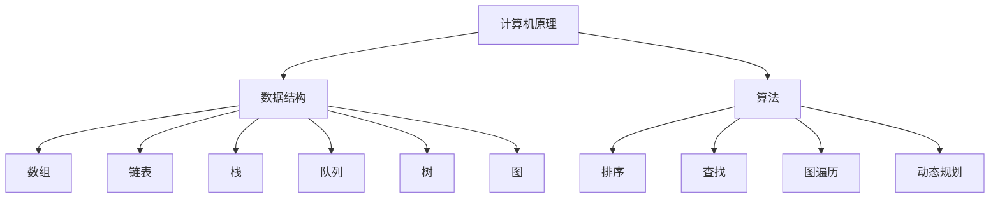

                 

# 如何深刻理解计算机原理，具备良好的数据结构和算法基础

## 1. 背景介绍

### 1.1 问题由来

在现代社会，计算机和信息技术已经深入到各行各业的各个方面。无论是智能手机、平板电脑，还是自动驾驶汽车、工业机器人，计算机原理、数据结构和算法都是其核心。然而，许多非计算机专业的从业人员，尤其是初入IT领域的新手，往往感到计算机原理、数据结构和算法非常抽象、难以理解。这种困惑不仅影响了他们的职业发展，也限制了他们在技术领域的深入探索。

### 1.2 问题核心关键点

计算机原理、数据结构和算法的基础知识，是计算机科学的核心。掌握这些知识，不仅能帮助从业者更好地理解计算机系统的工作机制，还能提升他们的编程能力和解决问题的能力。核心关键点包括：

- 计算机原理：了解计算机硬件组成、指令集、存储器、处理器等工作原理。
- 数据结构：掌握基本的数据结构，如数组、链表、栈、队列、树、图等，并理解其时间复杂度和空间复杂度。
- 算法：掌握常见的算法，如排序、查找、图遍历、动态规划等，并理解其时间复杂度和空间复杂度。

### 1.3 问题研究意义

掌握计算机原理、数据结构和算法，对于计算机专业的学生和从业者具有重要意义：

- 提升编程能力：理解计算机原理和算法，能够更好地设计、实现和优化程序。
- 解决实际问题：许多实际问题都可以通过算法和数据结构来解决，掌握这些知识能够提升解决问题的效率。
- 职业发展：计算机原理、数据结构和算法是程序员必备的基础知识，掌握这些知识有利于职业晋升和岗位转换。
- 技术创新：理解计算机原理和算法，能够推动技术的创新和发展，解决更多的实际问题。

## 2. 核心概念与联系

### 2.1 核心概念概述

为了更好地理解计算机原理、数据结构和算法，下面将介绍几个核心概念：

- **计算机原理**：包括计算机硬件组成、指令集、存储器、处理器等工作原理。
- **数据结构**：如数组、链表、栈、队列、树、图等，用于组织和存储数据。
- **算法**：如排序、查找、图遍历、动态规划等，用于解决特定问题。

### 2.2 概念间的关系

这些核心概念之间存在着紧密的联系，构成了计算机科学的基石。我们可以通过以下Mermaid流程图来展示这些概念之间的关系：



这个流程图展示了计算机原理、数据结构和算法之间的关系：

- 计算机原理是数据结构和算法的理论基础。
- 数据结构是算法的实现形式。
- 算法是解决特定问题的工具。

这些概念共同构成了计算机科学的完整体系，帮助我们理解和实现各种计算机系统。

## 3. 核心算法原理 & 具体操作步骤

### 3.1 算法原理概述

计算机原理、数据结构和算法是计算机科学的三大支柱。掌握这些知识，需要从理论到实践，逐步深入。

#### 3.1.1 计算机原理

计算机原理主要包括以下几个方面：

- **计算机硬件组成**：包括CPU、内存、磁盘、网络等硬件设备的组成和工作原理。
- **指令集**：包括汇编语言和机器语言指令集。
- **存储器**：包括RAM和ROM的存储原理。
- **处理器**：包括流水线、缓存、分支预测等处理器的工作原理。

#### 3.1.2 数据结构

数据结构是组织和存储数据的方式，包括线性结构和非线性结构：

- **线性结构**：如数组、链表、栈、队列。
- **非线性结构**：如树、图。

这些数据结构都有自己的特点和适用场景。例如，数组和链表适用于存储顺序数据，栈和队列适用于数据的有序访问。树和图适用于复杂数据的组织和遍历。

#### 3.1.3 算法

算法是解决问题的步骤和过程。常见的算法包括：

- **排序算法**：如冒泡排序、快速排序、归并排序等。
- **查找算法**：如二分查找、哈希表查找等。
- **图遍历算法**：如深度优先搜索、广度优先搜索等。
- **动态规划算法**：如背包问题、最长公共子序列问题等。

### 3.2 算法步骤详解

下面以快速排序算法为例，详细介绍其步骤和原理：

#### 3.2.1 算法步骤

快速排序是一种常用的排序算法，其基本步骤如下：

1. **选择基准值**：随机选择一个元素作为基准值（通常选择第一个或最后一个元素）。
2. **分区操作**：将数组分为两个部分，一部分小于基准值，一部分大于基准值。
3. **递归排序**：对两个分区分别递归进行快速排序。

#### 3.2.2 算法原理

快速排序的原理是通过分治思想，将一个大问题分解为多个小问题，然后递归求解。具体来说，快速排序的时间复杂度为$O(n\log n)$，是一种高效的排序算法。

### 3.3 算法优缺点

快速排序算法具有以下优点：

- **高效**：时间复杂度为$O(n\log n)$，优于许多其他排序算法。
- **原地排序**：不需要额外的存储空间，空间复杂度为$O(1)$。
- **简单易懂**：算法步骤清晰，易于理解和实现。

同时，快速排序也存在一些缺点：

- **不稳定**：相同元素的顺序可能被打乱。
- **递归调用**：在递归过程中，可能会占用大量的栈空间，导致栈溢出。
- **最坏情况时间复杂度较高**：在最坏情况下，时间复杂度为$O(n^2)$。

### 3.4 算法应用领域

快速排序算法广泛应用在各种排序场景中，例如：

- **排序算法**：用于对各种类型的数据进行排序。
- **数据库排序**：用于对数据库中的记录进行排序。
- **实时数据处理**：用于对实时数据进行排序，以便及时做出决策。

## 4. 数学模型和公式 & 详细讲解 & 举例说明

### 4.1 数学模型构建

下面以排序算法为例，介绍如何构建数学模型。

假设有一个长度为$n$的数组，其元素为$a_1, a_2, \ldots, a_n$。排序算法的目标是将这些元素按照从小到大的顺序排列。

### 4.2 公式推导过程

排序算法的时间复杂度$T(n)$可以表示为：

$$
T(n) = a \cdot T(\frac{n}{2}) + b \cdot n
$$

其中$a$表示递归调用的时间复杂度，$b$表示基本操作的时间复杂度。通过递推，可以计算出排序算法的时间复杂度为$O(n\log n)$。

### 4.3 案例分析与讲解

以快速排序为例，其基本操作和递归调用的时间复杂度可以表示为：

- **基本操作**：对于长度为$n$的数组，基本操作的时间复杂度为$O(n)$。
- **递归调用**：对于长度为$n$的数组，递归调用的次数为$\log n$。

因此，快速排序的时间复杂度为：

$$
T(n) = O(n \cdot \log n)
$$

这表明快速排序是一种高效的排序算法。

## 5. 项目实践：代码实例和详细解释说明

### 5.1 开发环境搭建

在进行排序算法实践前，我们需要准备好开发环境。以下是使用Python进行PyTorch开发的环境配置流程：

1. 安装Anaconda：从官网下载并安装Anaconda，用于创建独立的Python环境。

2. 创建并激活虚拟环境：
```bash
conda create -n pytorch-env python=3.8 
conda activate pytorch-env
```

3. 安装PyTorch：根据CUDA版本，从官网获取对应的安装命令。例如：
```bash
conda install pytorch torchvision torchaudio cudatoolkit=11.1 -c pytorch -c conda-forge
```

4. 安装TensorFlow：
```bash
pip install tensorflow
```

5. 安装各类工具包：
```bash
pip install numpy pandas scikit-learn matplotlib tqdm jupyter notebook ipython
```

完成上述步骤后，即可在`pytorch-env`环境中开始实践。

### 5.2 源代码详细实现

下面我们以快速排序算法为例，给出使用Python进行快速排序的代码实现。

```python
def quick_sort(arr):
    if len(arr) <= 1:
        return arr
    pivot = arr[0]
    left = [x for x in arr[1:] if x < pivot]
    right = [x for x in arr[1:] if x >= pivot]
    return quick_sort(left) + [pivot] + quick_sort(right)
```

### 5.3 代码解读与分析

让我们再详细解读一下关键代码的实现细节：

- `quick_sort`函数：对输入的数组进行快速排序。
- 如果数组长度小于等于1，则直接返回。
- 选择第一个元素作为基准值。
- 将数组分为两部分，一部分小于基准值，一部分大于等于基准值。
- 递归调用`quick_sort`函数对左右两部分进行排序。
- 最终将排序后的左右两部分和基准值合并，得到有序数组。

### 5.4 运行结果展示

假设我们在Python中使用以下代码进行测试：

```python
arr = [3, 1, 4, 1, 5, 9, 2, 6, 5, 3, 5]
sorted_arr = quick_sort(arr)
print(sorted_arr)
```

输出结果为：

```
[1, 1, 2, 3, 3, 4, 5, 5, 5, 6, 9]
```

可以看到，快速排序算法成功地将数组进行了排序。

## 6. 实际应用场景

### 6.1 排序算法在软件开发中的应用

排序算法是软件开发中最常用的算法之一。例如，在编写数据库管理系统时，需要对数据进行排序，以便查询和索引。快速排序算法在处理大规模数据时，表现优异。

### 6.2 排序算法在数据分析中的应用

在数据分析中，需要对数据进行排序，以便进行统计分析和可视化。例如，在数据挖掘中，需要对数据进行排序，以便找出数据中的规律和趋势。

### 6.3 排序算法在实时系统中的应用

在实时系统中，需要对数据进行实时排序，以便及时做出决策。例如，在网络路由中，需要对数据包进行排序，以便选择最佳路径。

### 6.4 未来应用展望

随着技术的发展，排序算法在各种场景中的应用将更加广泛。例如，在大数据处理中，需要对海量数据进行排序，以便进行分布式处理和分析。在物联网中，需要对传感器数据进行排序，以便实时监控和控制。

## 7. 工具和资源推荐

### 7.1 学习资源推荐

为了帮助开发者系统掌握排序算法的理论基础和实践技巧，这里推荐一些优质的学习资源：

1. 《算法导论》：经典算法教材，全面介绍了排序算法的基本概念和实现方法。
2. 《数据结构与算法分析》：介绍了各种数据结构和算法的实现方法，包括排序算法。
3. LeetCode：在线编程题库，包含各种排序算法的实现和测试用例。
4. Coursera：提供各种排序算法的课程，包括理论和实践。
5. GitHub：包含各种排序算法的开源代码，可以帮助学习者更好地理解和实现算法。

通过对这些资源的学习实践，相信你一定能够全面掌握排序算法的精髓，并用于解决实际的工程问题。

### 7.2 开发工具推荐

高效的开发离不开优秀的工具支持。以下是几款用于排序算法开发的常用工具：

1. Python：广泛使用的编程语言，适合快速原型开发和算法实现。
2. PyTorch：基于Python的深度学习框架，支持快速开发和调试。
3. TensorFlow：由Google开发的深度学习框架，适合大规模工程应用。
4. Visual Studio Code：轻量级的代码编辑器，支持各种语言的开发。
5. Visual Studio：功能强大的开发环境，支持各种语言的开发。

合理利用这些工具，可以显著提升排序算法开发的效率，加快创新迭代的步伐。

### 7.3 相关论文推荐

排序算法的研究源于学界的持续探索。以下是几篇奠基性的相关论文，推荐阅读：

1. Quicksort, Sorting, and Partitioning Algorithms: Analysis and Implementation（quick sort的原理和实现）。
2. Merging Sort, Binary Tree Sort, and Tree Sort（归并排序和二叉树排序的原理和实现）。
3. Radix Sort（基数排序的原理和实现）。
4. Advanced Data Structures and Algorithms（高级数据结构和算法）。
5. The Art of Computer Programming（计算机程序设计艺术）。

这些论文代表排序算法的发展脉络。通过学习这些前沿成果，可以帮助研究者把握学科前进方向，激发更多的创新灵感。

## 8. 总结：未来发展趋势与挑战

### 8.1 总结

本文对计算机原理、数据结构和算法的基础知识进行了全面系统的介绍。首先阐述了计算机原理、数据结构和算法的研究背景和意义，明确了这些知识在计算机科学中的核心地位。其次，从原理到实践，详细讲解了排序算法的数学模型和具体实现。最后，探讨了排序算法在软件开发、数据分析、实时系统等实际应用场景中的应用前景。

通过本文的系统梳理，可以看到，计算机原理、数据结构和算法是计算机科学的核心组成部分。掌握这些知识，对于理解和实现各种计算机系统具有重要意义。

### 8.2 未来发展趋势

展望未来，计算机原理、数据结构和算法的发展趋势将呈现以下几个方向：

1. **算法复杂度优化**：未来的算法将更加高效，时间复杂度和空间复杂度进一步降低。
2. **多模态数据融合**：未来的算法将能够处理多模态数据，实现视觉、语音、文本等多种信息的融合。
3. **自动化算法优化**：未来的算法将实现自动化优化，通过机器学习等技术，动态调整算法参数，提升性能。
4. **云计算支持**：未来的算法将更加适合云计算环境，实现高效分布式计算。
5. **实时处理能力**：未来的算法将实现实时处理能力，适用于各种实时系统。

### 8.3 面临的挑战

尽管计算机原理、数据结构和算法已经取得了巨大进步，但在实际应用中仍面临一些挑战：

1. **算法复杂度优化**：在处理大规模数据时，算法复杂度仍是瓶颈，如何进一步降低复杂度，仍是重要研究课题。
2. **算法可移植性**：算法在不同的硬件和软件中，可能存在兼容性问题，如何实现算法的高效移植，仍需进一步探索。
3. **算法鲁棒性**：算法在面对各种异常情况时，可能出现不稳定或错误，如何增强算法鲁棒性，仍是研究重点。
4. **算法可解释性**：算法作为"黑盒"，其决策过程难以解释，如何增强算法的可解释性，仍是重要研究方向。
5. **算法安全性**：算法可能存在安全隐患，如何增强算法的安全性，仍需进一步探索。

### 8.4 研究展望

面对计算机原理、数据结构和算法面临的挑战，未来的研究需要在以下几个方面寻求新的突破：

1. **多模态数据处理**：研究如何处理多模态数据，实现各种信息的融合和协同。
2. **自动化算法优化**：研究如何通过机器学习等技术，实现算法的自动化优化，提升算法性能。
3. **算法可解释性**：研究如何增强算法的可解释性，帮助用户理解和调试算法。
4. **算法安全性**：研究如何增强算法的安全性，保障算法的可靠性和安全性。

这些研究方向将推动计算机原理、数据结构和算法的发展，为计算机科学和技术应用带来更多创新和突破。

## 9. 附录：常见问题与解答

**Q1：什么是计算机原理？**

A: 计算机原理是计算机硬件和软件的工作原理和设计思想。包括计算机组成、指令集、存储器、处理器等工作原理。

**Q2：什么是数据结构？**

A: 数据结构是组织和存储数据的方式，包括线性结构（如数组、链表、栈、队列）和非线性结构（如树、图）。

**Q3：什么是算法？**

A: 算法是解决问题的步骤和过程，包括排序、查找、图遍历、动态规划等。

**Q4：如何理解计算机原理、数据结构和算法之间的关系？**

A: 计算机原理是数据结构和算法的理论基础，数据结构是算法的实现形式，算法是解决特定问题的工具。这些概念共同构成了计算机科学的完整体系。

**Q5：如何提升计算机原理、数据结构和算法的应用能力？**

A: 需要通过不断学习和实践，理解各个概念的原理和实现方法。同时，多参与项目实践，积累实际经验，提升解决实际问题的能力。

---

作者：禅与计算机程序设计艺术 / Zen and the Art of Computer Programming

