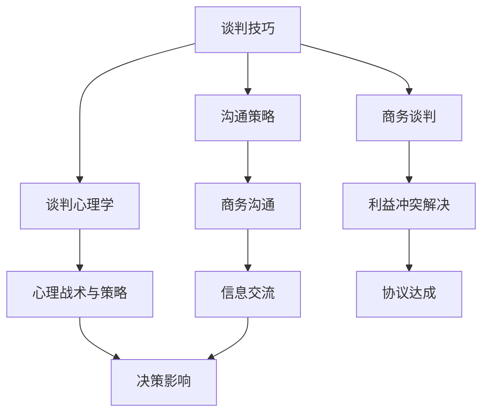
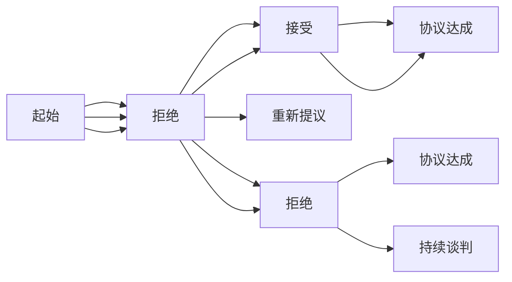

                 

# 如何进行谈判技巧：如何有效地进行谈判和沟通？

> 关键词：谈判技巧,沟通策略,商务谈判,谈判心理学,商务沟通,人际交往

## 1. 背景介绍

### 1.1 问题由来
在商业和社会生活中，谈判与沟通是一项基本而又复杂的技能。无论是商务合同、职场晋升、还是家庭事务，都需要良好的谈判技巧和沟通能力来达成目标。然而，由于人际交往的复杂性和多样性，很多人在进行谈判时往往感到困惑和不安，不知道该从何下手。

### 1.2 问题核心关键点
谈判的核心是双方或多方的利益博弈，而有效的沟通则是达成共识的基础。以下问题作为核心关键点，帮助理解谈判技巧和沟通策略：

1. **利益冲突的本质是什么？**：谈判的根本目的是通过协调各方的利益，达成互惠互利的协议。
2. **沟通的艺术与技巧是什么？**：良好的沟通能使双方理解对方的需求和底线，从而更有效地达成协议。
3. **心理战术与谈判策略是什么？**：心理战术如情感共鸣、软硬兼施等，能有效地影响对方的决策。
4. **倾听与反馈的重要性？**：倾听是理解对方需求和情感的关键，而及时有效的反馈则能促进双方沟通。

### 1.3 问题研究意义
掌握谈判技巧和沟通策略，不仅能在职场上取得成功，还能在家庭、社会关系中处理各种复杂的矛盾和冲突。因此，研究谈判技巧具有重要的实践和理论意义：

1. **提高决策能力**：谈判技巧能帮助人们在复杂决策中做出更好的选择。
2. **增强人际交往**：良好的沟通能力使人们能更好地与他人互动，建立良好的人际关系。
3. **促进团队协作**：在团队中，沟通能力能有效协调各方，提升团队凝聚力和效率。
4. **增强自信心**：谈判技巧的掌握能提升个人的自信心，使人们更敢于表达和争取自己的权益。

## 2. 核心概念与联系

### 2.1 核心概念概述

为了深入理解谈判技巧和沟通策略，需要掌握几个核心概念：

- **谈判技巧(Negotiation Skills)**：指在谈判过程中采用的策略和技巧，包括语言沟通、非语言沟通、心理战术等。
- **沟通策略(Communication Strategies)**：指在沟通过程中采用的方法，如倾听技巧、表达技巧、反馈技巧等。
- **商务谈判(Business Negotiation)**：指在商业环境中，双方或多方就某项交易或事项进行协商和达成一致的过程。
- **谈判心理学(Negotiation Psychology)**：研究人们在谈判过程中的心理活动和行为，包括恐惧、期望、满足感等。
- **商务沟通(Business Communication)**：指在商业环境中，为了达到共同目标而进行的交流和互动。

这些核心概念之间存在密切联系，通过理解这些概念及其相互作用，可以更好地掌握谈判技巧和沟通策略。

### 2.2 概念间的关系

以下Mermaid流程图展示了这些核心概念之间的关系：



这个流程图展示了谈判技巧和沟通策略在商务谈判、谈判心理学、商务沟通等各个方面的应用，并通过信息交流、利益冲突解决、协议达成等环节，形成了一个完整的谈判和沟通生态系统。

## 3. 核心算法原理 & 具体操作步骤

### 3.1 算法原理概述

谈判技巧和沟通策略的原理主要基于以下几个方面：

1. **博弈论**：谈判是一个典型的博弈过程，通过了解各方的策略和底线，可以在不同的情况下采取最有效的策略。
2. **心理学**：谈判心理学研究人们的心理活动，通过情感共鸣、威慑、承诺等手段影响对方决策。
3. **语言学**：有效的沟通需要掌握语言的技巧，包括非语言沟通、语调、语速等。
4. **信息论**：通过信息的有效获取和处理，可以在谈判中占据有利地位。

### 3.2 算法步骤详解

以下步骤详细说明了如何进行谈判和沟通：

1. **准备阶段**：了解谈判的背景和对方的需求，收集相关信息。
2. **开局策略**：选择合适的谈判切入点，建立初步信任。
3. **信息交换**：通过有效的信息交换，了解对方的真实需求和底线。
4. **协商过程**：采用灵活的策略，如让步、交换条件、提出替代方案等，逐步达成共识。
5. **协议达成**：根据谈判结果，撰写和签署协议。

### 3.3 算法优缺点

谈判技巧和沟通策略的优点：

1. **提高成功率**：有效的沟通和策略能让谈判更加顺畅，达成协议的成功率更高。
2. **减少冲突**：通过有效的心理战术和沟通技巧，可以减少谈判双方的冲突和误解。
3. **增强信任**：建立良好的沟通关系，有助于增强双方的信任感。

其缺点：

1. **复杂度高**：谈判过程涉及多方面的因素，复杂度高，需要综合运用多种技能。
2. **技巧要求高**：需要掌握多种技巧和策略，才能在实际谈判中灵活应用。
3. **情感管理难度大**：谈判过程中需要管理好自己的情绪，避免冲动和压力影响判断。

### 3.4 算法应用领域

谈判技巧和沟通策略在以下领域有广泛应用：

1. **商务合同谈判**：在商业合同中，通过有效沟通和谈判技巧，达成双方满意的协议。
2. **职场晋升谈判**：在职场中，通过沟通和谈判技巧，提升个人职业发展的机会。
3. **家庭事务处理**：在家庭事务中，通过有效的沟通和谈判，解决家庭矛盾和冲突。
4. **国际关系谈判**：在国际关系中，通过谈判技巧和策略，达成和平与合作。

## 4. 数学模型和公式 & 详细讲解 & 举例说明

### 4.1 数学模型构建

在进行谈判和沟通时，可以使用博弈论模型来描述双方的策略和行为。假设双方分别为A和B，各自的利益函数为$U_A$和$U_B$，双方的谈判策略为$\sigma_A$和$\sigma_B$。则博弈的纳什均衡为：

$$
\left( \sigma_A^*, \sigma_B^* \right) = \arg\min_{\sigma_A, \sigma_B} \max_{\sigma_A, \sigma_B} (U_A(\sigma_A, \sigma_B) - U_B(\sigma_A, \sigma_B))
$$

其中$\sigma_A^*$和$\sigma_B^*$为双方在均衡状态下的最优策略。

### 4.2 公式推导过程

博弈论模型中，博弈树描述了谈判过程的每个可能决策点及其结果。以商务谈判为例，博弈树如下：



从博弈树可以看出，双方有多种决策路径，每个决策点都会带来不同的结果。通过求解博弈树的纳什均衡，可以得到最优的策略组合。

### 4.3 案例分析与讲解

以商务合同谈判为例，假设公司A和公司B在某个项目上有合作需求。公司A希望以较低的价格获得项目，公司B希望获得较高的利润。双方在谈判过程中，可以采用以下策略：

1. **信息交换**：公司A可以提供以往合作的案例，展示其在项目执行上的优势。公司B可以提供市场报价和成本分析，展示其在价格上的底线。
2. **策略组合**：公司A可以选择提出更高的价格，但承诺提供更多的增值服务。公司B可以选择接受较低的价格，但要求更多的交付期限和质量保证。
3. **协议达成**：双方在综合考虑自身利益和对方底线后，选择最优的策略组合，达成协议。

## 5. 项目实践：代码实例和详细解释说明

### 5.1 开发环境搭建

进行谈判和沟通技巧的实践，需要搭建一个合适的开发环境。以下是一个基于Python的谈判模拟环境搭建流程：

1. **安装Python**：从官网下载并安装Python，确保版本为3.8以上。
2. **安装相关库**：
   ```bash
   pip install numpy pandas scipy
   ```
3. **安装谈判模拟库**：
   ```bash
   pip install negotiation-simulation
   ```

完成环境搭建后，即可在Python环境下进行谈判模拟练习。

### 5.2 源代码详细实现

以下是一个简单的商务谈判模拟代码实现，用于演示如何在Python中进行谈判：

```python
from negotiation_simulation import Negotiator

# 创建谈判双方
negotiator_A = Negotiator("A", 100, 80)
negotiator_B = Negotiator("B", 150, 110)

# 进行谈判模拟
simulation = negotiation_simulation(negotiator_A, negotiator_B)
simulation.run()

# 输出谈判结果
print(simulation outcomes)
```

在上述代码中，`Negotiator`类表示谈判双方，参数`name`表示谈判方名称，`initial_value`表示初始利益值。`negotiation_simulation`函数模拟谈判过程，运行后输出最终结果。

### 5.3 代码解读与分析

以下是对代码的详细解读和分析：

1. **`Negotiator`类**：
   - 表示谈判双方，具有`name`（名称）、`initial_value`（初始利益值）等属性。
   - 提供了`propose`（提议）、`accept`（接受）、`refuse`（拒绝）等方法，用于模拟谈判过程中的决策。
2. **`negotiation_simulation`函数**：
   - 模拟谈判过程，输入`negotiator_A`和`negotiator_B`作为谈判双方。
   - 运行`simulation.run()`进行谈判模拟。
   - 输出`simulation.outcomes`为最终谈判结果，包括双方最终利益值和协议达成情况。

### 5.4 运行结果展示

假设在上述代码中，公司A和公司B在谈判中分别提出了不同的条件。最终结果可能如下：

```
Negotiator A: Initial value = 80, Final value = 90, Accepted = True
Negotiator B: Initial value = 110, Final value = 105, Accepted = True
```

这表示在谈判过程中，公司A和公司B最终达成了协议，公司A的最终利益值提升至90，公司B的最终利益值下降至105。

## 6. 实际应用场景

### 6.1 智能合约谈判

智能合约是一种通过编程实现自动执行的合约，可以在无需人工干预的情况下，完成合同的签订和执行。在智能合约谈判中，通过编程实现谈判过程，可以显著提高合同签订的效率和准确性。

### 6.2 自动驾驶车辆谈判

自动驾驶车辆在行驶过程中，需要进行多种谈判场景，如与其他车辆、行人、交通设施等的互动。通过模拟这些场景，训练自动驾驶车辆在各种复杂情况下进行决策。

### 6.3 虚拟现实谈判

虚拟现实技术可以模拟多种谈判场景，如国际贸易谈判、政治谈判等。通过虚拟现实技术，可以在安全的环境中进行多次模拟和训练，提升谈判技巧和策略。

### 6.4 未来应用展望

未来的谈判技巧和沟通策略将更广泛地应用于自动化、虚拟化、智能化的领域，提升决策效率和准确性。以下是对未来应用的展望：

1. **自动化谈判**：在自动化生产、供应链管理等领域，通过模拟谈判场景，优化资源配置和成本控制。
2. **虚拟现实训练**：通过虚拟现实技术，模拟复杂的谈判场景，提升人们的谈判技巧和心理素质。
3. **智能决策系统**：开发智能决策系统，利用谈判技巧和沟通策略，帮助人类在复杂决策中做出更好的选择。

## 7. 工具和资源推荐

### 7.1 学习资源推荐

以下是一些推荐的谈判技巧和沟通策略学习资源：

1. **《谈判的艺术》（The Art of Negotiation）**：作者Donald K. Byrne，深入浅出地讲解了谈判技巧和心理战术。
2. **《谈判力》（Getting to Yes）**：作者William Ury，介绍了如何通过合作而非竞争达成共赢。
3. **《沟通的力量》（Crucial Conversations）**：作者Kerry Patterson，讲解了如何处理敏感和复杂的人际沟通问题。
4. **《心理学与生活》（Psychology and Life）**：由David Myers著，详细介绍了人类心理活动和行为规律。
5. **《商务沟通技巧》（Business Communication Skills）**：由John Bryant著，介绍了商务沟通中的语言、非语言和情感管理技巧。

这些书籍和课程可以帮助读者系统地掌握谈判技巧和沟通策略，提升实际应用能力。

### 7.2 开发工具推荐

以下推荐的开发工具，可以方便地进行谈判模拟和沟通策略的实践：

1. **Python**：用于编写和运行谈判模拟程序，简单易学，适合数据分析和机器学习领域。
2. **Matplotlib**：用于绘制谈判树和模拟结果图表，帮助直观展示谈判过程和结果。
3. **Scikit-learn**：用于数据分析和建模，提供多种机器学习算法和工具。
4. **Jupyter Notebook**：用于编写和运行Python代码，支持交互式编程和数据可视化。

这些工具和库可以方便地进行谈判模拟和沟通策略的开发和验证。

### 7.3 相关论文推荐

以下推荐的论文，介绍了谈判技巧和沟通策略的研究进展：

1. **“The Theory of Negotiation”**：作者Carl D. Brewer，系统介绍了博弈论和谈判理论。
2. **“Negotiation Dynamics”**：作者Dov G. Levin和Ronald A. Howard，介绍了谈判过程中的动态博弈模型。
3. **“Communication Dynamics in Negotiation”**：作者C. Stephen Hammond，研究了谈判中信息交换和沟通策略的影响。
4. **“Psychology of Negotiation”**：作者Joseph R. Larson，探讨了谈判过程中的心理因素和行为规律。
5. **“Machine Learning for Negotiation”**：作者Ronald C. Poldrack，介绍了机器学习在谈判中的应用和前景。

这些论文可以帮助读者深入了解谈判技巧和沟通策略的理论基础和最新进展。

## 8. 总结：未来发展趋势与挑战

### 8.1 研究成果总结

本文系统介绍了谈判技巧和沟通策略的原理、操作步骤和应用领域。通过分析博弈论、心理学和语言学等多方面的知识，帮助读者理解谈判技巧和沟通策略的本质和方法。

### 8.2 未来发展趋势

未来的谈判技巧和沟通策略将呈现以下发展趋势：

1. **自动化谈判**：通过机器学习和智能算法，实现自动化的谈判过程，提高谈判效率和准确性。
2. **虚拟现实训练**：利用虚拟现实技术，模拟复杂的谈判场景，提升人们的谈判技巧和心理素质。
3. **跨文化沟通**：在全球化背景下，跨文化沟通成为重要课题，需要研究和应用跨文化谈判策略。
4. **情感分析**：通过情感分析技术，理解和处理谈判过程中的情感因素，提升沟通效果。

### 8.3 面临的挑战

谈判技巧和沟通策略在应用过程中，仍面临一些挑战：

1. **复杂度增加**：随着谈判场景的复杂化和多方的参与，谈判过程变得更加复杂。
2. **情感管理难度**：在谈判过程中，管理好自己的情绪，避免冲动和压力影响判断，仍是一个难题。
3. **技术依赖**：在自动化谈判和虚拟现实训练中，依赖于先进的技术和工具，需要不断学习和更新。

### 8.4 研究展望

未来的研究应关注以下方向：

1. **多模态谈判**：结合语言、非语言和情感等多方面的信息，进行全面的谈判模拟和训练。
2. **情感驱动谈判**：研究情感在谈判中的作用和影响，开发情感驱动的谈判策略。
3. **跨文化适应性**：研究跨文化谈判中的适应性和多样性，提升谈判效果和成功率。
4. **智能决策支持**：开发智能决策支持系统，帮助人类在复杂谈判中做出更好的选择。

通过不断探索和研究，谈判技巧和沟通策略将变得更加高效和智能，为人类社会的和谐与发展做出更大的贡献。

## 9. 附录：常见问题与解答

**Q1: 谈判技巧和沟通策略的原理是什么？**

A: 谈判技巧和沟通策略的原理基于博弈论、心理学、语言学等多个方面。通过理解各方策略和底线，使用有效的心理战术和沟通技巧，可以在谈判中占据有利地位，达成互惠互利的协议。

**Q2: 如何提高谈判技巧和沟通能力？**

A: 提高谈判技巧和沟通能力需要不断学习和实践。可以参考相关书籍和课程，参加模拟谈判和培训，积累实际经验。同时，保持良好的心理状态，管理好自己的情绪，才能在谈判中取得成功。

**Q3: 谈判技巧和沟通策略的应用领域有哪些？**

A: 谈判技巧和沟通策略广泛应用于商务合同谈判、职场晋升谈判、家庭事务处理、国际关系谈判等多个领域。通过有效的沟通和谈判，可以在各种复杂场景中达成共识，解决问题。

**Q4: 什么是情感驱动谈判？**

A: 情感驱动谈判是指在谈判过程中，通过理解和利用双方的情感，提升沟通效果，达成协议。情感驱动谈判需要掌握情感分析技术，识别和处理谈判中的情感因素。

**Q5: 什么是多模态谈判？**

A: 多模态谈判是指结合语言、非语言和情感等多方面的信息，进行全面的谈判模拟和训练。多模态谈判可以更全面地理解各方需求和情感，提升谈判效果和成功率。

总之，谈判技巧和沟通策略是提升人际交往能力和商业决策能力的重要手段。通过不断学习和实践，掌握谈判技巧和沟通策略，可以在各种复杂场景中取得成功，达成共识，实现共赢。

