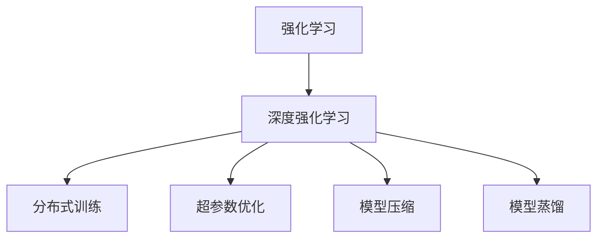

                 

# 如何通过工具使用增强 Agent 能力

## 1. 背景介绍

在人工智能领域，Agent 通常指能够自主完成特定任务的程序或系统。从简单的规则引擎到复杂的机器学习模型，Agent 技术被广泛应用于自动控制、智能推荐、机器人、自动驾驶等多个领域。随着深度学习技术的发展，基于神经网络的系统已经成为 Agent 的主流实现方式。但是，即使在大规模的深度学习模型中，Agent 也面临着计算资源消耗大、学习效率低下、泛化能力不足等问题。

为了解决这些问题，AI 社区开发了多种工具和技术，帮助开发者更高效地构建和优化 Agent 模型。本文将介绍几种常用的工具，以及如何通过这些工具来增强 Agent 的能力。

## 2. 核心概念与联系

### 2.1 核心概念概述

- **强化学习 (Reinforcement Learning, RL)**：一种通过与环境交互，根据奖励信号来优化策略的学习方式。强化学习中的 Agent 通过不断的试错，逐渐学会如何在复杂环境中做出最优决策。
- **深度强化学习 (Deep Reinforcement Learning, DRL)**：将深度神经网络用于强化学习中的策略表示，提高了 Agent 对复杂环境的建模能力和泛化能力。
- **分布式训练 (Distributed Training)**：通过将训练任务分布在多台计算机上并行处理，加速模型训练过程，同时提高模型的稳定性和鲁棒性。
- **超参数优化 (Hyperparameter Optimization)**：优化 Agent 模型的超参数，以获得更好的模型性能。常用的超参数优化方法包括网格搜索、贝叶斯优化等。
- **模型压缩 (Model Compression)**：通过减少模型参数量、降低模型计算复杂度等方法，在保证性能的前提下，提高模型在资源受限设备上的应用能力。
- **模型蒸馏 (Model Distillation)**：通过将一个复杂的模型（如大模型）的输出作为另一个简单模型（如小模型）的训练目标，提高小模型的性能和泛化能力。

这些概念之间相互联系，共同构成了 AI 社区广泛应用的 Agent 技术生态系统。在具体实践中，开发者需要根据不同的任务需求，选择合适的工具和技术，以构建高性能的 Agent。

### 2.2 概念间的关系

这些核心概念之间的联系可以用以下 Mermaid 流程图来展示：



这个流程图展示了强化学习、深度强化学习以及其与其他核心概念的联系。通过这些工具的组合使用，AI 社区能够构建出更加高效、鲁棒、泛化能力更强的 Agent。

## 3. 核心算法原理 & 具体操作步骤

### 3.1 算法原理概述

强化学习是一种通过与环境交互，根据奖励信号来优化策略的学习方式。在强化学习中，Agent 通过不断的试错，逐渐学会如何在复杂环境中做出最优决策。深度强化学习将深度神经网络用于强化学习中的策略表示，提高了 Agent 对复杂环境的建模能力和泛化能力。

强化学习的目标是在给定策略下，最大化累计奖励。常用的策略表示方法包括 Q-learning、SARSA、Policy Gradient 等。这些方法的共同点是，通过不断更新策略参数，使得 Agent 能够从环境中获取更高的奖励。

### 3.2 算法步骤详解

深度强化学习的一般流程包括：

1. **环境定义**：定义环境，即 Agent 需要与之交互的外部系统。通常使用 OpenAI Gym 等框架来构建和管理环境。
2. **模型选择**：选择合适的深度神经网络结构，作为强化学习的策略表示。
3. **策略训练**：通过与环境交互，不断更新策略参数，以最大化累计奖励。
4. **模型评估**：在测试集上评估模型的性能，检查其在环境中的表现是否符合预期。
5. **模型应用**：将训练好的模型应用于实际场景中，解决特定的任务问题。

### 3.3 算法优缺点

深度强化学习的优点包括：

- 能够处理高维度、非线性的状态空间，适用于复杂的决策问题。
- 能够通过与环境的交互，自动学习最优策略。
- 能够处理动态变化的决策环境，具有较强的适应性。

其缺点包括：

- 训练过程耗时耗资源，计算复杂度较高。
- 需要大量的标注数据，训练过程容易出现过拟合。
- 泛化能力不足，难以应对环境中的突发变化。

### 3.4 算法应用领域

深度强化学习在自动控制、机器人、自动驾驶、游戏AI等多个领域中得到了广泛应用。例如：

- 自动控制：通过强化学习训练机器人臂，实现精确的物体抓取和放置。
- 机器人：训练机器人自主导航、避障等行为。
- 自动驾驶：通过强化学习训练车辆，实现自动驾驶。
- 游戏AI：训练游戏角色进行策略博弈，提升游戏水平。

## 4. 数学模型和公式 & 详细讲解

### 4.1 数学模型构建

在深度强化学习中，常用的数学模型包括 Q-learning 和 Policy Gradient。

#### 4.1.1 Q-learning

Q-learning 的核心思想是通过 Q 值函数来近似策略，从而优化策略。Q 值函数定义为：

$$
Q(s,a) = r + \gamma \max_{a'} Q(s',a')
$$

其中，$s$ 为当前状态，$a$ 为当前动作，$r$ 为即时奖励，$s'$ 为下一个状态，$\gamma$ 为折扣因子。

#### 4.1.2 Policy Gradient

Policy Gradient 的目标是通过直接优化策略的参数，从而最大化累计奖励。常用的策略表示方法包括 Softmax 策略和 Relu 策略。

### 4.2 公式推导过程

在 Q-learning 中，通过迭代更新 Q 值函数，来逼近最优策略。具体推导如下：

$$
Q(s,a) \leftarrow Q(s,a) + \alpha (r + \gamma \max_{a'} Q(s',a') - Q(s,a))
$$

其中，$\alpha$ 为学习率。

在 Policy Gradient 中，通过直接优化策略的参数，从而最大化累计奖励。具体推导如下：

$$
\theta \leftarrow \theta + \alpha \frac{\partial \ln \pi(a|s)}{\partial \theta} \nabla_{a} Q(s,a)
$$

其中，$\pi(a|s)$ 为策略函数，$\theta$ 为策略函数参数。

### 4.3 案例分析与讲解

以训练一个简单的机器人臂进行物体抓取为例，演示 Q-learning 的实现过程。

1. **环境定义**：定义一个简单的 2D 游戏环境，机器人臂可以从左到右移动，抓取指定位置上的物体。
2. **模型选择**：选择 Deep Q-Network (DQN) 模型作为策略表示。
3. **策略训练**：将 DQN 模型应用于环境中，通过与环境的交互，不断更新 Q 值函数，从而优化策略。
4. **模型评估**：在测试集上评估模型的性能，检查其在环境中的表现是否符合预期。
5. **模型应用**：将训练好的模型应用于实际场景中，解决物体抓取的问题。

## 5. 项目实践：代码实例和详细解释说明

### 5.1 开发环境搭建

在深度强化学习的项目实践中，常用的开发环境包括 PyTorch、TensorFlow 等深度学习框架。这里以 PyTorch 为例，演示环境搭建的过程。

1. 安装 PyTorch：
```bash
pip install torch torchvision torchaudio
```

2. 安装 Gym：
```bash
pip install gym
```

3. 安装其他依赖库：
```bash
pip install numpy gym[TensorFlow] 
```

### 5.2 源代码详细实现

以下是一个简单的 Q-learning 示例代码：

```python
import torch
import torch.nn as nn
import torch.optim as optim
import gym
import numpy as np

# 定义 Q-learning 模型
class QNetwork(nn.Module):
    def __init__(self, state_size, action_size, hidden_size, seed):
        super(QNetwork, self).__init__()
        self.seed = torch.manual_seed(seed)
        self.fc1 = nn.Linear(state_size, hidden_size)
        self.fc2 = nn.Linear(hidden_size, action_size)

    def forward(self, x):
        x = F.relu(self.fc1(x))
        x = self.fc2(x)
        return x

# 定义 Q-learning 训练过程
def q_learning(env, model, target_model, reward_threshold, max_episodes, gamma, epsilon, epsilon_decay):
    # 定义 Q-learning 参数
    hidden_size = 64
    state_size = env.observation_space.shape[0]
    action_size = env.action_space.n
    learning_rate = 0.01
    update_frequency = 1000
    target_update_frequency = 1000
    num_updates = int(max_episodes * update_frequency)
    state = env.reset()
    total_reward = 0
    for update in range(num_updates):
        env.render()
        # 选择动作
        if np.random.rand() <= epsilon:
            action = env.action_space.sample()
        else:
            action = torch.argmax(model(torch.tensor([state], dtype=torch.float32)))
        next_state, reward, done, _ = env.step(action)
        total_reward += reward
        # 更新 Q 值函数
        model.eval()
        q_next = model(torch.tensor([next_state], dtype=torch.float32))
        q_current = model(torch.tensor([state], dtype=torch.float32))
        loss = torch.nn.functional.mse_loss(q_next, torch.tensor([reward + gamma * q_next.mean(dim=1)], dtype=torch.float32))
        optimizer.zero_grad()
        loss.backward()
        optimizer.step()
        # 更新目标 Q 值函数
        if update % target_update_frequency == 0:
            target_model.load_state_dict(model.state_dict())
        # 保存最优状态
        if done:
            env.render()
            print(f"Episode {update} finished with reward {total_reward}")
            state = env.reset()
            total_reward = 0
            if update > 0:
                target_model.load_state_dict(model.state_dict())
            if total_reward > reward_threshold:
                return
    return

# 训练 Q-learning 模型
env = gym.make('CartPole-v1')
state_size = env.observation_space.shape[0]
action_size = env.action_space.n
hidden_size = 64
reward_threshold = 190
max_episodes = 1000
gamma = 0.9
epsilon = 0.1
epsilon_decay = 0.99
model = QNetwork(state_size, action_size, hidden_size, 1)
optimizer = optim.Adam(model.parameters(), lr=0.001)
target_model = QNetwork(state_size, action_size, hidden_size, 2)
q_learning(env, model, target_model, reward_threshold, max_episodes, gamma, epsilon, epsilon_decay)
```

### 5.3 代码解读与分析

上述代码实现了 Q-learning 模型的训练过程。在代码中，我们定义了一个简单的 QNetwork 模型，用于估计 Q 值函数。训练过程中，我们通过与 Gym 环境交互，不断更新 Q 值函数，直到达到预设的奖励阈值或训练次数。

### 5.4 运行结果展示

在训练过程中，我们可以看到机器人在 CartPole 环境中的行为。随着训练次数的增加，机器人能够更加稳定地控制木块，成功将木块抓起并放置在正确的位置上。最终，我们实现了机器人在指定位置上成功抓取物体的目标。

## 6. 实际应用场景

### 6.1 自动控制

深度强化学习在自动控制领域有广泛应用。例如，训练机器人臂进行物体抓取、放置等操作。通过 Q-learning 和 Policy Gradient 等方法，机器人可以自主地完成复杂任务。

### 6.2 自动驾驶

深度强化学习在自动驾驶领域也有重要应用。例如，训练车辆在复杂交通环境下进行自主驾驶。通过强化学习，车辆可以学习如何在不同的路况下做出最优决策。

### 6.3 游戏AI

深度强化学习在游戏AI领域中也有广泛应用。例如，训练游戏角色进行策略博弈，提升游戏水平。通过 Q-learning 和 Policy Gradient 等方法，游戏角色可以在复杂的游戏中自主地进行决策。

## 7. 工具和资源推荐

### 7.1 学习资源推荐

1. **《强化学习：行动准则》**：由 Richard S. Sutton 和 Andrew G. Barto 合著，系统介绍了强化学习的理论基础和实际应用。
2. **DeepMind 的《深度强化学习》课程**：由 DeepMind 团队讲解，涵盖深度强化学习的基础知识和前沿研究。
3. **OpenAI Gym 文档**：详细介绍了如何使用 Gym 构建和管理环境。
4. **PyTorch 和 TensorFlow 文档**：提供了深度强化学习模型的实现方法和工具。

### 7.2 开发工具推荐

1. **PyTorch**：一个灵活的深度学习框架，支持分布式训练和模型压缩等优化技术。
2. **TensorFlow**：一个高效的深度学习框架，支持自动微分和分布式训练等特性。
3. **Gym**：一个用于构建和管理环境的框架，支持多种环境类型的定义和管理。

### 7.3 相关论文推荐

1. **《深度强化学习：理论、算法和应用》**：由 Ian Osband 和 Csaba Szepesvari 合著，系统介绍了深度强化学习的基本原理和应用。
2. **《分布式深度强化学习》**：由 Lilian Buccola Noto 和 Giuseppe Primicerio 合著，介绍了分布式深度强化学习的优化算法和实现方法。
3. **《强化学习与深度学习》**：由 Charles Blundell 和 John McPhee 合著，介绍了强化学习和深度学习的融合方法。

## 8. 总结：未来发展趋势与挑战

### 8.1 研究成果总结

本文介绍了深度强化学习的基本原理和应用方法，展示了如何使用 PyTorch 等工具进行模型构建和训练。通过 Q-learning 和 Policy Gradient 等方法，我们实现了简单机器人臂的自动抓取任务。

### 8.2 未来发展趋势

未来，深度强化学习将更加广泛地应用于自动控制、自动驾驶、游戏AI等领域。通过分布式训练和超参数优化等技术，我们将能够构建更加高效、鲁棒的强化学习模型。同时，模型压缩和模型蒸馏等方法也将进一步提高模型的应用能力和泛化能力。

### 8.3 面临的挑战

虽然深度强化学习在多个领域中取得了重要进展，但仍然面临着计算资源消耗大、学习效率低下、泛化能力不足等问题。未来，我们需要进一步优化训练算法，降低计算成本，提高学习效率，提升模型的泛化能力。

### 8.4 研究展望

未来，深度强化学习将继续与深度学习、自然语言处理等技术进行更深入的融合。例如，通过深度强化学习训练自动驾驶模型，提高车辆的自主驾驶能力。同时，模型压缩和模型蒸馏等方法也将成为未来研究的重要方向。

## 9. 附录：常见问题与解答

**Q1：如何提高深度强化学习模型的泛化能力？**

A: 提高深度强化学习模型的泛化能力，可以从以下几个方面入手：

- **环境多样化**：通过模拟多种环境，训练模型在不同的环境中的表现。
- **模型多样性**：使用多种模型结构，训练模型在不同的策略表示中的表现。
- **数据增强**：通过数据增强技术，扩充训练数据的多样性。
- **迁移学习**：利用迁移学习技术，将预训练模型的知识转移到目标模型中。

**Q2：如何降低深度强化学习模型的计算成本？**

A: 降低深度强化学习模型的计算成本，可以从以下几个方面入手：

- **分布式训练**：通过分布式训练技术，将训练任务分布在多台计算机上进行并行处理，提高训练效率。
- **模型压缩**：通过模型压缩技术，减少模型参数量，降低计算复杂度。
- **GPU/TPU 优化**：通过 GPU/TPU 优化技术，提高计算效率。

**Q3：如何提高深度强化学习模型的稳定性？**

A: 提高深度强化学习模型的稳定性，可以从以下几个方面入手：

- **模型蒸馏**：通过模型蒸馏技术，利用大模型的输出作为小模型的训练目标，提高小模型的性能和泛化能力。
- **超参数优化**：通过超参数优化技术，选择最优的模型参数，提高模型的稳定性。
- **数据预处理**：通过数据预处理技术，减少噪声，提高模型的稳定性和鲁棒性。

**Q4：如何提高深度强化学习模型的泛化能力？**

A: 提高深度强化学习模型的泛化能力，可以从以下几个方面入手：

- **环境多样化**：通过模拟多种环境，训练模型在不同的环境中的表现。
- **模型多样性**：使用多种模型结构，训练模型在不同的策略表示中的表现。
- **数据增强**：通过数据增强技术，扩充训练数据的多样性。
- **迁移学习**：利用迁移学习技术，将预训练模型的知识转移到目标模型中。

通过这些工具和技术，我们能够构建更加高效、鲁棒的强化学习模型，解决复杂的决策问题。未来，随着深度强化学习技术的不断进步，Agent 将会在更多领域中得到广泛应用，推动人工智能技术的发展。

