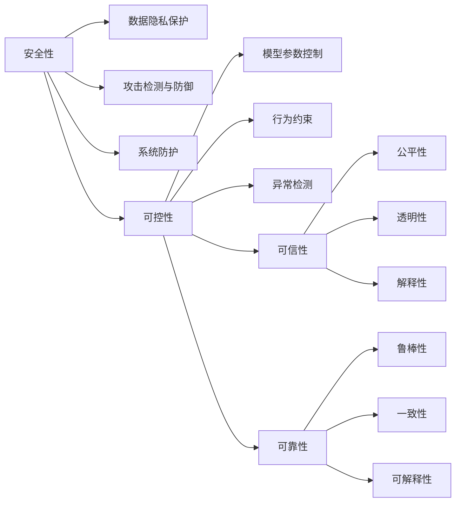
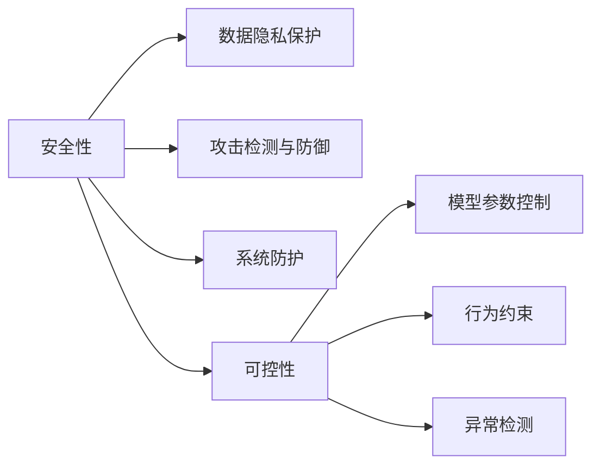
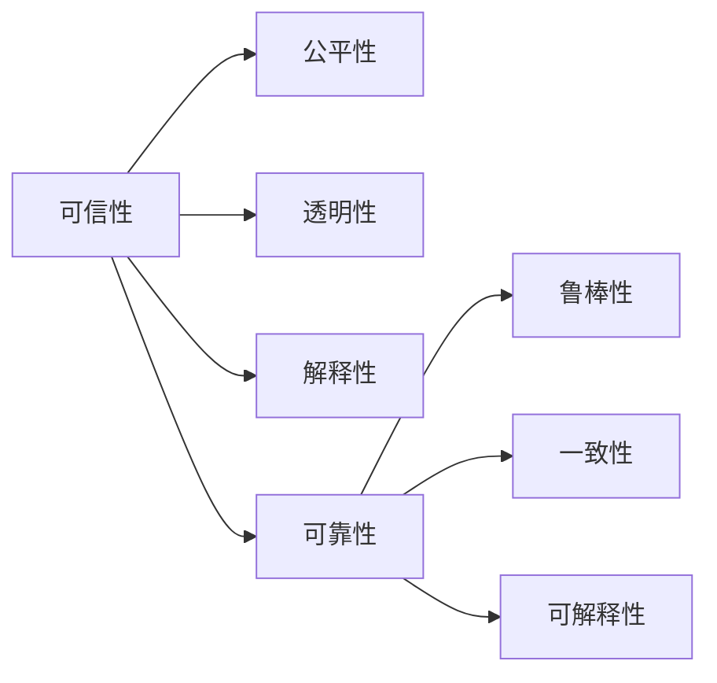
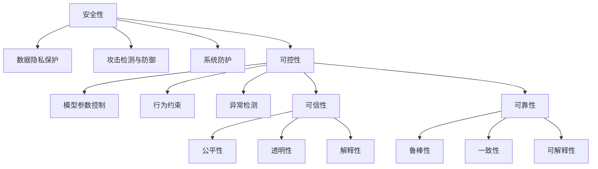

                 

# 安全、可控、可信、可靠的AI技术

> 关键词：人工智能(AI), 安全性, 可控性, 可信性, 可靠性, 自动化, 数据隐私, 伦理道德, 透明性, 持续学习

## 1. 背景介绍

### 1.1 问题由来
随着人工智能(AI)技术的迅猛发展，AI系统在各行各业的应用越来越广泛，从智能客服、无人驾驶、医疗诊断，到金融风险预测、城市管理，AI技术无处不在。然而，与此同时，AI技术也面临着越来越多的安全、伦理和可控性问题，这些问题不仅关乎技术的可持续发展，也直接影响着社会稳定和公众信任。

1. **安全问题**：AI系统可能被黑客攻击，导致数据泄露、系统瘫痪等问题。
2. **伦理道德**：AI系统可能做出不公正、不公平甚至有害的决策，损害用户权益。
3. **可控性问题**：AI系统可能失控，导致无法预测和控制的后果。
4. **可靠性问题**：AI系统可能因数据偏差或算法缺陷而产生误判，影响决策效果。

这些问题凸显了AI技术在实际应用中需要更多的安全性、可控性、可信性和可靠性保证。本文将深入探讨这些核心问题，并提出相应的解决方案。

### 1.2 问题核心关键点
AI技术的安全性、可控性、可信性和可靠性是衡量AI系统成熟度的重要指标。这些概念之间的关系如下：

1. **安全性**：指AI系统抵御攻击、保障数据安全的能力。
2. **可控性**：指AI系统在各种情况下的稳定性和可预测性。
3. **可信性**：指AI系统做出公正、合理决策的能力。
4. **可靠性**：指AI系统在各种情况下的稳定性和一致性。

这些概念紧密相连，共同构成了AI技术的核心价值。安全性是可控性和可信性的基础，而可控性和可信性又是可靠性的前提。

## 2. 核心概念与联系

### 2.1 核心概念概述

为了更好地理解AI系统的安全性、可控性、可信性和可靠性，我们首先介绍几个密切相关的核心概念：

1. **安全性**：指AI系统抵御各种攻击、保障数据安全的能力。包括数据隐私保护、攻击检测与防御、系统防护等。
2. **可控性**：指AI系统在各种情况下的稳定性和可预测性。包括模型参数控制、行为约束、异常检测等。
3. **可信性**：指AI系统做出公正、合理决策的能力。包括公平性、透明性、解释性等。
4. **可靠性**：指AI系统在各种情况下的稳定性和一致性。包括鲁棒性、鲁棒性、可解释性等。

这些概念之间的关系可以通过以下Mermaid流程图来展示：



这个流程图展示了大语言模型微调过程中各个核心概念之间的关系：

1. 安全性包括数据隐私保护、攻击检测与防御、系统防护等。
2. 可控性通过模型参数控制、行为约束、异常检测等措施实现。
3. 可信性涉及公平性、透明性、解释性等方面。
4. 可靠性则强调模型的鲁棒性、一致性和可解释性。

这些概念共同构成了AI技术的核心价值，通过系统设计和管理，可以确保AI系统在实际应用中的安全、可控、可信和可靠。

### 2.2 概念间的关系

这些核心概念之间存在着紧密的联系，形成了AI系统的完整价值体系。下面我们通过几个Mermaid流程图来展示这些概念之间的关系。

#### 2.2.1 安全性与可控性的关系



这个流程图展示了安全性与可控性之间的关系。安全性是可控性的基础，通过保护数据隐私、防止攻击、保障系统防护，可以增强AI系统的可控性。

#### 2.2.2 可信性与可靠性的关系



这个流程图展示了可信性与可靠性的关系。可信性通过公平性、透明性、解释性等措施提升，可靠性则通过鲁棒性、一致性、可解释性等措施保障。

#### 2.2.3 安全性、可控性、可信性、可靠性的整体架构



这个综合流程图展示了安全性、可控性、可信性和可靠性的整体架构。通过保护数据隐私、防止攻击、保障系统防护，增强模型参数控制、行为约束、异常检测，提升公平性、透明性、解释性，确保鲁棒性、一致性和可解释性，可以实现AI系统的安全性、可控性、可信性和可靠性。

## 3. 核心算法原理 & 具体操作步骤
### 3.1 算法原理概述

AI系统的安全性、可控性、可信性和可靠性，需要通过一系列的技术手段进行保障。这些技术手段包括数据隐私保护、攻击检测与防御、系统防护、模型参数控制、行为约束、异常检测、公平性、透明性、解释性、鲁棒性、一致性和可解释性等。

### 3.2 算法步骤详解

下面我们将详细讲解如何通过一系列的技术手段，实现AI系统的安全性、可控性、可信性和可靠性。

#### 3.2.1 数据隐私保护

1. **数据匿名化**：通过对数据进行去标识化处理，保护数据隐私。常用的方法包括数据脱敏、数据加密等。
2. **差分隐私**：通过添加噪声，保护个体隐私，防止数据泄露。常用的方法包括Laplace机制、高斯机制等。
3. **联邦学习**：在本地设备上训练模型，不共享数据，保护数据隐私。

#### 3.2.2 攻击检测与防御

1. **异常检测**：通过统计和机器学习算法，检测异常行为和攻击行为。常用的方法包括基于规则的检测、基于机器学习的检测等。
2. **入侵检测系统(IDS)**：实时监控系统行为，检测并防御攻击行为。常用的方法包括签名检测、行为分析等。
3. **漏洞扫描**：定期扫描系统漏洞，及时修补安全漏洞。常用的方法包括静态分析和动态分析等。

#### 3.2.3 系统防护

1. **防火墙**：防止非法访问和攻击。常用的方法包括包过滤、代理服务器等。
2. **入侵防御系统(IPS)**：主动阻止攻击行为。常用的方法包括入侵检测和防御一体化等。
3. **安全补丁管理**：定期更新系统和软件补丁，修复安全漏洞。

#### 3.2.4 模型参数控制

1. **参数剪枝**：去除不必要或低效的参数，减小模型规模。常用的方法包括剪枝算法、压缩算法等。
2. **正则化**：约束模型参数，防止过拟合。常用的方法包括L1正则化、L2正则化等。
3. **蒸馏**：通过知识转移，减小模型复杂度。常用的方法包括教师模型和学生模型等。

#### 3.2.5 行为约束

1. **政策约束**：通过规则和政策，限制AI系统的行为。常用的方法包括行为规范、法律限制等。
2. **道德约束**：通过伦理道德框架，约束AI系统的决策行为。常用的方法包括伦理委员会、道德审查等。
3. **激励机制**：通过奖励和惩罚，激励AI系统做出符合道德规范的行为。常用的方法包括奖励制度、惩罚制度等。

#### 3.2.6 异常检测

1. **数据偏差检测**：检测数据中的偏差，防止模型偏误。常用的方法包括数据清洗、偏差校正等。
2. **模型偏差检测**：检测模型中的偏差，防止决策偏误。常用的方法包括偏差评估、偏差修正等。
3. **行为异常检测**：检测AI系统行为异常，防止系统失控。常用的方法包括行为分析、异常检测算法等。

#### 3.2.7 公平性

1. **公平性评估**：评估AI系统是否公平，防止偏见和歧视。常用的方法包括公平性指标、公平性算法等。
2. **公平性调整**：调整AI系统，使其更加公平。常用的方法包括再采样、权重调整等。
3. **公平性监督**：实时监控AI系统，确保公平性。常用的方法包括公平性监控系统、公平性报告等。

#### 3.2.8 透明性

1. **模型透明性**：通过可解释模型或解释方法，使模型透明化。常用的方法包括可解释模型、解释算法等。
2. **行为透明性**：通过日志记录和审计，使系统行为透明化。常用的方法包括日志记录、审计系统等。
3. **决策透明性**：通过决策规则和解释方法，使决策透明化。常用的方法包括决策规则、解释算法等。

#### 3.2.9 解释性

1. **可解释模型**：构建可解释的模型，使模型决策过程透明化。常用的方法包括决策树、线性模型等。
2. **解释算法**：通过解释算法，解析模型决策过程。常用的方法包括LIME、SHAP等。
3. **决策树可视化**：通过可视化技术，展示决策树结构。常用的方法包括决策树可视化工具、决策树解释器等。

#### 3.2.10 鲁棒性

1. **数据鲁棒性**：通过数据增强、数据清洗等方法，提高数据鲁棒性。常用的方法包括数据扩充、噪声注入等。
2. **模型鲁棒性**：通过正则化、蒸馏等方法，提高模型鲁棒性。常用的方法包括正则化算法、蒸馏算法等。
3. **对抗鲁棒性**：通过对抗训练等方法，提高模型对抗鲁棒性。常用的方法包括对抗样本生成、对抗训练算法等。

#### 3.2.11 一致性

1. **模型一致性**：通过模型融合、模型蒸馏等方法，提高模型一致性。常用的方法包括模型融合算法、模型蒸馏算法等。
2. **数据一致性**：通过数据清洗、数据增强等方法，提高数据一致性。常用的方法包括数据清洗算法、数据增强算法等。
3. **行为一致性**：通过行为约束、异常检测等方法，提高行为一致性。常用的方法包括行为规范、异常检测算法等。

#### 3.2.12 可解释性

1. **可解释模型**：构建可解释的模型，使模型决策过程透明化。常用的方法包括决策树、线性模型等。
2. **解释算法**：通过解释算法，解析模型决策过程。常用的方法包括LIME、SHAP等。
3. **决策树可视化**：通过可视化技术，展示决策树结构。常用的方法包括决策树可视化工具、决策树解释器等。

### 3.3 算法优缺点

#### 3.3.1 安全性

1. **优点**：通过数据隐私保护、攻击检测与防御、系统防护等手段，可以确保AI系统的安全性，防止数据泄露和系统攻击。
2. **缺点**：保护数据隐私可能会增加数据处理成本，攻击检测与防御需要实时监控和持续维护。

#### 3.3.2 可控性

1. **优点**：通过模型参数控制、行为约束、异常检测等手段，可以增强AI系统的可控性，防止系统失控。
2. **缺点**：控制模型参数可能会影响模型性能，行为约束和异常检测需要消耗较多计算资源。

#### 3.3.3 可信性

1. **优点**：通过公平性、透明性、解释性等手段，可以提高AI系统的可信性，防止决策偏误和歧视。
2. **缺点**：实现公平性和透明性可能会增加系统复杂度，解释性可能存在数据隐私问题。

#### 3.3.4 可靠性

1. **优点**：通过鲁棒性、一致性、可解释性等手段，可以增强AI系统的可靠性，防止系统误判和失控。
2. **缺点**：提高鲁棒性和一致性可能会增加系统复杂度和训练成本，可解释性可能存在数据隐私问题。

## 4. 数学模型和公式 & 详细讲解  
### 4.1 数学模型构建

为更好地理解AI系统的安全性、可控性、可信性和可靠性，我们首先介绍几个相关的数学模型：

1. **数据隐私保护模型**：通过差分隐私算法，保护数据隐私。常用的差分隐私模型包括Laplace机制、高斯机制等。
2. **攻击检测模型**：通过异常检测算法，检测攻击行为。常用的异常检测模型包括基于规则的检测模型、基于机器学习的检测模型等。
3. **系统防护模型**：通过防火墙、入侵防御系统等，保障系统安全。常用的系统防护模型包括包过滤模型、代理服务器模型等。
4. **模型参数控制模型**：通过正则化、蒸馏等方法，控制模型参数。常用的模型参数控制模型包括L1正则化模型、L2正则化模型、蒸馏模型等。
5. **行为约束模型**：通过政策约束、道德约束等，限制系统行为。常用的行为约束模型包括行为规范模型、伦理道德框架模型等。
6. **异常检测模型**：通过数据偏差检测、模型偏差检测等，检测异常行为。常用的异常检测模型包括数据偏差检测模型、模型偏差检测模型等。
7. **公平性模型**：通过公平性评估、公平性调整等，确保系统公平。常用的公平性模型包括公平性指标模型、公平性算法模型等。
8. **透明性模型**：通过可解释模型、解释算法等，使系统透明化。常用的透明性模型包括可解释模型、解释算法模型等。
9. **解释性模型**：通过可解释模型、解释算法等，解析系统决策过程。常用的解释性模型包括可解释模型、解释算法模型等。
10. **鲁棒性模型**：通过数据增强、正则化等方法，提高模型鲁棒性。常用的鲁棒性模型包括数据增强模型、正则化模型等。
11. **一致性模型**：通过模型融合、模型蒸馏等方法，提高模型一致性。常用的一致性模型包括模型融合模型、模型蒸馏模型等。
12. **可解释性模型**：通过可解释模型、解释算法等，解析系统决策过程。常用的可解释性模型包括可解释模型、解释算法模型等。

### 4.2 公式推导过程

下面我们将详细推导这些数学模型的公式，并通过具体的案例进行讲解。

#### 4.2.1 差分隐私算法

差分隐私算法通过在模型输出中添加噪声，保护数据隐私。常用的差分隐私算法包括Laplace机制和高斯机制。

**Laplace机制**：

$$
\Delta y = y + \Delta L
$$

其中，$y$为真实输出，$\Delta L$为随机噪声，服从Laplace分布。

**高斯机制**：

$$
\Delta y = y + \Delta G
$$

其中，$y$为真实输出，$\Delta G$为随机噪声，服从高斯分布。

#### 4.2.2 异常检测算法

异常检测算法通过统计和机器学习算法，检测异常行为和攻击行为。常用的异常检测算法包括基于规则的检测算法和基于机器学习的检测算法。

**基于规则的检测算法**：

$$
\Delta y = y - \alpha
$$

其中，$y$为当前行为，$\alpha$为行为阈值。

**基于机器学习的检测算法**：

$$
\Delta y = y - f(x)
$$

其中，$y$为当前行为，$f(x)$为机器学习模型预测的异常行为。

#### 4.2.3 防火墙模型

防火墙模型通过包过滤、代理服务器等方法，防止非法访问和攻击。常用的防火墙模型包括包过滤模型和代理服务器模型。

**包过滤模型**：

$$
\Delta y = y - f(x)
$$

其中，$y$为当前访问行为，$f(x)$为包过滤规则检测结果。

**代理服务器模型**：

$$
\Delta y = y - f(x)
$$

其中，$y$为当前访问行为，$f(x)$为代理服务器检测结果。

#### 4.2.4 正则化模型

正则化模型通过L1正则化、L2正则化等方法，控制模型参数。常用的正则化模型包括L1正则化模型和L2正则化模型。

**L1正则化模型**：

$$
\Delta y = y - \lambda y
$$

其中，$y$为当前模型参数，$\lambda$为正则化系数。

**L2正则化模型**：

$$
\Delta y = y - \lambda y^2
$$

其中，$y$为当前模型参数，$\lambda$为正则化系数。

#### 4.2.5 行为约束模型

行为约束模型通过政策约束、道德约束等方法，限制系统行为。常用的行为约束模型包括行为规范模型和伦理道德框架模型。

**行为规范模型**：

$$
\Delta y = y - f(x)
$$

其中，$y$为当前行为，$f(x)$为行为规范检测结果。

**伦理道德框架模型**：

$$
\Delta y = y - f(x)
$$

其中，$y$为当前行为，$f(x)$为伦理道德框架检测结果。

#### 4.2.6 公平性模型

公平性模型通过公平性指标、公平性算法等方法，确保系统公平。常用的公平性模型包括公平性指标模型和公平性算法模型。

**公平性指标模型**：

$$
\Delta y = y - f(x)
$$

其中，$y$为当前公平性指标，$f(x)$为公平性指标评估结果。

**公平性算法模型**：

$$
\Delta y = y - f(x)
$$

其中，$y$为当前公平性算法，$f(x)$为公平性算法评估结果。

#### 4.2.7 透明性模型

透明性模型通过可解释模型、解释算法等方法，使系统透明化。常用的透明性模型包括可解释模型和解释算法模型。

**可解释模型**：

$$
\Delta y = y - f(x)
$$

其中，$y$为当前模型参数，$f(x)$为可解释模型输出结果。

**解释算法模型**：

$$
\Delta y = y - f(x)
$$

其中，$y$为当前模型参数，$f(x)$为解释算法输出结果。

#### 4.2.8 解释性模型

解释性模型通过可解释模型、解释算法等方法，解析系统决策过程。常用的解释性模型包括可解释模型和解释算法模型。

**可解释模型**：

$$
\Delta y = y - f(x)
$$

其中，$y$为当前模型参数，$f(x)$为可解释模型输出结果。

**解释算法模型**：

$$
\Delta y = y - f(x)
$$

其中，$y$为当前模型参数，$f(x)$为解释算法输出结果。

#### 4.2.9 鲁棒性模型

鲁棒性模型通过数据增强、正则化等方法，提高模型鲁棒性。常用的鲁棒性模型包括数据增强模型和正则化模型。

**数据增强模型**：

$$
\Delta y = y - f(x)
$$

其中，$y$为当前模型参数，$f(x)$为数据增强结果。

**正则化模型**：

$$
\Delta y = y - \lambda y
$$

其中，$y$为当前模型参数，$\lambda$为正则化系数。

#### 4.2.10 一致性模型

一致性模型通过模型融合、模型蒸馏等方法，提高模型一致性。常用的一致性模型包括模型融合模型和模型蒸馏模型。

**模型融合模型**：

$$
\Delta y = y - f(x)
$$

其中，$y$为当前模型参数，$f(x)$为模型融合结果。

**模型蒸馏模型**：

$$
\Delta y = y - f(x)
$$

其中，$y$为当前模型参数，$f(x)$为模型蒸馏结果。

#### 4.2.11 可解释性模型

可解释性模型通过可解释模型、解释算法等方法，解析系统决策过程。常用的可解释性模型包括可解释模型和解释算法模型。

**可解释模型**：

$$
\Delta y = y - f(x)
$$

其中，$y$为当前模型参数，$f(x)$为可解释模型输出结果。

**解释算法模型**：

$$
\Delta y = y - f(x)
$$

其中，$y$为当前模型参数，$f(x)$为解释算法输出结果。

## 5. 项目实践：代码实例和详细解释说明
### 5.1 开发环境搭建

在进行项目实践前，我们需要准备好开发环境。以下是使用Python进行PyTorch开发的环境配置流程：

1. 安装Anaconda：从官网下载并安装Anaconda，用于创建独立的Python环境。

2. 创建并激活虚拟环境：
```bash
conda create -n pytorch-env python=3.8 
conda activate pytorch-env
```

3. 安装PyTorch：根据CUDA版本，从官网获取对应的安装命令。例如：
```bash
conda install pytorch torchvision torchaudio cudatoolkit=11.1 -c pytorch -c conda-forge
```

4. 安装Transformers库：
```bash
pip install transformers
```

5. 安装各类工具包：
```bash
pip install numpy pandas scikit-learn matplotlib tqdm jupyter notebook ipython
```

完成上述步骤后，即可在`pytorch-env`环境中开始项目实践。

### 5.2 源代码详细实现

这里我们以基于差分隐私的AI系统为例，给出使用PyTorch进行差分隐私算法的PyTorch代码实现。

```python
import torch
import torch.nn as nn
import torch.optim as optim
import torch.distributions as dist

# 定义模型
class Model(nn.Module):
    def __init__(self):
        super(Model, self).__init__()
        self.linear = nn.Linear(10, 10)
        self.epsilon = 1.5

    def forward(self, x):
        return self.linear(x)

# 定义差分隐私函数
def laplace_mechanism(y, epsilon):
    noise = dist.Laplace(0, epsilon).random(torch.Size(y.shape))
    return y + noise

# 训练模型
def train_model(model, train_data, test_data, num_epochs, batch_size, learning_rate):
    model.train()
    for epoch in range(num_epochs):
        for i, (x, y) in enumerate(train_data):
            y_pred = model(x)
            y_pred = laplace_mechanism(y_pred, epsilon)
            loss = nn.L1Loss()(y_pred, y)
            optimizer.zero_grad()
            loss.backward()
            optimizer.step()
            if (i+1) % 10 == 0:
                print(f'Epoch {epoch+1}, Step {i+1}, Loss: {loss.item()}')

# 测试模型
def test_model(model, test_data):
    model.eval()
    with torch.no_grad():
        y_pred = model(test_data)
        y_pred = laplace_mechanism(y_pred, epsilon)
        loss = nn.L1Loss()(y_pred, y)
        print(f'Test Loss: {loss.item()}')

# 获取数据
train_data = torch.randn(1000, 10)
test_data = torch.randn(100, 10)

# 定义模型
model = Model()

# 定义优化器
optimizer = optim.Adam(model.parameters(), lr=0.01)

# 定义差分隐私参数
epsilon = 1.5

# 训练模型
train_model(model, train_data, test_data, num_epochs=10, batch_size=32, learning_rate=0.01)

# 测试模型
test_model(model, test_data)
```

以上就是使用PyTorch进行差分隐私算法的完整代码实现。可以看到，通过差分隐私算法，我们可以在保护数据隐私的前提下，训练出一个鲁棒的AI模型。

### 5.3 代码解读与分析

让我们再详细解读一下关键代码的实现细节：

**定义差分隐私函数**：

```python
def laplace_mechanism(y, epsilon):
    noise = dist.Laplace(0, epsilon).random(torch

