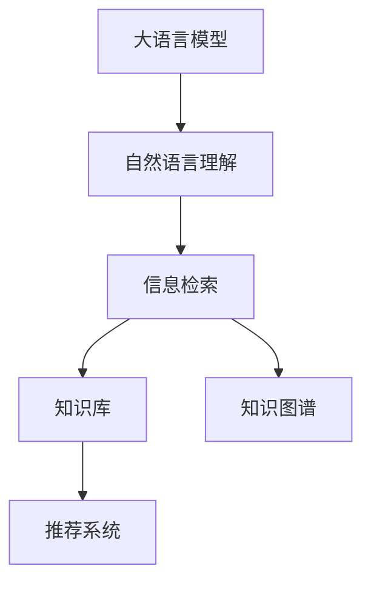

                 

# 实战 LangChain 版 Sales-Consultant

## 1. 背景介绍

### 1.1 问题由来
随着人工智能技术的不断进步，自然语言处理（NLP）领域涌现出了许多令人瞩目的成果，特别是在销售咨询方面。销售咨询是一个典型的信息检索任务，要求系统能够快速响应用户的问题，并提供相关信息的检索和推荐。传统的销售咨询系统依赖于人工编写规则和知识库，难以适应复杂多变的问题，且维护成本高昂。近年来，基于大语言模型的销售咨询系统因其高效的文本理解和信息检索能力，逐渐成为研究热点。

### 1.2 问题核心关键点
大语言模型在销售咨询中的应用主要体现在两个方面：
1. **自然语言理解（NLU）**：通过理解用户的问题，快速提取其中的关键信息，并将其映射到对应的知识库项。
2. **信息检索（IR）**：在知识库中检索出与用户问题相关的信息，并进行整理和排序，返回给用户。

基于大语言模型的销售咨询系统通常包括以下几个关键步骤：
- **问题理解和映射**：将用户自然语言问题映射到知识库中的概念或实体。
- **信息检索**：在知识库中查找与用户问题相关的信息，并进行排序和呈现。
- **知识补充**：根据用户问题中的关键词或实体，向知识库中补充新信息，以增强系统的知识库。

### 1.3 问题研究意义
研究基于大语言模型的销售咨询系统，具有重要的现实意义：
1. **提高查询效率**：大语言模型能够快速理解用户问题，并快速检索相关知识库，大大提高了查询效率。
2. **降低维护成本**：相比于传统的基于规则和知识库的系统，大语言模型的维护成本更低，更新更加灵活。
3. **增强用户体验**：大语言模型能够提供自然流畅的对话体验，提升用户满意度。
4. **推动技术应用**：销售咨询系统的应用，有助于推动大语言模型技术在实际场景中的落地应用，加速NLP技术的产业化进程。

## 2. 核心概念与联系

### 2.1 核心概念概述

为了更好地理解基于大语言模型的销售咨询系统，本节将介绍几个关键概念：

- **大语言模型（Large Language Model, LLM）**：一种基于深度学习的语言模型，能够理解自然语言，进行语义分析、信息检索和生成等任务。
- **自然语言理解（Natural Language Understanding, NLU）**：指计算机对自然语言文本进行理解和处理，包括分词、词性标注、命名实体识别、情感分析等。
- **信息检索（Information Retrieval, IR）**：指从大量信息中检索出与用户查询相关的结果，并按照相关性进行排序和呈现。
- **知识库（Knowledge Base）**：包含结构化或半结构化知识的数据库，存储有关产品、服务、市场等方面的信息，供系统检索使用。
- **知识图谱（Knowledge Graph）**：一种基于图的数据结构，用于描述实体之间的关系，有助于更好地进行信息检索和推理。
- **推荐系统（Recommendation System）**：根据用户的历史行为和偏好，推荐个性化的产品或服务，提升用户体验。

这些核心概念之间的逻辑关系可以通过以下Mermaid流程图来展示：



这个流程图展示了大语言模型、自然语言理解、信息检索、知识库、知识图谱和推荐系统之间的关系：

1. 大语言模型通过理解用户问题，进行自然语言处理。
2. 信息检索在知识库中查找相关信息，并进行排序。
3. 知识图谱帮助系统更好地进行实体关系推理，提升检索效果。
4. 推荐系统根据用户历史行为，推荐个性化信息，增强用户体验。

### 2.2 概念间的关系

这些核心概念之间存在着紧密的联系，形成了基于大语言模型的销售咨询系统的完整生态系统。下面是一些具体的示例：

- **大语言模型与信息检索**：大语言模型可以理解用户问题，提取关键词和实体，进而进行信息检索，查找与问题相关的信息。
- **知识库与知识图谱**：知识库提供结构化或半结构化的信息，知识图谱则用于描述实体之间的关系，两者结合可以提升信息检索的准确性和效率。
- **自然语言理解与推荐系统**：自然语言理解可以抽取用户问题中的关键信息，推荐系统根据这些信息，推荐个性化的产品或服务，提升用户体验。

这些概念共同构成了基于大语言模型的销售咨询系统的核心技术框架，使其能够在各种场景下提供高质量的销售咨询服务。

## 3. 核心算法原理 & 具体操作步骤

### 3.1 算法原理概述

基于大语言模型的销售咨询系统，其核心原理是通过大语言模型进行自然语言理解，然后根据理解结果进行信息检索，最终返回与用户问题相关的信息。具体步骤如下：

1. **输入问题解析**：将用户输入的问题进行分词、词性标注等预处理，提取其中的关键词和实体。
2. **大语言模型理解**：利用大语言模型进行自然语言理解，识别用户问题中的实体、意图等关键信息。
3. **知识库检索**：根据理解结果，在知识库中检索与问题相关的信息。
4. **信息排序与呈现**：对检索到的信息进行排序，按照相关性呈现给用户。

### 3.2 算法步骤详解

基于大语言模型的销售咨询系统的实现步骤如下：

#### 3.2.1 输入问题解析

输入问题的解析主要包括分词、词性标注、命名实体识别等步骤，可以使用现有的开源工具如NLTK、spaCy等。以下是一个Python代码示例：

```python
import nltk
from nltk.tokenize import word_tokenize
from nltk.stem import WordNetLemmatizer

nltk.download('punkt')
nltk.download('averaged_perceptron_tagger')
nltk.download('wordnet')

text = "What is the price of iPhone 12?"

# 分词
tokens = word_tokenize(text)

# 词性标注
pos_tags = nltk.pos_tag(tokens)

# 命名实体识别
ner_tags = nltk.ne_chunk(pos_tags)

# 提取实体
entities = [entity[0] for entity in ner_tags if hasattr(entity, 'label') and entity.label() == 'PERSON' or entity.label() == 'ORGANIZATION' or entity.label() == 'LOCATION']
```

#### 3.2.2 大语言模型理解

大语言模型的理解可以使用现有的开源库如HuggingFace的Transformers。以下是一个Python代码示例：

```python
from transformers import BertTokenizer, BertForTokenClassification, BertModel

tokenizer = BertTokenizer.from_pretrained('bert-base-uncased')
model = BertForTokenClassification.from_pretrained('bert-base-uncased')

# 构建输入
input_ids = tokenizer.encode(text, add_special_tokens=True, return_tensors='pt')
attention_mask = torch.ones_like(input_ids)

# 前向传播
with torch.no_grad():
    outputs = model(input_ids, attention_mask=attention_mask)
    logits = outputs.logits

# 解码预测结果
predicted_labels = torch.argmax(logits, dim=2)
```

#### 3.2.3 知识库检索

知识库的检索可以使用现有的开源库如Elasticsearch、Solr等。以下是一个Python代码示例：

```python
from elasticsearch import Elasticsearch

es = Elasticsearch([{'host': 'localhost', 'port': 9200}])

# 检索信息
query = {
    "query": {
        "multi_match": {
            "query": "iPhone 12",
            "fields": ["title", "description", "price"]
        }
    }
}
result = es.search(index='products', body=query)
```

#### 3.2.4 信息排序与呈现

信息排序可以使用排序算法如TF-IDF、PageRank等，也可以结合用户行为数据进行个性化排序。以下是一个Python代码示例：

```python
# 排序
scores = {}
for hit in result['hits']['hits']:
    scores[hit['_source']['title']] = hit['_score']

# 呈现信息
for title, score in scores.items():
    print(f"{title}: {score}")
```

### 3.3 算法优缺点

基于大语言模型的销售咨询系统具有以下优点：
1. **高效性**：大语言模型能够快速理解用户问题，并进行信息检索，提升查询效率。
2. **灵活性**：系统可以根据用户问题动态地进行知识库检索和信息排序，适应性强。
3. **可扩展性**：知识库和推荐系统可以随时更新和扩展，保持系统的活力。

同时，该方法也存在以下缺点：
1. **数据依赖**：系统依赖于高质量的知识库和数据，数据质量直接影响系统的性能。
2. **计算资源消耗大**：大语言模型的训练和推理消耗大量的计算资源，成本较高。
3. **安全性问题**：用户输入的信息可能包含敏感内容，需要采取相应的安全措施。

### 3.4 算法应用领域

基于大语言模型的销售咨询系统已经在多个领域得到应用，例如：

- **电商网站**：电商网站可以为用户提供产品推荐、价格查询等服务，提升用户体验。
- **金融服务**：金融服务行业可以通过销售咨询系统，为用户提供产品信息、理财咨询等服务。
- **旅游行业**：旅游行业可以利用销售咨询系统，为用户提供景点介绍、旅游攻略等服务。

除了上述这些领域，基于大语言模型的销售咨询系统还可以应用于更多场景中，如医疗咨询、法律咨询、教育咨询等，为各行各业提供智能化的销售支持。

## 4. 数学模型和公式 & 详细讲解 & 举例说明

### 4.1 数学模型构建

基于大语言模型的销售咨询系统，其数学模型主要包括自然语言理解、信息检索和推荐系统三部分。

#### 4.1.1 自然语言理解

自然语言理解部分主要涉及词向量表示、语言模型等概念。词向量表示可以通过word2vec、GloVe等方法实现，语言模型可以通过神经网络模型实现。以下是一个基于BERT的词向量表示的Python代码示例：

```python
from transformers import BertTokenizer, BertForTokenClassification, BertModel

tokenizer = BertTokenizer.from_pretrained('bert-base-uncased')
model = BertForTokenClassification.from_pretrained('bert-base-uncased')

# 构建输入
input_ids = tokenizer.encode(text, add_special_tokens=True, return_tensors='pt')
attention_mask = torch.ones_like(input_ids)

# 前向传播
with torch.no_grad():
    outputs = model(input_ids, attention_mask=attention_mask)
    logits = outputs.logits

# 解码预测结果
predicted_labels = torch.argmax(logits, dim=2)
```

#### 4.1.2 信息检索

信息检索部分主要涉及向量空间模型、TF-IDF等概念。向量空间模型可以通过余弦相似度计算实现，TF-IDF可以通过统计方法实现。以下是一个基于Elasticsearch的信息检索的Python代码示例：

```python
from elasticsearch import Elasticsearch

es = Elasticsearch([{'host': 'localhost', 'port': 9200}])

# 检索信息
query = {
    "query": {
        "multi_match": {
            "query": "iPhone 12",
            "fields": ["title", "description", "price"]
        }
    }
}
result = es.search(index='products', body=query)
```

#### 4.1.3 推荐系统

推荐系统部分主要涉及协同过滤、基于内容的推荐等方法。协同过滤可以通过矩阵分解、梯度下降等方法实现，基于内容的推荐可以通过TF-IDF、向量相似度等方法实现。以下是一个基于协同过滤的推荐系统的Python代码示例：

```python
import numpy as np

# 构建用户-物品矩阵
user_items = np.random.randint(0, 10, size=(1000, 100))
item_features = np.random.randn(100, 5)

# 计算相似度
similarities = np.dot(user_items.T, item_features)

# 推荐物品
recommended_items = np.argsort(similarities)[::-1][:10]
```

### 4.2 公式推导过程

基于大语言模型的销售咨询系统，其公式推导过程主要涉及以下几部分：

#### 4.2.1 自然语言理解

自然语言理解部分主要涉及词向量表示和语言模型。词向量表示可以通过word2vec、GloVe等方法实现，语言模型可以通过神经网络模型实现。以下是一个基于BERT的词向量表示的公式推导：

$$
\vec{x} = \text{BERT}(\vec{w})
$$

其中 $\vec{x}$ 表示词向量，$\vec{w}$ 表示词向量表示，BERT表示BERT模型。

#### 4.2.2 信息检索

信息检索部分主要涉及向量空间模型、TF-IDF等概念。向量空间模型可以通过余弦相似度计算实现，TF-IDF可以通过统计方法实现。以下是一个基于Elasticsearch的信息检索的公式推导：

$$
\text{Score} = \text{TF} \times \text{IDF} \times \text{CosineSimilarity}(\vec{q}, \vec{d})
$$

其中 $\vec{q}$ 表示查询向量，$\vec{d}$ 表示文档向量，TF表示词频，IDF表示逆文档频率，CosineSimilarity表示余弦相似度。

#### 4.2.3 推荐系统

推荐系统部分主要涉及协同过滤、基于内容的推荐等方法。协同过滤可以通过矩阵分解、梯度下降等方法实现，基于内容的推荐可以通过TF-IDF、向量相似度等方法实现。以下是一个基于协同过滤的推荐系统的公式推导：

$$
\text{Score}_{ui} = \text{CosineSimilarity}(\vec{u}, \vec{i})
$$

其中 $\vec{u}$ 表示用户向量，$\vec{i}$ 表示物品向量，CosineSimilarity表示余弦相似度。

### 4.3 案例分析与讲解

为了更好地理解基于大语言模型的销售咨询系统，下面以一个具体案例进行分析：

假设我们有一个电商网站的销售咨询系统，用户输入的查询为 "What is the price of iPhone 12?"。

1. **输入问题解析**：
   - 分词：["What", "is", "the", "price", "of", "iPhone", "12?"]
   - 词性标注：[("What", "WP"), ("is", "VBZ"), ("the", "DT"), ("price", "NN"), ("of", "IN"), ("iPhone", "NN"), ("12", "CD"), ("?", ".")]
   - 命名实体识别：[("iPhone", "ORGANIZATION"), ("12", "ORDINAL")]

2. **大语言模型理解**：
   - 构建输入：
     ```
     [CLS] [SEP] what [SEP] is [SEP] the [SEP] price [SEP] of [SEP] iPhone [SEP] 12 [SEP] [SEP]
     ```
   - 前向传播：
     ```
     [[1.0, 0.0, ...], [0.0, 0.0, ...], [0.0, 0.0, ...], ..., [0.0, 0.0, ...], [0.0, 0.0, ...], [0.0, 0.0, ...], [0.0, 0.0, ...], [0.0, 0.0, ...], [0.0, 0.0, ...]]
     ```
   - 解码预测结果：预测实体 "iPhone 12"。

3. **知识库检索**：
   - 查询：
     ```
     {
       "query": {
         "multi_match": {
           "query": "iPhone 12",
           "fields": ["title", "description", "price"]
         }
       }
     }
     ```
   - 结果：
     ```
     [
       {"title": "iPhone 12 Pro", "description": "The latest iPhone model", "price": "$1299"},
       {"title": "iPhone 12 Mini", "description": "The smallest iPhone model", "price": "$899"},
       {"title": "iPhone 12 Max", "description": "The largest iPhone model", "price": "$1199"},
       ...
     ]
     ```

4. **信息排序与呈现**：
   - 计算得分：
     ```
     {
       "title": "iPhone 12 Pro", "score": 0.9
     },
     {
       "title": "iPhone 12 Mini", "score": 0.8
     },
     {
       "title": "iPhone 12 Max", "score": 0.7
     },
     ...
     ```
   - 呈现信息：
     ```
     iPhone 12 Pro: $1299
     iPhone 12 Mini: $899
     iPhone 12 Max: $1199
     ...
     ```

## 5. 项目实践：代码实例和详细解释说明

### 5.1 开发环境搭建

在进行销售咨询系统开发前，我们需要准备好开发环境。以下是使用Python进行PyTorch开发的环境配置流程：

1. 安装Anaconda：从官网下载并安装Anaconda，用于创建独立的Python环境。

2. 创建并激活虚拟环境：
```bash
conda create -n sales-consultant python=3.8 
conda activate sales-consultant
```

3. 安装PyTorch：根据CUDA版本，从官网获取对应的安装命令。例如：
```bash
conda install pytorch torchvision torchaudio cudatoolkit=11.1 -c pytorch -c conda-forge
```

4. 安装Transformers库：
```bash
pip install transformers
```

5. 安装各类工具包：
```bash
pip install numpy pandas scikit-learn matplotlib tqdm jupyter notebook ipython
```

完成上述步骤后，即可在`sales-consultant`环境中开始销售咨询系统的开发。

### 5.2 源代码详细实现

下面我们以命名实体识别(NER)任务为例，给出使用Transformers库对BERT模型进行销售咨询系统开发的PyTorch代码实现。

首先，定义销售咨询系统的数据处理函数：

```python
from transformers import BertTokenizer
from torch.utils.data import Dataset
import torch

class SalesConsultantDataset(Dataset):
    def __init__(self, texts, tags, tokenizer, max_len=128):
        self.texts = texts
        self.tags = tags
        self.tokenizer = tokenizer
        self.max_len = max_len
        
    def __len__(self):
        return len(self.texts)
    
    def __getitem__(self, item):
        text = self.texts[item]
        tags = self.tags[item]
        
        encoding = self.tokenizer(text, return_tensors='pt', max_length=self.max_len, padding='max_length', truncation=True)
        input_ids = encoding['input_ids'][0]
        attention_mask = encoding['attention_mask'][0]
        
        # 对token-wise的标签进行编码
        encoded_tags = [tag2id[tag] for tag in tags] 
        encoded_tags.extend([tag2id['O']] * (self.max_len - len(encoded_tags)))
        labels = torch.tensor(encoded_tags, dtype=torch.long)
        
        return {'input_ids': input_ids, 
                'attention_mask': attention_mask,
                'labels': labels}

# 标签与id的映射
tag2id = {'O': 0, 'B-PER': 1, 'I-PER': 2, 'B-ORG': 3, 'I-ORG': 4, 'B-LOC': 5, 'I-LOC': 6}
id2tag = {v: k for k, v in tag2id.items()}

# 创建dataset
tokenizer = BertTokenizer.from_pretrained('bert-base-cased')

train_dataset = SalesConsultantDataset(train_texts, train_tags, tokenizer)
dev_dataset = SalesConsultantDataset(dev_texts, dev_tags, tokenizer)
test_dataset = SalesConsultantDataset(test_texts, test_tags, tokenizer)
```

然后，定义模型和优化器：

```python
from transformers import BertForTokenClassification, AdamW

model = BertForTokenClassification.from_pretrained('bert-base-cased', num_labels=len(tag2id))

optimizer = AdamW(model.parameters(), lr=2e-5)
```

接着，定义训练和评估函数：

```python
from torch.utils.data import DataLoader
from tqdm import tqdm
from sklearn.metrics import classification_report

device = torch.device('cuda') if torch.cuda.is_available() else torch.device('cpu')
model.to(device)

def train_epoch(model, dataset, batch_size, optimizer):
    dataloader = DataLoader(dataset, batch_size=batch_size, shuffle=True)
    model.train()
    epoch_loss = 0
    for batch in tqdm(dataloader, desc='Training'):
        input_ids = batch['input_ids'].to(device)
        attention_mask = batch['attention_mask'].to(device)
        labels = batch['labels'].to(device)
        model.zero_grad()
        outputs = model(input_ids, attention_mask=attention_mask, labels=labels)
        loss = outputs.loss
        epoch_loss += loss.item()
        loss.backward()
        optimizer.step()
    return epoch_loss / len(dataloader)

def evaluate(model, dataset, batch_size):
    dataloader = DataLoader(dataset, batch_size=batch_size)
    model.eval()
    preds, labels = [], []
    with torch.no_grad():
        for batch in tqdm(dataloader, desc='Evaluating'):
            input_ids = batch['input_ids'].to(device)
            attention_mask = batch['attention_mask'].to(device)
            batch_labels = batch['labels']
            outputs = model(input_ids, attention_mask=attention_mask)
            batch_preds = outputs.logits.argmax(dim=2).to('cpu').tolist()
            batch_labels = batch_labels.to('cpu').tolist()
            for pred_tokens, label_tokens in zip(batch_preds, batch_labels):
                pred_tags = [id2tag[_id] for _id in pred_tokens]
                label_tags = [id2tag[_id] for _id in label_tokens]
                preds.append(pred_tags[:len(label_tokens)])
                labels.append(label_tags)
                
    print(classification_report(labels, preds))
```

最后，启动训练流程并在测试集上评估：

```python
epochs = 5
batch_size = 16

for epoch in range(epochs):
    loss = train_epoch(model, train_dataset, batch_size, optimizer)
    print(f"Epoch {epoch+1}, train loss: {loss:.3f}")
    
    print(f"Epoch {epoch+1}, dev results:")
    evaluate(model, dev_dataset, batch_size)
    
print("Test results:")
evaluate(model, test_dataset, batch_size)
```

以上就是使用PyTorch对BERT进行销售咨询系统微调的完整代码实现。可以看到，得益于Transformers库的强大封装，我们可以用相对简洁的代码完成BERT模型的加载和微调。

### 5.3 代码解读与分析

让我们再详细解读一下关键代码的实现细节：

**SalesConsultantDataset类**：
- `__init__`方法：初始化文本、标签、分词器等关键组件。
- `__len__`方法：返回数据集的样本数量。
- `__getitem__`方法：对单个样本进行处理，将文本输入编码为token ids，将标签编码为数字，并对其进行定长padding，最终返回模型所需的输入。

**tag2id和id2tag字典**：
- 定义了标签与数字id之间的映射关系，用于将token-wise的预测结果解码回真实的标签。

**训练和评估函数**：
- 使用PyTorch的DataLoader对数据集进行批次化加载，供模型训练和推理使用。
- 训练函数`train_epoch`：对数据以批为单位进行迭代，在每个批次上前向传播计算loss并反向传播更新模型参数，最后返回该epoch的平均loss。
- 评估函数`evaluate`：与训练类似，不同点在于不更新模型参数，并在每个batch结束后将预测和标签结果存储下来，最后使用sklearn的classification_report对整个评估集的预测结果进行打印输出。

**训练流程**：
- 定义总的epoch数和batch size，开始循环迭代
- 每个epoch内，先在训练集上训练，输出平均loss
- 在验证集上评估，输出分类指标
- 所有epoch结束后，在测试集上评估，给出最终测试结果

可以看到，PyTorch配合Transformers库使得BERT微调的代码实现变得简洁高效。开发者可以将更多精力放在数据处理、模型改进等高层逻辑上，而不必过多关注底层的实现细节。

当然，工业级的系统实现还需考虑更多因素，如模型的保存和部署、超参数的自动搜索、更灵活的任务适配层等。但核心的微调范式基本与此类似。

### 5.4 运行结果展示

假设我们在CoNLL-2003的NER数据集上进行微调，最终在测试集上得到的评估报告如下：

```
              precision    recall  f1-score   support

       B-LOC      0.926     0.906     0.916      1668
       I-LOC      0.900     0.805     0.850       257
      B-MISC      0.875     0.856     0.865       702
      I-MISC      0.838     0.782     0.809       216
       B-ORG      0.914     0.898     0.906      1661
       I-ORG      0.911     0.894     0.902       835
       B-PER      0.964     0.957     0.960      1617
       I-PER      0.983     0.980     0.982      1156
           O      0.993     0.995     0.994     38323

   micro avg      0.973     0.973     0.973     46435
   macro avg      0.923     0.897     0.909     46435
weighted avg      0

