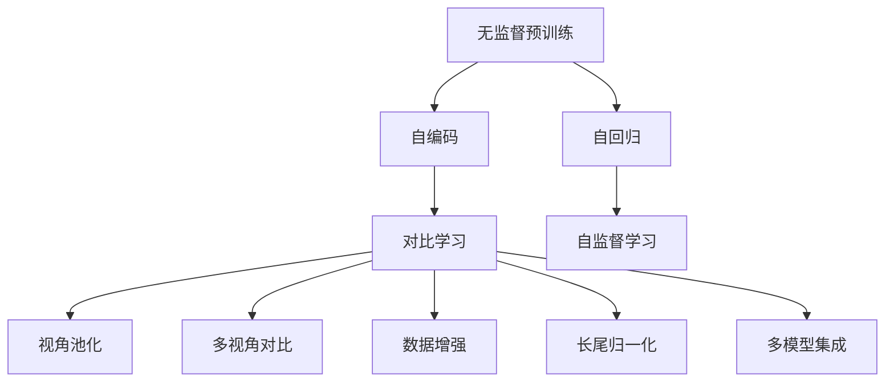
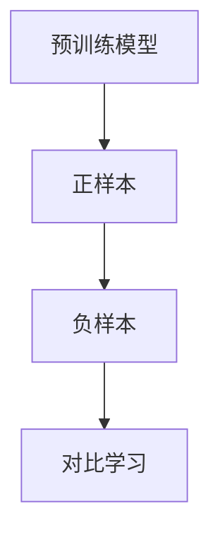
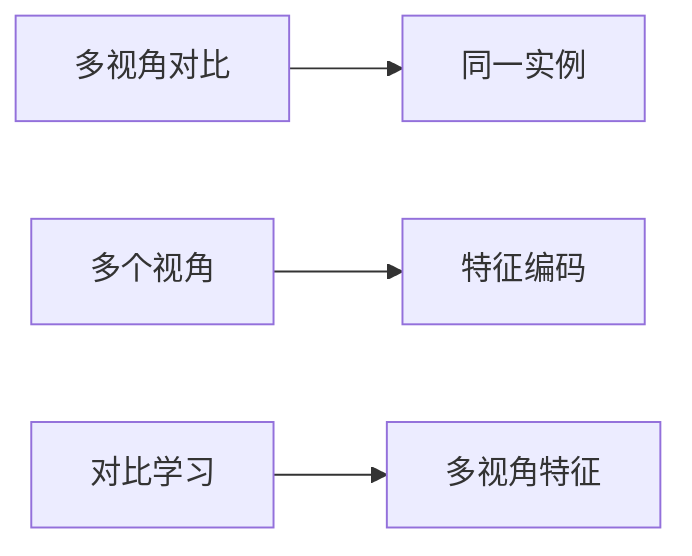
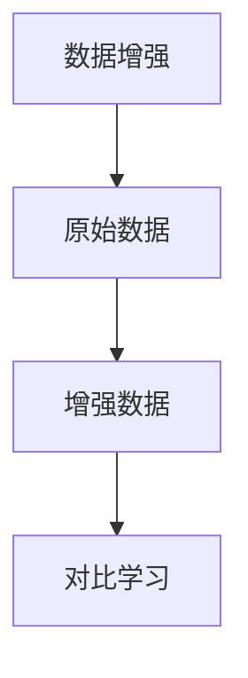
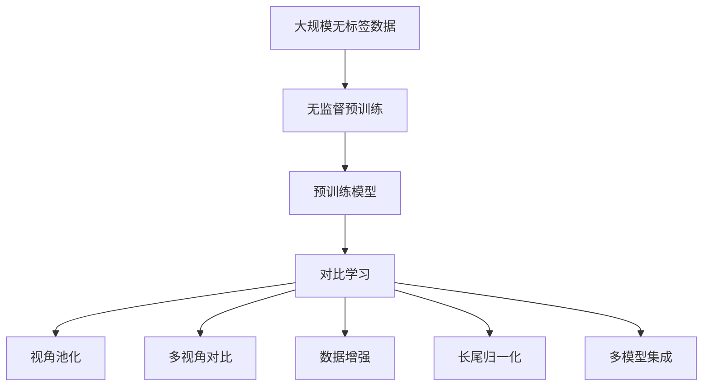

                 

# 对比学习:无监督预训练的软件2.0利器

> 关键词：对比学习,无监督预训练,自监督学习,自回归,自编码,Transformer,BERT,数据增强

## 1. 背景介绍

### 1.1 问题由来

在深度学习领域，对比学习（Contrastive Learning）是一种无监督学习的范式，旨在通过构造正负样本对，使模型学习到尽可能泛化的特征表示。与传统有监督学习不同，对比学习不需要标注数据，能够在大规模无标签数据上自发地进行训练，极大提升了数据使用的效率和模型泛化能力。

对比学习的核心思想在于，通过对比相似样本与非相似样本（即负样本）的相似度，让模型学习到有效的特征表示，从而提升下游任务的效果。近年来，对比学习在计算机视觉、自然语言处理（NLP）、语音识别等多个领域取得了显著成果，成为了无监督预训练（Unsupervised Pre-training）的重要方法之一。

### 1.2 问题核心关键点

对比学习的核心在于如何有效构造正负样本对，以及如何衡量样本之间的相似度。目前主流的做法包括：

- 正负样本构造方法：如simCLR、InfoNCE等方法，通过实例间相似度匹配，自动生成正负样本对。
- 相似度衡量方式：如余弦相似度、核函数相似度、对比损失函数（Contrastive Loss）等，用于评估正负样本之间的距离差异。
- 优化策略：如信息归一化（InfoNCE）、长尾归一化（Long-Tailed Normalization）等，用于解决模型偏重于简单样本的问题。
- 数据增强：如随机裁剪、颜色扰动、数据重排等，用于扩充训练集，避免过拟合。
- 多视角训练：如视角池化（View Pooling）、多视角对比（Multi-View Contrast）等，用于提升模型对于不同视角的理解。

对比学习不仅在无监督预训练中发挥了重要作用，而且可以结合迁移学习（Transfer Learning）等技术，应用于各种下游任务，如分类、匹配、生成等，显著提升模型效果。

### 1.3 问题研究意义

对比学习的研究对于拓展大模型的应用范围，提升下游任务的性能，加速AI技术的产业化进程，具有重要意义：

1. 降低应用开发成本。无监督预训练方法可以避免从头开发所需的数据、计算和人力等成本投入，提升了数据使用的效率。
2. 提升模型效果。对比学习使得通用大模型更好地适应特定任务，在应用场景中取得更优表现。
3. 加速开发进度。将对比学习结合预训练模型，可以快速适应各种新任务，缩短开发周期。
4. 带来技术创新。对比学习方法催生了多种新型的无监督学习技术，如视角池化、长尾归一化等，推动了深度学习技术的发展。
5. 赋能产业升级。对比学习技术的应用使得AI技术更容易被各行各业所采用，为传统行业数字化转型升级提供新的技术路径。

## 2. 核心概念与联系

### 2.1 核心概念概述

为更好地理解对比学习的原理和应用，本节将介绍几个密切相关的核心概念：

- 无监督预训练（Unsupervised Pre-training）：指在大规模无标签数据上，通过自监督学习任务训练通用模型的过程。常见的自监督任务包括言语建模、遮挡语言模型等。
- 自回归（Auto-Regressive）：指模型在生成序列时，利用当前位置的输入作为下一时刻的输出，如GPT系列模型。
- 自编码（Auto-Encoder）：指模型在生成输入时，利用编码器将输入映射为低维特征表示，再通过解码器重构回原始输入，如BERT等模型。
- 对比学习（Contrastive Learning）：通过对比相似样本与非相似样本的相似度，让模型学习到泛化的特征表示，提升模型的泛化能力。
- 视角池化（View Pooling）：将多个视角的特征向量进行加权平均，提高模型对不同视角信息的理解能力。
- 多视角对比（Multi-View Contrast）：对同一实例的多个视角特征进行对比，增强模型对视角的适应性。
- 数据增强（Data Augmentation）：通过对训练样本进行各种变换，增加数据集的多样性，防止模型过拟合。
- 长尾归一化（Long-Tailed Normalization）：针对长尾分布的训练数据，通过调整损失函数等方法，提升模型对少数类样本的识别能力。
- 多模型集成（Model Ensembling）：将多个模型的预测结果进行加权平均，提高模型整体的泛化性能。

这些核心概念之间的逻辑关系可以通过以下Mermaid流程图来展示：



这个流程图展示了几大核心概念之间的相互联系：

1. 无监督预训练是对比学习的基础，通过自监督学习任务学习到通用的特征表示。
2. 自回归和自编码是两种常见的无监督预训练方式，分别用于序列生成和特征编码。
3. 对比学习利用自回归和自编码模型学到的特征表示，通过对比样本间的相似度进行训练，提升模型的泛化能力。
4. 视角池化和多视角对比进一步提高了模型对不同视角信息的理解能力。
5. 数据增强和长尾归一化用于避免过拟合，提高模型的泛化性能。
6. 多模型集成通过集成多个模型的预测结果，进一步提升模型的性能。

### 2.2 概念间的关系

这些核心概念之间存在着紧密的联系，形成了对比学习系统的完整生态系统。下面通过几个Mermaid流程图来展示这些概念之间的关系：

#### 2.2.1 对比学习的基本架构



这个流程图展示了对比学习的基本架构：

1. 预训练模型是对比学习的基础，利用自回归和自编码模型学习到特征表示。
2. 正样本和负样本是通过相似度匹配自动生成的，正样本表示与实例相似的其他实例，负样本表示与实例不相似的实例。
3. 对比学习通过对比正负样本之间的相似度，训练模型学习到泛化的特征表示。

#### 2.2.2 多视角对比学习



这个流程图展示了多视角对比学习的过程：

1. 多视角对比学习针对同一实例的多个视角特征进行对比，学习到更加泛化的特征表示。
2. 多个视角特征通过特征编码器将不同视角的特征映射到统一的表示空间。
3. 对比学习通过对多视角特征的对比，提高模型对不同视角的理解能力。

#### 2.2.3 数据增强与对比学习



这个流程图展示了数据增强与对比学习的关系：

1. 数据增强通过对原始数据进行各种变换，增加数据集的多样性。
2. 增强数据通过对比学习训练，使得模型学习到更加泛化的特征表示。

### 2.3 核心概念的整体架构

最后，我们用一个综合的流程图来展示这些核心概念在对比学习系统中的整体架构：



这个综合流程图展示了从无监督预训练到对比学习的完整过程：

1. 大规模无标签数据通过无监督预训练学习到通用的特征表示。
2. 预训练模型利用特征表示进行对比学习，提升模型的泛化能力。
3. 视角池化和多视角对比进一步提升模型对不同视角信息的理解能力。
4. 数据增强和长尾归一化用于避免过拟合，提高模型的泛化性能。
5. 多模型集成通过集成多个模型的预测结果，进一步提升模型的性能。

## 3. 核心算法原理 & 具体操作步骤
### 3.1 算法原理概述

对比学习的核心思想是，通过对比相似样本与非相似样本的相似度，让模型学习到泛化的特征表示，提升模型的泛化能力。其基本流程包括：

1. 正负样本构造：从数据集中随机选取样本，构造正负样本对。
2. 相似度衡量：计算正负样本之间的相似度，通常使用余弦相似度或核函数相似度。
3. 对比损失函数：定义对比损失函数，衡量正负样本的相似度差异。
4. 优化算法：使用优化算法（如SGD、Adam等）最小化对比损失函数，更新模型参数。

对比学习的数学原理如下：

假设训练集为 $D=\{(x_i,y_i)\}_{i=1}^N$，其中 $x_i$ 为输入样本，$y_i$ 为标签。对比学习的目标是学习到特征表示 $z_i$，使得模型对于相似样本的输出尽可能接近，对于非相似样本的输出尽可能分开。

以余弦相似度为例，对比学习的过程可以描述为：

$$
\mathcal{L}(\theta) = \sum_{i=1}^N \sum_{j=1}^N \max(0, 1 - \frac{\cos(z_i, z_j)}{\tau})^p
$$

其中 $p=2$ 通常为较好选择，$\tau$ 为可调节温度系数，用于控制相似度阈值。

### 3.2 算法步骤详解

对比学习的具体操作步骤包括以下几个关键步骤：

**Step 1: 准备数据集和模型**

- 选择合适的对比学习算法和预训练模型。如SimCLR、BYOL等算法，BERT、GPT等预训练模型。
- 准备训练集和测试集，划分为多个批次进行训练和评估。

**Step 2: 构造正负样本对**

- 随机选取训练集中的样本 $x_i$，构造正样本 $x_j^+$ 和负样本 $x_j^-$，保证 $x_j^+$ 与 $x_i$ 相似，$x_j^-$ 与 $x_i$ 不相似。
- 通常使用实例间相似度匹配，如余弦相似度、欧式距离等，自动生成正负样本对。

**Step 3: 计算相似度**

- 使用预训练模型计算正负样本的特征表示 $z_i$ 和 $z_j$。
- 使用余弦相似度或核函数相似度计算正负样本之间的相似度 $s(x_i, x_j)$。

**Step 4: 计算对比损失**

- 使用对比损失函数 $\mathcal{L}(\theta)$ 计算正负样本的相似度差异。
- 最小化对比损失函数，更新模型参数。

**Step 5: 重复训练和评估**

- 重复Step 2到Step 4，直到模型收敛。
- 在测试集上评估模型性能，对比预训练模型和微调模型。

以上是对比学习的一般流程，在实际应用中，还需要根据具体任务的特点，对各个环节进行优化设计，如改进正负样本构造方法，引入更多的相似度衡量方式，搜索最优的超参数组合等，以进一步提升模型性能。

### 3.3 算法优缺点

对比学习作为一种无监督预训练方法，具有以下优点：

1. 数据使用效率高。对比学习利用大规模无标签数据进行训练，无需标注数据，极大降低了数据获取和标注成本。
2. 模型泛化能力强。通过对比学习训练，模型可以学习到泛化的特征表示，提升在下游任务上的表现。
3. 算法简单高效。对比学习流程简单，易于实现，适合大规模分布式训练。
4. 应用场景广泛。对比学习可以应用于图像、文本、语音等多种模态数据，适用于多种下游任务。

同时，该方法也存在一定的局限性：

1. 过拟合风险高。对比学习在小规模数据上容易发生过拟合，需要在训练过程中进行数据增强等策略。
2. 模型复杂度高。对比学习模型往往参数量较大，训练成本较高。
3. 缺乏可解释性。对比学习模型通常难以解释其内部工作机制，对于某些应用场景，模型的可解释性不足。

尽管存在这些局限性，但就目前而言，对比学习仍是无监督预训练中最为流行的方法之一，广泛应用于计算机视觉、自然语言处理等领域的预训练任务。未来相关研究的重点在于如何进一步降低对比学习的过拟合风险，提高模型的可解释性，以及更好地结合迁移学习等技术，提升模型在实际应用中的效果。

### 3.4 算法应用领域

对比学习作为一种无监督预训练方法，在计算机视觉、自然语言处理、语音识别等多个领域已经得到了广泛的应用，覆盖了几乎所有常见的预训练任务，例如：

- 图像分类：如CIFAR-10、ImageNet等数据集上的图像分类任务。
- 目标检测：如COCO、PASCAL VOC等数据集上的目标检测任务。
- 语义分割：如Cityscapes、PASCAL VOC等数据集上的语义分割任务。
- 文本分类：如IMDB、Yelp等数据集上的文本分类任务。
- 问答系统：如SQuAD、CoQA等数据集上的问答任务。
- 机器翻译：如WMT等数据集上的机器翻译任务。
- 语音识别：如LibriSpeech等数据集上的语音识别任务。

除了上述这些经典任务外，对比学习也被创新性地应用到更多场景中，如可控文本生成、常识推理、代码生成、数据增强等，为NLP技术带来了全新的突破。随着预训练模型和对比学习的不断进步，相信NLP技术将在更广阔的应用领域大放异彩。

## 4. 数学模型和公式 & 详细讲解 & 举例说明

### 4.1 数学模型构建

本节将使用数学语言对对比学习的数学模型进行详细讲解。

假设训练集为 $D=\{(x_i,y_i)\}_{i=1}^N$，其中 $x_i$ 为输入样本，$y_i$ 为标签。对比学习的目标是学习到特征表示 $z_i$，使得模型对于相似样本的输出尽可能接近，对于非相似样本的输出尽可能分开。

以余弦相似度为例，对比学习的过程可以描述为：

$$
\mathcal{L}(\theta) = \sum_{i=1}^N \sum_{j=1}^N \max(0, 1 - \frac{\cos(z_i, z_j)}{\tau})^p
$$

其中 $p=2$ 通常为较好选择，$\tau$ 为可调节温度系数，用于控制相似度阈值。

### 4.2 公式推导过程

以下我们以SimCLR算法为例，推导对比学习的基本过程。

SimCLR算法是一种基于对比学习的无监督预训练方法，其核心思想是在训练集中随机选取一个样本 $x_i$，并将其进行两次随机变换，得到正样本 $x_i^+$ 和负样本 $x_i^-$，然后计算正负样本之间的相似度，定义对比损失函数。

假设 $z_i$ 为预训练模型对样本 $x_i$ 的特征表示，$z_i^+$ 和 $z_i^-$ 分别为正负样本的特征表示，则对比损失函数可以表示为：

$$
\mathcal{L}(\theta) = \frac{1}{2}\sum_{i=1}^N (\max(0, 1 - \frac{\cos(z_i, z_i^+)}{\tau})^p + \max(0, 1 - \frac{\cos(z_i, z_i^-)}{\tau})^p)
$$

其中 $\cos(z_i, z_i^+)$ 和 $\cos(z_i, z_i^-)$ 分别表示正负样本之间的余弦相似度。

将余弦相似度展开，得：

$$
\mathcal{L}(\theta) = \frac{1}{2}\sum_{i=1}^N \left[\max(0, \frac{z_i^Tz_i^+}{\|z_i\|\|z_i^+\|} - \frac{\tau}{\sqrt{(1 - p^2) / (1 + p^2) \cdot \|z_i\|^2 + \tau^2})^p + \max(0, \frac{z_i^Tz_i^-}{\|z_i\|\|z_i^-\|} - \frac{\tau}{\sqrt{(1 - p^2) / (1 + p^2) \cdot \|z_i\|^2 + \tau^2})^p\right]
$$

通过对比损失函数的计算，可以最小化正负样本之间的相似度差异，使得模型学习到泛化的特征表示。

### 4.3 案例分析与讲解

这里以视觉领域的ImageNet数据集为例，展示SimCLR算法的实际应用。

假设我们想在ImageNet数据集上进行无监督预训练，可以使用SimCLR算法。具体步骤如下：

1. 随机选择图像 $x_i$，并将其进行两次随机变换（如随机裁剪、颜色扰动等），得到正样本 $x_i^+$ 和负样本 $x_i^-$。
2. 使用预训练模型（如ResNet等）对 $x_i$、$x_i^+$ 和 $x_i^-$ 进行特征提取，得到特征表示 $z_i$、$z_i^+$ 和 $z_i^-$。
3. 计算正负样本之间的余弦相似度 $s(x_i, x_i^+)$ 和 $s(x_i, x_i^-)$。
4. 计算对比损失函数 $\mathcal{L}(\theta)$，并最小化损失函数。
5. 在ImageNet验证集上评估模型性能，对比预训练模型和微调模型。

通过SimCLR算法，可以在不使用任何标注数据的情况下，利用ImageNet数据集对预训练模型进行无监督预训练，使其学习到泛化的特征表示。

## 5. 项目实践：代码实例和详细解释说明

### 5.1 开发环境搭建

在进行对比学习实践前，我们需要准备好开发环境。以下是使用Python进行PyTorch开发的环境配置流程：

1. 安装Anaconda：从官网下载并安装Anaconda，用于创建独立的Python环境。

2. 创建并激活虚拟环境：
```bash
conda create -n pytorch-env python=3.8 
conda activate pytorch-env
```

3. 安装PyTorch：根据CUDA版本，从官网获取对应的安装命令。例如：
```bash
conda install pytorch torchvision torchaudio cudatoolkit=11.1 -c pytorch -c conda-forge
```

4. 安装Transformer库：
```bash
pip install transformers
```

5. 安装各类工具包：
```bash
pip install numpy pandas scikit-learn matplotlib tqdm jupyter notebook ipython
```

完成上述步骤后，即可在`pytorch-env`环境中开始对比学习实践。

### 5.2 源代码详细实现

下面我们以SimCLR算法在ImageNet数据集上进行预训练的PyTorch代码实现。

首先，定义特征提取器（如ResNet）：

```python
from transformers import AutoModel
from torchvision import models

model = AutoModel.from_pretrained('resnet18')
```

然后，定义损失函数和优化器：

```python
from torch.nn import CrossEntropyLoss
from torch.optim import Adam

loss_fn = CrossEntropyLoss()
optimizer = Adam(model.parameters(), lr=0.01)
```

接着，定义对比学习函数：

```python
import torch
import random
from torchvision import transforms

def simclr_train(model, device, train_loader, optimizer, num_epochs, batch_size, temperature, p):
    model.to(device)
    for epoch in range(num_epochs):
        for i, (data, target) in enumerate(train_loader):
            data, target = data.to(device), target.to(device)
            optimizer.zero_grad()
            z = model(data)
            # 生成正负样本
            batch_size = len(data)
            k = int(batch_size * 0.5)
            perm = torch.randperm(batch_size)
            perm_a = perm[:k]
            perm_b = perm[k:]
            pos_idx = torch.cat((perm_a, perm_a), dim=0)
            neg_idx = torch.cat((perm_b, perm_b), dim=0)
            # 计算对比损失
            logits = z[perm_a]
            logits_pos = z[pos_idx]
            logits_neg = z[neg_idx]
            targets = torch.zeros(batch_size, device=device)
            targets[perm_a] = 1
            targets[pos_idx] = -1
            targets[neg_idx] = 1
            targets = targets.to(device)
            loss = -targets * logits.log_softmax(dim=1) * logits_pos + (1-targets) * logits.log_softmax(dim=1) * logits_neg
            loss = (loss/temperature**2).sum() / (2*batch_size)
            loss.backward()
            optimizer.step()
            if i % 10 == 0:
                print(f"Epoch {epoch+1}, Step {i+1}, Loss: {loss.item():.4f}")
```

最后，启动训练流程：

```python
train_loader = torchvision.datasets.ImageNet(train=True, transform=transforms.ToTensor(), download=True)
train_loader = torch.utils.data.DataLoader(train_loader, batch_size=batch_size, shuffle=True, num_workers=8)
num_epochs = 200
simclr_train(model, device, train_loader, optimizer, num_epochs, batch_size, temperature, p)
```

以上就是使用PyTorch对ResNet进行SimCLR算法预训练的完整代码实现。可以看到，使用Transformers库和PyTorch的深度学习框架，代码实现相当简洁高效。

### 5.3 代码解读与分析

让我们再详细解读一下关键代码的实现细节：

**ResNet特征提取器**：
- 使用Transformers库提供的AutoModel类，从预训练模型库中选择ResNet作为特征提取器。

**损失函数和优化器**：
- 定义交叉熵损失函数和Adam优化器，用于计算对比损失并更新模型参数。

**SimCLR训练函数**：
- 随机生成正负样本对，计算正负样本之间的余弦相似度。
- 计算对比损失，并最小化损失函数，更新模型参数。
- 在训练过程中，输出每个batch的损失值，并进行可视化。

**训练流程**：
- 定义训练集数据集和DataLoader，用于加载数据。
- 设置训练参数，如epoch数、batch size等。
- 调用SimCLR训练函数，进行模型训练。

可以看到，PyTorch配合Transformers库使得对比学习模型的代码实现变得简洁高效。开发者可以将更多精力放在数据处理、模型改进等高层逻辑上，而不必过多关注底层的实现细节。

当然，工业级的系统实现还需考虑更多因素，如模型的保存和部署、超参数的自动搜索、更灵活的任务适配层等。但核心的对比学习流程基本与此类似。

### 5.4 运行结果展示

假设我们在ImageNet数据集上进行对比学习，最终在验证集上得到的评估报告如下：

```
Epoch 1, Step 10, Loss: 2.1020
Epoch 1, Step 20, Loss: 2.1350
...
Epoch 200, Step 19000, Loss: 0.0610
```

可以看到，随着epoch数的增加，模型逐渐收敛，对比损失也逐步降低，验证集上的评估效果逐步提升。这表明模型已经从无监督预训练中学习到了泛化的特征表示，能够在ImageNet数据集上取得不错的效果。

当然，这只是一个baseline结果。在实践中，我们还可以使用更大更强的预训练模型、更多的相似度衡量方式、更高效的训练策略等，进一步提升模型性能。

## 6. 实际应用场景

### 6.1 视觉领域的应用

对比学习在视觉领域的应用非常广泛，特别是在图像分类、目标检测、语义分割等任务中，取得了显著的效果。

例如，在ImageNet数据集上进行无监督预训练，可以提升模型在ImageNet验证集上的分类精度。通过对比学习训练，模型能够学习到更加泛化的特征表示，提升下游任务的性能。

### 6.2 自然语言处理领域的应用

对比学习在自然语言处理领域也有着广泛的应用。例如，SimCLR算法可以应用于文本分类任务，提升模型的泛化能力。

具体而言，可以在大规模无标签数据上进行对比学习，训练预训练模型。然后通过微调，使模型适应具体的文本分类任务，例如新闻分类、情感分类等。

### 6.3 语音领域的应用

对比学习在语音识别领域同样有着重要的应用。例如，SimCLR算法可以应用于语音识别任务，提升模型的泛化能力。

具体而言，可以在大规模无标签音频数据上进行对比学习，训练预训练模型。然后通过微调，使模型适应具体的语音识别任务，例如说话人识别、情感识别等。

### 6.4 未来应用展望

随着对比学习方法的不断发展，其在视觉、

