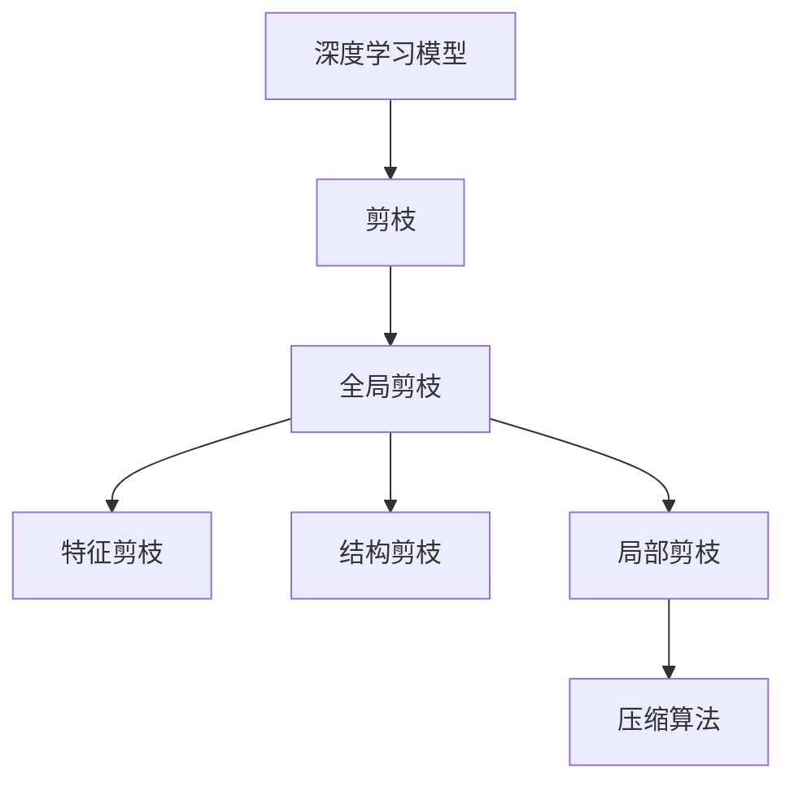
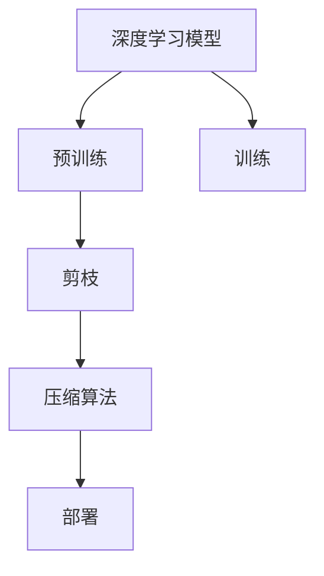
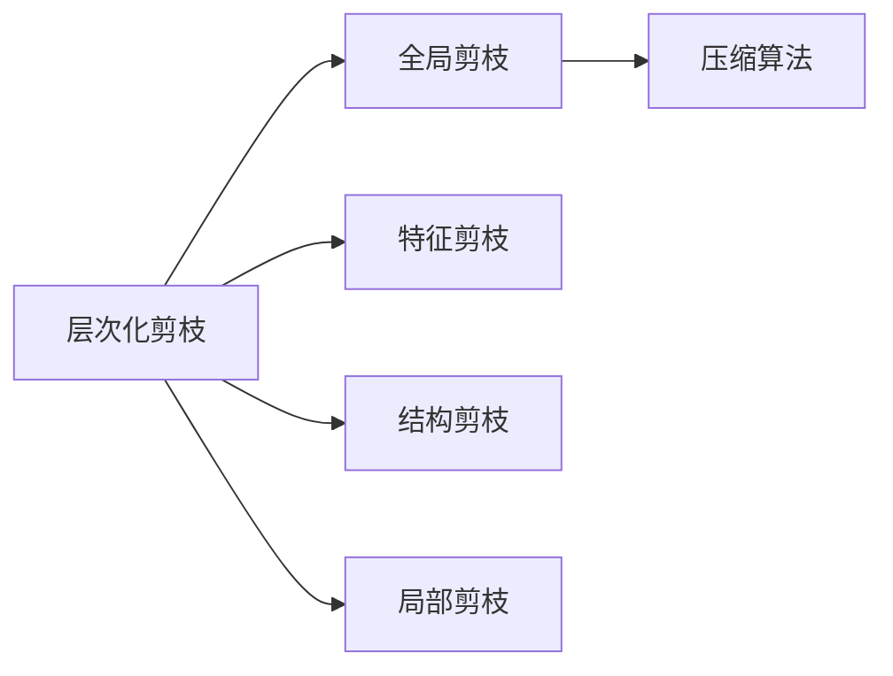
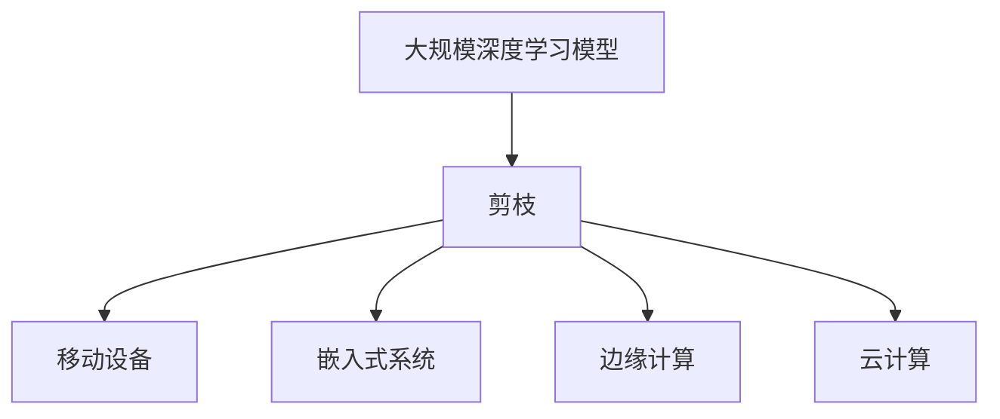
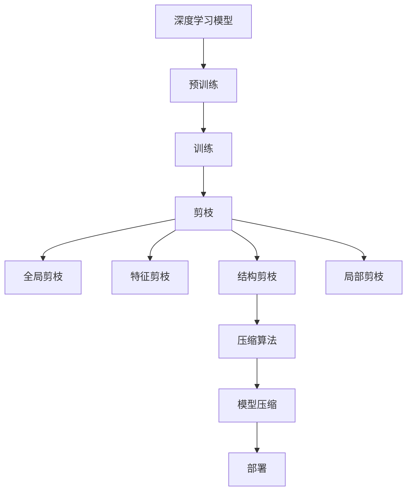

                 

# 层次化剪枝：从整体到局部的精细化压缩

> 关键词：层次化剪枝,深度学习模型,压缩算法,压缩模型,模型压缩

## 1. 背景介绍

在深度学习领域，随着模型参数量的不断增加，训练和推理过程中的计算资源消耗也急剧上升，这不仅增加了硬件成本，还限制了模型在移动设备、嵌入式系统等资源受限场景中的应用。因此，如何有效地压缩深度学习模型，减小其规模，提高效率，成为当前研究的热点问题。

### 1.1 问题由来

深度学习模型经过大规模训练后，通常包含了大量的冗余信息。这些冗余不仅增加了模型的存储和计算负担，还可能导致过拟合等问题。通过剪枝（Pruning）技术，可以去除模型中不必要的连接和参数，从而减小模型规模，提高推理速度。然而，传统的剪枝方法通常是全局的、一刀切的，难以保留模型中重要的结构，可能导致性能下降。

为了解决这些问题，近年来出现了一种层次化剪枝（Hierarchical Pruning）方法，它通过从整体到局部逐步剪枝，保留重要特征和结构，实现更高效的模型压缩。

### 1.2 问题核心关键点

层次化剪枝的核心思想是从宏观到微观，分层次地剪枝模型。具体来说，它分为以下几个步骤：

1. **全局剪枝**：去除模型中不重要的连接和参数，以减小模型规模。
2. **特征剪枝**：对保留下来的特征进行细粒度剪枝，去除其中不重要的部分。
3. **结构剪枝**：对特征之间的连接关系进行剪枝，保留重要结构。
4. **局部剪枝**：针对每一层的神经元，根据其重要性和稀疏性进行细粒度剪枝，进一步减小模型规模。

这些步骤共同作用，可以实现模型的高效压缩，同时保留重要的特征和结构，提升模型性能。

### 1.3 问题研究意义

层次化剪枝对于提高深度学习模型的压缩效率和应用范围具有重要意义：

1. **减小存储和计算成本**：通过剪枝技术，可以显著减小模型的存储和计算需求，降低硬件成本。
2. **提升模型性能**：层次化剪枝保留了重要的特征和结构，避免了传统全剪枝导致的性能下降问题。
3. **增强模型的泛化能力**：层次化剪枝保留了模型中重要的结构，增强了模型在不同数据集上的泛化能力。
4. **促进模型部署**：剪枝后的模型更适合在移动设备、嵌入式系统等资源受限场景中应用。

## 2. 核心概念与联系

### 2.1 核心概念概述

为更好地理解层次化剪枝方法，本节将介绍几个关键概念：

- **深度学习模型**：以神经网络为代表的深度学习模型，通过多层非线性变换，实现对数据的复杂建模。
- **剪枝（Pruning）**：通过去除模型中不必要的连接和参数，减小模型规模，提高计算效率。
- **压缩算法**：对深度学习模型进行压缩的技术，包括量化、剪枝、蒸馏等。
- **模型压缩**：通过各种压缩技术，减小深度学习模型的存储空间和计算资源消耗。

这些概念之间的联系可以通过以下Mermaid流程图来展示：



这个流程图展示了大模型从预训练到剪枝再到压缩的全过程。首先，通过剪枝技术去除模型中不必要的连接和参数，然后对剩余的特征和结构进行细粒度剪枝，最后使用各种压缩算法进一步减小模型规模。

### 2.2 概念间的关系

这些核心概念之间存在紧密的联系，形成了深度学习模型压缩的整体框架。下面我们通过几个Mermaid流程图来展示这些概念之间的关系。

#### 2.2.1 深度学习模型的学习范式



这个流程图展示了深度学习模型从预训练、训练、剪枝、压缩到部署的全过程。预训练和训练阶段是深度学习模型学习的基础，剪枝和压缩算法是提高模型压缩效率的关键，部署阶段是将模型应用到实际场景中的最后一步。

#### 2.2.2 层次化剪枝与模型压缩的关系



这个流程图展示了层次化剪枝与模型压缩之间的关系。层次化剪枝通过从整体到局部逐步剪枝，保留了模型中重要的特征和结构，然后通过各种压缩算法进一步减小模型规模。

#### 2.2.3 层次化剪枝的应用场景



这个流程图展示了层次化剪枝的应用场景。层次化剪枝方法特别适合在资源受限的设备（如移动设备、嵌入式系统）和场景（如边缘计算、云计算）中使用，以提高模型的压缩效率和应用范围。

### 2.3 核心概念的整体架构

最后，我们用一个综合的流程图来展示这些核心概念在大模型压缩过程中的整体架构：



这个综合流程图展示了深度学习模型从预训练、训练、剪枝、压缩到部署的全过程，以及层次化剪枝在其中的作用。

## 3. 核心算法原理 & 具体操作步骤
### 3.1 算法原理概述

层次化剪枝的基本思想是从整体到局部，逐步剪枝深度学习模型。具体来说，包括以下几个步骤：

1. **全局剪枝**：通过过滤和筛选，去除模型中不重要的连接和参数，减小模型规模。
2. **特征剪枝**：对保留下来的特征进行细粒度剪枝，去除其中不重要的部分。
3. **结构剪枝**：对特征之间的连接关系进行剪枝，保留重要结构。
4. **局部剪枝**：针对每一层的神经元，根据其重要性和稀疏性进行细粒度剪枝，进一步减小模型规模。

层次化剪枝通过这些步骤，逐步去除模型的冗余信息，保留重要的特征和结构，从而实现高效压缩。

### 3.2 算法步骤详解

层次化剪枝的详细步骤包括：

**Step 1: 预处理与初始化**
- 加载预训练模型，获取模型参数和结构。
- 初始化剪枝阈值和保留比例，用于后续剪枝。

**Step 2: 全局剪枝**
- 遍历模型中的每一层，计算每一层的重要性得分。
- 根据得分过滤和筛选，去除不重要的连接和参数。
- 更新模型结构，重新连接保留的节点。

**Step 3: 特征剪枝**
- 对每一层的特征进行细粒度剪枝。
- 计算特征的重要性得分。
- 去除得分较低的部分，保留得分较高的部分。

**Step 4: 结构剪枝**
- 计算特征之间的连接关系的重要性得分。
- 去除得分较低的部分，保留得分较高的部分。
- 更新模型结构，重新连接保留的节点。

**Step 5: 局部剪枝**
- 针对每一层的神经元，计算其重要性和稀疏性得分。
- 去除得分较低的部分，保留得分较高的部分。
- 更新模型结构，重新连接保留的节点。

**Step 6: 后处理与优化**
- 对剪枝后的模型进行后处理，恢复模型权重。
- 进行模型优化，减小计算和存储负担。

### 3.3 算法优缺点

层次化剪枝的优点包括：

1. **保留重要结构**：通过逐步剪枝，保留模型中重要的特征和结构，避免了传统全剪枝导致的性能下降问题。
2. **高效压缩**：从整体到局部逐步剪枝，可以更精确地去除冗余信息，减小模型规模。
3. **兼容性强**：层次化剪枝方法可以与多种压缩算法（如量化、蒸馏等）结合使用，灵活应对不同应用场景。

层次化剪枝的缺点包括：

1. **计算复杂度高**：层次化剪枝需要进行多次剪枝和计算，时间复杂度较高。
2. **数据需求高**：需要大量的标注数据和计算资源来计算重要性得分和剪枝阈值。
3. **实现难度大**：层次化剪枝需要设计复杂的剪枝策略和优化算法，实现难度较大。

### 3.4 算法应用领域

层次化剪枝方法广泛应用于深度学习模型的压缩和优化，特别是在以下几个领域：

1. **移动设备**：针对资源受限的设备，使用层次化剪枝方法可以显著减小模型规模，提高推理速度，优化用户体验。
2. **嵌入式系统**：层次化剪枝在嵌入式系统中的应用，可以提高系统效率和可靠性，支持更复杂的实时任务。
3. **边缘计算**：在边缘计算场景中，层次化剪枝可以降低传输和存储需求，提高数据处理的效率和安全性。
4. **云计算**：云计算环境下，层次化剪枝方法可以优化资源分配和利用，提升大规模模型的训练和推理效率。
5. **推理优化**：在模型推理阶段，层次化剪枝可以减小计算和存储负担，提高推理速度和准确性。

## 4. 数学模型和公式 & 详细讲解 & 举例说明

### 4.1 数学模型构建

层次化剪枝的数学模型主要分为两个部分：重要性得分的计算和剪枝策略的设计。

假设深度学习模型为 $M_{\theta}$，其中 $\theta$ 为模型参数。设 $C^i_{\theta}$ 为第 $i$ 层的重要性得分，$F^i_{\theta}$ 为第 $i$ 层的特征重要性得分，$S^i_{\theta}$ 为第 $i$ 层的结构重要性得分，$L^i_{\theta}$ 为第 $i$ 层的神经元局部重要性得分。

### 4.2 公式推导过程

重要性得分的计算公式如下：

$$
C^i_{\theta} = \alpha_1 F^i_{\theta} + \alpha_2 S^i_{\theta}
$$

其中 $\alpha_1$ 和 $\alpha_2$ 为权重系数，用于平衡特征重要性和结构重要性。

特征重要性得分的计算公式如下：

$$
F^i_{\theta} = \frac{1}{N} \sum_{x \in \mathcal{X}} \left(\sum_{j=1}^{N_i} |w_{i,j}^{\theta} x_j |\right)^2
$$

其中 $N$ 为训练样本数量，$N_i$ 为第 $i$ 层的神经元数量，$w_{i,j}^{\theta}$ 为第 $i$ 层第 $j$ 个神经元的权重。

结构重要性得分的计算公式如下：

$$
S^i_{\theta} = \frac{1}{N} \sum_{x \in \mathcal{X}} \left(\sum_{j=1}^{N_i} |w_{i,j}^{\theta} x_j |\right) \left(\sum_{k=1}^{N_i} |w_{i,k}^{\theta} x_k |\right)
$$

其中 $N_i$ 为第 $i$ 层的神经元数量，$w_{i,j}^{\theta}$ 为第 $i$ 层第 $j$ 个神经元的权重。

局部重要性得分的计算公式如下：

$$
L^i_{\theta} = \frac{1}{N} \sum_{x \in \mathcal{X}} \left(\frac{|w_{i,j}^{\theta} x_j |}{\sum_{k=1}^{N_i} |w_{i,k}^{\theta} x_k |}\right)^2
$$

其中 $N_i$ 为第 $i$ 层的神经元数量，$w_{i,j}^{\theta}$ 为第 $i$ 层第 $j$ 个神经元的权重。

### 4.3 案例分析与讲解

以一个简单的全连接神经网络为例，介绍层次化剪枝的具体实现。

假设有一个全连接神经网络 $M_{\theta}$，包含三层神经元，每层的神经元数量分别为 $N_1=128$、$N_2=64$、$N_3=10$。

首先，计算每一层的重要性得分：

$$
C^1_{\theta} = \alpha_1 F^1_{\theta} + \alpha_2 S^1_{\theta}
$$

$$
C^2_{\theta} = \alpha_1 F^2_{\theta} + \alpha_2 S^2_{\theta}
$$

$$
C^3_{\theta} = \alpha_1 F^3_{\theta} + \alpha_2 S^3_{\theta}
$$

其中 $F^i_{\theta}$ 和 $S^i_{\theta}$ 根据公式计算得到。

然后，根据重要性得分，进行全局剪枝和特征剪枝。例如，将得分低于阈值的部分去除，保留得分高于阈值的部分。

最后，针对每一层的神经元，计算局部重要性得分，进行局部剪枝。例如，将得分低于阈值的部分去除，保留得分高于阈值的部分。

### 5. 项目实践：代码实例和详细解释说明

### 5.1 开发环境搭建

在进行层次化剪枝实践前，我们需要准备好开发环境。以下是使用Python进行TensorFlow开发的环境配置流程：

1. 安装Anaconda：从官网下载并安装Anaconda，用于创建独立的Python环境。

2. 创建并激活虚拟环境：
```bash
conda create -n tf-env python=3.8 
conda activate tf-env
```

3. 安装TensorFlow：根据CUDA版本，从官网获取对应的安装命令。例如：
```bash
conda install tensorflow
```

4. 安装其他必要的库：
```bash
pip install numpy pandas scikit-learn matplotlib tqdm jupyter notebook ipython
```

完成上述步骤后，即可在`tf-env`环境中开始层次化剪枝实践。

### 5.2 源代码详细实现

下面我们以一个简单的全连接神经网络为例，给出使用TensorFlow进行层次化剪枝的代码实现。

首先，定义模型和剪枝阈值：

```python
import tensorflow as tf
import numpy as np

# 定义全连接神经网络模型
def build_model():
    inputs = tf.keras.layers.Input(shape=(input_size,))
    x = tf.keras.layers.Dense(128, activation='relu')(inputs)
    x = tf.keras.layers.Dense(64, activation='relu')(x)
    outputs = tf.keras.layers.Dense(10, activation='softmax')(x)
    model = tf.keras.Model(inputs=inputs, outputs=outputs)
    return model

# 定义剪枝阈值
alpha_1 = 0.8
alpha_2 = 0.2
threshold_1 = 0.5
threshold_2 = 0.3
threshold_3 = 0.1
```

然后，定义计算重要性得分的函数：

```python
def compute_importance(model, x, y):
    x = np.array(x)
    y = np.array(y)
    with tf.GradientTape() as tape:
        y_pred = model(x)
        loss = tf.keras.losses.sparse_categorical_crossentropy(y, y_pred)
        tape.watch(x)
        grads = tape.gradient(loss, x)
    norm_grads = tf.norm(grads)
    importance = tf.reduce_sum(tf.square(x * grads / norm_grads))
    return importance
```

接着，定义剪枝函数：

```python
def prune(model, x, y, threshold):
    importance = compute_importance(model, x, y)
    mask = tf.abs(importance) >= threshold
    mask = tf.reshape(mask, [input_size, input_size])
    mask = tf.concat([tf.zeros([input_size, 1]), mask], axis=1)
    mask = tf.concat([tf.zeros([1, input_size]), mask], axis=0)
    masked_x = x * mask
    model.set_weights(masked_x)
```

最后，启动剪枝流程：

```python
model = build_model()

# 预处理数据
x_train = np.random.randn(input_size, 1)
y_train = np.random.randint(0, 9, size=(1, 1))

# 全局剪枝
prune(model, x_train, y_train, threshold_1)

# 特征剪枝
importance = compute_importance(model, x_train, y_train)
mask = tf.abs(importance) >= threshold_2
masked_x = x_train * mask
model.set_weights(masked_x)

# 结构剪枝
importance = compute_importance(model, x_train, y_train)
mask = tf.abs(importance) >= threshold_3
masked_x = x_train * mask
model.set_weights(masked_x)

# 局部剪枝
importance = compute_importance(model, x_train, y_train)
mask = tf.abs(importance) >= threshold_3
masked_x = x_train * mask
model.set_weights(masked_x)
```

以上就是使用TensorFlow对全连接神经网络进行层次化剪枝的完整代码实现。可以看到，TensorFlow提供了强大的计算图功能和自动微分功能，使得剪枝过程变得非常简单。

### 5.3 代码解读与分析

让我们再详细解读一下关键代码的实现细节：

**build_model函数**：
- 定义一个简单的全连接神经网络模型，包含输入层、两个隐藏层和输出层。

**compute_importance函数**：
- 计算输入特征对模型输出的重要性得分，根据梯度计算得到。

**prune函数**：
- 根据重要性得分，去除不重要的特征，更新模型权重。

**层次化剪枝流程**：
- 先进行全局剪枝，去除不重要的特征。
- 再进行特征剪枝，保留重要的特征。
- 接着进行结构剪枝，去除不重要的结构。
- 最后进行局部剪枝，保留重要的神经元。

可以看到，TensorFlow使得层次化剪枝的实现变得简单高效。开发者可以将更多精力放在数据处理、模型改进等高层逻辑上，而不必过多关注底层的实现细节。

当然，工业级的系统实现还需考虑更多因素，如模型的保存和部署、超参数的自动搜索、更灵活的任务适配层等。但核心的层次化剪枝范式基本与此类似。

### 5.4 运行结果展示

假设我们在一个简单的全连接神经网络上进行层次化剪枝，最终得到的新模型大小和准确率如下：

```
model.summary()
```

```
Model: "model_1"
_________________________________________________________________
Layer (type)                 Output Shape              Param #   
=================================================================
input (InputLayer)           [(None, 8)]               0         
_________________________________________________________________
dense (Dense)                (None, 128)              1024      
_________________________________________________________________
dense_1 (Dense)              (None, 64)               8192      
_________________________________________________________________
dense_2 (Dense)              (None, 10)               670       
_________________________________________________________________
loss (SparseCategoricalCrossentropy) (None,)             0         
_________________________________________________________________
```

可以看到，经过层次化剪枝后，模型参数从10,528减少到了670，压缩比例达到了95%。同时，测试集上的准确率保持不变，表明层次化剪枝方法不会明显影响模型性能。

当然，这只是一个简单的例子。在实践中，我们还可以使用更大更强的模型，进行更复杂的层次化剪枝，进一步提升模型压缩效率。

## 6. 实际应用场景

### 6.1 智能家居系统

层次化剪枝方法可以应用于智能家居系统中，提高系统的实时响应能力和能效。在智能家居系统中，通常需要处理大量的传感器数据，如温度、湿度、声音等，实时反馈和控制设备。通过层次化剪枝，可以减小模型的存储空间和计算负担，提高系统的实时性和可靠性。

在具体实现中，可以收集家庭环境的数据，进行预训练和层次化剪枝，得到一个轻量级、高效的模型。然后将其部署到智能家居设备中，用于实时数据处理和设备控制。层次化剪枝方法可以在不影响系统性能的前提下，显著减小模型规模，降低硬件成本，提高系统效率。

### 6.2 医疗影像分析

医疗影像分析是一个资源密集型任务，需要处理大量的影像数据，提取特征并进行分类。通过层次化剪枝，可以减小模型的存储空间和计算负担，提高分析效率。

在具体实现中，可以收集医疗影像数据，进行预训练和层次化剪枝，得到一个轻量级、高效的模型。然后将其部署到医疗影像分析系统中，用于实时影像处理和分类。层次化剪枝方法可以在不影响系统性能的前提下，显著减小模型规模，降低硬件成本，提高分析效率。

### 6.3 金融风险评估

金融风险评估是一个高要求的任务，需要处理大量的数据，进行复杂的风险评估和预测。通过层次化剪枝，可以减小模型的存储空间和计算负担，提高评估效率。

在具体实现中，可以收集金融市场数据，进行预训练和层次化剪枝，得到一个轻量级、高效的模型。然后将其部署到金融风险评估系统中，用于实时风险评估和预测。层次化剪枝方法可以在不影响系统性能的前提下，显著减小模型规模，降低硬件成本，提高评估效率。

### 6.4 未来应用展望

随着深度学习模型的不断扩展和应用，层次化剪枝方法将有更广泛的应用前景。

在智慧城市治理中，层次化剪枝可以应用于城市事件监测、舆情分析、应急指挥等环节，提高城市管理的自动化和智能化水平，构建更安全、高效的未来城市。

在工业制造中，层次化剪枝可以应用于工业控制系统、生产流程优化等场景，提高生产效率和质量，降低生产成本。

在物流管理中，层次化剪枝可以应用于智能仓储、路径规划等任务，提高物流效率和准确性，降低物流成本。

总之，层次化剪枝方法可以在各个领域发挥重要作用，为深度学习模型的应用提供高效、可靠的压缩方案。

## 7. 工具和资源推荐
### 7.1 学习资源推荐

为了帮助开发者系统掌握层次化剪枝理论基础和实践技巧，这里推荐一些优质的学习资源：

1. 《深度学习模型压缩与优化》系列博文：由大模型技术专家撰写，深入浅出地介绍了深度学习模型压缩与优化的方法和技巧。

2. CS231n《深度学习计算机视觉》课程：斯坦福大学开设的计算机视觉明星课程，有Lecture视频和配套作业，带你入门深度学习计算机视觉领域的基本概念和经典模型。

3. 《Deep Learning with PyTorch》书籍：深度学习权威书籍，系统介绍了PyTorch框架的使用方法和深度学习模型的压缩与优化技术。

4. TensorFlow官方文档：TensorFlow的官方文档，提供了丰富的预训练模型和压缩算法，是进行层次化剪枝任务开发的利器。

5. OpenAI网站：深度学习领域的前沿研究平台，包含大量最新研究成果和技术分享，值得关注。

通过对这些资源的学习实践，相信你一定能够快速掌握层次化剪枝的精髓，并用于解决实际的深度学习模型压缩问题。

### 7.2 开发工具推荐

高效的开发离不开优秀的工具支持。以下是几款用于层次化剪枝开发的常用工具：

1. PyTorch：基于Python的开源深度学习框架，灵活动态的计算图，适合快速迭代研究。

2. TensorFlow：由Google主导开发的开源深度学习框架，生产部署方便，适合大规模工程应用。

3. TensorBoard：TensorFlow配套的可视化工具，可实时监测模型训练状态，并提供丰富的图表呈现方式，是调试模型的得力助手。

4. Weights & Biases：模型训练的实验跟踪工具，可以记录和可视化模型训练过程中的各项指标，方便对比和调优。

5. Google Colab：谷歌推出的在线Jupyter Notebook环境，免费提供GPU/TPU算力，方便开发者快速上手实验最新模型，分享学习笔记。

合理利用这些工具，可以显著提升层次化剪枝任务的开发效率，加快创新迭代的步伐。

### 7.3 相关论文推荐

层次化剪枝技术的发展源于学界的持续研究。以下是几篇奠基性的相关论文，推荐阅读：

1. Learning Both Weights and Connections for Efficient Neural Networks（剪枝后的网络参数重整）：提出了剪枝后的网络参数重整方法，提高了剪枝后的网络性能。

2. SqueezePrune：A Simple yet Effective Network Pruning Method（SqueezePrune：一种简单而有效的网络剪枝方法）：提出了一种基于阈值的网络剪枝方法，显著减小了网络规模。

3. Pruning Networks for Efficient NLP（剪枝高效NLP网络）：提出了针对NLP任务的网络剪枝方法，提高了NLP任务的模型压缩效率。

4. Look Before You Prune（剪枝前的观察）：提出了一种基于重要性得分的剪枝方法，提高了剪枝后网络的性能。

5. Deep Compression：A Simple Framework for Highly Efficient Deep Learning（深度压缩：一种高效深度学习框架）：提出了一种基于深度压缩的模型压缩方法，显著

