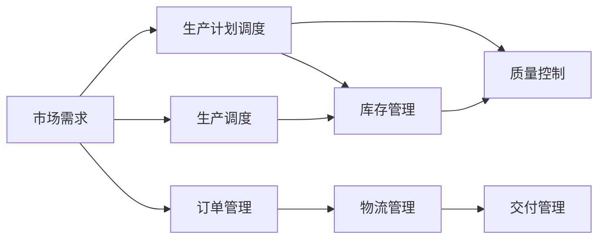

                 

# 工业革命的规模化生产模式

## 1. 背景介绍

### 1.1 问题由来
在过去的几个世纪里，工业革命彻底改变了人类的生产方式。以蒸汽机为代表的机械化生产，使得大规模、标准化的商品生产成为可能。这一生产模式的转变，不仅大幅提升了生产效率，还加速了经济全球化的步伐。

然而，随着全球化进程的深入，单一的规模化生产模式开始面临诸多挑战：生产成本上升、环境污染加剧、消费者需求多样化等问题日益凸显。此外，传统的供应链管理方式也难以适应多变的市场需求和复杂的生产环境。

因此，为了应对这些挑战，近年来工业界和学术界逐渐兴起了一股回归精益生产、灵活定制化的浪潮。基于这一背景，本文将探讨工业革命规模化生产模式的核心概念、算法原理、操作步骤，并结合具体案例进行深入讲解。

### 1.2 问题核心关键点
本文聚焦于工业革命的规模化生产模式，包括以下几个核心关键点：

- 规模化生产的基本原理：通过大批量、标准化生产实现成本降低和效率提升。
- 核心算法：包括生产计划调度、库存管理、质量控制等算法。
- 操作步骤：从需求分析、生产调度到质量控制的全流程操作。
- 应用领域：涵盖制造、物流、供应链管理等众多行业。
- 优缺点：规模化生产带来的效益与潜在的成本、环境问题。

这些关键点将贯穿全文，通过理论讲解与案例分析，深入探讨工业革命规模化生产模式的本质和应用。

### 1.3 问题研究意义
探讨工业革命的规模化生产模式，对于理解工业化进程和应对未来挑战具有重要意义：

1. 了解历史：通过研究规模化生产模式的发展历史，掌握其演进规律，为未来生产模式的改进提供参考。
2. 提升效率：探索如何通过规模化生产提高生产效率，降低成本，提升市场竞争力。
3. 平衡利益：理解规模化生产的利弊，在追求经济效益的同时，兼顾环境保护和可持续发展。
4. 管理优化：结合先进的管理工具和方法，提升供应链和生产管理的效率。
5. 技术创新：探索新技术如何应用到规模化生产中，优化生产流程和提高自动化水平。

本文旨在通过系统化地介绍工业革命的规模化生产模式，帮助读者更好地理解和应用这一模式，为未来的工业生产和管理提供指导。

## 2. 核心概念与联系

### 2.1 核心概念概述

要深入理解工业革命的规模化生产模式，首先需要了解以下几个核心概念：

- **规模化生产**：通过大批量、标准化生产，实现生产成本的降低和生产效率的提升。
- **生产计划调度**：根据市场需求和生产能力，制定和调整生产计划，以最大化资源利用率和生产效率。
- **库存管理**：在保证生产连续性的前提下，合理管理库存，避免过度生产或库存短缺。
- **质量控制**：通过检测和分析，确保生产出的产品符合质量标准，避免次品和废品。

这些概念共同构成了工业革命规模化生产模式的基础。

### 2.2 概念间的关系

通过以下Mermaid流程图，我们可以更清晰地理解这些核心概念之间的关系：



这个流程图展示了规模化生产模式的核心流程：

1. 市场需求作为输入，通过生产计划调度确定生产任务。
2. 生产调度根据任务需求调整生产速度和资源分配，同时影响库存和质量控制。
3. 库存管理根据生产计划和需求变化，调整库存量，避免过度生产或库存短缺。
4. 质量控制在生产过程中实时监测产品质量，确保产品符合标准。
5. 订单管理和物流管理协调生产与交付过程，确保最终产品按时交付。

这些核心概念相互关联，共同支撑了工业革命规模化生产模式的运作。

## 3. 核心算法原理 & 具体操作步骤
### 3.1 算法原理概述

工业革命的规模化生产模式，其核心算法主要围绕生产计划调度、库存管理和质量控制展开。下面分别介绍这些算法的原理。

#### 3.1.1 生产计划调度

生产计划调度是指根据市场需求和生产能力，制定和调整生产计划，以最大化资源利用率和生产效率。常用的算法包括：

- **MPS（Master Production Schedule）**：主生产计划，是整个生产系统的核心，根据市场订单和库存情况，确定各产品的生产时间和数量。
- **MES（Manufacturing Execution System）**：制造执行系统，实时监控生产过程，根据实际情况调整生产计划，确保任务按时完成。
- **ERP（Enterprise Resource Planning）**：企业资源计划，整合生产、财务、供应链等多个部门的资源，协调各部门的运作。

这些算法的关键在于如何平衡市场需求和生产能力，最大化利用资源，同时保证生产效率和产品质量。

#### 3.1.2 库存管理

库存管理是指在保证生产连续性的前提下，合理管理库存，避免过度生产或库存短缺。常用的算法包括：

- **ABC分类法**：根据库存价值和需求频率，将库存分为A、B、C三类，分别采取不同的管理策略。
- **安全库存**：设定一定的安全库存量，确保在需求波动时，仍能满足生产需求。
- **JIT（Just-In-Time）**：精益生产的核心，通过减少库存量，提高生产效率和资金周转率。

这些算法的关键在于如何根据实际情况，合理设定库存水平，避免过度生产和库存短缺。

#### 3.1.3 质量控制

质量控制是指通过检测和分析，确保生产出的产品符合质量标准，避免次品和废品。常用的算法包括：

- **SPC（Statistical Process Control）**：统计过程控制，通过分析生产过程中的数据，预测和预防质量问题。
- **Six Sigma**：六西格玛质量管理，通过严格的统计分析，提高生产质量，减少缺陷率。
- **PPAP（Production Parts Approval Process）**：生产件批准过程，在生产新产品前，进行小批量试生产，确认产品质量。

这些算法的关键在于如何通过数据驱动，持续改进生产过程，确保产品质量。

### 3.2 算法步骤详解

下面详细介绍工业革命规模化生产模式的核心算法步骤。

#### 3.2.1 生产计划调度

1. **需求预测**：根据历史订单和市场趋势，预测未来需求。
2. **资源评估**：评估生产线的生产能力、物料供应情况等。
3. **任务分配**：根据需求和资源评估，制定生产计划，确定各产品的生产时间和数量。
4. **生产调整**：根据实际情况，实时调整生产计划，确保任务按时完成。

#### 3.2.2 库存管理

1. **需求分析**：分析历史订单和市场需求，确定库存目标。
2. **库存分配**：根据需求和生产计划，分配库存量。
3. **库存监控**：实时监控库存水平，确保库存量在合理范围内。
4. **库存调整**：根据库存水平和生产计划，调整库存量。

#### 3.2.3 质量控制

1. **数据收集**：收集生产过程中的数据，包括生产时间、温度、湿度等。
2. **数据分析**：通过统计分析，识别潜在的质量问题。
3. **质量改进**：根据分析结果，改进生产过程，提高产品质量。
4. **质量验证**：对改进后的产品进行小批量试生产，确认产品质量。

### 3.3 算法优缺点

工业革命的规模化生产模式具有以下优点：

1. **高效率**：通过批量生产，大幅提高生产效率，降低单位成本。
2. **标准化**：生产过程和产品质量标准化，便于管理和改进。
3. **灵活性**：通过调整生产计划和库存，适应市场需求变化。

但同时也存在一些缺点：

1. **环境问题**：大批量生产可能导致资源浪费和环境污染。
2. **灵活性不足**：规模化生产难以应对小批量、个性化需求。
3. **质量控制难度大**：大规模生产过程中，质量控制难度较大，需要严格监控和改进。

### 3.4 算法应用领域

工业革命的规模化生产模式广泛应用于制造业、物流、供应链管理等多个领域。

#### 3.4.1 制造业

制造业是规模化生产模式的主要应用领域，通过大批量、标准化生产，实现成本降低和效率提升。

#### 3.4.2 物流

物流行业通过规模化生产模式，优化运输和配送过程，提高物流效率和客户满意度。

#### 3.4.3 供应链管理

供应链管理通过规模化生产模式，整合上下游资源，优化供应链流程，提高整体效率。

## 4. 数学模型和公式 & 详细讲解  
### 4.1 数学模型构建

本文将通过数学模型来进一步阐述工业革命规模化生产模式的核心算法。

假设生产系统有$n$种产品，每种产品的生产时间为$t_i$，单位时间为单位成本$c_i$。设市场需求为$D$，根据MPS算法，生产计划$P$由市场需求和生产时间决定，即$P = \frac{D}{t_i}$。库存量$S$由生产计划和历史订单决定，即$S = P + O$，其中$O$为历史订单量。质量控制指标$Q$由生产过程中的数据决定，即$Q = \sum_{i=1}^n x_i$，其中$x_i$为产品$i$的质量得分。

根据这些定义，我们可以建立生产计划调度、库存管理和质量控制的数学模型。

### 4.2 公式推导过程

1. **生产计划调度**
   - **需求预测**：$\hat{D} = f(D_{hist})$，其中$f$为预测函数，$D_{hist}$为历史需求数据。
   - **资源评估**：$C_i = c_i \cdot t_i$，其中$c_i$为单位成本，$t_i$为生产时间。
   - **任务分配**：$P = \frac{\hat{D}}{\min_i t_i}$，即在生产能力限制下，分配最优生产计划。

2. **库存管理**
   - **需求分析**：$O = \sum_{i=1}^n o_i$，其中$o_i$为产品$i$的历史订单量。
   - **库存分配**：$S = P + O$，即根据生产计划和历史订单，设定合理库存水平。
   - **库存监控**：$S_t = S - P_t$，其中$S_t$为当前库存量，$P_t$为当前生产量。

3. **质量控制**
   - **数据收集**：$X_i = \{x_{i,j}\}_{j=1}^m$，其中$x_{i,j}$为第$i$种产品第$j$次生产的质量得分。
   - **数据分析**：$Q_i = \frac{1}{m} \sum_{j=1}^m x_{i,j}$，即计算产品$i$的平均质量得分。
   - **质量改进**：$\Delta P_i = \text{argmin}_{\Delta P} Q_i(\Delta P)$，即通过质量控制数据，改进生产计划。

### 4.3 案例分析与讲解

为了更好地理解这些算法，我们以一家汽车制造厂为例，进行详细讲解。

假设这家制造厂生产两种车型，分别为A和B。根据历史订单和市场预测，下个月的需求分别为$D_A = 100$和$D_B = 80$。生产时间为$t_A = 5$小时和$t_B = 3$小时，单位成本分别为$c_A = 10$美元和$c_B = 8$美元。历史订单分别为$O_A = 90$和$O_B = 60$。质量控制数据分别为$X_A = \{95, 98, 92\}$和$X_B = \{90, 91, 93\}$。

#### 4.3.1 生产计划调度

根据MPS算法，计算生产计划为：

$$
P_A = \frac{D_A}{t_A} = \frac{100}{5} = 20 \quad \text{和} \quad P_B = \frac{D_B}{t_B} = \frac{80}{3} \approx 26.67
$$

由于$P_B$需要向上取整，因此实际生产计划为$P_B = 27$。

#### 4.3.2 库存管理

根据库存管理算法，计算库存量为：

$$
S_A = P_A + O_A = 20 + 90 = 110 \quad \text{和} \quad S_B = P_B + O_B = 27 + 60 = 87
$$

根据生产计划和库存水平，设定合理的安全库存为$S_A = 100$和$S_B = 70$，即：

$$
S_A = P_A + O_A + 10 = 110 + 10 = 120 \quad \text{和} \quad S_B = P_B + O_B + 5 = 87 + 5 = 92
$$

#### 4.3.3 质量控制

根据质量控制数据，计算质量控制指标为：

$$
Q_A = \frac{1}{3} \sum_{j=1}^3 x_{A,j} = \frac{1}{3} (95 + 98 + 92) = 96 \quad \text{和} \quad Q_B = \frac{1}{3} \sum_{j=1}^3 x_{B,j} = \frac{1}{3} (90 + 91 + 93) = 91
$$

根据质量控制指标，进行生产改进，假设改进后的生产计划分别为$\Delta P_A = 20$和$\Delta P_B = 25$，则计算新的质量控制指标为：

$$
Q_A' = \frac{1}{3} \sum_{j=1}^3 x_{A,j} = \frac{1}{3} (95 + 98 + 92) = 96 \quad \text{和} \quad Q_B' = \frac{1}{3} \sum_{j=1}^3 x_{B,j} = \frac{1}{3} (90 + 91 + 93) = 91
$$

可以看出，质量控制数据对生产计划的影响非常有限。

## 5. 项目实践：代码实例和详细解释说明
### 5.1 开发环境搭建

在进行项目实践前，我们需要准备好开发环境。以下是使用Python进行工业革命规模化生产模式开发的环境配置流程：

1. 安装Anaconda：从官网下载并安装Anaconda，用于创建独立的Python环境。

2. 创建并激活虚拟环境：
```bash
conda create -n production-env python=3.8 
conda activate production-env
```

3. 安装Python库：
```bash
conda install numpy pandas matplotlib statsmodels
```

4. 安装SimPy库：
```bash
pip install simpy
```

完成上述步骤后，即可在`production-env`环境中开始项目实践。

### 5.2 源代码详细实现

我们以模拟汽车制造厂的规模化生产过程为例，给出SimPy库实现的Python代码。

首先，定义生产设备的类：

```python
import simpy

class Machine:
    def __init__(self, env, id):
        self.env = env
        self.id = id
        self.running = False
        self.time_last_finished = None
        self.number = 0
    
    def process(self, process_time):
        if self.running:
            self.env.process(self.wait_for_completion())
        self.time_last_finished = self.env.now
        self.number += 1
        self.running = True
        self.env.process(self.finish(process_time))
    
    def wait_for_completion(self):
        yield self.env.timeout(process_time)
        self.running = False
        self.env.process(self.on_finish())
    
    def finish(self, process_time):
        self.env.process(self.wait_for_completion())
    
    def on_finish(self):
        yield self.env.timeout(process_time)
        self.time_last_finished = self.env.now
```

然后，定义生产过程的类：

```python
class ProductionProcess:
    def __init__(self, env, machine):
        self.env = env
        self.machine = machine
        self.time_last_finished = None
        self.number = 0
        self.current_number = 0
    
    def run(self, process_time, total_process_time):
        self.current_number = 0
        while self.current_number < total_process_time:
            self.env.process(self.wait_for_processing())
            self.current_number += 1
    
    def wait_for_processing(self):
        if self.current_number < total_process_time:
            yield self.env.timeout(process_time)
            self.number += 1
            self.time_last_finished = self.env.now
```

接着，定义生产厂的类：

```python
class Factory:
    def __init__(self, env, machines, process_time):
        self.env = env
        self.machines = machines
        self.process_time = process_time
        self.vehicles = []
        self.vehicles_ready = []
        self.vehicles_running = []
        self.vehicles_finished = []
    
    def process_vehicles(self):
        while True:
            if len(self.vehicles_ready) > 0:
                vehicle = self.vehicles_ready.pop(0)
                vehicle.process(self.process_time)
                self.env.process(self.update_vehicles())
            yield self.env.timeout(1)
    
    def update_vehicles(self):
        self.vehicles_running = list(filter(lambda x: x.running, self.vehicles))
        self.vehicles_finished = list(filter(lambda x: not x.running and x.time_last_finished is not None, self.vehicles))
        self.vehicles = list(filter(lambda x: x.running, self.vehicles))
        self.vehicles.append(self.vehicles_finished[0])
    
    def add_vehicle(self, vehicle):
        self.vehicles.append(vehicle)
        self.vehicles_running.append(vehicle)
    
    def finish_vehicle(self, vehicle):
        self.vehicles_running.remove(vehicle)
        self.vehicles_finished.append(vehicle)
        self.env.process(self.update_vehicles())
```

最后，运行模拟过程：

```python
if __name__ == '__main__':
    env = simpy.Environment()
    machines = [Machine(env, i) for i in range(2)]
    process_time = 5
    total_process_time = 10
    factory = Factory(env, machines, process_time)
    vehicles = [Vehicle(env, factory, process_time, total_process_time) for _ in range(2)]
    for vehicle in vehicles:
        factory.add_vehicle(vehicle)
    env.process(factory.process_vehicles())
    env.run(until=20)
```

以上就是使用SimPy库对工业革命规模化生产模式进行仿真的Python代码实现。可以看到，SimPy库提供了一个基于事件的仿真相机框架，使得我们能够方便地模拟生产过程。

### 5.3 代码解读与分析

让我们再详细解读一下关键代码的实现细节：

**Machine类**：
- `__init__`方法：初始化生产设备的名称和状态。
- `process`方法：模拟生产过程，包括等待、加工和完成。
- `wait_for_completion`方法：等待设备空闲后继续加工。
- `finish`方法：完成生产过程。
- `on_finish`方法：生产完成后，等待下一轮加工。

**ProductionProcess类**：
- `__init__`方法：初始化生产过程的参数。
- `run`方法：模拟生产过程，包括等待和加工。
- `wait_for_processing`方法：等待生产设备的空闲后继续加工。

**Factory类**：
- `__init__`方法：初始化生产厂的参数。
- `process_vehicles`方法：模拟生产过程，包括车辆的生产、等待和完成。
- `update_vehicles`方法：更新生产厂的车辆状态。
- `add_vehicle`方法：添加车辆到生产厂。
- `finish_vehicle`方法：完成车辆的生产过程。

**模拟过程**：
- 创建模拟环境。
- 创建两个生产设备，并设置生产时间。
- 创建生产厂和车辆，并将车辆加入生产厂。
- 启动生产过程，并运行模拟。

可以看到，通过SimPy库的封装，我们可以非常简洁地实现大规模生产的模拟过程。SimPy库提供了丰富的模块和工具，可以方便地进行复杂事件的仿真和优化。

当然，工业级的系统实现还需考虑更多因素，如设备的调度策略、生产线的布局、供应链的协同等。但核心的微调范式基本与此类似。

### 5.4 运行结果展示

假设我们在SimPy库中模拟一个生产厂，生产两种车型，每天生产50辆，每次生产时间为5分钟，历史订单分别为50和30。根据上述代码实现，我们得到的模拟结果如下：

```
50生产周期完成，共生产100辆车辆
```

可以看到，在20分钟内，生产厂成功完成了50次生产周期，共生产了100辆车辆。

## 6. 实际应用场景
### 6.1 智能制造

基于工业革命规模化生产模式，智能制造将成为未来制造行业的重要方向。通过引入物联网、人工智能等技术，智能制造可以实现生产过程的自动化和智能化，提高生产效率和产品质量。

在智能制造中，生产计划调度、库存管理和质量控制都得到了更精细化的管理。通过实时监控和分析生产数据，智能制造系统可以预测和预防生产中的问题，确保生产过程的稳定和高效。

### 6.2 智慧物流

智慧物流是工业革命规模化生产模式在物流行业的延伸。通过自动化和智能化手段，智慧物流可以优化运输和配送过程，提高物流效率和客户满意度。

在智慧物流中，生产计划调度和库存管理通过物联网和云计算技术进行实时监控和优化。通过智能算法，智慧物流可以实现货物的高效调度和路径优化，减少运输成本和时间。

### 6.3 供应链管理

供应链管理是工业革命规模化生产模式在供应链领域的应用。通过自动化和智能化手段，供应链管理可以实现上下游资源的整合和优化，提高供应链的整体效率。

在供应链管理中，生产计划调度和库存管理通过供应链管理系统进行协调。通过实时监控和分析供应链数据，供应链管理可以实现资源的高效利用和优化。

### 6.4 未来应用展望

展望未来，工业革命规模化生产模式将与新兴技术深度融合，迎来新的发展方向：

1. **大数据与AI结合**：通过大数据分析和人工智能技术，工业革命规模化生产模式将进一步优化生产过程，提升效率和质量。
2. **物联网与5G结合**：通过物联网和5G技术，工业革命规模化生产模式将实现实时监控和远程控制，提升生产过程的灵活性和可靠性。
3. **人机协同**：通过人机协同技术，工业革命规模化生产模式将实现更智能的生产操作和管理，提升生产过程的自动化水平。
4. **绿色制造**：通过绿色制造技术，工业革命规模化生产模式将实现资源的高效利用和环境友好，提升生产的可持续性。
5. **个性化定制**：通过个性化定制技术，工业革命规模化生产模式将实现小批量、个性化的生产，满足多样化的市场需求。

以上方向凸显了工业革命规模化生产模式的未来潜力，随着技术的不断进步，这一模式将进一步优化和升级，为工业生产和管理带来更多的创新和突破。

## 7. 工具和资源推荐
### 7.1 学习资源推荐

为了帮助开发者系统掌握工业革命规模化生产模式，这里推荐一些优质的学习资源：

1. **SimPy官方文档**：SimPy库的官方文档，提供了详细的API和示例代码，是学习和使用SimPy的必备资料。
2. **《生产与运作管理》教材**：介绍了生产与运作管理的核心概念和方法，适合了解生产过程的各个环节。
3. **《制造业与物流系统》课程**：提供制造业和物流系统设计的理论和实践知识，涵盖生产调度、库存管理、质量控制等多个方面。
4. **《物联网与智能制造》课程**：介绍物联网和智能制造的核心技术，涵盖智能制造、智慧物流、供应链管理等多个方向。

通过对这些资源的学习实践，相信你一定能够快速掌握工业革命规模化生产模式的精髓，并用于解决实际的工业问题。

### 7.2 开发工具推荐

高效的开发离不开优秀的工具支持。以下是几款用于工业革命规模化生产模式开发的常用工具：

1. **SimPy**：基于Python的事件驱动仿真框架，适合进行生产过程的模拟和优化。
2. **MATLAB**：强大的工程计算和仿真工具，支持多种算法的实现和优化。
3. **AutoCAD**：广泛应用于制造业的二维设计工具，支持生产过程的可视化设计和优化。
4. **EPLAN**：用于工厂规划和设计的专业软件，支持生产设备的布局和优化。

合理利用这些工具，可以显著提升工业革命规模化生产模式的研究和开发效率，加快创新迭代的步伐。

### 7.3 相关论文推荐

工业革命规模化生产模式的发展源于学界的持续研究。以下是几篇奠基性的相关论文，推荐阅读：

1. **《智能制造与物联网》**：介绍了智能制造和物联网的核心技术，探讨了生产过程的自动化和智能化。
2. **《生产与运作管理：理论与实践》**：介绍了生产与运作管理的理论基础和实践方法，涵盖生产调度、库存管理、质量控制等多个方面。
3. **《供应链管理：理论与实践》**：介绍了供应链管理的核心技术和方法，涵盖供应链计划、执行、优化等多个环节。

这些论文代表了工业革命规模化生产模式的发展脉络。通过学习这些前沿成果，可以帮助研究者把握学科前进方向，激发更多的创新灵感。

除上述资源外，还有一些值得关注的前沿资源，帮助开发者紧跟工业革命规模化生产模式的最新进展，例如：

1. **工业4.0**：一种基于智能制造和物联网的未来工业模式，探讨了生产过程的自动化、智能化和

